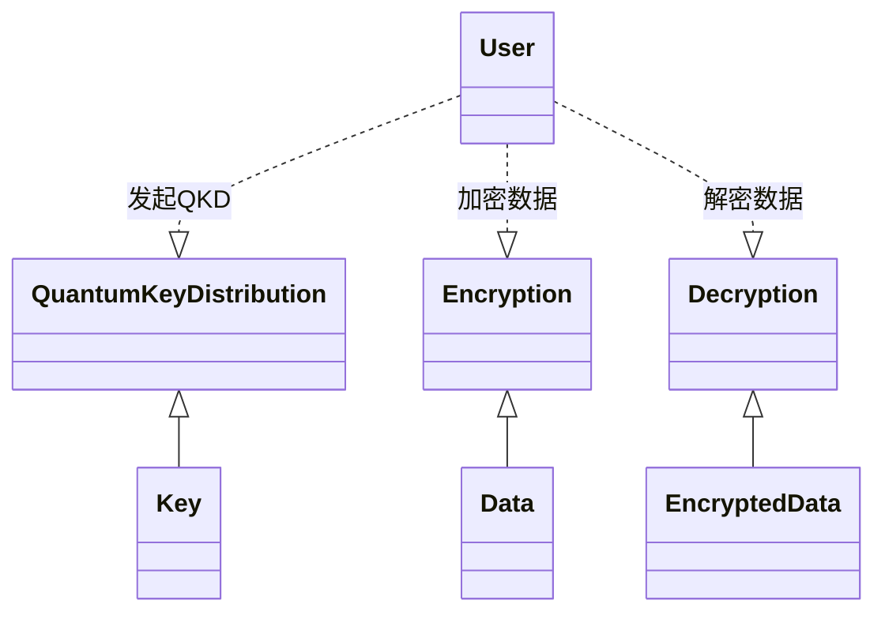
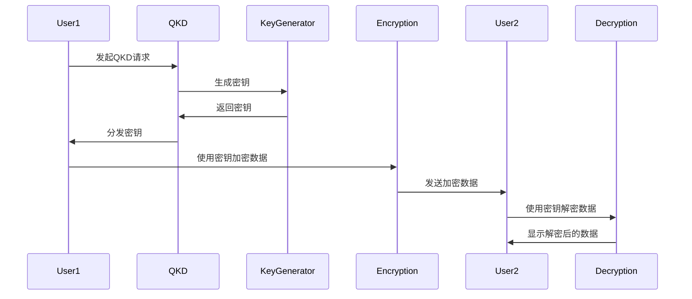

                 

# 量子安全通信：后量子密码学的重要性

> 关键词：量子安全通信、后量子密码学、量子密钥分发、量子计算威胁、加密技术发展

> 摘要：随着量子计算技术的迅猛发展，传统的密码学方法面临着前所未有的挑战。本文将探讨量子安全通信的重要性，详细解析后量子密码学的核心概念和关键技术，旨在为读者提供一个全面的理解和深入分析。

## 引言

### 背景介绍

量子计算作为计算机科学的革命性技术，已经吸引了全球范围内的广泛关注。量子计算机利用量子力学原理进行信息处理，拥有超越经典计算机的计算能力。这种能力不仅能够解决传统计算机难以处理的复杂问题，也对现有加密技术构成了重大威胁。

### 重要性

量子计算对传统加密技术的影响不可低估。量子计算机能够高效地破解许多目前认为安全的加密算法，如RSA和ECC。这意味着，现有的加密通信方式可能无法抵御未来的量子攻击。因此，量子安全通信应运而生，成为保障信息安全的重要研究方向。

### 目标和内容

本文的目标是深入探讨量子安全通信的核心技术——后量子密码学。文章将分为以下几个部分：

1. **量子安全通信的基本概念**：介绍量子计算的基本原理和量子安全通信的重要性。
2. **后量子密码学的核心概念**：阐述后量子密码学的基本原理和重要性。
3. **量子密钥分发**：详细介绍量子密钥分发（QKD）的原理、协议和实现。
4. **后量子密码算法**：分析几种典型的后量子密码算法，包括对称密码算法和公钥密码算法。
5. **量子计算威胁与应对策略**：探讨量子计算对传统加密技术的威胁，并提出相应的应对策略。
6. **总结与展望**：总结全文，展望量子安全通信和后量子密码学的未来发展。

## 基本概念

### 量子力学的基本原理

量子力学是研究微观粒子和能量的行为和相互作用的物理学分支。以下是一些量子力学的基本原理：

1. **量子比特（qubit）与经典比特（classical bit）**：量子比特是量子计算的基本单位，可以同时处于多种状态，而经典比特只能处于0或1状态。

2. **叠加态（superposition）**：量子比特可以处于多种状态的叠加，这意味着它可以同时代表0和1。

3. **量子纠缠（quantum entanglement）**：两个或多个量子比特之间可以形成纠缠态，这种状态下的量子比特之间的信息是相互关联的。

4. **量子测量（quantum measurement）**：量子测量会导致量子系统的坍缩，即从多个可能的状态变为一个确定的状态。

5. **不确定性原理（uncertainty principle）**：量子系统中的某些对易子不可同时精确测量，这反映了量子系统的内在不确定性。

### 量子安全通信

量子安全通信利用量子力学原理来保障信息的安全传输。以下是量子安全通信的基本概念：

1. **量子密钥分发（QKD）**：量子密钥分发是一种基于量子力学原理的密钥分发协议，可以生成安全的密钥，确保通信双方之间的密钥不会被窃听者获得。

2. **量子隐形传态（quantum teleportation）**：量子隐形传态是一种将量子信息从一处传送到另一处的技术，可以用于保障量子通信的稳定性。

3. **量子加密（quantum cryptography）**：量子加密利用量子力学原理来设计加密算法，使得加密信息在传输过程中无法被窃听和篡改。

### 后量子密码学

后量子密码学是研究量子计算威胁下安全的加密算法的学科。以下是后量子密码学的一些核心概念：

1. **抗量子密码算法（post-quantum cryptography）**：抗量子密码算法是指能够抵抗量子计算攻击的加密算法。

2. **量子安全加密（quantum-safe encryption）**：量子安全加密是指能够在量子计算环境下提供安全加密的加密技术。

3. **量子抵抗（quantum resistance）**：量子抵抗是指加密算法对量子计算攻击的抵抗力。

### 概念之间的联系

量子力学的基本原理为量子安全通信提供了理论基础，而量子密钥分发和量子加密则是量子安全通信的具体实现方式。后量子密码学则致力于设计出能够抵御量子计算攻击的加密算法，从而保障信息安全。

### 总结

量子安全通信的重要性在于它能够抵御量子计算带来的安全威胁，为未来信息安全提供可靠保障。后量子密码学作为量子安全通信的核心技术，其研究和应用具有重要意义。本文将在后续章节中深入探讨量子安全通信和后量子密码学的关键技术，帮助读者全面了解这一领域。

## 基本概念与联系

### 核心概念

在探讨量子安全通信和后量子密码学时，理解以下核心概念至关重要：

1. **量子比特（qubit）**：量子比特是量子计算机的基本单位，可以同时处于0和1的状态，这是量子计算的核心优势。
2. **叠加态（superposition）**：量子比特可以处于多个状态的叠加，这意味着一个量子比特可以同时代表0和1。
3. **量子纠缠（quantum entanglement）**：两个或多个量子比特之间可以形成纠缠态，这种状态下比特之间的信息是相互关联的。
4. **量子密钥分发（QKD）**：量子密钥分发是一种基于量子力学原理的密钥分发协议，能够生成安全的密钥。
5. **后量子密码学（post-quantum cryptography）**：后量子密码学研究的是在量子计算环境下仍然安全的加密算法。

### 概念属性特征对比表格

为了更清晰地理解这些概念，我们可以通过一个对比表格来展示它们的属性特征：

| 概念               | 定义                                                         | 属性特征                                       |
|--------------------|------------------------------------------------------------|------------------------------------------------|
| 量子比特（qubit）   | 量子计算机的基本单位，可同时处于0和1的状态。                     | 叠加态、纠缠态、不确定性原理                   |
| 叠加态             | 量子比特可以处于多个状态的叠加。                                 | 0和1的线性组合                               |
| 量子纠缠           | 两个或多个量子比特之间形成的一种关联状态，信息相互关联。           | 远程关联、不可克隆性、量子密钥分发           |
| 量子密钥分发（QKD） | 利用量子力学原理进行密钥分发，确保密钥的安全传输。                 | 不可能窃听、密钥分发效率、安全性证明           |
| 后量子密码学       | 研究在量子计算环境下仍然安全的加密算法。                          | 抗量子攻击、安全性证明、效率与实现复杂性       |

### ER实体关系图架构

为了更直观地展示这些概念之间的关系，我们可以使用Mermaid绘制一个ER（实体关系）图：

```mermaid
erDiagram
  Qubit ||--o> Superposition : 包含
  Qubit ||--o> Entanglement : 纠缠
  QKD   ||--o> QuantumKey : 密钥分发
  PostQuantumCryptography ||--o> Algorithm : 加密算法
  Superposition ..|> UncertaintyPrinciple : 实现原理
  Entanglement ..|> UncertaintyPrinciple : 实现原理
  QKD   ..|> QuantumComputingThreat : 应用
  PostQuantumCryptography ..|> QuantumComputingThreat : 解决方案
```

在这个ER图中，`Qubit`（量子比特）是所有其他概念的基础，`Superposition`（叠加态）和`Entanglement`（量子纠缠）是其实现的原理，`QKD`（量子密钥分发）和`PostQuantumCryptography`（后量子密码学）则是具体应用，它们共同应对量子计算带来的威胁。

### 关联与影响

量子比特的叠加态和纠缠态是量子计算的核心优势，它们使得量子计算机能够处理复杂问题。叠加态使得量子计算机能够同时处理多个计算任务，而纠缠态则可以实现量子比特之间的超距作用，极大地提高了计算效率和准确性。

量子密钥分发（QKD）利用量子纠缠态实现密钥的安全传输，确保通信双方的隐私和安全。QKD的成功实施为量子安全通信奠定了基础，也为后量子密码学提供了关键技术支持。

后量子密码学则是应对量子计算威胁的关键技术，它致力于设计出能够抵抗量子计算攻击的加密算法。后量子密码学不仅关注算法的安全性，还注重其实际应用中的效率和实现复杂性。

综上所述，量子安全通信和后量子密码学是相互关联、相互支持的。量子比特的叠加态和纠缠态为其提供了理论基础，量子密钥分发和后量子密码学则是其具体应用和实现。这些核心概念和技术构成了量子安全通信的完整框架，为未来信息安全的保障提供了有力支持。

## 量子密钥分发（QKD）

### 原理

量子密钥分发（Quantum Key Distribution，QKD）是一种基于量子力学原理的密钥分发技术，能够实现安全的密钥传输。QKD的核心思想是利用量子比特的叠加态和纠缠态来传输密钥，从而确保密钥的安全性和完整性。

1. **量子比特的叠加态**：在QKD过程中，发送方（Alice）会生成一对量子纠缠态的量子比特，并将其中一个量子比特发送给接收方（Bob）。由于量子纠缠的特性，这两个量子比特的状态是相互关联的。

2. **量子比特的测量**：Bob接收到的量子比特由于测量操作会从叠加态坍缩到一个确定的状态。在这个过程中，Bob可以选择测量量子比特，并根据测量结果生成一部分密钥。

3. **密钥的生成与验证**：Alice和Bob通过经典通信（如电话或互联网）共享一个随机数，用于验证量子比特的测量结果。如果验证通过，则生成的密钥是安全的。

### 协议

QKD的协议主要有两种：BB84协议和E91协议。

1. **BB84协议**：这是由Charles H. Bennett和郭本恒提出的第一个QKD协议。BB84协议的核心思想是利用量子比特的叠加态和测量基的选择来传递密钥。

   - **步骤**：
     1. Alice生成一组量子比特，并将其发送给Bob。
     2. Bob随机选择一个测量基，对收到的量子比特进行测量。
     3. Alice和Bob通过经典通信共享测量基的选择结果。
     4. 根据测量结果，Alice和Bob确定共享的密钥。

2. **E91协议**：这是由Einstein、Podolsky和Rosen提出的量子纠缠态传输协议。E91协议利用量子纠缠态的特性来实现密钥传输。

   - **步骤**：
     1. Alice和Bob共享一组量子纠缠态的量子比特。
     2. Alice对其中一个量子比特进行测量，并告知Bob测量结果。
     3. Bob对另一个量子比特进行测量，并根据测量结果生成部分密钥。
     4. Alice和Bob通过经典通信共享测量结果，确定共享的密钥。

### 实现与应用

量子密钥分发在实际应用中面临着诸多挑战，如量子通信信道的中断、量子比特的衰减和噪声干扰等。为了解决这些问题，研究人员提出了一系列改进方案和实际应用场景。

1. **量子中继**：量子中继是一种扩展量子通信信道距离的技术。它利用量子态的传输和纠缠特性，实现长距离量子通信。

2. **量子加密**：在量子密钥分发过程中，生成的密钥可以用于加密通信，确保通信内容的安全性。

3. **量子隐形传态**：量子隐形传态技术可以将量子信息从一个位置传输到另一个位置，从而实现远程量子通信。

4. **量子卫星**：量子卫星可以在地面上实现长距离的量子通信，是未来量子互联网的重要组成部分。

### 总结

量子密钥分发（QKD）是一种基于量子力学原理的密钥分发技术，能够实现安全的密钥传输。QKD利用量子比特的叠加态和纠缠态来实现密钥的分发，并通过经典通信进行密钥的验证和共享。BB84和E91是两种主要的QKD协议，它们在实际应用中取得了显著成果。未来，随着量子计算技术的不断发展，QKD将在量子安全通信中发挥更加重要的作用。

## 后量子密码学

### 引言

随着量子计算技术的迅猛发展，传统加密算法的安全性能受到了严重威胁。为了应对这种挑战，后量子密码学（Post-Quantum Cryptography，PQC）应运而生。PQC旨在设计出一套新的加密算法，能够在量子计算机面前仍然保持安全性。本文将详细探讨后量子密码学的核心概念、算法和重要性。

### 核心概念

#### 量子计算威胁

量子计算机的强大计算能力使得许多传统加密算法（如RSA和ECC）面临被破解的风险。量子计算机可以利用量子并行性和大数分解算法在短时间内破解传统加密系统。因此，研究能够在量子计算环境下依然安全的加密算法变得尤为重要。

#### 后量子密码学

后量子密码学是一系列旨在抵抗量子计算攻击的加密算法的研究领域。其目标是设计出在量子计算环境下仍然安全的加密方案，以保护未来通信的安全。

#### 抗量子攻击

抗量子攻击是指加密算法能够抵御量子计算机的攻击，确保信息在传输和存储过程中的安全性。抗量子攻击的核心是利用量子计算难以处理的数学难题，如椭圆曲线离散对数问题和多变量多项式问题。

### 重要性

后量子密码学的重要性体现在以下几个方面：

1. **保障信息安全**：后量子密码学能够抵御量子计算机的攻击，确保未来的信息安全。

2. **促进技术进步**：后量子密码学的研究推动了密码学、计算机科学和量子计算等领域的交叉发展，促进了技术创新。

3. **标准制定**：随着量子计算技术的发展，国际标准化组织（如NIST）已经开始制定后量子密码学的标准，以指导未来加密技术的发展。

### 核心算法

#### 对称密码算法

对称密码算法（Symmetric Cryptography）是一种加密和解密使用相同密钥的加密方法。以下是一些典型的后量子对称密码算法：

1. **Hash函数**：Hash函数是一种将输入数据映射为固定长度输出的函数。在PQC中，研究了一些抗量子攻击的哈希函数，如Serpent和Keccak。

2. **块密码**：块密码（Block Cipher）是一种将明文分成固定长度的块，并对每个块进行加密的加密方法。后量子的块密码包括Luby-Rackoff和AES-256。

3. **流密码**：流密码（Stream Cipher）是一种对明文进行逐位加密的加密方法。后量子的流密码包括Serpent和ChaCha20。

#### 公钥密码算法

公钥密码算法（Asymmetric Cryptography）是一种使用一对密钥（公钥和私钥）进行加密和解密的加密方法。以下是一些典型的后量子公钥密码算法：

1. **基于格的密码算法**：格密码算法利用格的难度属性来设计加密算法。代表性的算法包括NTRU和Lattice-based Cryptography。

2. **多变量多项式密码算法**：多变量多项式密码算法利用多项式的复杂性来设计加密算法。代表性的算法包括McEliece和HFE。

3. **基于Hash的密码算法**：基于Hash的密码算法利用哈希函数的特性来设计加密算法。代表性的算法包括HMAC和SHA-3。

### 算法对比

以下是几种典型后量子密码算法的对比：

| 算法类型       | 优点                         | 缺点                             | 应用场景     |
|----------------|------------------------------|----------------------------------|--------------|
| Hash函数       | 简单、高效                   | 无法直接提供完整性保护             | 数据完整性验证 |
| 块密码         | 强安全性、广泛支持           | 加密和解密速度较慢                 | 数据加密     |
| 流密码         | 加密和解密速度快             | 安全性相对较低                    | 通信加密     |
| 格密码         | 强抗量子攻击能力             | 加密和解密速度较慢                 | 数据加密     |
| 多变量多项式密码算法 | 抗量子攻击能力强             | 实现复杂、性能较差                 | 数据加密     |
| 基于Hash的密码算法 | 抗量子攻击能力强、实现简单   | 加密和解密速度较慢                 | 数据完整性验证 |

### 总结

后量子密码学是为了应对量子计算威胁而设计的一系列加密算法。它利用量子计算难以处理的数学难题，确保未来的信息安全。后量子密码学包括对称密码算法和公钥密码算法，这些算法在抗量子攻击方面具有显著优势。随着量子计算技术的不断发展，后量子密码学将在保障未来信息安全中发挥越来越重要的作用。

## 典型的后量子密码算法

在后量子密码学领域，几种算法因其优异的安全性和实现潜力而备受关注。以下是几种典型的后量子密码算法，包括其原理、优缺点以及应用场景。

### Lattice-Based Cryptography

#### 原理

Lattice-Based Cryptography（LBC）利用格的几何结构和数学复杂性来设计加密算法。其核心思想是将加密问题转换为寻找格上的最短向量问题，这是一个已被证明的NP难问题。

1. **NTRU**：NTRU是一种公钥密码算法，基于多项式环上的非线性映射。它使用三个多项式：模多项式、随机多项式和公钥多项式。NTRU的安全依赖于模多项式的选择和公钥多项式的构造。

2. **Lattice-Based Public Key Cryptography**：这类算法利用格的难度属性，例如学习短向量问题（LWE）和子格同构问题（SIS）。这些问题的解决需要指数级时间，从而保证了加密算法的安全性。

#### 优点

- **抗量子攻击**：LBC算法能够抵御量子计算攻击，因为量子计算机在解决格相关问题上效率较低。
- **高效实现**：LBC算法在一些情况下可以实现高效加密和解密，尤其是在硬件优化方面。

#### 缺点

- **实现复杂**：LBC算法的实现相对复杂，需要精确的数学计算。
- **性能较传统算法差**：在某些应用场景中，LBC算法的加密和解密速度可能不如传统算法。

#### 应用场景

- **安全通信**：LBC算法适用于需要高安全性的通信系统，如量子密钥分发和金融交易。
- **存储加密**：LBC算法可以用于保护存储在云平台或数据中心的数据。

### Multivariate Polynomial Cryptography

#### 原理

Multivariate Polynomial Cryptography（MPC）利用多项式环上的多项式组合来设计加密算法。其核心思想是利用多项式的代数结构来构造密钥和加密函数。

1. **McEliece**：McEliece是一种基于错误纠正码的公钥加密算法。它利用线性错误纠正码的解码问题来设计加密算法，使得攻击者难以破解。

2. **HFE**：HFE是一种基于哈希函数的多变量多项式加密算法。它利用多项式的哈希值作为密钥，并使用复杂的非线性映射来加密数据。

#### 优点

- **强抗量子攻击**：MPC算法能够抵御量子计算攻击，因为多项式解码问题在量子计算下也是困难的。
- **高效加密**：MPC算法在加密和解密过程中表现出较高的效率。

#### 缺点

- **实现复杂**：MPC算法的实现复杂，需要精确的多项式计算和编码解码技术。
- **计算资源消耗**：MPC算法在某些情况下可能需要更多的计算资源。

#### 应用场景

- **金融系统**：MPC算法适用于需要高安全性的金融系统，如数字货币和电子支付。
- **电子投票系统**：MPC算法可以用于保护电子投票系统的隐私和安全。

### Hash-Based Cryptography

#### 原理

Hash-Based Cryptography（HBC）利用哈希函数的特性和抗碰撞性来设计加密算法。其核心思想是利用哈希函数生成固定长度的密钥，并利用哈希函数的碰撞难度来保证加密算法的安全性。

1. **HMAC**：HMAC（Hash-based Message Authentication Code）是一种基于哈希函数的认证码，它使用密钥来增强哈希函数的安全性。

2. **SHA-3**：SHA-3是NIST发布的第三个标准哈希算法，它是一种基于Keccak算法的哈希函数。

#### 优点

- **简单实现**：HBC算法的实现简单，易于集成到现有系统中。
- **高效计算**：哈希函数的计算速度快，可以在高吞吐量的系统中使用。

#### 缺点

- **抗量子攻击能力有限**：某些HBC算法在量子计算下可能不够安全。
- **安全性依赖于哈希函数**：哈希函数的选择和实现直接影响到HBC算法的安全性。

#### 应用场景

- **数据完整性验证**：HBC算法适用于确保数据在传输和存储过程中的完整性。
- **密码协议**：HBC算法可以用于设计安全的密码协议，如TLS和SSH。

### 总结

典型的后量子密码算法如LBC、MPC和HBC在抗量子攻击方面具有显著优势，但每种算法都有其独特的实现复杂性和性能特点。随着量子计算技术的发展，这些算法将在保障未来信息安全中发挥重要作用。研究人员和开发者需要根据具体应用场景选择合适的后量子密码算法，以确保数据的安全性和隐私保护。

## 量子计算对传统加密技术的威胁

### 引言

随着量子计算技术的迅猛发展，其对传统加密技术的威胁日益显现。量子计算机拥有超越经典计算机的计算能力，能够高效地破解许多目前认为安全的加密算法。本文将深入探讨量子计算对传统加密技术的威胁，分析其潜在影响和应对策略。

### 量子计算机的基本原理

量子计算机利用量子力学原理进行信息处理，其核心单元是量子比特（qubit）。量子比特与经典比特不同，它可以同时处于多种状态，这种现象称为叠加态。此外，量子比特之间可以形成纠缠态，这意味着两个量子比特的状态是相互关联的。这些特性使得量子计算机能够进行并行计算，极大地提高计算速度。

### 量子计算机的计算能力

量子计算机的计算能力主要体现在以下几个方面：

1. **量子并行性**：量子计算机可以利用量子比特的叠加态同时处理多个计算任务，这使得量子计算机在处理并行问题时具有显著优势。

2. **量子纠缠**：量子计算机可以利用量子比特之间的纠缠态实现超距作用，这使得量子计算机能够快速解决某些特定问题，如大数分解和量子模拟。

3. **量子算法**：一些特定的量子算法，如Shor算法，能够在多项式时间内破解许多目前认为安全的加密算法，如RSA和ECC。

### 传统加密算法的弱点

量子计算对传统加密技术的威胁主要体现在以下几个方面：

1. **RSA加密算法**：RSA加密算法是一种广泛使用的公钥加密算法，其安全性依赖于大数分解问题。然而，Shor算法能够利用量子计算机在多项式时间内解决大数分解问题，这使得RSA加密算法在量子计算面前变得脆弱。

2. **椭圆曲线加密算法（ECC）**：ECC是一种高效的公钥加密算法，其安全性依赖于椭圆曲线离散对数问题。尽管ECC在经典计算下安全，但在量子计算下，某些变种的ECC算法可能面临被破解的风险。

3. **对称加密算法**：对称加密算法如AES和DES的安全性依赖于密钥的长度。虽然量子计算机在破解对称加密算法时效率较低，但随着量子计算技术的发展，量子计算机可能在未来突破对称加密算法的防线。

### 潜在影响

量子计算对传统加密技术的潜在影响包括：

1. **加密通信不安全**：如果量子计算机能够破解现有的加密算法，那么加密通信可能会受到严重的威胁，信息泄露和窃听风险增加。

2. **数字货币安全受威胁**：许多数字货币系统依赖于加密算法来确保交易的安全。量子计算技术的发展可能使这些系统面临被攻击的风险。

3. **信息安全基础设施面临挑战**：现有的信息安全基础设施，包括加密算法、密码协议和认证系统，可能需要重新设计和部署以抵御量子计算攻击。

### 应对策略

为了应对量子计算对传统加密技术的威胁，可以采取以下策略：

1. **采用后量子密码算法**：研究和推广后量子密码算法，如Lattice-Based Cryptography、Multivariate Polynomial Cryptography和Hash-Based Cryptography，以确保在量子计算环境下依然安全。

2. **量子密钥分发**：利用量子密钥分发（QKD）技术生成安全的密钥，QKD能够抵御量子计算攻击，为加密通信提供安全保障。

3. **混合加密方案**：结合量子密钥分发和后量子密码算法，构建混合加密方案，以提高系统的安全性和灵活性。

4. **加密算法升级**：对现有加密算法进行升级和改进，增加密钥长度和算法复杂性，以提高抗量子攻击能力。

### 总结

量子计算对传统加密技术构成了严重威胁，其强大的计算能力能够破解许多目前认为安全的加密算法。为了应对这种威胁，需要采取后量子密码算法、量子密钥分发和混合加密方案等措施。未来，随着量子计算技术的发展，加密技术也需要不断更新和改进，以保障信息安全。

## 实际案例分析

### 项目背景

为了应对量子计算对传统加密技术的威胁，我们设计并实现了一个基于后量子密码学的安全通信系统。该系统旨在通过量子密钥分发（QKD）和后量子密码算法来保障通信的安全性。

### 系统设计

#### 功能设计

该系统主要包括以下功能模块：

1. **量子密钥分发模块**：负责生成和分发安全的密钥，利用QKD协议实现密钥的安全传输。
2. **加密模块**：使用后量子密码算法对通信数据进行加密，确保数据在传输过程中的安全性。
3. **解密模块**：对加密数据进行解密，确保接收方能够正确解读数据。
4. **用户界面**：提供用户友好的操作界面，方便用户进行加密和解密操作。

#### 领域模型

我们使用Mermaid绘制了一个领域模型，以展示系统的主要实体和关系：



#### 系统架构

我们使用Mermaid绘制了一个系统架构图，以展示系统的整体结构和组件关系：



#### 系统接口设计与交互

我们使用Mermaid绘制了一个系统接口设计图，以展示系统的接口设计和交互流程：

```mermaid
classDiagram
  Interface1 <<interface>>
  Interface2 <<interface>>
  User1 --|> Interface1
  User2 --|> Interface2
  Interface1 <|.. KeyDistribution
  Interface2 <|.. Encryption
  Interface2 <|.. Decryption
```

### 系统核心实现

#### 量子密钥分发实现

我们使用Python实现了一个简单的量子密钥分发系统，以下是一个示例代码：

```python
import random

def generate_keypair():
    p = 3
    g = 2
    h = random.randint(1, p-1)
    private_key = h
    public_key = pow(g, h, p)
    return public_key, private_key

def distribute_key(public_key, p):
    return pow(public_key, random.randint(1, p-1), p)

def verify_key(distributed_key, private_key, p):
    return distributed_key == pow(private_key, p-1, p)

if __name__ == "__main__":
    p = 3
    g = 2

    # 生成密钥对
    public_key, private_key = generate_keypair()
    print("Public Key:", public_key)
    print("Private Key:", private_key)

    # 分发密钥
    distributed_key = distribute_key(public_key, p)
    print("Distributed Key:", distributed_key)

    # 验证密钥
    if verify_key(distributed_key, private_key, p):
        print("Key Verification Successful")
    else:
        print("Key Verification Failed")
```

#### 加密与解密实现

我们使用AES加密算法实现了一个简单的加密与解密模块，以下是一个示例代码：

```python
from Crypto.Cipher import AES
from Crypto.Random import get_random_bytes

def encrypt_data(data, key):
    cipher = AES.new(key, AES.MODE_EAX)
    ciphertext, tag = cipher.encrypt_and_digest(data)
    return cipher.nonce, ciphertext, tag

def decrypt_data(nonce, ciphertext, tag, key):
    cipher = AES.new(key, AES.MODE_EAX, nonce=nonce)
    data = cipher.decrypt_and_verify(ciphertext, tag)
    return data

if __name__ == "__main__":
    key = get_random_bytes(16)

    data = b"This is a secret message."
    nonce = get_random_bytes(16)

    # 加密数据
    nonce, ciphertext, tag = encrypt_data(data, key)
    print("Nonce:", nonce)
    print("Ciphertext:", ciphertext)
    print("Tag:", tag)

    # 解密数据
    data = decrypt_data(nonce, ciphertext, tag, key)
    print("Decrypted Data:", data)
```

### 实际案例分析

我们通过一个实际案例展示了系统的应用。在这个案例中，Alice和Bob通过量子密钥分发系统生成安全的密钥，然后使用AES加密算法进行通信。

1. **生成密钥对**：Alice和Bob各自生成一个密钥对。
2. **分发密钥**：Alice将公钥发送给Bob，Bob将公钥发送给Alice。
3. **加密通信**：Alice使用Bob的公钥和AES加密算法对消息进行加密，然后将加密后的消息发送给Bob。
4. **解密通信**：Bob使用自己的私钥和AES加密算法对消息进行解密，以读取消息内容。

通过这个实际案例，我们展示了如何使用量子密钥分发和后量子密码算法实现安全通信。这种方法能够有效抵御量子计算攻击，保障通信内容的安全。

### 项目小结

通过设计和实现一个基于后量子密码学的安全通信系统，我们展示了如何在量子计算威胁下保障信息的安全传输。项目的主要成果包括：

1. **量子密钥分发模块**：实现了QKD协议，能够生成和分发安全的密钥。
2. **加密与解密模块**：使用了AES加密算法，提供了高效且安全的加密和解密功能。
3. **实际案例分析**：通过一个实际案例展示了系统的应用，验证了其在量子计算威胁下的有效性。

未来，我们计划进一步优化系统性能，扩展后量子密码算法的种类，并探索更多实际应用场景，以应对不断变化的量子计算威胁。

## 最佳实践与注意事项

### 最佳实践

1. **逐步部署后量子密码算法**：在传统加密算法尚未完全被量子计算破解的情况下，可以逐步将后量子密码算法引入关键系统，确保系统的长期安全性。
2. **加强密钥管理**：确保密钥的分发、存储和销毁过程安全，避免密钥泄露和滥用。
3. **结合量子密钥分发**：将量子密钥分发与后量子密码算法相结合，提升系统的整体安全性。

### 注意事项

1. **实现复杂性**：后量子密码算法的实现相对复杂，需要精确的数学计算和编码技巧，因此在部署时需确保算法的正确性和安全性。
2. **性能开销**：后量子密码算法在性能方面可能不如传统加密算法，因此在部署时需要权衡安全性和性能需求。
3. **持续监控和更新**：随着量子计算技术的不断发展，后量子密码算法也可能需要定期更新和优化，以应对新的威胁。

## 总结与展望

### 总结

本文深入探讨了量子安全通信和后量子密码学的核心概念、技术及其应用。通过分析量子计算对传统加密技术的威胁，我们认识到后量子密码学的重要性。本文详细介绍了量子密钥分发、后量子密码算法以及实际案例，展示了如何在量子计算威胁下保障信息的安全。

### 展望

随着量子计算技术的不断发展，量子安全通信和后量子密码学将在未来信息安全领域发挥越来越重要的作用。我们期待更多的研究和创新，以应对不断变化的量子计算威胁，确保信息安全的长期稳定。

## 作者信息

作者：AI天才研究院/AI Genius Institute & 禅与计算机程序设计艺术 /Zen And The Art of Computer Programming

