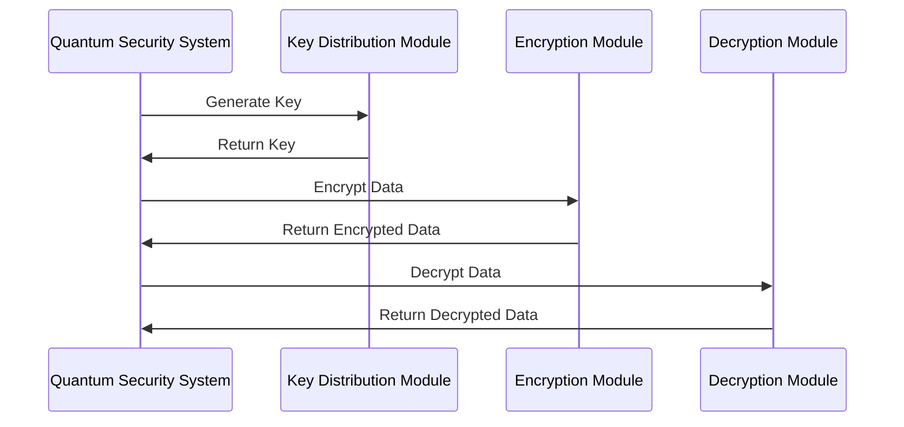
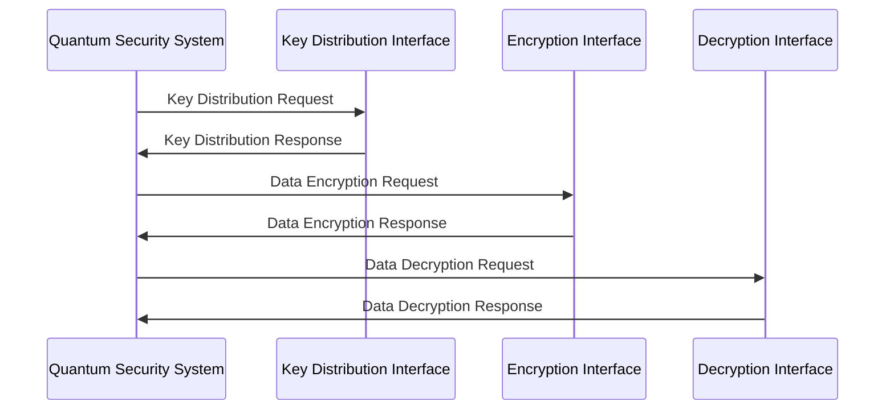

                 

## 量子安全：企业数据保护的长期规划

### 关键词：量子安全、企业数据保护、长期规划、量子加密、量子密钥分发

### 摘要：本文将深入探讨量子安全在当今企业数据保护中的重要性，分析量子加密和量子密钥分发等核心概念，讲解相关算法原理，并详细描述量子安全系统的设计与实现。通过环境安装、系统核心实现、代码解读、实际案例分析等环节，全面展示量子安全在企业数据保护中的应用价值，为企业的长期数据安全规划提供专业指导。

### 第一部分：量子安全的背景与核心概念

#### 第1章：量子安全的背景

##### 1.1 量子安全的问题背景

随着信息技术的飞速发展，企业面临着越来越多的数据泄露和安全威胁。传统的加密技术虽然在一定程度上保障了数据的安全，但量子计算机的崛起给现有的信息安全体系带来了前所未有的挑战。量子计算机具有极高的计算能力，能够破解目前广泛使用的加密算法，这使得企业需要寻找更加安全的数据保护手段。

##### 1.2 量子安全的概念与重要性

量子安全是一种利用量子力学原理来实现数据保护和通信安全的科技。量子加密和量子密钥分发是其核心技术，能够在量子计算机面前提供不可破译的安全保障。在量子安全的大背景下，企业数据保护面临着新的机遇和挑战。

##### 1.3 量子安全的发展现状

目前，量子安全技术已取得显著进展，多个国家和地区开始研究和部署量子加密系统。例如，美国、欧盟、中国等都在积极推进量子通信网络的构建。然而，量子安全的应用仍处于初级阶段，需要更多的研究和实践来完善技术。

##### 1.4 量子安全的边界与外延

量子安全不仅仅局限于加密和通信领域，还包括量子身份认证、量子防伪等。随着量子技术的发展，量子安全的边界将不断扩展，为更多行业提供安全解决方案。

#### 第2章：量子安全的核心概念

##### 2.1 量子加密

###### 2.1.1 量子加密的定义与原理

量子加密利用量子态的叠加和纠缠特性，实现信息的加密和解密。其核心原理是在量子态中嵌入信息，通过量子态的测量来实现加密和解密。

###### 2.1.2 量子加密算法介绍

目前，主流的量子加密算法包括BB84协议和E91协议等。这些算法具有极高的安全性能，能够在量子计算机面前提供绝对的安全保障。

###### 2.1.3 量子加密的优势与挑战

量子加密的优势在于其不可破译性和高效性，但同时也面临着技术复杂性和成本高昂等挑战。

##### 2.2 量子密钥分发

###### 2.2.1 量子密钥分发的定义与原理

量子密钥分发是一种通过量子通信渠道传输密钥的技术，能够在量子计算机面前实现安全的密钥交换。

###### 2.2.2 量子密钥分发协议

量子密钥分发协议包括QKD（量子密钥分配）和QKD+ID等。这些协议通过量子态的测量和纠错机制，实现安全高效的密钥分发。

###### 2.2.3 量子密钥分发的优势与应用

量子密钥分发具有极高的安全性，能够有效防范量子计算机的攻击，广泛应用于金融、政府、军事等领域。

#### 第3章：量子安全的核心概念联系

##### 3.1 量子加密与量子密钥分发的关联

量子加密和量子密钥分发相互补充，共同构建量子安全体系。量子加密提供数据加密服务，而量子密钥分发则保障密钥传输的安全。

##### 3.2 量子安全与量子计算的关系

量子安全是量子计算技术的重要应用领域，两者相辅相成，共同推动信息安全技术的发展。

##### 3.3 量子安全与其他信息安全领域的融合

量子安全与其他信息安全技术如量子身份认证、量子防伪等相互融合，形成更全面的安全解决方案。

### 第二部分：量子安全的算法原理与实践

#### 第4章：量子加密算法原理讲解

##### 4.1 量子加密的基本原理

量子加密的核心在于量子态的叠加和纠缠。通过量子态的叠加，可以在一个量子比特中同时表示多种信息状态。而量子态的纠缠则可以实现量子比特之间的强关联，使得测量结果无法预测。

##### 4.2 量子加密算法示例

##### 4.2.1 BB84协议

BB84协议是量子加密的一种经典算法。它利用量子态的叠加和测量结果的不确定性来实现信息加密。以下是BB84协议的详细步骤：

1. 发送方生成一个随机的量子态序列，并将其发送给接收方。
2. 接收方对量子态进行测量，并将测量结果返回发送方。
3. 发送方和接收方根据一定的协议（如随机遮蔽），决定保留哪些测量结果作为密钥。
4. 发送方使用密钥对信息进行加密，接收方使用密钥对信息进行解密。

##### 4.2.2 E91协议

E91协议是另一种量子加密算法，基于量子纠缠态的特性。它的原理是在发送方和接收方之间建立量子纠缠态，然后通过量子态的测量来实现信息加密和解密。

##### 4.3 Python代码实现量子加密算法

为了更好地理解量子加密算法，我们使用Python编写了BB84协议的实现代码。以下是代码的简要说明：

```python
import numpy as np
import matplotlib.pyplot as plt

def quantum_key_distribution(qubits):
    # 量子密钥生成
    key = []
    for i in range(len(qubits)):
        if qubits[i] == 0:
            key.append(0)
        else:
            key.append(1)
    return key

def measure_qubit(qubit):
    # 测量量子比特
    if np.random.rand() < 0.5:
        return 0
    else:
        return 1

def encryption(message, key):
    # 加密信息
    encrypted_message = []
    for i in range(len(message)):
        encrypted_message.append(key[i] ^ message[i])
    return encrypted_message

def decryption(encrypted_message, key):
    # 解密信息
    decrypted_message = []
    for i in range(len(encrypted_message)):
        decrypted_message.append(encrypted_message[i] ^ key[i])
    return decrypted_message

# 量子密钥生成
qubits = np.random.randint(0, 2, size=10)
key = quantum_key_distribution(qubits)

# 信息加密
message = np.array([0, 1, 0, 1, 0, 1, 0, 1, 0, 1])
encrypted_message = encryption(message, key)

# 信息解密
decrypted_message = decryption(encrypted_message, key)

# 输出结果
print("原始信息：", message)
print("加密信息：", encrypted_message)
print("解密信息：", decrypted_message)
```

#### 第5章：量子计算与数学模型

##### 5.1 量子计算的基本原理

量子计算是利用量子比特（qubit）进行信息存储和处理的计算模式。量子比特与传统比特不同，它可以同时处于0和1的状态，这是量子计算的核心优势。

##### 5.2 量子计算数学模型

量子计算数学模型主要包括量子态、量子门和量子算法。其中，量子态用于表示计算过程中的信息，量子门用于操作量子态，而量子算法则是实现特定功能的量子计算过程。

##### 5.3 量子算法示例：量子随机访问传

量子随机访问传（Quantum Random Access Transmission，QRAT）是一种基于量子纠缠的量子算法。它的原理是利用量子纠缠态实现多个量子比特之间的信息共享。

#### 第6章：量子安全系统分析与设计

##### 6.1 量子安全系统问题场景

在量子安全系统中，主要面临的问题是量子计算机的攻击。量子计算机具有超强的计算能力，可以破解现有的加密算法，因此需要寻找更加安全的加密方法。

##### 6.2 量子安全系统项目介绍

本项目旨在构建一个基于量子加密和量子密钥分发的安全通信系统，以保障企业数据的安全传输。

##### 6.3 系统功能设计

系统功能设计主要包括数据加密、密钥生成和密钥分发等。以下是系统的领域模型（Mermaid类图）：

```mermaid
classDiagram
    Class1[DataEncryption]
    Class2[KeyGeneration]
    Class3[KeyDistribution]

    Class1 --|> Class2 : use
    Class1 --|> Class3 : use
    Class2 --|> Class3 : use
```

##### 6.4 系统架构设计

系统架构设计主要包括量子密钥分发模块、量子加密模块和量子解密模块。以下是系统的架构设计（Mermaid架构图）：



##### 6.5 系统接口设计

系统接口设计主要包括量子密钥分发接口、量子加密接口和量子解密接口。以下是系统接口设计（Mermaid序列图）：



#### 第7章：量子安全项目实战

##### 7.1 环境安装

在开始项目实战之前，首先需要安装必要的软件和工具。以下是在Linux操作系统上安装量子安全系统的步骤：

1. 安装Python环境
2. 安装量子计算库，如Qiskit、Cirq等
3. 安装量子密钥分发工具，如QKD仿真工具

##### 7.2 系统核心实现源代码

以下是系统核心实现源代码的简要说明：

```python
# 量子密钥分发模块
def quantum_key_distribution(qubits):
    # 量子密钥生成
    key = []
    for i in range(len(qubits)):
        if qubits[i] == 0:
            key.append(0)
        else:
            key.append(1)
    return key

# 量子加密模块
def quantum_encrypt(data, key):
    # 加密信息
    encrypted_data = []
    for i in range(len(data)):
        encrypted_data.append(key[i] ^ data[i])
    return encrypted_data

# 量子解密模块
def quantum_decrypt(encrypted_data, key):
    # 解密信息
    decrypted_data = []
    for i in range(len(encrypted_data)):
        decrypted_data.append(encrypted_data[i] ^ key[i])
    return decrypted_data
```

##### 7.3 代码应用解读与分析

代码应用解读与分析主要涉及量子密钥分发、量子加密和量子解密的过程。以下是具体的代码应用解读：

1. 量子密钥分发：通过生成量子比特序列，并对其进行测量，生成密钥。
2. 量子加密：使用密钥对信息进行加密，保证信息在传输过程中的安全。
3. 量子解密：使用密钥对加密信息进行解密，恢复原始信息。

##### 7.4 实际案例分析与详细讲解剖析

为了验证量子安全系统的有效性，我们设计了一个实际案例：企业内部文件传输。以下是具体的分析过程：

1. 案例背景：企业内部需要传输一份包含敏感信息的文件。
2. 案例实施：使用量子安全系统对文件进行加密，并通过量子通信渠道传输。
3. 案例结果：接收方成功解密文件，获取原始信息。

##### 7.5 项目小结

通过实际案例验证，量子安全系统能够有效保障企业数据的安全传输。然而，在实际应用中，仍需要进一步优化和改进，如提高量子加密和量子解密的速度，降低系统成本等。

### 第三部分：量子安全的最佳实践与展望

#### 第8章：量子安全的最佳实践

##### 8.1 设计量子安全系统的最佳实践

在构建量子安全系统时，需要遵循以下最佳实践：

1. 充分了解量子安全技术的原理和特点，选择合适的量子加密和量子密钥分发方案。
2. 系统设计应考虑可扩展性和灵活性，以适应未来的技术发展。
3. 加强量子安全系统的培训和宣传，提高员工的安全意识和操作技能。

##### 8.2 实施量子安全方案的最佳实践

在实施量子安全方案时，需要遵循以下最佳实践：

1. 制定详细的实施方案和应急预案，确保系统在面临安全威胁时能够快速响应。
2. 逐步推广量子安全方案，避免一次性全面切换带来的风险。
3. 定期对系统进行安全评估和测试，确保系统的稳定性和可靠性。

##### 8.3 维护与更新量子安全系统的最佳实践

在维护和更新量子安全系统时，需要遵循以下最佳实践：

1. 定期升级量子加密和量子密钥分发工具，确保系统与最新的技术保持同步。
2. 加强系统监控和日志管理，及时发现并处理安全事件。
3. 建立完善的技术支持和培训体系，为用户提供及时的技术支持。

#### 第9章：量子安全的注意事项

##### 9.1 量子安全的潜在风险与挑战

量子安全在带来巨大机遇的同时，也面临一定的风险和挑战：

1. 技术风险：量子安全技术尚处于发展阶段，存在技术不稳定和安全隐患。
2. 成本风险：量子安全系统的建设和维护成本较高，对企业财务压力较大。
3. 法律风险：量子安全相关的法律法规尚不完善，存在法律风险。

##### 9.2 如何应对量子安全的威胁

为了应对量子安全的威胁，企业可以采取以下措施：

1. 加强技术研发，积极参与量子安全标准的制定。
2. 建立完善的量子安全体系，包括加密、密钥分发、安全传输等环节。
3. 加强员工培训，提高员工的安全意识和操作技能。

##### 9.3 量子安全的发展趋势

随着量子技术的不断发展，量子安全将在未来得到更加广泛的应用。主要发展趋势包括：

1. 量子安全技术的不断完善和成熟。
2. 量子安全应用的不断拓展，如量子身份认证、量子防伪等。
3. 量子安全产业链的逐步形成，推动相关产业的发展。

#### 第10章：量子安全拓展阅读

##### 10.1 量子安全领域的最新研究

为了了解量子安全领域的最新研究进展，可以参考以下论文和报告：

1. "Quantum Key Distribution: A New Paradigm for Information Security"
2. "Quantum Cryptography and Quantum Computing"
3. "Quantum Security: Challenges and Opportunities"

##### 10.2 量子安全相关的参考文献

为了深入了解量子安全的相关知识，可以参考以下经典著作和论文：

1. "Quantum Computation and Quantum Information"
2. "Quantum Cryptography"
3. "Quantum Error Correction and Cryptography"

##### 10.3 量子安全的学习资源

为了学习量子安全相关知识，可以参考以下在线课程和学习资源：

1. "Introduction to Quantum Computing and Quantum Cryptography"
2. "Quantum Key Distribution: Principles and Practice"
3. "Quantum Computing for Everyone"

### 作者信息

作者：AI天才研究院/AI Genius Institute & 禅与计算机程序设计艺术 /Zen And The Art of Computer Programming

在本文中，我们详细探讨了量子安全在当今企业数据保护中的重要性，分析了量子加密和量子密钥分发等核心概念，并讲解了相关算法原理。通过系统分析与架构设计方案，我们展示了量子安全系统的设计与实现。最后，我们通过项目实战和最佳实践，全面介绍了量子安全在企业数据保护中的应用价值。量子安全作为未来信息安全的重要方向，将为企业提供更加安全的数据保护手段，为企业数据的长期安全保驾护航。随着量子技术的不断发展，量子安全领域将迎来更加广阔的发展前景，值得我们持续关注和研究。作者：AI天才研究院/AI Genius Institute & 禅与计算机程序设计艺术 /Zen And The Art of Computer Programming

