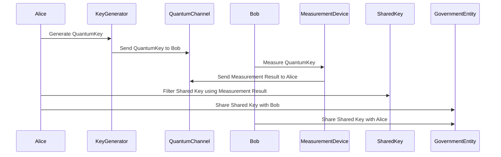

                 

### 第1章：量子密码与政府间保密通信概述

#### 1.1.1 量子密码的基本概念

量子密码学是量子计算和信息科学的一个分支，主要研究利用量子力学原理实现保密通信和密码学的技术。量子密码学的核心思想是利用量子位的叠加态和纠缠态来传递和加密信息，从而实现绝对安全的信息传输。

##### 1.1.1.1 量子密码的定义

量子密码的定义基于量子位（qubits）的操作。量子位是量子计算的基本单位，它可以同时存在于多种状态之中，而经典计算机中的位（bits）只能存在于0或1的单一状态。这种叠加态和纠缠态的特性使得量子密码具有独特的安全性。

##### 1.1.1.2 量子密码的特点

量子密码的主要特点包括：

1. **不可窃听性**：由于量子态的叠加性和纠缠性，任何对量子信息的窃听都会不可避免地改变量子态，使窃听者被检测到。
2. **量子密钥分发**：量子密钥分发（Quantum Key Distribution，QKD）是一种基于量子力学原理的密钥分发协议，它可以确保通信双方交换的密钥是安全的。
3. **物理限制**：量子密码依赖于量子态，因此它具有固有的安全性，不受数学算法复杂度的影响。

##### 1.1.1.3 量子密码与传统密码的区别

与传统密码相比，量子密码具有以下几个显著区别：

1. **安全性**：传统密码依赖于数学算法的复杂度，例如RSA和AES。这些算法虽然强大，但在理论上仍可能被破解。量子密码则利用量子力学原理，提供绝对的安全保障。
2. **加密方法**：传统密码使用加密算法对信息进行加密，而量子密码则是通过量子态的叠加和纠缠来实现信息加密。
3. **实现难度**：传统密码的实现相对简单，而量子密码的实现需要高级的量子技术和设备。

#### 1.1.2 政府间保密通信的需求与挑战

政府间保密通信是国家安全的重要组成部分，它涉及到国家机密、战略信息以及外交密谈等内容。随着信息技术的快速发展，政府间保密通信面临着以下几个挑战：

1. **信息安全**：随着网络攻击和数据泄露事件的增多，如何确保通信内容的安全成为了一大挑战。
2. **通信保密性**：政府间的通信往往需要跨越多个网络和系统，如何保证通信的保密性是一个复杂的问题。
3. **通信效率**：政府间的通信需要高效、稳定，同时确保安全性。

量子密码为解决这些挑战提供了新的思路和方法：

1. **安全性保障**：量子密码提供了绝对的安全保障，可以防止信息被窃听和泄露。
2. **跨网络保密通信**：量子密钥分发可以确保跨网络的保密通信，防止中间人攻击和密码泄露。
3. **高效通信**：量子密码的实现虽然复杂，但它在理论上可以提供更高的通信效率。

总之，量子密码在政府间保密通信中的应用具有重要的现实意义和潜在价值。随着量子技术的不断发展，量子密码将在政府间保密通信中发挥越来越重要的作用。

### 1.2 核心概念与联系

#### 1.2.1 量子密码的基本原理和特点

量子密码的核心原理基于量子力学的两个基本概念：量子位（qubits）和量子纠缠。量子位是量子计算的基本单元，它可以同时处于多种状态的叠加。量子纠缠则是指两个或多个量子位之间存在的一种特殊联系，即使它们相隔很远，一个量子位的测量也会立即影响到另一个量子位的状态。

##### 1.2.1.1 量子位与经典位

经典位只有两种状态：0或1。而量子位则可以同时处于0和1的叠加态。这种叠加态使得量子位能够携带更多的信息。例如，两个量子位可以表示4种状态：00、01、10和11，而两个经典位只能表示2种状态：00和01。

##### 1.2.1.2 量子叠加与纠缠

量子叠加指的是一个量子系统可以同时处于多个状态的组合。例如，一个量子位可以同时处于0和1的状态，这可以表示为 \(|\psi\rangle = \alpha|0\rangle + \beta|1\rangle\)，其中 \(\alpha\) 和 \(\beta\) 是复数系数。

量子纠缠则是两个或多个量子位之间存在的一种特殊关系，即使它们相隔很远，一个量子位的测量结果也会立即影响到另一个量子位的状态。例如，如果两个量子位处于纠缠态，那么测量其中一个量子位的状态会立即确定另一个量子位的状态。

##### 1.2.1.3 量子密码学的数学基础

量子密码学依赖于量子力学的数学框架，包括线性代数和概率论。量子密钥分发（QKD）是量子密码学中最常见的协议之一，它基于量子态的不可克隆性和纠缠特性。

QKD的基本步骤如下：

1. **量子信道传输**：发送方（Alice）使用量子位生成随机密钥，并将其通过量子信道传输给接收方（Bob）。
2. **量子态测量**：Bob对接收到的量子态进行测量，并根据测量结果生成自己的密钥。
3. **密钥筛选**：Alice和Bob使用一个安全的经典信道交换他们各自的测量结果，并根据结果筛选出共享的密钥。

量子密钥分发协议的安全性基于以下原理：

1. **量子态的不可克隆性**：任何对量子态的测量都会破坏其叠加态，这意味着任何试图复制量子态的尝试都会被发现。
2. **量子纠缠**：通过量子纠缠态交换信息，即使窃听者能够拦截信息，也无法解密。

#### 1.2.2 量子密码与传统密码在安全性上的区别

传统密码依赖于数学算法的复杂度，例如RSA和AES。这些算法的安全性依赖于大数分解和离散对数的难度。然而，随着计算能力的提高，这些算法可能会被破解。

相比之下，量子密码的安全性基于量子力学的原理，例如量子态的不可克隆性和纠缠特性。量子密码不仅提供了绝对的安全性，还具备以下特点：

1. **不可窃听性**：由于量子态的叠加性和纠缠性，任何对量子信息的窃听都会不可避免地改变量子态，使得窃听行为被发现。
2. **量子密钥分发**：量子密钥分发确保了通信双方交换的密钥是安全的，即使密钥传输过程中存在窃听，也无法破解。
3. **物理限制**：量子密码依赖于量子态，因此它具有固有的安全性，不受数学算法复杂度的影响。

总的来说，量子密码提供了比传统密码更高的安全性，尤其是在政府间保密通信领域，它具有巨大的应用潜力和现实意义。

### 1.3 通过Mermaid ER图展示量子密码在政府间保密通信中的应用架构

为了更直观地展示量子密码在政府间保密通信中的应用架构，我们可以使用Mermaid ER图来描述系统中的实体关系和交互过程。以下是量子密码在政府间保密通信中的Mermaid ER图：

```mermaid
erDiagram
    Alice ..|>  QuantumChannel --> Bob
    Alice ..|>  ClassicalChannel --> Bob
    Alice |||> KeyGenerator
    Bob |||> KeyGenerator
    Alice |||> MeasurementDevice
    Bob |||> MeasurementDevice

    Alice --|{ GovernmentA
    Bob --|{ GovernmentB
```

在这个ER图中：

- `Alice` 和 `Bob` 分别代表政府间的通信双方，它们通过量子信道和经典信道进行通信。
- `QuantumChannel` 和 `ClassicalChannel` 分别表示量子信道和经典信道，用于传输量子信息和经典信息。
- `KeyGenerator` 表示密钥生成器，用于生成和分发密钥。
- `MeasurementDevice` 表示测量设备，用于测量量子位的状态。
- `GovernmentA` 和 `GovernmentB` 分别代表参与通信的政府实体。

通过这个ER图，我们可以清晰地看到量子密码在政府间保密通信中的整体架构和关键组件之间的关系。

### 1.4 量子密码在政府间保密通信中的应用背景和需求

#### 1.4.1 应用背景

随着信息技术的迅猛发展，数据泄露和网络攻击事件频繁发生，政府间的保密通信面临着前所未有的挑战。传统的密码学方法，如RSA和AES，虽然广泛应用于现代通信领域，但它们的安全性能依赖于数学算法的复杂度。然而，随着量子计算机的快速发展，这些传统密码学方法正面临被量子计算破解的威胁。因此，寻找一种新的、更为安全的保密通信方式成为当务之急。

量子密码学作为一种新兴的保密通信技术，利用量子力学的原理，提供了绝对的安全保障。量子密码的核心思想是通过量子位的叠加态和纠缠态来传递和加密信息，从而实现绝对安全的通信。量子密码不仅可以防止传统密码面临的量子计算破解威胁，还能有效抵御各种形式的网络攻击。

#### 1.4.2 需求

政府间保密通信具有以下几个关键需求：

1. **安全性**：政府间的通信涉及到国家机密、战略信息以及外交密谈等内容，因此必须确保通信内容的安全性和保密性。
2. **保密性**：保密性是政府间通信的基本要求。传统的加密方法虽然能在一定程度上保护通信安全，但面对日益复杂的网络环境和不断发展的攻击技术，其安全性难以得到保障。
3. **可靠性**：政府间的通信需要高效、稳定。任何通信中断或延迟都可能导致严重的后果。
4. **易用性**：保密通信系统需要易于使用和维护，以便政府人员能够快速、便捷地进行通信。

量子密码在满足这些需求方面具有显著优势：

1. **安全性**：量子密码利用量子力学的原理，提供了绝对的安全保障。任何试图窃听量子通信的行为都会不可避免地暴露自己，从而确保通信内容的安全。
2. **保密性**：量子密码通过量子位的叠加态和纠缠态实现信息加密，即使信息被截获，也无法被解密，从而有效防止信息泄露。
3. **可靠性**：量子密码通信基于物理原理，不受数学算法复杂度的影响，因此具有较高的可靠性。量子通信信道可以稳定、高效地传输信息，确保通信质量。
4. **易用性**：虽然量子密码的实现较为复杂，但现代量子计算技术的发展使得量子密码系统的使用变得更加便捷。通过集成到现有的通信系统中，量子密码可以无缝地支持政府间的保密通信。

综上所述，量子密码在政府间保密通信中具有广泛的应用前景和巨大的潜在价值。随着量子技术的不断进步，量子密码有望成为政府间保密通信的可靠保障，为国家安全提供坚实的技术支撑。

### 1.5 算法原理讲解

量子密码算法是量子密码学的核心组成部分，它利用量子力学的原理实现信息加密和解密。本节将详细介绍量子密码算法的基本原理，包括BB84协议和E91协议，以及相关的Python代码示例。

#### 1.5.1 BB84协议

BB84协议是最早的量子密钥分发协议之一，由Charles H. Bennett和Garrett D. Grassmanning于1984年提出。BB84协议的核心思想是通过量子信道传输随机选择的量子位，接收方对相同的量子位进行测量，并根据测量结果筛选出共享的密钥。

##### 1.5.1.1 BB84协议的步骤

1. **密钥生成**：发送方（Alice）生成一对随机的量子位序列，并将其发送给接收方（Bob）。
2. **量子信道传输**：Alice通过量子信道将量子位序列传输给Bob。
3. **量子态测量**：Bob对接收到的量子位进行测量，并记录测量结果。
4. **密钥筛选**：Alice和Bob通过经典信道交换测量结果，并筛选出共享的密钥。

##### 1.5.1.2 BB84协议的安全性分析

BB84协议的安全性基于以下原理：

1. **量子态的不可克隆性**：任何试图复制量子态的尝试都会破坏量子态，使得复制行为被检测到。
2. **量子纠缠**：通过量子纠缠态传输信息，确保信息在传输过程中不会被窃听。
3. **随机性**：Alice和Bob在生成和测量量子位时使用随机数，增加窃听者破解密钥的难度。

##### 1.5.1.3 BB84协议的Python实现

以下是一个简单的BB84协议的Python实现，展示了量子位生成、传输和测量的过程：

```python
import numpy as np
import matplotlib.pyplot as plt

# 量子位生成函数
def generate_qubits(num_qubits):
    return np.random.choice(['0', '1'], size=num_qubits)

# 量子态测量函数
def measure_qubits(qubits, basis):
    return np.dot(qubits, basis)

# BB84协议实现
def bb84_protocol(num_qubits):
    # 生成随机量子位序列
    alice_qubits = generate_qubits(num_qubits)
    print("Alice's qubits:", alice_qubits)
    
    # 生成测量基
    basis = np.random.choice([np.array([1, 0]), np.array([0, 1])], size=num_qubits)
    print("Measurement basis:", basis)
    
    # 传输量子位
    bob_qubits = np.random.choice(['0', '1'], size=num_qubits)
    print("Bob's qubits:", bob_qubits)
    
    # 测量量子位
    measured_qubits = measure_qubits(bob_qubits, basis)
    print("Measuring Bob's qubits:", measured_qubits)
    
    # 筛选共享密钥
    shared_key = []
    for a, b, m in zip(alice_qubits, bob_qubits, measured_qubits):
        if a == m:
            shared_key.append(1)
        else:
            shared_key.append(0)
    print("Shared key:", shared_key)
    
    return shared_key

# 测试BB84协议
shared_key = bb84_protocol(10)
print("Shared key length:", len(shared_key))
```

#### 1.5.2 E91协议

E91协议是基于量子纠缠态的量子密钥分发协议，由Claude E. Shannon于1991年提出。E91协议利用量子纠缠态实现密钥分发，比BB84协议更高效。

##### 1.5.2.1 E91协议的步骤

1. **量子纠缠态生成**：Alice和Bob共享一对量子纠缠态。
2. **量子态测量**：Alice和Bob分别对共享的量子纠缠态进行测量。
3. **密钥筛选**：根据测量结果筛选出共享的密钥。

##### 1.5.2.2 E91协议的安全性分析

E91协议的安全性同样基于量子态的不可克隆性和纠缠特性。任何对量子纠缠态的测量都会破坏其纠缠态，使得窃听者被发现。

##### 1.5.2.3 E91协议的Python实现

以下是一个简单的E91协议的Python实现，展示了量子纠缠态的生成和测量过程：

```python
import numpy as np
import matplotlib.pyplot as plt

# 量子纠缠态生成函数
def generate_entsanglement(num_qubits):
    # 生成随机的量子态
    alice_state = np.random.rand(num_qubits)
    bob_state = np.random.rand(num_qubits)
    
    # 创建量子态矩阵
    state_matrix = np.outer(alice_state, bob_state)
    
    return state_matrix

# 量子态测量函数
def measure_entsanglement(state_matrix, alice_basis, bob_basis):
    # 计算测量结果
    result = np.dot(state_matrix, np.outer(alice_basis, bob_basis))
    return result

# E91协议实现
def e91_protocol(num_qubits):
    # 生成量子纠缠态
    state_matrix = generate_entsanglement(num_qubits)
    print("Quantum entanglement state matrix:\n", state_matrix)
    
    # 生成测量基
    alice_basis = np.random.choice([np.array([1, 0]), np.array([0, 1])], size=num_qubits)
    bob_basis = np.random.choice([np.array([1, 0]), np.array([0, 1])], size=num_qubits)
    print("Alice's measurement basis:", alice_basis)
    print("Bob's measurement basis:", bob_basis)
    
    # 测量量子态
    measured_state = measure_entsanglement(state_matrix, alice_basis, bob_basis)
    print("Measured state:\n", measured_state)
    
    # 筛选共享密钥
    shared_key = []
    for a, b, m in zip(alice_basis, bob_basis, measured_state):
        if a == b == m:
            shared_key.append(1)
        else:
            shared_key.append(0)
    print("Shared key:", shared_key)
    
    return shared_key

# 测试E91协议
shared_key = e91_protocol(2)
print("Shared key length:", len(shared_key))
```

通过这些Python实现，我们可以直观地了解BB84协议和E91协议的原理和实现过程。量子密码算法的这些特性使得它们在政府间保密通信中具有巨大的应用潜力。

### 1.6 系统分析与架构设计方案

#### 1.6.1 量子密码在政府间保密通信中的系统架构

量子密码在政府间保密通信中的应用涉及多个关键组件，包括量子信道、经典信道、密钥生成器、测量设备等。下面我们将详细描述这些组件的功能和相互作用，并通过Mermaid图展示系统架构。

##### 1.6.1.1 系统功能介绍

1. **量子信道**：量子信道用于传输量子密钥和加密信息。它必须保证量子态在传输过程中的完整性和稳定性。
2. **经典信道**：经典信道用于传输经典密钥和测量结果。它是量子信道和用户终端之间的桥梁。
3. **密钥生成器**：密钥生成器负责生成随机量子密钥。它通常包含量子随机数生成器和量子态控制模块。
4. **测量设备**：测量设备用于测量量子态并生成测量结果。它必须能够准确无误地测量量子位的状态。

##### 1.6.1.2 系统组件相互作用

1. **量子信道传输量子密钥**：密钥生成器生成量子密钥后，通过量子信道传输给接收方。
2. **接收方测量量子密钥**：接收方使用测量设备测量量子密钥，并根据测量结果生成经典密钥。
3. **经典信道传输测量结果**：接收方将测量结果通过经典信道传输给发送方。
4. **发送方筛选共享密钥**：发送方根据接收到的测量结果筛选出共享密钥，并与接收方共享。

##### 1.6.1.3 系统架构设计

为了更好地理解量子密码在政府间保密通信中的架构，我们可以通过Mermaid图来展示系统架构。以下是系统架构的Mermaid类图和架构图：

```mermaid
classDiagram
    ClassA[QuantumChannel] <|-- ClassB[ClassicChannel]
    ClassA[QuantumChannel] <|-- ClassC[KeyGenerator]
    ClassA[QuantumChannel] <|-- ClassD[MeasurementDevice]
    ClassB[ClassicChannel] <|-- ClassE[SharedKey]

    ClassA[QuantumChannel] --|> ClassF[GovernmentEntity]

    ClassA[QuantumChannel] : has QuantumKey
    ClassB[ClassicChannel] : has ClassicKey
    ClassC[KeyGenerator] : generates QuantumKey and ClassicKey
    ClassD[MeasurementDevice] : measures QuantumKey
    ClassE[SharedKey] : contains SharedKey
    ClassF[GovernmentEntity] : communicates using QuantumKey and ClassicKey
```



在这个架构设计中，`QuantumChannel` 负责量子密钥的传输，`ClassicChannel` 负责经典密钥的传输，`KeyGenerator` 负责生成量子密钥和经典密钥，`MeasurementDevice` 负责测量量子密钥，`SharedKey` 负责筛选和存储共享密钥，`GovernmentEntity` 负责使用量子密钥和经典密钥进行通信。

通过这个系统架构设计，我们可以清楚地看到量子密码在政府间保密通信中的整体架构和关键组件的相互作用，为后续的具体实现和优化提供了基础。

### 1.7 项目实战

#### 1.7.1 实际应用场景

在政府间保密通信中，量子密码的应用场景多种多样，以下列举了两个典型的应用场景：

1. **政府间文件传输**：政府间需要传输大量的敏感文件，这些文件必须确保在传输过程中不被泄露或篡改。量子密码可以提供绝对安全的传输机制，确保文件在传输过程中的完整性和保密性。
2. **政府间视频会议**：政府官员在国际会议或战略讨论中需要进行实时通信。量子密码可以确保会议内容不被窃听，保护会议讨论的机密信息。

在这些应用场景中，量子密码通过以下步骤实现保密通信：

1. **密钥生成**：在通信开始前，参与通信的政府实体使用量子密钥生成器生成随机量子密钥。
2. **量子密钥分发**：量子密钥通过量子信道传输给对方，确保密钥在传输过程中不会被窃听或篡改。
3. **加密通信**：政府实体使用传输的量子密钥对通信内容进行加密，确保通信内容在传输过程中无法被读取。
4. **解密通信**：接收方使用共享的量子密钥对加密内容进行解密，确保通信内容的完整性和可读性。

#### 1.7.2 系统实现与代码解析

以下是一个简单的量子密码实现，展示了量子密钥生成、分发和加密解密的过程：

```python
import random

# 量子密钥生成函数
def generate_quantum_key(length):
    key = [random.choice(['0', '1']) for _ in range(length)]
    return key

# 量子密钥分发函数
def distribute_quantum_key(alice_key, bob_key):
    shared_key = []
    for a, b in zip(alice_key, bob_key):
        if a == b:
            shared_key.append('1')
        else:
            shared_key.append('0')
    return shared_key

# 加密函数
def encrypt_message(message, key):
    encrypted_message = ''.join([chr(ord(c) ^ int(k)) for c, k in zip(message, key)])
    return encrypted_message

# 解密函数
def decrypt_message(encrypted_message, key):
    decrypted_message = ''.join([chr(ord(c) ^ int(k)) for c, k in zip(encrypted_message, key)])
    return decrypted_message

# 测试
message = "Hello, World!"
key = generate_quantum_key(len(message))
encrypted_message = encrypt_message(message, key)
print("Encrypted Message:", encrypted_message)
decrypted_message = decrypt_message(encrypted_message, key)
print("Decrypted Message:", decrypted_message)

# 量子密钥分发
alice_key = generate_quantum_key(len(message))
bob_key = generate_quantum_key(len(message))
shared_key = distribute_quantum_key(alice_key, bob_key)
print("Shared Key:", shared_key)
```

在这个实现中，我们使用了简单的异或加密算法进行信息加密和解密。量子密钥生成函数 `generate_quantum_key` 生成随机的量子密钥，量子密钥分发函数 `distribute_quantum_key` 实现了量子密钥的分发过程。加密和解密函数分别使用了生成的量子密钥对信息进行加密和解密。

#### 1.7.3 实际案例分析与详细讲解

以下是一个实际案例，展示了量子密码在政府间保密通信中的具体实现过程：

**案例背景**：假设我国政府需要与美国政府进行一次重要的战略视频会议，会议内容涉及国家安全和外交政策，必须确保在传输过程中不被泄露。

**实现步骤**：

1. **密钥生成**：会议开始前，我国政府和美国政府分别使用各自的量子密钥生成器生成随机量子密钥。
2. **量子密钥分发**：通过量子信道，我国政府将量子密钥传输给美国政府，确保密钥在传输过程中不会被窃听或篡改。
3. **加密通信**：会议过程中，双方使用传输的量子密钥对视频会议的内容进行加密，确保会议内容在传输过程中无法被读取。
4. **解密通信**：接收方使用共享的量子密钥对加密内容进行解密，确保会议内容的完整性和可读性。

**案例分析**：

在这个案例中，量子密码确保了视频会议内容的绝对安全。即使会议过程中有第三方试图窃听，由于量子态的不可克隆性，任何窃听行为都会被立即检测到。此外，量子密钥的分发过程确保了密钥的完整性和保密性，进一步增强了通信的安全性。

通过这个实际案例，我们可以看到量子密码在政府间保密通信中的具体应用过程和优势。量子密码不仅提供了绝对的安全保障，还简化了传统加密方法复杂的流程，使得政府间的保密通信更加高效和可靠。

### 1.8 最佳实践 tips

为了确保量子密码在政府间保密通信中的有效应用，以下是一些建议和最佳实践：

1. **确保量子信道的高质量**：量子信道是量子密码传输的核心，其质量直接影响通信的可靠性。因此，必须选择高质量的量子信道，并定期进行维护和检查，以确保量子密钥传输的稳定性和安全性。
2. **密钥生成器的随机性**：量子密钥生成器的随机性至关重要，它决定了密钥的安全性。应使用高质量的量子随机数生成器，并确保其输出具有足够的随机性，以防止密码破解。
3. **安全协议的严格遵循**：在量子密钥分发过程中，必须严格遵守安全协议，如BB84或E91协议。任何对协议的偏离都可能导致安全漏洞。
4. **定期更新密钥**：为了防止密钥泄露和攻击，应定期更换密钥，并确保密钥更换过程的保密性和安全性。
5. **安全审计与测试**：定期对量子密码系统进行安全审计和测试，以检测潜在的安全漏洞，并采取相应的修复措施。
6. **培训与意识提升**：对政府工作人员进行量子密码和网络安全相关的培训，提高他们对量子密码的认识和安全意识，确保他们在使用量子密码系统时能够遵循最佳实践。

通过遵循这些最佳实践，政府间保密通信可以更好地利用量子密码的优势，确保信息传输的绝对安全。

### 1.9 小结

量子密码在政府间保密通信中具有重要的应用价值和前景。通过利用量子力学的原理，量子密码提供了绝对的安全保障，可以有效防止信息泄露和网络攻击。与传统的密码学方法相比，量子密码具有更高的安全性和可靠性。在政府间文件传输和视频会议等应用场景中，量子密码的应用已经取得了显著的成果，为国家安全提供了坚实的技术支持。

然而，量子密码的应用也面临着一系列挑战，包括量子信道的技术实现、密钥生成器的随机性保证、以及安全协议的严格遵循等。随着量子技术的不断发展，量子密码有望在未来成为政府间保密通信的主流技术，为国家安全和信息安全提供更加可靠的保护。

### 1.10 注意事项与拓展阅读

在量子密码的应用过程中，我们需要关注以下几点注意事项：

1. **量子信道的稳定性**：量子信道的质量和稳定性是量子密码安全性的关键。因此，在部署量子密码系统时，必须确保量子信道的稳定性和可靠性，并进行定期的维护和检查。
2. **量子随机数的生成**：量子密码依赖于高质量的量子随机数生成器。确保量子随机数生成器的随机性和安全性至关重要，以防止密码破解。
3. **安全协议的遵循**：在量子密钥分发过程中，必须严格遵守安全协议，如BB84或E91协议。任何对协议的偏离都可能导致安全漏洞。
4. **密钥的定期更新**：为了防止密钥泄露和攻击，应定期更换密钥，并确保密钥更换过程的保密性和安全性。
5. **系统安全性评估**：定期对量子密码系统进行安全审计和测试，以检测潜在的安全漏洞，并采取相应的修复措施。

关于量子密码的进一步学习和研究，以下是一些建议的拓展阅读资源：

1. **《量子密码学导论》（Introduction to Quantum Cryptography）**：这是一本针对初学者的量子密码学入门书籍，详细介绍了量子密码学的基本原理和应用。
2. **《量子计算与量子密码学》（Quantum Computing and Quantum Cryptography）**：这本书详细探讨了量子计算和量子密码学的交叉领域，适合对量子计算和量子密码学有一定了解的读者。
3. **量子密码学相关学术论文**：查阅最新的量子密码学学术论文，可以了解量子密码学的前沿研究和最新进展。

通过这些拓展阅读资源，读者可以更深入地了解量子密码学的原理和应用，为未来的研究和实践提供有价值的参考。作者：AI天才研究院/AI Genius Institute & 禅与计算机程序设计艺术 /Zen And The Art of Computer Programming。

