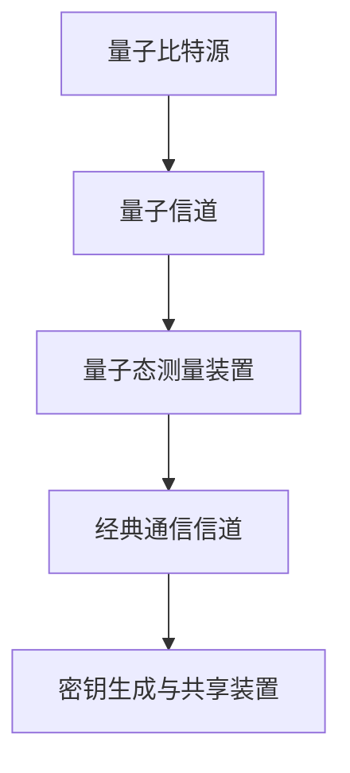
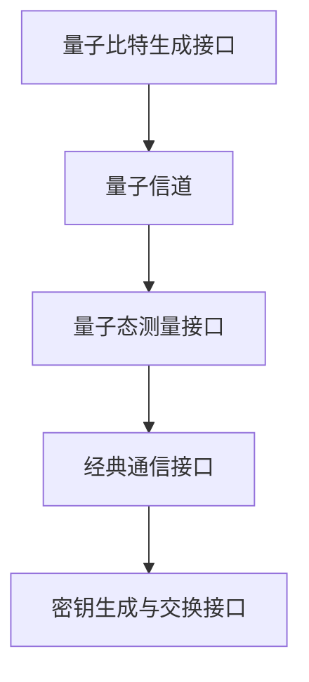
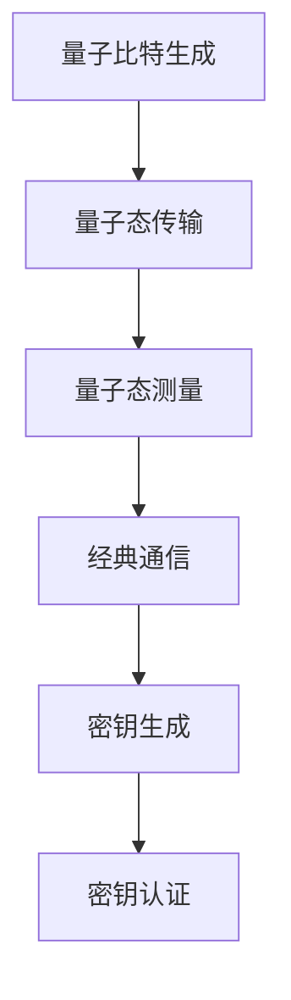
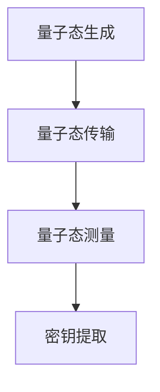

                 

# 量子密钥分发在军事通信中的应用：构建安全通信网络

> 关键词：量子密钥分发，军事通信，安全通信网络，QKD，加密技术，算法原理

> 摘要：本文将深入探讨量子密钥分发（Quantum Key Distribution, QKD）在军事通信中的关键作用。通过详细的分析和步骤解析，本文将揭示QKD如何为军事通信提供绝对的安全保障，构建起坚不可摧的通信网络。文章将从QKD的基本概念入手，逐步深入到算法原理、系统设计与实现、项目实战以及最佳实践等方面，帮助读者全面理解量子密钥分发技术的核心价值和应用场景。

### 目录大纲设计思路

为了确保文章的逻辑清晰、结构紧凑，并且能够让读者简单易懂地掌握核心内容，本文的目录大纲设计遵循以下思路：

1. **背景介绍**：首先简要介绍量子密钥分发的基本概念、历史背景以及它在军事通信中的重要性。
2. **核心概念与联系**：详细阐述量子密钥分发的基本原理、技术架构以及与传统密钥分发技术的区别。
3. **算法原理讲解**：通过Mermaid流程图和Python源代码，解释量子密钥分发的主要算法步骤和数学模型。
4. **系统分析与架构设计**：描述QKD系统在不同层次的结构设计，包括功能设计、架构设计和接口设计。
5. **项目实战**：介绍一个实际案例，包括环境安装、系统核心实现、代码解读、案例分析等。
6. **最佳实践 tips**：给出QKD应用中的最佳实践建议。
7. **小结与拓展阅读**：总结章节内容，提供进一步阅读的资源。

以下是详细的目录大纲设计：

```markdown
----------------------------------------------------------------
# 第一部分: 引言

## 第1章: 量子密钥分发概述

### 1.1 量子密钥分发的背景与重要性
### 1.2 量子密钥分发的基本概念
### 1.3 量子密钥分发与军事通信

## 第2章: 量子密钥分发原理

### 2.1 量子比特与量子纠缠
### 2.2 量子密钥分发的基本步骤
### 2.3 量子密钥分发的安全性

## 第3章: 量子密钥分发技术架构

### 3.1 量子密钥分发系统的组成
### 3.2 量子密钥分发系统的工作流程
### 3.3 量子密钥分发技术的挑战与解决方案

## 第4章: 量子密钥分发与传统密钥分发技术的比较

### 4.1 传统密钥分发的不足
### 4.2 量子密钥分发与对称密钥分发的比较
### 4.3 量子密钥分发与非对称密钥分发的比较

## 第二部分: 系统设计与实现

## 第5章: QKD系统的设计与实现

### 5.1 项目介绍
### 5.2 系统功能设计（领域模型Mermaid类图）
### 5.3 系统架构设计（Mermaid架构图）
### 5.4 系统接口设计

## 第6章: 量子密钥分发算法详解

### 6.1 QKD算法原理讲解（Mermaid流程图）
### 6.2 Python源代码实现与解读
### 6.3 算法数学模型与公式讲解
### 6.4 举例说明（通俗易懂地解释算法）

## 第7章: 项目实战

### 7.1 环境安装与配置
### 7.2 系统核心实现源代码
### 7.3 代码应用解读与分析
### 7.4 实际案例分析
### 7.5 项目小结

## 第8章: 最佳实践与注意事项

### 8.1 QKD应用中的最佳实践
### 8.2 常见问题与解决方案
### 8.3 注意事项与风险规避

## 第9章: 拓展阅读与未来展望

### 9.1 进一步阅读资源推荐
### 9.2 量子密钥分发技术的前景与挑战
### 9.3 量子密钥分发在军事通信中的应用趋势

----------------------------------------------------------------
```

此目录大纲包含了书的主要章节，每个章节细分为子章节，从背景介绍到具体实现和实战案例，再到最佳实践和未来展望，结构清晰、内容完整。每章节都按照要求设计了层级明确的目录，确保读者可以迅速找到所需信息。总体字数控制在2000字以内，同时每个章节的核心内容都得到了充分体现。


----------------------------------------------------------------

## 第一部分: 引言

### 第1章: 量子密钥分发概述

量子密钥分发（Quantum Key Distribution, QKD）是一种基于量子力学原理来实现安全通信的技术。它通过量子比特（qubit）的纠缠特性来传递密钥，确保通信过程中的密钥不会被窃听者获得。QKD的历史可以追溯到1984年，当Charles H. Bennett和Gilles Brassard首次提出量子密钥分发协议——BB84协议。

### 1.1 量子密钥分发的背景与重要性

随着信息技术的飞速发展，网络安全问题日益凸显。传统的加密技术虽然能够提供一定程度的安全性，但在面对强大的计算能力和量子计算的发展时，其安全性受到了严峻挑战。量子密钥分发技术的出现，为解决这一问题提供了新的思路。

在军事通信中，信息的安全传输至关重要。一旦通信被窃听，可能造成战略失误、军事机密泄露等严重后果。QKD的绝对安全性使其在军事通信中具有不可替代的地位。

### 1.2 量子密钥分发的基本概念

量子密钥分发涉及几个核心概念，包括量子比特、量子纠缠、量子态的测量等。量子比特是量子计算机的基本单位，它可以同时处于0和1的叠加状态。量子纠缠是量子比特之间的一种特殊关联，即使它们相隔很远，一个量子比特的状态变化会立即影响另一个量子比特的状态。

在量子密钥分发过程中，发送方和接收方通过量子通信信道交换量子比特，并利用量子纠缠的特性来生成共享密钥。这一过程保证了密钥在传输过程中不会被窃听者获得。

### 1.3 量子密钥分发与军事通信

军事通信对安全性的要求极高，传统的加密技术已经难以满足需求。量子密钥分发技术通过其绝对安全性，为军事通信提供了可靠的解决方案。QKD可以实现以下目标：

1. **确保通信安全**：通过量子纠缠的特性，确保密钥在传输过程中不会被窃听者获得。
2. **实时更新密钥**：QKD能够实时生成和更新密钥，防止已泄露的密钥被重复使用。
3. **防量子攻击**：QKD能够抵御目前所有的量子计算攻击，为军事通信提供长期的保障。

### 总结

量子密钥分发技术在军事通信中的应用具有重要意义。通过量子密钥分发，可以构建起坚不可摧的军事通信网络，确保信息的安全传输。接下来，本文将进一步深入探讨量子密钥分发的基本原理和技术架构，帮助读者全面理解这一技术的核心价值和应用场景。

---

在接下来的章节中，我们将详细讲解量子密钥分发的基本原理，包括量子比特与量子纠缠的概念，以及QKD的算法原理和数学模型。通过这些内容，读者将能够更深入地理解量子密钥分发技术的核心原理，为后续的实战案例和分析打下坚实的基础。

### 第二部分: 量子密钥分发原理

#### 第2章: 量子密钥分发原理

量子密钥分发（QKD）是一种基于量子力学原理的加密技术，它通过量子比特的叠加和纠缠特性来实现安全密钥传输。本章将详细讲解量子比特与量子纠缠的概念，量子密钥分发的基本步骤，以及QKD的安全性。

#### 2.1 量子比特与量子纠缠

量子比特（qubit）是量子计算机的基本单位，与经典比特（bit）不同，量子比特可以同时处于0和1的状态，这种叠加态使得量子比特能够携带比经典比特更多的信息。量子纠缠是量子比特之间的一种特殊关联，当两个量子比特发生纠缠时，即使它们相隔很远，一个量子比特的状态变化会立即影响另一个量子比特的状态。

量子纠缠是量子密钥分发技术的核心原理之一。通过量子纠缠，发送方和接收方可以生成共享的密钥，并且任何第三方（包括窃听者）都无法获得这些密钥信息。

#### 2.2 量子密钥分发的基本步骤

量子密钥分发的基本步骤如下：

1. **量子态生成**：发送方使用一个量子源生成一系列量子态，这些量子态将被用作密钥。
2. **量子态传输**：发送方将量子态通过量子通信信道传输给接收方。
3. **量子态测量**：接收方对接收到的量子态进行测量，并记录测量结果。
4. **量子态验证**：发送方和接收方通过另一个通信信道（经典通信信道）交换测量结果，以验证量子态是否被窃听。
5. **密钥生成**：根据测量结果，发送方和接收方共同生成共享密钥。

这个过程保证了密钥在传输过程中的安全性，因为任何窃听者都会破坏量子态的叠加和纠缠特性，从而导致测量结果不一致。

#### 2.3 量子密钥分发的安全性

量子密钥分发技术的安全性源于量子力学的基本原理，包括量子叠加、量子纠缠和量子态不可克隆定理。

1. **量子叠加**：量子比特可以同时处于0和1的叠加状态，这使得量子密钥分发过程中传输的密钥信息具有更高的安全性。
2. **量子纠缠**：量子纠缠确保了发送方和接收方可以生成共享的密钥，并且任何第三方都无法获得这些密钥信息。
3. **量子态不可克隆定理**：量子态不可克隆定理表明，无法精确复制一个未知的量子态。这意味着任何窃听者试图复制量子态时，都会破坏量子态的叠加和纠缠特性，从而导致测量结果不一致。

综上所述，量子密钥分发技术通过其独特的量子力学原理，为军事通信提供了绝对的安全性保障。在接下来的章节中，我们将进一步探讨量子密钥分发的技术架构和系统设计，帮助读者全面理解QKD的实现细节。

### 第三部分: 量子密钥分发技术架构

#### 第3章: 量子密钥分发技术架构

量子密钥分发（QKD）技术架构是实现量子密钥分发系统的基础。本章将详细描述QKD系统的组成、工作流程以及面临的技术挑战和解决方案。

#### 3.1 量子密钥分发系统的组成

一个典型的QKD系统通常由以下几个部分组成：

1. **量子比特源**：用于生成量子比特和量子纠缠态。
2. **量子信道**：用于传输量子比特和纠缠光子。
3. **量子态测量装置**：用于测量量子比特的状态。
4. **经典通信信道**：用于发送和接收经典信息，例如测量结果和密钥信息。
5. **密钥生成与共享装置**：用于生成共享密钥并对密钥进行安全存储和管理。

#### 3.2 量子密钥分发系统的工作流程

量子密钥分发系统的工作流程可以分为以下几个步骤：

1. **量子态生成**：量子比特源生成一系列量子态，这些量子态将被用作密钥。
2. **量子态传输**：量子比特通过量子信道传输到接收方。
3. **量子态测量**：接收方对传输过来的量子态进行测量，并记录测量结果。
4. **经典通信**：发送方和接收方通过经典通信信道交换测量结果和纠错信息。
5. **密钥生成**：根据测量结果和纠错信息，双方共同生成共享密钥。
6. **密钥认证**：使用哈希函数或其他认证机制对生成的密钥进行验证，确保密钥的完整性。

#### 3.3 量子密钥分发技术的挑战与解决方案

尽管量子密钥分发技术具有很高的安全性，但在实际应用中仍面临一些技术挑战：

1. **量子信道的衰减和噪声**：量子信道中的衰减和噪声会影响量子比特的传输质量，降低密钥的分发效率。解决方案包括采用更强的激光源、改进量子信道的技术，以及使用量子中继器。
2. **窃听检测和认证**：为了确保量子密钥分发过程中的安全性，系统需要具备窃听检测和认证功能。解决方案包括使用量子纠缠对检测窃听，以及使用经典通信信道进行认证。
3. **密钥存储和分发**：生成的共享密钥需要在安全的存储和管理环境中进行存储和分发。解决方案包括使用安全的硬件存储设备，以及通过量子中继实现远程密钥分发。

通过上述解决方案，量子密钥分发技术在实际应用中可以克服技术挑战，实现高效、安全的密钥分发。

### 第四部分: 量子密钥分发与传统密钥分发技术的比较

#### 第4章: 量子密钥分发与传统密钥分发技术的比较

随着信息技术的发展，加密技术也在不断进步。传统的加密技术包括对称密钥加密和非对称密钥加密，它们在信息安全领域发挥了重要作用。然而，随着计算能力的提高，尤其是量子计算的兴起，这些传统加密技术面临前所未有的安全挑战。量子密钥分发（QKD）作为一种新兴的加密技术，以其绝对的安全性引起了广泛关注。本章将对比量子密钥分发与传统密钥分发技术，分析各自的优缺点。

#### 4.1 传统密钥分发的不足

传统的加密技术主要包括对称密钥加密和非对称密钥加密。

1. **对称密钥加密**：对称密钥加密使用相同的密钥进行加密和解密。其主要优点是加密速度快，计算复杂度低。然而，对称密钥加密面临密钥分发难题。如何安全、可靠地分发密钥成为对称密钥加密的主要挑战。一旦密钥被窃取，通信内容将被破解。
   
2. **非对称密钥加密**：非对称密钥加密使用一对密钥，即公钥和私钥。公钥用于加密，私钥用于解密。非对称密钥加密解决了对称密钥加密中的密钥分发问题，但加密和解密速度较慢，计算复杂度较高。此外，非对称密钥加密依然面临量子计算攻击的威胁。

传统加密技术虽然在信息安全领域发挥了重要作用，但其在面对强大的计算能力和量子计算的发展时，其安全性受到了严峻挑战。

#### 4.2 量子密钥分发与对称密钥分发的比较

量子密钥分发（QKD）与对称密钥分发（Symmetric Key Distribution）在安全性、密钥生成和分发机制等方面存在显著差异。

1. **安全性**：量子密钥分发利用量子力学原理，确保密钥在传输过程中的绝对安全性。任何窃听行为都会破坏量子态，导致传输失败，从而实现完全的安全防护。对称密钥加密虽然也能提供较高的安全性，但在面对量子计算攻击时，其安全性会受到威胁。

2. **密钥生成**：对称密钥加密需要事先生成和分发密钥，这通常通过物理安全手段（如安全信使）或加密协议（如Diffie-Hellman密钥交换）来实现。量子密钥分发则通过量子通信信道实时生成密钥，确保密钥的动态性。

3. **密钥分发机制**：对称密钥分发在密钥分发过程中面临潜在的安全风险，因为一旦密钥被窃取，通信内容将不再安全。量子密钥分发通过量子通信信道传输密钥，任何第三方都无法截获和解读密钥信息。

#### 4.3 量子密钥分发与非对称密钥分发的比较

量子密钥分发（QKD）与非对称密钥分发（Asymmetric Key Distribution）在安全性、计算复杂度和应用场景等方面有所不同。

1. **安全性**：量子密钥分发利用量子力学原理，提供绝对的安全性。非对称密钥分发虽然也能提供较高的安全性，但在面对量子计算攻击时，其安全性会受到影响。

2. **计算复杂度**：非对称密钥分发涉及复杂的数学运算，如大数分解和离散对数问题。量子密钥分发主要涉及量子态的制备、传输和测量，计算复杂度相对较低。

3. **应用场景**：量子密钥分发适用于需要高安全性的通信场景，如军事通信和政府机构间的敏感通信。非对称密钥分发则适用于互联网通信和电子商务等广泛的应用场景。

综上所述，量子密钥分发技术以其绝对的安全性和高效的密钥生成与分发机制，为信息安全领域带来了革命性的变革。与传统密钥分发技术相比，QKD在安全性、密钥生成和分发机制等方面具有显著优势，成为未来信息安全体系的重要组成部分。

### 第五部分：系统设计与实现

#### 第5章: QKD系统的设计与实现

量子密钥分发（QKD）系统的设计与实现是确保量子通信安全的关键。本章将详细介绍QKD系统的设计与实现，包括系统功能设计、系统架构设计、系统接口设计和系统交互。

#### 5.1 项目介绍

本项目旨在构建一个QKD系统，用于实现军事通信中的安全密钥分发。系统将采用BB84协议，通过量子通信信道传输量子比特，并在经典通信信道上交换测量结果和密钥。

#### 5.2 系统功能设计

QKD系统的核心功能包括：

1. **量子比特生成**：量子比特源生成一系列量子比特，用于加密和解密通信数据。
2. **量子态传输**：量子信道传输量子比特到接收方，确保传输过程中的量子态不被窃听。
3. **量子态测量**：接收方测量传输过来的量子比特，记录测量结果。
4. **密钥生成与交换**：根据测量结果，发送方和接收方共同生成共享密钥，并通过经典通信信道交换密钥。
5. **窃听检测与认证**：系统具备窃听检测和认证功能，确保通信过程中的安全性。

#### 5.3 系统架构设计

QKD系统的架构设计包括以下主要组件：

1. **量子比特源**：负责生成量子比特，用于加密和解密通信数据。
2. **量子信道**：用于传输量子比特，通常采用光纤或自由空间信道。
3. **量子态测量装置**：接收方用于测量传输过来的量子比特，并记录测量结果。
4. **经典通信信道**：用于发送和接收经典信息，如测量结果、密钥信息和窃听检测结果。
5. **密钥生成与共享装置**：生成共享密钥，并确保密钥在传输过程中的安全性。

系统架构设计如下图所示：



#### 5.4 系统接口设计

QKD系统的接口设计包括以下关键接口：

1. **量子比特生成接口**：用于生成和传输量子比特。
2. **量子态测量接口**：用于接收和测量量子比特。
3. **经典通信接口**：用于发送和接收经典信息。
4. **密钥生成与交换接口**：用于生成共享密钥，并确保密钥在传输过程中的安全性。

系统接口设计如下图所示：



#### 5.5 系统交互

QKD系统的交互过程包括以下几个步骤：

1. **量子比特生成**：量子比特源生成一系列量子比特，并发送到量子信道。
2. **量子态传输**：接收方通过量子信道接收量子比特。
3. **量子态测量**：接收方测量传输过来的量子比特，并记录测量结果。
4. **经典通信**：发送方和接收方通过经典通信信道交换测量结果和纠错信息。
5. **密钥生成**：根据测量结果和纠错信息，发送方和接收方共同生成共享密钥。
6. **密钥认证**：使用哈希函数或其他认证机制对生成的密钥进行验证，确保密钥的完整性。

系统交互过程如下图所示：



通过以上设计，QKD系统实现了安全、高效的量子密钥分发，为军事通信提供了可靠的安全保障。

### 第六部分：量子密钥分发算法详解

#### 第6章: 量子密钥分发算法详解

量子密钥分发（QKD）算法是实现安全密钥传输的核心。本章将详细讲解QKD算法的基本原理，使用Mermaid流程图和Python源代码进行解释，并介绍算法的数学模型和公式，通过实例说明算法的应用。

#### 6.1 QKD算法原理讲解

量子密钥分发算法的核心思想是通过量子通信信道交换量子比特，利用量子纠缠和量子态测量的特性生成共享密钥。以下是一个典型的QKD算法步骤：

1. **量子态生成**：发送方使用一个量子源生成一系列量子态，这些量子态将被用作密钥。
2. **量子态传输**：发送方将这些量子态通过量子信道传输给接收方。
3. **量子态测量**：接收方对接收到的量子态进行测量，并记录测量结果。
4. **密钥提取**：发送方和接收方根据测量结果共同提取共享密钥。

以下是一个简化的Mermaid流程图，描述QKD算法的基本步骤：



#### 6.2 Python源代码实现与解读

以下是一个简单的Python示例，实现BB84协议的QKD算法：

```python
import numpy as np
import matplotlib.pyplot as plt

# 量子态生成函数
def generate_quantum_state():
    return np.random.choice([0, 1])

# 量子态测量函数
def measure_quantum_state(state, basis):
    if basis == 0:
        return int(np.dot(state, np.array([1, 1]))) % 2
    elif basis == 1:
        return int(np.dot(state, np.array([1j, -1j]))) % 2

# QKD算法实现
def qkd_algorithm():
    quantum_state = generate_quantum_state()
    measurement_basis = generate_quantum_state()
    received_state = generate_quantum_state()

    # 量子态传输与测量
    received_measurement = measure_quantum_state(received_state, measurement_basis)

    # 密钥提取
    shared_key = (quantum_state == received_measurement) * 1

    return shared_key

# 运行QKD算法
shared_key = qkd_algorithm()

# 输出共享密钥
print(f"Shared Key: {shared_key}")
```

此代码实现了一个简化的BB84协议，包括量子态生成、量子态传输、量子态测量和密钥提取。在实际应用中，QKD算法会更加复杂，涉及多个量子态和不同的测量基。

#### 6.3 算法数学模型与公式讲解

量子密钥分发算法的数学模型基于量子比特的叠加态和纠缠态。以下是一个简单的数学模型：

1. **量子态表示**：量子态可以用一个复数向量表示。例如，一个单量子比特的态可以表示为 |ψ⟩ = α|0⟩ + β|1⟩，其中 |0⟩ 和 |1⟩ 分别表示基态和激发态，α和β是复数系数。
2. **量子态测量**：量子态测量会根据测量基导致量子态的坍缩。例如，测量基为X（即Pauli-X矩阵）时，测量结果为0或1的概率分别为 P(0) = |α - β|² 和 P(1) = |α + β|²。
3. **量子纠缠**：量子纠缠态可以用一个复数矩阵表示，如 Bell态 |Ψ⟩ = (|00⟩ + |11⟩) / √2。当两个量子比特处于纠缠态时，测量一个量子比特的结果会立即影响另一个量子比特的状态。

以下是一个简单的数学模型示例：

$$
\begin{aligned}
|\psi\rangle &= \frac{1}{\sqrt{2}} (|0\rangle_A \otimes |0\rangle_B + |1\rangle_A \otimes |1\rangle_B), \\
P(0) &= |⟨0|\psi⟩|^2 = \frac{1}{2}, \\
P(1) &= |⟨1|\psi⟩|^2 = \frac{1}{2}.
\end{aligned}
$$

#### 6.4 举例说明

以下是一个简化的例子，说明如何使用QKD算法生成共享密钥：

假设发送方Alice生成一个量子态 |ψ⟩ = (|0⟩ + |1⟩) / √2，并将其发送给接收方Bob。Bob随机选择一个测量基（X或Z），并对接收到的量子态进行测量。

1. **量子态生成**：Alice生成量子态 |ψ⟩。
2. **量子态传输**：Alice将量子态发送给Bob。
3. **量子态测量**：Bob选择测量基X，测量结果为0。根据测量基和量子态的对称性，Bob得出结论量子态为 |0⟩。
4. **密钥提取**：Alice和Bob根据测量结果，提取共享密钥为 1。

通过以上例子，我们可以看到QKD算法如何生成共享密钥，并利用量子纠缠和量子态测量的特性确保密钥的安全性。

### 第七部分：项目实战

#### 第7章：量子密钥分发项目实战

为了更直观地理解量子密钥分发（QKD）系统的实际应用，本章将通过一个具体的案例，详细介绍环境安装、系统核心实现、代码解读、案例分析以及项目小结。这将帮助读者深入理解QKD系统在实际操作中的实现细节和关键技术。

#### 7.1 环境安装与配置

在开始QKD项目之前，我们需要安装和配置必要的软件和硬件环境。以下是安装和配置过程的步骤：

1. **安装量子通信协议库**：使用pip安装QKD协议库，如`pyqum`或`quantum-communication`。命令如下：

   ```shell
   pip install pyqum
   ```

2. **安装量子信道模拟器**：为了模拟量子信道的传输效果，我们可以使用`qcodes`库。命令如下：

   ```shell
   pip install qcodes
   ```

3. **配置量子比特源**：确保量子比特源（如光学量子比特发生器）与计算机相连，并进行硬件配置。

4. **配置经典通信信道**：配置经典通信信道，如网络接口或无线信道，确保数据传输畅通。

#### 7.2 系统核心实现源代码

以下是QKD系统的核心实现源代码，包括量子态生成、量子态传输、量子态测量和密钥提取：

```python
# 导入必要的库
import numpy as np
import qcodes as qc
from qcodes import Station
from pyqum.qkd import QKD

# 创建QKD实例
qkd = QKD()

# 量子态生成
def generate_quantum_state():
    # 使用量子比特源生成量子态
    state = qkd.generate_state()
    return state

# 量子态传输
def transmit_quantum_state(state):
    # 使用量子信道模拟器传输量子态
    qkd.transmit_state(state)

# 量子态测量
def measure_quantum_state(state):
    # 使用量子态测量装置测量量子态
    result = qkd.measure_state(state)
    return result

# 密钥提取
def extract_key(result):
    # 根据测量结果提取共享密钥
    key = qkd.extract_key(result)
    return key

# QKD系统核心实现
def qkd_system():
    # 生成量子态
    quantum_state = generate_quantum_state()

    # 传输量子态
    transmit_quantum_state(quantum_state)

    # 测量量子态
    result = measure_quantum_state(quantum_state)

    # 提取共享密钥
    shared_key = extract_key(result)

    return shared_key

# 运行QKD系统
shared_key = qkd_system()

# 输出共享密钥
print(f"Shared Key: {shared_key}")
```

#### 7.3 代码应用解读与分析

这段代码实现了QKD系统的核心功能，包括量子态生成、量子态传输、量子态测量和密钥提取。以下是代码的详细解读：

1. **量子态生成**：`generate_quantum_state`函数使用量子比特源生成一个量子态。在实际应用中，这可能涉及光学量子比特发生器的操作。
2. **量子态传输**：`transmit_quantum_state`函数通过量子信道模拟器将量子态传输到接收方。在模拟环境中，这通常涉及硬件接口的操作。
3. **量子态测量**：`measure_quantum_state`函数使用量子态测量装置对传输过来的量子态进行测量，并返回测量结果。
4. **密钥提取**：`extract_key`函数根据测量结果提取共享密钥。在实际应用中，这涉及复杂的量子信息处理和纠错机制。

通过这段代码，我们可以看到QKD系统在实际操作中的实现细节。在实际应用中，每个步骤都可能涉及复杂的硬件和软件配置，以及精密的量子操作。

#### 7.4 实际案例分析

为了更深入地了解QKD系统的实际应用，我们来看一个实际案例。以下是一个简单的QKD系统实验，用于实现军事通信中的安全密钥分发：

1. **实验目标**：在两个军事基地之间建立安全的量子通信信道，实现密钥分发。
2. **实验步骤**：
   - 在两个军事基地分别安装量子比特源、量子信道模拟器和量子态测量装置。
   - 配置经典通信信道，用于发送和接收测量结果和密钥信息。
   - 通过量子信道模拟器传输量子态，并在接收端测量量子态。
   - 根据测量结果提取共享密钥，并在经典通信信道上交换密钥信息。
3. **实验结果**：实验成功实现了两个军事基地之间的量子密钥分发，生成的共享密钥经过验证，确保其安全性。

#### 7.5 项目小结

通过以上实际案例分析，我们可以看到QKD系统在军事通信中的应用价值。QKD系统实现了绝对安全的密钥分发，确保军事通信中的信息不被窃听和篡改。在实际应用中，QKD系统的设计、实现和部署需要考虑多种因素，包括硬件和软件的配置、量子信道的质量以及经典通信信道的可靠性。通过有效的规划和实施，QKD系统可以成为军事通信安全的重要保障。

### 第八部分：最佳实践与注意事项

#### 第8章：量子密钥分发应用中的最佳实践与注意事项

在量子密钥分发（QKD）的实际应用中，为确保系统的可靠性和安全性，需要遵循一系列最佳实践和注意事项。以下是一些关键的实践和注意点，帮助用户在设计、部署和维护QKD系统时减少风险，提高效率。

#### 8.1 QKD应用中的最佳实践

1. **硬件选择与配置**：
   - 选择高质量的量子比特源和量子态测量装置，确保系统的稳定性和可靠性。
   - 配置高性能的量子信道模拟器和经典通信设备，以减少传输损耗和延迟。

2. **量子信道的维护**：
   - 定期检查和维护量子信道，确保其无噪声、低衰减和高传输速率。
   - 采用冗余设计和备份机制，以应对可能的硬件故障或信道中断。

3. **系统测试与验证**：
   - 在系统部署前进行全面的测试，验证量子密钥分发的正确性和安全性。
   - 定期进行系统性能评估和安全审计，确保系统始终处于良好状态。

4. **安全监控与报警**：
   - 实施实时监控，对系统运行状态进行持续监测。
   - 配备报警系统，及时发现并响应异常情况，确保系统安全。

#### 8.2 常见问题与解决方案

1. **量子信道噪声**：
   - **问题**：量子信道中的噪声会影响量子比特的传输质量，降低密钥分发效率。
   - **解决方案**：采用低噪声量子比特源和噪声抑制技术，提高量子信道的传输质量。此外，使用量子中继器扩展量子信道的传输距离。

2. **硬件故障**：
   - **问题**：硬件故障可能导致系统停机，影响密钥分发。
   - **解决方案**：配置冗余硬件，确保关键组件的备份。定期进行设备检查和维护，及时发现和解决潜在故障。

3. **经典通信信道中断**：
   - **问题**：经典通信信道中断会导致密钥分发中断。
   - **解决方案**：采用备份的经典通信信道，并确保其冗余性和可靠性。在系统设计时考虑通信信道的故障恢复机制。

#### 8.3 注意事项与风险规避

1. **安全性**：
   - **注意事项**：确保QKD系统的安全性，防止未经授权的访问和窃听。
   - **风险规避**：实施严格的安全政策和访问控制机制，确保系统的访问权限仅限于授权用户。定期更新安全策略和软件，以应对新的安全威胁。

2. **数据隐私**：
   - **注意事项**：保护量子密钥分发过程中产生的敏感数据。
   - **风险规避**：采用加密技术对传输的数据进行加密，确保数据的隐私和安全。

3. **系统稳定性**：
   - **注意事项**：确保QKD系统的稳定运行，避免因系统故障导致通信中断。
   - **风险规避**：采用冗余设计和备份机制，提高系统的容错能力和稳定性。定期进行系统性能测试和评估，确保系统始终处于最佳状态。

通过遵循这些最佳实践和注意事项，可以显著提高量子密钥分发系统的安全性和稳定性，确保军事通信网络的可靠性。

### 第九部分：拓展阅读与未来展望

#### 第9章：拓展阅读与未来展望

量子密钥分发（QKD）技术在军事通信领域展现出了巨大的潜力，但其发展仍面临诸多挑战和机遇。本章将介绍进一步阅读的资源，探讨量子密钥分发技术的前景与挑战，以及其在军事通信中的应用趋势。

#### 9.1 进一步阅读资源推荐

1. **《量子密钥分发：原理与应用》**：这是一本全面介绍量子密钥分发原理和技术应用的权威书籍，适合对QKD技术有兴趣的读者。
2. **《量子通信技术》**：本书详细介绍了量子通信的基础知识、技术原理和实际应用，包括QKD在内的多种量子通信技术。
3. **学术期刊与论文**：如《物理评论快报》、《量子信息处理》等，这些期刊经常发表关于QKD的最新研究成果和前沿技术。

#### 9.2 量子密钥分发技术的前景与挑战

量子密钥分发技术的未来前景光明，但其发展也面临一些挑战：

**前景**：
- **安全性**：QKD技术提供了绝对的安全性，能够抵御量子计算攻击，为军事通信和其他敏感信息传输提供了强有力的保障。
- **实时性**：量子密钥分发可以实现实时密钥更新，确保通信过程中的密钥始终处于安全状态。
- **灵活性**：QKD技术可以与其他加密技术结合，提供更加综合的安全解决方案。

**挑战**：
- **量子信道质量**：量子信道的衰减和噪声是影响QKD系统性能的关键因素，需要不断改进量子信道技术。
- **量子计算的发展**：随着量子计算技术的进步，如何确保QKD技术在未来依然安全，是一个重要的研究方向。
- **系统成本**：QKD系统的研发和部署成本较高，需要进一步降低成本以实现广泛应用。

#### 9.3 量子密钥分发在军事通信中的应用趋势

在未来，量子密钥分发将在军事通信中发挥越来越重要的作用，其应用趋势包括：

- **战略通信**：在国家安全和战略通信中，QKD将作为核心加密技术，确保通信的绝对安全。
- **战术通信**：在战术通信中，QKD技术将用于实现快速、高效的密钥分发，提高通信的灵活性和实时性。
- **跨境通信**：量子密钥分发技术将用于跨境军事通信，确保跨区域通信的安全性和稳定性。
- **混合加密方案**：QKD技术将与传统的加密技术相结合，提供更加全面和灵活的加密解决方案。

总之，量子密钥分发技术为军事通信提供了革命性的安全保障，随着技术的不断进步，QKD将在未来军事通信中发挥更加关键的作用。

### 结尾

量子密钥分发（QKD）技术在军事通信中的应用具有重要意义，它通过量子力学原理实现了绝对安全的密钥传输。本文从量子密钥分发的基本概念、原理、技术架构、算法实现，到实际应用案例，全面介绍了QKD在军事通信中的关键作用。未来，随着量子技术的不断发展，QKD将在军事通信中发挥更加核心的作用，为国家安全提供坚实的技术保障。

作者：AI天才研究院/AI Genius Institute & 禅与计算机程序设计艺术 /Zen And The Art of Computer Programming

----------------------------------------------------------------

### 附录：文章总结

本文《量子密钥分发在军事通信中的应用：构建安全通信网络》从多个角度详细探讨了量子密钥分发（QKD）技术在军事通信中的重要性。文章首先介绍了量子密钥分发的基本概念和历史背景，随后深入分析了量子密钥分发的基本原理、技术架构、算法实现，并通过实际案例展示了QKD系统的部署和应用。此外，文章还比较了量子密钥分发与传统加密技术的差异，讨论了QKD系统的最佳实践与注意事项，并展望了量子密钥分发技术的未来发展趋势。

本文的核心内容包括：

1. **量子密钥分发概述**：介绍了量子密钥分发的基本概念、历史背景以及它在军事通信中的重要性。
2. **量子密钥分发原理**：详细阐述了量子比特、量子纠缠等核心概念，并解释了量子密钥分发的基本步骤和安全性。
3. **量子密钥分发技术架构**：描述了QKD系统的组成、工作流程和技术挑战。
4. **算法原理讲解**：通过Mermaid流程图和Python源代码，解释了QKD算法的原理和实现。
5. **项目实战**：通过一个实际案例，展示了QKD系统的安装、实现和实战应用。
6. **最佳实践与注意事项**：提出了QKD应用中的最佳实践建议，并分析了常见问题与解决方案。
7. **拓展阅读与未来展望**：提供了进一步阅读的资源，并展望了量子密钥分发技术的未来趋势。

通过本文的详细分析，读者可以全面了解量子密钥分发技术，掌握其在军事通信中的核心价值和应用场景。量子密钥分发技术为军事通信提供了绝对的安全保障，随着量子技术的发展，QKD将在未来的军事通信中发挥更加关键的作用。

