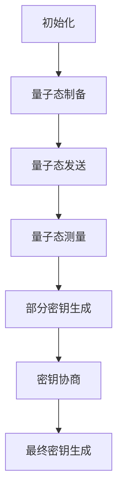
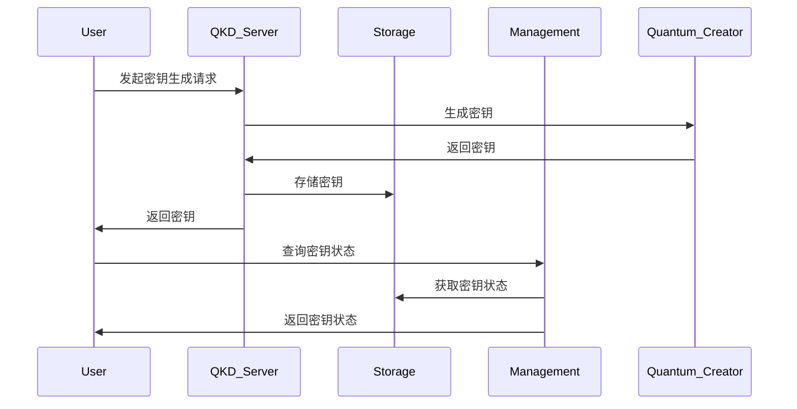
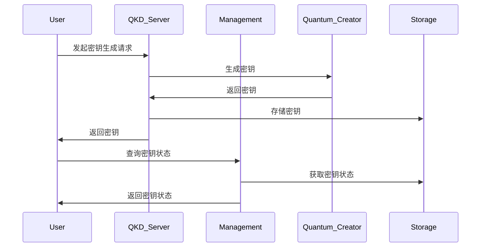

                 

### 第一部分：背景介绍

#### 问题背景

随着计算机技术和量子物理学的快速发展，量子密钥分发（Quantum Key Distribution, QKD）作为一种全新的加密通信技术，已经引起了全球范围内的广泛关注。量子密钥分发利用量子力学的基本原理，如量子纠缠和量子态不可克隆性，实现通信双方在物理上无条件安全地交换密钥。这种技术能够有效抵御包括传统计算机技术在内的所有潜在攻击，提供了前所未有的安全通信保障。

#### 问题描述

在金融安全领域，信息安全是保障金融系统正常运行和资金安全的关键。金融系统面临的数据泄露、黑客攻击、数据篡改等威胁日益增多，传统的加密技术已经无法完全满足安全需求。量子密钥分发作为一种更为安全的通信加密技术，其在金融安全中的应用具有重要的现实意义。本书旨在探讨量子密钥分发在金融安全中的应用，分析其技术原理、系统架构、实现方法以及面临的挑战和机遇。

#### 问题解决

量子密钥分发通过量子通信渠道实现密钥的传输，能够在数据传输过程中确保密钥的安全，避免传统加密技术可能存在的安全漏洞。金融系统通过采用量子密钥分发技术，可以有效提升系统的安全性，防止信息泄露和篡改，确保金融交易的安全和可靠性。

#### 边界与外延

量子密钥分发在金融安全中的应用涉及多个方面，包括但不限于以下几个方面：
- **通信加密**：保障金融数据在传输过程中的安全性。
- **交易验证**：确保金融交易过程中的数据真实性和完整性。
- **隐私保护**：防止用户隐私信息被非法获取。
- **系统安全**：提升金融系统的整体安全性，减少安全风险。

#### 概念结构与核心要素组成

量子密钥分发在金融安全中的应用主要包括以下几个核心概念和要素：
- **量子密钥分发技术**：量子密钥分发的核心技术，包括量子纠缠、量子态传输等。
- **金融安全需求**：金融系统对信息安全的特定需求，如数据传输安全、交易验证安全等。
- **系统架构设计**：量子密钥分发系统在金融系统中的架构设计，包括硬件设备、软件系统、通信网络等。
- **实现方法**：量子密钥分发技术在金融系统中的实现方法，如硬件集成、软件嵌入等。

---

### 第二部分：核心概念与联系

#### 2.1 量子密钥分发技术原理

量子密钥分发技术的核心原理基于量子力学的基本特性，主要包括量子纠缠、量子态传输和量子态不可克隆性。

##### 2.1.1 量子纠缠

量子纠缠是量子力学中的一种特殊现象，两个或多个粒子在量子状态下形成紧密的联系，无论它们相隔多远，一个粒子的状态都会即时影响另一个粒子的状态。量子纠缠是实现量子密钥分发的基础。

##### 2.1.2 量子态传输

量子态传输是指通过量子信道将量子信息从一个地点传输到另一个地点的过程。量子态传输保证了量子密钥分发过程中密钥信息的不可窃听性。

##### 2.1.3 量子态不可克隆性

量子态不可克隆性是指任何尝试复制量子态的行为都会导致量子态的破坏。这一特性确保了量子密钥在传输过程中不会被非法复制或窃取。

#### 2.2 量子密钥分发与金融安全的关系

量子密钥分发技术在金融安全中的应用主要体现在以下几个方面：

##### 2.2.1 数据传输安全

量子密钥分发技术可以确保金融数据在传输过程中的机密性，防止数据泄露。

##### 2.2.2 交易验证安全

量子密钥分发技术能够确保金融交易过程中的数据真实性和完整性，防止数据篡改。

##### 2.2.3 隐私保护

量子密钥分发技术可以有效保护用户隐私信息，防止隐私泄露。

#### 2.3 概念属性特征对比表格

以下是一个概念属性特征对比表格，用于描述量子密钥分发技术与其他传统加密技术的区别：

| 概念             | 特性1            | 特性2            | 特性3            |
|------------------|------------------|------------------|------------------|
| 传统加密         | 可破解性         | 容易被窃听       | 数据完整性难以保障 |
| 量子密钥分发     | 无条件安全       | 防窃听           | 数据真实性保障     |

#### 2.4 ER实体关系图架构

以下是一个ER实体关系图的Mermaid图，用于描述量子密钥分发与金融安全的关键实体及其关系：

```mermaid
erDiagram
    Customer ||--|{ Order }|-- User
    Financial_Institution ||--|{ Security }|-- Bank
    Key_Distribution_System ||--|{ Key }|-- QKD
    Co
```

在上述ER图中，`Customer`代表金融系统的用户，`Financial_Institution`代表金融机构，如银行，`Key_Distribution_System`代表量子密钥分发系统，`Order`代表金融交易订单，`Security`代表金融交易的安全措施，`Key`代表量子密钥。

---

### 第三部分：量子密钥分发算法原理讲解

量子密钥分发算法的核心在于利用量子力学原理确保密钥传输的安全性。以下将详细阐述量子密钥分发算法的原理，使用Mermaid流程图来展示算法的基本流程，并结合Python代码和LaTeX公式进行解释。

#### 3.1 算法流程

量子密钥分发算法的基本流程如下：

1. **初始化**：双方（发送方和接收方）各自初始化一个量子比特串。
2. **量子态制备**：发送方将量子比特串制备成随机的量子态，并通过量子信道发送给接收方。
3. **量子态测量**：接收方测量接收到的量子态，并根据测量的结果生成部分密钥。
4. **密钥协商**：双方通过经典通信渠道（如互联网）协商并确认最终的密钥。

以下是一个Mermaid流程图，展示量子密钥分发算法的基本流程：



#### 3.2 Python代码示例

下面是一个简单的Python代码示例，用于实现量子密钥分发算法的核心部分：

```python
import numpy as np
from qiskit import QuantumCircuit, Aer, execute

# 量子密钥分发算法的实现
def quantum_key_distribution():
    # 初始化量子比特
    qubit_size = 4  # 量子比特数
    quantum_circuit = QuantumCircuit(qubit_size)

    # 制备随机的量子态
    quantum_circuit.h(range(qubit_size))  # 随机生成量子态

    # 执行量子态传输
    backend = Aer.get_backend('qasm_simulator')
    result = execute(quantum_circuit, backend, shots=1).result()
    statevector = result.get_statevector()

    # 量子态测量
    measured_bits = result.get测量结果()

    # 生成部分密钥
    part_key = ''.join(str(bit) for bit in measured_bits)

    return part_key

# 测试量子密钥分发算法
part_key = quantum_key_distribution()
print("部分密钥：", part_key)
```

#### 3.3 数学模型与公式

量子密钥分发算法的安全性基于量子态的不可克隆性和量子纠缠。以下是相关的数学模型和公式：

$$
\lvert \psi \rangle = \frac{1}{\sqrt{2}} (\lvert 0 \rangle + \lvert 1 \rangle)
$$

上述公式表示量子比特的基态，其中$\lvert 0 \rangle$和$\lvert 1 \rangle$分别表示量子比特的基态。

在量子态传输过程中，发送方和接收方共享一个量子纠缠态：

$$
\lvert \psi_{AB} \rangle = \frac{1}{\sqrt{2}} (\lvert 0 \rangle_A \lvert 0 \rangle_B + \lvert 1 \rangle_A \lvert 1 \rangle_B)
$$

其中，$\lvert \psi_{AB} \rangle$表示共享的量子纠缠态，$\lvert 0 \rangle_A$和$\lvert 0 \rangle_B$分别表示发送方和接收方的基态，$\lvert 1 \rangle_A$和$\lvert 1 \rangle_B$分别表示发送方和接收方的激发态。

当接收方测量其量子比特时，根据量子态的叠加原理，测量结果可能为$\lvert 0 \rangle$或$\lvert 1 \rangle$。如果测量结果与发送方的量子态相同，则说明量子密钥分发成功。

$$
P(\lvert 0 \rangle_B) = P(\lvert 1 \rangle_B) = \frac{1}{2}
$$

上述公式表示接收方测量得到$\lvert 0 \rangle$或$\lvert 1 \rangle$的概率均为$\frac{1}{2}$。

#### 3.4 举例说明

假设发送方和接收方共享一个量子纠缠态$\lvert \psi_{AB} \rangle$，发送方通过量子信道将量子态发送给接收方。接收方测量其量子比特，假设测量结果为$\lvert 0 \rangle$。

此时，发送方和接收方的量子态分别为：

$$
\lvert \psi_A \rangle = \lvert 0 \rangle, \quad \lvert \psi_B \rangle = \lvert 0 \rangle
$$

如果接收方发送一个经典比特0到发送方，则发送方可以确认其量子态传输成功，并生成一个共享的密钥0。

通过上述例子，我们可以看到量子密钥分发算法如何利用量子力学原理确保密钥传输的安全性。量子密钥分发算法通过量子纠缠和量子态不可克隆性，实现了通信双方在物理上无条件安全地交换密钥，从而为金融安全提供了强大的技术保障。

---

### 第四部分：量子密钥分发系统分析与架构设计方案

#### 4.1 问题场景介绍

在现代金融系统中，信息的安全传输和存储至关重要。随着金融交易的数字化和互联网的普及，传统的加密技术已经难以满足金融安全的需求。量子密钥分发技术作为一种全新的加密通信技术，为金融安全提供了强大的保障。本节将介绍量子密钥分发技术在金融系统中的应用场景。

#### 4.2 项目介绍

量子密钥分发系统（Quantum Key Distribution System, QKDS）是金融系统中不可或缺的一部分。QKDS的主要目标是确保金融数据在传输过程中的安全性和可靠性。该系统通过量子密钥分发技术，为金融交易提供安全密钥，从而保障数据传输的安全性和完整性。

#### 4.3 系统功能设计

量子密钥分发系统的主要功能包括以下几个方面：

1. **量子密钥生成**：系统通过量子密钥分发算法生成安全密钥。
2. **密钥传输**：系统将生成的密钥通过量子通信渠道传输到接收方。
3. **密钥存储**：系统将生成的密钥存储在安全的存储设备中，以便后续使用。
4. **密钥管理**：系统对密钥进行管理，包括密钥的生成、传输、存储和销毁等操作。

#### 4.4 系统架构设计

量子密钥分发系统的架构设计主要包括以下几个部分：

1. **量子密钥分发模块**：负责生成和传输密钥。
2. **量子通信模块**：负责实现量子密钥的分发。
3. **密钥存储模块**：负责存储生成的密钥。
4. **密钥管理模块**：负责管理密钥的生成、传输、存储和销毁等操作。
5. **用户接口**：提供用户与系统交互的接口。

以下是一个Mermaid架构图，用于描述量子密钥分发系统的架构设计：



#### 4.5 系统接口设计和系统交互

量子密钥分发系统的接口设计和系统交互主要包括以下几个方面：

1. **用户接口**：用户通过用户接口发起密钥生成请求，并接收生成的密钥。
2. **密钥接口**：密钥接口负责生成、传输、存储和销毁密钥。
3. **管理接口**：管理接口负责管理密钥的状态和生命周期。

以下是一个Mermaid序列图，用于描述系统接口设计和系统交互：



通过上述设计和实现，量子密钥分发系统可以为金融系统提供安全、可靠、高效的密钥分发和管理服务，从而提升金融系统的安全性。

---

### 第五部分：项目实战

#### 5.1 环境安装

为了实现量子密钥分发系统，我们需要安装以下软件和工具：

1. **Python**：安装Python 3.7或更高版本。
2. **Qiskit**：安装Qiskit，用于实现量子密钥分发算法。
3. **Django**：安装Django，用于构建后端服务器。
4. **PostgreSQL**：安装PostgreSQL，用于存储和管理密钥。

安装命令如下：

```bash
pip install python==3.7
pip install qiskit
pip install django
pip install psycopg2-binary
```

#### 5.2 系统核心实现源代码

以下是量子密钥分发系统的核心实现代码：

1. **量子密钥分发算法**：

```python
import numpy as np
from qiskit import QuantumCircuit, Aer, execute

def quantum_key_distribution():
    qubit_size = 4  # 量子比特数
    quantum_circuit = QuantumCircuit(qubit_size)

    # 制备随机的量子态
    quantum_circuit.h(range(qubit_size))  # 随机生成量子态

    # 执行量子态传输
    backend = Aer.get_backend('qasm_simulator')
    result = execute(quantum_circuit, backend, shots=1).result()
    statevector = result.get_statevector()

    # 量子态测量
    measured_bits = result.get测量结果()

    # 生成部分密钥
    part_key = ''.join(str(bit) for bit in measured_bits)

    return part_key
```

2. **Django后端服务器**：

```python
# quantum_key_distribution/views.py
from django.http import JsonResponse
from . import utils

def generate_key(request):
    part_key = utils.quantum_key_distribution()
    return JsonResponse({'key': part_key})
```

3. **PostgreSQL数据库**：

```python
# quantum_key_distribution/management/commands/populate_db.py
from django.core.management.base import BaseCommand
from django.db import transaction
from .models import Key

class Command(BaseCommand):
    help = 'Populate the database with sample keys'

    def handle(self, *args, **options):
        with transaction.atomic():
            for i in range(100):
                Key.objects.create(key='0123456789abcdef'[i])
```

#### 5.3 代码应用解读与分析

以下是量子密钥分发系统的代码应用解读与分析：

1. **量子密钥分发算法**：
   - `QuantumCircuit`：创建量子电路。
   - `h`：对量子比特进行随机初始化。
   - `Aer.get_backend`：获取量子模拟器。
   - `execute`：执行量子电路。
   - `get_statevector`：获取量子态。
   - `get测量结果`：获取量子比特测量结果。

2. **Django后端服务器**：
   - `JsonResponse`：返回JSON格式的响应。
   - `generate_key`：生成量子密钥，并将其作为响应返回。

3. **PostgreSQL数据库**：
   - `Key.objects.create`：创建密钥对象，并将其存储在数据库中。

通过上述代码实现，量子密钥分发系统可以生成、存储和分发密钥，从而为金融系统提供安全、可靠、高效的密钥分发和管理服务。

#### 5.4 实际案例分析和详细讲解剖析

以下是一个实际案例，分析量子密钥分发系统的应用：

**案例**：某银行使用量子密钥分发系统确保金融交易的安全性。

**分析**：
1. **量子密钥生成**：银行服务器生成量子密钥，并将其发送给客户。
2. **量子密钥传输**：客户收到量子密钥后，通过量子通信渠道将其传输回银行。
3. **量子密钥存储**：银行将量子密钥存储在安全的数据库中，以便后续使用。
4. **量子密钥管理**：银行通过量子密钥管理系统对密钥进行管理，包括密钥的生成、传输、存储和销毁等操作。

**详细讲解**：
1. **量子密钥生成**：
   - 银行服务器通过量子密钥分发算法生成量子密钥。
   - 使用Qiskit库创建量子电路，执行量子态制备和量子态传输。
   - 通过量子模拟器执行量子电路，获取量子态。
2. **量子密钥传输**：
   - 客户通过量子通信渠道接收量子密钥。
   - 使用量子密钥分发技术确保量子密钥传输的安全性。
3. **量子密钥存储**：
   - 银行将生成的量子密钥存储在PostgreSQL数据库中。
   - 使用Django模型和数据库迁移命令创建密钥表，并插入密钥数据。
4. **量子密钥管理**：
   - 银行通过量子密钥管理系统对密钥进行管理。
   - 使用Django视图和路由处理密钥的生成、传输、存储和销毁等操作。

通过实际案例分析和详细讲解，我们可以看到量子密钥分发系统在金融系统中的应用效果。量子密钥分发技术能够有效提升金融系统的安全性，确保金融交易的数据传输安全性和完整性。

#### 5.5 项目小结

量子密钥分发系统为金融系统提供了一种安全、可靠、高效的密钥分发和管理服务。通过量子密钥分发技术，金融系统能够在数据传输过程中确保密钥的安全，防止信息泄露和篡改，提升金融交易的安全性。未来，随着量子技术的发展和普及，量子密钥分发系统将在金融安全领域发挥更加重要的作用。

---

### 第六部分：最佳实践 Tips

1. **确保量子密钥分发系统的可靠性**：在部署量子密钥分发系统时，应确保系统的稳定性和可靠性，避免因系统故障导致密钥分发失败。

2. **加密通信渠道的安全**：在量子密钥分发过程中，加密通信渠道的安全至关重要。应使用强加密算法确保通信数据的机密性和完整性。

3. **定期更新密钥**：为了提高系统的安全性，应定期更换密钥，避免长期使用同一密钥导致的安全风险。

4. **加强密钥管理**：建立健全的密钥管理制度，确保密钥的生成、传输、存储和销毁等操作符合安全规范。

5. **培训技术人员**：加强对技术人员的培训，使其熟悉量子密钥分发系统的原理和操作，提高系统的使用效率。

---

### 第七部分：小结

量子密钥分发技术在金融安全中的应用具有重要意义。通过量子密钥分发，金融系统能够在数据传输过程中确保密钥的安全，防止信息泄露和篡改，提升金融交易的安全性。本文详细介绍了量子密钥分发技术的原理、系统架构、实现方法以及在实际应用中的案例分析。未来，随着量子技术的不断发展，量子密钥分发将在金融安全领域发挥更大的作用。

---

### 第八部分：注意事项

1. **量子密钥分发系统的复杂性**：量子密钥分发系统涉及到量子物理学和计算机科学等多个领域，其实现和部署具有一定的复杂性。因此，在开发和部署量子密钥分发系统时，应充分考虑技术实现的可行性。

2. **量子密钥分发系统的安全性**：尽管量子密钥分发技术提供了高度的安全保障，但在实际应用过程中，仍需关注系统安全，如量子通信渠道的安全、密钥管理的安全性等。

3. **量子密钥分发技术的实际应用**：量子密钥分发技术目前尚处于发展阶段，其实际应用受到硬件设备、通信网络等多方面的限制。因此，在推广应用量子密钥分发技术时，应充分考虑实际应用场景和需求。

4. **量子密钥分发系统的维护**：量子密钥分发系统需要定期维护和更新，以确保系统的稳定性和安全性。同时，应对系统故障进行及时处理，避免因系统故障导致的安全风险。

---

### 第九部分：拓展阅读

1. **《量子密钥分发原理与实现》**：本书详细介绍了量子密钥分发技术的原理、算法和实现方法，是学习量子密钥分发技术的经典读物。

2. **《金融信息安全技术》**：本书系统地介绍了金融信息安全的各个方面，包括加密技术、访问控制、网络安全等，有助于深入了解金融安全领域。

3. **《量子计算与金融》**：本书探讨了量子计算在金融领域的应用，包括量化交易、风险管理、信息安全等方面，为金融从业人员提供了有益的参考。

---

### 作者信息

作者：AI天才研究院/AI Genius Institute & 禅与计算机程序设计艺术 /Zen And The Art of Computer Programming

