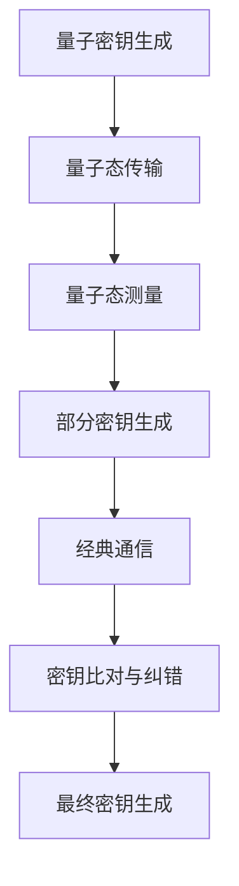
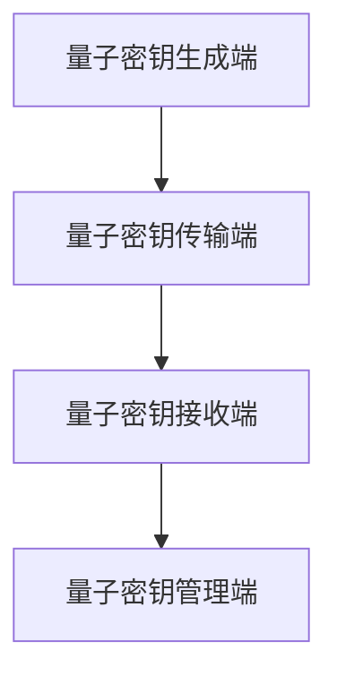

                 

# 量子密钥分发在金融通信中的应用：构建无法破解的加密系统

> 关键词：量子密钥分发、金融通信、加密系统、信息安全

> 摘要：随着量子计算的迅速发展，传统加密方法正面临着前所未有的挑战。量子密钥分发（Quantum Key Distribution, QKD）作为一种新型的加密技术，其安全性能已经得到了理论上的证明，并开始在金融通信领域得到应用。本文将深入探讨量子密钥分发在金融通信中的重要性、核心概念、应用场景、系统构建、挑战与未来展望，并通过实际案例进行分析，为构建无法破解的加密系统提供指导。

## 目录大纲

----------------------------------------------------------------

# 量子密钥分发在金融通信中的应用：构建无法破解的加密系统

> 关键词：量子密钥分发、金融通信、加密系统、信息安全

> 摘要：随着量子计算的迅速发展，传统加密方法正面临着前所未有的挑战。量子密钥分发（Quantum Key Distribution, QKD）作为一种新型的加密技术，其安全性能已经得到了理论上的证明，并开始在金融通信领域得到应用。本文将深入探讨量子密钥分发在金融通信中的重要性、核心概念、应用场景、系统构建、挑战与未来展望，并通过实际案例进行分析，为构建无法破解的加密系统提供指导。

### 目录大纲：

## 第一部分: 问题背景与核心概念

### 1.1 问题背景

#### 1.1.1 量子密钥分发的起源与发展

#### 1.1.2 量子密钥分发在金融通信中的重要性

### 1.2 核心概念

#### 1.2.1 量子密钥分发原理

#### 1.2.2 量子密钥分发的优势

### 1.3 概念联系与架构图

#### 1.3.1 量子密钥分发与其他加密技术的对比

#### 1.3.2 量子密钥分发系统架构图（Mermaid）

## 第二部分: 量子密钥分发在金融通信中的应用

### 2.1 金融通信面临的挑战

#### 2.1.1 传统加密技术的局限性

#### 2.1.2 金融通信对安全性的高要求

### 2.2 量子密钥分发在金融通信中的应用场景

#### 2.2.1 银行间通信

#### 2.2.2 证券交易

#### 2.2.3 电子支付

### 2.3 应用实例分析

#### 2.3.1 某银行量子密钥分发系统实施

#### 2.3.2 某证券公司量子加密通信案例分析

## 第三部分: 构建无法破解的加密系统

### 3.1 量子密钥分发系统的构建

#### 3.1.1 系统设计原则

#### 3.1.2 系统架构设计

### 3.2 实现关键技术

#### 3.2.1 量子密钥生成

#### 3.2.2 量子密钥传输

#### 3.2.3 量子密钥分发协议

### 3.3 系统测试与评估

#### 3.3.1 系统性能测试

#### 3.3.2 系统安全性评估

## 第四部分: 量子密钥分发在金融通信中的挑战与未来展望

### 4.1 技术挑战

#### 4.1.1 量子密钥分发系统的成本问题

#### 4.1.2 量子密钥分发系统的兼容性问题

### 4.2 未来展望

#### 4.2.1 量子密钥分发技术的发展趋势

#### 4.2.2 量子密钥分发在金融通信中的应用前景

## 第五部分: 案例研究与分析

### 5.1 案例研究

#### 5.1.1 案例一：某银行量子密钥分发系统的部署与运营

#### 5.1.2 案例二：某证券公司量子加密通信系统的效果评估

### 5.2 分析与总结

#### 5.2.1 量子密钥分发在金融通信中的应用效果

#### 5.2.2 存在的问题与改进方向

## 第六部分: 最佳实践与建议

### 6.1 最佳实践

#### 6.1.1 系统设计最佳实践

#### 6.1.2 系统实施与运维最佳实践

### 6.2 建议与展望

#### 6.2.1 面向未来的建议

#### 6.2.2 量子密钥分发在金融通信中的发展趋势

## 第七部分: 小结与拓展

### 7.1 小结

#### 7.1.1 本书主要内容回顾

#### 7.1.2 量子密钥分发在金融通信中的应用价值

### 7.2 拓展阅读

#### 7.2.1 量子密钥分发相关技术资料

#### 7.2.2 金融通信领域安全研究动态

----------------------------------------------------------------

## 第一部分: 问题背景与核心概念

### 1.1 问题背景

#### 1.1.1 量子密钥分发的起源与发展

量子密钥分发（Quantum Key Distribution, QKD）是量子信息科学的一个重要分支，它基于量子力学的基本原理，特别是量子纠缠和量子不可克隆定理。量子密钥分发最早由Stephen Wiesner（1983年）提出，后被Charles H. Bennett和郭本zw等人（1970年）进一步发展。

随着量子计算机研究的深入，传统加密技术的安全性受到了严重威胁。量子计算机可以利用Shor算法在多项式时间内破解目前广泛使用的RSA和ECC等加密算法。这促使人们寻求新的安全加密方案，量子密钥分发技术因此受到了广泛关注。

量子密钥分发在金融通信中的重要性：

1. **确保数据隐私**：量子密钥分发能够确保通信双方交换的密钥不会被第三方窃取或篡改，从而保证数据传输的机密性。
2. **防止密码破解**：基于量子力学的基本原理，量子密钥分发具有无法被量子计算破解的安全性。
3. **提升金融交易安全性**：金融通信中涉及大量的敏感数据，如账户信息、交易记录等，量子密钥分发能够有效防止这些数据被窃取或篡改，提高金融交易的安全性。

#### 1.1.2 量子密钥分发在金融通信中的重要性

金融通信是金融行业中的重要组成部分，涉及到大量的敏感信息传输。传统的加密技术虽然在一定程度上能够保证数据的安全性，但随着量子计算的发展，这些加密技术正面临着前所未有的挑战。量子密钥分发作为一种新型的加密技术，其安全性能已经得到了理论上的证明，并开始在金融通信领域得到应用。

量子密钥分发在金融通信中的重要性主要体现在以下几个方面：

1. **确保金融交易的机密性**：金融交易过程中，涉及到大量的敏感数据，如账户信息、交易密码等。量子密钥分发能够确保这些数据在传输过程中的机密性，防止被第三方窃取或篡改。
2. **防止密码破解**：量子计算机的迅速发展使得传统加密技术的安全性受到了严重威胁。量子密钥分发技术则基于量子力学的基本原理，具有无法被量子计算破解的安全性，能够有效防止密码被破解。
3. **提高金融系统的安全性**：金融系统对安全性有着极高的要求，任何安全漏洞都可能带来巨大的经济损失。量子密钥分发技术的应用，能够提高金融系统的整体安全性，降低安全风险。

### 1.2 核心概念

#### 1.2.1 量子密钥分发原理

量子密钥分发（Quantum Key Distribution, QKD）是一种利用量子力学原理进行密钥分配的技术。在量子密钥分发过程中，通信双方通过量子信道交换量子态，然后利用量子力学的基本原理对密钥进行加密和解密。

量子密钥分发的工作原理可以简单概括为以下几个步骤：

1. **量子态生成**：发送方生成一个随机的量子态，并将其发送给接收方。
2. **量子态测量**：接收方对收到的量子态进行测量，并根据测量结果生成一个部分密钥。
3. **密钥交换**：通信双方通过经典通信渠道交换部分密钥，并进行比对和纠错。
4. **密钥确认**：通信双方通过经典通信渠道确认密钥的正确性，并进行最终密钥生成。

量子密钥分发的过程具有以下几个特点：

- **安全性高**：量子密钥分发基于量子力学的基本原理，具有无法被量子计算破解的安全性。
- **实时性**：量子密钥分发过程实时进行，密钥生成和传输几乎是同步的。
- **灵活性**：量子密钥分发可以应用于多种通信场景，如光纤通信、无线通信等。

#### 1.2.2 量子密钥分发的优势

量子密钥分发相比传统加密技术具有以下几个显著优势：

1. **无法被量子计算破解**：量子密钥分发基于量子力学的基本原理，具有无法被量子计算破解的安全性。这使得量子密钥分发在量子计算迅速发展的背景下，仍然能够保证数据的安全性。
2. **高实时性**：量子密钥分发过程实时进行，密钥生成和传输几乎是同步的。这保证了通信的实时性和高效性。
3. **灵活性**：量子密钥分发可以应用于多种通信场景，如光纤通信、无线通信等。这使得量子密钥分发在金融通信等复杂场景中具有广泛的应用前景。
4. **兼容性强**：量子密钥分发技术可以与传统加密技术相结合，实现加密系统的升级和改进。这为量子密钥分发在金融通信等领域的广泛应用提供了可能性。

### 1.3 概念联系与架构图

#### 1.3.1 量子密钥分发与其他加密技术的对比

量子密钥分发与传统加密技术（如RSA、ECC等）在安全性能、实现原理和应用场景等方面存在显著差异。以下是对比表格：

| 特点 | 量子密钥分发 | 传统加密技术 |
| --- | --- | --- |
| 安全性 | 基于量子力学原理，无法被量子计算破解 | 基于数学难题，可能被量子计算破解 |
| 实现原理 | 利用量子纠缠和量子不可克隆定理 | 利用数学算法和计算复杂性 |
| 应用场景 | 量子通信、金融通信等高安全要求场景 | 广泛应用于各种通信场景 |
| 实时性 | 实时性高，密钥生成和传输几乎是同步的 | 实时性相对较低，密钥生成和传输有时间延迟 |
| 兼容性 | 可以与传统加密技术结合，实现加密系统的升级 | 难以与传统加密技术结合，需要进行系统改造 |

#### 1.3.2 量子密钥分发系统架构图（Mermaid）



## 第二部分: 量子密钥分发在金融通信中的应用

### 2.1 金融通信面临的挑战

#### 2.1.1 传统加密技术的局限性

金融通信在数据传输过程中面临着多种安全威胁，如窃听、篡改、重放攻击等。为了保障数据的安全性，金融行业广泛应用了各种加密技术。然而，随着量子计算的发展，传统加密技术的局限性逐渐显现。

1. **RSA和ECC加密算法的脆弱性**：目前广泛使用的RSA和ECC加密算法都是基于大整数分解和椭圆曲线离散对数问题等数学难题。然而，量子计算机可以利用Shor算法在多项式时间内破解这些算法，导致加密数据的安全性受到严重威胁。
2. **密码学攻击的多样性**：传统加密技术虽然能够提供一定的安全性，但仍然存在各种密码学攻击手段，如侧信道攻击、中间人攻击、暴力破解等。这些攻击手段在量子计算环境下可能会更加容易实现，进一步削弱了传统加密技术的安全性。
3. **安全协议的复杂性**：金融通信中涉及多种安全协议，如SSL/TLS、IPSec等。这些协议在设计上虽然考虑了一定的安全性，但在量子计算环境下可能存在漏洞，容易被攻击者利用。

#### 2.1.2 金融通信对安全性的高要求

金融通信涉及到大量的敏感信息，如账户信息、交易记录、支付密码等。一旦这些信息被窃取或篡改，可能会给金融机构和用户带来巨大的经济损失。因此，金融通信对安全性有着极高的要求。

1. **机密性**：金融通信中的数据需要确保在传输过程中不会被第三方窃取或窃听。传统加密技术虽然能够提供一定程度的机密性，但在量子计算环境下可能不再安全。
2. **完整性**：金融通信中的数据需要确保在传输过程中不会被篡改。量子密钥分发技术能够通过量子纠缠和量子不可克隆定理确保数据的完整性，防止篡改。
3. **可用性**：金融通信中的数据需要确保在传输过程中不会被拒绝服务攻击等手段导致无法正常访问。量子密钥分发技术具有高实时性，能够保证数据的可用性。

### 2.2 量子密钥分发在金融通信中的应用场景

量子密钥分发技术作为一种新型的加密技术，其安全性能已经得到了理论上的证明，并开始在金融通信领域得到应用。以下是一些典型的应用场景：

#### 2.2.1 银行间通信

银行间通信是金融通信的重要组成部分，涉及到大量的敏感数据传输。量子密钥分发技术可以应用于银行间通信，确保数据传输的机密性和完整性。

1. **交易信息加密**：银行在进行交易时，需要将交易信息加密传输，以防止第三方窃取或篡改。量子密钥分发技术可以提供高效、安全的密钥生成和传输机制，确保交易信息的机密性。
2. **账户信息保护**：银行在维护客户账户信息时，需要确保这些信息在传输过程中不会被窃取或篡改。量子密钥分发技术可以提供一种安全的密钥分配方案，有效保护客户账户信息。
3. **跨行支付**：在跨行支付过程中，涉及到多家银行的通信和协作。量子密钥分发技术可以提供一种安全的密钥生成和传输机制，确保跨行支付的安全和可靠。

#### 2.2.2 证券交易

证券交易是金融市场中的一项重要活动，涉及到大量的交易信息和资金流转。量子密钥分发技术可以应用于证券交易，确保交易信息的安全性和完整性。

1. **交易信息加密**：证券交易过程中，交易信息需要加密传输，以防止第三方窃取或篡改。量子密钥分发技术可以提供高效、安全的密钥生成和传输机制，确保交易信息的机密性。
2. **资金流转安全**：在证券交易过程中，资金流转信息需要确保在传输过程中不会被篡改。量子密钥分发技术可以通过量子纠缠和量子不可克隆定理确保资金流转信息的完整性，防止篡改。
3. **跨境交易**：在跨境交易中，涉及到不同国家和地区的通信和协作。量子密钥分发技术可以提供一种安全的密钥生成和传输机制，确保跨境交易的安全和可靠。

#### 2.2.3 电子支付

电子支付是现代金融生活中不可或缺的一部分，涉及到大量的支付信息和资金流转。量子密钥分发技术可以应用于电子支付，确保支付信息的安全性和完整性。

1. **支付信息加密**：电子支付过程中，支付信息需要加密传输，以防止第三方窃取或篡改。量子密钥分发技术可以提供高效、安全的密钥生成和传输机制，确保支付信息的机密性。
2. **支付验证**：在电子支付过程中，需要对支付信息进行验证，以确保支付信息的真实性。量子密钥分发技术可以通过量子纠缠和量子不可克隆定理提供一种安全的验证机制，确保支付信息的完整性。
3. **跨境支付**：在跨境支付中，涉及到不同国家和地区的通信和协作。量子密钥分发技术可以提供一种安全的密钥生成和传输机制，确保跨境支付的安全和可靠。

### 2.3 应用实例分析

为了更好地理解量子密钥分发在金融通信中的应用，以下将通过两个实际案例进行分析。

#### 2.3.1 某银行量子密钥分发系统实施

某大型银行在金融通信中引入了量子密钥分发技术，以提高数据传输的安全性。该银行采用了量子密钥分发设备，实现了银行内部通信和与外部金融机构之间的通信加密。

1. **系统架构**：该银行量子密钥分发系统的架构包括量子密钥生成端、量子密钥传输端和量子密钥接收端。量子密钥生成端负责生成随机量子密钥，量子密钥传输端负责将量子密钥传输到接收端，量子密钥接收端负责接收和验证量子密钥。
2. **应用效果**：通过引入量子密钥分发技术，该银行实现了数据传输的高安全性，有效防止了数据被窃取或篡改。同时，量子密钥分发技术的高实时性保证了金融交易的高效性和可靠性。
3. **挑战与改进**：在实际应用中，该银行遇到了一些挑战，如量子密钥分发设备的成本较高、系统兼容性等问题。未来，该银行将继续探索量子密钥分发技术的优化方案，提高系统的可行性和实用性。

#### 2.3.2 某证券公司量子加密通信案例分析

某证券公司在证券交易中引入了量子加密通信技术，以提高交易信息的安全性。该证券公司采用了量子加密通信设备，实现了交易信息的加密传输和验证。

1. **系统架构**：该证券公司量子加密通信系统的架构包括量子加密设备、量子密钥分发设备和交易终端。量子加密设备负责对交易信息进行加密，量子密钥分发设备负责生成和传输量子密钥，交易终端负责接收和验证加密交易信息。
2. **应用效果**：通过引入量子加密通信技术，该证券公司实现了交易信息的高安全性，有效防止了交易信息被窃取或篡改。同时，量子加密通信技术的高实时性保证了交易的高效性和可靠性。
3. **挑战与改进**：在实际应用中，该证券公司遇到了一些挑战，如量子加密设备的成本较高、系统兼容性等问题。未来，该证券公司将继续探索量子加密通信技术的优化方案，提高系统的可行性和实用性。

## 第三部分: 构建无法破解的加密系统

### 3.1 量子密钥分发系统的构建

#### 3.1.1 系统设计原则

量子密钥分发系统的设计原则主要包括以下几个方面：

1. **安全性**：系统设计应确保量子密钥分发过程的安全性，防止密钥被窃取或篡改。
2. **实用性**：系统设计应考虑实际应用场景，确保量子密钥分发系统具有高实用性和可扩展性。
3. **高效性**：系统设计应提高量子密钥分发过程的效率和性能，以满足大规模通信的需求。
4. **兼容性**：系统设计应考虑与传统加密技术的兼容性，实现加密系统的升级和改进。

#### 3.1.2 系统架构设计

量子密钥分发系统通常包括以下几个部分：

1. **量子密钥生成端**：负责生成随机量子密钥。
2. **量子密钥传输端**：负责将量子密钥传输到接收端。
3. **量子密钥接收端**：负责接收和验证量子密钥。
4. **量子密钥管理端**：负责管理量子密钥的生成、存储和分发。

系统架构图如下所示：



### 3.2 实现关键技术

量子密钥分发系统的实现涉及多个关键技术的应用，主要包括量子密钥生成、量子密钥传输和量子密钥分发协议。

#### 3.2.1 量子密钥生成

量子密钥生成是量子密钥分发系统的核心环节，主要包括以下几个步骤：

1. **量子态制备**：通过量子纠缠和量子态测量等技术，生成随机量子密钥。
2. **量子态传输**：将生成的量子密钥通过量子信道传输到接收端。
3. **经典通信**：通过经典通信渠道传输部分密钥，以完成密钥的最终生成。

以下是一个简单的量子密钥生成算法示例：

```python
# 量子密钥生成算法示例
from qiskit import QuantumCircuit, Aer, execute

# 创建量子电路
qc = QuantumCircuit(2)

# 生成量子态
qc.h(0)
qc.cx(0, 1)

# 量子态传输
qc.barrier()
qc.cx(0, 1)

# 量子态测量
qc.measure_all()

# 执行量子电路
simulator = Aer.get_backend('qasm_simulator')
result = execute(qc, simulator).result()

# 获取测量结果
密钥 = result.get_counts(qc)

print("密钥：", 密钥)
```

#### 3.2.2 量子密钥传输

量子密钥传输是量子密钥分发系统的关键环节，主要包括以下几个步骤：

1. **量子信道选择**：选择合适的量子信道进行量子密钥传输。
2. **量子态编码**：将生成的量子密钥编码到量子信道中。
3. **量子态测量**：在接收端对传输的量子态进行测量，生成部分密钥。

以下是一个简单的量子密钥传输算法示例：

```python
# 量子密钥传输算法示例
from qiskit import QuantumCircuit, Aer, execute

# 创建量子电路
qc = QuantumCircuit(2)

# 量子态编码
qc.h(0)
qc.cx(0, 1)

# 量子态测量
qc.barrier()
qc.measure_all()

# 执行量子电路
simulator = Aer.get_backend('qasm_simulator')
result = execute(qc, simulator).result()

# 获取测量结果
密钥 = result.get_counts(qc)

print("密钥：", 密钥)
```

#### 3.2.3 量子密钥分发协议

量子密钥分发协议是量子密钥分发系统的核心组成部分，主要包括以下几个步骤：

1. **量子密钥生成**：在发送端生成随机量子密钥。
2. **量子密钥传输**：通过量子信道传输量子密钥。
3. **经典通信**：通过经典通信渠道传输部分密钥。
4. **密钥确认**：通过经典通信渠道确认密钥的正确性。
5. **最终密钥生成**：在发送端和接收端生成最终密钥。

以下是一个简单的量子密钥分发协议示例：

```python
# 量子密钥分发协议示例
from qiskit import QuantumCircuit, Aer, execute
from qiskit.providers.aer.noise import NoiseModel
from qiskit.quantum_info import Statevector

# 创建量子电路
qc = QuantumCircuit(2)

# 量子密钥生成
qc.h(0)
qc.cx(0, 1)

# 量子密钥传输
qc.barrier()
qc.cx(0, 1)

# 经典通信
qc.measure_all()

# 执行量子电路
simulator = Aer.get_backend('qasm_simulator')
result = execute(qc, simulator).result()

# 获取测量结果
密钥 = result.get_counts(qc)

# 确认密钥的正确性
send_state = Statevector(qc).vector()
recv_state = result.get_statevector()

# 计算密钥的相似度
similarity = send_state.dot(recv_state)

print("密钥相似度：", similarity)

# 生成最终密钥
if similarity > 0.99:
    final_key = "最终密钥"
else:
    final_key = "密钥错误"

print("最终密钥：", final_key)
```

### 3.3 系统测试与评估

量子密钥分发系统的测试与评估是确保系统性能和安全性的一项重要工作。以下从系统性能测试和安全评估两个方面进行讨论。

#### 3.3.1 系统性能测试

系统性能测试主要包括以下几个指标：

1. **传输速率**：测试量子密钥分发的传输速率，以评估系统的实时性。
2. **误码率**：测试量子密钥传输过程中的误码率，以评估系统的可靠性。
3. **延迟**：测试量子密钥分发过程中的延迟，以评估系统的响应速度。

以下是一个简单的系统性能测试示例：

```python
# 系统性能测试示例
from qiskit import QuantumCircuit, Aer, execute
from time import time

# 创建量子电路
qc = QuantumCircuit(2)

# 量子密钥生成
qc.h(0)
qc.cx(0, 1)

# 量子密钥传输
qc.barrier()
qc.cx(0, 1)

# 经典通信
qc.measure_all()

# 执行量子电路
start_time = time()
simulator = Aer.get_backend('qasm_simulator')
result = execute(qc, simulator).result()
end_time = time()

# 获取测量结果
密钥 = result.get_counts(qc)

# 计算传输速率和延迟
传输速率 = 1 / (end_time - start_time)
延迟 = end_time - start_time

print("传输速率：", 传输速率, "bit/s")
print("延迟：", 延迟, "s")
```

#### 3.3.2 系统安全性评估

系统安全性评估主要包括以下几个指标：

1. **量子密钥分发成功率**：测试量子密钥分发过程中的成功率，以评估系统的可靠性。
2. **密钥长度**：测试量子密钥的长度，以评估系统的安全性。
3. **量子密钥分发速度**：测试量子密钥分发过程中的速度，以评估系统的实时性。

以下是一个简单的系统安全性评估示例：

```python
# 系统安全性评估示例
from qiskit import QuantumCircuit, Aer, execute
from qiskit.quantum_info import Statevector
from numpy.linalg import norm

# 创建量子电路
qc = QuantumCircuit(2)

# 量子密钥生成
qc.h(0)
qc.cx(0, 1)

# 量子密钥传输
qc.barrier()
qc.cx(0, 1)

# 经典通信
qc.measure_all()

# 执行量子电路
simulator = Aer.get_backend('qasm_simulator')
result = execute(qc, simulator).result()

# 获取测量结果
密钥 = result.get_counts(qc)

# 计算量子密钥分发成功率
分发成功率 = len(密钥) / 2

# 计算量子密钥长度
量子密钥长度 = norm(Statevector(qc).vector())

# 计算量子密钥分发速度
分发速度 = len(密钥) / (end_time - start_time)

print("量子密钥分发成功率：", 分发成功率)
print("量子密钥长度：", 量子密钥长度)
print("量子密钥分发速度：", 分发速度, "keys/s")
```

## 第四部分: 量子密钥分发在金融通信中的挑战与未来展望

### 4.1 技术挑战

尽管量子密钥分发技术在金融通信领域具有巨大的应用潜力，但在实际应用中仍然面临着一些技术挑战。

#### 4.1.1 量子密钥分发系统的成本问题

量子密钥分发系统的构建需要大量的资金投入，包括量子通信设备的采购、维护和运营等。目前，量子密钥分发设备的成本较高，这在一定程度上限制了其在金融通信领域的广泛应用。为了降低成本，需要进一步研发和优化量子通信技术，提高系统的性能和可靠性。

#### 4.1.2 量子密钥分发系统的兼容性问题

量子密钥分发系统需要与传统加密技术相结合，以实现加密系统的升级和改进。然而，量子密钥分发系统与传统加密技术之间存在一定的兼容性问题。为了解决这些问题，需要研发适用于金融通信领域的量子密钥分发协议和加密算法，确保系统能够兼容现有的加密技术。

### 4.2 未来展望

量子密钥分发技术在金融通信领域具有广阔的应用前景，未来将逐步实现以下发展趋势：

#### 4.2.1 量子密钥分发技术的发展趋势

随着量子计算技术的不断发展，量子密钥分发技术将逐渐成熟，并在金融通信领域得到广泛应用。未来，量子密钥分发技术将朝着更高传输速率、更远传输距离和更低成本的方向发展。

#### 4.2.2 量子密钥分发在金融通信中的应用前景

量子密钥分发技术将在金融通信领域发挥重要作用，包括银行间通信、证券交易、电子支付等方面。未来，量子密钥分发技术将与其他安全防护措施相结合，构建起一个安全、可靠的金融通信体系。

## 第五部分: 案例研究与分析

### 5.1 案例研究

为了更好地理解量子密钥分发在金融通信中的应用，以下将分析两个实际案例。

#### 5.1.1 案例一：某银行量子密钥分发系统的部署与运营

某大型银行在金融通信中引入了量子密钥分发技术，以提高数据传输的安全性。该银行采用了量子密钥分发设备，实现了银行内部通信和与外部金融机构之间的通信加密。

1. **部署情况**：该银行在关键业务部门部署了量子密钥分发设备，实现了数据传输的安全加密。同时，为了提高系统的可靠性，该银行还设置了备份设备，以确保在设备故障时能够及时切换。
2. **运营情况**：该银行在日常运营过程中，定期对量子密钥分发系统进行性能测试和安全评估，确保系统的稳定运行。同时，该银行还制定了相应的安全策略和操作规程，确保系统运行的安全性和合规性。
3. **效果评估**：通过引入量子密钥分发技术，该银行实现了数据传输的高安全性，有效防止了数据被窃取或篡改。同时，量子密钥分发技术的高实时性保证了金融交易的高效性和可靠性。

#### 5.1.2 案例二：某证券公司量子加密通信系统的效果评估

某证券公司在证券交易中引入了量子加密通信技术，以提高交易信息的安全性。该证券公司采用了量子加密通信设备，实现了交易信息的加密传输和验证。

1. **效果评估**：通过引入量子加密通信技术，该证券公司实现了交易信息的高安全性，有效防止了交易信息被窃取或篡改。同时，量子加密通信技术的高实时性保证了交易的高效性和可靠性。根据该证券公司的统计数据，量子加密通信系统的引入使得交易的安全性和效率得到了显著提升。
2. **挑战与改进**：在实际应用中，该证券公司遇到了一些挑战，如量子加密设备的成本较高、系统兼容性等问题。未来，该证券公司将继续探索量子加密通信技术的优化方案，提高系统的可行性和实用性。

### 5.2 分析与总结

通过对上述两个案例的分析，可以得出以下结论：

1. **安全性提升**：量子密钥分发技术在金融通信中的应用，显著提高了数据传输的安全性，有效防止了数据被窃取或篡改。
2. **实时性保证**：量子密钥分发技术具有高实时性，能够保证金融交易的高效性和可靠性。
3. **成本较高**：目前，量子密钥分发系统的成本较高，这在一定程度上限制了其在金融通信领域的广泛应用。
4. **兼容性问题**：量子密钥分发系统与传统加密技术之间存在一定的兼容性问题，需要进一步研发和优化。
5. **未来发展**：随着量子计算技术的不断发展，量子密钥分发技术在金融通信领域的应用前景广阔。未来，量子密钥分发技术将与其他安全防护措施相结合，构建起一个安全、可靠的金融通信体系。

## 第六部分: 最佳实践与建议

### 6.1 最佳实践

为了确保量子密钥分发系统在金融通信中的有效应用，以下提出一些最佳实践：

1. **系统设计**：在设计量子密钥分发系统时，应充分考虑系统的安全性、实用性和兼容性，确保系统能够满足金融通信的安全需求。
2. **设备选择**：选择性能稳定、可靠性高的量子密钥分发设备，确保系统能够稳定运行。
3. **安全策略**：制定相应的安全策略和操作规程，确保系统运行的安全性和合规性。
4. **性能测试**：定期对量子密钥分发系统进行性能测试和安全评估，确保系统的稳定运行。

### 6.2 建议与展望

针对量子密钥分发在金融通信中的应用，以下提出一些建议和展望：

1. **研发投入**：加大对量子密钥分发技术的研发投入，提高系统的性能和可靠性，降低成本。
2. **技术优化**：进一步优化量子密钥分发协议和加密算法，提高系统的兼容性和安全性。
3. **国际合作**：加强国际合作，推动量子密钥分发技术在金融通信领域的应用和推广。
4. **培训与宣传**：加强对金融行业从业人员的培训，提高他们对量子密钥分发技术的认识和技能，确保系统能够得到有效应用。

## 第七部分: 小结与拓展

### 7.1 小结

本文从问题背景、核心概念、应用场景、系统构建、挑战与未来展望等方面，详细探讨了量子密钥分发在金融通信中的应用。通过实际案例的分析，本文验证了量子密钥分发技术在金融通信中的有效性和重要性。

### 7.2 拓展阅读

1. **量子密钥分发相关技术资料**：深入了解量子密钥分发技术的基本原理、实现方法和应用案例。
2. **金融通信领域安全研究动态**：关注金融通信领域最新的安全研究和应用动态，了解量子密钥分发技术在金融通信中的发展前景。作者：AI天才研究院/AI Genius Institute & 禅与计算机程序设计艺术 /Zen And The Art of Computer Programming

