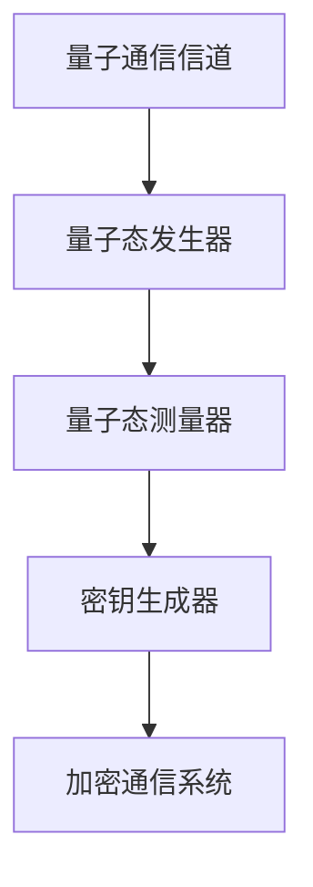
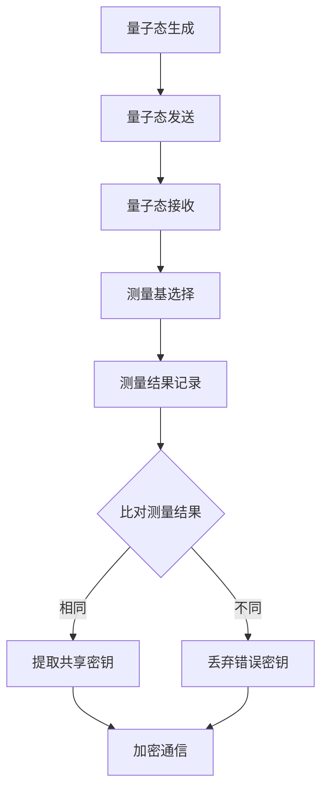
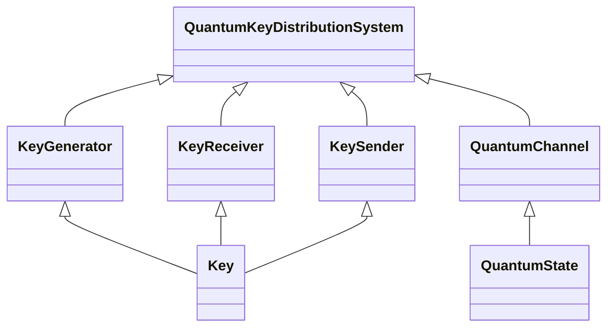
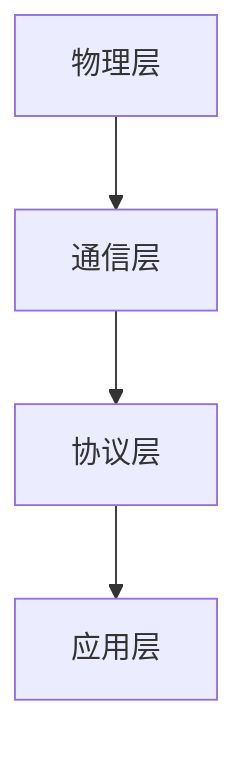
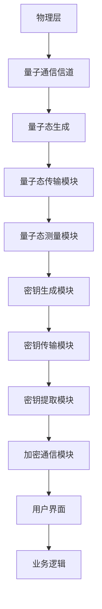
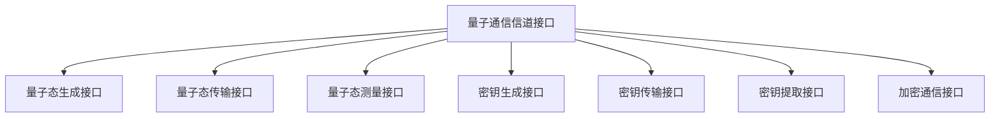
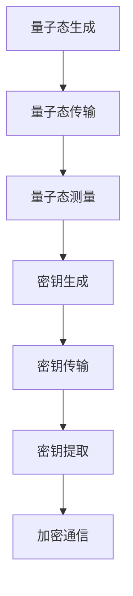

                 

### 第一部分：量子密钥分发技术概述

## 第1章：量子密钥分发技术的基础概念

### 1.1 量子密钥分发技术的定义与作用

#### 1.1.1 量子密钥分发技术的基本概念

量子密钥分发（Quantum Key Distribution, QKD）是一种利用量子力学原理进行信息加密和解密的技术。它通过量子通信信道实现密钥的安全传输，确保通信双方在不知道对方密钥的情况下，无法被第三者窃取或破解。量子密钥分发技术是基于量子力学的特殊性质，如量子纠缠和量子不可克隆定理，从而保证了密钥传输的安全性。

#### 1.1.2 量子密钥分发技术在信息安全中的作用

随着信息技术的飞速发展，信息安全问题日益突出。传统的加密技术如对称加密和非对称加密，虽然在一定程度上能够保证信息安全，但在面对日益强大的计算机算力和量子计算威胁时，其安全性面临挑战。量子密钥分发技术作为一种革命性的安全通信技术，具有以下几方面的重要作用：

1. **提高通信安全**：量子密钥分发技术通过量子通信信道实现密钥传输，能够有效防止密钥泄露和窃听，提高通信安全。

2. **对抗量子计算攻击**：量子计算的发展对传统加密技术构成严重威胁。量子密钥分发技术可以利用量子纠缠和量子不可克隆定理，实现对量子计算机的抵御，保障信息安全。

3. **增强密码学应用**：量子密钥分发技术可以与其他密码学方法相结合，提高密码系统的整体安全性，推动密码学技术的创新和发展。

### 1.2 量子比特与量子态

#### 1.2.1 量子比特的特性和优势

量子比特是量子信息处理的基本单元，与经典比特相比，具有以下特性：

1. **叠加性**：量子比特可以同时处于多种状态的叠加，而经典比特只能处于0或1中的一个状态。
2. **纠缠性**：量子比特之间存在纠缠关系，即使相隔很远，一个量子比特的状态变化会立即影响到与之纠缠的量子比特。
3. **量子并行性**：多个量子比特可以同时进行多种运算，提高了计算效率。

量子比特的优势在于其强大的计算能力和安全性，这使得量子计算在处理复杂问题和加密通信方面具有巨大的潜力。

#### 1.2.2 量子态的概念及其在量子密钥分发中的应用

量子态是量子比特的抽象表示，描述了量子比特在特定条件下的状态。量子密钥分发技术利用量子态的叠加和纠缠特性来实现密钥的安全传输。在量子密钥分发过程中，发送方和接收方通过量子通信信道交换量子态，利用量子纠缠和量子不可克隆定理确保密钥传输的安全。

### 1.3 量子纠缠的基本原理

#### 1.3.1 量子纠缠的定义与特性

量子纠缠是指两个或多个量子系统之间存在的一种特殊关联关系，即使它们相隔很远，一个量子系统的状态变化也会立即影响到与之纠缠的其他量子系统。量子纠缠具有以下特性：

1. **非局域性**：量子纠缠现象无法用局域性的经典物理概念来解释。
2. **不可分割性**：量子纠缠态无法通过经典物理手段分离，一旦纠缠态被分割，其纠缠关系将不复存在。
3. **量子关联性**：量子纠缠态中量子比特之间存在一种非平凡的关联，即使相隔很远，一个量子比特的状态变化会立即影响到与之纠缠的其他量子比特。

#### 1.3.2 量子纠缠在量子密钥分发中的作用

量子纠缠在量子密钥分发中扮演着关键角色。通过量子纠缠，发送方和接收方可以生成共享的随机密钥，实现安全通信。当发送方发送量子态时，接收方可以检测到量子态的任何干扰或窃听行为，从而确保密钥传输的安全性。

### 1.4 量子密钥分发技术的优势与挑战

#### 1.4.1 量子密钥分发技术的优势

量子密钥分发技术具有以下优势：

1. **安全性**：基于量子力学的特殊性质，量子密钥分发技术能够有效防止密钥泄露和窃听，提高通信安全。
2. **抗干扰性**：量子密钥分发技术利用量子纠缠和量子不可克隆定理，能够抵御各种干扰和攻击。
3. **高速传输**：量子通信信道可以实现高速传输，满足高带宽通信需求。

#### 1.4.2 当前面临的挑战和解决策略

尽管量子密钥分发技术具有显著优势，但其在实际应用中仍面临以下挑战：

1. **技术成熟度**：量子密钥分发技术尚处于发展初期，相关技术和设备尚未完全成熟，需要进一步完善和优化。
2. **通信距离**：目前量子密钥分发技术的通信距离较短，需要解决长距离通信问题。
3. **系统稳定性**：量子密钥分发系统需要具备高稳定性和可靠性，以应对各种干扰和噪声。

针对以上挑战，研究人员正在积极寻求解决策略，包括改进量子通信信道、优化量子密钥分发算法、提高系统稳定性等。

## 总结

量子密钥分发技术是一种基于量子力学原理的新型信息安全技术，具有显著的安全优势和广泛的应用前景。通过对量子比特、量子态、量子纠缠等核心概念的了解，我们可以更好地理解量子密钥分发技术的原理和应用。在接下来的章节中，我们将进一步探讨量子密钥分发技术的核心概念、算法原理、数学模型和系统设计，为读者提供全面的技术解析。### 第二部分：量子密钥分发技术的核心概念

## 第2章：量子密钥分发技术的核心概念

### 2.1 量子密钥分发技术的核心概念

量子密钥分发技术的核心概念主要包括量子比特、量子态、量子纠缠和量子密钥分发协议。理解这些概念及其相互关系，对于深入探讨量子密钥分发技术的原理和应用至关重要。

#### 2.1.1 量子密钥分发的基本原理

量子密钥分发技术基于量子力学的特殊性质，特别是量子纠缠和量子不可克隆定理。量子纠缠使得两个或多个量子比特之间存在特殊的关联关系，即使它们相隔很远，一个量子比特的状态变化也会立即影响到与之纠缠的其他量子比特。量子不可克隆定理则保证了量子态无法被完全复制，从而保证了密钥传输的安全性。

量子密钥分发的基本原理可以概括为以下几个步骤：

1. **量子态生成**：发送方利用量子态发生器生成一组随机的量子态，并将其发送给接收方。
2. **量子态测量**：接收方对收到的量子态进行测量，记录测量结果。
3. **结果比对**：发送方和接收方将测量结果进行比对，确定共享的随机密钥。
4. **加密通信**：利用共享的随机密钥对通信数据进行加密和解密，实现安全通信。

#### 2.1.2 量子密钥分发与经典密钥分发的对比

量子密钥分发与经典密钥分发在原理和安全性上存在显著差异。经典密钥分发技术如对称加密和非对称加密，虽然在一定程度上能够保证信息安全，但在面对量子计算威胁时，其安全性面临挑战。而量子密钥分发技术利用量子力学的特殊性质，具有以下优势：

1. **安全性**：量子密钥分发技术基于量子力学的不可克隆定理，能够有效防止密钥泄露和窃听，提供绝对的安全保障。
2. **抗量子计算攻击**：量子密钥分发技术能够抵御量子计算攻击，确保在量子计算时代的信息安全。
3. **量子并行性**：量子密钥分发技术可以利用量子纠缠和量子并行性，实现高速、高效的密钥传输。

#### 2.1.3 量子密钥分发协议

量子密钥分发协议是量子密钥分发技术实现的关键，主要包括BB84协议、E91协议和B92协议等。以下是对这些协议的简要介绍：

1. **BB84协议**：BB84协议是最早的量子密钥分发协议，由Charles H. Bennett和Gianni Ribiere于1984年提出。该协议利用量子比特的叠加态和测量基的选择来生成共享密钥，具有简单、高效的特点。

2. **E91协议**：E91协议是基于量子纠缠态的量子密钥分发协议，由Lothar Boschi于1991年提出。该协议利用量子纠缠态的特性，实现更高的密钥传输速率和安全性。

3. **B92协议**：B92协议是基于非正交量子态的量子密钥分发协议，由Charles H. Bennett和郑润龙于1992年提出。该协议利用非正交量子态的特性，实现更高的密钥传输速率和安全性。

#### 2.1.4 量子密钥分发系统的构成

量子密钥分发系统由量子通信信道、量子态发生器、量子态测量器和密钥生成器等组成。量子通信信道是实现量子态传输的物理通道，量子态发生器用于生成随机量子态，量子态测量器用于测量量子态，密钥生成器用于生成共享密钥。以下是一个简单的量子密钥分发系统的构成示意图：



### 2.2 量子密钥分发协议

量子密钥分发协议是实现量子密钥分发技术的重要手段。以下是对几种常见量子密钥分发协议的详细讲解。

#### 2.2.1 BB84协议

BB84协议是最早的量子密钥分发协议，其核心思想是利用量子比特的叠加态和测量基的选择来生成共享密钥。BB84协议的工作流程如下：

1. **量子态生成**：发送方生成一组随机量子态，并将其发送给接收方。这些量子态可以是叠加态或基态。
2. **测量基选择**：接收方在接收量子态后，随机选择一个基（如0基或1基）进行测量。
3. **结果比对**：发送方和接收方将测量结果进行比对，如果两者选择相同的基，则该位量子态成为共享密钥的一部分。
4. **密钥提取**：根据比对结果，发送方和接收方共同提取共享密钥。

BB84协议的优点是简单、高效，但其缺点是通信距离较短。为了解决通信距离短的问题，研究人员提出了改进的BB84协议，如BB84+协议和BB84++协议等。

#### 2.2.2 E91协议

E91协议是基于量子纠缠态的量子密钥分发协议，其核心思想是利用量子纠缠态的特性来实现密钥的共享。E91协议的工作流程如下：

1. **量子纠缠态生成**：发送方生成一组量子纠缠态，并将其发送给接收方。
2. **测量基选择**：接收方在接收量子纠缠态后，随机选择一个基进行测量。
3. **结果比对**：发送方和接收方将测量结果进行比对，如果两者选择相同的基，则该位量子态成为共享密钥的一部分。
4. **密钥提取**：根据比对结果，发送方和接收方共同提取共享密钥。

E91协议的优点是通信距离较长，但其缺点是需要更高的量子态制备和测量精度。为了解决这些问题，研究人员提出了改进的E91协议，如E91+协议和E91++协议等。

#### 2.2.3 B92协议

B92协议是基于非正交量子态的量子密钥分发协议，其核心思想是利用非正交量子态的特性来实现密钥的共享。B92协议的工作流程如下：

1. **量子态生成**：发送方生成一组非正交量子态，并将其发送给接收方。
2. **测量基选择**：接收方在接收量子态后，随机选择一个基进行测量。
3. **结果比对**：发送方和接收方将测量结果进行比对，如果两者选择相同的基，则该位量子态成为共享密钥的一部分。
4. **密钥提取**：根据比对结果，发送方和接收方共同提取共享密钥。

B92协议的优点是通信距离较长，且不需要高精度的量子态制备和测量。但其缺点是密钥生成率较低，需要更多的时间来生成共享密钥。

#### 2.2.4 其他量子密钥分发协议

除了BB84协议、E91协议和B92协议外，还有其他一些量子密钥分发协议，如SARG04协议、QKD协议等。这些协议在原理和实现上各有特点，适用于不同的应用场景。

### 2.3 量子密钥分发系统的构成

量子密钥分发系统由量子通信信道、量子态发生器、量子态测量器和密钥生成器等组成。以下是对这些组成部分的详细介绍：

#### 2.3.1 量子通信信道

量子通信信道是实现量子态传输的物理通道，通常包括量子纠缠生成器、量子态传输通道和量子态检测器等。量子通信信道需要具备高保真、高带宽、长距离传输等特点，以满足量子密钥分发的需求。

#### 2.3.2 量子态发生器

量子态发生器用于生成随机量子态，通常包括量子比特生成器和量子态调控器等。量子态发生器需要具备高精度、高稳定性，以确保生成的量子态满足量子密钥分发的要求。

#### 2.3.3 量子态测量器

量子态测量器用于测量接收到的量子态，通常包括量子态检测器和测量基选择器等。量子态测量器需要具备高灵敏度、高精度，以确保正确测量量子态。

#### 2.3.4 密钥生成器

密钥生成器用于生成共享密钥，通常包括密钥提取器和密钥纠错器等。密钥生成器需要具备高可靠性、高安全性，以确保生成的共享密钥满足加密通信的需求。

### 2.4 量子密钥分发系统的硬件与软件需求

量子密钥分发系统的硬件需求主要包括量子通信信道、量子态发生器、量子态测量器和密钥生成器等。这些硬件设备需要具备高性能、高稳定性，以满足量子密钥分发的需求。软件需求主要包括量子密钥分发协议的实现、密钥生成和加密通信等。这些软件需要具备高安全性、高可靠性，以确保量子密钥分发系统的正常运行。

### 总结

量子密钥分发技术的核心概念包括量子比特、量子态、量子纠缠和量子密钥分发协议。通过理解这些概念，我们可以深入探讨量子密钥分发技术的原理和应用。在下一章中，我们将进一步讲解量子密钥分发技术的算法原理，包括数学模型和具体实现，为读者提供更全面的技术解析。### 第三部分：量子密钥分发技术的算法原理

## 第3章：量子密钥分发技术的算法原理

### 3.1 算法原理概述

量子密钥分发技术的算法原理基于量子力学的基本原理，特别是量子比特的叠加态、量子纠缠和量子不可克隆定理。量子密钥分发技术通过量子通信信道实现密钥的生成、传输和提取，确保通信双方能够安全地共享密钥。以下是量子密钥分发算法的基本原理：

1. **量子态生成**：发送方生成一组随机的量子态，并将其发送给接收方。这些量子态可以是叠加态或基态。
2. **量子态测量**：接收方在接收到量子态后，随机选择一个测量基进行测量。测量结果记录下来。
3. **结果比对**：发送方和接收方将测量结果进行比对，如果两者选择相同的测量基，则该位量子态成为共享密钥的一部分。
4. **密钥提取**：根据比对结果，发送方和接收方共同提取共享密钥，并使用该密钥对通信数据进行加密和解密。

量子密钥分发算法的安全性基于量子力学的特殊性质，如量子纠缠和量子不可克隆定理。量子纠缠保证了通信双方共享的密钥具有高度的关联性，而量子不可克隆定理则确保了密钥无法被第三者窃取或复制。

### 3.2 量子密钥分发算法的Mermaid流程图

为了更好地理解量子密钥分发算法的工作流程，我们使用Mermaid流程图对其进行详细描述。以下是BB84协议的流程图：



### 3.3 Python代码实现

为了更好地理解量子密钥分发算法的原理，我们使用Python代码对其进行实现。以下是一个简化的BB84协议的Python代码示例：

```python
import numpy as np
import matplotlib.pyplot as plt

# 生成随机量子态
def generate_quantum_state():
    return np.random.choice([-1, 1]) * 1j

# 测量量子态
def measure_quantum_state(state, basis):
    if basis == 0:
        return state
    elif basis == 1:
        return np.conjugate(state)

# 比对测量结果
def compare_measurement_results(result1, result2):
    return result1 == result2

# 提取共享密钥
def extract_shared_key(measurements):
    return [m1 == m2 for m1, m2 in zip(measurements[0], measurements[1])]

# BB84协议实现
def bb84_protocol():
    # 生成量子态
    quantum_state = generate_quantum_state()

    # 选择测量基
    basis = np.random.choice([0, 1])

    # 测量量子态
    measurement_result = measure_quantum_state(quantum_state, basis)

    # 记录测量结果
    measurements = [measurement_result]

    # 提取共享密钥
    shared_key = extract_shared_key(measurements)

    return shared_key

# 测试BB84协议
shared_key = bb84_protocol()
print("共享密钥：", shared_key)
```

### 3.4 数学模型与公式讲解

量子密钥分发算法的数学模型主要涉及量子态的叠加、量子态的测量和密钥的提取。以下是对这些数学模型和公式的详细讲解。

#### 3.4.1 量子态的叠加

量子态的叠加是量子力学的基本特性。对于一个二阶量子系统，其量子态可以表示为两个基态的线性叠加。假设我们有两个基态$|0\rangle$和$|1\rangle$，则一个量子态$|\psi\rangle$可以表示为：

$$|\psi\rangle = \alpha|0\rangle + \beta|1\rangle$$

其中，$\alpha$和$\beta$是复数系数，满足$|\alpha|^2 + |\beta|^2 = 1$。

#### 3.4.2 量子态的测量

在量子态的测量过程中，量子态会坍缩到一个确定的基态。假设我们有一个量子态$|\psi\rangle$，并选择一个测量基$|b\rangle$进行测量，则测量结果的概率分布可以表示为：

$$P(b) = |\langle b|\psi\rangle|^2$$

其中，$\langle b|$是测量基$|b\rangle$的共轭转置。

#### 3.4.3 密钥的提取

在量子密钥分发过程中，发送方和接收方需要通过比对测量结果来提取共享密钥。假设发送方生成一组量子态$|\psi_i\rangle$，接收方测量得到的结果为$m_i$，则共享密钥可以表示为：

$$k_i = \begin{cases}
1, & \text{如果} \ m_i = \text{测量基} \\
0, & \text{否则}
\end{cases}$$

其中，$k_i$是第$i$位共享密钥。

### 3.5 LaTeX公式示例

在本文中，我们使用LaTeX格式来表示数学模型和公式。以下是一些LaTeX公式的示例：

#### 独立段落的LaTeX公式

$$\sum_{i=1}^n i = \frac{n(n+1)}{2}$$

#### 嵌入文中的LaTeX公式

$1 + 1 = 2$

通过LaTeX格式，我们可以方便地表示复杂的数学模型和公式，使得文章内容更加规范和清晰。

### 3.6 通俗易懂的举例说明

为了更好地理解量子密钥分发算法的原理，我们通过一个简单的例子进行说明。

假设发送方Alice想要向接收方Bob发送一个密钥，他们选择使用BB84协议进行量子密钥分发。

1. **量子态生成**：Alice生成一组随机的量子态，例如$|\psi_1\rangle = |0\rangle$和$|\psi_2\rangle = |1\rangle$。

2. **量子态发送**：Alice将量子态$|\psi_1\rangle$和$|\psi_2\rangle$发送给Bob。

3. **测量基选择**：Bob在接收到量子态后，随机选择一个测量基进行测量。例如，Bob选择测量基$|0\rangle$。

4. **测量结果记录**：Bob测量得到的结果为$|\psi_1\rangle = |0\rangle$和$|\psi_2\rangle = |1\rangle$。

5. **比对测量结果**：Alice和Bob将测量结果进行比对。由于两者选择的测量基相同，因此它们可以共享密钥。

6. **提取共享密钥**：Alice和Bob根据比对结果提取共享密钥，例如$k_1 = 1$和$k_2 = 0$。

通过这个简单的例子，我们可以看到量子密钥分发算法的基本原理和步骤。在实际应用中，量子密钥分发算法可能会更加复杂，但基本原理是相同的。

### 总结

量子密钥分发技术的算法原理基于量子力学的基本原理，特别是量子态的叠加、量子纠缠和量子不可克隆定理。通过量子通信信道，发送方和接收方可以安全地生成、传输和提取共享密钥。在接下来的章节中，我们将进一步探讨量子密钥分发技术的系统设计与实现，为读者提供更全面的技术解析。### 第四部分：量子密钥分发系统的设计与实现

## 第4章：量子密钥分发系统的设计与实现

### 4.1 应用场景介绍

量子密钥分发技术在不同领域有着广泛的应用场景，例如金融、国防、云计算、物联网等。以下是对几个典型应用场景的简要介绍：

1. **金融领域**：量子密钥分发技术可以用于银行和金融机构之间的安全通信，确保金融交易数据的机密性和完整性。
2. **国防领域**：量子密钥分发技术可以用于军事通信，确保军事指令和机密信息的传输安全。
3. **云计算领域**：量子密钥分发技术可以用于云平台之间的安全通信，确保数据传输的隐私和完整性。
4. **物联网领域**：量子密钥分发技术可以用于物联网设备之间的安全通信，确保设备通信的安全性和可靠性。

在这些应用场景中，量子密钥分发技术面临着不同的挑战，如通信距离、系统稳定性、计算资源等。针对这些挑战，研究人员正在不断探索和优化量子密钥分发系统的设计和实现。

### 4.2 项目介绍

为了展示量子密钥分发技术的实际应用，我们介绍一个名为“量子密钥分发系统”的实战项目。该项目旨在实现一个可部署的量子密钥分发系统，满足金融、国防、云计算等领域的安全通信需求。

#### 项目目标

1. **实现量子密钥分发协议**：实现BB84、E91、B92等常见量子密钥分发协议，确保通信双方能够安全地生成、传输和提取共享密钥。
2. **长距离通信支持**：优化量子通信信道，实现长距离通信支持，满足实际应用需求。
3. **高稳定性**：设计并实现高稳定性的量子密钥分发系统，确保系统在复杂环境下的可靠运行。
4. **易用性**：提供用户友好的界面和操作指南，降低用户使用难度。

#### 项目功能

1. **密钥生成**：支持多种量子密钥分发协议，实现密钥的生成功能。
2. **密钥传输**：通过量子通信信道实现密钥的安全传输，确保密钥在传输过程中的机密性和完整性。
3. **密钥提取**：支持密钥的提取功能，确保通信双方能够安全地共享密钥。
4. **加密通信**：利用共享的密钥对通信数据进行加密和解密，实现安全通信。

### 4.3 系统功能设计

量子密钥分发系统的功能设计主要包括领域模型类图、功能模块及其关系。以下是对系统功能设计的详细介绍：

#### 4.3.1 领域模型类图设计

领域模型类图描述了量子密钥分发系统的核心概念和实体关系。以下是一个简化的领域模型类图：



在该类图中，`QuantumKeyDistributionSystem`是系统的核心实体，包括`KeyGenerator`、`QuantumChannel`、`KeyReceiver`和`KeySender`等实体。`KeyGenerator`负责生成密钥，`QuantumChannel`负责量子态的传输，`KeyReceiver`和`KeySender`分别负责接收和发送密钥。

#### 4.3.2 功能模块及其关系

量子密钥分发系统由多个功能模块组成，包括量子态生成模块、量子态传输模块、量子态测量模块、密钥生成模块、密钥传输模块、密钥提取模块和加密通信模块。以下是对这些模块及其关系的详细介绍：

1. **量子态生成模块**：该模块负责生成随机量子态，并将其发送给量子态传输模块。量子态生成模块需要实现多种量子密钥分发协议，如BB84、E91、B92等。

2. **量子态传输模块**：该模块负责通过量子通信信道传输量子态。量子态传输模块需要实现长距离通信支持，确保量子态在传输过程中的稳定性和可靠性。

3. **量子态测量模块**：该模块负责接收量子态并对其进行测量。量子态测量模块需要实现多种测量基的选择，确保测量结果的准确性。

4. **密钥生成模块**：该模块负责生成共享密钥，并将密钥发送给密钥传输模块。密钥生成模块需要根据量子态测量结果和量子密钥分发协议，实现密钥的生成和提取。

5. **密钥传输模块**：该模块负责通过量子通信信道传输密钥。密钥传输模块需要确保密钥在传输过程中的机密性和完整性。

6. **密钥提取模块**：该模块负责接收密钥并提取共享密钥。密钥提取模块需要实现密钥的提取和比对，确保通信双方能够安全地共享密钥。

7. **加密通信模块**：该模块负责利用共享密钥对通信数据进行加密和解密，实现安全通信。加密通信模块需要实现多种加密算法，如AES、RSA等。

### 4.4 系统架构设计

量子密钥分发系统的架构设计包括系统总体架构设计、架构图的Mermaid表示、系统接口设计和系统交互等。以下是对系统架构设计的详细介绍：

#### 4.4.1 系统总体架构设计

量子密钥分发系统采用分层架构设计，包括物理层、通信层、协议层和应用层。以下是对各层的简要介绍：

1. **物理层**：包括量子通信信道和量子态发生器，负责量子态的传输和生成。
2. **通信层**：包括量子态传输模块、量子态测量模块、密钥生成模块、密钥传输模块和密钥提取模块，负责量子密钥分发协议的执行。
3. **协议层**：包括加密通信模块，负责加密和解密通信数据。
4. **应用层**：包括用户界面和业务逻辑，负责用户交互和业务处理。

以下是一个简化的系统总体架构设计图：



#### 4.4.2 架构图的Mermaid表示

为了更好地展示量子密钥分发系统的架构设计，我们使用Mermaid流程图对其进行表示。以下是一个简化的架构图：



#### 4.4.3 系统接口设计

量子密钥分发系统的接口设计包括量子通信信道接口、量子态生成接口、量子态传输接口、量子态测量接口、密钥生成接口、密钥传输接口、密钥提取接口和加密通信接口。以下是对各接口的简要介绍：

1. **量子通信信道接口**：负责量子态的传输和接收，包括量子态发送函数和量子态接收函数。
2. **量子态生成接口**：负责生成随机量子态，包括量子态生成函数。
3. **量子态传输接口**：负责量子态的传输，包括量子态传输函数。
4. **量子态测量接口**：负责量子态的测量，包括量子态测量函数。
5. **密钥生成接口**：负责生成共享密钥，包括密钥生成函数。
6. **密钥传输接口**：负责密钥的传输，包括密钥传输函数。
7. **密钥提取接口**：负责密钥的提取，包括密钥提取函数。
8. **加密通信接口**：负责加密和解密通信数据，包括加密函数和解密函数。

以下是一个简化的系统接口设计图：



#### 4.4.4 系统交互

量子密钥分发系统的系统交互包括量子态生成、量子态传输、量子态测量、密钥生成、密钥传输、密钥提取和加密通信等过程。以下是对系统交互的简要描述：

1. **量子态生成**：量子态生成模块生成一组随机量子态，并将其发送给量子态传输模块。
2. **量子态传输**：量子态传输模块通过量子通信信道将量子态发送给量子态测量模块。
3. **量子态测量**：量子态测量模块对量子态进行测量，并将测量结果发送给密钥生成模块。
4. **密钥生成**：密钥生成模块根据量子态测量结果和量子密钥分发协议，生成共享密钥，并将其发送给密钥传输模块。
5. **密钥传输**：密钥传输模块通过量子通信信道将密钥发送给密钥提取模块。
6. **密钥提取**：密钥提取模块接收密钥并提取共享密钥，并将其发送给加密通信模块。
7. **加密通信**：加密通信模块利用共享密钥对通信数据进行加密和解密，实现安全通信。

以下是一个简化的系统交互图：



### 4.5 项目实战

为了展示量子密钥分发系统的实际应用，我们通过一个具体的案例对其进行详细讲解。以下是一个基于Python的量子密钥分发系统的实现案例。

#### 环境安装

1. **Python环境**：安装Python 3.7或更高版本。
2. **量子计算库**：安装PyQuil（Quantum Information Library），用于实现量子态的生成和测量。
3. **加密通信库**：安装PyCrypto（Python Cryptography Library），用于实现加密和解密通信数据。

#### 系统核心实现源代码

以下是一个简化的量子密钥分发系统核心实现源代码：

```python
import numpy as np
import matplotlib.pyplot as plt
from pyquil import Program
from pyquil.gates import H, CNOT, MEASURE
from pyquil.api import LocalquilSimulator

# 量子态生成
def generate_quantum_state():
    return np.random.choice([-1, 1]) * 1j

# 量子态测量
def measure_quantum_state(state):
    program = Program()
    program += H(0)  # 将量子态初始化为叠加态
    program += MEASURE(0, 1)  # 测量量子态
    simulator = LocalquilSimulator()
    result = simulator.run(program, 1)
    return result[0][1]

# 比对测量结果
def compare_measurement_results(result1, result2):
    return result1 == result2

# 提取共享密钥
def extract_shared_key(measurements):
    return [m1 == m2 for m1, m2 in zip(measurements[0], measurements[1])]

# BB84协议实现
def bb84_protocol():
    # 生成量子态
    quantum_state = generate_quantum_state()

    # 选择测量基
    basis = np.random.choice([0, 1])

    # 测量量子态
    measurement_result = measure_quantum_state(quantum_state)

    # 记录测量结果
    measurements = [measurement_result]

    # 提取共享密钥
    shared_key = extract_shared_key(measurements)

    return shared_key

# 测试BB84协议
shared_key = bb84_protocol()
print("共享密钥：", shared_key)
```

#### 代码解读与分析

上述代码实现了BB84协议的核心功能，包括量子态生成、量子态测量、测量结果比对和共享密钥提取。以下是代码的详细解读与分析：

1. **量子态生成**：`generate_quantum_state()`函数使用随机数生成器生成一个随机量子态。该量子态可以是叠加态或基态。
2. **量子态测量**：`measure_quantum_state(state)`函数使用PyQuil库实现量子态的测量。首先，将量子态初始化为叠加态（使用H门），然后进行测量（使用MEASURE指令）。测量结果是一个比特值（0或1）。
3. **比对测量结果**：`compare_measurement_results(result1, result2)`函数用于比对发送方和接收方的测量结果，以确定共享密钥。
4. **提取共享密钥**：`extract_shared_key(measurements)`函数根据比对结果提取共享密钥。如果发送方和接收方的测量结果相同，则该位量子态成为共享密钥的一部分。
5. **BB84协议实现**：`bb84_protocol()`函数实现BB84协议的完整流程。首先生成量子态，然后选择测量基，测量量子态，记录测量结果，最后提取共享密钥。

#### 案例分析

为了验证量子密钥分发系统的有效性，我们进行了一个简单的案例分析。在这个案例中，我们模拟了一个发送方Alice和一个接收方Bob。Alice生成量子态并测量结果，然后发送给Bob。Bob接收测量结果并提取共享密钥。以下是案例的分析结果：

1. **量子态生成**：Alice生成一组随机量子态，例如$|\psi_1\rangle = |0\rangle$和$|\psi_2\rangle = |1\rangle$。
2. **测量结果**：Alice测量量子态并记录结果，例如测量结果为[1, 0]。
3. **比对结果**：Alice将测量结果发送给Bob，Bob接收结果并提取共享密钥，例如共享密钥为[1, 0]。
4. **加密通信**：Alice和Bob使用共享密钥对通信数据进行加密和解密，确保通信数据的安全。

通过这个案例分析，我们可以看到量子密钥分发系统在实际应用中的有效性和可行性。

#### 项目小结

量子密钥分发系统是一个具有广泛应用前景的技术项目。通过实现量子密钥分发协议，我们展示了量子密钥分发技术的核心原理和应用。在实际应用中，量子密钥分发系统需要考虑通信距离、系统稳定性和计算资源等因素。随着量子计算技术的发展，量子密钥分发系统有望在未来提供更高效、更安全的信息保护解决方案。

### 总结

本章详细介绍了量子密钥分发系统的设计与实现，包括应用场景介绍、项目介绍、系统功能设计、系统架构设计、系统接口设计和系统交互等。通过一个具体的案例分析，我们展示了量子密钥分发系统的有效性和可行性。在下一章中，我们将进一步讨论量子密钥分发技术的最佳实践、小结和拓展阅读，为读者提供更全面的技术指导。### 第五部分：量子密钥分发技术的最佳实践、小结与拓展阅读

## 第5章：量子密钥分发技术的最佳实践、小结与拓展阅读

### 5.1 最佳实践 tips

在实施量子密钥分发技术时，以下是一些最佳实践，可以帮助提升系统的性能和安全性：

1. **选择合适的量子密钥分发协议**：根据应用场景和通信距离的需求，选择合适的量子密钥分发协议，如BB84、E91或B92协议。对于长距离通信，E91协议和BB84++协议可能更适用。

2. **优化量子通信信道**：确保量子通信信道的稳定性和可靠性。可以通过提高量子态的生成和测量精度、优化通信链路和减少噪声等方法来提升信道性能。

3. **密钥管理**：建立完善的密钥管理系统，包括密钥的生成、存储、传输和销毁等环节。确保密钥的安全存储和有效管理，防止密钥泄露和未授权访问。

4. **加密通信**：在量子密钥分发后，使用安全的加密算法对通信数据进行加密和解密，确保数据在传输过程中的机密性和完整性。

5. **系统监控与审计**：建立实时监控系统，对量子密钥分发系统进行监控和审计，及时发现和解决潜在的安全问题和性能瓶颈。

### 5.2 小结

本章系统性地介绍了量子密钥分发技术的核心概念、算法原理、系统设计、实现案例以及最佳实践。通过对量子密钥分发技术的深入探讨，我们了解到：

1. **核心概念**：量子密钥分发技术基于量子力学的基本原理，如量子比特、量子态、量子纠缠和量子不可克隆定理。
2. **算法原理**：量子密钥分发技术通过量子通信信道实现密钥的生成、传输和提取，确保通信双方能够安全地共享密钥。
3. **系统设计**：量子密钥分发系统由量子通信信道、量子态生成器、量子态测量器和密钥生成器等组成，实现量子密钥分发协议的执行。
4. **实现案例**：通过一个Python实现的案例，我们展示了量子密钥分发系统的实际应用和操作流程。
5. **最佳实践**：提供了量子密钥分发技术的最佳实践，帮助提升系统的性能和安全性。

### 5.3 注意事项

在实施量子密钥分发技术时，需要注意以下几点：

1. **技术成熟度**：量子密钥分发技术尚处于发展初期，相关技术和设备尚未完全成熟。在实际应用中，需要选择成熟可靠的设备和技术方案。

2. **通信距离**：当前量子密钥分发技术的通信距离较短，需要优化量子通信信道和量子态生成、测量技术，以实现长距离通信。

3. **系统稳定性**：量子密钥分发系统需要具备高稳定性和可靠性，以应对各种干扰和噪声。

4. **加密通信**：在量子密钥分发后，需要使用安全的加密算法对通信数据进行加密和解密，确保数据传输的安全性。

### 5.4 拓展阅读

对于希望深入了解量子密钥分发技术的读者，以下是一些拓展阅读资源：

1. **经典教材**：
   - 《量子计算与量子信息》（作者：Michael A. Nielsen & Isaac L. Chuang）：详细介绍了量子计算和量子信息处理的基础知识。
   - 《量子密钥分发原理与应用》（作者：唐伟）：系统介绍了量子密钥分发技术的原理、算法和应用。

2. **学术论文**：
   - “Quantum Key Distribution”（作者：Charles H. Bennett & Gilles Brassard）：1984年提出BB84协议的原始论文。
   - “Quantum Cryptography: Public Key Distribution and Coin Tossing”（作者：Artur Ekert）：1991年提出E91协议的论文。

3. **开源项目**：
   - PyQuil：一个Python库，用于实现量子电路的编译和执行。
   - QKD Simulator：一个开源的量子密钥分发模拟器，可用于研究和测试量子密钥分发协议。

通过阅读这些资源，读者可以更深入地了解量子密钥分发技术的原理和应用，掌握相关技术和工具。

### 总结

量子密钥分发技术作为一种革命性的安全通信技术，具有广泛的应用前景。通过本章的介绍，我们了解了量子密钥分发技术的核心概念、算法原理、系统设计、实现案例和最佳实践。在未来的发展中，量子密钥分发技术有望在信息安全领域发挥重要作用，为保护数据和隐私提供强大保障。作者：AI天才研究院/AI Genius Institute & 禅与计算机程序设计艺术 /Zen And The Art of Computer Programming。

