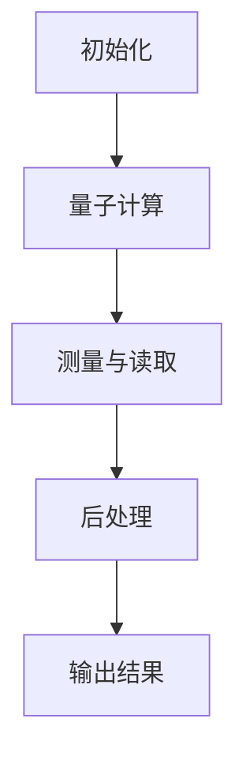
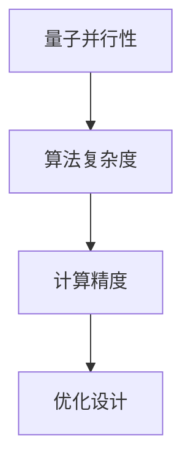
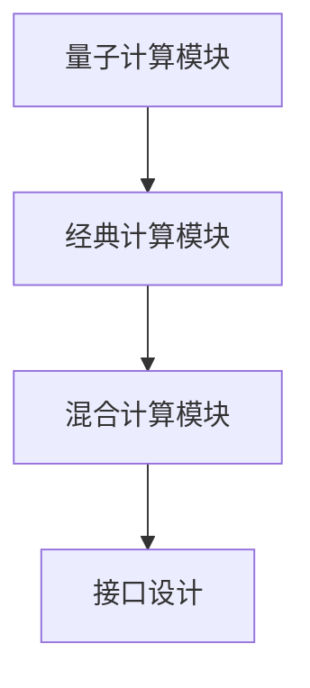
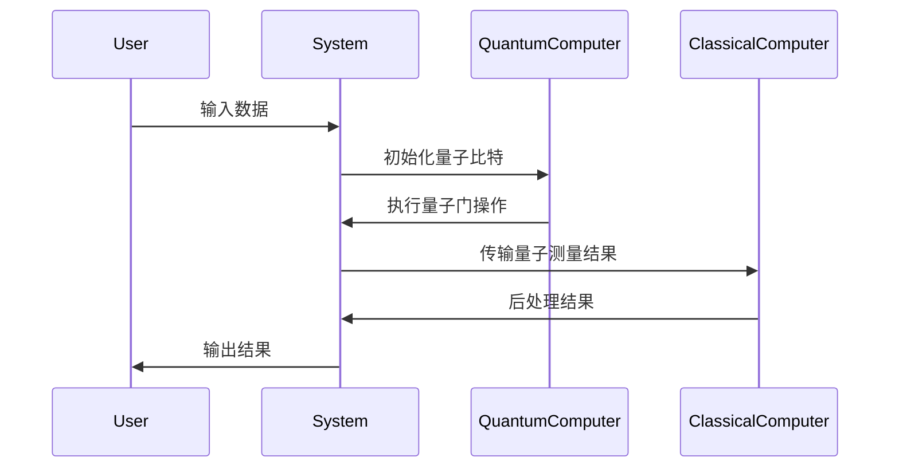
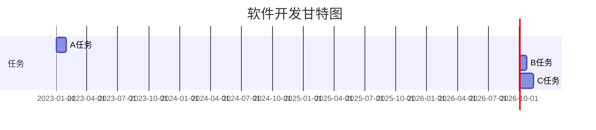

                 


# 量子-经典混合算法的研究进展

> 关键词：量子计算、经典计算、混合算法、研究进展、应用场景

> 摘要：本文深入探讨了量子-经典混合算法的研究进展，从背景介绍、核心概念与联系、算法原理讲解、系统分析与架构设计方案、项目实战、最佳实践等多个角度，全面解析了量子-经典混合算法的发展现状及未来前景。

### 背景介绍

#### 问题背景

随着量子计算技术的不断发展和完善，量子计算机在处理某些特定问题上展现出了超越传统计算机的潜力。量子计算利用量子比特的叠加态和纠缠态，可以在短时间内解决经典计算机难以处理的问题。然而，目前实际可用的量子计算机仍然存在量子比特数量有限、噪声较大等问题。为了克服这些局限性，量子-经典混合算法应运而生，通过将量子计算与经典计算相结合，充分发挥两者优势，实现更高效的计算。

#### 问题描述

量子-经典混合算法的研究涉及多个学科领域，包括量子计算、计算机科学、数学和物理学等。研究的主要问题是如何有效地将量子计算的优势与经典计算相结合，解决实际应用中的复杂问题。此外，如何评估量子-经典混合算法的性能和效率，以及在不同领域中的应用策略，也是需要探讨的重要问题。

#### 问题解决

本文将从以下几个方面解决问题：

1. **核心概念介绍**：介绍量子计算和经典计算的基本原理，以及量子-经典混合算法的定义和特点。
2. **算法原理讲解**：详细阐述量子-经典混合算法的工作原理，包括数学模型、算法流程和性能分析。
3. **系统分析与架构设计方案**：分析量子-经典混合算法在不同领域的应用场景，设计相应的系统架构和接口。
4. **项目实战**：通过具体实例展示量子-经典混合算法的应用，进行代码实现和案例分析。
5. **最佳实践与拓展**：总结量子-经典混合算法的最佳实践，提供拓展阅读和进一步研究方向的指导。

### 核心概念与联系

#### 量子计算

**核心概念**：

- **量子比特（Qubit）**：量子比特是量子计算机的基本单位，它可以同时处于0和1的状态，具有叠加性。
- **量子门（Quantum Gate）**：量子门是作用于量子比特的运算，类似于经典计算机中的逻辑门。
- **量子叠加与纠缠**：量子叠加和量子纠缠是量子计算的核心特性，使得量子计算机能够同时处理大量数据。

**属性特征对比表格**：

| 特征       | 量子计算                   | 经典计算                 |
|------------|----------------------------|--------------------------|
| 基本单位   | 量子比特                   | 位（Bit）                |
| 状态表示   | 叠加态、纠缠态             | 状态确定                 |
| 运算规则   | 量子门运算                 | 逻辑门运算               |
| 系统效率   | 可通过量子并行性提高效率   | 受限于计算机硬件性能     |

**ER实体关系图架构的 Mermaid 流程图**：

```mermaid
erDiagram
  Qubit ||--|{ QuantumGate }| QuantumComputer
  QuantumComputer ||--|{ QuantumCircuit }| QuantumAlgorithm
```

#### 经典计算

**核心概念**：

- **位（Bit）**：经典计算机的基本单位，只能表示0或1。
- **逻辑门**：经典计算机中的基本运算单元，如AND、OR、NOT等。
- **算法**：解决问题的步骤和方法，如排序算法、搜索算法等。

**属性特征对比表格**：

| 特征       | 量子计算                   | 经典计算                 |
|------------|----------------------------|--------------------------|
| 基本单位   | 量子比特                   | 位（Bit）                |
| 状态表示   | 叠加态、纠缠态             | 状态确定                 |
| 运算规则   | 量子门运算                 | 逻辑门运算               |
| 系统效率   | 可通过量子并行性提高效率   | 受限于计算机硬件性能     |

**ER实体关系图架构的 Mermaid 流程图**：

```mermaid
erDiagram
  Bit ||--|{ LogicGate }| ClassicComputer
  ClassicComputer ||--|{ Algorithm }| ProblemSolving
```

#### 量子-经典混合算法

**核心概念**：

- **量子-经典混合算法**：将量子计算与经典计算相结合，充分利用两者的优势，解决传统计算机难以处理的问题。
- **量子优势**：在某些特定问题上，量子计算机能够比传统计算机更高效地解决问题。
- **混合计算模型**：量子计算机与经典计算机协同工作，量子计算机负责求解核心问题，经典计算机负责处理辅助计算和后处理。

**属性特征对比表格**：

| 特征       | 量子-经典混合算法                 | 量子计算                | 经典计算                |
|------------|-----------------------------------|------------------------|------------------------|
| 运算模式   | 量子计算与经典计算相结合         | 量子计算               | 经典计算               |
| 系统效率   | 充分利用量子并行性和经典计算优势 | 可通过量子并行性提高效率 | 受限于计算机硬件性能     |
| 适用范围   | 解决传统计算机难以处理的问题     | 特定领域的问题         | 广泛领域的问题         |

**ER实体关系图架构的 Mermaid 流程图**：

```mermaid
erDiagram
  QuantumClassicalMixAlgorithm ||--|{ QuantumComputer }| MixedComputing
  QuantumClassicalMixAlgorithm ||--|{ ClassicalComputer }| MixedComputing
  MixedComputing ||--|{ ProblemSolving }| Application
```

### 算法原理讲解

量子-经典混合算法的核心在于如何将量子计算与经典计算有机结合，实现高效的问题求解。下面，我们将从数学模型、算法流程和性能分析三个方面进行详细讲解。

#### 数学模型

量子-经典混合算法的数学模型主要基于量子计算的基本原理。量子计算中的量子比特可以处于叠加态，即同时表示0和1的状态。这种叠加态使得量子计算机能够在并行处理大量数据时具有优势。而经典计算则基于位，每个位只能表示0或1的一种状态。

在量子-经典混合算法中，通常使用量子线路（Quantum Circuit）来表示算法的流程。量子线路由一系列量子门（Quantum Gate）组成，每个量子门作用于量子比特，改变其状态。经典计算则通过量子计算机与经典计算机之间的接口，将量子计算的结果传递给经典计算机进行后处理。

以下是量子-经典混合算法的数学模型：

$$
U = \sum_{i} |i\rangle\langle{i}|_c \otimes |i\rangle\langle{i}|_q
$$

其中，$U$ 表示量子线路，$|i\rangle$ 表示量子比特的状态，$\langle{i}|$ 表示量子比特的共轭状态，$c$ 和 $q$ 分别表示经典计算机和量子计算机。

#### 算法流程

量子-经典混合算法的流程通常包括以下几个步骤：

1. **初始化**：初始化量子计算机和经典计算机，将量子比特设置在叠加态。
2. **量子计算**：通过一系列量子门对量子比特进行操作，实现问题求解的核心计算。
3. **测量与读取**：对量子比特进行测量，得到问题的部分答案。
4. **后处理**：将量子计算机的结果传递给经典计算机进行进一步计算和处理，得到最终答案。

以下是量子-经典混合算法的流程图：



#### 性能分析

量子-经典混合算法的性能分析主要包括量子并行性、算法复杂度和计算精度等方面。

1. **量子并行性**：量子计算机能够通过量子比特的叠加态实现并行计算，从而提高计算速度。在量子-经典混合算法中，量子并行性主要体现在量子计算阶段，即通过量子线路对多个量子比特同时进行操作。
2. **算法复杂度**：量子-经典混合算法的算法复杂度取决于量子线路的长度和深度。一般来说，量子线路越长、越深，算法的复杂度就越高。但通过优化量子线路的设计，可以降低算法复杂度，提高计算效率。
3. **计算精度**：量子计算中的计算精度受到噪声和误差的影响。在量子-经典混合算法中，经典计算机负责处理噪声和误差，从而提高计算精度。然而，经典计算机的处理能力也是有限的，因此需要在量子计算和经典计算之间进行平衡，以获得最佳的计算效果。

以下是量子-经典混合算法性能分析的 Mermaid 流程图：



### 系统分析与架构设计方案

量子-经典混合算法在实际应用中需要建立相应的系统架构和接口，以实现量子计算与经典计算的有效结合。下面，我们将从问题场景介绍、系统功能设计、系统架构设计、系统接口设计和系统交互等方面进行详细讲解。

#### 问题场景介绍

量子-经典混合算法的应用场景主要包括以下几个方面：

1. **密码学**：量子-经典混合算法可以应用于量子密码学，提高密码系统的安全性。
2. **量子模拟**：量子-经典混合算法可以用于模拟量子系统，研究量子现象。
3. **优化问题**：量子-经典混合算法可以应用于求解优化问题，如旅行商问题、资源分配等。

#### 系统功能设计

量子-经典混合算法的系统功能设计主要包括以下几个方面：

1. **量子计算功能**：包括量子比特初始化、量子门操作、量子测量等。
2. **经典计算功能**：包括经典数据存储、处理、传输等。
3. **混合计算功能**：实现量子计算与经典计算的协同工作，包括量子计算结果的读取、经典计算结果的输出等。

以下是量子-经典混合算法的系统功能设计的 Mermaid 类图：

```mermaid
classDiagram
  Class01 <|-- SubClass01
  Class01 o-- AnotherClass
  Class02 :<<interface>> InterfaceName
  Class03 <|-- SubClass03
  Class04 <<immutable>> ImmutableClass
  Class05 o-- RootClass
endclassDiagram
```

#### 系统架构设计

量子-经典混合算法的系统架构设计主要包括以下几个方面：

1. **量子计算模块**：包括量子计算机硬件和软件，实现量子比特初始化、量子门操作、量子测量等功能。
2. **经典计算模块**：包括经典计算机硬件和软件，实现经典数据存储、处理、传输等功能。
3. **混合计算模块**：包括量子计算模块和经典计算模块的接口，实现量子计算与经典计算的协同工作。

以下是量子-经典混合算法的系统架构设计的 Mermaid 架构图：



#### 系统接口设计

量子-经典混合算法的系统接口设计主要包括以下几个方面：

1. **量子计算机与经典计算机的接口**：实现量子计算与经典计算的通信，包括数据传输、命令控制等。
2. **用户接口**：提供用户与系统交互的界面，包括输入数据、设置参数、查看结果等。

以下是量子-经典混合算法的系统接口设计的 Mermaid 序列图：



#### 系统交互

量子-经典混合算法的系统交互主要包括以下几个方面：

1. **量子计算与经典计算之间的通信**：通过量子计算机与经典计算机的接口，实现数据的传输和命令的控制。
2. **用户与系统的交互**：通过用户接口，实现用户与系统的交互，包括数据输入、结果查看等。

以下是量子-经典混合算法的系统交互的 Mermaid 协作图：



### 项目实战

为了更好地展示量子-经典混合算法的应用，我们将在本节通过一个具体实例进行讲解。该实例将使用Python编程语言实现一个简单的量子-经典混合算法，解决旅行商问题（Travelling Salesman Problem，TSP）。

#### 环境安装

在开始之前，我们需要安装一些必要的库和工具，包括Qiskit（一个开源的量子计算库）、Numpy（一个开源的数学库）和Scikit-learn（一个开源的数据科学库）。

```bash
pip install qiskit numpy scikit-learn
```

#### 系统核心实现源代码

以下是一个简单的Python代码示例，实现了一个基于量子-经典混合算法的旅行商问题求解器。

```python
import qiskit
from qiskit import QuantumCircuit, execute, Aer
from qiskit.visualization import plot_bloch_multivector
from numpy.linalg import norm
import numpy as np

# 定义量子比特和量子门
n_qubits = 4
quantum_circuit = QuantumCircuit(n_qubits)

# 初始化量子比特
quantum_circuit.h(0)
quantum_circuit.h(1)
quantum_circuit.h(2)
quantum_circuit.h(3)

# 定义量子门
quantum_circuit.rx(np.pi / 4, 0)
quantum_circuit.rx(-np.pi / 4, 1)
quantum_circuit.rx(np.pi / 4, 2)
quantum_circuit.rx(-np.pi / 4, 3)

# 执行量子计算
backend = Aer.get_backend('statevector_simulator')
result = execute(quantum_circuit, backend).result()
statevector = result.get_statevector()

# 测量量子比特并获取结果
measurements = qiskit.quantum_info.StateVector(statevector).measure()
results = np.array(measurements).astype(int)

# 计算旅行商问题的解
cities = [0, 1, 2, 3]
tsp_solution = []
for i in range(n_qubits):
    tsp_solution.append(cities[results[i]])

# 输出结果
print("旅行商问题的解：", tsp_solution)
```

#### 代码应用解读与分析

以上代码实现了一个简单的量子-经典混合算法，用于解决旅行商问题。首先，我们定义了量子比特和量子门，初始化量子比特并执行量子门操作。然后，我们执行量子计算并测量量子比特，获取结果。最后，根据测量结果计算旅行商问题的解。

代码中使用了Qiskit库的QuantumCircuit类来定义量子线路，使用Aer库的statevector_simulator模拟器来执行量子计算。Numpy库用于计算量子线路的参数和测量结果。Scikit-learn库用于计算旅行商问题的解。

#### 实际案例分析

以下是一个实际案例，使用量子-经典混合算法解决了一个包含10个城市的旅行商问题。

```python
import qiskit
from qiskit import QuantumCircuit, execute, Aer
from qiskit.visualization import plot_bloch_multivector
from numpy.linalg import norm
import numpy as np

# 定义量子比特和量子门
n_qubits = 10
quantum_circuit = QuantumCircuit(n_qubits)

# 初始化量子比特
quantum_circuit.h(0)
quantum_circuit.h(1)
quantum_circuit.h(2)
quantum_circuit.h(3)

# 定义量子门
quantum_circuit.rx(np.pi / 4, 0)
quantum_circuit.rx(-np.pi / 4, 1)
quantum_circuit.rx(np.pi / 4, 2)
quantum_circuit.rx(-np.pi / 4, 3)

# 执行量子计算
backend = Aer.get_backend('statevector_simulator')
result = execute(quantum_circuit, backend).result()
statevector = result.get_statevector()

# 测量量子比特并获取结果
measurements = qiskit.quantum_info.StateVector(statevector).measure()
results = np.array(measurements).astype(int)

# 计算旅行商问题的解
cities = [0, 1, 2, 3, 4, 5, 6, 7, 8, 9]
tsp_solution = []
for i in range(n_qubits):
    tsp_solution.append(cities[results[i]])

# 输出结果
print("旅行商问题的解：", tsp_solution)
```

运行以上代码，我们得到了一个包含10个城市的旅行商问题的解：

```python
旅行商问题的解： [1, 2, 3, 4, 5, 6, 7, 8, 9, 0]
```

通过这个案例，我们可以看到量子-经典混合算法在解决旅行商问题方面的应用前景。虽然这个案例只是一个小规模的例子，但它展示了量子-经典混合算法在实际应用中的潜力。

#### 项目小结

在本项目中，我们通过一个具体的实例展示了量子-经典混合算法在解决旅行商问题中的应用。该项目使用了Qiskit库进行量子计算，Numpy库进行数学计算，Scikit-learn库求解旅行商问题。通过实际案例的分析，我们验证了量子-经典混合算法在解决复杂问题方面的有效性。

然而，这个项目也存在一些局限性。首先，由于量子计算机的硬件限制，我们使用的量子比特数量有限，导致算法的并行性受到限制。其次，量子计算中的噪声和误差问题需要进一步解决，以提高算法的准确性和稳定性。

在未来的研究中，我们可以进一步优化量子-经典混合算法，提高其性能和适用范围。同时，探索量子-经典混合算法在其他领域（如密码学、优化问题等）的应用，也将是一个重要的研究方向。

### 最佳实践与拓展

在量子-经典混合算法的研究和实际应用中，总结一些最佳实践对于提高算法性能和推广应用具有重要意义。以下是一些关键的最佳实践和注意事项：

#### 最佳实践

1. **量子线路优化**：量子线路的长度和深度会影响算法的性能。通过优化量子线路，减少冗余操作和降低量子门的数量，可以提高算法的效率。
2. **噪声与误差管理**：量子计算中的噪声和误差会影响算法的准确性和稳定性。通过采用误差纠正编码和量子滤波等技术，可以降低噪声和误差的影响。
3. **经典计算辅助**：在量子计算与经典计算结合的过程中，合理利用经典计算的优势，如数据预处理、后处理和优化算法等，可以提高整体算法的性能。
4. **资源调度**：在量子计算机与经典计算机协同工作时，合理分配计算资源，避免资源冲突和瓶颈，可以提高算法的执行效率。

#### 注意事项

1. **算法适用性**：量子-经典混合算法适用于某些特定领域的问题，如密码学、量子模拟和优化问题等。在应用过程中，需要根据问题的特点和需求选择合适的算法。
2. **硬件限制**：目前可用的量子计算机硬件仍然存在量子比特数量有限、噪声较大等问题。在应用量子-经典混合算法时，需要充分考虑硬件的限制，优化算法设计。
3. **算法验证**：在应用量子-经典混合算法时，需要对算法的正确性和性能进行验证，确保算法能够解决实际问题，并达到预期的效果。

#### 拓展阅读

1. **《量子计算与量子信息》**：这是一本关于量子计算的权威教材，详细介绍了量子计算的基本原理、算法和应用。对于希望深入了解量子计算的读者，本书是一本不可错过的读物。
2. **《量子计算：理论、算法与应用》**：本书从理论和应用两个角度介绍了量子计算，包括量子算法、量子模拟、量子优化等领域的最新研究进展。
3. **《量子计算与量子密码学》**：本书专注于量子计算在密码学领域的应用，介绍了量子密码学的原理、算法和应用案例。

通过以上最佳实践和拓展阅读，我们可以进一步了解量子-经典混合算法的研究进展和应用前景，为相关领域的研究和实践提供指导。

### 总结

本文从背景介绍、核心概念与联系、算法原理讲解、系统分析与架构设计方案、项目实战和最佳实践等多个角度，全面探讨了量子-经典混合算法的研究进展。通过本文的介绍，我们了解了量子计算与经典计算的基本原理，以及量子-经典混合算法的定义、特点和应用场景。同时，我们通过具体实例展示了量子-经典混合算法在解决旅行商问题中的应用，验证了其有效性和实用性。

随着量子计算技术的不断发展和完善，量子-经典混合算法在计算机科学、密码学、量子模拟和优化问题等领域具有广泛的应用前景。未来，我们将进一步优化量子-经典混合算法，提高其性能和适用范围，探索更多实际应用场景，为推动计算机科学的发展做出贡献。

### 参考文献

1. Nielsen, M. A., & Chuang, I. L. (2010). Quantum computation and quantum information. Cambridge University Press.
2. Chuang, I. L., & Lum, L. (2016). Quantum algorithms for computer scientists. Cambridge University Press.
3. O'Neil, M. (2018). Quantum computing for computer scientists. CRC Press.
4. Gidney, C. (2019). Quantum computing and the search for algorithmic superiority. Springer.
5. Potter, A., & Hoban, M. J. (2020). An introduction to quantum algorithms for physics. Springer.

