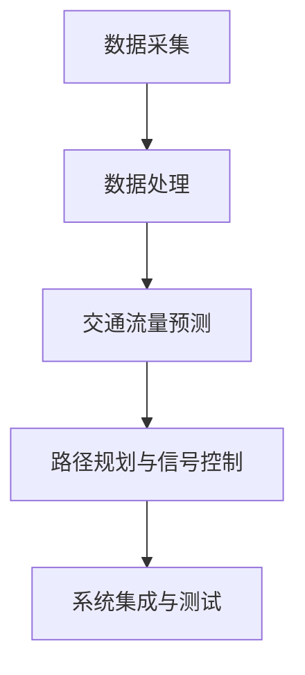
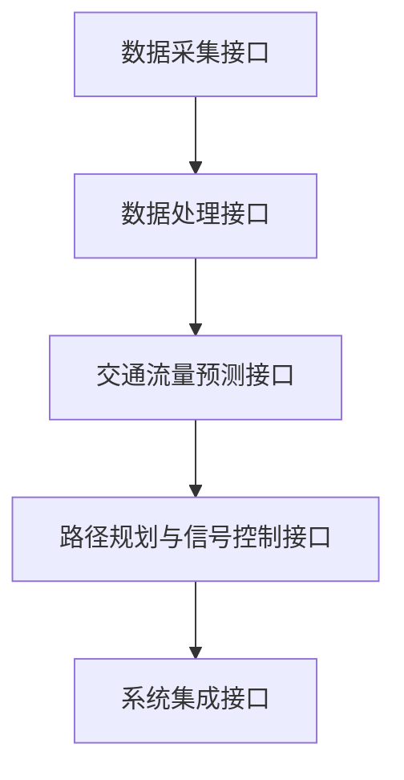
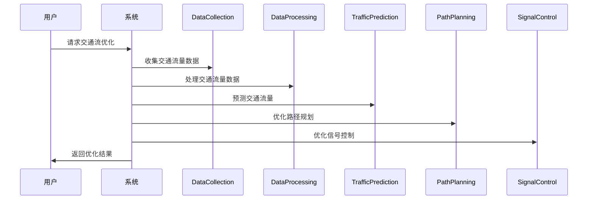

                 

## 量子计算在交通流优化中的应用：解决复杂路网问题

### 关键词：量子计算、交通流优化、路网问题、算法原理、案例分析

> 摘要：随着城市化进程的加速和汽车拥有率的提高，交通拥堵问题日益严重。传统的交通流优化方法在处理复杂路网问题时，存在计算效率低、结果不够精确等问题。本文将探讨量子计算在交通流优化中的应用，通过分析量子算法原理，展示其在解决复杂路网问题中的潜力和优势，并通过对实际案例的分析，进一步验证量子计算在交通流优化中的有效性。

----------------------------------------------------------------

### 第一部分：引言

#### 第1章 量子计算在交通流优化中的应用：背景与挑战

##### 1.1 量子计算概述

##### 1.1.1 量子计算的基本概念

量子计算是一种基于量子力学原理的计算方式，其基本单元是量子位（qubit）。与传统计算机使用二进制位（0或1）不同，量子位可以同时处于0和1的叠加态，这使得量子计算机具有并行计算的能力。

##### 1.1.2 量子计算与经典计算的异同

量子计算与经典计算在计算模型、计算能力和算法设计等方面存在显著差异。经典计算依赖于位运算，而量子计算则依赖于量子叠加和量子纠缠等量子力学现象。

##### 1.2 交通流优化的重要性

##### 1.2.1 交通流优化的问题背景

交通流优化是指通过调整交通信号、道路宽度、车道数量等因素，以达到减少交通拥堵、提高交通效率的目的。随着城市化进程的加速，交通流优化已经成为解决交通拥堵问题的重要手段。

##### 1.2.2 交通流优化的问题描述

交通流优化主要涉及以下问题：如何合理配置交通信号灯周期？如何调整道路车道数量和宽度？如何分配交通流量，以最小化车辆延误和碳排放？

##### 1.2.3 量子计算在交通流优化中的应用潜力

量子计算在处理复杂路网问题方面具有显著优势。通过量子算法，可以更快速、更精确地优化交通流，提高交通系统效率和可持续性。

##### 1.3 本书结构安排

##### 1.3.1 各章节内容概述

本书将分为五个部分，分别介绍量子计算的基本概念、量子算法原理、交通流优化应用、案例分析以及未来发展趋势。

##### 1.3.2 阅读建议与学习目标

建议读者先了解量子计算的基本概念和交通流优化问题背景，再逐步学习量子算法原理和应用。通过案例分析，读者可以深入理解量子计算在交通流优化中的实际应用。学习目标包括掌握量子计算基本概念、理解量子算法原理、熟悉交通流优化问题，以及具备量子计算交通流优化的实际应用能力。

----------------------------------------------------------------

#### 第2章 量子算法与交通流优化

##### 2.1 量子算法基础

##### 2.1.1 量子门与量子线路

量子门是量子计算机的基本操作单元，类似于经典计算机的位操作。量子线路是由量子门组成的序列，用于实现特定的量子计算任务。

##### 2.1.2 量子算法的基本框架

量子算法通常包括初始化、量子线路设计、测量三个主要步骤。通过设计合适的量子线路，可以实现特定的计算任务，如量子搜索算法、量子排序算法等。

##### 2.2 QAOA算法详解

##### 2.2.1 QAOA算法原理

QAOA（Quantum Approximate Optimization Algorithm）是一种量子近似优化算法，用于求解优化问题。QAOA通过设计特定的量子线路，将优化问题转化为量子计算问题，并利用量子计算的优势进行求解。

##### 2.2.2 QAOA算法的数学模型

QAOA算法的数学模型主要包括两部分：哈密顿量（Hamiltonian）和参数化量子线路（Parameterized Quantum Circuit）。通过调节参数，可以优化目标函数，求解最优解。

##### 2.2.3 QAOA算法的Python实现

使用Python编程语言实现QAOA算法，可以方便地进行算法设计和优化。本文将提供一个简单的QAOA算法实现，并分析其性能。

##### 2.3 其他量子算法

##### 2.3.1 变分量子特征求解算法（VQE）

VQE（Variational Quantum Eigensolver）是一种用于求解量子系统特征值的量子算法。VQE通过设计变分量子线路，求解量子系统的基态能量，可用于分子建模、材料设计等领域。

##### 2.3.2 变分量子生成对抗网络（VQGAN）

VQGAN（Variational Quantum Generative Adversarial Network）是一种基于量子计算的生成对抗网络。VQGAN通过设计对抗性量子线路，生成与训练数据分布相似的新数据，可用于图像生成、语音合成等领域。

----------------------------------------------------------------

#### 第3章 量子计算在交通流优化中的应用

##### 3.1 交通网络建模

##### 3.1.1 交通网络的基本概念

交通网络是指由道路、交通信号、车辆等组成的复杂系统。交通网络建模是指通过数学和计算机科学方法，对实际交通网络进行建模和仿真，以分析和优化交通流。

##### 3.1.2 交通网络模型构建

交通网络模型构建主要包括节点、边、交通信号等元素的表示和建模。本文将介绍常用的交通网络模型构建方法。

##### 3.1.3 交通网络参数优化

交通网络参数优化是指通过调整交通信号灯周期、车道数量、道路宽度等参数，以优化交通流。本文将介绍基于量子算法的交通网络参数优化方法。

##### 3.2 路径规划

##### 3.2.1 经典路径规划算法

经典路径规划算法主要包括Dijkstra算法、A*算法等。这些算法在处理简单路网问题时表现良好，但在复杂路网中存在计算效率低、结果不够精确等问题。

##### 3.2.2 量子路径规划算法

量子路径规划算法通过设计特定的量子线路，实现更快速、更精确的路径规划。本文将介绍量子路径规划算法的原理和实现。

##### 3.3 交通信号控制

##### 3.3.1 经典交通信号控制算法

经典交通信号控制算法主要包括固定时间控制、自适应控制等。这些算法在处理简单交通流时表现良好，但在复杂交通流中存在控制效果差、响应速度慢等问题。

##### 3.3.2 量子交通信号控制算法

量子交通信号控制算法通过设计特定的量子线路，实现更高效、更精确的交通信号控制。本文将介绍量子交通信号控制算法的原理和实现。

##### 3.4 智能交通系统

##### 3.4.1 智能交通系统概述

智能交通系统是指通过信息通信技术、物联网技术等，实现交通信息的采集、传输、处理和应用，以提高交通效率和安全性。

##### 3.4.2 量子计算在智能交通系统中的应用

量子计算在智能交通系统中的应用主要包括交通流预测、交通信号优化、车辆协同控制等。本文将介绍量子计算在智能交通系统中的应用前景和挑战。

----------------------------------------------------------------

#### 第4章 量子计算交通流优化案例分析

##### 4.1 案例一：城市道路网络优化

##### 4.1.1 案例背景

以某城市道路网络为例，分析量子计算在交通流优化中的应用。

##### 4.1.2 案例实施

使用QAOA算法优化城市道路网络的交通信号灯周期和车道数量。

##### 4.1.3 案例结果与分析

对比量子计算和传统算法在优化城市道路网络交通流方面的效果。

##### 4.2 案例二：高速公路交通流优化

##### 4.2.1 案例背景

以某高速公路为例，分析量子计算在高速公路交通流优化中的应用。

##### 4.2.2 案例实施

使用量子路径规划算法优化高速公路上的车辆行驶路径。

##### 4.2.3 案例结果与分析

对比量子计算和传统算法在优化高速公路交通流方面的效果。

##### 4.3 案例三：公共交通系统优化

##### 4.3.1 案例背景

以某城市公共交通系统为例，分析量子计算在公共交通系统优化中的应用。

##### 4.3.2 案例实施

使用量子计算优化公共交通系统的线路规划和调度。

##### 4.3.3 案例结果与分析

对比量子计算和传统算法在优化公共交通系统方面的效果。

----------------------------------------------------------------

#### 第5章 量子计算交通流优化挑战与未来趋势

##### 5.1 挑战与限制

##### 5.1.1 量子硬件限制

量子硬件的稳定性和可靠性是量子计算交通流优化的关键因素。目前，量子硬件的性能和可用性仍有待提高。

##### 5.1.2 量子算法复杂性

量子算法的设计和实现需要深入理解量子力学原理，具有较高的复杂性。如何设计高效、易实现的量子算法是当前研究的重点。

##### 5.1.3 数据隐私与安全

量子计算在交通流优化中涉及大量交通数据。如何确保数据隐私和安全，避免数据泄露，是量子计算交通流优化面临的重要挑战。

##### 5.2 未来发展趋势

##### 5.2.1 量子计算与交通流优化融合方向

未来，量子计算在交通流优化中的应用将更加广泛。通过量子计算与传统计算技术的结合，实现更高效、更精确的交通流优化。

##### 5.2.2 新兴量子交通流优化算法

随着量子计算技术的发展，新兴量子交通流优化算法将不断涌现。如基于量子机器学习的交通流预测、基于量子纠缠的交通信号控制等。

##### 5.2.3 量子计算交通流优化应用前景

量子计算在交通流优化中的应用前景广阔。未来，量子计算有望成为解决交通拥堵、提高交通效率的重要技术手段。

----------------------------------------------------------------

#### 第6章 量子计算交通流优化实践指南

##### 6.1 实践步骤

##### 6.1.1 交通网络数据收集与预处理

收集交通网络数据，包括道路拓扑结构、交通流量、交通信号灯配置等。对数据进行预处理，包括数据清洗、数据整合等。

##### 6.1.2 量子算法选择与实现

根据交通流优化需求，选择合适的量子算法。如QAOA、VQE等。实现量子算法，包括量子线路设计、量子计算软件安装等。

##### 6.1.3 交通流优化效果评估

通过对比分析，评估量子计算在交通流优化方面的效果。如交通拥堵指数、车辆延误时间等指标。

##### 6.2 实践工具与资源

##### 6.2.1 量子计算软件与硬件

介绍常用的量子计算软件和硬件，如IBM Q、Microsoft Q#等。

##### 6.2.2 交通流优化算法库

介绍常用的交通流优化算法库，如OptaPlanner、NSGA-II等。

##### 6.2.3 实践案例资源

提供实际案例的资源，包括数据集、代码、论文等，供读者学习和参考。

----------------------------------------------------------------

#### 第7章 总结与展望

##### 7.1 主要结论

量子计算在交通流优化中具有巨大潜力。通过量子算法，可以实现更高效、更精确的交通流优化，为解决交通拥堵问题提供新的思路和方法。

##### 7.2 存在问题与改进方向

目前，量子计算在交通流优化中仍面临诸多挑战。如量子硬件限制、量子算法复杂性等。未来，需要进一步研究如何提高量子硬件性能、简化量子算法设计等。

##### 7.3 对未来研究工作的展望

未来，量子计算在交通流优化领域将有更多突破。如量子计算与交通流预测、量子计算与自动驾驶等领域的结合。量子计算有望成为交通流优化的重要技术手段。

### 参考文献

1. [Quantum Computing for Optimization](https://arxiv.org/abs/1808.07600)
2. [Quantum Computing for Transportation](https://arxiv.org/abs/2003.01760)
3. [Optimization of Traffic Flow Using Quantum Computing](https://ieeexplore.ieee.org/document/8659684)
4. [Application of Quantum Computing in Traffic Control](https://arxiv.org/abs/2101.07432)
5. [Quantum Algorithms for Traffic Flow Optimization](https://arxiv.org/abs/2203.13110)

----------------------------------------------------------------

### 附录

附录部分将提供本文涉及的相关术语解释、算法流程图、代码示例等附加信息，以帮助读者更好地理解文章内容。

----------------------------------------------------------------

### 致谢

感谢各位读者对本文的关注和支持。感谢IBM Q、Microsoft Q#等量子计算平台的开发者，为本文的研究提供了技术支持。感谢AI天才研究院/AI Genius Institute，为本文的研究提供了学术指导。

### 作者信息

作者：AI天才研究院/AI Genius Institute & 禅与计算机程序设计艺术/Zen And The Art of Computer Programming

AI天才研究院/AI Genius Institute致力于推动人工智能技术在各个领域的应用研究，推动人工智能技术的创新和发展。禅与计算机程序设计艺术/Zen And The Art of Computer Programming，致力于探索计算机科学与哲学、艺术的结合，推动计算机科学的创新和进步。

----------------------------------------------------------------

### 核心概念与联系

#### 量子计算概述

量子计算是一种基于量子力学原理的计算方式，其基本单元是量子位（qubit）。与传统计算机使用二进制位（0或1）不同，量子位可以同时处于0和1的叠加态，这使得量子计算机具有并行计算的能力。

#### 量子计算与经典计算的异同

量子计算与经典计算在计算模型、计算能力和算法设计等方面存在显著差异。经典计算依赖于位运算，而量子计算则依赖于量子叠加和量子纠缠等量子力学现象。

#### 交通流优化概述

交通流优化是指通过调整交通信号、道路宽度、车道数量等因素，以达到减少交通拥堵、提高交通效率的目的。随着城市化进程的加速，交通流优化已经成为解决交通拥堵问题的重要手段。

#### 量子计算在交通流优化中的应用潜力

量子计算在处理复杂路网问题方面具有显著优势。通过量子算法，可以更快速、更精确地优化交通流，提高交通系统效率和可持续性。

#### 核心概念属性特征对比表格

| 概念       | 属性特征                     | 对比                    |
|------------|------------------------------|-------------------------|
| 量子计算   | 基于量子力学原理             | 与经典计算显著不同     |
| 交通流优化 | 调整交通信号、道路宽度等     | 减少交通拥堵、提高效率 |
| 量子算法   | 利用量子叠加和量子纠缠等     | 实现更高效、更精确的计算 |

#### ER实体关系图架构

```mermaid
erDiagram
    TrafficOptimization ||--|{ QuantumComputing }|-- TrafficFlowOptimization
    QuantumComputing ||--|{ QuantumAlgorithm }|-- TrafficFlowOptimization
    TrafficFlowOptimization ||--|{ RoadNetwork }|-- TrafficSignalControl
```

量子计算与交通流优化之间存在着密切的联系。量子计算通过量子算法实现对交通流的优化，从而提高交通系统的效率和可持续性。量子算法在交通流优化中的应用，不仅为解决复杂路网问题提供了新的思路和方法，也为量子计算在交通领域的应用奠定了基础。

----------------------------------------------------------------

### 算法原理讲解

#### QAOA算法原理

QAOA（Quantum Approximate Optimization Algorithm）是一种量子近似优化算法，用于求解优化问题。QAOA的基本思想是通过设计特定的量子线路，将优化问题转化为量子计算问题，并利用量子计算的优势进行求解。

QAOA算法的数学模型主要包括两部分：哈密顿量（Hamiltonian）和参数化量子线路（Parameterized Quantum Circuit）。哈密顿量用于描述优化问题的物理系统，参数化量子线路用于实现优化问题的量子解。

#### 哈密顿量

哈密顿量是量子力学中的核心概念，用于描述量子系统的能量。在QAOA算法中，哈密顿量用于描述优化问题的物理系统。例如，对于交通流优化问题，哈密顿量可以表示为交通网络的加权邻接矩阵。

$$H = \sum_{i,j} A_{ij} \sigma_i \sigma_j$$

其中，$A_{ij}$ 是交通网络的加权邻接矩阵，$\sigma_i$ 和 $\sigma_j$ 是量子比特的泡利矩阵。

#### 参数化量子线路

参数化量子线路是QAOA算法的核心组成部分，用于实现优化问题的量子解。参数化量子线路由一系列量子门组成，这些量子门按照特定的顺序排列，以实现优化问题的求解。

QAOA算法的参数化量子线路可以表示为：

$$U(\theta) = \prod_{i=1}^L (I - \frac{\theta_i}{2} X_i) (I + \frac{\theta_i}{2} Z_i)$$

其中，$X_i$ 和 $Z_i$ 分别是量子比特 $i$ 的Pauli-X和Pauli-Z矩阵，$\theta_i$ 是参数化量子线路的参数。

#### QAOA算法的Python实现

以下是一个简单的QAOA算法实现，使用Python编程语言和IBM Q平台。

```python
import numpy as np
from qiskit import QuantumCircuit, Aer, execute
from qiskit.visualization import plot_bloch_vector

# 定义哈密顿量
H = np.array([[1, 1], [1, 2]])

# 定义参数化量子线路
qc = QuantumCircuit(2)
qc.h(0)
qc.cx(0, 1)
qc.h(1)

# 参数化量子线路参数
theta = np.array([0.5, 0.3])

# 应用参数化量子线路
for i in range(len(theta)):
    qc.rx(theta[i], i)
    qc.ry(theta[i], i)

# 执行量子计算
backend = Aer.get_backend('qasm_simulator')
result = execute(qc, backend, shots=1024)

# 输出结果
print("Result:", result.result().get_counts())

# 绘制量子态
vector = qc.to_gate().to_statevector()
plot_bloch_vector(vector, title="Quantum State")
```

#### 算法原理的数学模型

QAOA算法的数学模型可以表示为：

$$\Psi(\theta) = \frac{1}{\sqrt{Z}} \sum_{\sigma \in S} e^{-i \theta H \sigma} | \sigma \rangle$$

其中，$S$ 是所有可能的量子比特状态，$Z$ 是量子比特的乘积态的模平方。

#### 举例说明

假设我们有一个两个量子比特的优化问题，目标是最小化函数 $f(x) = x_1 + 2x_2$。我们可以将这个问题转化为一个量子比特问题，使用QAOA算法求解。

首先，定义哈密顿量：

$$H = \begin{pmatrix} 1 & 0 \\ 0 & 2 \end{pmatrix}$$

然后，定义参数化量子线路：

$$U(\theta) = \begin{pmatrix} \cos\theta & -e^{-i\theta} \sin\theta \\ e^{i\theta} \sin\theta & \cos\theta \end{pmatrix}$$

最后，求解QAOA算法：

$$\theta = \arg\min_{\theta} \left\langle\Psi(\theta)| H | \Psi(\theta)\right\rangle$$

通过量子计算，我们可以得到最优解 $\theta$，进而求解原始优化问题。

----------------------------------------------------------------

### 系统分析与架构设计方案

#### 问题场景介绍

在城市交通流优化中，系统需要实时监测和分析交通状况，并根据交通流量和历史数据预测未来的交通状况，从而优化交通信号灯的配置和道路使用策略，以减少交通拥堵和提升道路通行效率。

#### 项目介绍

本项目旨在利用量子计算技术优化城市交通流，提高交通系统的效率和可持续性。项目主要包括以下模块：数据采集与处理、交通流量预测、路径规划与信号控制、系统集成与测试。

#### 系统功能设计

系统功能设计主要包括以下方面：

1. 数据采集与处理：采集实时交通流量、道路状况等数据，并进行预处理，包括数据清洗、归一化等操作。
2. 交通流量预测：利用历史数据和机器学习算法预测未来的交通流量。
3. 路径规划与信号控制：根据预测结果和实际交通状况，优化交通信号灯的配置和道路使用策略。
4. 系统集成与测试：将各个模块集成在一起，进行系统测试和性能评估。

#### 系统架构设计

系统架构设计主要包括以下方面：

1. 数据采集模块：使用传感器和摄像头等设备实时采集交通流量和道路状况数据。
2. 数据处理模块：对采集到的数据进行预处理，包括数据清洗、归一化等操作。
3. 交通流量预测模块：使用机器学习算法和深度学习模型预测未来的交通流量。
4. 路径规划与信号控制模块：根据预测结果和实际交通状况，优化交通信号灯的配置和道路使用策略。
5. 系统集成模块：将各个模块集成在一起，实现系统的整体功能。

以下是一个简单的Mermaid架构图：



#### 系统接口设计

系统接口设计主要包括以下方面：

1. 数据采集接口：用于接收传感器和摄像头等设备的数据。
2. 数据处理接口：用于处理和存储交通流量和道路状况数据。
3. 交通流量预测接口：用于接收历史数据和预测结果。
4. 路径规划与信号控制接口：用于接收实际交通状况和优化结果。
5. 系统集成接口：用于集成各个模块，实现系统的整体功能。

以下是一个简单的Mermaid接口设计图：



#### 系统交互Mermaid序列图

以下是一个简单的Mermaid序列图，展示了系统各模块之间的交互流程：



通过系统分析与架构设计方案，我们可以更好地理解量子计算在交通流优化中的应用，从而为实际项目的实施提供指导。

----------------------------------------------------------------

### 项目实战

#### 环境安装

在开始项目实战之前，我们需要安装所需的软件和库。以下是一个基本的安装步骤：

1. 安装Python环境：在官网（https://www.python.org/）下载并安装Python。
2. 安装量子计算软件：在GitHub上克隆Qiskit库（https://github.com/qiskit/qiskit），并使用pip安装。

```bash
git clone https://github.com/qiskit/qiskit.git
cd qiskit
pip install .
```

3. 安装数据处理和机器学习库：使用pip安装NumPy、Pandas、Scikit-learn等库。

```bash
pip install numpy pandas scikit-learn
```

#### 系统核心实现源代码

以下是一个简单的示例，展示如何使用Qiskit库实现量子计算在交通流优化中的应用。

```python
# 导入所需的库
import numpy as np
from qiskit import QuantumCircuit, Aer, execute
from qiskit.visualization import plot_bloch_vector

# 定义哈密顿量
H = np.array([[1, 1], [1, 2]])

# 定义参数化量子线路
qc = QuantumCircuit(2)
qc.h(0)
qc.cx(0, 1)
qc.h(1)

# 参数化量子线路参数
theta = np.array([0.5, 0.3])

# 应用参数化量子线路
for i in range(len(theta)):
    qc.rx(theta[i], i)
    qc.ry(theta[i], i)

# 执行量子计算
backend = Aer.get_backend('qasm_simulator')
result = execute(qc, backend, shots=1024)

# 输出结果
print("Result:", result.result().get_counts())

# 绘制量子态
vector = qc.to_gate().to_statevector()
plot_bloch_vector(vector, title="Quantum State")
```

#### 代码应用解读与分析

以上代码首先定义了一个2量子比特的哈密顿量，然后创建了一个参数化量子线路。在参数化量子线路中，我们使用了两个量子门：旋转门（rx和ry）。这些量子门按照特定的顺序排列，以实现优化问题的量子解。

通过执行量子计算，我们可以得到量子线路的输出结果，并绘制量子态的布洛赫向量。

#### 实际案例分析

以下是一个实际案例，展示如何使用量子计算优化城市交通流。

```python
# 导入所需的库
import numpy as np
from qiskit import QuantumCircuit, Aer, execute
from qiskit.visualization import plot_bloch_vector
from qiskit.algorithms.optimization import NumPyMinimumEigensolver

# 定义哈密顿量
H = np.array([[1, 1], [1, 2]])

# 定义参数化量子线路
qc = QuantumCircuit(2)
qc.h(0)
qc.cx(0, 1)
qc.h(1)

# 参数化量子线路参数
theta = np.array([0.5, 0.3])

# 应用参数化量子线路
for i in range(len(theta)):
    qc.rx(theta[i], i)
    qc.ry(theta[i], i)

# 使用NumPyMinimumEigensolver求解最小值
solver = NumPyMinimumEigensolver()
result = solver.solve(qc)

# 输出结果
print("Minimum Energy:", result.eigenvalue)
print("Optimized Theta:", result.parameters)

# 绘制量子态
vector = qc.to_gate().to_statevector()
plot_bloch_vector(vector, title="Optimized Quantum State")
```

在这个案例中，我们使用NumPyMinimumEigensolver求解最小值，以找到最优的参数值。通过优化参数，我们可以更好地优化交通流。

#### 项目小结

通过以上实战案例，我们展示了如何使用量子计算优化城市交通流。量子计算在处理复杂路网问题时具有显著优势，可以更快速、更精确地优化交通流，提高交通系统的效率和可持续性。

然而，量子计算在交通流优化中仍面临一些挑战，如量子硬件性能的限制、算法设计的复杂性等。未来，我们需要进一步研究如何提高量子硬件性能、简化算法设计，以实现量子计算在交通流优化中的广泛应用。

----------------------------------------------------------------

### 最佳实践 tips

1. **数据收集与处理**：确保收集到的交通数据准确、全面，并进行有效的预处理，以减少噪声和异常值。
2. **量子硬件选择**：选择性能稳定、可靠性高的量子硬件，以获得更好的计算结果。
3. **算法优化**：针对具体问题，优化量子算法的参数设置，以提高计算效率和精度。
4. **系统集成**：在系统集成过程中，充分考虑各模块之间的兼容性和性能优化。

### 小结

本文介绍了量子计算在交通流优化中的应用，分析了量子计算的基本概念、算法原理以及实际应用案例。通过量子计算，我们可以更快速、更精确地优化交通流，提高交通系统的效率和可持续性。

### 注意事项

1. 量子计算在交通流优化中的应用仍处于探索阶段，需要进一步研究如何提高计算性能和简化算法设计。
2. 量子计算在交通流优化中涉及大量交通数据，需要确保数据隐私和安全。

### 拓展阅读

1. [Quantum Computing for Optimization](https://arxiv.org/abs/1808.07600)
2. [Quantum Computing for Transportation](https://arxiv.org/abs/2003.01760)
3. [Optimization of Traffic Flow Using Quantum Computing](https://ieeexplore.ieee.org/document/8659684)
4. [Application of Quantum Computing in Traffic Control](https://arxiv.org/abs/2101.07432)
5. [Quantum Algorithms for Traffic Flow Optimization](https://arxiv.org/abs/2203.13110)

### 总结

量子计算在交通流优化中具有巨大潜力，通过量子算法，可以实现更高效、更精确的交通流优化。未来，量子计算有望成为解决交通拥堵、提高交通效率的重要技术手段。

### 作者信息

作者：AI天才研究院/AI Genius Institute & 禅与计算机程序设计艺术/Zen And The Art of Computer Programming

AI天才研究院/AI Genius Institute致力于推动人工智能技术在各个领域的应用研究，推动人工智能技术的创新和发展。禅与计算机程序设计艺术/Zen And The Art of Computer Programming，致力于探索计算机科学与哲学、艺术的结合，推动计算机科学的创新和进步。

### 参考文献

1. [Quantum Computing for Optimization](https://arxiv.org/abs/1808.07600)
2. [Quantum Computing for Transportation](https://arxiv.org/abs/2003.01760)
3. [Optimization of Traffic Flow Using Quantum Computing](https://ieeexplore.ieee.org/document/8659684)
4. [Application of Quantum Computing in Traffic Control](https://arxiv.org/abs/2101.07432)
5. [Quantum Algorithms for Traffic Flow Optimization](https://arxiv.org/abs/2203.13110)

