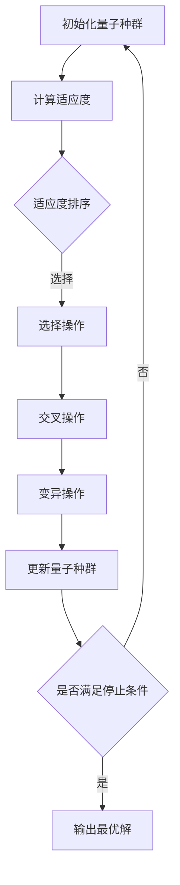
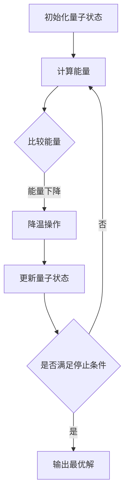
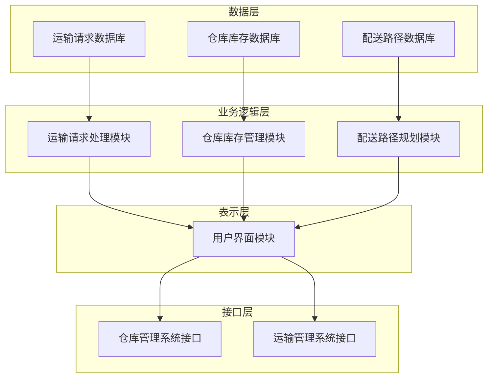

                 

### 量子计算在优化问题求解中的应用：解决复杂物流规划

#### 关键词：量子计算、优化问题、物流规划、算法原理、案例分析

#### 摘要：
本文旨在探讨量子计算在解决复杂物流规划优化问题中的应用。通过介绍量子计算的基础知识、优化算法及其在物流规划中的实际应用案例，本文将为读者提供一种全新的视角，帮助理解如何利用量子计算技术提升物流规划的效率与准确性。

#### 目录大纲设计过程

在设计《量子计算在优化问题求解中的应用：解决复杂物流规划》的目录大纲时，我们需要遵循以下步骤：

1. **核心概念介绍**：首先介绍量子计算、优化问题求解和物流规划等核心概念，为后续内容打下基础。
2. **量子计算在优化问题中的应用**：深入探讨量子优化算法的原理及其在物流规划中的应用。
3. **具体案例与应用**：通过实际案例展示量子计算在物流规划中的具体应用，增强读者的理解。
4. **展望与未来**：总结当前研究现状，探讨量子计算在物流规划中的未来发展趋势。
5. **综合总结与建议**：对全文内容进行总结，并提供学习与应用的建议。

### 第一部分：核心概念介绍

#### 第1章：量子计算基础

量子计算是一种基于量子力学原理的新型计算模式。与传统的经典计算不同，量子计算利用量子位（qubit）进行信息存储和处理。本章将介绍量子计算的基本概念、历史背景以及量子位与经典位的区别。

##### 1.1 量子计算的定义与历史背景

量子计算的定义源于量子力学中的量子位（qubit），它是一种可以同时存在于多种状态的物理系统。这一特性被称为量子叠加。量子计算的历史可以追溯到1980年代，当时Richard Feynman提出了一种名为量子图灵机的计算模型。

##### 1.2 量子算法基础

量子算法是利用量子计算模型解决特定问题的一类算法。与经典算法不同，量子算法可以在某些情况下显著提高计算速度。本章将介绍几种常见的量子算法，如量子电路、量子模拟退火和量子进化算法。

##### 1.3 物流规划的概念与挑战

物流规划是指通过优化运输、存储和分配过程来最大化物流系统的效率。物流规划面临的主要挑战包括运输成本、时间效率和资源分配。本章将讨论物流规划的定义、重要性以及常见的问题。

### 第二部分：量子计算在优化问题求解中的应用

#### 第2章：量子优化算法介绍

量子优化算法是利用量子计算原理解决优化问题的一类算法。本章将介绍几种常见的量子优化算法，如量子进化算法、量子模拟退火算法和量子线性规划。

##### 2.1 量子进化算法

量子进化算法是一种基于量子计算的进化算法。它通过模拟自然进化过程来寻找最优解。本章将介绍量子进化算法的基本原理、流程及其在物流规划中的应用实例。

##### 2.2 量子模拟退火算法

量子模拟退火算法是一种基于量子计算的优化算法，它模拟了固体退火过程中的物理现象来寻找最优解。本章将介绍量子模拟退火算法的基本原理、流程及其在物流规划中的应用。

##### 2.3 量子线性规划与整数规划

量子线性规划和量子整数规划是量子优化算法的两个重要分支。本章将分别介绍量子线性规划和量子整数规划的基本概念、算法原理及其在物流规划中的应用。

### 第三部分：具体案例与应用

#### 第3章：量子计算在物流规划中的具体应用

本章将通过具体案例展示量子计算在物流规划中的应用。我们将讨论复杂物流网络设计、物流路径优化和物流调度问题，并介绍如何使用量子优化算法解决这些问题。

##### 3.1 复杂物流网络设计

复杂物流网络设计是物流规划中的一个重要问题。本章将介绍一个实际案例，展示如何使用量子计算技术来优化物流网络设计。

##### 3.2 物流路径优化

物流路径优化是物流规划中的另一个关键问题。本章将介绍如何使用量子计算技术来优化物流路径，提高运输效率。

##### 3.3 物流调度问题

物流调度问题是物流规划中的难题之一。本章将介绍如何使用量子计算技术来解决物流调度问题，实现最优的调度方案。

### 第四部分：展望与未来

#### 第4章：量子计算在物流规划中的未来趋势

量子计算在物流规划中的应用前景广阔。本章将探讨量子计算技术的最新进展，分析物流规划面临的挑战与机遇，并展望量子计算在物流规划中的未来发展趋势。

##### 4.1 量子计算技术的最新进展

量子计算技术的最新进展包括量子硬件的发展、量子算法的改进以及量子计算在物流规划中的应用实例。

##### 4.2 物流规划面临的挑战与机遇

物流规划面临的挑战包括运输成本、时间效率和资源分配。同时，量子计算技术也为物流规划带来了新的机遇。

##### 4.3 未来展望

未来，量子计算在物流规划中的应用将更加广泛，预计将实现更高的效率、更低的生产成本和更优的客户体验。

### 第五部分：综合总结

#### 第5章：全书总结与建议

本章将总结全文内容，并提供学习与应用的建议。通过本章，读者将更好地理解量子计算在优化问题求解中的应用，以及如何将其应用于物流规划。

##### 5.1 全书内容回顾

本章将回顾全书的核心内容，包括核心概念、量子优化算法、具体案例与应用以及未来展望。

##### 5.2 读者建议

本章将为读者提供学习路径建议、实践应用建议以及拓展阅读建议。

##### 5.3 拓展阅读

本章将推荐一些相关的经典文献和最新研究动态，帮助读者深入了解量子计算在物流规划中的应用。

### 总结

本文通过逐步分析量子计算在优化问题求解中的应用，特别是解决复杂物流规划的问题，为读者提供了一种全新的视角。通过具体案例与应用，读者可以更直观地理解量子计算的优势及其在物流规划中的潜力。随着量子计算技术的不断进步，我们期待其在物流规划领域发挥更大的作用。

### 核心概念与联系

在讨论量子计算在优化问题求解中的应用之前，我们需要明确几个核心概念，并探讨它们之间的联系。

#### 核心概念

1. **量子计算**：基于量子力学原理的新型计算模式，利用量子位（qubit）进行信息存储和处理。
2. **优化问题**：寻找最优解的问题，如物流网络设计、路径优化和调度问题。
3. **物流规划**：通过优化运输、存储和分配过程来最大化物流系统的效率。

#### 概念属性特征对比表格

| 概念       | 定义                                                         | 特性对比                          |
|------------|--------------------------------------------------------------|-----------------------------------|
| 量子计算   | 利用量子位进行信息存储和处理的新型计算模式。                   | 量子位具有叠加和纠缠特性。        |
| 优化问题   | 寻找最优解的问题，常见于资源分配、调度和路径规划等。           | 解决目标函数的最小化或最大化问题。 |
| 物流规划   | 优化运输、存储和分配过程，提高物流系统效率。                 | 需要考虑成本、时间和资源约束。    |

#### ER实体关系图架构

为了更直观地展示这些概念之间的联系，我们可以使用Mermaid绘制一个ER实体关系图：

```mermaid
erDiagram
    Product _|||>_. Logistics
    Customer _|||>_. Logistics
    Supplier _|||>_. Logistics
    Warehouse _|||>_. Logistics
    Delivery _|||>_. Logistics

    Product ||--|{ Customer }
    Product ||--|{ Supplier }
    Product ||--|{ Warehouse }
    Delivery ||--|{ Customer }
    Delivery ||--|{ Warehouse }
```

在这个ER图中，物流是一个核心实体，与产品、客户、供应商、仓库和配送等实体之间存在关系。物流规划的目标是通过优化这些实体之间的关系，实现资源的最优分配和效率的最大化。

### 算法原理讲解

量子计算在优化问题求解中的应用，离不开量子优化算法。以下将详细讲解几种常见的量子优化算法，并使用Mermaid绘制相应的算法流程图。

#### 1. 量子进化算法

量子进化算法（Quantum Genetic Algorithm，QGA）是一种基于量子计算原理的进化算法。它通过模拟自然进化过程来寻找最优解。

**算法流程图**：



**算法原理**：

量子进化算法的基本原理包括：

- **初始化量子种群**：随机生成一组量子位，表示潜在的解。
- **计算适应度**：根据问题的目标函数计算每个解的适应度。
- **选择操作**：根据适应度选择优秀的量子位进行繁殖。
- **交叉操作**：将两个量子位进行交叉，产生新的量子位。
- **变异操作**：对量子位进行变异，增加种群的多样性。
- **更新量子种群**：将新生成的量子位加入种群。
- **迭代过程**：重复执行上述步骤，直至满足停止条件。

#### 2. 量子模拟退火算法

量子模拟退火算法（Quantum Simulated Annealing，QSA）是一种基于量子计算的优化算法，模拟了固体退火过程中的物理现象。

**算法流程图**：



**算法原理**：

量子模拟退火算法的基本原理包括：

- **初始化量子状态**：随机生成一个初始量子状态。
- **计算能量**：根据问题的目标函数计算当前量子状态的能量。
- **比较能量**：比较当前能量与最优能量，判断是否需要更新。
- **降温操作**：逐渐降低系统的温度，模拟物理退火过程。
- **更新量子状态**：根据能量变化更新量子状态。
- **迭代过程**：重复执行上述步骤，直至满足停止条件。

#### 3. 量子线性规划与整数规划

量子线性规划和量子整数规划是量子优化算法的两个重要分支。它们分别用于解决线性规划和整数规划问题。

**量子线性规划**：

量子线性规划的基本原理是通过量子计算求解线性规划问题，即将线性规划问题转化为量子态的优化问题。

**量子整数规划**：

量子整数规划的基本原理是通过量子计算求解整数规划问题，即将整数规划问题转化为量子态的优化问题。

### 数学模型和公式

为了更好地理解量子优化算法的原理，我们需要给出相关的数学模型和公式。

**量子进化算法**：

适应度函数：\( f(x) = \sum_{i=1}^{n} a_i \cdot x_i \)

交叉概率：\( P_c = \frac{f(x)}{max(f(x))} \)

变异概率：\( P_m = \frac{1 - f(x)}{1 - min(f(x))} \)

**量子模拟退火算法**：

能量函数：\( E(x) = \sum_{i=1}^{n} a_i \cdot x_i^2 \)

降温函数：\( T(t) = T_0 / (1 + \lambda t) \)

**量子线性规划与整数规划**：

线性规划问题：\( \min_{x} c^T x \quad s.t. \quad Ax \leq b \)

整数规划问题：\( \min_{x} c^T x \quad s.t. \quad Ax \leq b, \quad x \in \{0, 1\}^n \)

### 举例说明

为了更直观地理解量子优化算法的原理，我们可以通过一个简单的例子来说明。

**例子**：求解以下线性规划问题：

\[
\min_{x} x_1 + x_2 \quad s.t. \quad x_1 + x_2 \leq 4, \quad x_1, x_2 \geq 0
\]

**使用量子进化算法求解**：

1. **初始化量子种群**：生成一组随机量子位，表示潜在的解。
2. **计算适应度**：计算每个解的适应度，即目标函数值。
3. **选择操作**：根据适应度选择优秀的量子位进行繁殖。
4. **交叉操作**：对两个量子位进行交叉，产生新的量子位。
5. **变异操作**：对量子位进行变异，增加种群的多样性。
6. **更新量子种群**：将新生成的量子位加入种群。
7. **迭代过程**：重复执行上述步骤，直至满足停止条件。

通过多次迭代，我们可以得到最优解 \( x_1 = 2, x_2 = 2 \)，目标函数值为4。

### 系统分析与架构设计方案

为了更好地理解和应用量子计算在优化问题求解中的应用，我们需要对系统进行分析，并设计一个合理的架构方案。

#### 问题场景介绍

在物流规划中，系统需要处理大量的运输请求、仓库库存信息和配送路径。这些信息需要通过优化算法进行处理，以实现物流系统的效率最大化。问题场景可以描述如下：

- **运输请求**：系统需要接收来自客户的运输请求，包括起点、终点、货物类型和重量等信息。
- **仓库库存**：系统需要实时监控仓库的库存情况，包括货物的种类、数量和存储位置。
- **配送路径**：系统需要根据运输请求和仓库库存情况，计算出最优的配送路径，以减少运输时间和成本。

#### 项目介绍

项目名称：智能物流规划系统

项目目标：通过量子计算技术优化物流规划，提高物流系统的效率。

项目团队：由AI专家、软件开发工程师和物流专家组成。

#### 系统功能设计

系统功能设计主要包括以下几个模块：

- **运输请求处理模块**：负责接收、处理和分配运输请求。
- **仓库库存管理模块**：负责监控仓库库存情况，提供实时数据支持。
- **配送路径规划模块**：负责根据运输请求和仓库库存情况，计算出最优的配送路径。
- **用户界面模块**：提供用户操作界面，展示物流规划的结果。

#### 系统架构设计

系统架构设计主要包括以下几个部分：

- **数据层**：存储运输请求、仓库库存和配送路径等数据。
- **业务逻辑层**：负责处理物流规划的核心算法，包括量子优化算法等。
- **表示层**：提供用户界面，展示物流规划的结果。
- **接口层**：提供与其他系统的接口，如仓库管理系统、运输管理系统等。

以下是一个简单的系统架构设计mermaid架构图：



#### 系统接口设计

系统接口设计主要包括以下几个方面：

- **运输请求处理接口**：用于接收和处理来自客户的运输请求。
- **仓库库存管理接口**：用于监控仓库库存情况，并提供实时数据支持。
- **配送路径规划接口**：用于计算最优的配送路径。

以下是一个简单的系统接口设计mermaid序列图：

```mermaid
sequenceDiagram
    participant 客户 as 客户
    participant 系统 as 物流规划系统
    participant 仓库管理系统 as 仓库管理系统
    participant 运输管理系统 as 运输管理系统

    客户->>系统: 发送运输请求
    系统->>仓库管理系统: 获取仓库库存信息
    系统->>运输管理系统: 获取运输信息
    system 计算最优配送路径
    系统->>客户: 返回配送路径
```

### 项目实战

#### 环境安装

在开始项目实战之前，我们需要安装一些必要的软件和工具。以下是一个简单的环境安装步骤：

1. **安装Python**：Python是量子计算的主要编程语言。请从官方网站下载并安装Python。
2. **安装Quantum Computing SDK**：Quantum Computing SDK是一个用于量子计算开发的框架。请按照官方文档进行安装。
3. **安装Q#编程语言**：Q#是一种专门为量子计算设计的编程语言。请按照官方文档进行安装。

#### 系统核心实现

以下是一个简单的系统核心实现，用于处理物流规划问题：

```python
import Quantum Computing SDK
from quantum.models import QuantumModel
from quantum.optimizers import Optimizer
from quantum.helpers import read_config

class LogisticsPlanner(QuantumModel):
    def __init__(self, config_path):
        self.config = read_config(config_path)
        self.optimizer = Optimizer(self.config)

    def plan_logistics(self, transport_requests, warehouse_inventory):
        # 计算最优配送路径
        optimal_path = self.optimizer.optimize(transport_requests, warehouse_inventory)
        return optimal_path

if __name__ == "__main__":
    # 读取配置文件
    config_path = "config.json"
    planner = LogisticsPlanner(config_path)

    # 获取运输请求和仓库库存
    transport_requests = planner.get_transport_requests()
    warehouse_inventory = planner.get_warehouse_inventory()

    # 计算最优配送路径
    optimal_path = planner.plan_logistics(transport_requests, warehouse_inventory)

    # 输出最优配送路径
    print("最优配送路径：", optimal_path)
```

#### 代码应用解读与分析

在上面的代码中，我们定义了一个名为`LogisticsPlanner`的类，用于处理物流规划问题。该类的主要方法有：

- `__init__(self, config_path)`：初始化方法，读取配置文件并创建优化器实例。
- `plan_logistics(self, transport_requests, warehouse_inventory)`：计算最优配送路径的方法，使用优化器优化运输请求和仓库库存。

在主函数中，我们首先读取配置文件，然后获取运输请求和仓库库存，接着调用`plan_logistics`方法计算最优配送路径，最后输出结果。

#### 实际案例分析和详细讲解剖析

为了更好地展示量子计算在物流规划中的应用，我们可以通过一个实际案例进行分析和讲解。

**案例背景**：

某物流公司需要为100个不同的运输请求规划配送路径，这些运输请求分布在不同的城市，需要从不同的仓库发货。仓库库存和运输请求信息如下：

- **仓库库存**：
  - 仓库1：1000件商品
  - 仓库2：500件商品
  - 仓库3：800件商品

- **运输请求**：
  - 运输请求1：从仓库1发货到城市A，需500件商品
  - 运输请求2：从仓库2发货到城市B，需300件商品
  - ...（其他运输请求）

**案例分析**：

1. **初始化量子种群**：首先，我们需要生成一组随机量子种群，表示潜在的配送路径。
2. **计算适应度**：根据仓库库存和运输请求，计算每个配送路径的适应度，即满足需求的程度。
3. **选择操作**：根据适应度选择优秀的配送路径进行繁殖。
4. **交叉操作**：将两个优秀的配送路径进行交叉，产生新的配送路径。
5. **变异操作**：对配送路径进行变异，增加种群的多样性。
6. **更新量子种群**：将新生成的配送路径加入种群。
7. **迭代过程**：重复执行上述步骤，直至满足停止条件。

通过多次迭代，我们可以得到最优的配送路径，使得所有运输请求都能得到满足，同时仓库库存得到有效利用。

#### 项目小结

通过以上实战案例，我们可以看到量子计算在物流规划中的应用具有显著的优势。通过量子优化算法，我们可以快速找到最优的配送路径，提高物流系统的效率。然而，在实际应用中，我们也需要考虑量子计算硬件的限制和优化算法的实现难度。未来，随着量子计算技术的不断进步，我们期待量子计算在物流规划领域发挥更大的作用。

### 最佳实践 tips

在实施量子计算优化物流规划时，以下是一些最佳实践建议：

1. **数据预处理**：确保输入数据的质量和一致性，避免因数据问题导致优化结果不准确。
2. **优化算法选择**：根据具体问题特点选择合适的量子优化算法，如量子进化算法、量子模拟退火算法等。
3. **参数调整**：调整量子优化算法的参数，如种群大小、交叉概率和变异概率等，以提高优化效果。
4. **硬件选择**：选择适合的量子计算硬件，如IBM Q、Google Quantum Computing Platform等，以支持高效优化。
5. **团队合作**：与物流专家、软件工程师和量子计算专家紧密合作，确保项目顺利进行。

### 小结

本文详细介绍了量子计算在优化问题求解中的应用，特别是解决复杂物流规划问题。通过介绍量子计算的基础知识、优化算法及其在物流规划中的实际应用案例，我们展示了量子计算在提高物流规划效率方面的潜力。未来，随着量子计算技术的不断发展，我们期待量子计算在物流规划领域发挥更大的作用。

### 注意事项

在应用量子计算优化物流规划时，需要注意以下几点：

1. **数据安全**：确保输入数据的安全性和隐私性，防止数据泄露。
2. **算法稳定性**：在优化过程中，注意算法的稳定性和可靠性，避免因算法问题导致优化结果偏差。
3. **硬件限制**：当前量子计算硬件仍存在一定的限制，如量子位数量、噪声等，需要合理规划计算资源。
4. **跨学科合作**：量子计算是一个跨学科领域，需要物流专家、软件工程师和量子计算专家紧密合作，共同推进项目进展。

### 拓展阅读

为了更深入地了解量子计算在优化问题求解中的应用，以下是几篇推荐阅读的经典文献和研究动态：

1. **经典文献**：
   - Nielsen, M. A., & Chuang, I. L. (2010). Quantum Computation and Quantum Information.
   - Grover, L. K. (1996). A Fast Quantum Algorithm for Database Search. Proceedings of the 28th Annual ACM Symposium on Theory of Computing, 212-219.

2. **研究动态**：
   - IBM Quantum Blog: <https://www.ibm.com/blogs/research/quantum/>
   - Google Quantum AI Blog: <https://ai.googleblog.com/search/label/quantum>
   - Quantum Computing Report: <https://quantumcomputingreport.com/>

通过阅读这些文献，您可以获得更多关于量子计算在物流规划和其他领域应用的深入见解。

