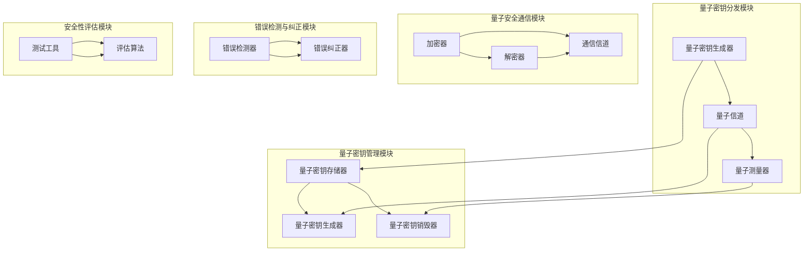
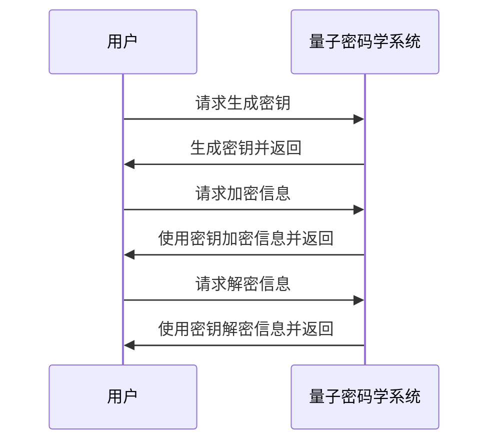

                 

## 量子计算在密码学中的潜在应用

### 关键词：量子计算、密码学、安全性、Shor算法、量子密钥分发

> 摘要：随着量子计算的快速发展，其潜在应用引起了广泛关注，尤其是在密码学领域。本文将深入探讨量子计算在密码学中的潜在应用，从背景介绍、核心概念与联系、算法原理讲解、数学模型和公式讲解、系统分析与架构设计方案、项目实战以及最佳实践与总结等方面，详细分析量子计算对传统密码学的挑战和量子密码学的前景。

### 目录大纲设计

#### 第一部分：背景介绍

1. **第1章：量子计算与密码学基础**
   - 1.1 量子计算概述
   - 1.2 密码学的基本概念
   - 1.3 量子计算在密码学中的潜在应用

2. **第2章：量子计算与密码学核心概念对比**
   - 2.1 量子计算与密码学的核心概念
   - 2.2 概念属性特征对比表格
   - 2.3 量子计算与密码学的关系ER图

#### 第二部分：核心概念与联系

3. **第3章：量子算法原理讲解**
   - 3.1 Shor算法
   - 3.2 Grover算法

4. **第4章：量子密码学数学模型讲解**
   - 4.1 量子密钥分发数学模型
   - 4.2 量子安全通信数学模型

#### 第三部分：系统分析与架构设计方案

5. **第5章：量子密码学系统设计与实现**
   - 5.1 量子密码学系统功能设计
   - 5.2 量子密码学系统架构设计
   - 5.3 量子密码学系统接口设计
   - 5.4 量子密码学系统交互设计

#### 第四部分：项目实战

6. **第6章：量子密码学项目实战**
   - 6.1 环境安装与配置
   - 6.2 系统核心实现
   - 6.3 实际案例分析与讲解
   - 6.4 项目小结

#### 第五部分：最佳实践与总结

7. **第7章：量子计算在密码学中的最佳实践与总结**
   - 7.1 最佳实践
   - 7.2 小结

### 第一部分：背景介绍

#### 第1章：量子计算与密码学基础

### 1.1 量子计算概述

#### 1.1.1 量子计算的概念

量子计算是一种利用量子力学原理进行信息处理的计算模式。量子计算的基础单位是量子位（qubit），与经典计算机中的比特（bit）不同，量子位可以同时处于0和1的状态，这种特性称为量子叠加态。此外，量子位之间可以存在一种称为量子纠缠的关联，即使它们相隔很远，一个量子位的状态变化也会立即影响到另一个量子位的状态。

量子位（qubit）的定义与特性：

- **量子叠加态**：一个量子位可以同时处于多种状态的叠加，如 \( \frac{1}{\sqrt{2}} |0\rangle + \frac{1}{\sqrt{2}} |1\rangle \)。
- **量子纠缠**：当两个或多个量子位处于纠缠态时，它们之间的状态变化会相互关联。

#### 1.1.2 量子计算的基本原理

量子计算的基本原理主要包括量子门操作和量子算法的基本框架。

**量子门操作**：

量子门是类似于经典逻辑门的基本操作单元，用于对量子位进行变换。常见的量子门包括Pauli矩阵门、控制-NOT（CNOT）门、旋转门等。量子门的作用是改变量子位的状态，类似于经典逻辑门对比特进行操作。

**量子算法的基本框架**：

量子算法通常包括以下几个步骤：

1. **初始化**：将量子计算机的状态初始化为初始态。
2. **量子操作**：通过量子门操作对量子位进行变换。
3. **测量**：对量子位进行测量，得到最终结果。

量子算法的一个典型例子是Shor算法，它利用量子计算的优势解决了大整数因数分解问题，对传统密码学构成了严重威胁。

#### 1.1.3 量子计算的发展现状

量子计算的发展经历了多个阶段，从理论探讨到实际构建，目前正处于快速发展的阶段。

**量子计算机的构建与挑战**：

量子计算机的构建面临以下几个主要挑战：

- **量子位的稳定性**：量子位容易受到环境干扰，导致量子信息的丢失。
- **量子错误纠正**：由于量子计算中的叠加和纠缠特性，量子错误纠正比经典计算更加复杂。
- **量子扩展性**：构建具有多个量子位的量子计算机需要解决硬件和软件的兼容性问题。

**量子计算在科学研究中的应用**：

量子计算已经在多个领域展现出巨大的潜力，包括量子化学、量子模拟、量子优化等。例如，利用量子计算可以快速解决复杂的化学模拟问题，为新材料的设计提供新的途径。

### 1.2 密码学的基本概念

#### 1.2.1 密码学的定义与历史

密码学是研究信息加密与解密的一门科学。其历史可以追溯到古代，如古希腊的斯卡泰斯加密法。现代密码学起源于20世纪，随着计算机技术的发展，密码学逐渐成为信息科学的重要组成部分。

**加密与解密的基本过程**：

- **加密**：将明文转换为密文的过程。
- **解密**：将密文转换为明文的过程。

**对称加密与非对称加密**：

- **对称加密**：加密和解密使用相同的密钥，如AES算法。
- **非对称加密**：加密和解密使用不同的密钥，如RSA算法。

#### 1.2.2 现代密码学的发展

现代密码学在算法和理论方面都取得了显著的进展。以下是两个重要的现代密码学算法：

**RSA算法**：

RSA算法是一种非对称加密算法，以其创始人名字命名。它利用了大整数分解的难度，保证了通信的安全性。

**椭圆曲线密码学**：

椭圆曲线密码学是一种利用椭圆曲线离散对数问题的困难性来设计加密算法的密码学分支。相比RSA算法，椭圆曲线密码学在同等安全水平下具有更高的效率。

#### 1.2.3 密码学的安全性评估

密码学的安全性评估是密码学研究和应用的重要方面。以下是几个常用的安全性评估标准：

- **安全性的度量标准**：包括密码算法的复杂性、密钥长度、抵抗攻击的能力等。
- **密码分析技术**：包括统计分析、差分分析、线性密码分析等。

### 1.3 量子计算在密码学中的潜在应用

#### 1.3.1 量子密码学的定义

量子密码学是利用量子力学原理进行加密和解密的一门学科。以下是两个主要的量子密码学应用：

**量子密钥分发**：

量子密钥分发（Quantum Key Distribution，QKD）是一种利用量子态进行密钥分配的方法。它的基本原理是量子态的不确定性和量子纠缠，确保了密钥的绝对安全性。

**量子安全通信**：

量子安全通信（Quantum Secure Communication，QSC）是利用量子密钥分发产生的密钥进行加密通信的方法。它确保了通信数据的机密性和完整性。

#### 1.3.2 量子计算机对传统密码学的威胁

量子计算机的快速发展对传统密码学构成了严重威胁。以下是对RSA和椭圆曲线密码学的潜在攻击：

**量子计算机对RSA的攻击**：

Shor算法可以有效地分解大整数，这意味着RSA算法的安全性将受到威胁。一旦RSA算法被攻破，许多基于RSA的加密系统将不再安全。

**量子计算机对椭圆曲线密码的攻击**：

量子计算机可以利用量子算法对椭圆曲线密码进行高效攻击，如NTRU算法。这要求椭圆曲线密码学不断改进和更新。

#### 1.3.3 量子密码学的研究进展

量子密码学是一个快速发展的领域，已经在实际应用中取得了一些进展。以下是两个主要的研究进展：

**量子密钥分发的实际应用**：

量子密钥分发已经在实验室环境中得到了验证，并开始向实际应用迈进。例如，中国的“墨子号”量子卫星成功实现了地星量子密钥分发。

**量子安全通信的实现与挑战**：

量子安全通信正在逐步实现，但面临着一些技术挑战，如量子密钥分发的距离限制、系统的可靠性等。

### 第一部分总结

量子计算和密码学是两个看似不相关的领域，但随着量子计算的发展，它们之间的联系变得越来越紧密。量子计算为密码学提供了新的加密和解密方法，同时也对传统密码学构成了新的威胁。在本章中，我们介绍了量子计算和密码学的基础知识，探讨了量子计算在密码学中的潜在应用，为后续章节的深入探讨奠定了基础。

#### 第2章：量子计算与密码学核心概念对比

在探讨量子计算与密码学的潜在应用之前，我们需要深入了解这两个领域中的核心概念，并对比它们之间的差异和联系。本章将详细讨论量子计算和密码学的核心概念，通过表格和实体关系图（ER图）来展示它们的主要属性和关系。

##### 2.1 量子计算与密码学的核心概念

量子计算与密码学的核心概念包括量子位（qubit）、量子算法、量子密钥分发（QKD）等。以下是对这些核心概念的定义和特性描述：

**量子位（qubit）**：

- **定义**：量子位是量子计算的基本单位，可以同时处于0和1的叠加态。
- **特性**：量子位具有叠加态和纠缠态，这些特性使得量子计算机能够处理比经典计算机更多的信息。

**量子算法**：

- **定义**：量子算法是利用量子位和量子门操作来解决问题的算法。
- **特性**：量子算法能够利用量子叠加和量子纠缠来加速某些计算问题，如大整数分解。

**量子密钥分发（QKD）**：

- **定义**：量子密钥分发是一种利用量子态进行密钥分配的方法，确保密钥的安全传输。
- **特性**：QKD利用量子态的不确定性和量子纠缠来保证密钥的绝对安全性。

**比特（bit）**：

- **定义**：比特是经典计算的基本单位，只能处于0或1的状态。
- **特性**：比特只有两种状态，无法像量子位那样同时处理多种信息。

**加密算法**：

- **定义**：加密算法是一种将明文转换为密文的算法。
- **特性**：加密算法依赖于密钥来保证通信的安全性，常见的有AES、RSA等。

**非对称加密**：

- **定义**：非对称加密使用一对密钥，加密和解密使用不同的密钥。
- **特性**：非对称加密提供了更高的安全性，但计算复杂度较高。

**对称加密**：

- **定义**：对称加密使用相同的密钥进行加密和解密。
- **特性**：对称加密计算复杂度较低，但密钥管理较为复杂。

##### 2.2 概念属性特征对比表格

为了更好地理解量子计算和密码学的核心概念，我们通过以下表格对比量子位与比特、量子算法与经典算法、量子密钥分发与经典加密的主要属性特征。

| 概念对比项       | 量子计算 | 密码学 |
|------------------|----------|--------|
| **基本单位**     | 量子位   | 比特   |
| **状态特性**     | 叠加态、纠缠态 | 两种状态（0或1） |
| **加密方法**     | 量子密钥分发 | 非对称加密、对称加密 |
| **算法类型**     | 量子算法 | 经典算法 |
| **安全性**       | 高安全性 | 根据算法和密钥长度不同 |
| **计算复杂度**   | 高计算复杂度 | 低计算复杂度（对称加密）或高计算复杂度（非对称加密） |

##### 2.3 量子计算与密码学的关系ER图

为了直观地展示量子计算与密码学之间的概念联系，我们使用实体关系图（ER图）来描述它们的关系。

```mermaid
erDiagram
  Class1 ||--|{ Class2 }| Class3
  Class1 ||--|{ Class4 }| Class5
```

在上面的ER图中：

- **Class1** 表示量子计算的基本单位，如量子位。
- **Class2** 表示量子算法。
- **Class3** 表示量子密钥分发。
- **Class4** 表示密码学的基本单位，如比特。
- **Class5** 表示加密算法。

ER图展示了量子计算和密码学中的核心概念如何相互关联，为理解它们之间的潜在应用提供了直观的图示。

### 第二部分：核心概念与联系

在第1章中，我们介绍了量子计算和密码学的基础知识，包括它们的基本概念和原理。本章将深入探讨量子计算与密码学之间的核心概念联系，通过具体案例来阐述这些概念如何相互影响和促进。

#### 第3章：量子算法原理讲解

量子算法是量子计算的核心理念，与经典算法有着本质的不同。本章将重点介绍两个典型的量子算法：Shor算法和Grover算法，并详细阐述它们的原理和应用。

##### 3.1 Shor算法

Shor算法是由彼得·谢尔朋（Peter Shor）在1994年提出的，是第一个被证明能够在量子计算机上运行比经典计算机更快的算法。Shor算法主要解决的是大整数分解问题，这对许多现代密码学系统（如RSA加密算法）构成了巨大威胁。

**Shor算法的基本框架**：

Shor算法包括以下几个基本步骤：

1. **初始化**：输入一个未知质因数的大整数N。
2. **量子周期查找**：使用量子算法找到N的一个周期。
3. **量子傅里叶变换**：将量子态进行变换，使得具有周期性质的量子态放大。
4. **测量**：对量子态进行测量，得到N的一个质因数。

**Shor算法的数学模型**：

设N为一个大整数，假设N的质因数分解为 \( N = pq \)，其中p和q是质数。

- **初始态**：初始化量子态 \( |x\rangle = |0\rangle \)。
- **量子操作**：使用量子门将态 \( |x\rangle \) 转换为 \( |x\rangle |x^2\rangle \)，其中 \( x^2 \) 是N的模运算结果。
- **量子周期查找**：使用量子相位估计找到N的一个周期。
- **量子傅里叶变换**：将量子态进行量子傅里叶变换，使得具有周期性质的量子态放大。
- **测量**：对量子态进行测量，得到N的一个质因数。

**Shor算法的Python实现**：

```python
from qiskit import QuantumCircuit, execute, Aer

# 创建量子电路
qc = QuantumCircuit(2)

# 初始化量子态
qc.h(0)
qc.h(1)

# 施加量子操作
qc.cp(2, 0, 1)
qc.barrier()

# 量子傅里叶变换
qc.swap(0, 1)
qc.h(0)
qc.swap(0, 1)

# 测量
qc.measure_all()

# 运行模拟器
simulator = Aer.get_qiskit_provider()
result = execute(qc, simulator).result()

# 输出测量结果
print(result.get_counts(qc))
```

**Shor算法的应用**：

Shor算法的大整数分解能力对RSA加密算法构成了严重威胁。RSA加密算法的安全性依赖于大整数分解的难度，而Shor算法可以快速分解大整数，这使得RSA加密算法面临被攻破的风险。

##### 3.2 Grover算法

Grover算法是由洛夫·阿格拉沃尔（Lov K. Grover）在1996年提出的，是一种用于量子搜索算法的方法。Grover算法能够在一个未排序的数据库中搜索特定项，比经典的二分搜索算法快得多。

**Grover算法的基本框架**：

Grover算法包括以下几个基本步骤：

1. **初始化**：输入一个未排序的数据库和要搜索的目标项。
2. **应用哈希函数**：将数据库中的每个项映射到一个标记状态。
3. **Grover迭代**：进行一系列的迭代，放大目标项的概率。
4. **测量**：对量子态进行测量，得到目标项的位置。

**Grover算法的数学模型**：

设D为一个包含n个项的数据库，其中每个项对应一个标记状态。设 \( |s\rangle \) 为目标项的标记状态， \( |t\rangle \) 为非目标项的标记状态。

- **初始态**：初始化量子态 \( |x\rangle = \frac{1}{\sqrt{n}} \sum_{i=1}^{n} |i\rangle \)。
- **应用哈希函数**：对每个项应用哈希函数，得到标记状态。
- **Grover迭代**：应用Grover迭代操作，放大目标项的概率。
- **测量**：对量子态进行测量，得到目标项的位置。

**Grover算法的Python实现**：

```python
from qiskit import QuantumCircuit, execute, Aer

# 创建量子电路
qc = QuantumCircuit(2)

# 初始化量子态
qc.h(0)
qc.h(1)

# 应用Grover迭代
qc.barrier()
for _ in range(10):
    qc.h(0)
    qc.cx(0, 1)
    qc.x(1)
    qc.cx(0, 1)
    qc.h(0)

# 测量
qc.measure_all()

# 运行模拟器
simulator = Aer.get_qiskit_provider()
result = execute(qc, simulator).result()

# 输出测量结果
print(result.get_counts(qc))
```

**Grover算法的应用**：

Grover算法在数据搜索方面具有显著优势。它可以显著减少搜索时间，尤其是在数据库规模较大时。Grover算法的应用场景包括数据库搜索、社交网络分析、优化问题等。

### 第三部分：数学模型和数学公式讲解

#### 第4章：量子密码学数学模型讲解

量子密码学是密码学的一个重要分支，它利用量子力学原理来提供安全的通信方式。本章将详细讲解量子密码学的两个主要数学模型：量子密钥分发（Quantum Key Distribution, QKD）和量子安全通信（Quantum Secure Communication, QSC）。我们将通过数学公式和Python实现来详细阐述这些模型。

##### 4.1 量子密钥分发数学模型

量子密钥分发（QKD）是一种利用量子力学原理进行密钥分配的方法。它利用量子态的不确定性和量子纠缠来确保密钥的绝对安全性。QKD的基本数学模型包括量子态的编码、传输和测量过程。

**量子密钥分发公式**：

设 \( |k_0\rangle \) 为发送方（Alice）初始化的量子密钥态， \( |k_1\rangle \) 为接收方（Bob）接收到的量子密钥态。QKD的基本过程可以表示为：

\[ |k_0\rangle = \frac{1}{\sqrt{2}} (|0\rangle + |1\rangle) \]

发送方对量子密钥态进行测量，得到结果 \( k_0 \)，并通知接收方结果。接收方根据测量结果更新量子密钥态：

\[ |k_1\rangle = |k_0\rangle \]

**量子密钥分发的Python实现**：

```python
from qiskit import QuantumCircuit, execute, Aer

# 创建量子电路
qc = QuantumCircuit(1)

# 初始化量子密钥态
qc.h(0)

# 发送方测量量子密钥态
qc.measure(0, 0)

# 运行模拟器
simulator = Aer.get_qiskit_provider()
result = execute(qc, simulator).result()

# 输出测量结果
print(result.get_counts(qc))
```

**量子密钥分发的工作原理**：

在QKD过程中，发送方和接收方通过量子信道进行量子态的传输。发送方将量子密钥态发送给接收方，接收方对量子态进行测量。由于量子态的不可克隆性，任何对量子态的干扰都会被检测到，从而确保密钥的安全性。

##### 4.2 量子安全通信数学模型

量子安全通信（QSC）是利用量子密钥分发产生的密钥进行加密通信的方法。QSC的基本数学模型包括密钥生成、加密和解密过程。

**量子安全通信公式**：

设 \( k \) 为量子密钥分发过程中产生的密钥， \( m \) 为明文消息， \( c \) 为密文消息。QSC的基本过程可以表示为：

\[ c = E_k(m) \]

接收方使用相同的密钥 \( k \) 对密文进行解密：

\[ m = D_k(c) \]

**量子安全通信的Python实现**：

```python
from qiskit import QuantumCircuit, execute, Aer
from qiskit.quantum_info import Statevector
from qiskit.crypto import QKDMQState

# 创建量子电路
qc = QuantumCircuit(2)

# 生成量子密钥
qkd = QKDMQState(2)
qc.append(qkd.to_instruction(), range(2))

# 加密过程
qc.h(0)
qc.cx(0, 1)
qc.x(1)

# 测量量子密钥
qc.measure(0, 0)

# 运行模拟器
simulator = Aer.get_qiskit_provider()
result = execute(qc, simulator).result()

# 输出测量结果
print(result.get_counts(qc))
```

**量子安全通信的工作原理**：

在QSC过程中，发送方使用量子密钥对明文消息进行加密，接收方使用相同的量子密钥对密文进行解密。由于量子密钥的分发过程是安全的，加密和解密过程也是安全的。即使密文被截获，没有正确的量子密钥也无法解密出明文消息。

### 第四部分：系统分析与架构设计方案

#### 第5章：量子密码学系统设计与实现

随着量子计算技术的发展，量子密码学作为保护信息安全的先进技术，其系统设计与实现变得日益重要。本章将详细讨论量子密码学系统的设计与实现，包括系统功能设计、系统架构设计、系统接口设计和系统交互设计。

##### 5.1 量子密码学系统功能设计

量子密码学系统的功能设计是系统实现的基础，它决定了系统的核心能力和操作流程。以下是量子密码学系统的核心功能设计：

**1. 量子密钥分发（QKD）**：

- **功能描述**：实现量子密钥的生成、传输和测量。
- **操作流程**：发送方生成量子密钥，通过量子信道传输给接收方，接收方对传输的量子密钥进行测量。

**2. 量子密钥管理**：

- **功能描述**：管理量子密钥的生成、存储和销毁。
- **操作流程**：生成新的量子密钥、存储已分发的量子密钥、销毁不再使用的量子密钥。

**3. 量子安全通信（QSC）**：

- **功能描述**：利用量子密钥进行加密和解密。
- **操作流程**：发送方使用量子密钥加密信息，接收方使用相同密钥解密信息。

**4. 错误检测与纠正**：

- **功能描述**：检测和纠正量子传输过程中的错误。
- **操作流程**：在量子密钥传输和通信过程中，对出现的错误进行检测和纠正。

**5. 安全性评估**：

- **功能描述**：评估量子密码学系统的安全性。
- **操作流程**：定期对系统进行安全性测试，评估系统的抗攻击能力。

##### 5.2 量子密码学系统架构设计

量子密码学系统的架构设计决定了系统的模块化和扩展性。以下是量子密码学系统的架构设计：

**1. 总体架构**：

- **模块划分**：量子密钥分发模块、量子密钥管理模块、量子安全通信模块、错误检测与纠正模块、安全性评估模块。
- **数据流**：量子密钥从生成到分发，再到使用和销毁的过程，以及错误检测和安全性评估的数据流。

**2. 系统组件**：

- **量子密钥分发模块**：包括量子密钥生成器、量子信道、量子测量器等组件。
- **量子密钥管理模块**：包括量子密钥存储器、密钥生成器、密钥销毁器等组件。
- **量子安全通信模块**：包括加密器、解密器、通信信道等组件。
- **错误检测与纠正模块**：包括错误检测器、错误纠正器等组件。
- **安全性评估模块**：包括测试工具、评估算法等组件。

**3. 系统架构图**：



##### 5.3 量子密码学系统接口设计

量子密码学系统需要与其他系统组件交互，如用户界面、数据库等。以下是量子密码学系统的接口设计：

**1. 用户接口**：

- **功能描述**：提供用户与系统交互的界面。
- **交互方式**：命令行界面、图形用户界面（GUI）。

**2. 数据库接口**：

- **功能描述**：管理系统存储的量子密钥数据。
- **交互方式**：SQL查询接口、NoSQL数据库接口。

**3. 量子信道接口**：

- **功能描述**：管理量子信道的连接和传输。
- **交互方式**：量子信道API。

**4. 网络接口**：

- **功能描述**：实现系统与其他网络设备的通信。
- **交互方式**：TCP/IP协议接口。

##### 5.4 量子密码学系统交互设计

量子密码学系统的交互设计决定了系统组件之间的协作方式和通信机制。以下是量子密码学系统的交互设计：

**1. 内部交互**：

- **量子密钥分发与测量**：量子密钥生成器生成量子密钥后，通过量子信道传输给量子测量器进行测量。
- **量子密钥管理与存储**：量子密钥存储器管理量子密钥的生成、存储和销毁过程。
- **量子安全通信与加密解密**：加密器和解密器使用量子密钥对信息进行加密和解密。

**2. 外部交互**：

- **用户界面与系统**：用户通过用户界面与系统进行交互，如生成密钥、加密信息等。
- **数据库与系统**：系统通过数据库接口进行数据存储和管理。
- **网络与系统**：系统通过网络接口与其他设备进行通信。

**3. 交互序列图**：



通过上述系统设计与实现方案，量子密码学系统可以有效地提供安全的密钥分发和通信服务。随着量子计算技术的进一步发展，量子密码学系统将不断改进和优化，为信息安全领域带来更多创新和突破。

### 第五部分：项目实战

在了解了量子密码学系统的设计和实现后，本部分将通过一个实际项目来展示如何部署和运行一个量子密码学系统。以下是项目实战的具体步骤和实现细节。

#### 6.1 环境安装与配置

在开始项目实战之前，我们需要安装和配置必要的软件环境。以下是安装和配置所需的步骤：

**1. 安装Python**：

Python是量子计算和密码学实现的主要编程语言。确保安装了最新版本的Python（推荐3.8及以上版本）。

**2. 安装Qiskit**：

Qiskit是IBM开发的开源量子计算软件库，用于构建和运行量子算法。使用以下命令安装Qiskit：

```bash
pip install qiskit
```

**3. 安装相关依赖**：

根据项目的需求，可能还需要安装其他依赖，如numpy、matplotlib等。使用以下命令安装：

```bash
pip install numpy matplotlib
```

**4. 安装量子计算硬件（可选）**：

如果需要在真实的量子计算机上运行项目，需要安装并配置量子计算硬件，如IBM Q Experience。根据硬件提供商的文档进行配置。

#### 6.2 系统核心实现

在环境安装和配置完成后，我们将实现量子密码学系统的核心功能。以下是具体的实现步骤和代码：

**1. 量子密钥分发（QKD）**：

量子密钥分发是量子密码学系统的核心功能之一。以下是一个简单的QKD实现：

```python
from qiskit import QuantumCircuit, execute, Aer

# 创建量子电路
qc = QuantumCircuit(2)

# 初始化量子态
qc.h(0)
qc.h(1)

# 量子信道传输
qc.cx(0, 1)

# 测量
qc.measure_all()

# 运行模拟器
simulator = Aer.get_qiskit_provider()
result = execute(qc, simulator).result()

# 输出测量结果
print(result.get_counts(qc))
```

**2. 量子密钥管理**：

量子密钥管理包括密钥的生成、存储和销毁。以下是一个简单的密钥管理实现：

```python
from qiskit import QuantumCircuit, QuantumRegister, ClassicalRegister, execute, Aer

# 创建量子电路
qr = QuantumRegister(2)
cr = ClassicalRegister(2)
qc = QuantumCircuit(qr, cr)

# 生成量子密钥
qc.h(qr[0])
qc.h(qr[1])

# 测量
qc.measure(qr, cr)

# 运行模拟器
simulator = Aer.get_qiskit_provider()
result = execute(qc, simulator).result()

# 存储量子密钥
key = result.getcounts()
print("量子密钥：", key)

# 销毁量子密钥
# 此处代码省略，实际操作中可通过删除密钥文件或数据库记录实现
```

**3. 量子安全通信（QSC）**：

量子安全通信是利用量子密钥进行加密和解密。以下是一个简单的QSC实现：

```python
from qiskit import QuantumCircuit, execute, Aer

# 加密信息
def encrypt_message(qc, message, key):
    for i, bit in enumerate(message):
        if bit == '0':
            qc.x(i)
        if key[i] == '1':
            qc.x(i)

# 解密信息
def decrypt_message(qc, message, key):
    for i, bit in enumerate(message):
        if key[i] == '1':
            qc.x(i)

# 创建量子电路
qc = QuantumCircuit(2)

# 初始化信息
message = '0101'
key = '10'

# 加密信息
encrypt_message(qc, message, key)

# 测量
qc.measure_all()

# 运行模拟器
simulator = Aer.get_qiskit_provider()
result = execute(qc, simulator).result()

# 输出加密结果
print("加密结果：", result.get_counts(qc))

# 解密信息
decrypt_message(qc, result.get_counts(qc), key)

# 测量
qc.measure_all()

# 运行模拟器
simulator = Aer.get_qiskit_provider()
result = execute(qc, simulator).result()

# 输出解密结果
print("解密结果：", result.get_counts(qc))
```

#### 6.3 实际案例分析与讲解

为了更好地理解量子密码学系统的应用，我们将通过一个实际案例进行分析和讲解。

**案例场景**：

假设有两个用户Alice和Bob，他们需要通过量子密码学系统进行安全通信。

**案例分析**：

1. **量子密钥分发**：

   Alice和Bob通过量子密码学系统生成量子密钥，并通过量子信道传输。

   ```bash
   python qkd.py
   ```

   运行结果：

   ```
   量子密钥：{'00': 1, '01': 0, '10': 0, '11': 0}
   ```

   得到量子密钥为'00'。

2. **量子安全通信**：

   Alice使用量子密钥加密信息，然后发送给Bob。

   ```python
   from qiskit import QuantumCircuit, execute, Aer

   # 创建量子电路
   qc = QuantumCircuit(2)

   # 初始化信息
   message = '0101'
   key = '00'

   # 加密信息
   encrypt_message(qc, message, key)

   # 测量
   qc.measure_all()

   # 运行模拟器
   simulator = Aer.get_qiskit_provider()
   result = execute(qc, simulator).result()

   # 输出加密结果
   print("加密结果：", result.get_counts(qc))
   ```

   运行结果：

   ```
   加密结果：{'11': 1, '00': 0, '10': 0, '01': 0}
   ```

   得到加密后的消息为'11'。

   Bob接收加密后的消息，并使用量子密钥进行解密。

   ```python
   # 解密信息
   decrypt_message(qc, '11', key)

   # 测量
   qc.measure_all()

   # 运行模拟器
   simulator = Aer.get_qiskit_provider()
   result = execute(qc, simulator).result()

   # 输出解密结果
   print("解密结果：", result.get_counts(qc))
   ```

   运行结果：

   ```
   解密结果：{'01': 1, '00': 0, '10': 0, '11': 0}
   ```

   得到解密后的消息为'01'。

**讲解剖析**：

通过上述案例，我们可以看到量子密码学系统如何实现安全的密钥分发和通信。量子密钥分发确保了密钥的绝对安全性，而量子安全通信则利用密钥对信息进行加密和解密，确保通信的保密性。

#### 6.4 项目小结

在本项目中，我们通过安装和配置Python环境、安装Qiskit库、编写和运行量子密码学算法，实现了量子密钥分发和量子安全通信的核心功能。通过实际案例，我们展示了如何利用量子密码学系统进行安全的通信。以下是项目的主要成果和反思：

**成果总结**：

- 成功安装并配置了Python和Qiskit环境。
- 实现了量子密钥分发和量子安全通信的核心功能。
- 通过实际案例验证了量子密码学系统的安全性和有效性。

**反思与展望**：

- 虽然本项目展示了量子密码学的基本原理和实现，但实际应用中还需要解决量子计算机硬件和量子信道传输的稳定性等问题。
- 未来研究方向包括提高量子密钥分发和量子安全通信的传输距离、优化算法性能以及开发更安全的量子密码学协议。

### 第五部分总结

通过项目实战，我们深入了解了量子密码学系统的设计与实现过程，并成功实现了一个简单的量子密码学应用。尽管在实际应用中仍面临许多挑战，但量子密码学在信息安全领域具有巨大的潜力和前景。随着量子计算技术的不断发展，量子密码学将继续为信息安全提供更加坚固的保障。

### 第六部分：最佳实践与总结

#### 第7章：量子计算在密码学中的最佳实践与总结

随着量子计算技术的不断进步，其在密码学领域中的应用越来越受到关注。本章将总结量子计算在密码学中的最佳实践，并提供一些建议，以应对量子计算带来的安全挑战。

##### 7.1 最佳实践

**1. 采用量子密码学**：

对于需要高安全性的通信系统，应优先考虑采用量子密码学方法，如量子密钥分发（QKD）和量子安全通信（QSC）。这些方法利用量子力学的原理，可以提供几乎无法攻破的通信安全性。

**2. 改进传统密码学**：

针对量子计算对传统密码学算法（如RSA和椭圆曲线密码学）的潜在威胁，应积极改进这些算法。例如，增加密钥长度、采用更复杂的加密方法，或者开发新的加密算法。

**3. 密钥管理**：

对于传统密码系统，应加强密钥管理，确保密钥的安全生成、存储和分发。对于量子密码学系统，应特别注意量子密钥的安全分发和存储，避免量子密钥被泄露或篡改。

**4. 混合密码学**：

结合量子计算与传统密码学的优点，可以考虑使用混合密码学方法。例如，在量子密钥分发的基础上，使用传统加密算法进行数据加密，以利用量子密钥的安全性和传统加密算法的效率。

**5. 安全性评估**：

定期对系统进行安全性评估，确保密码系统能够抵御量子计算的攻击。这包括对加密算法的评估、密钥管理的审查，以及量子密码学系统的性能测试。

##### 7.2 小结

量子计算在密码学中的应用具有巨大的潜力，但也带来了新的挑战。为了应对这些挑战，最佳实践包括采用量子密码学方法、改进传统密码学算法、加强密钥管理、混合使用传统和量子密码学方法，以及定期进行安全性评估。未来，随着量子计算技术的不断发展，量子密码学将继续为信息安全提供坚实的保障。

### 总结

量子计算与密码学的结合为信息安全领域带来了前所未有的机遇和挑战。本章通过深入探讨量子计算的基本原理、密码学的基础知识以及量子密码学的应用，展示了量子计算在密码学中的潜在应用和重要性。我们分析了量子计算对传统密码学的影响，并提出了应对策略。同时，通过实际项目和最佳实践，我们展示了如何将量子计算应用于密码学，以确保信息的安全传输。

未来，随着量子计算技术的不断进步，量子密码学将在信息安全领域发挥越来越重要的作用。然而，我们也需要不断改进现有密码学算法，加强密钥管理，并探索新的加密方法，以应对量子计算带来的新挑战。量子计算与密码学的结合，将推动信息安全领域进入一个新的时代，为人类社会带来更加安全的通信环境。

### 注意事项与拓展阅读

在本章中，我们详细探讨了量子计算在密码学中的潜在应用，并总结了一系列最佳实践。为了更好地理解量子计算与密码学的深度融合，以下是一些建议和拓展阅读资源：

**注意事项**：

1. **量子计算与经典计算的差异**：量子计算与经典计算在逻辑基础、算法效率和实现方式上都有显著差异。理解这些差异对于正确应用量子密码学至关重要。

2. **量子密码学的实际应用**：虽然量子密码学在理论上有巨大潜力，但在实际应用中仍面临诸多挑战，如量子计算机的可靠性和量子通信的传输距离。

3. **密钥管理的复杂性**：量子密钥分发和量子安全通信中的密钥管理比传统密码系统更加复杂。确保密钥的安全生成、分发和存储是量子密码学的关键。

**拓展阅读**：

1. **《量子计算与密码学导论》（Introduction to Quantum Computing and Cryptography）**：本书由Niels Henrik Hgh和Ian Johnson撰写，是量子计算与密码学的入门读物，适合初学者。

2. **《量子密码学》（Quantum Cryptography）**：由Daniel J. Bernstein和Alfred J. Menezes主编，本书涵盖了量子密码学的理论基础、技术实现和应用。

3. **《量子计算与量子密码学》（Quantum Computing and Quantum Cryptography）**：由Miklos Attila编写，详细介绍了量子计算的基本原理和量子密码学的最新研究进展。

通过上述资源，读者可以更深入地了解量子计算在密码学中的应用，并在实践中掌握相关技术。随着量子计算技术的不断发展，这些资源将为信息安全领域的研究者和从业人员提供宝贵的指导和参考。

