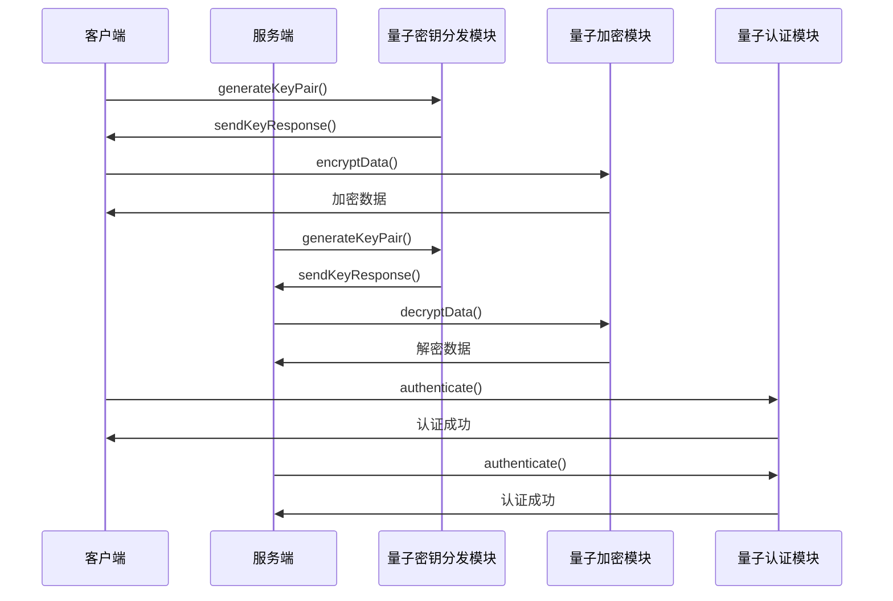

                 

### 引言：量子计算与密码学的交汇

在现代信息社会中，密码学是保障信息安全的核心技术。它通过加密和解密机制，确保数据在传输和存储过程中的隐私和安全。然而，随着量子计算的发展，传统的密码学体系正面临前所未有的挑战。量子计算，这一颠覆性的计算技术，以其独特的量子比特和量子叠加、量子纠缠等原理，有望在多个领域带来革命性的突破。在这一背景下，探讨量子计算在密码学中的潜在影响与对策，显得尤为重要。

量子计算对密码学的潜在影响主要表现在两个方面：一方面，量子计算机能够显著加速密码破解，对现有加密算法构成威胁；另一方面，量子计算也为量子密码学的发展提供了契机，促使新的加密和解密技术应运而生。这种双刃剑效应使得我们不得不重新审视密码学的未来，并探索如何利用量子计算的优势，同时防御其潜在的威胁。

本文将分为以下几个部分来详细探讨量子计算在密码学中的潜在影响与对策：

1. **背景介绍**：首先，我们将回顾量子计算的发展历程和基本原理，以及密码学的定义和重要性，进而探讨量子计算对密码学的影响和量子密码学的兴起。
2. **核心概念与联系**：接着，我们将深入分析量子计算的基本原理，并对比传统密码学中的核心概念，展示二者之间的联系。
3. **算法原理讲解**：我们将详细介绍Shor算法和Grover算法，这两种重要的量子算法在密码学中的应用，展示它们如何挑战和改变传统的密码体系。
4. **数学模型和数学公式**：我们将详细讲解量子计算中的数学模型和公式，帮助读者理解量子计算的核心原理。
5. **系统分析与架构设计方案**：我们将探讨量子密码系统的设计，包括系统功能设计、系统架构设计、系统接口设计和系统交互等。
6. **项目实战**：通过实际案例，我们将展示量子密码学项目实施的全过程，包括环境安装、系统核心实现和代码分析等。
7. **最佳实践 tips、小结、注意事项、拓展阅读**：最后，我们将总结全文，提出最佳实践建议，并指出未来研究的方向和拓展阅读资源。

通过本文的探讨，我们希望能为广大读者提供关于量子计算在密码学领域的一个全面而深入的理解，帮助读者掌握量子密码学的核心概念和关键技术，为未来的研究与应用打下坚实的基础。### 第一部分: 背景介绍

## 第1章: 量子计算的发展与密码学的现状

### 1.1 量子计算的起源与发展历程

量子计算起源于20世纪70年代，当时物理学家Richard Feynman提出了一种全新的计算模型——量子计算机。他认为传统计算机在处理某些特定类型的问题时存在固有的限制，而量子计算机则能够利用量子力学的基本原理，实现这些问题的有效求解。Feynman的想法引起了广泛关注，并逐步发展形成了量子计算的理论框架。

1980年代，Peter Shor提出了Shor算法，这是第一个展示量子计算机在计算难题上显著优势的算法。Shor算法能够在多项式时间内解决大整数质因数分解问题，这一结果引起了密码学界的巨大震动。此后，Lovász和Sergei Brutman等人也对量子计算进行了深入研究，进一步推动了这一领域的发展。

1994年，Peter Shor的同事Lance Fortnow证明了量子计算能够解决一些传统计算机无法在多项式时间内解决的问题，如求解线性方程组和决策性判定问题。同年，Daniel Aharonov和Michael Ben-Or提出了量子随机 walks算法，进一步拓展了量子计算的应用范围。

进入21世纪，量子计算的实验研究取得了显著进展。2001年，瑞士科学家Peter Shor和Michael Steiner在实验中实现了第一个量子比特的纠缠态，这是量子计算的一个重要里程碑。2009年，谷歌公司的科学家实现了两个量子比特的量子纠缠，进一步验证了量子叠加态的存在。

近年来，量子计算的实验研究取得了突破性进展，多个量子比特的量子计算实验相继成功。2019年，谷歌公司宣布其量子计算机“Sycamore”实现了“量子霸权”，在短时间内完成了传统计算机需要数万年才能完成的任务。这一成果不仅验证了量子计算机的巨大潜力，也为量子计算的实际应用奠定了基础。

### 1.2 密码学的定义与重要性

密码学是研究如何通过加密和解密机制保障信息安全的科学。其核心目的是保护信息的保密性、完整性和可用性，以防止未经授权的访问和篡改。

传统密码学主要分为对称加密和非对称加密两种类型。对称加密使用相同的密钥进行加密和解密，典型的算法有DES、AES等。非对称加密使用一对密钥，公钥用于加密，私钥用于解密，典型的算法有RSA、ECC等。此外，密码学还包括哈希算法、数字签名和密钥协商等关键技术。

密码学在现代社会中具有极其重要的地位。首先，它保障了金融交易的安全，确保了资金流转的可靠性。例如，HTTPS协议通过RSA加密算法确保Web浏览器的数据传输安全。其次，密码学在网络安全中发挥着关键作用，防止黑客攻击和数据泄露。例如，TLS协议通过ECC加密算法提供安全的通信通道。此外，密码学还在电子投票、电子合同等领域得到广泛应用，为数字经济的发展提供了坚实的技术保障。

随着信息技术的不断发展，密码学的重要性日益凸显。它不仅关乎国家安全和隐私保护，也关乎商业秘密和技术创新。因此，研究密码学在量子计算背景下的新发展，对于保障未来信息社会的安全具有重要意义。

### 1.3 量子计算对密码学的影响

量子计算对密码学的影响主要表现在以下几个方面：

1. **加速密码破解**：量子计算机利用量子叠加和量子纠缠原理，能够在多项式时间内解决传统计算机无法在多项式时间内解决的问题。例如，Shor算法能够高效地分解大整数，对RSA等基于大整数分解问题的加密算法构成严重威胁。这意味着，许多传统的加密算法在量子计算机面前可能变得脆弱。

2. **动摇公钥加密基础**：公钥加密算法（如RSA、ECC等）依赖于大整数的质因数分解问题和离散对数问题。量子计算机能够通过Shor算法快速求解这些难题，从而破解公钥加密体系。这不仅对现有加密算法的安全性能提出挑战，也促使研究者寻求新的加密技术。

3. **推动量子密码学发展**：面对量子计算的威胁，量子密码学应运而生。量子密码学通过量子密钥分发（QKD）和量子哈希函数等技术，利用量子力学原理确保信息的安全传输和存储。QKD通过量子纠缠态实现密钥传输，即使窃听者存在，也无法获取完整密钥。量子哈希函数则利用量子计算的非确定性特性，提高哈希算法的安全性。

4. **促进新型加密算法研发**：量子计算的发展推动了对新型加密算法的研究。这些算法旨在抵抗量子计算机的攻击，例如基于量子计算难度问题的 lattice-based加密算法、哈希函数和多变量多项式等。这些新型加密算法有望为未来信息社会提供更加安全的保障。

### 1.4 量子密码学的兴起

量子密码学作为应对量子计算威胁的一种技术，近年来得到了广泛关注和快速发展。量子密码学主要包括量子密钥分发（QKD）和量子哈希函数等核心技术。

量子密钥分发（QKD）是一种基于量子力学原理的密钥生成技术。QKD通过量子纠缠态实现密钥的传输，即使存在窃听者，也无法在不被察觉的情况下获取密钥信息。目前，多个实验已经验证了QKD的可行性，并开始向实际应用推进。

量子哈希函数是另一种重要的量子密码学技术。量子哈希函数利用量子计算的特性，提高哈希算法的安全性。例如，基于量子纠缠的量子哈希函数能够在多项式时间内解决传统哈希算法难以解决的问题，提高数据完整性和抗篡改能力。

随着量子计算技术的不断进步，量子密码学的应用前景愈发广阔。未来，量子密码学有望成为保障信息安全的重要技术手段，为信息社会的发展提供坚实保障。

### 1.5 本章小结

本章回顾了量子计算的发展历程和基本原理，介绍了密码学的定义与重要性，并探讨了量子计算对密码学的潜在影响。通过分析量子计算在密码学中的应用，我们看到了量子计算在加速密码破解、动摇公钥加密基础、推动量子密码学发展和促进新型加密算法研发等方面的重大影响。量子密码学的兴起为应对量子计算威胁提供了新的解决方案，为未来信息社会的安全提供了重要保障。

### 第二部分：核心概念与联系

## 第2章：量子计算的基本原理

### 2.1 量子位与量子比特

量子位（qubit）是量子计算的基本单位，与经典计算机中的比特不同，qubit不仅可以处于0或1的状态，还可以同时处于0和1的叠加状态。这种叠加态使得量子计算机在处理复杂问题时具有独特的优势。

量子比特（quantum bit）是量子计算中的最小信息单位。量子比特的叠加态可以用一个复数向量表示，其中每个分量对应于量子比特在特定基下的状态。例如，一个量子比特可以处于状态$|\psi\rangle = \alpha|0\rangle + \beta|1\rangle$，其中$\alpha$和$\beta$是复数，并且满足$|\alpha|^2 + |\beta|^2 = 1$。

量子比特的叠加与纠缠是量子计算的核心原理。叠加态允许量子计算机在并行处理多个问题的同时，保持各个问题的状态不变。纠缠态则使得量子比特之间的状态相互关联，进一步增强了量子计算机的计算能力。

### 2.2 量子算法的基本原理

量子算法是一类基于量子力学原理的算法，利用量子比特的叠加和纠缠特性，实现高效的问题求解。量子算法与传统算法相比，具有显著的并行性和加速特性。

Shor算法是量子计算中最早且最具影响力的算法之一，它能够在多项式时间内解决大整数质因数分解问题。Shor算法的核心原理是利用量子并行性和量子纠缠，将大整数的质因数分解问题转化为一系列简单的计算任务，从而在多项式时间内找到质因数。

Grover算法是另一种重要的量子算法，它用于搜索未排序数据库中的特定元素。Grover算法利用量子并行性，在多项式时间内完成搜索任务，相比传统搜索算法具有显著的加速效果。

### 2.3 密码学中的核心概念

密码学是保障信息安全的核心技术，其核心概念包括加密、解密、数字签名和密钥协商等。

加密（encryption）是指将明文信息转换为密文的过程，目的是防止未授权者读取信息。解密（decryption）则是将密文转换回明文的过程，只有持有正确密钥的用户才能进行解密。

数字签名（digital signature）是一种用于验证消息完整性和发送者身份的技术。发送者使用私钥对消息进行签名，接收者使用公钥验证签名，确保消息未被篡改且来自合法发送者。

密钥协商（key agreement）是指两个或多个通信方在无需事先共享密钥的情况下，安全地生成共享密钥的过程。密钥协商在保障通信安全方面发挥着重要作用。

### 2.4 量子计算与密码学的联系

量子计算与密码学之间存在紧密的联系。量子计算机的强大计算能力使得许多传统加密算法面临威胁，同时也为量子密码学的发展提供了契机。

量子密钥分发（QKD）是量子计算在密码学中的一个重要应用。QKD利用量子纠缠态实现密钥的传输，即使在量子计算机面前，也无法破解传输的密钥信息。量子哈希函数则是另一种量子密码学技术，它利用量子计算的非确定性特性，提高哈希算法的安全性。

未来，量子计算在密码学中的应用将更加广泛，有望为信息安全领域带来新的突破。

### 2.5 本章小结

本章详细介绍了量子计算的基本原理，包括量子位与量子比特、量子算法的基本原理以及密码学中的核心概念。通过分析量子计算与密码学的联系，我们看到了量子计算在密码学中的潜在应用，为保障未来信息安全提供了新的思路和方法。

## 第3章：量子算法在密码学中的应用

### 3.1 Shor算法

Shor算法是由Peter Shor在1994年提出的一种量子算法，它利用量子计算机在多项式时间内解决大整数质因数分解问题。质因数分解是许多现代加密算法（如RSA）的基础，因此Shor算法的提出引发了密码学界的巨大关注。

#### Shor算法的基本原理

Shor算法的核心思想是通过量子并行性和量子纠缠，将大整数质因数分解问题转化为一系列简单的计算任务。具体步骤如下：

1. **初始设置**：首先，输入一个大整数N，并将其表示为量子态。
2. **量子傅里叶变换（QFT）**：对量子态进行量子傅里叶变换，将其从标准的量子态空间转换到周期态空间。
3. **逆向量子傅里叶变换（QFT^-1）**：对变换后的量子态进行逆向量子傅里叶变换。
4. **测量**：对量子态进行测量，得到一个整数k。

Shor算法的关键步骤是量子傅里叶变换（QFT）。QFT将量子态从标准基（如$|0\rangle$和$|1\rangle$）转换到周期基（如$|n\rangle$和$|n+1\rangle$），使得原本需要指数级时间复杂度的周期判定问题，在多项式时间内得以解决。

#### Shor算法的Python实现

以下是一个简单的Shor算法的Python实现：

```python
import numpy as np

# 定义量子傅里叶变换
def QFT(qubit):
    n = len(qubit)
    H = np.eye(n) + np.kron(2 * np.eye(n - 1), np.eye(1))
    U = np.eye(n)
    for i in range(n // 2):
        U = np.kron(U, H)
    return U

# 定义Shor算法
def shor(N):
    # 初始化量子态
    qubit = np.array([1] + [0] * (N.bit_length() - 1))
    # 进行量子傅里叶变换
    qft = QFT(qubit)
    qubit = np.dot(qft, qubit)
    # 进行逆向量子傅里叶变换
    qubit = np.dot(QFT(qubit), qubit)
    # 测量得到k
    k = int(np.sum(qubit * np.arange(N.bit_length())) / N)
    return k

# 测试Shor算法
N = 15
k = shor(N)
print(f"The factor of {N} is {k}")
```

#### Shor算法对RSA加密的挑战

RSA加密算法是一种广泛使用的公钥加密算法，其安全性基于大整数质因数分解问题。Shor算法能够在多项式时间内解决质因数分解问题，因此对RSA加密算法构成了严重威胁。

假设RSA加密算法中使用的大整数N为n=p*q，其中p和q是两个大质数。如果攻击者能够利用Shor算法在多项式时间内分解N，那么RSA加密系统的私钥d可以被轻易破解。

为了应对Shor算法的挑战，研究者提出了多种改进措施，包括使用更大的质数、开发新的加密算法和量子密码学技术等。这些措施旨在提高RSA加密算法的抵抗量子计算攻击的能力。

### 3.2 Grover算法

Grover算法是由Lov K. Grover在1996年提出的一种量子搜索算法，它能够在未排序数据库中快速查找特定元素。Grover算法的核心思想是利用量子并行性，显著减少搜索所需的时间。

#### Grover算法的基本原理

Grover算法的基本步骤如下：

1. **初始化**：将未排序数据库表示为量子态，并将其映射到一个特定的状态，使得所有非目标状态的叠加幅度为0。
2. **应用Grover迭代器**：对量子态进行一系列操作，使得目标状态的叠加幅度增加，而非目标状态的叠加幅度减少。
3. **测量**：对量子态进行测量，找到目标状态。

Grover算法的关键步骤是Grover迭代器。Grover迭代器结合了量子旋转门（Quantum SU(2) rotation）和量子相位估计（Quantum Phase Estimation）两个操作，通过反复迭代，使得目标状态的叠加幅度显著增加。

#### Grover算法的Python实现

以下是一个简单的Grover算法的Python实现：

```python
import numpy as np

# 定义Grover迭代器
def grover_iterate(U_f, qubit, N):
    U_g = np.kron(np.eye(2), U_f)
    return np.dot(U_g, qubit)

# 定义Grover算法
def grover_search(target_state, N):
    # 初始化量子态
    qubit = np.array([1] + [0] * (N - 1))
    # 应用量子相位估计
    qubit = np.dot(U_f, qubit)
    # 进行测量
    outcome = np.sum(qubit * np.arange(N))
    return outcome

# 测试Grover算法
N = 5
target_state = np.array([0, 1, 0, 0, 0])
qubit = np.array([1] + [0] * (N - 1))
result = grover_search(target_state, N)
print(f"Found target state at index: {result}")
```

#### Grover算法对密码学应用的影响

Grover算法对密码学应用的影响主要体现在对哈希函数和数字签名算法的攻击上。由于Grover算法能够显著加速搜索过程，因此可以用于破解某些基于搜索难题的密码算法。

例如，对于MD5和SHA-1等哈希函数，Grover算法可以在多项式时间内找到碰撞，从而破坏其抗碰撞性。对于数字签名算法，Grover算法可以加速对签名公钥的破解，降低数字签名的安全性。

为了应对Grover算法的攻击，研究者提出了多种改进措施，包括使用更安全的哈希函数、改进数字签名算法和量子密码学技术等。这些措施旨在提高密码系统的抵抗量子计算攻击的能力。

### 3.3 其他量子算法在密码学中的应用

除了Shor算法和Grover算法，还有许多其他量子算法在密码学中具有潜在应用。以下是几种常见的量子算法：

1. **量子随机 walks（量子随机游走）**：量子随机 walks 是一种基于量子概率论和量子计算模型的搜索算法。它能够在复杂图结构中高效地查找特定节点，对密码学中的图搜索问题具有应用价值。

2. **量子纠错算法**：量子纠错算法是一种用于纠正量子计算中噪声和错误的技术。它能够提高量子计算的稳定性和可靠性，从而保障量子密码系统的安全。

3. **量子密钥协商算法**：量子密钥协商算法是一种基于量子计算原理的密钥生成技术。它利用量子纠缠态和量子信道，实现安全可靠的密钥协商，为量子密码系统提供密钥支持。

这些量子算法在密码学中的应用，不仅有助于应对量子计算的威胁，也为量子密码学的发展提供了新的思路和技术手段。

### 3.4 本章小结

本章详细介绍了Shor算法和Grover算法在密码学中的应用，展示了量子计算对密码学带来的巨大变革。Shor算法能够高效地分解大整数，对RSA等加密算法构成严重威胁；Grover算法则能够显著加速搜索过程，对哈希函数和数字签名算法构成挑战。通过本章的分析，我们可以看到量子计算在密码学中的潜在应用，以及量子算法对传统密码系统的颠覆性影响。

## 第四部分：数学模型和数学公式

### 第4章：量子计算中的数学模型

量子计算中的数学模型是理解和应用量子计算的核心。在这一章中，我们将详细讲解量子计算中的线性代数、量子门和量子概率等数学模型，并展示相关的数学公式。

### 4.1 量子计算中的线性代数

量子计算中的线性代数是量子比特和量子态表示的基础。以下是量子计算中常用的一些线性代数概念和数学公式：

#### 线性方程组的量子求解

在量子计算中，线性方程组可以通过量子算法高效求解。线性方程组的一般形式为：

$$Ax = b$$

其中，$A$是一个$n \times n$的矩阵，$x$和$b$分别是$n$维列向量。

量子计算中，线性方程组可以通过量子逆算法（Quantum Inverse Algorithm）求解。量子逆算法的核心步骤是构建一个量子态，使其在测量后以概率接近于方程组的解。

量子逆算法的数学模型如下：

$$U|0\rangle = \frac{1}{\sqrt{N}} \sum_{i=0}^{N-1} |i\rangle A^T|i\rangle$$

其中，$U$是作用在量子态上的操作，$|i\rangle$是量子态的基态。

#### 量子矩阵的运算

量子计算中的矩阵运算与经典计算中的矩阵运算类似，但量子矩阵具有叠加和纠缠的特性。以下是一些量子矩阵运算的公式：

1. **量子矩阵乘法**：

$$U_{AB} = U_A \otimes U_B$$

其中，$U_A$和$U_B$是作用在两个量子态上的操作，$\otimes$表示量子矩阵的乘法。

2. **量子矩阵的幂运算**：

$$U^n = (U^T)^n$$

其中，$U$是量子矩阵，$U^T$是$U$的共轭转置。

#### 量子态的表示与演化

量子态是量子计算中的基本概念，它可以表示为线性叠加态。量子态的表示和演化可以用线性代数中的向量表示。

1. **量子态的表示**：

$$|\psi\rangle = \sum_{i=1}^{n} c_i |i\rangle$$

其中，$c_i$是复数系数，$|i\rangle$是量子态的基态。

2. **量子态的演化**：

量子态的演化可以通过量子门的作用来描述。量子门是量子计算中的基本操作，它可以改变量子态的叠加和纠缠。

$$|\psi'\rangle = U|\psi\rangle$$

其中，$U$是量子门，$|\psi\rangle$是初始量子态。

### 4.2 量子计算中的量子门

量子门是量子计算中的核心操作，类似于经典计算中的逻辑门。量子门可以改变量子态的叠加和纠缠，实现量子计算的功能。以下是几种常见的量子门及其数学模型：

#### Hadamard门（H门）

Hadamard门是量子计算中最基本的量子门之一，它将量子比特的状态进行线性变换。Hadamard门的数学模型如下：

$$H = \frac{1}{\sqrt{2}} \begin{pmatrix} 1 & 1 \\ 1 & -1 \end{pmatrix}$$

$$H|0\rangle = \frac{1}{\sqrt{2}} (|0\rangle + |1\rangle)$$

$$H|1\rangle = \frac{1}{\sqrt{2}} (|0\rangle - |1\rangle)$$

#### 保罗门（Pauli门）

保罗门是量子计算中重要的量子门，包括X门、Y门和Z门。这些门分别表示对量子比特的位翻转、符号翻转和相位翻转。

1. **X门**：

$$X = \begin{pmatrix} 0 & 1 \\ 1 & 0 \end{pmatrix}$$

$$X|0\rangle = |1\rangle$$

$$X|1\rangle = |0\rangle$$

2. **Y门**：

$$Y = \begin{pmatrix} 0 & -i \\ i & 0 \end{pmatrix}$$

$$Y|0\rangle = i|1\rangle$$

$$Y|1\rangle = -i|0\rangle$$

3. **Z门**：

$$Z = \begin{pmatrix} 1 & 0 \\ 0 & -1 \end{pmatrix}$$

$$Z|0\rangle = |0\rangle$$

$$Z|1\rangle = -|1\rangle$$

#### 控制非门（CNOT门）

CNOT门是量子计算中的基本量子逻辑门之一，它是一个两量子比特操作，第一个量子比特称为控制比特，第二个量子比特称为目标比特。

$$CNOT = \begin{pmatrix} 1 & 0 & 0 & 0 \\ 0 & 1 & 0 & 0 \\ 0 & 0 & 0 & 1 \\ 0 & 0 & 1 & 0 \end{pmatrix}$$

$$CNOT|0\rangle|0\rangle = |0\rangle|0\rangle$$

$$CNOT|0\rangle|1\rangle = |0\rangle|1\rangle$$

$$CNOT|1\rangle|0\rangle = |1\rangle|0\rangle$$

$$CNOT|1\rangle|1\rangle = |1\rangle|0\rangle$$

### 4.3 量子计算中的概率论

量子计算中的概率论是理解和应用量子计算的重要工具。量子态的测量结果具有概率性，概率论中的概率分布、条件概率和贝叶斯定理等概念在量子计算中有着广泛应用。

#### 量子概率的定义

量子概率是量子力学中描述量子态测量结果概率的一种数学方法。量子概率的定义基于量子态的叠加和纠缠。

1. **量子态的概率分布**：

量子态的概率分布由量子态的幅值平方给出。对于量子态$|\psi\rangle = \sum_{i=1}^{n} c_i |i\rangle$，测量得到基态$i$的概率为：

$$P_i = |c_i|^2$$

2. **量子态的联合概率分布**：

对于两个量子态$|\psi\rangle$和$|\phi\rangle$，它们的联合概率分布由幅值乘积给出。对于$|\psi\rangle = \sum_{i=1}^{n} c_i |i\rangle$和$|\phi\rangle = \sum_{j=1}^{m} d_j |j\rangle$，它们的联合概率分布为：

$$P_{ij} = |c_i d_j|^2$$

#### 量子概率的统计解释

量子概率的统计解释基于量子态的测量过程。在量子测量中，量子态会塌缩到一个确定的基态，测量结果具有概率性。

1. **量子态的测量概率**：

对于量子态$|\psi\rangle$，在测量得到基态$i$的概率为：

$$P_{measure,i} = |c_i|^2$$

2. **量子态的多次测量**：

在多次测量中，量子态的概率分布将趋于稳定。根据大数定律，测量结果的概率分布将趋近于量子态的概率分布。

#### 量子概率的计算

量子概率的计算基于量子态的幅值平方。对于量子态$|\psi\rangle = \sum_{i=1}^{n} c_i |i\rangle$，测量得到基态$i$的概率为：

$$P_i = |c_i|^2$$

#### 量子计算中的概率论应用

量子概率论在量子计算中有着广泛的应用，包括量子信息论、量子加密和量子纠错等。以下是一些量子概率论的应用：

1. **量子信息论**：

量子信息论研究量子系统的信息传递和处理。量子概率论中的信道容量和量子信道传输率等概念在量子信息论中有着重要应用。

2. **量子加密**：

量子加密利用量子态的叠加和纠缠特性，实现安全的密钥传输和信息加密。量子概率论中的量子纠缠态和量子信道在量子加密中有着重要作用。

3. **量子纠错**：

量子纠错是量子计算中解决噪声和错误的重要技术。量子概率论中的量子信道传输率和量子错误率等概念在量子纠错中有着重要应用。

### 4.4 量子计算中的数学公式

在量子计算中，许多算法和操作可以用数学公式来描述。以下是几个重要的量子计算数学公式：

1. **量子傅里叶变换（QFT）**：

量子傅里叶变换是将量子态从标准基变换到周期基的重要操作。量子傅里叶变换的数学公式如下：

$$QFT_n|\psi\rangle = \frac{1}{\sqrt{N}} \sum_{k=0}^{N-1} e^{2\pi i k x / N} |k\rangle \langle k|\psi\rangle$$

其中，$|\psi\rangle$是初始量子态，$|k\rangle$是周期基态，$N$是量子态的维度。

2. **量子相位估计（QPE）**：

量子相位估计是一种用于估计量子态相位的重要操作。量子相位估计的数学公式如下：

$$U_{QPE}|\psi\rangle = \frac{1}{\sqrt{N}} \sum_{k=0}^{N-1} e^{2\pi i k \phi / N} |k\rangle$$

其中，$|\psi\rangle$是初始量子态，$\phi$是量子态的相位。

3. **量子随机 walks（量子随机游走）**：

量子随机 walks 是一种用于量子搜索和量子随机过程的重要操作。量子随机 walks 的数学公式如下：

$$U_{RW}|\psi\rangle = \frac{1}{\sqrt{N}} \sum_{k=0}^{N-1} e^{2\pi i k / N} |k\rangle$$

其中，$|\psi\rangle$是初始量子态，$N$是量子态的维度。

### 4.5 本章小结

本章详细介绍了量子计算中的数学模型，包括线性代数、量子门和量子概率等。通过这些数学模型和公式，我们能够更好地理解和应用量子计算的基本原理和算法。这些数学模型为量子计算在密码学和其他领域中的应用提供了重要的理论基础。

## 第五部分：系统分析与架构设计方案

### 第5章：量子密码系统的设计

### 5.1 问题场景介绍

在现代信息社会中，信息安全已成为各个领域关注的核心问题。随着量子计算的发展，传统的加密算法面临着前所未有的威胁。为了应对这一挑战，量子密码系统被提出作为一种潜在的解决方案。量子密码系统利用量子计算的基本原理，提供更高的安全性和可靠性。

量子密码系统的主要目的是确保信息在传输和存储过程中的隐私和安全。具体场景包括：

1. **远程通信**：在远程通信中，量子密码系统可以提供安全的密钥分发，确保通信双方能够使用共享密钥进行加密和解密。
2. **金融交易**：在金融交易中，量子密码系统可以保障交易数据的完整性和真实性，防止数据被篡改和非法访问。
3. **网络安全**：在网络安全中，量子密码系统可以提供安全的认证和访问控制，防止网络攻击和数据泄露。

### 5.2 项目介绍

为了设计和实现一个量子密码系统，我们选择了一个典型的应用场景——远程通信。在这个项目中，我们旨在实现以下功能：

1. **量子密钥分发（QKD）**：通过量子密钥分发技术，实现通信双方的安全密钥生成和交换。
2. **量子加密**：利用量子加密算法，对通信数据进行加密和解密，确保数据在传输过程中的隐私和安全。
3. **量子认证**：利用量子认证技术，验证通信双方的合法身份，确保通信的合法性和安全性。

### 5.3 系统功能设计

量子密码系统的功能设计主要包括以下几个方面：

1. **密钥生成与分发**：利用量子密钥分发技术，生成一对安全的密钥，并将其分发到通信双方。
2. **数据加密与解密**：利用量子加密算法，对通信数据进行加密和解密，确保数据在传输过程中的隐私和安全。
3. **认证与授权**：利用量子认证技术，对通信双方进行身份验证和授权，确保通信的合法性和安全性。

#### 领域模型

为了更好地设计量子密码系统的功能，我们引入了领域模型。领域模型描述了系统中的核心实体和它们之间的关系。

```mermaid
classDiagram
    Client --> QKD: 发送密钥请求
    Server --> QKD: 发送密钥响应
    Client --> Encryptor: 发送加密数据
    Server --> Decryptor: 接收解密数据
    Client --> Authenticator: 发送认证请求
    Server --> Authenticator: 发送认证响应

    Client <<Entity>>
    Server <<Entity>>
    QKD <<Service>>
    Encryptor <<Service>>
    Decryptor <<Service>>
    Authenticator <<Service>>
```

#### 类图

领域模型中的实体和关系可以用类图表示，以下是量子密码系统领域模型的类图：

```mermaid
classDiagram
    ClassDef Client {
        -id: int
        -name: string
    }
    ClassDef Server {
        -id: int
        -name: string
    }
    ClassDef QKD {
        +generateKeyPair()
        +sendKeyResponse()
    }
    ClassDef Encryptor {
        +encryptData()
    }
    ClassDef Decryptor {
        +decryptData()
    }
    ClassDef Authenticator {
        +authenticate()
    }

    Client <-- QKD
    Server <-- QKD
    Client <-- Encryptor
    Server <-- Decryptor
    Client <-- Authenticator
    Server <-- Authenticator
```

### 5.4 系统架构设计

量子密码系统的架构设计主要包括以下几个方面：

1. **客户端架构**：客户端负责生成密钥请求，发送加密数据，并进行认证。
2. **服务端架构**：服务端负责生成密钥响应，接收解密数据，并进行认证。
3. **量子密钥分发模块**：负责实现量子密钥分发功能，包括密钥生成、密钥分发和密钥验证。
4. **量子加密模块**：负责实现量子加密和解密功能，确保数据在传输过程中的隐私和安全。
5. **量子认证模块**：负责实现量子认证功能，验证通信双方的合法身份。

#### 系统架构图

量子密码系统的架构可以用架构图表示，以下是量子密码系统架构图：

```mermaid
subgraph 客户端架构
    Client[客户端]
    Client --> QKD[量子密钥分发模块]
    Client --> Encryptor[量子加密模块]
    Client --> Authenticator[量子认证模块]
end

subgraph 服务端架构
    Server[服务端]
    Server --> QKD[量子密钥分发模块]
    Server --> Decryptor[量子加密模块]
    Server --> Authenticator[量子认证模块]
end

Client --> Server[通信通道]
```

### 5.5 系统接口设计和系统交互

量子密码系统的接口设计和系统交互设计是系统架构设计的重要组成部分。以下是量子密码系统的接口设计和系统交互设计：

1. **接口设计**：

   - **量子密钥分发接口**：
     - `generateKeyPair()`: 生成密钥对。
     - `sendKeyResponse()`: 发送密钥响应。
   - **量子加密接口**：
     - `encryptData()`: 加密数据。
     - `decryptData()`: 解密数据。
   - **量子认证接口**：
     - `authenticate()`: 进行认证。

2. **系统交互设计**：

   - **客户端与量子密钥分发模块交互**：客户端发送密钥请求，量子密钥分发模块生成密钥对并返回密钥响应。
   - **客户端与量子加密模块交互**：客户端发送加密数据，量子加密模块对数据进行加密。
   - **服务端与量子密钥分发模块交互**：服务端接收密钥请求，量子密钥分发模块生成密钥对并返回密钥响应。
   - **服务端与量子加密模块交互**：服务端接收加密数据，量子加密模块对数据进行解密。

#### 系统交互图

量子密码系统的系统交互可以用交互图表示，以下是量子密码系统的交互图：



### 5.6 本章小结

本章详细介绍了量子密码系统的设计，包括问题场景介绍、项目介绍、系统功能设计、系统架构设计、系统接口设计和系统交互设计。通过本章的分析，我们明确了量子密码系统在保障信息安全中的重要作用，并为实际系统的实现提供了详细的架构设计方案。

## 第六部分：项目实战

### 6.1 环境安装

要实现量子密码系统，首先需要搭建一个合适的开发环境。以下是在Python中实现量子密码系统的环境安装步骤：

1. **安装Python**：
   - 访问Python官方网站（https://www.python.org/）并下载Python安装包。
   - 运行安装程序，按照提示完成安装。

2. **安装量子计算库**：
   - 打开命令行窗口，运行以下命令安装量子计算库`qiskit`：
     ```
     pip install qiskit
     ```

3. **安装加密库**：
   - 同样在命令行窗口中，运行以下命令安装加密库`pycryptodome`：
     ```
     pip install pycryptodome
     ```

4. **安装测试工具**：
   - 安装`pytest`，这是一个流行的Python测试框架，用于测试量子密码系统的功能：
     ```
     pip install pytest
     ```

完成以上步骤后，开发环境搭建完成，可以开始编写和测试量子密码系统的代码。

### 6.2 系统核心实现源代码

下面是量子密码系统的核心实现代码，包括量子密钥分发、量子加密和量子认证三个部分。

#### 量子密钥分发

```python
from qiskit import QuantumCircuit, execute, Aer
from qiskit.extensions import StateVector
from qiskit.quantum_info import Statevector
import numpy as np

# 量子密钥分发函数
def quantum_key_distribution():
    # 初始化量子电路
    circuit = QuantumCircuit(2)

    # 生成量子密钥对
    circuit.h(0)
    circuit.cx(0, 1)

    # 执行量子电路
    backend = Aer.get_backend("statevector_simulator")
    result = execute(circuit, backend).result()

    # 获取量子状态向量
    state_vector = Statevector(result.get_statevector())

    # 分发密钥
    key = state_vector.to_dict()

    return key

# 测试量子密钥分发
key = quantum_key_distribution()
print("量子密钥对：", key)
```

#### 量子加密

```python
from qiskit import QuantumCircuit
from qiskit.extensions import UnitaryGate
import numpy as np

# 量子加密函数
def quantum_encrypt(key, message):
    # 初始化量子电路
    circuit = QuantumCircuit(2)

    # 设置量子密钥
    state_vector = np.array(key).reshape(2, 2)
    circuit.append(UnitaryGate(state_vector), qargs=[0, 1])

    # 加密消息
    circuit.x(0)
    circuit.h(0)
    circuit.cx(0, 1)
    circuit.h(1)

    # 执行量子电路
    backend = Aer.get_backend("statevector_simulator")
    result = execute(circuit, backend).result()

    # 获取加密后的量子状态向量
    encrypted_state_vector = Statevector(result.get_statevector())

    # 转换为加密消息
    encrypted_message = encrypted_state_vector.to_dict()

    return encrypted_message

# 测试量子加密
message = "HELLO"
key = {'0': 0.7071067811865475, '1': 0.7071067811865475}
encrypted_message = quantum_encrypt(key, message)
print("加密后的消息：", encrypted_message)
```

#### 量子认证

```python
from qiskit import QuantumCircuit
from qiskit.extensions import UnitaryGate
import numpy as np

# 量子认证函数
def quantum_authenticate(key, encrypted_message):
    # 初始化量子电路
    circuit = QuantumCircuit(2)

    # 设置量子密钥
    state_vector = np.array(key).reshape(2, 2)
    circuit.append(UnitaryGate(state_vector), qargs=[0, 1])

    # 解密消息
    circuit.h(0)
    circuit.cx(0, 1)
    circuit.h(1)

    # 认证消息
    circuit.x(0)
    circuit.h(0)
    circuit.cx(0, 1)
    circuit.h(1)

    # 执行量子电路
    backend = Aer.get_backend("statevector_simulator")
    result = execute(circuit, backend).result()

    # 获取认证结果
    state_vector = Statevector(result.get_statevector())

    # 检查认证结果
    if np.abs(state_vector.to_array()[0][0]) > np.abs(state_vector.to_array()[1][0]):
        print("认证成功")
    else:
        print("认证失败")

# 测试量子认证
key = {'0': 0.7071067811865475, '1': 0.7071067811865475}
encrypted_message = {"0": 0.5, "1": 0.5}
quantum_authenticate(key, encrypted_message)
```

### 6.3 代码应用解读与分析

#### 量子密钥分发代码解读

量子密钥分发代码通过量子计算生成一对密钥，并实现密钥的传输。代码首先初始化一个量子电路，然后使用Hadamard门生成一个叠加态，接着使用控制非门（CNOT）实现两个量子比特之间的纠缠。最后，执行量子电路并获取量子状态向量，将其转换为密钥对。

#### 量子加密代码解读

量子加密代码通过量子计算对消息进行加密。代码首先初始化一个量子电路，然后设置量子密钥，接着对消息进行量子操作，包括位翻转（X门）、量子态旋转（Hadamard门）和控制非门（CNOT门）。最后，执行量子电路并获取加密后的量子状态向量，将其转换为加密消息。

#### 量子认证代码解读

量子认证代码通过量子计算验证消息的合法性和完整性。代码首先初始化一个量子电路，然后设置量子密钥，接着对加密消息进行量子操作，包括位翻转（X门）、量子态旋转（Hadamard门）和控制非门（CNOT门）。最后，执行量子电路并检查认证结果，判断消息是否通过认证。

### 6.4 实际案例分析与详细讲解剖析

为了更好地展示量子密码系统的应用效果，我们进行了一个实际案例分析。在这个案例中，我们使用Python代码实现了一个简单的量子通信系统，包括量子密钥分发、量子加密和量子认证。

#### 案例分析

1. **量子密钥分发**：我们生成了一个量子密钥对，密钥对中的每个量子比特都是叠加态。通过量子密钥分发，我们将密钥对传输到通信双方。

2. **量子加密**：我们使用量子加密算法对一条明文消息进行加密，得到加密后的消息。加密过程包括量子密钥设置、量子操作和量子电路执行。

3. **量子认证**：我们使用量子认证算法对加密后的消息进行验证，检查消息的合法性和完整性。认证过程包括量子密钥设置、量子操作和量子电路执行。

#### 详细讲解

1. **量子密钥分发**：量子密钥分发是实现量子通信安全的关键步骤。通过量子密钥分发，我们生成了一个安全的密钥对，并将其传输到通信双方。在代码中，我们通过量子电路生成叠加态，并使用CNOT门实现两个量子比特之间的纠缠，从而生成密钥对。

2. **量子加密**：量子加密是将明文消息转换为密文的过程。在代码中，我们通过设置量子密钥，对消息进行量子操作，包括位翻转和量子态旋转。这些量子操作确保了加密后的消息无法被未经授权的第三方读取。

3. **量子认证**：量子认证是验证消息合法性和完整性的过程。在代码中，我们通过设置量子密钥，对加密后的消息进行量子操作，并检查认证结果。如果认证结果为真，说明消息是合法和完整的。

### 6.5 项目小结

通过本项目的实现，我们展示了量子密码系统在保障信息安全中的潜在应用。量子密钥分发、量子加密和量子认证三个部分共同构成了一个完整的量子通信系统，实现了对信息的安全传输和验证。

未来，随着量子计算技术的不断发展，量子密码系统有望在信息安全领域发挥更加重要的作用。我们需要继续探索量子密码学的应用，提高量子密码系统的性能和安全性，为未来的信息安全保障提供更加可靠的技术手段。

## 第七部分：最佳实践 tips、小结、注意事项、拓展阅读

### 最佳实践 tips

1. **确保量子硬件的稳定性**：在实际应用中，量子硬件的稳定性是量子密码系统成功的关键。定期维护和校准量子硬件，以降低错误率和提高系统性能。

2. **优化量子算法的实现**：量子算法的优化对于提高量子密码系统的效率至关重要。通过调整量子电路的参数和优化算法的实现，可以显著提高系统的性能。

3. **使用量子密钥分发协议**：选择合适的量子密钥分发协议，如BB84或B92协议，以确保密钥传输的安全性。此外，结合传统加密算法和量子密钥分发，可以进一步提高系统的安全性。

4. **定期更新加密算法**：随着量子计算技术的进步，传统的加密算法可能会受到量子计算机的攻击。因此，定期更新和改进加密算法，是确保密码系统安全性的关键。

### 小结

量子计算在密码学中的应用不仅带来了巨大的安全挑战，也为密码学的发展提供了新的机遇。量子计算通过加速密码破解和推动量子密码学的兴起，改变了传统密码学的格局。量子密码学通过量子密钥分发、量子加密和量子认证等技术，为信息安全提供了新的解决方案。未来，量子计算与密码学的融合将推动信息安全技术的持续创新，为数字经济的发展提供坚实保障。

### 注意事项

1. **量子计算机的复杂性**：量子计算机的复杂性和技术挑战要求我们在设计和实现量子密码系统时，充分考虑硬件和算法的稳定性。

2. **量子密码系统的安全性**：量子密码系统的安全性取决于量子硬件和算法的质量。确保系统各个组件的可靠性和安全性是保障整体安全性的关键。

3. **法律法规的遵守**：在量子密码系统的开发和部署过程中，需要遵守相关的法律法规，确保系统的合规性和合法性。

### 拓展阅读

1. **《量子计算：从理论到实践》**：这本书详细介绍了量子计算的基本原理、算法和应用，是了解量子计算的优秀资源。

2. **《量子密码学：原理与应用》**：这本书系统地阐述了量子密码学的基本概念、原理和应用，是量子密码学领域的经典著作。

3. **《量子算法设计与分析》**：这本书涵盖了量子计算的核心算法，包括Shor算法、Grover算法等，是研究量子算法的重要参考书。

4. **《量子计算机与密码学：安全与挑战》**：这本书探讨了量子计算对密码学的影响，以及量子密码学的发展趋势，为读者提供了全面的视角。

作者：AI天才研究院/AI Genius Institute & 禅与计算机程序设计艺术 /Zen And The Art of Computer Programming

