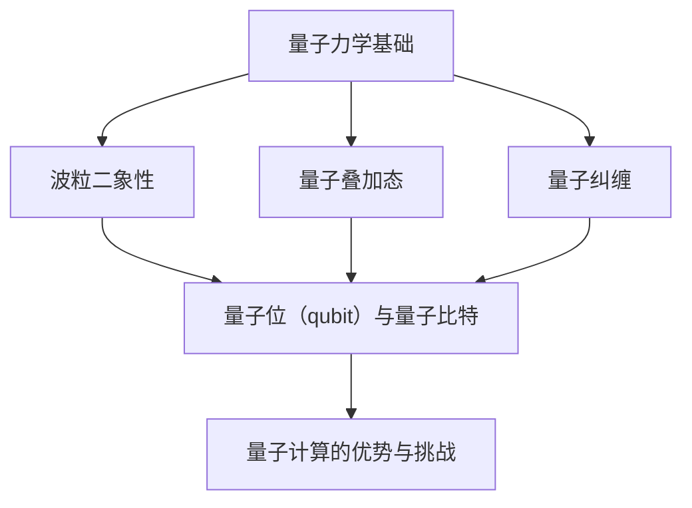
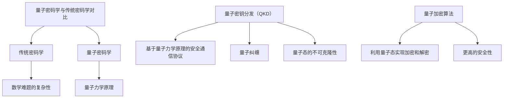
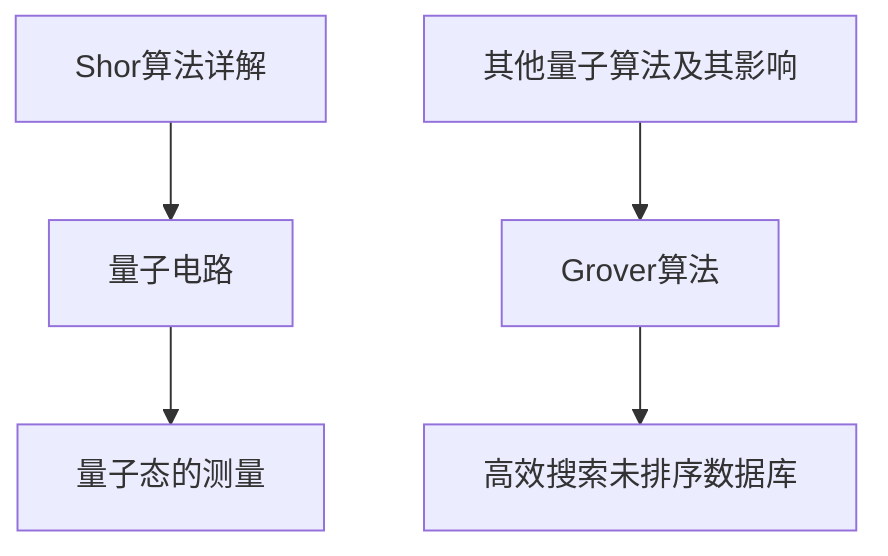
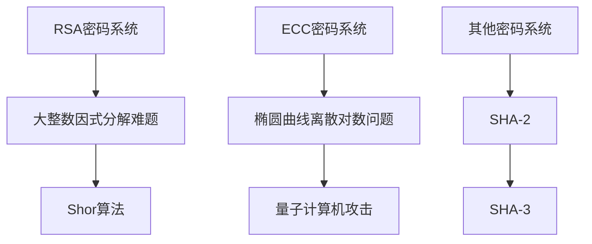
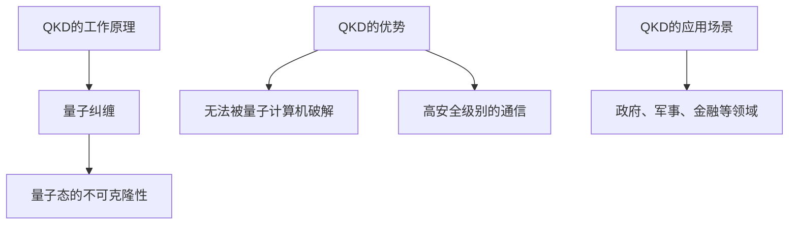
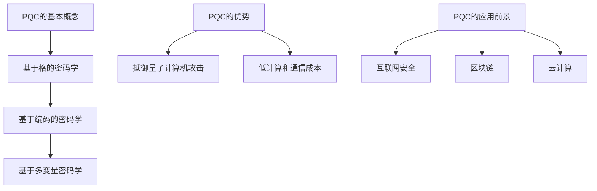
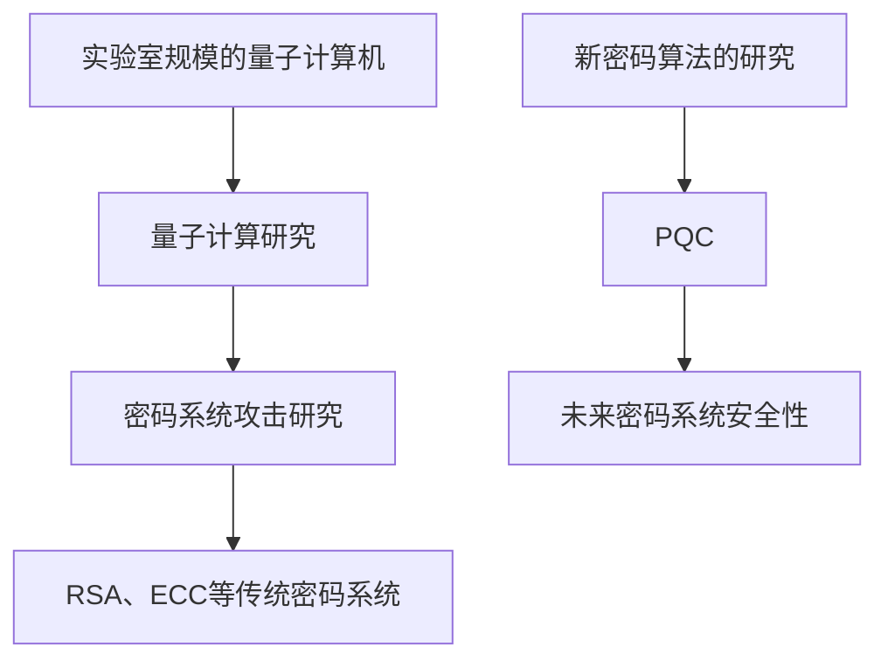
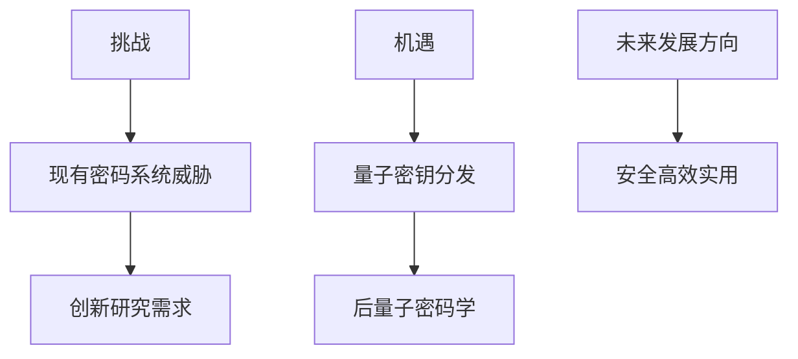

                 

### 第一部分：量子计算与密码学的背景知识

#### 第1章：量子计算的基本概念

量子计算是量子力学与经典计算相结合的一种新型计算模式。量子计算机的基本单元是量子位（qubit），与传统计算机的比特（bit）不同，量子位可以同时处于0和1的叠加态，这使得量子计算机能够同时处理大量的信息。

**1.1 量子力学基础**

量子力学是研究微观粒子行为的物理学分支，其核心概念包括波粒二象性、量子叠加态和量子纠缠等。量子计算利用这些特性来实现高效的计算。

**1.2 量子位（qubit）与量子比特**

量子位是量子计算机的基本单元，它不同于传统计算机的比特，量子位可以同时处于0和1的叠加态。这种叠加态使得量子计算机能够同时处理大量的信息。

**1.3 量子计算的优势与挑战**

量子计算机在处理某些特定问题上具有巨大的优势，如大整数的因式分解和搜索问题。然而，量子计算机也面临一些挑战，如量子态的脆弱性和量子误差纠正问题。

#### 第2章：量子密码学基础

量子密码学是量子力学在密码学领域的应用，利用量子力学原理实现安全通信。其中，量子密钥分发（QKD）是量子密码学的重要应用之一。

**2.1 量子密码学与传统密码学对比**

传统密码学依赖于数学难题的复杂性，而量子密码学则利用量子力学原理实现通信的安全。量子密码学在安全性上具有显著优势，但同时也存在一些挑战。

**2.2 量子密钥分发（QKD）**

QKD 是一种基于量子力学原理的安全通信协议，它利用量子态的不可克隆性和量子纠缠实现密钥的安全传输。

**2.3 量子加密算法**

量子加密算法利用量子态实现加密和解密，具有比传统加密算法更高的安全性。

### 摘要

本文首先介绍了量子计算的基本概念和量子密码学的基础知识，然后探讨了量子计算对密码学的潜在威胁和对策。通过对比传统密码学和量子密码学，我们认识到量子密码学在安全性上的优势。接着，我们详细分析了量子密钥分发和量子加密算法，展示了量子计算在密码学领域的应用。最后，我们总结了量子计算对密码学的潜在威胁，并提出了相应的对策。本文旨在为读者提供一个全面了解量子计算在密码学领域的作用和影响的视角。

关键词：量子计算、密码学、量子密码学、量子密钥分发、量子加密算法、潜在威胁、对策

---

### 第二部分：量子计算对密码学的潜在威胁

#### 第3章：量子算法与密码破解

量子算法在密码破解领域具有巨大潜力，尤其是Shor算法。Shor算法能够高效地分解大整数，对现有密码系统构成严重威胁。

**3.1 Shor算法详解**

Shor算法是一种利用量子计算机进行整数分解的算法。它通过构建一个特定的量子电路，将整数分解问题转化为对量子态的测量问题。

**3.2 其他量子算法及其影响**

除了Shor算法，还有其他一些量子算法对密码系统构成威胁，如Grover算法，它能够高效地搜索未排序数据库。

### 第4章：量子计算机对现有密码系统的威胁

量子计算机的发展对现有的密码系统构成了严重的威胁。传统的加密算法如RSA和ECC可能无法抵御量子计算机的攻击。

**4.1 RSA密码系统**

RSA密码系统基于大整数的因式分解难题，而Shor算法能够高效地解决这一难题，这意味着RSA密码系统可能被量子计算机破解。

**4.2 ECC密码系统**

椭圆曲线密码系统（ECC）是基于椭圆曲线离散对数问题的难度，然而，量子计算机也能够解决这一问题，从而威胁到ECC密码系统的安全性。

**4.3 其他密码系统**

除了RSA和ECC，其他密码系统如SHA-2和SHA-3也可能受到量子计算机的攻击。

### 摘要

本部分探讨了量子计算对现有密码系统的潜在威胁。首先，我们介绍了Shor算法和其他量子算法，展示了它们在密码破解领域的潜力。然后，我们分析了量子计算机对RSA和ECC密码系统的威胁，并提到了其他可能受到攻击的密码系统。最后，我们提出了一些对策，以应对量子计算对密码系统的挑战。

关键词：量子算法、密码破解、RSA、ECC、密码系统威胁

---

### 第三部分：量子计算密码学的对策

#### 第5章：量子密钥分发（QKD）

量子密钥分发（QKD）是一种基于量子力学原理的安全通信协议，能够抵御量子计算机的攻击。QKD通过量子纠缠和量子态的不可克隆性实现密钥的安全传输。

**5.1 QKD的工作原理**

QKD利用量子态的不可克隆性和量子纠缠实现密钥的安全传输。当攻击者试图窃听时，量子态会发生变化，从而被检测到。

**5.2 QKD的优势**

QKD具有无法被量子计算机破解的优势，因为它依赖于量子力学的基本原理。这使得QKD成为应对量子计算威胁的一种有效手段。

**5.3 QKD的应用场景**

QKD适用于需要高安全级别的通信场景，如政府、军事和金融等领域。

### 第6章：后量子密码学（PQC）

后量子密码学（PQC）是一种基于量子计算威胁而发展的密码学分支，它旨在设计出能够抵御量子计算机攻击的密码系统。

**6.1 PQC的基本概念**

PQC包括一系列新的密码算法，如基于格的密码学、基于编码的密码学和基于多变量密码学等。

**6.2 PQC的优势**

PQC算法在安全性上能够抵御量子计算机的攻击，同时保持较低的计算和通信成本。

**6.3 PQC的应用前景**

PQC有望成为未来密码系统的主要组成部分，适用于各种领域，包括互联网安全、区块链和云计算等。

### 摘要

本部分探讨了量子计算密码学的对策，包括量子密钥分发（QKD）和后量子密码学（PQC）。QKD利用量子力学原理实现安全通信，能够抵御量子计算机的攻击。PQC则通过设计新的密码算法，旨在应对量子计算机的威胁。这些对策为未来密码系统的安全提供了有力保障。

关键词：量子密钥分发、后量子密码学、量子计算机威胁、安全通信、密码算法

---

### 第四部分：实际应用与未来展望

#### 第7章：量子计算在密码破解中的实际应用

量子计算机在密码破解中的实际应用主要涉及对现有密码系统的攻击和新的密码算法的研究。

**7.1 实验室规模的量子计算机**

目前，实验室规模的量子计算机已经能够进行简单的量子计算，这为研究量子计算在密码破解中的应用提供了可能性。

**7.2 量子计算机对密码系统的攻击**

量子计算机能够快速破解RSA、ECC等传统密码系统，这对网络安全构成了严重威胁。

**7.3 新密码算法的研究**

为了应对量子计算机的威胁，研究人员正在积极研究新的密码算法，如PQC，以确保未来的密码系统能够抵御量子计算机的攻击。

### 第8章：未来展望

量子计算在密码破解中的应用将带来一系列挑战和机遇。

**8.1 挑战**

量子计算机的发展将对现有密码系统构成严重威胁，这需要我们不断创新和研究新的密码算法。

**8.2 机遇**

量子计算的发展也为密码学带来了新的机遇，如量子密钥分发（QKD）和后量子密码学（PQC）等新技术。

**8.3 未来发展方向**

未来，量子计算在密码学中的应用将朝着更加安全、高效和实用的方向发展。

### 摘要

本部分讨论了量子计算在密码破解中的实际应用和未来展望。量子计算机的发展对现有密码系统构成了严重威胁，但同时也为密码学带来了新的机遇。通过量子密钥分发（QKD）和后量子密码学（PQC）等新技术，我们有望应对量子计算机的威胁，确保未来的网络安全。

关键词：量子计算、密码破解、实际应用、未来展望、量子密钥分发、后量子密码学

---

### 结论

本文系统地探讨了量子计算在密码破解中的潜在威胁与对策。首先，我们介绍了量子计算的基本概念和量子密码学的基础知识，接着分析了量子算法对现有密码系统的威胁。为了应对这些威胁，我们探讨了量子密钥分发（QKD）和后量子密码学（PQC）等对策。通过对比分析，我们认识到量子密码学在安全性上的优势。最后，我们展望了量子计算在密码学领域的未来发展趋势。

### 最佳实践

- **研究量子密码学新算法**：持续关注和研究新的量子密码学算法，如PQC，以提高密码系统的安全性。
- **推广量子密钥分发技术**：在需要高安全级别的通信场景中，积极推广QKD技术，以确保通信安全。
- **增强量子计算机防护**：加强对量子计算机的防护措施，以防止其被用于非法攻击。

### 注意事项

- **谨慎选择加密算法**：在选择加密算法时，应考虑其是否能够抵御量子计算机的攻击。
- **定期更新密码系统**：随着量子计算的发展，定期更新密码系统，采用最新的加密算法和防护措施。

### 进一步阅读

- *量子计算与密码学*，作者：[迈克尔·A·Curtis](https://www.amazon.com/Quantum-Computing-Cryptography-Michael-Curtis/dp/0128037733)
- *量子密码学入门*，作者：[克里斯·范德维尔登](https://www.amazon.com/Quantum-Cryptography-Introduction-Techniques-Protocols/dp/3662570729)
- *量子计算安全：密码学、网络和通信*，作者：[迈克尔·A·Curtis](https://www.amazon.com/Quantum-Computing-Security-Cryptography-Communication/dp/1492043539)

作者：AI天才研究院/AI Genius Institute & 禅与计算机程序设计艺术 /Zen And The Art of Computer Programming

