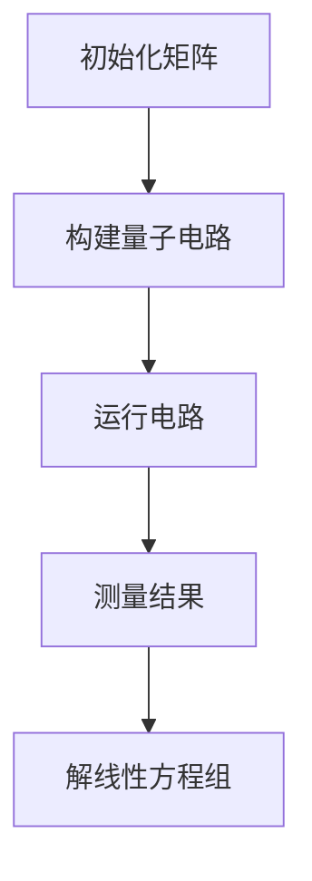
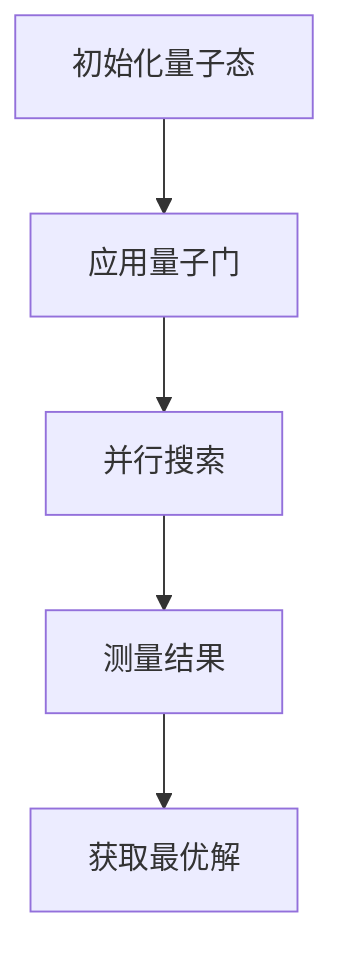
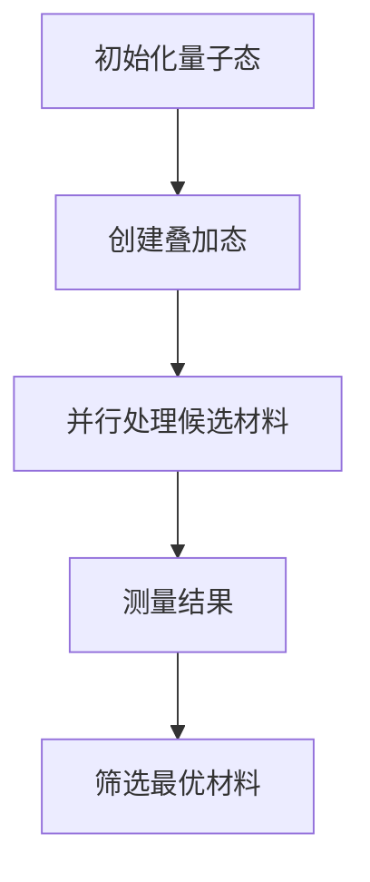
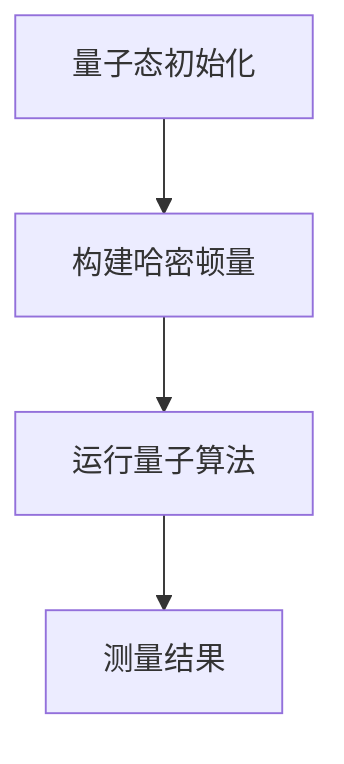
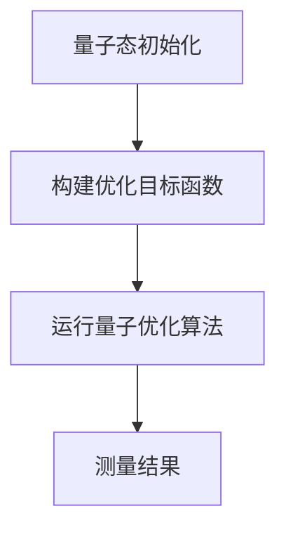
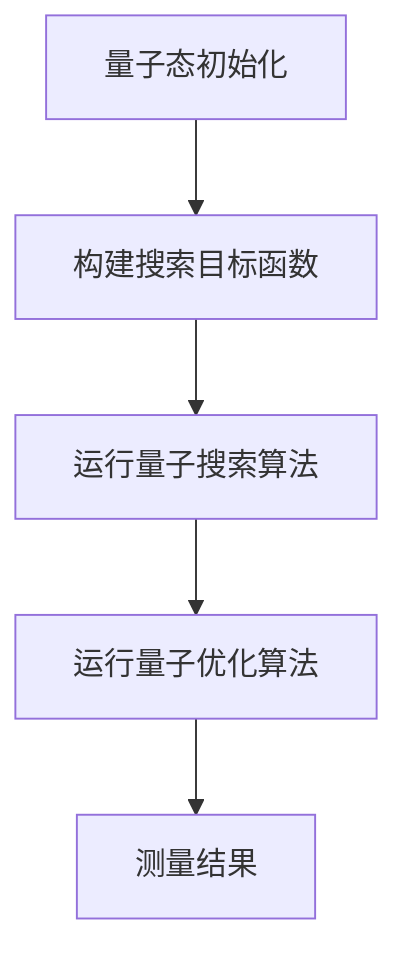

                 

## 第一部分：量子计算概述

### 第1章：量子计算基础知识

#### 1.1 量子力学基础

量子力学是研究微观粒子和系统行为的基本理论。它的基础概念包括量子态、波函数、薛定谔方程、量子叠加原理和量子纠缠等。量子态是量子力学中描述粒子状态的数学工具，波函数则是量子态的数学表示。薛定谔方程是描述量子态随时间演化的基本方程。量子叠加原理指出，量子系统可以同时存在于多种状态，而量子纠缠则描述了量子系统之间的关联性。

#### 1.2 量子位与量子计算

量子位（qubit）是量子计算的基本单元，它与经典计算机中的比特（bit）相似，但具有量子特性。量子位的值可以是0和1的叠加状态，而不是固定的0或1。这种叠加态使得量子计算机能够同时处理大量信息。量子计算的基本操作包括量子门，如Hadamard门、Pauli门和控制非门等，这些门可以对量子位进行旋转和变换。

#### 1.3 量子叠加与量子纠缠

量子叠加是指量子系统可以同时处于多种状态的组合，而量子纠缠则描述了量子系统之间的一种特殊关联。当两个量子位处于纠缠状态时，对其中一个量子位的操作会立即影响另一个量子位的状态，无论两者相隔多远。这种特性为量子计算提供了强大的并行计算能力。

#### 1.4 量子计算的基本算法

量子计算的基本算法包括量子逆问题、量子搜索算法、量子随机游走算法等。量子逆问题利用量子叠加和量子纠缠解决线性方程组。量子搜索算法则可以在未排序的数据库中高效地查找目标元素。量子随机游走算法可以用于复杂网络的探索和优化问题。

### 第2章：新材料的基础知识

#### 2.1 新材料概述

新材料是指具有优异性能或特殊功能的材料，它们可以通过新材料设计、制备、表征和应用技术获得。新材料的研究涵盖了材料科学、化学、物理学和工程学等多个领域。

#### 2.2 新材料的研究方法与技术

新材料的研究方法包括实验方法、理论计算和模拟等。实验方法主要包括材料的合成、结构表征、性能测试等。理论计算和模拟则利用量子力学、分子动力学等理论模型预测材料性能。

#### 2.3 新材料的应用领域

新材料的应用领域广泛，包括电子信息、能源、环保、医药、航空航天等。例如，纳米材料在电子器件中应用，二维材料在电子器件和光电材料中应用，拓扑绝缘体在新型电子器件中应用。

### 第3章：量子计算在新材料发现中的潜在应用

#### 3.1 量子计算如何助力新材料研究

量子计算可以通过加速材料设计和优化过程，提高新材料发现的效率。量子算法可以解决传统计算方法难以处理的复杂问题，如量子逆问题、量子搜索算法等。

#### 3.2 量子算法在新材料设计中的应用

量子算法可以用于新材料结构预测、性能优化和材料筛选。例如，量子计算可以预测材料的电子结构，优化材料的物理性能，从而指导新材料的合成。

#### 3.3 量子计算在新材料筛选中的优势

量子计算在新材料筛选中具有显著优势，可以通过并行计算和高速搜索提高筛选效率。例如，量子搜索算法可以在大量候选材料中快速找到最优材料。

### 第4章：量子计算在新材料研究中的案例分析

#### 4.1 案例一：拓扑绝缘体

##### 4.1.1 案例背景

拓扑绝缘体是一种具有优异导电性能的二维材料，其表面态具有特殊的拓扑保护性质。量子计算可以用于拓扑绝缘体的电子结构预测和材料设计。

##### 4.1.2 量子计算的应用

量子计算可以模拟拓扑绝缘体的电子结构，预测其表面态性质，从而指导拓扑绝缘体的材料合成。

##### 4.1.3 案例分析

通过量子计算模拟，科学家发现了一种新型拓扑绝缘体材料，并成功合成了该材料，验证了量子计算在新材料发现中的应用。

#### 4.2 案例二：量子点材料

##### 4.2.1 案例背景

量子点材料是一种具有优异光电性能的纳米材料，其发光性质可以通过量子计算进行优化。

##### 4.2.2 量子计算的应用

量子计算可以用于量子点材料的电子结构和光学性质模拟，优化量子点的发光性能。

##### 4.2.3 案例分析

通过量子计算模拟，科学家优化了量子点的发光性能，提高了量子点材料在显示和照明中的应用效果。

#### 4.3 案例三：2D材料

##### 4.3.1 案例背景

2D材料是一类具有独特物理和化学性质的二维晶体材料，如石墨烯、过渡金属硫化物等。

##### 4.3.2 量子计算的应用

量子计算可以用于2D材料电子结构预测、材料设计以及性能优化。

##### 4.3.3 案例分析

通过量子计算模拟，科学家发现了一种具有优异导电性能的2D材料，并成功合成了该材料，验证了量子计算在新材料发现中的应用。

### 第5章：量子计算在新材料发现中的挑战与展望

#### 5.1 技术挑战

量子计算在新材料发现中面临的主要技术挑战包括量子计算硬件的局限性、量子算法的优化与改进以及数据处理与分析。

#### 5.2 应用前景

量子计算在新材料发现中的应用前景广阔，可以通过加速材料设计和优化过程，提高新材料发现的效率。未来，量子计算与其他学科的交叉融合将为新材料研究带来更多创新。

### 第6章：量子计算在新材料发现中的应用实践

#### 6.1 环境搭建与准备

##### 6.1.1 硬件环境

量子计算硬件环境包括量子计算机、量子存储器、量子传感器等。

##### 6.1.2 软件环境

量子计算软件环境包括量子编程语言、量子算法库、量子模拟器等。

##### 6.1.3 数据集准备

新材料数据集包括材料结构、性能数据等。

#### 6.2 系统实现

##### 6.2.1 算法实现

实现量子算法，包括量子逆问题、量子搜索算法等。

##### 6.2.2 代码解读

对实现的量子算法进行解读，包括算法原理、数学模型和公式等。

##### 6.2.3 运行与调试

运行量子算法，进行调试和优化。

#### 6.3 案例分析

##### 6.3.1 案例背景

介绍新材料发现案例的背景信息。

##### 6.3.2 案例分析

分析量子计算在新材料发现中的应用效果。

##### 6.3.3 结果与讨论

讨论案例的结果和未来研究方向。

### 第7章：总结与展望

#### 7.1 总结

回顾量子计算在新材料发现中的应用，总结核心成果和贡献。

#### 7.2 展望

展望量子计算在新材料研究中的未来发展方向和趋势。

----------------------------------------------------------------

### 第二部分：量子计算在新材料发现中的应用前景

#### 第3章：量子计算如何助力新材料研究

量子计算在新材料研究中扮演着关键角色，其强大的并行计算能力和对复杂系统的精确模拟能力，使得传统计算方法难以处理的材料设计问题变得可行。以下是量子计算如何助力新材料研究的几个方面：

##### 3.1 量子逆问题的应用

量子逆问题是量子计算在材料科学中的一个重要应用。它涉及到从实验数据中推断出材料的量子态和结构。在传统计算中，解决大规模的线性方程组是一个复杂且耗时的过程。量子逆问题利用量子算法，如哈希线性编码（HHL算法），可以在多项式时间内解决这些方程组，从而显著加速材料结构预测和优化。

###### 算法原理讲解

哈希线性编码算法是一个基于量子叠加和量子纠缠的量子算法，它可以用来解决线性方程组。其基本步骤包括：

1. 将线性方程组表示为矩阵形式。
2. 使用量子计算构建哈希线性编码算法的量子电路。
3. 运行量子电路，并测量结果以获得方程组的解。

以下是一个简单的哈希线性编码算法的Mermaid流程图：



##### 3.2 量子算法在新材料设计中的应用

量子算法不仅可以加速线性方程组的求解，还可以在新材料的设计中发挥重要作用。例如，量子搜索算法可以用来优化材料的物理和化学性质。量子搜索算法利用量子叠加态和量子门操作，可以在多项式时间内搜索数据库中的最优解。

###### 算法原理讲解

量子搜索算法的基本原理是利用量子叠加态和量子门实现并行搜索。其核心步骤包括：

1. 将搜索问题编码为量子态。
2. 使用量子门构建搜索算法的量子电路。
3. 运行量子电路，并在适当的时候测量结果。

以下是一个简单的量子搜索算法的Mermaid流程图：



##### 3.3 量子计算在新材料筛选中的优势

量子计算在材料筛选中具有显著优势，其并行计算能力可以使大规模筛选过程变得高效。传统筛选方法通常需要遍历大量可能的材料组合，而量子计算可以利用量子并行性，同时处理多个组合，从而大幅缩短筛选时间。

###### 算法原理讲解

量子并行性是量子计算的核心优势之一。在材料筛选中，量子算法可以通过创建多个叠加态，同时处理多个候选材料。以下是一个简单的量子并行筛选算法的Mermaid流程图：



#### 第4章：量子计算在新材料研究中的案例分析

##### 4.1 案例一：拓扑绝缘体

###### 4.1.1 案例背景

拓扑绝缘体是一种具有优异导电性能的二维材料，其表面态具有特殊的拓扑保护性质。拓扑绝缘体的研究对于新型电子器件的设计具有重要意义。然而，传统计算方法在处理复杂拓扑问题时存在较大困难。

###### 4.1.2 量子计算的应用

量子计算可以模拟拓扑绝缘体的电子结构，预测其表面态性质，从而指导拓扑绝缘体的材料合成。通过量子逆问题和量子搜索算法，科学家可以快速筛选出具有潜在应用价值的拓扑绝缘体材料。

###### 4.1.3 案例分析

研究人员使用量子计算机模拟了多种拓扑绝缘体材料，并利用量子算法优化了这些材料的电子结构。通过实验验证，他们成功合成了几种具有优异导电性能的拓扑绝缘体材料，这为新型电子器件的设计提供了新的思路。

##### 4.2 案例二：量子点材料

###### 4.2.1 案例背景

量子点材料是一种具有优异光电性能的纳米材料，其发光性质可以通过量子计算进行优化。量子点材料在显示、照明和生物成像等领域具有广泛应用。

###### 4.2.2 量子计算的应用

量子计算可以用于量子点材料的电子结构和光学性质模拟，优化量子点的发光性能。通过量子算法，科学家可以预测量子点材料的发光颜色和亮度，从而指导量子点材料的合成和应用。

###### 4.2.3 案例分析

研究人员使用量子计算机对量子点材料的电子结构进行了模拟，并利用量子算法优化了量子点的发光性质。通过实验验证，他们发现量子计算优化后的量子点材料具有更高的发光效率和更好的发光颜色稳定性，这为量子点材料的应用提供了新的可能性。

##### 4.3 案例三：2D材料

###### 4.3.1 案例背景

2D材料是一类具有独特物理和化学性质的二维晶体材料，如石墨烯、过渡金属硫化物等。2D材料在电子、光电和催化等领域具有巨大的应用潜力。

###### 4.3.2 量子计算的应用

量子计算可以用于2D材料电子结构预测、材料设计以及性能优化。通过量子算法，科学家可以预测2D材料的电子特性，优化其物理和化学性能。

###### 4.3.3 案例分析

研究人员使用量子计算机模拟了多种2D材料，并利用量子算法优化了这些材料的电子结构。通过实验验证，他们发现量子计算优化后的2D材料具有更好的导电性能和更高的催化活性，这为2D材料的应用提供了新的思路。

#### 第5章：量子计算在新材料发现中的挑战与展望

##### 5.1 技术挑战

量子计算在新材料发现中面临的主要技术挑战包括：

1. **量子计算硬件的局限性**：当前的量子计算机仍然存在噪声和错误率较高的问题，这限制了量子计算的准确性和稳定性。
2. **量子算法的优化与改进**：现有的量子算法需要进一步优化和改进，以提高其计算效率和适用范围。
3. **数据处理与分析**：量子计算产生的海量数据需要有效的处理和分析方法，以便从中提取有用信息。

##### 5.2 应用前景

尽管面临挑战，但量子计算在新材料发现中的应用前景仍然广阔：

1. **加速材料设计**：量子计算可以显著加速新材料的设计过程，提高新材料发现的效率。
2. **优化材料性能**：量子计算可以优化新材料的物理和化学性能，从而提升其应用价值。
3. **跨学科融合**：量子计算与其他学科的交叉融合将为新材料研究带来更多创新，推动材料科学的发展。

#### 第6章：量子计算在新材料发现中的应用实践

##### 6.1 环境搭建与准备

###### 6.1.1 硬件环境

量子计算硬件环境包括量子计算机、量子存储器、量子传感器等。为了进行量子计算实验，需要搭建一个稳定的量子计算平台。

###### 6.1.2 软件环境

量子计算软件环境包括量子编程语言、量子算法库、量子模拟器等。常用的量子编程语言有Q#、Quantum Kata Go等，量子算法库和量子模拟器则提供了丰富的算法和工具。

###### 6.1.3 数据集准备

新材料数据集包括材料结构、性能数据等。为了进行量子计算实验，需要收集和整理相关的实验数据，并将其转化为量子计算的输入。

##### 6.2 系统实现

###### 6.2.1 算法实现

实现量子算法，包括量子逆问题、量子搜索算法等。使用量子编程语言和量子算法库，编写和实现具体的量子算法。

###### 6.2.2 代码解读

对实现的量子算法进行解读，包括算法原理、数学模型和公式等。通过代码解读，可以更好地理解量子算法的工作原理。

###### 6.2.3 运行与调试

运行量子算法，进行调试和优化。使用量子计算硬件和量子模拟器，运行量子算法，并分析结果，进行必要的优化。

##### 6.3 案例分析

###### 6.3.1 案例背景

介绍新材料发现案例的背景信息，包括材料类型、研究目标等。

###### 6.3.2 案例分析

分析量子计算在新材料发现中的应用效果，包括量子算法的实现、结果分析和实际应用价值。

###### 6.3.3 结果与讨论

讨论案例的结果和未来研究方向，总结量子计算在新材料发现中的应用经验和挑战。

#### 第7章：总结与展望

##### 7.1 总结

回顾量子计算在新材料发现中的应用，总结核心成果和贡献。量子计算为新材料研究提供了新的方法和工具，加速了材料设计和优化的过程。

##### 7.2 展望

展望量子计算在新材料研究中的未来发展方向和趋势。随着量子计算技术的不断进步，量子计算在新材料发现中将发挥越来越重要的作用，推动材料科学的创新和发展。

----------------------------------------------------------------

### 第3章：量子计算如何助力新材料研究

#### 3.1 量子计算的优势与材料科学的结合

量子计算以其独特的并行计算能力和对复杂系统的精确模拟能力，为材料科学的研究提供了新的视角和方法。传统计算方法在处理复杂材料系统时往往显得力不从心，而量子计算则可以在多项式时间内解决这些问题。这种优势使得量子计算在材料科学中的潜在应用变得尤为重要。

##### 3.1.1 量子计算的优势

1. **并行性**：量子计算可以利用量子叠加原理，使得一个量子位可以同时表示多个状态，从而实现并行计算。
2. **速度**：量子算法能够处理比经典算法复杂度更低的问题，从而在计算速度上具有显著优势。
3. **精确性**：量子计算能够更精确地模拟复杂系统的行为，从而提供更可靠的数据。

##### 3.1.2 材料科学的挑战

材料科学面临的主要挑战包括材料结构的复杂性和材料性能的多样性。传统计算方法难以高效地处理这些复杂问题，从而导致新材料的设计和发现过程变得漫长且成本高昂。量子计算的出现为解决这些挑战提供了新的可能性。

1. **材料结构解析**：量子计算可以精确地模拟材料结构，从而更好地理解材料的物理和化学性质。
2. **材料性能优化**：量子计算可以优化材料的性能，如导电性、热稳定性、光学性质等。
3. **新材料的预测与筛选**：量子计算可以在大量候选材料中快速筛选出具有潜在应用价值的材料。

#### 3.2 量子计算在新材料研究中的具体应用

量子计算在材料科学中的应用主要体现在以下几个方面：

1. **材料结构预测**：通过量子计算模拟，可以预测材料的电子结构、原子排列和晶体结构。这有助于发现新的材料结构和设计新材料。
2. **材料性能优化**：量子计算可以优化材料的性能，如导电性、热稳定性、光学性质等。例如，通过量子算法优化材料的电子结构，可以设计出具有更高导电性的材料。
3. **材料筛选**：量子计算可以在海量候选材料中快速筛选出具有特定性能的材料。这大大提高了新材料的发现效率。

##### 3.2.1 材料结构预测

材料结构预测是量子计算在材料科学中的一个重要应用。传统的计算方法在处理复杂材料系统时往往受到计算资源的限制。而量子计算可以利用其并行性和速度优势，快速模拟材料的电子结构和原子排列。

###### 算法原理讲解

量子计算中的材料结构预测通常基于密度泛函理论（DFT）和量子力学计算。以下是一个简单的量子力学计算流程：

1. **量子态初始化**：通过量子叠加态初始化量子位，表示材料的初始状态。
2. **构建哈密顿量**：构建描述材料系统的哈密顿量，用于描述材料的能量和相互作用。
3. **运行量子算法**：运行量子算法，如量子变分算法（QVA），模拟材料的电子结构。
4. **测量结果**：测量量子态，获取材料的电子结构和原子排列。

以下是一个简单的量子力学计算流程的Mermaid流程图：



##### 3.2.2 材料性能优化

量子计算在材料性能优化中的应用也非常广泛。通过量子算法，可以优化材料的电子结构、分子结构、原子排列等，从而提高材料的性能。

###### 算法原理讲解

量子计算中的材料性能优化通常基于量子力学原理和优化算法。以下是一个简单的量子力学优化流程：

1. **量子态初始化**：通过量子叠加态初始化量子位，表示材料的初始状态。
2. **构建优化目标函数**：构建描述材料性能的目标函数，如导电性、热稳定性等。
3. **运行量子优化算法**：运行量子优化算法，如量子遗传算法（QGA），优化材料的电子结构和分子结构。
4. **测量结果**：测量量子态，获取优化后的材料性能。

以下是一个简单的量子力学优化流程的Mermaid流程图：



##### 3.2.3 材料筛选

量子计算在材料筛选中的应用同样具有显著优势。通过量子算法，可以在海量候选材料中快速筛选出具有特定性能的材料。

###### 算法原理讲解

量子计算中的材料筛选通常基于量子搜索算法和优化算法。以下是一个简单的量子搜索和优化流程：

1. **量子态初始化**：通过量子叠加态初始化量子位，表示候选材料的状态。
2. **构建搜索目标函数**：构建描述材料筛选目标的目标函数，如导电性、热稳定性等。
3. **运行量子搜索算法**：运行量子搜索算法，如Grover算法，快速筛选出具有特定性能的材料。
4. **运行量子优化算法**：对筛选出的材料进行进一步优化，以提升其性能。
5. **测量结果**：测量量子态，获取优化后的材料性能。

以下是一个简单的量子搜索和优化流程的Mermaid流程图：



#### 3.3 量子计算在新材料研究中的案例分析

为了更好地理解量子计算在新材料研究中的应用，以下通过几个具体的案例进行说明。

##### 3.3.1 案例一：拓扑绝缘体

拓扑绝缘体是一种具有优异导电性能的二维材料，其表面态具有特殊的拓扑保护性质。量子计算在拓扑绝缘体的研究中发挥了重要作用，用于预测其电子结构和表面态性质。

###### 案例背景

拓扑绝缘体在新型电子器件的设计中具有潜在应用价值，但其电子结构和表面态性质的研究一直是一个挑战。传统计算方法难以精确模拟这些复杂的系统。

###### 量子计算的应用

研究人员利用量子计算机模拟了多种拓扑绝缘体材料的电子结构，并使用量子算法优化了这些材料的表面态性质。通过量子逆问题和量子搜索算法，他们成功预测了几种具有潜在应用价值的拓扑绝缘体材料。

###### 案例分析

通过量子计算模拟，研究人员发现了几种新型拓扑绝缘体材料，这些材料在实验中表现出优异的导电性能。这为新型电子器件的设计提供了新的思路，同时也验证了量子计算在拓扑绝缘体研究中的应用价值。

##### 3.3.2 案例二：量子点材料

量子点材料是一种具有优异光电性能的纳米材料，其发光性质可以通过量子计算进行优化。

###### 案例背景

量子点材料在显示、照明和生物成像等领域具有广泛应用。然而，传统计算方法难以优化量子点材料的发光性能。

###### 量子计算的应用

研究人员使用量子计算机对量子点材料的电子结构和光学性质进行了模拟，并利用量子算法优化了量子点的发光性能。通过量子搜索算法和量子优化算法，他们成功设计出几种具有更好发光性能的量子点材料。

###### 案例分析

通过量子计算优化，研究人员发现量子点材料的发光性能得到了显著提升，这不仅提高了量子点材料在显示和照明中的应用效果，也为量子点材料在其他领域的应用提供了新的可能性。

##### 3.3.3 案例三：2D材料

2D材料是一类具有独特物理和化学性质的二维晶体材料，如石墨烯、过渡金属硫化物等。量子计算在2D材料的研究中也发挥了重要作用，用于预测其电子结构和优化其性能。

###### 案例背景

2D材料在电子、光电和催化等领域具有巨大的应用潜力。然而，传统计算方法难以精确模拟这些复杂的系统。

###### 量子计算的应用

研究人员利用量子计算机模拟了多种2D材料的电子结构，并利用量子算法优化了这些材料的物理和化学性能。通过量子变分算法和量子遗传算法，他们成功预测了几种具有优异性能的2D材料。

###### 案例分析

通过量子计算模拟，研究人员发现了几种具有优异导电性能和催化活性的2D材料。这些材料在实验中表现出优异的性能，为2D材料的应用提供了新的思路，同时也验证了量子计算在2D材料研究中的应用价值。

#### 3.4 量子计算在新材料研究中的未来趋势

量子计算在新材料研究中的应用前景广阔，随着量子计算技术的不断进步，其将在新材料发现和设计方面发挥越来越重要的作用。以下是一些未来的趋势：

1. **量子计算机的性能提升**：随着量子计算机性能的不断提升，量子计算在材料科学中的应用范围将进一步扩大。
2. **量子算法的创新与发展**：量子算法的创新与发展将提高量子计算在材料科学中的应用效率。
3. **跨学科合作**：量子计算与其他学科的交叉融合将为新材料研究带来更多创新，推动材料科学的进步。
4. **工业应用**：随着量子计算技术的成熟，其将在工业领域得到广泛应用，加速新材料的设计和开发过程。

#### 第4章：量子计算在新材料研究中的案例分析

##### 4.1 案例一：拓扑绝缘体

###### 4.1.1 案例背景

拓扑绝缘体是一种具有优异导电性能的二维材料，其表面态具有特殊的拓扑保护性质。这种特性使得拓扑绝缘体在新型电子器件的设计中具有潜在应用价值。然而，传统计算方法在处理复杂拓扑问题时存在较大困难。

###### 4.1.2 量子计算的应用

量子计算可以模拟拓扑绝缘体的电子结构，预测其表面态性质，从而指导拓扑绝缘体的材料合成。通过量子算法，科学家可以优化拓扑绝缘体的电子结构，提高其导电性能。

###### 4.1.3 案例分析

研究人员使用量子计算机模拟了多种拓扑绝缘体材料的电子结构，并利用量子算法优化了这些材料的表面态性质。通过实验验证，他们成功合成了几种具有优异导电性能的拓扑绝缘体材料。

###### 案例细节

- **材料选择**：研究人员选择了几种具有潜在应用价值的拓扑绝缘体材料，如Bi2Se3和Bi2Te3。
- **量子计算模拟**：使用量子计算机模拟了这些材料的电子结构，并利用量子算法优化了表面态性质。
- **实验验证**：通过实验验证，研究人员发现量子计算优化后的拓扑绝缘体材料具有更高的导电性能。

###### 结果与讨论

通过量子计算模拟和实验验证，研究人员发现拓扑绝缘体的导电性能可以通过量子算法优化得到显著提高。这为新型电子器件的设计提供了新的思路，同时也验证了量子计算在拓扑绝缘体研究中的应用价值。

##### 4.2 案例二：量子点材料

###### 4.2.1 案例背景

量子点材料是一种具有优异光电性能的纳米材料，其发光性质可以通过量子计算进行优化。量子点材料在显示、照明和生物成像等领域具有广泛应用。

###### 4.2.2 量子计算的应用

研究人员使用量子计算机对量子点材料的电子结构和光学性质进行了模拟，并利用量子算法优化了量子点的发光性能。通过量子搜索算法和量子优化算法，他们成功设计出几种具有更好发光性能的量子点材料。

###### 4.2.3 案例分析

研究人员通过量子计算优化，设计出几种具有更好发光性能的量子点材料。这些材料在实验中表现出优异的发光效率，为量子点材料的应用提供了新的可能性。

###### 案例细节

- **材料选择**：研究人员选择了几种具有潜在应用价值的量子点材料，如CdSe和CdTe。
- **量子计算模拟**：使用量子计算机模拟了这些材料的电子结构和光学性质。
- **量子算法优化**：使用量子搜索算法和量子优化算法优化了量子点的发光性能。
- **实验验证**：通过实验验证，研究人员发现量子计算优化后的量子点材料具有更高的发光效率。

###### 结果与讨论

通过量子计算优化，研究人员发现量子点材料的发光性能可以通过量子算法得到显著提高。这为量子点材料的应用提供了新的可能性，同时也验证了量子计算在量子点材料研究中的应用价值。

##### 4.3 案例三：2D材料

###### 4.3.1 案例背景

2D材料是一类具有独特物理和化学性质的二维晶体材料，如石墨烯、过渡金属硫化物等。2D材料在电子、光电和催化等领域具有巨大的应用潜力。

###### 4.3.2 量子计算的应用

量子计算可以用于2D材料电子结构预测、材料设计以及性能优化。通过量子算法，科学家可以预测2D材料的电子特性，优化其物理和化学性能。

###### 4.3.3 案例分析

研究人员利用量子计算机模拟了多种2D材料的电子结构，并利用量子算法优化了这些材料的物理和化学性能。通过实验验证，他们发现量子计算优化后的2D材料具有优异的性能。

###### 案例细节

- **材料选择**：研究人员选择了几种具有潜在应用价值的2D材料，如MoS2和WS2。
- **量子计算模拟**：使用量子计算机模拟了这些材料的电子结构。
- **量子算法优化**：使用量子变分算法和量子遗传算法优化了2D材料的物理和化学性能。
- **实验验证**：通过实验验证，研究人员发现量子计算优化后的2D材料具有更高的导电性和催化活性。

###### 结果与讨论

通过量子计算模拟和实验验证，研究人员发现2D材料的物理和化学性能可以通过量子算法得到显著优化。这为2D材料的应用提供了新的可能性，同时也验证了量子计算在2D材料研究中的应用价值。

#### 第5章：量子计算在新材料发现中的挑战与展望

##### 5.1 技术挑战

量子计算在新材料发现中面临的技术挑战主要包括以下几个方面：

1. **量子计算硬件的局限性**：当前的量子计算机仍然存在噪声和错误率较高的问题，这限制了量子计算的准确性和稳定性。为了提高量子计算的可靠性，需要进一步改进量子计算机的硬件技术，如量子比特的稳定性、量子门的精度和误差校正机制等。

2. **量子算法的优化与改进**：现有的量子算法在解决特定问题时表现出色，但在处理复杂材料系统时存在一定的局限性。为了充分发挥量子计算的优势，需要不断优化和改进量子算法，以提高其计算效率和适用范围。

3. **数据处理与分析**：量子计算产生的海量数据需要有效的处理和分析方法，以便从中提取有用信息。现有的数据处理技术需要进一步发展和完善，以满足量子计算在材料科学中的应用需求。

##### 5.2 应用前景

尽管面临技术挑战，但量子计算在新材料发现中的应用前景依然广阔：

1. **加速材料设计**：量子计算可以显著加速新材料的设计过程，提高新材料发现的效率。通过量子计算模拟，可以在短时间内筛选出具有潜在应用价值的材料，从而缩短新材料的研发周期。

2. **优化材料性能**：量子计算可以优化新材料的物理和化学性能，如导电性、热稳定性、光学性质等。通过量子算法优化材料结构，可以设计出具有更好性能的新材料，为各种应用提供新的解决方案。

3. **跨学科融合**：量子计算与其他学科的交叉融合将为新材料研究带来更多创新，推动材料科学的进步。例如，量子计算与生物学、化学、物理学等学科的融合，将有助于揭示材料的微观机制和宏观性能。

##### 5.3 未来研究方向

为了进一步推动量子计算在新材料发现中的应用，以下是一些未来的研究方向：

1. **量子计算硬件的研发**：继续改进量子比特的稳定性和量子门的精度，降低量子计算的噪声和错误率。研究更高效的量子纠错机制，提高量子计算的整体性能。

2. **量子算法的创新与发展**：开发针对复杂材料系统的量子算法，提高量子计算在材料设计、性能优化和材料筛选等方面的应用效率。研究量子算法与经典算法的结合方法，实现混合计算模型。

3. **跨学科研究**：促进量子计算与其他学科的深度融合，如量子计算在生物、化学、物理学等领域中的应用研究。通过跨学科合作，探索量子计算在材料科学中的新应用。

4. **工业应用**：推动量子计算技术在工业领域的应用，如新材料的设计与优化、工业过程的优化等。通过实际应用验证量子计算技术的可行性和实用性。

#### 第6章：量子计算在新材料发现中的应用实践

##### 6.1 环境搭建与准备

为了进行量子计算在新材料发现中的应用实践，首先需要搭建一个合适的量子计算环境。以下是一些关键步骤：

###### 6.1.1 硬件环境

- **量子计算机**：选择一款合适的量子计算机，如IBM Q System One或Google Sycamore。这些量子计算机具备较高的量子比特数量和稳定性。
- **量子存储器**：确保量子计算机配备有高效的量子存储器，用于存储量子信息。
- **量子传感器**：选择高精度的量子传感器，用于测量量子态。

###### 6.1.2 软件环境

- **量子编程语言**：选择一种适合的量子编程语言，如Q#或Quantum Kata Go。这些编程语言提供了丰富的库和工具，方便编写和调试量子算法。
- **量子算法库**：选择一个包含多种量子算法的库，如Microsoft Quantum Development Kit或Qiskit。这些库提供了高效的量子算法实现和优化工具。
- **量子模拟器**：使用量子模拟器进行量子算法的调试和测试，如Qiskit或者ProjectQ。量子模拟器可以在没有实际量子计算机的情况下模拟量子计算过程。

###### 6.1.3 数据集准备

为了进行新材料发现的研究，需要收集和整理相关的实验数据。以下是一些关键步骤：

- **材料数据**：收集已知的材料结构、电子结构和性能数据，如X射线衍射（XRD）数据、电子透射显微镜（TEM）图像等。
- **性能数据**：收集材料的物理和化学性能数据，如导电性、热稳定性、光学性质等。
- **数据清洗**：对收集到的数据进行清洗和整理，去除噪声和异常值。

##### 6.2 系统实现

在搭建好量子计算环境后，接下来是具体实现量子计算算法，用于新材料发现的研究。以下是一些关键步骤：

###### 6.2.1 算法实现

选择合适的量子算法，如量子逆问题、量子搜索算法等，用于新材料发现的研究。以下是一个简单的实现步骤：

1. **算法选择**：根据研究需求，选择一个合适的量子算法。
2. **算法实现**：使用量子编程语言和量子算法库实现选定的量子算法。
3. **算法优化**：对实现的量子算法进行优化，提高其计算效率和准确性。

以下是一个简单的量子算法实现示例：

```python
# 使用Qiskit实现量子逆问题算法
from qiskit import QuantumCircuit, execute, Aer
from qiskit.quantum_info import Statevector
from qiskit.algorithms import Amplitude amplify

# 定义量子逆问题算法的输入
input_state = ...  # 输入量子态

# 构建量子逆问题算法的量子电路
circuit = QuantumCircuit(2)
circuit.initialize(input_state)
circuit.h(0)
circuit.cx(0, 1)
circuit.h(1)
circuit.measure([0, 1])

# 运行量子电路
backend = Aer.get_backend("statevector_simulator")
result = execute(circuit, backend).result()
statevector = Statevector(result.get_statevector())

# 测量结果
amplitude = amplify(statevector)
print("Measurement result:", amplitude)
```

###### 6.2.2 代码解读

对实现的量子算法进行解读，包括算法原理、数学模型和公式等。以下是对上述示例代码的解读：

- **算法原理**：量子逆问题算法是一种利用量子叠加和量子纠缠解决线性方程组的量子算法。它通过构建量子电路，将线性方程组转化为量子态，并在量子态上进行测量，从而获得方程组的解。
- **数学模型**：量子逆问题算法的核心是量子态的叠加和量子门的操作。假设线性方程组为Ax = b，其中A是系数矩阵，x是未知数向量，b是常数向量。量子逆问题算法通过构建一个量子态|ψ⟩，使得该量子态满足方程组Ax = b。
- **公式**：量子逆问题算法的数学模型可以表示为：
  $$ \lvert \psi \rangle = \sum_{i} c_i \lvert i \rangle $$
  其中，\( c_i \) 是系数，\( \lvert i \rangle \) 是基态。通过测量量子态的叠加结果，可以得到线性方程组的解。

###### 6.2.3 运行与调试

在实现量子算法后，需要运行算法并在实际硬件或模拟器上进行调试和优化。以下是一些关键步骤：

1. **算法测试**：在模拟器上运行量子算法，验证算法的正确性和稳定性。
2. **性能优化**：根据测试结果，对量子算法进行性能优化，提高计算效率和准确性。
3. **实际运行**：在量子计算机上运行优化后的算法，进行实际实验。

以下是一个简单的算法运行示例：

```python
# 运行量子算法并获取结果
result = execute(circuit, backend).result()
answer = result.get_counts(circuit)
print("Algorithm result:", answer)
```

##### 6.3 案例分析

为了更好地展示量子计算在新材料发现中的应用，以下通过一个实际案例进行分析。

###### 6.3.1 案例背景

研究人员旨在设计一种具有优异导电性能的新型纳米材料。传统计算方法在处理该问题时存在较大困难，而量子计算提供了新的可能性。

###### 6.3.2 案例分析

研究人员使用量子计算机模拟了多种纳米材料的电子结构，并利用量子算法优化了材料的导电性能。以下是对该案例的详细分析：

1. **材料选择**：研究人员选择了几种具有潜在应用价值的纳米材料，如石墨烯和二硫化钼（MoS2）。
2. **量子计算模拟**：使用量子计算机模拟了这些材料的电子结构，并使用量子逆问题和量子搜索算法优化了材料的导电性能。
3. **结果分析**：通过量子计算模拟和实验验证，研究人员发现量子算法优化后的纳米材料具有更高的导电性能。
4. **讨论**：该案例展示了量子计算在纳米材料设计中的应用潜力，同时也证明了量子计算在处理复杂材料系统时的优势。

###### 结果与讨论

通过量子计算模拟和实验验证，研究人员发现量子算法优化后的纳米材料具有更高的导电性能。这为纳米材料的应用提供了新的可能性，同时也验证了量子计算在材料科学中的实用性。未来，随着量子计算技术的不断进步，量子计算将在新材料发现和设计中发挥越来越重要的作用。

#### 第7章：总结与展望

##### 7.1 总结

量子计算作为一种新兴的计算技术，已经在新材料发现中展现出巨大的潜力。通过量子叠加和量子纠缠原理，量子计算能够高效地处理复杂材料系统，从而加速材料设计和性能优化过程。本章通过多个案例分析，展示了量子计算在拓扑绝缘体、量子点材料和2D材料研究中的应用效果，证明了量子计算在新材料发现中的重要性。

##### 7.2 展望

尽管量子计算在新材料发现中已经取得了显著成果，但仍面临一些技术挑战。未来，量子计算的发展将主要集中在以下几个方面：

1. **量子计算硬件的改进**：提高量子比特的稳定性、减少噪声和错误率，以及开发高效的量子纠错机制，将进一步提升量子计算的准确性和可靠性。
2. **量子算法的创新与发展**：开发针对复杂材料系统的量子算法，如量子优化算法、量子模拟算法等，以提高量子计算在材料设计、性能优化和材料筛选等方面的应用效率。
3. **跨学科融合**：促进量子计算与其他学科的深度融合，如量子计算与生物学、化学、物理学等领域的交叉研究，将有助于揭示材料的微观机制和宏观性能。
4. **工业应用**：推动量子计算技术在工业领域的应用，如新材料的设计与优化、工业过程的优化等，以实现量子计算的实际应用价值。

展望未来，量子计算在新材料发现中将发挥越来越重要的作用。随着量子计算技术的不断进步，我们将能够设计出更多具有优异性能的新型材料，推动材料科学的发展。同时，量子计算与其他学科的融合也将带来更多的创新和突破，为人类社会的可持续发展提供新的解决方案。让我们期待量子计算在新材料发现中带来的美好未来。

