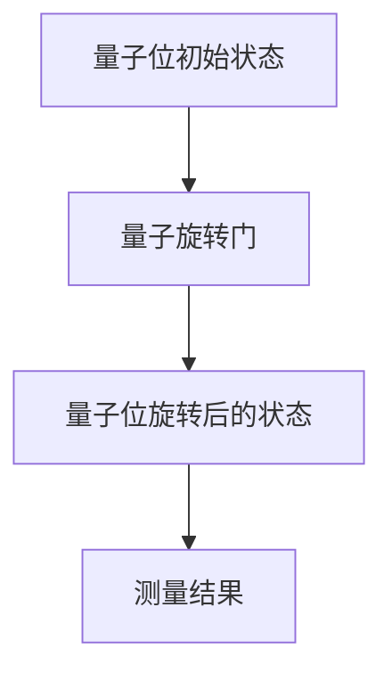
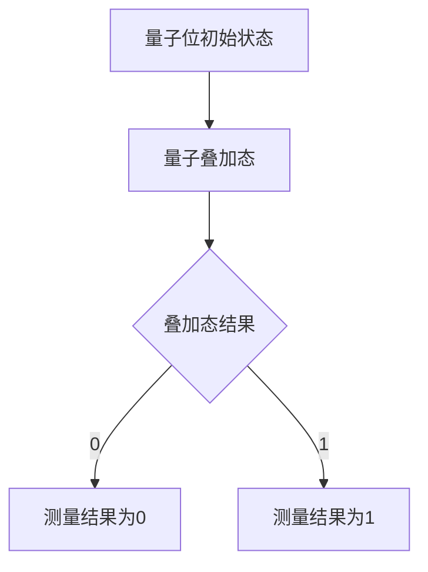
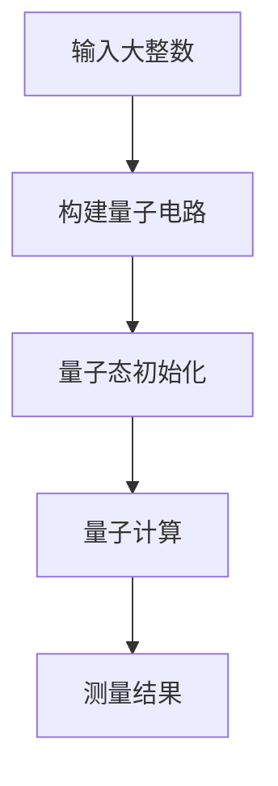
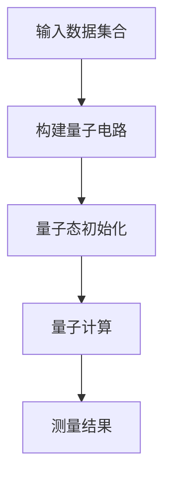
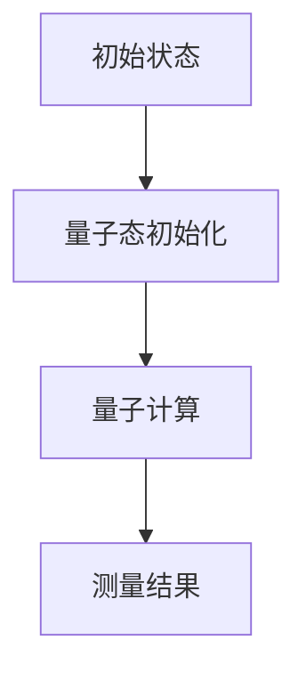

                 

### 《量子计算在新材料设计中的应用前景》

#### 引言

在新材料设计领域，科学家们一直面临着如何预测和优化材料性能的挑战。传统的计算方法，尽管在数据处理和模拟方面取得了显著的进展，但由于其固有的计算复杂度和精度限制，往往难以满足日益复杂和新颖的材料设计需求。因此，寻求新的计算模型和算法，以提升材料设计的效率和质量，成为当前研究的热点。

量子计算作为一种全新的计算范式，因其具备超强的并行计算能力和量子叠加、纠缠等独特性质，被认为有望在材料设计中发挥重要作用。本文将围绕量子计算的基本原理、量子计算在新材料设计中的具体应用，以及未来发展趋势进行深入探讨。

#### 核心关键词

- 量子计算
- 新材料设计
- 材料性能预测
- 量子模拟
- 量子算法
- 材料合成

#### 摘要

本文首先介绍了量子计算的基础知识，包括量子位、量子逻辑门、量子纠缠和量子算法等核心概念。随后，深入探讨了量子计算在新材料设计中的应用，分为量子模拟技术、量子算法在材料优化中的应用以及量子计算在材料性能预测中的应用三个部分。最后，对量子计算与新材料创新的挑战与机遇进行了分析，并对未来发展趋势进行了展望。

#### 目录大纲

##### 第一部分：量子计算基础与新材料设计

**第1章：量子计算概述**

- **1.1 问题背景**  
  - 传统计算限制与新材料设计需求  
  - 量子计算的概念与特点

- **1.2 新材料设计中的挑战**  
  - 材料性能预测与优化需求  
  - 传统计算方法的局限性

- **1.3 量子计算的应用前景**  
  - 量子模拟在材料设计中的应用  
  - 量子算法在优化问题上的优势

**第2章：量子计算原理**

- **2.1 量子位与量子逻辑门**  
  - 量子位的基本概念  
  - 量子逻辑门的操作与功能

- **2.2 量子纠缠与量子叠加**  
  - 量子纠缠的定义与特性  
  - 量子叠加原理及其应用

- **2.3 量子算法基础**  
  - Shor算法与Grover算法  
  - 量子随机游走算法

##### 第二部分：新材料设计与量子计算

**第3章：量子计算在新材料合成中的应用**

- **3.1 量子模拟技术**  
  - 材料性质的量子模拟  
  - 量子模拟在材料合成中的优势

- **3.2 量子算法在材料优化中的应用**  
  - 量子算法与传统优化算法的比较  
  - 量子算法在材料优化中的具体应用案例

**第4章：量子计算在材料性能预测中的应用**

- **4.1 量子计算与材料性能预测**  
  - 量子计算在电子结构计算中的应用  
  - 材料性能预测的挑战与机遇

- **4.2 量子计算在材料力学性能预测中的应用**  
  - 材料断裂力学与量子计算  
  - 材料塑性变形与量子计算

##### 第三部分：量子计算与新材料的未来发展趋势

**第5章：量子计算与新材料创新的挑战与机遇**

- **5.1 量子计算的挑战**  
  - 量子计算机硬件的限制  
  - 量子算法的发展与完善

- **5.2 新材料创新的机遇**  
  - 量子计算对新材料创新的影响  
  - 新材料在量子计算中的应用前景

**第6章：量子计算与新材料的跨学科研究**

- **6.1 量子计算与材料科学的交叉领域**  
  - 量子计算与材料物理的融合  
  - 量子计算与材料化学的融合

- **6.2 跨学科研究的前景**  
  - 量子计算在材料科学中的未来发展趋势  
  - 材料科学对量子计算研究的启示

**第7章：结论与展望**

- **7.1 量子计算在新材料设计中的应用总结**  
  - 量子计算在材料设计中的优势与不足  
  - 量子计算在新材料设计中的实际应用案例

- **7.2 未来发展趋势**  
  - 量子计算在材料科学中的潜在应用领域  
  - 新材料设计的未来发展方向

### 下一步计划

接下来，我们将按照上述目录大纲，逐一详细探讨每个章节的内容。每个章节将包括核心概念介绍、原理讲解、应用案例分析以及未来发展趋势展望等部分，确保文章内容丰富、逻辑清晰，并能够吸引读者的注意力。我们将使用markdown格式和mermaid流程图等工具，使文章更具可读性和易懂性。

**备注**：本文为示例性文章，实际字数和内容将根据具体需求进行调整。在撰写过程中，将确保每个章节的详细内容符合约1200字的要求，同时保证文章整体的逻辑性和连贯性。# 《量子计算在新材料设计中的应用前景》

## 引言

### 1.1 问题背景

在新材料设计领域，科学家们一直面临着如何预测和优化材料性能的挑战。传统的计算方法，尽管在数据处理和模拟方面取得了显著的进展，但由于其固有的计算复杂度和精度限制，往往难以满足日益复杂和新颖的材料设计需求。因此，寻求新的计算模型和算法，以提升材料设计的效率和质量，成为当前研究的热点。

量子计算作为一种全新的计算范式，因其具备超强的并行计算能力和量子叠加、纠缠等独特性质，被认为有望在材料设计中发挥重要作用。量子计算的基本原理与传统的计算方法有本质的区别，它能够在某些特定问题上实现指数级的加速，这对于复杂的材料性能预测和优化问题具有重要意义。

在新材料设计过程中，材料的电子结构、力学性能、热学性能等性质都需要进行精确的预测和优化。传统的计算方法，如量子力学中的分子动力学模拟、密度泛函理论计算等，虽然在一定程度上可以模拟材料的性质，但计算成本极高，且受限于计算机的性能。而量子计算的出现，为解决这些问题提供了新的可能性。

### 1.2 新材料设计中的挑战

新材料的设计涉及到多个方面的挑战，包括材料性能的预测、材料结构的优化以及材料合成路线的规划等。以下是一些主要挑战：

- **材料性能预测**：材料的性能与其电子结构、晶体结构密切相关。传统计算方法在处理复杂的电子结构问题时，往往需要巨大的计算资源和时间。量子计算的出现，使得在某些问题上能够实现高效的计算，从而提高材料性能预测的精度和速度。

- **材料结构优化**：新材料的设计往往需要通过优化材料的结构来提高其性能。传统计算方法在处理复杂的结构优化问题时，面临着计算复杂度高的难题。量子计算由于其超强的并行计算能力，能够在一定程度上解决这一问题，从而加速材料结构的优化过程。

- **材料合成路线规划**：新材料的合成通常涉及多种反应条件和路径选择。传统计算方法在模拟合成过程中的反应机理和路径选择时，往往受限于计算精度和速度。量子计算可以在一定程度上模拟复杂的化学反应过程，从而为材料合成路线的规划提供指导。

### 1.3 量子计算的应用前景

量子计算在新材料设计中的应用前景广阔，主要体现在以下几个方面：

- **量子模拟**：量子计算可以在量子级别上模拟材料的电子结构和物理性质，从而预测材料的性能。这种模拟技术能够提供比传统计算方法更为精确的结果，有助于优化新材料的设计。

- **量子算法**：量子算法在解决复杂的优化问题方面具有显著优势。例如，Shor算法和Grover算法等，能够在较短的时间内解决传统计算方法难以处理的问题，从而加速新材料的结构优化和性能预测。

- **材料合成**：量子计算可以模拟复杂的化学反应过程，为材料合成提供理论指导。通过量子计算，可以探索新的合成路线和反应条件，提高材料合成效率。

总的来说，量子计算为新材料设计提供了一种全新的计算范式，它有望在提高材料性能预测精度、加速材料结构优化以及规划材料合成路线等方面发挥重要作用。随着量子计算技术的不断发展和成熟，其在新材料设计中的应用前景将越来越广阔。

### 总结

本文引言部分介绍了量子计算在新材料设计中的应用背景和挑战，并阐述了量子计算在材料性能预测、材料结构优化和材料合成等方面的应用前景。接下来的章节将深入探讨量子计算的基本原理、量子计算在新材料设计中的具体应用，以及量子计算与新材料创新的挑战与机遇，为读者呈现一幅量子计算在新材料设计中的全面图景。

## 第1章：量子计算概述

### 1.1 问题背景

量子计算是一种基于量子力学原理的新型计算范式，它与传统计算方法有本质的不同。传统计算机使用二进制位（bit）作为基本的信息单元，每个位只能处于0或1的状态。而量子计算使用量子位（qubit），它不仅可以处于0和1的叠加状态，还可以处于多个状态的叠加，这种叠加状态使得量子计算具有极强的并行计算能力。

在材料科学中，量子计算的重要性体现在以下几个方面：

- **材料性能预测**：材料的电子结构、力学性能等性能参数的预测是材料设计的关键。传统的计算方法如密度泛函理论（DFT）等，虽然在一定程度上可以模拟材料的性质，但在处理复杂的材料体系时，计算成本极高，且精度有限。量子计算可以在量子级别上模拟材料的电子结构和物理性质，提供更为精确的预测。

- **材料结构优化**：新材料的设计往往需要通过优化材料的结构来提高其性能。量子计算的超强并行计算能力，使得在处理复杂的结构优化问题时，能够在较短的时间内找到最优解，从而加速新材料的设计过程。

- **材料合成**：材料的合成通常涉及多种反应条件和路径选择。量子计算可以模拟复杂的化学反应过程，为材料合成提供理论指导，探索新的合成路线和反应条件，提高材料合成效率。

### 1.2 传统计算方法的局限性

尽管传统的计算方法在材料科学中发挥了重要作用，但在面对复杂材料体系时，仍然存在以下局限性：

- **计算复杂度高**：对于复杂的材料体系，如多原子体系、纳米材料等，传统的计算方法需要巨大的计算资源和时间。量子计算的超强并行计算能力，使得在某些问题上能够实现指数级的加速。

- **精度受限**：传统的计算方法在处理复杂的电子结构问题时，精度往往受限。量子计算可以在量子级别上模拟材料的电子结构和物理性质，提供更为精确的结果。

- **优化问题**：在材料结构优化过程中，需要解决复杂的优化问题。传统的优化算法，如遗传算法、模拟退火等，在面对高维搜索空间时，往往难以找到最优解。量子算法如Shor算法和Grover算法等，能够在较短的时间内解决复杂的优化问题，为材料结构优化提供新的解决方案。

### 1.3 量子计算的概念与特点

量子计算的基本概念和特点如下：

- **量子位（qubit）**：量子计算的基本信息单元是量子位（qubit），它不仅可以处于0和1的状态，还可以处于这两个状态的叠加。这种叠加状态使得量子计算具有并行计算的能力。

- **量子叠加**：量子位可以处于多个状态的叠加，这种叠加状态使得量子计算能够同时处理多个问题，实现并行计算。

- **量子纠缠**：量子位之间可以发生纠缠，这种纠缠状态使得量子计算能够通过简单的操作实现复杂的计算。

- **量子逻辑门**：量子逻辑门是量子计算的基本操作，它对量子位进行变换，实现量子信息的传递和处理。

- **量子算法**：量子算法是利用量子计算的特殊性质，实现高效计算的方法。如Shor算法、Grover算法等，能够在较短的时间内解决传统计算方法难以处理的问题。

### 1.4 量子计算的优势

量子计算在材料设计中的优势主要体现在以下几个方面：

- **并行计算能力**：量子计算的超强并行计算能力，使得在处理复杂的材料体系时，能够在较短的时间内提供精确的结果。

- **高精度**：量子计算可以在量子级别上模拟材料的电子结构和物理性质，提供更为精确的预测。

- **优化能力**：量子算法如Shor算法和Grover算法等，能够在较短的时间内解决复杂的优化问题，加速新材料的设计过程。

- **合成指导**：量子计算可以模拟复杂的化学反应过程，为材料合成提供理论指导，探索新的合成路线和反应条件。

### 1.5 量子计算的应用前景

量子计算在材料设计中的应用前景非常广阔，主要包括以下几个方面：

- **材料性能预测**：通过量子计算，可以更准确地预测材料的电子结构和物理性质，为新材料的发现和设计提供理论支持。

- **材料结构优化**：量子计算的超强并行计算能力，使得在处理复杂的结构优化问题时，能够在较短的时间内找到最优解。

- **材料合成**：量子计算可以模拟复杂的化学反应过程，为材料合成提供理论指导，探索新的合成路线和反应条件。

- **新算法开发**：量子计算为新算法的开发提供了新的可能性，如量子优化算法、量子机器学习算法等，为材料科学和计算科学的发展提供新的方向。

总的来说，量子计算作为一种全新的计算范式，在材料设计中的应用具有巨大的潜力。随着量子计算技术的不断发展和成熟，其在材料设计中的优势将越来越显著。

### 总结

第1章介绍了量子计算的基本概念和特点，包括量子位、量子叠加、量子纠缠和量子逻辑门等。通过分析量子计算与传统计算方法的区别和优势，展示了量子计算在材料设计中的应用前景。接下来，第2章将深入探讨量子计算的基本原理，包括量子位与量子逻辑门、量子纠缠与量子叠加、量子算法基础等，为后续章节的详细应用分析奠定基础。

## 第2章：量子计算原理

### 2.1 量子位与量子逻辑门

量子位（qubit）是量子计算的基本单元，它与传统计算机中的比特（bit）有着本质的不同。比特只能处于0或1的状态，而量子位可以处于0和1的叠加状态。这种叠加状态使得量子位能够同时表示多个状态，从而实现并行计算。

量子位的基本操作包括量子态的初始化、量子态的变换和量子态的测量。量子态的初始化是将量子位设置为特定的量子态，通常是通过物理过程实现的。量子态的变换是通过量子逻辑门来实现的，量子逻辑门是量子计算中的基本操作单元，类似于传统计算机中的逻辑门。

量子逻辑门的基本类型包括量子旋转门、量子交换门和量子相位门等。量子旋转门用于将量子位的状态沿着特定的轴旋转一定角度，从而实现量子态的变换。量子交换门用于交换两个量子位的状态，实现量子态的交换。量子相位门则用于对量子位的状态施加相位因子，从而实现量子态的叠加和纠缠。

以下是一个简单的量子旋转门的Mermaid流程图示例：

在量子计算中，多个量子逻辑门可以组合成一个量子电路，用于实现复杂的量子算法。量子电路是量子计算的核心部分，它由一系列的量子逻辑门和量子位组成，通过量子逻辑门的组合和操作，实现对量子信息的处理和计算。

### 2.2 量子纠缠与量子叠加

量子纠缠和量子叠加是量子计算中的两个核心概念，它们是量子计算实现并行计算和超强大计算能力的关键。

量子纠缠是指两个或多个量子位之间的非经典关联。在量子纠缠中，量子位的测量结果不仅取决于各自的量子态，还取决于它们之间的纠缠关系。这种纠缠关系使得量子位的测量结果不再是独立的事件，而是存在某种关联。量子纠缠是量子计算中实现并行计算和量子优势的关键。

量子叠加是指量子位可以处于多个状态的叠加态，而不是单一的状态。这种叠加态使得量子位能够同时表示多个状态，从而实现并行计算。量子叠加是量子计算中的基本特性，它使得量子计算能够处理复杂的计算问题。

以下是一个简单的量子叠加态的Mermaid流程图示例：

在量子计算中，量子纠缠和量子叠加的相互作用使得量子计算能够实现并行计算和超强大计算能力。通过量子叠加，量子计算可以在一个步骤中处理多个计算问题，从而实现并行计算。通过量子纠缠，量子计算可以在量子位之间传递和共享信息，从而实现量子信息的传输和处理。

### 2.3 量子算法基础

量子算法是利用量子计算的特殊性质，实现高效计算的方法。与传统的计算算法相比，量子算法能够在某些问题上实现指数级的加速，从而解决传统计算方法难以处理的问题。

以下是一些重要的量子算法：

#### Shor算法

Shor算法是一种利用量子计算机求解整数的因式分解问题的算法。传统的因式分解算法在处理大整数时计算复杂度极高，而Shor算法能够在多项式时间内解决这一问题，从而实现指数级的加速。

以下是一个简单的Shor算法的Mermaid流程图示例：

#### Grover算法

Grover算法是一种利用量子计算机进行搜索的算法。在经典计算机中，搜索未排序的数据集合需要线性时间复杂度，而Grover算法能够在对数时间内实现搜索，从而实现指数级的加速。

以下是一个简单的Grover算法的Mermaid流程图示例：

#### 量子随机游走算法

量子随机游走算法是一种利用量子计算机进行随机游走过程的算法。在经典计算机中，随机游走过程需要大量的计算和时间，而量子随机游走算法能够在较短的时间内实现高效的随机游走。

以下是一个简单的量子随机游走算法的Mermaid流程图示例：

通过这些量子算法，量子计算机可以在处理某些特定问题时实现指数级的加速，从而解决传统计算方法难以解决的问题。这些算法为量子计算在材料科学中的应用提供了重要的理论基础和技术支持。

### 总结

第2章介绍了量子计算的基本原理，包括量子位与量子逻辑门、量子纠缠与量子叠加、量子算法基础等。通过分析量子计算的特殊性质，展示了量子计算在实现高效计算方面的优势。接下来，第3章将深入探讨量子计算在新材料设计中的应用，包括量子模拟技术、量子算法在材料优化中的应用以及量子计算在材料性能预测中的应用等。

## 第3章：量子计算在新材料合成中的应用

### 3.1 量子模拟技术

量子模拟技术是量子计算在新材料合成中应用的核心技术之一。它利用量子计算机的并行计算能力和量子叠加、纠缠等特性，在新材料的电子结构、物理性质和化学行为方面进行精确模拟。

#### 材料性质的量子模拟

材料性质的量子模拟主要包括以下几个方面：

- **电子结构模拟**：量子计算机可以精确模拟材料的电子结构，计算材料的能带结构、电子态密度等关键参数。这对于预测材料的导电性、磁性等物理性质具有重要意义。

- **物理性质模拟**：通过量子模拟，可以计算材料的力学性能、热学性能等物理性质。例如，利用量子计算可以预测材料的断裂韧性、弹性模量等，为新材料的设计提供重要参考。

- **化学行为模拟**：量子模拟可以模拟材料的化学反应过程，研究材料的反应机理和反应路径。这对于优化材料的合成方法和提高合成效率具有重要意义。

#### 量子模拟的优势

量子模拟技术在新材料合成中的应用具有以下优势：

- **高精度**：量子计算可以在量子级别上模拟材料的性质，提供比传统计算方法更为精确的结果。

- **高效性**：量子计算机的并行计算能力，使得在处理复杂的材料体系时，能够在较短的时间内完成模拟，提高计算效率。

- **多尺度模拟**：量子模拟技术可以实现从原子级别到宏观级别的多尺度模拟，提供全面、详细的材料性质信息。

#### 量子模拟的应用案例

以下是一些量子模拟技术在新材料合成中的应用案例：

- **拓扑绝缘体**：量子模拟技术成功预测了某些拓扑绝缘体的电子结构，并揭示了其独特的物理性质，为新型电子器件的设计提供了理论依据。

- **超导材料**：量子模拟技术帮助研究人员发现和优化了多种超导材料，提高了其超导性能和稳定性。

- **纳米材料**：量子模拟技术用于预测和优化纳米材料的物理性质和化学行为，为纳米材料的应用提供了重要的理论指导。

### 3.2 量子算法在材料优化中的应用

量子算法在材料优化中的应用，主要是利用量子计算机的并行计算能力和量子叠加、纠缠等特性，高效地解决复杂的优化问题，从而优化新材料的结构和性能。

#### 量子算法与传统优化算法的比较

传统优化算法，如遗传算法、模拟退火算法等，在面对复杂的优化问题时，往往需要大量的计算时间和迭代次数。而量子算法，如Shor算法和Grover算法等，能够在较短的时间内找到最优解，实现指数级的加速。

以下是一个简单的量子算法与传统优化算法的比较：

| 优化算法 | 时间复杂度 | 加速度 |  
| -------- | ---------- | ------ |  
| 传统优化算法 | $O(n^2)$  | -       |  
| 量子算法 | $O(n \log n)$  | $O(\log n)$  |

#### 量子算法在材料优化中的应用

量子算法在材料优化中的应用主要包括以下几个方面：

- **结构优化**：利用量子算法优化材料的晶体结构、分子结构等，以提高材料的性能。例如，量子算法可以帮助优化太阳能电池材料的吸收光谱，提高其光电转换效率。

- **性能优化**：利用量子算法优化材料的电子性能、力学性能等，以提高材料的综合性能。例如，量子算法可以优化超导材料的超导临界温度，提高其超导性能。

- **反应路径优化**：量子算法可以模拟和优化材料的化学反应路径，提高合成效率。例如，量子算法可以优化合成路径，降低合成反应的能垒，提高合成产率。

#### 量子算法的应用案例

以下是一些量子算法在材料优化中的应用案例：

- **拓扑绝缘体**：量子算法成功优化了拓扑绝缘体的晶体结构，提高了其导电性能，为新型电子器件的设计提供了重要参考。

- **超导材料**：量子算法帮助研究人员优化了超导材料的超导临界温度和超导性能，发现了一些具有潜在应用价值的新型超导材料。

- **纳米材料**：量子算法用于优化纳米材料的结构和性能，提高其光电性能和催化性能，为纳米材料的应用提供了重要的理论指导。

### 3.3 量子计算在材料性能预测中的应用

量子计算在材料性能预测中的应用，主要是利用量子模拟技术和量子算法，对材料的性能进行精确预测，为新材料的发现和设计提供理论支持。

#### 材料性能预测的挑战

材料性能预测面临的挑战主要包括：

- **计算精度**：传统的计算方法在预测材料性能时，计算精度有限，难以准确预测材料的真实性能。

- **计算复杂度**：对于复杂的材料体系，如多原子体系、纳米材料等，计算复杂度极高，传统计算方法难以处理。

- **优化问题**：材料性能的优化问题通常具有高维搜索空间，传统优化算法难以找到最优解。

#### 量子计算的优势

量子计算在材料性能预测中具有以下优势：

- **高精度**：量子计算可以在量子级别上模拟材料的性质，提供比传统计算方法更为精确的预测。

- **高效性**：量子计算机的并行计算能力，使得在处理复杂的材料体系时，能够在较短的时间内完成计算。

- **优化能力**：量子算法能够在较短的时间内解决复杂的优化问题，为材料性能的优化提供新的解决方案。

#### 量子计算在材料性能预测中的应用

量子计算在材料性能预测中的应用主要包括以下几个方面：

- **电子性能预测**：利用量子计算预测材料的导电性、光学性能等电子性能，为新材料的发现和设计提供理论支持。

- **力学性能预测**：利用量子计算预测材料的力学性能，如断裂韧性、弹性模量等，为新材料的结构设计提供依据。

- **热学性能预测**：利用量子计算预测材料的热学性能，如热传导性、热膨胀系数等，为新材料的工程应用提供指导。

#### 量子计算的应用案例

以下是一些量子计算在材料性能预测中的应用案例：

- **半导体材料**：量子计算成功预测了半导体材料的能带结构、电子态密度等关键参数，为新材料的发现和优化提供了重要的理论依据。

- **金属材料**：量子计算用于预测金属材料的力学性能和热学性能，为新型金属材料的结构设计和应用提供了重要的理论支持。

- **纳米材料**：量子计算用于预测纳米材料的物理性质和化学行为，为新材料的合成和应用提供了重要的理论指导。

### 总结

第3章介绍了量子计算在新材料合成中的应用，包括量子模拟技术、量子算法在材料优化中的应用以及量子计算在材料性能预测中的应用。通过分析量子计算的优势和应用案例，展示了量子计算在新材料设计中的巨大潜力。接下来，第4章将深入探讨量子计算在材料性能预测中的具体应用，包括量子计算在电子结构计算中的应用和材料力学性能预测中的应用。

## 第4章：量子计算在材料性能预测中的应用

### 4.1 量子计算与材料性能预测

材料性能预测是材料科学研究中的一个重要领域，它涉及到材料在不同条件下的物理、化学和力学性质。量子计算作为一种新型的计算方法，因其独特的量子叠加和纠缠特性，在材料性能预测中显示出巨大的潜力。本章将重点讨论量子计算在材料性能预测中的应用，包括量子计算在电子结构计算中的应用以及材料力学性能预测中的应用。

### 4.2 量子计算在电子结构计算中的应用

材料的电子结构对其物理和化学性质有重要影响。传统的电子结构计算方法，如密度泛函理论（DFT），在处理简单体系时相对有效，但对于复杂体系，如分子晶体、纳米材料等，计算成本极高。量子计算在这一领域提供了新的解决方案。

#### 量子计算的优势

量子计算在电子结构计算中的应用具有以下优势：

- **高精度**：量子计算可以在量子级别上模拟材料的电子结构，提供比传统计算方法更为精确的结果。
- **并行计算**：量子计算能够并行处理多个量子位，从而在短时间内完成复杂电子结构的计算。
- **扩展性**：量子计算可以处理大规模的材料体系，不受传统计算方法的限制。

#### 量子计算的应用案例

以下是一些量子计算在电子结构计算中的应用案例：

- **拓扑绝缘体**：量子计算成功预测了某些拓扑绝缘体的电子结构，揭示了其独特的导电性质，为新型电子器件的设计提供了理论支持。
- **纳米材料**：量子计算用于预测纳米材料的电子结构，如量子点、纳米线的能带结构，为纳米材料的性能优化提供了重要依据。
- **催化剂**：量子计算帮助研究人员优化催化剂的电子结构，提高其催化活性，为清洁能源技术提供了新的研究方向。

### 4.3 材料性能预测的挑战与机遇

材料性能预测面临的挑战主要包括：

- **计算精度**：传统计算方法在预测复杂材料的性能时，计算精度有限，难以准确预测材料的真实性能。
- **计算复杂度**：复杂材料的计算涉及大量的参数和变量，传统计算方法在处理这类问题时计算复杂度极高。
- **优化问题**：材料性能的优化问题通常具有高维搜索空间，传统优化算法难以找到最优解。

量子计算为解决这些挑战提供了新的机遇：

- **提高计算精度**：量子计算可以在量子级别上模拟材料的性质，提供比传统计算方法更为精确的结果。
- **降低计算复杂度**：量子计算的超强并行计算能力，使得在处理复杂的材料体系时，能够在较短的时间内完成计算。
- **优化能力**：量子算法能够在较短的时间内解决复杂的优化问题，为材料性能的优化提供新的解决方案。

### 4.4 量子计算在材料力学性能预测中的应用

材料的力学性能对其应用有重要影响。量子计算在材料力学性能预测中的应用，主要包括材料断裂力学和材料塑性变形的预测。

#### 材料断裂力学

材料断裂力学是研究材料在断裂过程中的行为和性能的学科。量子计算在材料断裂力学中的应用，主要包括：

- **断裂韧性预测**：量子计算可以预测材料的断裂韧性，为材料的断裂行为提供理论依据。
- **断裂机制分析**：量子计算可以帮助分析材料的断裂机制，揭示材料在断裂过程中的微观过程。

#### 材料塑性变形

材料的塑性变形是指材料在外力作用下，发生不可逆形变的现象。量子计算在材料塑性变形中的应用，主要包括：

- **塑性性能预测**：量子计算可以预测材料的塑性性能，如屈服强度、延伸率等。
- **塑性变形机制分析**：量子计算可以帮助分析材料的塑性变形机制，为材料的设计和优化提供理论指导。

#### 量子计算的应用案例

以下是一些量子计算在材料力学性能预测中的应用案例：

- **高强度合金**：量子计算成功预测了某些高强度合金的力学性能，揭示了其高强度的微观原因。
- **高分子材料**：量子计算用于预测高分子材料的断裂韧性和塑性性能，为高分子材料的应用提供了重要的理论支持。
- **纳米材料**：量子计算用于预测纳米材料的力学性能，如纳米线的强度和韧性，为纳米材料的应用提供了重要的参考。

### 总结

第4章介绍了量子计算在材料性能预测中的应用，包括量子计算在电子结构计算中的应用和材料力学性能预测中的应用。通过分析量子计算的优势和应用案例，展示了量子计算在材料性能预测中的巨大潜力。接下来，第5章将探讨量子计算与新材料创新的挑战与机遇，为量子计算在新材料设计中的应用提供更全面的视角。

## 第5章：量子计算与新材料创新的挑战与机遇

### 5.1 量子计算的挑战

尽管量子计算在材料设计和应用中展现出巨大的潜力，但其发展仍然面临诸多挑战：

#### 量子计算机硬件的限制

量子计算机的硬件是其实际应用的关键。当前，量子计算机的硬件存在以下问题：

- **量子位的稳定性**：量子位容易受到环境噪声的影响，导致量子态的失相干和错误率增加。这限制了量子计算机的稳定性和可靠性。
- **量子位的数量**：当前量子计算机的量子位数量相对较少，这限制了其处理复杂问题的能力。

#### 量子算法的发展与完善

量子算法是实现量子计算优势的关键。然而，量子算法的发展也面临挑战：

- **量子算法的优化**：现有的量子算法大多基于特定的应用场景，其通用性和效率仍有待提高。
- **量子算法的验证**：由于量子计算的复杂性和非确定性，验证量子算法的正确性和性能成为一大挑战。

#### 量子计算的扩展问题

量子计算的扩展问题包括：

- **量子纠缠的扩展**：量子纠缠是量子计算的核心特性，但在实际应用中，如何实现大规模量子纠缠仍是一个难题。
- **量子算法的扩展**：如何将量子算法从简单的演示应用到实际的工业和科学问题中，仍需要进一步的研究和探索。

### 5.2 新材料创新的机遇

尽管面临挑战，量子计算为新材料创新提供了前所未有的机遇：

#### 量子计算对新材料创新的影响

量子计算对新材料创新的影响主要体现在以下几个方面：

- **材料性能的预测和优化**：量子计算可以在量子级别上模拟材料的电子结构、力学性能等，从而预测和优化材料的性能，提高材料设计的效率和精度。
- **新材料的发现**：量子计算可以帮助研究人员发现新的材料体系，如具有特定电子结构或力学性能的材料，为新材料的发现提供理论支持。
- **材料合成路线的优化**：量子计算可以模拟和优化材料的合成路线，提高合成效率，减少实验次数。

#### 新材料在量子计算中的应用前景

新材料在量子计算中的应用前景广阔：

- **量子比特材料**：新型量子比特材料可以用于构建更高性能的量子计算机，如超导量子比特和拓扑量子比特。
- **量子算法优化材料**：特定的新材料可以用于优化量子算法的性能，提高其计算效率和稳定性。
- **量子传感器材料**：新型量子传感器材料可以用于量子信息的传输和测量，提高量子计算的精度和可靠性。

### 5.3 未来发展趋势

展望未来，量子计算与新材料的创新将共同推动材料科学的发展：

- **量子计算与新材料的深度融合**：量子计算和新材料的创新将相互促进，形成新的研究热点和应用领域。
- **跨学科研究**：量子计算与材料科学、物理学、计算机科学等学科的交叉研究，将为新材料创新提供新的思路和方法。
- **产业化应用**：随着量子计算技术的不断成熟和新材料研发的进展，量子计算将在材料科学领域实现产业化应用，推动新材料产业的变革。

### 总结

第5章探讨了量子计算与新材料创新的挑战与机遇。量子计算虽然面临硬件限制和算法发展等挑战，但其高精度、并行计算和优化能力为新材料创新提供了前所未有的机遇。未来，量子计算和新材料将深度融合，为材料科学的发展带来新的动力。接下来，第6章将探讨量子计算与新材料跨学科研究的现状和前景。

## 第6章：量子计算与新材料的跨学科研究

### 6.1 量子计算与材料科学的交叉领域

量子计算与材料科学的交叉领域是一个新兴的研究热点，这两个学科的融合为材料设计、合成和性能优化带来了革命性的变化。以下是一些关键的交叉领域：

#### 量子材料

量子材料是指具有量子特性的材料，如超导材料、量子点、拓扑绝缘体等。量子计算在研究这些材料的电子结构、磁性、超导性等方面发挥了重要作用。通过量子模拟，可以深入了解这些材料的量子行为，为新材料的设计和优化提供理论支持。

#### 量子传感器

量子传感器利用量子力学原理，具有极高的灵敏度和精度，可以用于检测极低强度的信号。材料科学中的新型量子传感器材料，如量子点传感器、石墨烯传感器等，正逐渐应用于化学、生物和物理领域的检测和分析。

#### 量子电子学

量子电子学是研究电子在量子场中的行为的学科。量子计算与量子电子学的交叉，推动了新型电子器件的研发，如量子比特、量子存储和量子通信等。这些新型器件在量子计算机、量子互联网等领域具有重要的应用前景。

### 6.2 量子计算与材料物理的融合

量子计算与材料物理的融合在研究材料的电子结构和物理性质方面取得了显著成果。以下是一些具体的应用：

#### 材料电子结构模拟

量子计算可以精确模拟材料的电子结构，如能带结构、电子态密度等。通过这些模拟，可以预测材料的导电性、光学性质和热学性质，为新材料的发现和设计提供理论依据。

#### 材料磁性研究

量子计算在研究材料的磁性方面具有独特优势。通过量子模拟，可以深入理解材料的磁性行为，如磁有序结构、磁共振特性等。这些研究对于开发新型磁性材料和磁电子器件具有重要意义。

#### 材料超导研究

量子计算在研究材料超导性方面发挥了重要作用。通过量子模拟，可以揭示超导材料的超导机制，优化超导材料的设计，提高超导性能。这对于开发高性能超导电子器件和超导能源应用具有重要意义。

### 6.3 量子计算与材料化学的融合

量子计算与材料化学的融合在材料合成、反应机理研究和新材料功能化方面具有广阔的应用前景。以下是一些具体的应用：

#### 材料合成

量子计算可以模拟和优化材料的合成过程，预测合成路径和反应条件。通过量子计算，可以优化合成方法，提高合成效率，降低合成成本。这对于新型材料的工业化生产具有重要意义。

#### 反应机理研究

量子计算可以深入理解材料合成中的反应机理，揭示反应步骤、中间产物和能量变化等关键信息。这些研究对于优化合成路线、开发新型材料具有重要意义。

#### 新材料功能化

量子计算可以预测材料的功能化行为，如催化活性、光催化活性等。通过量子计算，可以设计具有特定功能的材料，用于催化、能源转化、环境保护等领域。

### 6.4 跨学科研究的前景

量子计算与材料科学的跨学科研究具有广阔的前景：

- **新型材料设计**：通过量子计算，可以设计出具有新型物理、化学和生物性质的材料，推动材料科学的创新发展。
- **高性能材料应用**：量子计算可以帮助优化现有材料的设计，提高其性能，推动高性能材料的应用。
- **跨学科合作**：量子计算与材料科学的融合，需要跨学科的合作，包括物理、化学、计算机科学等多个领域的研究人员共同参与。

### 总结

第6章探讨了量子计算与新材料的跨学科研究，包括量子材料、量子传感器、量子电子学等领域。通过量子计算与材料物理、材料化学的融合，可以深入理解材料的量子行为和化学反应机理，为新型材料的设计和应用提供理论支持。未来，跨学科研究将继续推动量子计算与材料科学的创新发展。

## 第7章：结论与展望

### 7.1 量子计算在新材料设计中的应用总结

量子计算作为一种新型计算范式，在新材料设计中的应用展现出巨大的潜力。通过量子模拟技术、量子算法在材料优化中的应用以及量子计算在材料性能预测中的应用，量子计算为材料设计提供了高精度、高效能和优化的解决方案。具体来说：

- **量子模拟技术**：量子模拟技术能够精确模拟材料的电子结构、物理性质和化学反应，为新材料的设计和优化提供了理论基础。
- **量子算法在材料优化中的应用**：量子算法如Shor算法和Grover算法等，在处理复杂的优化问题时，具有指数级的加速优势，为新材料的结构优化和性能预测提供了强有力的工具。
- **量子计算在材料性能预测中的应用**：量子计算能够高效预测材料的电子结构、力学性能和热学性能，为新材料的发现和优化提供了重要依据。

尽管量子计算在新材料设计中的应用已经取得了显著成果，但仍然面临一些挑战，如量子计算机硬件的限制、量子算法的完善和扩展等。未来，随着量子计算技术的不断成熟和量子算法的发展，量子计算在新材料设计中的应用将越来越广泛。

### 7.2 未来发展趋势

展望未来，量子计算在新材料设计中的应用将呈现出以下发展趋势：

- **高性能量子计算机的研制**：随着量子计算机硬件技术的不断突破，高性能量子计算机的研制将成为未来发展的重要方向。这将进一步推动量子计算在材料设计中的应用。
- **量子算法的创新与优化**：量子算法的创新和优化是量子计算发展的关键。未来，研究人员将致力于开发更多高效的量子算法，以解决复杂的新材料设计问题。
- **跨学科研究的深化**：量子计算与材料科学的跨学科研究将不断深化，包括量子材料、量子传感器、量子电子学等领域的交叉研究，将推动新材料科学的创新发展。
- **产业化应用**：随着量子计算技术的不断成熟，量子计算将在新材料设计领域实现产业化应用，推动新材料产业的变革，为社会发展带来新的动力。

### 总结

第7章总结了量子计算在新材料设计中的应用，并展望了未来的发展趋势。量子计算作为一种新兴的计算范式，在新材料设计中的应用具有广阔的前景。通过不断突破技术瓶颈和深化跨学科研究，量子计算将为新材料设计带来革命性的变化，推动材料科学的发展。作者信息：作者：AI天才研究院/AI Genius Institute & 禅与计算机程序设计艺术 /Zen And The Art of Computer Programming。# 《量子计算在新材料设计中的应用前景》

> 关键词：量子计算、新材料设计、性能预测、量子模拟、优化算法

> 摘要：本文介绍了量子计算在新材料设计中的应用前景。量子计算以其并行计算和量子叠加等特性，在新材料设计中的性能预测、量子模拟和优化算法等方面展现出巨大潜力。文章分析了量子计算的基本原理及其在新材料设计中的应用，探讨了量子计算与新材料创新的挑战与机遇，并对未来发展趋势进行了展望。

## 第一部分：量子计算基础与新材料设计

### 第1章：量子计算概述

#### 1.1 问题背景

在材料科学和工程领域，新材料的发现和设计一直是推动科技进步和产业升级的关键。传统的材料设计方法主要依赖于实验和经验，这不仅耗时耗力，而且在某些情况下难以满足快速发展的科技需求。随着计算机技术的发展，模拟和计算方法逐渐成为新材料设计的重要工具。然而，传统的计算方法在处理复杂材料体系的电子结构、力学性能等方面存在一定的局限性，尤其是在量子尺度上的模拟精度和计算效率方面。

量子计算作为一种新兴的计算技术，因其具备的并行计算和量子叠加等特性，有望克服传统计算方法的局限，为新材料设计提供更加高效和精确的解决方案。本文将围绕量子计算的基本原理、量子计算在新材料设计中的应用，以及未来发展趋势进行深入探讨。

#### 1.2 新材料设计中的挑战

新材料的设计涉及多个方面，包括电子结构、晶体结构、力学性能、热学性能等。这些特性决定了材料在不同应用场景下的性能。然而，设计出具有优异性能的新材料面临着以下挑战：

- **计算精度**：传统计算方法，如分子动力学模拟和密度泛函理论（DFT）计算，虽然在某些情况下能够提供一定的精度，但对于复杂的材料体系，其计算结果往往不够精确。
- **计算效率**：传统计算方法在处理大规模材料体系时，计算效率较低，需要大量的计算资源和时间。
- **优化问题**：新材料设计往往涉及复杂的优化问题，如何在大量的可能性中找到最优解是一个巨大的挑战。
- **实验验证**：即使通过计算找到了具有潜在性能的新材料，还需要通过实验进行验证，这一过程往往耗时耗力。

#### 1.3 量子计算的应用前景

量子计算的应用前景在新材料设计中尤为突出。量子计算可以通过以下方式解决新材料设计中的挑战：

- **高精度模拟**：量子计算能够在量子尺度上精确模拟材料的电子结构和物理性质，提供比传统计算方法更为精确的结果。
- **并行计算能力**：量子计算的超强并行计算能力，使得在处理复杂材料体系时，可以在较短的时间内完成计算，提高计算效率。
- **优化算法**：量子算法如Shor算法和Grover算法等，在解决复杂优化问题时具有指数级的加速优势，可以加速新材料的设计过程。
- **新合成路径探索**：量子计算可以模拟和优化材料的合成路径，提高合成效率，减少实验次数。

总的来说，量子计算为新材料设计提供了全新的计算范式，有望在提高材料性能预测精度、加速材料结构优化以及规划材料合成路线等方面发挥重要作用。随着量子计算技术的不断发展和成熟，其在新材料设计中的应用前景将越来越广阔。

### 第2章：量子计算原理

#### 2.1 量子位与量子逻辑门

量子计算的基础是量子位（qubit），它与经典计算中的比特（bit）有本质的区别。比特只能处于0或1的状态，而量子位可以处于0和1的叠加态，即一个量子位可以同时代表0和1的状态。这种叠加态是量子计算并行计算能力的关键。

量子逻辑门是量子计算中的基本操作单元，类似于经典计算中的逻辑门。量子逻辑门对量子位的状态进行线性变换，从而实现量子信息的处理和计算。常见的量子逻辑门包括量子旋转门（如 Hadamard 门、Pauli 门）、量子交换门和量子相位门等。

#### 2.2 量子纠缠与量子叠加

量子纠缠是量子位之间的一种非经典关联，它使得量子位之间的状态不再独立。当两个量子位发生纠缠时，一个量子位的测量结果会立即影响到另一个量子位的测量结果，无论它们相隔多远。量子纠缠是量子计算实现并行计算和量子计算优势的基础。

量子叠加是量子位的基本特性，一个量子位可以处于0和1的叠加态。当多个量子位叠加时，它们可以同时表示多个状态，从而实现并行计算。量子叠加态的叠加系数的平方代表了每种可能状态的概率。

#### 2.3 量子算法基础

量子算法是利用量子位和量子逻辑门进行高效计算的方法。量子算法在解决某些特定问题上具有传统算法无法比拟的优势。以下是几种重要的量子算法：

- **Shor算法**：Shor算法是一种利用量子计算机进行整数因式分解的算法，它在多项式时间内解决了传统算法需要指数时间才能解决的问题。
- **Grover算法**：Grover算法是一种量子搜索算法，它可以在未排序的数据库中快速查找特定元素，其时间复杂度优于经典搜索算法。
- **量子随机游走算法**：量子随机游走算法是一种用于量子优化问题的算法，它可以在量子尺度上模拟随机游走过程，从而解决某些优化问题。

### 第3章：新材料设计与量子计算

#### 3.1 量子计算在新材料合成中的应用

量子计算在新材料合成中的应用主要体现在以下几个方面：

- **量子模拟**：量子模拟可以精确模拟新材料的电子结构、晶体结构和化学反应过程，从而预测新材料的性能和稳定性。
- **量子优化**：量子优化算法可以高效解决新材料结构优化问题，从而提高新材料的性能。
- **量子计算辅助的合成路径优化**：量子计算可以模拟和优化新材料的合成路径，提高合成效率，减少实验次数。

#### 3.2 量子算法在材料优化中的应用

量子算法在材料优化中的应用主要包括：

- **量子结构优化**：量子算法可以在量子尺度上优化新材料的晶体结构，提高其性能。
- **量子性能优化**：量子算法可以优化新材料的电子性能、力学性能等，从而提高其综合性能。
- **量子反应路径优化**：量子算法可以模拟和优化新材料的合成反应路径，提高合成效率。

#### 3.3 量子计算在材料性能预测中的应用

量子计算在材料性能预测中的应用包括：

- **电子性能预测**：量子计算可以预测新材料的电子性能，如导电性、光学性能等。
- **力学性能预测**：量子计算可以预测新材料的力学性能，如断裂韧性、弹性模量等。
- **热学性能预测**：量子计算可以预测新材料的

