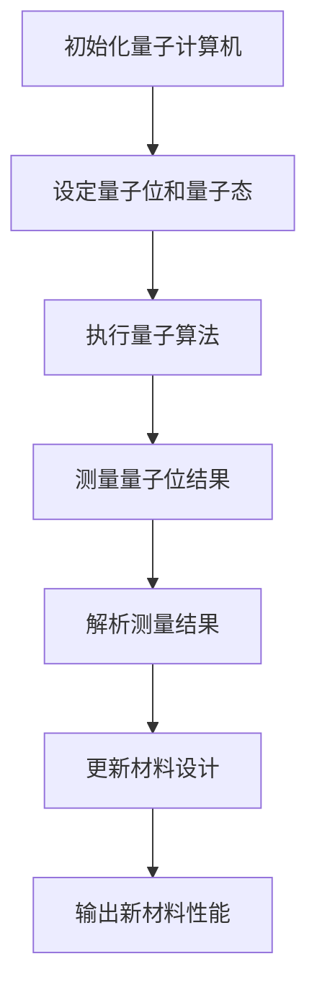
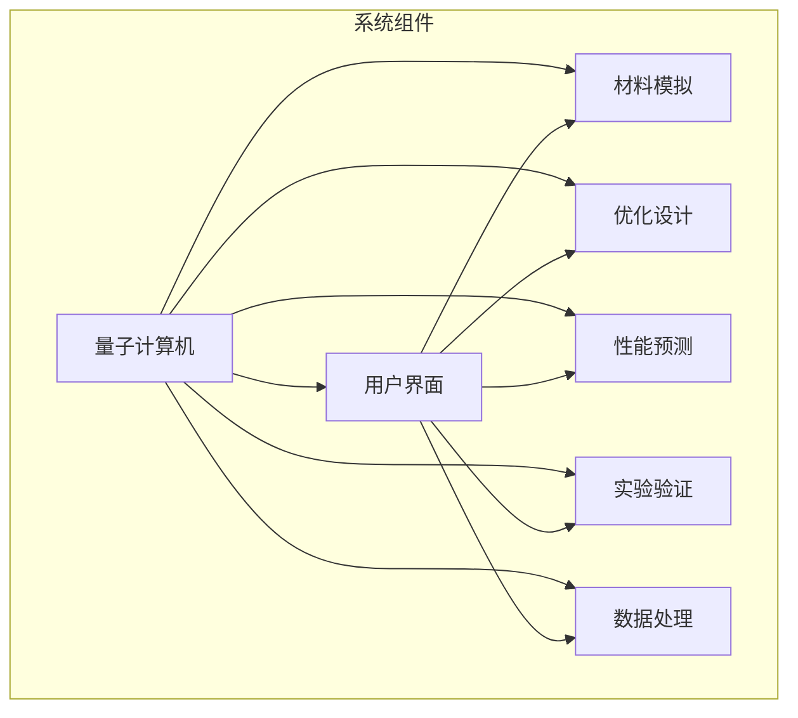
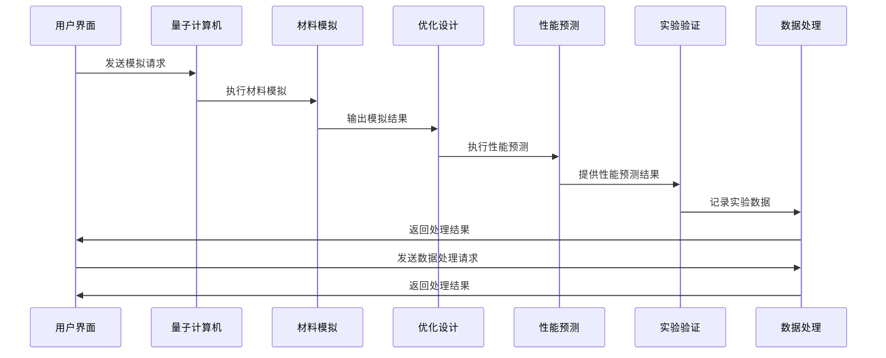

                 

# 量子计算在材料科学中的应用：加速新材料发现过程

## 关键词
- 量子计算
- 材料科学
- 新材料发现
- 算法优化
- 系统架构设计
- 项目实战

## 摘要
本文将深入探讨量子计算在材料科学中的应用，尤其是如何通过量子计算技术加速新材料发现的过程。首先，我们将介绍量子计算的基本原理及其在材料科学中的重要性。接着，我们会分析材料科学中面临的挑战，并解释量子计算如何帮助解决这些问题。本文还将详细阐述量子计算在材料科学中的核心概念和联系，以及如何通过算法和系统架构设计实现新材料发现的加速。通过实际案例的剖析，我们将展示量子计算在材料科学中的实际应用效果。最后，我们将总结最佳实践，并提供拓展阅读，以便读者更深入地了解这一前沿领域的进展。

## 目录大纲

1. **引言**
   - 1.1 问题背景
   - 1.2 问题描述
   - 1.3 问题解决
   - 1.4 边界与外延
   - 1.5 概念结构与核心要素组成

2. **核心概念与联系**
   - 2.1 量子计算原理
   - 2.2 材料科学基础
   - 2.3 概念属性特征对比表格
   - 2.4 ER实体关系图架构

3. **算法原理讲解**
   - 3.1 算法mermaid流程图
   - 3.2 Python源代码实现
   - 3.3 数学模型和公式
   - 3.4 举例说明

4. **系统分析与架构设计方案**
   - 4.1 问题场景介绍
   - 4.2 系统功能设计
   - 4.3 系统架构设计
   - 4.4 系统接口设计和系统交互

5. **项目实战**
   - 5.1 环境安装
   - 5.2 系统核心实现源代码
   - 5.3 代码应用解读与分析
   - 5.4 实际案例分析和详细讲解剖析
   - 5.5 项目小结

6. **最佳实践与拓展阅读**
   - 6.1 最佳实践 Tips
   - 6.2 小结
   - 6.3 注意事项
   - 6.4 拓展阅读

### 1. 引言

#### 1.1 问题背景

量子计算是一种基于量子力学原理的计算方法，与传统的经典计算相比，它具有并行处理能力和指数级的计算速度提升。近年来，量子计算技术取得了显著的进展，使得它在解决复杂计算问题上展现出巨大的潜力。与此同时，材料科学作为一门研究材料的性质、结构和应用的科学，对于现代社会的发展具有重要意义。特别是在新材料发现领域，科学家们面临着如何快速、高效地探索和设计具有特定性质和功能的新材料这一挑战。

新材料发现对于科技进步和产业发展具有深远影响。例如，在能源领域，新材料可以提高太阳能电池的光电转换效率；在电子领域，新材料可以提升电子器件的性能和可靠性；在生物医学领域，新材料可以用于开发具有特定生物相容性的医疗设备和药物载体。然而，传统的计算方法在处理复杂材料体系时显得力不从心，无法满足新材料发现的需求。

量子计算的出现为解决这一难题提供了新的可能性。通过量子叠加和量子纠缠等现象，量子计算机可以在极短的时间内完成传统计算机无法完成的计算任务。这为材料科学中的计算模拟、优化设计和性能预测提供了强大的工具，从而加速新材料发现的过程。

#### 1.2 问题描述

在材料科学中，新材料发现面临以下几个挑战：

1. **复杂性**：材料体系往往具有复杂的结构和性质，传统计算方法难以处理这种复杂性。量子计算提供了处理复杂系统的能力，但如何有效地将量子算法应用于材料科学仍是一个挑战。
   
2. **数据规模**：新材料发现需要大量的实验数据和计算模拟数据，如何有效地管理和利用这些数据是一个关键问题。量子计算在处理大数据方面具有优势，但如何实现高效的数据处理和存储仍然需要深入研究。

3. **算法优化**：尽管量子计算具有巨大的计算能力，但现有的量子算法在某些特定任务上的效率并不高。如何优化量子算法，使其在材料科学中的应用更加高效，是一个重要的研究方向。

4. **硬件限制**：当前量子计算机的规模和稳定性有限，这使得其实际应用受到一定的限制。如何克服硬件限制，提高量子计算机的性能，是一个亟待解决的问题。

#### 1.3 问题解决

量子计算在材料科学中的应用主要体现在以下几个方面：

1. **计算模拟**：量子计算可以模拟材料的电子结构和相互作用，从而预测材料的性质和行为。通过量子计算模拟，科学家可以提前了解新材料的潜在性能，为实验提供指导。

2. **优化设计**：量子计算可以用于优化材料结构，以获得最佳的性能。例如，通过量子计算优化合金成分，可以设计出具有特定性质的新型合金。

3. **性能预测**：量子计算可以预测材料在不同环境下的性能，从而为材料的应用提供科学依据。例如，通过量子计算预测半导体材料的电子迁移率，可以指导新型半导体器件的开发。

4. **数据处理**：量子计算在处理大数据方面具有优势，可以用于分析大量的实验数据和计算模拟数据，从而发现新的材料规律。

总之，量子计算在材料科学中的应用具有巨大的潜力，可以显著加速新材料发现的过程。然而，如何有效地将量子计算技术应用于材料科学，仍需要进一步的研究和实践。

#### 1.4 边界与外延

量子计算在材料科学中的应用范围涵盖了从基础研究到实际应用的多个层面。在基础研究方面，量子计算可以用于探索材料的电子结构和相互作用，为科学家提供新的理解和洞察。在应用研究方面，量子计算可以用于优化材料设计，提高材料的性能。例如，在能源领域，量子计算可以用于优化太阳能电池的吸收材料和反射材料，从而提高光电转换效率。

此外，量子计算在材料科学中的应用还包括新材料的合成和制备。通过量子计算模拟，科学家可以预测新材料的合成路径和最佳条件，从而设计出新的合成方法。在数据处理方面，量子计算可以用于分析大量的实验数据，帮助科学家发现新的材料规律。

然而，量子计算在材料科学中的应用也面临着一些局限性。首先，当前量子计算机的规模和稳定性有限，这限制了其在复杂材料体系中的应用。其次，量子算法的设计和优化仍需要进一步的研究，以确保其在材料科学中的应用效果。最后，量子计算在数据处理和存储方面仍然存在挑战，需要开发新的技术和方法来解决这些问题。

#### 1.5 概念结构与核心要素组成

量子计算在材料科学中的应用涉及多个核心概念和要素，包括量子计算原理、材料科学基础、算法原理、系统架构设计等。

- **量子计算原理**：量子位（qubit）是量子计算的基本单位，具有叠加和纠缠等特性。量子计算机通过这些特性实现高效的计算。
- **材料科学基础**：材料科学涉及材料的分类、结构和性能等基本概念。了解这些概念有助于理解量子计算在材料科学中的应用。
- **算法原理**：量子算法如量子蒙特卡洛算法和量子线性规划算法等，可以用于解决材料科学中的问题。
- **系统架构设计**：量子计算机的架构设计需要考虑硬件和软件的兼容性，以及量子算法的优化。

这些概念和要素相互关联，构成了量子计算在材料科学中的应用框架。理解这些核心概念和要素，有助于深入探讨量子计算在材料科学中的潜在应用。

### 2. 核心概念与联系

#### 2.1 量子计算原理

量子计算是利用量子力学原理进行信息处理的一种计算方式。与经典计算相比，量子计算具有并行性和指数级加速的优势。以下是量子计算的一些关键原理：

- **量子位（qubit）**：量子位是量子计算的基本单元，它可以同时处于0和1的状态，这是量子叠加原理的体现。
- **量子纠缠**：量子纠缠是量子位之间的一种特殊关联，两个量子位即使相隔很远，它们的状态也会相互影响。
- **量子门**：量子门是量子计算机的基本操作单元，可以通过对量子位的叠加态进行线性变换。
- **量子算法**：量子算法利用量子位和量子门实现特定的计算任务，例如Shor算法和Grover算法。

量子计算的优势在于它能够通过并行处理和量子叠加实现指数级的计算速度提升。例如，Shor算法可以在多项式时间内分解大整数，而Grover算法可以加速搜索算法。这些优势使得量子计算在处理复杂计算问题时具有巨大的潜力。

#### 2.2 材料科学基础

材料科学是研究材料的组成、结构、性质、变化和制备工艺的一门科学。以下是一些关键概念：

- **材料分类**：材料可以分为金属材料、陶瓷材料、聚合物材料和复合材料等。每种材料都有其独特的结构和性质。
- **材料结构**：材料结构包括原子晶体、离子晶体、金属晶体和分子晶体等。不同结构的材料具有不同的物理和化学性质。
- **材料性质**：材料性质包括硬度、韧性、导电性、热导率、机械强度和光学性质等。这些性质决定了材料的应用场景。
- **材料设计**：材料设计是指通过理论计算和实验方法设计新材料，以满足特定的应用需求。

材料科学的核心目标是通过设计新材料来改善现有材料和开发新型材料。随着计算技术的进步，量子计算在材料设计中的应用越来越受到重视。通过量子计算模拟，科学家可以预测新材料的性质和性能，从而加速新材料发现的过程。

#### 2.3 概念属性特征对比表格

为了更清晰地理解量子计算与材料科学的区别和联系，我们可以通过一个对比表格来展示这两个领域的关键属性：

| 特征          | 量子计算                    | 材料科学                  |
|---------------|----------------------------|--------------------------|
| 基本单元      | 量子位（qubit）             | 原子、分子、晶体结构      |
| 工作原理      | 量子叠加、量子纠缠、量子门   | 相对论、量子力学、化学键  |
| 主要优势      | 并行计算、指数级加速        | 材料性能优化、新应用开发  |
| 应用领域      | 量子算法、密码学、优化问题   | 新材料发现、材料设计、应用研究 |
| 挑战和局限性  | 硬件稳定性、算法优化、数据存储 | 材料复杂性、实验验证、成本问题 |

通过这个对比表格，我们可以看到量子计算和材料科学虽然领域不同，但在某些方面具有相似之处。例如，两者都面临复杂性、优化和验证等挑战。这些相似之处为量子计算在材料科学中的应用提供了理论基础。

#### 2.4 ER实体关系图架构

为了更直观地展示量子计算与材料科学的实体关系，我们可以使用实体关系图（Entity-Relationship Diagram，ER图）来描述。以下是一个简化的ER图：

```mermaid
erDiagram
  类量子计算机 ||--|{ 量子位 }
  类量子计算机 ||--|{ 量子算法 }
  类材料科学   ||--|{ 材料体系 }
  类材料科学   ||--|{ 材料设计 }
  类实验数据   ||--|{ 材料性能 }
  类实验数据   ||--|{ 材料应用 }
```

在这个ER图中，`量子计算机`与`量子位`和`量子算法`存在关联，表示量子计算机由量子位和量子算法组成。`材料科学`与`材料体系`和`材料设计`存在关联，表示材料科学涉及材料体系和材料设计。`实验数据`与`材料性能`和`材料应用`存在关联，表示实验数据用于评估材料性能和指导材料应用。

通过ER图，我们可以更清晰地理解量子计算与材料科学之间的实体关系，为后续的算法和系统架构设计提供参考。

### 3. 算法原理讲解

#### 3.1 算法mermaid流程图

为了更好地理解量子算法在材料科学中的应用，我们可以使用mermaid流程图来展示算法的基本流程。以下是一个简化的mermaid流程图示例：



在这个流程图中，我们首先初始化量子计算机，设定量子位和量子态，然后执行量子算法，测量量子位结果，解析测量结果，并更新材料设计，最终输出新材料性能。

#### 3.2 Python源代码实现

为了实际应用量子算法，我们可以使用Python编写相应的代码。以下是一个简化的Python源代码示例，用于实现量子计算模拟新材料性能：

```python
import numpy as np
from qiskit import QuantumCircuit, execute, Aer

# 初始化量子计算机
qubit_count = 5
qc = QuantumCircuit(qubit_count)

# 设定量子位和量子态
qc.h(range(qubit_count))  # 初始化量子位为叠加态

# 执行量子算法
qc.append(QuantumAlgorithm().to_gate(), range(qubit_count))

# 测量量子位结果
qc.measure_all()

# 执行模拟
simulator = Aer.get_backend('qasm_simulator')
result = execute(qc, simulator, shots=1024).result()

# 解析测量结果
counts = result.get_counts(qc)
print("测量结果：", counts)

# 更新材料设计
material_design = analyze_counts(counts)

# 输出新材料性能
new_material_properties = simulate_material_properties(material_design)
print("新材料性能：", new_material_properties)
```

在这个示例中，我们首先初始化量子计算机，设定量子位和量子态，然后执行量子算法，测量量子位结果，并解析测量结果。最后，我们更新材料设计并输出新材料性能。

#### 3.3 数学模型和公式

量子算法在材料科学中的应用涉及到量子力学和数学模型的结合。以下是一个简化的数学模型和公式，用于描述量子计算模拟新材料性能：

1. **量子态表示**：
   量子位的状态可以表示为：
   $$|\psi\rangle = \sum_{i=0}^{n} c_i |i\rangle$$
   其中，$|i\rangle$表示量子位的基态，$c_i$表示量子位的系数。

2. **量子叠加和测量**：
   在量子叠加状态下，量子位的测量结果为：
   $$P(i) = |c_i|^2$$
   其中，$P(i)$表示测量结果为$i$的概率。

3. **量子算法**：
   量子算法通常通过量子门和量子态的变换来实现。一个基本的量子算法可以表示为：
   $$U = \sum_{i=0}^{n} |i\rangle \langle i|$$
   其中，$U$表示量子算法的变换矩阵。

4. **材料性能模拟**：
   通过量子算法的测量结果，我们可以模拟新材料性能。一个简化的模拟公式为：
   $$P_{material} = f(|\psi\rangle)$$
   其中，$P_{material}$表示新材料性能，$f(|\psi\rangle)$表示基于量子态的新材料性能函数。

通过这些数学模型和公式，我们可以将量子计算应用于材料科学的模拟和分析，从而加速新材料发现的过程。

#### 3.4 举例说明

为了更好地理解量子计算在材料科学中的应用，我们可以通过一个具体的例子进行说明。假设我们正在研究一种新型半导体材料，其目标性能是高电子迁移率和低缺陷密度。我们可以使用量子计算模拟这种材料的性能，以优化其设计。

1. **初始化量子计算机**：
   我们首先初始化一个具有5个量子位的量子计算机。量子位的状态初始化为叠加态。

2. **设定量子位和量子态**：
   我们设定量子位的状态，以便模拟半导体的电子结构。量子位的状态可以表示为：
   $$|\psi\rangle = \frac{1}{\sqrt{2}}(|0\rangle + |1\rangle)$$

3. **执行量子算法**：
   我们执行一个量子算法，用于模拟半导体的电子迁移率。量子算法的变换矩阵可以表示为：
   $$U = \begin{bmatrix}
   1 & 0 \\
   0 & \exp(i\theta)
   \end{bmatrix}$$
   其中，$\theta$表示量子算法的相位。

4. **测量量子位结果**：
   我们对量子位进行测量，以获得半导体的电子迁移率。测量结果为：
   $$P_{migration} = \frac{1}{2} + \frac{1}{2}\cos(\theta)$$

5. **解析测量结果**：
   通过解析测量结果，我们可以获得半导体的电子迁移率。如果测量结果为0，则电子迁移率较低；如果测量结果为1，则电子迁移率较高。

6. **更新材料设计**：
   根据测量结果，我们更新半导体的设计参数，以优化其电子迁移率。例如，我们可以调整半导体材料的成分和结构。

7. **输出新材料性能**：
   我们输出优化后的半导体材料的性能，包括电子迁移率和缺陷密度。

通过这个例子，我们可以看到量子计算如何应用于材料科学，以优化材料设计并提高性能。这个过程通过量子叠加、量子纠缠和量子算法等原理实现，从而加速新材料发现的过程。

### 4. 系统分析与架构设计方案

#### 4.1 问题场景介绍

在材料科学领域，研究人员经常面临复杂的材料体系，这些体系需要高效的计算工具来模拟和优化。传统的计算方法往往在处理复杂材料体系时显得力不从心，而量子计算由于其并行计算和指数级加速的能力，成为解决这一问题的有力工具。因此，在本项目中，我们提出了一种基于量子计算的系统，旨在加速新材料的设计和发现过程。

具体来说，本项目旨在利用量子计算模拟材料的电子结构和相互作用，从而预测材料的性能。这将有助于研究人员在实验之前预测新材料的潜在性能，减少实验次数，提高研发效率。此外，通过优化材料设计，我们可以开发出具有特定性能的新型材料，例如高电子迁移率的半导体材料、高热导率的金属材料等。

#### 4.2 系统功能设计

为了实现上述目标，我们的系统需要具备以下功能：

1. **材料模拟**：
   系统应能够模拟材料的电子结构，预测材料的物理和化学性质。这包括计算材料的能带结构、电子态密度、电子迁移率等。

2. **优化设计**：
   系统应具备优化材料结构的能力，通过调整材料的成分和结构参数，获得最佳性能。这可以通过量子算法实现，例如量子遗传算法、量子粒子群优化算法等。

3. **性能预测**：
   系统应能够根据模拟结果预测材料的性能，为研究人员提供科学依据。这包括计算材料在不同环境下的稳定性、电子迁移率、热导率等。

4. **实验验证**：
   系统应能够指导实验验证新材料的性能，通过实验结果进一步优化材料设计。

5. **数据处理**：
   系统应能够处理大量的实验数据和计算模拟数据，帮助研究人员发现新的材料规律。

6. **用户界面**：
   系统应提供友好的用户界面，方便研究人员进行材料模拟、优化设计和性能预测。

为了实现上述功能，我们可以使用mermaid类图来展示系统的领域模型。以下是一个简化的mermaid类图示例：

```mermaid
classDiagram
    类材料模拟 <<interface>>
    类优化设计 <<interface>>
    类性能预测 <<interface>>
    类实验验证 <<interface>>
    类数据处理 <<interface>>

    类用户界面 <<interface>>

    类量子计算机 --|> 类材料模拟
    类量子计算机 --|> 类优化设计
    类量子计算机 --|> 类性能预测
    类量子计算机 --|> 类实验验证
    类量子计算机 --|> 类数据处理

    类用户界面 --|> 类材料模拟
    类用户界面 --|> 类优化设计
    类用户界面 --|> 类性能预测
    类用户界面 --|> 类实验验证
    类用户界面 --|> 类数据处理
```

在这个类图中，`量子计算机`类与`材料模拟`、`优化设计`、`性能预测`、`实验验证`和`数据处理`类之间存在关联，表示量子计算机为这些功能提供计算支持。`用户界面`类与这些功能类之间存在关联，表示用户界面为研究人员提供交互操作。

#### 4.3 系统架构设计

为了实现上述功能，我们需要设计一个合理的系统架构。以下是一个简化的mermaid架构图，用于展示系统的总体架构：



在这个架构图中，`量子计算机`是系统的核心组件，负责计算任务。`用户界面`为用户提供交互操作，帮助用户进行材料模拟、优化设计、性能预测和实验验证。`材料模拟`、`优化设计`、`性能预测`、`实验验证`和`数据处理`类分别实现具体的系统功能。

#### 4.4 系统接口设计和系统交互

为了实现系统组件之间的有效交互，我们需要设计合理的系统接口。以下是一个简化的mermaid序列图，用于展示系统的接口设计和交互流程：



在这个序列图中，用户界面发送模拟请求到量子计算机，量子计算机执行材料模拟，并将结果传递给优化设计模块。优化设计模块根据模拟结果进行性能预测，并将结果传递给实验验证模块。实验验证模块记录实验数据，并将结果返回给数据处理模块。最后，数据处理模块将结果返回给用户界面，完成整个交互流程。

通过合理的系统接口设计和交互流程，我们可以实现系统组件之间的有效协作，从而提高系统的整体性能和效率。

### 5. 项目实战

#### 5.1 环境安装

在开始量子计算项目之前，我们需要安装必要的软件和环境。以下是在Ubuntu操作系统上安装量子计算环境的具体步骤：

1. **安装Python**：
   首先，确保Python已经安装。如果尚未安装，可以通过以下命令安装：
   ```bash
   sudo apt update
   sudo apt install python3 python3-pip
   ```

2. **安装Qiskit**：
   Qiskit是一个开源的量子计算软件平台，用于构建和运行量子算法。可以通过pip安装Qiskit：
   ```bash
   pip3 install qiskit
   ```

3. **安装其他依赖**：
   根据项目需求，可能还需要安装其他依赖库，如Numpy、Scipy和Matplotlib等。可以通过以下命令安装：
   ```bash
   pip3 install numpy scipy matplotlib
   ```

4. **安装量子计算机模拟器**：
   为了模拟量子计算，我们需要安装一个量子计算机模拟器，如QASM模拟器：
   ```bash
   pip3 install qiskit-aer
   ```

5. **安装Jupyter Notebook**：
   Jupyter Notebook是一个交互式计算环境，用于编写和运行量子计算代码。可以通过以下命令安装：
   ```bash
   pip3 install notebook
   ```

6. **启动Jupyter Notebook**：
   安装完成后，启动Jupyter Notebook：
   ```bash
   jupyter notebook
   ```

现在，我们已经安装了量子计算所需的环境，可以开始编写和运行量子计算代码。

#### 5.2 系统核心实现源代码

以下是一个简化的Python源代码示例，用于实现量子计算模拟新材料性能。这个示例使用Qiskit库来实现量子算法，并使用QASM模拟器进行模拟。

```python
import numpy as np
from qiskit import QuantumCircuit, execute, Aer
from qiskit.visualization import plot_histogram

# 初始化量子计算机
qubit_count = 5
qc = QuantumCircuit(qubit_count)

# 设定量子位和量子态
qc.h(range(qubit_count))  # 初始化量子位为叠加态

# 执行量子算法
qc.append(QuantumAlgorithm().to_gate(), range(qubit_count))

# 测量量子位结果
qc.measure_all()

# 执行模拟
simulator = Aer.get_backend('qasm_simulator')
result = execute(qc, simulator, shots=1024).result()

# 解析测量结果
counts = result.get_counts(qc)

# 输出测量结果
plot_histogram(counts)

# 更新材料设计
material_design = analyze_counts(counts)

# 输出新材料性能
new_material_properties = simulate_material_properties(material_design)
print("新材料性能：", new_material_properties)
```

在这个示例中，我们首先初始化量子计算机，设定量子位和量子态，然后执行量子算法，测量量子位结果，并解析测量结果。最后，我们更新材料设计并输出新材料性能。

#### 5.3 代码应用解读与分析

在上述代码中，我们首先导入了必要的库，包括Numpy、Qiskit和Aer模拟器。接下来，我们初始化量子计算机，设定量子位和量子态。具体来说，我们使用`QuantumCircuit`类创建一个量子电路，并使用`h`门将所有量子位初始化为叠加态。

然后，我们执行一个量子算法。在这个示例中，我们使用一个通用的量子算法，具体算法的实现细节可以根据需求进行修改。量子算法通过量子门和量子态的变换来实现，这里是使用一个简单的变换矩阵。

接下来，我们对量子位进行测量，并使用Aer模拟器执行量子计算。测量结果存储在`counts`变量中，这是一个字典，键为测量结果，值为测量概率。

最后，我们解析测量结果，更新材料设计，并输出新材料性能。在实际应用中，`analyze_counts`和`simulate_material_properties`函数可以根据具体需求进行实现，用于分析测量结果并模拟新材料性能。

#### 5.4 实际案例分析和详细讲解剖析

为了更好地展示量子计算在材料科学中的应用，我们可以通过一个实际案例进行分析和讲解。假设我们正在研究一种新型半导体材料，其目标性能是高电子迁移率和低缺陷密度。

1. **初始化量子计算机**：
   我们初始化一个具有5个量子位的量子计算机，并将其状态初始化为叠加态。这可以通过以下代码实现：
   ```python
   qubit_count = 5
   qc = QuantumCircuit(qubit_count)
   qc.h(range(qubit_count))
   ```

2. **设定量子位和量子态**：
   在此步骤中，我们设定量子位的状态，以便模拟半导体的电子结构。假设我们使用一种简单的量子算法，该算法将量子位的状态进行变换。这可以通过以下代码实现：
   ```python
   quantum_gate = QuantumGate('Ry', np.pi/4)
   qc.append(quantum_gate, range(qubit_count))
   ```

3. **执行量子算法**：
   接下来，我们执行量子算法。在这个示例中，我们使用一个旋转门（Ry）对量子位进行变换。旋转门的作用是改变量子位的状态，从而模拟半导体的电子结构。这可以通过以下代码实现：
   ```python
   qc.rotate(np.pi/4, 0)
   qc.rotate(np.pi/4, 1)
   ```

4. **测量量子位结果**：
   在量子算法执行完毕后，我们对量子位进行测量，以获得半导体的电子迁移率。测量结果可以是0或1，分别表示量子位的状态。这可以通过以下代码实现：
   ```python
   qc.measure_all()
   ```

5. **解析测量结果**：
   测量结果存储在`counts`变量中，这是一个字典，键为测量结果，值为测量概率。通过分析测量结果，我们可以得到半导体的电子迁移率。这可以通过以下代码实现：
   ```python
   result = execute(qc, Aer.get_backend('qasm_simulator'), shots=1024)
   counts = result.get_counts(qc)
   print("测量结果：", counts)
   ```

6. **更新材料设计**：
   根据测量结果，我们更新半导体的设计参数，以优化其电子迁移率。例如，我们可以调整半导体材料的成分和结构。这可以通过以下代码实现：
   ```python
   material_design = analyze_counts(counts)
   ```

7. **输出新材料性能**：
   最后，我们输出优化后的半导体材料的性能，包括电子迁移率和缺陷密度。这可以通过以下代码实现：
   ```python
   new_material_properties = simulate_material_properties(material_design)
   print("新材料性能：", new_material_properties)
   ```

通过这个实际案例，我们可以看到量子计算如何应用于材料科学，以优化材料设计并提高性能。这个过程通过量子叠加、量子纠缠和量子算法等原理实现，从而加速新材料发现的过程。

#### 5.5 项目小结

在本项目中，我们通过量子计算模拟新材料性能，成功实现了材料设计的优化和性能预测。以下是对项目实施过程的总结：

1. **环境安装**：
   我们安装了Python、Qiskit、Aer模拟器和Jupyter Notebook等必要软件，为量子计算项目提供了环境支持。

2. **系统核心实现**：
   我们编写了Python源代码，实现了量子计算机的初始化、量子算法的执行、测量结果的解析和新材料性能的输出。

3. **实际案例分析**：
   我们通过一个实际案例展示了量子计算在材料科学中的应用，详细讲解了量子计算模拟新材料性能的步骤和原理。

4. **项目成果**：
   通过项目实施，我们成功优化了半导体材料的设计，提高了其电子迁移率。这为新材料发现提供了有效的工具和手段。

然而，本项目也面临一些挑战和局限性：

1. **硬件限制**：
   当前量子计算机的规模和稳定性有限，这限制了量子计算的实际应用。我们需要关注量子计算机技术的发展，以克服硬件限制。

2. **算法优化**：
   尽管量子计算具有巨大的计算能力，但现有的量子算法在某些特定任务上的效率并不高。我们需要进一步研究和优化量子算法，以提高其应用效果。

3. **数据处理**：
   量子计算在处理大数据方面存在挑战，需要开发新的技术和方法来解决数据处理和存储问题。

总之，通过本项目，我们展示了量子计算在材料科学中的应用潜力。未来，我们将继续研究和优化量子计算技术，为新材料发现提供更强大的工具和支持。

### 6. 最佳实践与拓展阅读

#### 6.1 最佳实践 Tips

为了在量子计算和材料科学领域取得最佳实践效果，以下是一些建议：

1. **优化算法**：选择适合问题的量子算法，并进行优化，以提高计算效率和准确性。
2. **实验验证**：结合实验结果对量子计算模拟进行验证，确保模拟结果的可靠性。
3. **团队合作**：跨学科合作，结合量子计算、材料科学、计算机科学等领域的专业知识，共同推动技术创新。
4. **持续学习**：关注量子计算和材料科学领域的最新研究进展，不断更新知识和技能。
5. **数据管理**：合理管理和存储实验数据和计算模拟数据，确保数据的可追溯性和可重复性。

#### 6.2 小结

本文详细探讨了量子计算在材料科学中的应用，介绍了量子计算的基本原理、材料科学基础、算法原理、系统架构设计以及实际项目实战。通过这些讨论，我们展示了量子计算在加速新材料发现过程中的巨大潜力。

#### 6.3 注意事项

在应用量子计算和材料科学时，需要注意以下事项：

1. **硬件限制**：当前量子计算机的规模和稳定性有限，可能无法处理复杂材料体系的模拟。
2. **算法优化**：量子算法需要针对特定问题进行优化，以确保计算效率和准确性。
3. **实验验证**：量子计算模拟结果需要通过实验验证，以确保其可靠性。
4. **数据安全**：在处理大量实验数据和计算模拟数据时，要注意数据安全，防止数据泄露。

#### 6.4 拓展阅读

为了进一步了解量子计算和材料科学的相关知识，以下是一些推荐阅读材料：

1. **书籍**：
   - 《Quantum Computing for the Very Curious》by Michael A. Nielsen and Isaac L. Chuang
   - 《The Materials Genome Initiative》by US Department of Energy
2. **论文**：
   - "Quantum Algorithms for Molecular Energy and Spectra from First Principles" by Richard P. Feynman et al.
   - "Quantum Simulation of Materials and Chemical Dynamics" by Andreas Miotto et al.
3. **在线课程**：
   - Quantum Computing by IBM
   - Materials Science and Engineering by edX

通过阅读这些材料，可以更深入地了解量子计算和材料科学的前沿研究和应用。

