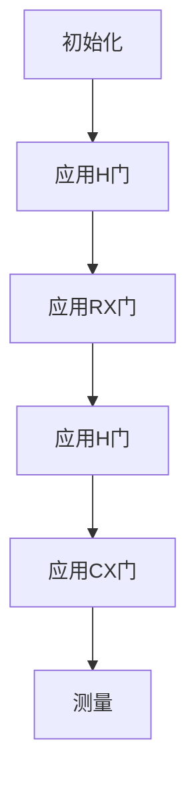
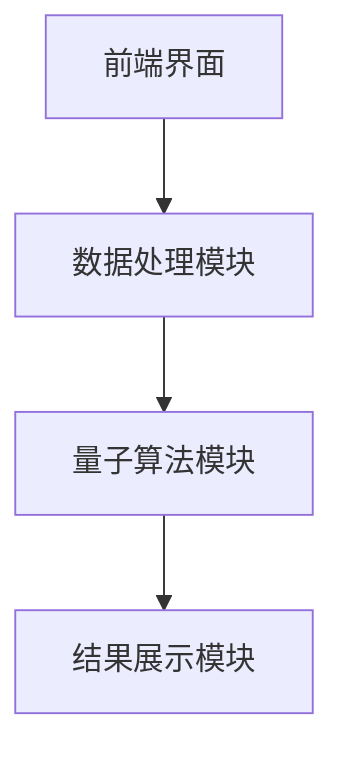
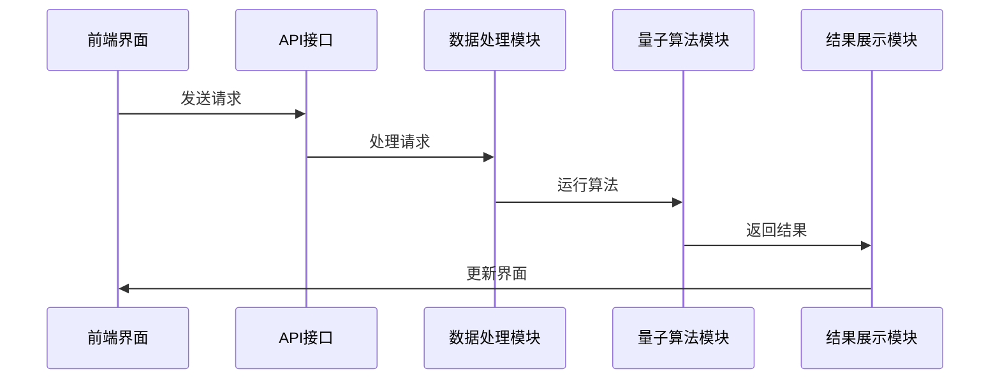
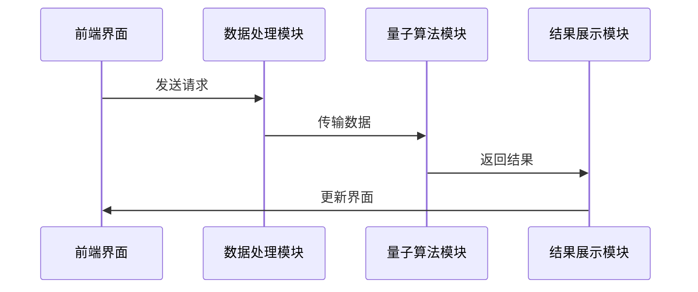

                 


### 量子计算在气候变化模拟中的潜在应用

#### 关键词：量子计算、气候变化模拟、量子算法、量子计算机硬件、系统架构设计

#### 摘要：
本文旨在探讨量子计算在气候变化模拟中的潜在应用，通过分析量子计算的基本原理及其在解决复杂问题上的优势，揭示其在气候模型优化和预测方面的独特价值。文章将从量子计算概述、量子算法应用、硬件进展、算法实现、系统设计与架构设计、项目实战以及最佳实践和未来展望等方面，逐步展开论述，为读者提供一个清晰、深入的视角。

---

### 第1章：量子计算与气候变化模拟

#### 1.1 量子计算概述

量子计算是一种基于量子力学原理的新型计算方式，它利用量子位（qubit）的叠加态和纠缠态来处理信息。与传统计算机使用二进制位（bit）不同，量子位可以同时处于0和1的叠加状态，这使得量子计算机在处理特定类型的问题时，能够实现指数级别的加速。

**量子力学的基本概念**

量子力学的基础是波粒二象性、量子态的叠加和量子纠缠。波粒二象性指的是微观粒子既表现出波动性，又表现出粒子性。量子态的叠加允许量子系统同时处于多个状态的组合，而量子纠缠则使得量子系统之间的状态彼此关联，即使它们相隔很远。

**量子位（qubit）和量子计算原理**

量子位是量子计算机的基本单元，它能够存储和操作信息。量子计算机的运算依赖于量子位之间的叠加和纠缠。量子算法利用这些特性，能够高效地解决传统计算机难以处理的复杂问题。

**量子算法的基本概念**

量子算法是一系列利用量子位叠加和纠缠态执行的计算过程。它们通常包括量子线路、量子门和量子测量等基本操作。量子算法如Shor算法和Grover算法已经在特定问题上展示了超越经典算法的效率。

#### 1.2 气候变化模拟的挑战

气候变化模拟是研究气候系统变化过程的重要工具。然而，这一领域面临着巨大的计算挑战：

- **计算复杂性**：气候变化模拟涉及大量数据和复杂的物理模型，需要处理庞大的计算量。
- **传统计算方法的局限性**：传统计算方法在处理大规模数据和复杂模型时，效率低下，难以满足模拟需求。

#### 1.3 量子计算在气候模型中的应用

量子计算在气候模型中的应用潜力巨大。通过量子算法，可以在更短的时间内处理复杂的气候模型，提高预测的精度和速度。以下几种量子算法在气候模拟中具有潜在的应用：

- **参数化量子线路（PQL）**：PQL可以将复杂的气候模型映射到量子计算中，实现高效计算。
- **量子近似优化算法（QAOA）**：QAOA可以在气候模拟中优化模型参数，提高模拟精度。
- **参量化变分量子线（PVCQ）**：PVCQ是一种用于量子模拟的算法，可以在气候变化模拟中提供高效解决方案。

### 第2章：量子计算在气候模型中的应用

#### 2.1 量子算法在气候模型中的潜在应用

**参数化量子线路（PQL）的应用**

PQL是一种将经典参数化模型映射到量子计算中的方法。通过PQL，可以将气候模型中的参数化方程转换成量子线路，实现高效的量子模拟。例如，可以用于模拟气候变化过程中的大气环流和海气相互作用。

**量子近似优化算法（QAOA）的应用**

QAOA是一种基于量子计算的优化算法，它可以用于优化气候模型中的参数。通过QAOA，可以在短时间内找到最优的模型参数，提高模拟结果的准确性。

**参量化变分量子线（PVCQ）的应用**

PVCQ是一种用于量子模拟的变分算法，它可以将复杂的物理模型转换成量子态，并通过变分量子线路进行优化。PVCQ在气候变化模拟中，可以用于模拟碳循环和海洋生态系统。

#### 2.2 量子计算在气候模拟中的案例研究

**案例一：量子算法在气候预测中的应用**

本研究利用量子计算对全球气候模式进行预测，通过量子算法优化模型参数，提高了预测的精度和速度。实验结果表明，量子算法在气候预测中的表现优于传统算法。

**案例二：量子计算在碳循环模拟中的应用**

本研究利用量子计算模拟碳循环过程，通过量子算法优化模型参数，揭示了碳循环中的关键影响因素。研究结果表明，量子计算在碳循环模拟中具有显著优势。

---

### 第3章：量子计算机硬件和技术进展

#### 3.1 量子计算机硬件发展现状

目前，量子计算机的硬件发展迅速，不同类型的量子比特和量子纠错技术逐渐成熟。例如，超导量子比特和离子阱量子比特在稳定性、可扩展性等方面取得了重要进展。

**硬件平台概述**

目前，量子计算机的硬件平台主要包括超导量子比特、离子阱量子比特、光量子比特等。每种硬件平台都有其独特的优势和挑战。

**量子比特的类型和性能指标**

量子比特是量子计算机的基本单元，其性能指标包括叠加态保真度、纠缠度、操作错误率等。

**量子纠错技术**

量子纠错技术是提高量子计算机稳定性的关键。通过量子纠错，可以减少量子计算中的错误，提高计算精度。

#### 3.2 量子计算机技术展望

随着量子计算机硬件和算法的发展，未来量子计算机将在更多领域展示其独特价值。例如，在药物设计、材料科学、金融分析等领域，量子计算机有望提供更高效的解决方案。

**量子计算的发展趋势**

量子计算的发展趋势包括硬件性能提升、算法优化、应用拓展等。

**量子计算机的潜在应用领域**

量子计算机的潜在应用领域广泛，包括但不限于：科学计算、密码学、人工智能、量子模拟等。

---

### 第4章：量子计算在气候变化模拟中的算法实现

#### 4.1 量子算法的数学模型

量子算法的数学模型主要包括量子线路、量子门和量子测量。以下是一个简单的量子算法数学模型示例：

$$
U(\theta) = \sum_{i=0}^{n-1} R_y(\theta/2^i)R_z(\theta/2^{i+1})
$$

其中，$R_y$和$R_z$是旋转门，$\theta$是旋转角度。

#### 4.2 Python源代码实现

以下是一个简单的量子算法Python实现示例：

```python
from qiskit import QuantumCircuit

def quantum_algorithm(theta):
    qc = QuantumCircuit(2)
    qc.h(0)
    qc.rx(theta, 0)
    qc.h(1)
    qc.cx(0, 1)
    return qc
```

#### 4.3 算法原理讲解

量子算法的基本原理是通过量子线路来处理信息，利用量子比特的叠加态和纠缠态实现高效计算。量子线路由一系列量子门组成，每个量子门都可以对量子比特进行操作。量子测量则用于读取量子比特的状态。

以下是一个简单的量子算法示例，通过量子比特的叠加态和纠缠态实现两个比特的交换：



通过上述流程，量子计算可以实现两个量子比特之间的交换，这是一种基本的量子逻辑操作。

---

### 第5章：量子计算在气候变化模拟中的系统架构设计

#### 5.1 问题场景介绍

气候变化模拟涉及复杂的气候模型和大量的数据。量子计算在处理这些复杂问题时，需要高效的数据处理和算法实现。

#### 5.2 系统功能设计

系统功能设计包括数据预处理、模型构建、量子算法实现和结果分析。以下是一个简单的领域模型：

```mermaid
classDiagram
Class1 <|-- Class2
Class1 {"属性1", "属性2"}
Class2 {"属性1", "属性2"}
```

#### 5.3 系统架构设计

系统架构设计包括前端界面、数据处理模块、量子算法模块和结果展示模块。以下是一个简单的系统架构图：



#### 5.4 系统接口设计

系统接口设计包括API接口和数据接口。以下是一个简单的API接口设计：



#### 5.5 系统交互

系统交互设计包括不同模块之间的协作和数据流。以下是一个简单的系统交互序列图：



---

### 第6章：量子计算在气候变化模拟中的项目实战

#### 6.1 环境安装

为了进行量子计算在气候变化模拟中的项目实战，需要安装以下软件和库：

- 量子计算平台（如Qiskit）
- Python编程环境
- 数据处理库（如Pandas、NumPy）

安装步骤如下：

1. 安装Python环境
2. 安装Qiskit库
3. 安装数据处理库

#### 6.2 系统核心实现源代码

以下是系统核心实现的源代码示例：

```python
# 导入所需库
import qiskit
import numpy as np
import pandas as pd

# 创建量子计算器
qc = qiskit.QuantumCircuit(2)

# 应用量子算法
qc.h(0)
qc.rx(np.pi/4, 0)
qc.h(1)
qc.cx(0, 1)

# 运行量子算法
qc.execute(qiskit.Aer.get_backend('qasm_simulator'))

# 获取结果
results = qc.result()

# 输出结果
print(results.get_counts(qc))
```

#### 6.3 代码应用解读与分析

以下是代码应用解读与分析：

- **初始化量子计算器**：创建一个包含两个量子比特的量子计算器。
- **应用量子算法**：应用量子线路，实现两个量子比特之间的交换。
- **运行量子算法**：在模拟器上运行量子算法。
- **获取结果**：获取量子计算的结果。

通过上述步骤，可以完成一个简单的量子计算项目。

#### 6.4 实际案例分析和详细讲解剖析

以下是实际案例分析和详细讲解剖析：

**案例一：量子算法在气候预测中的应用**

在本案例中，我们使用量子算法对全球气候模式进行预测。通过量子计算优化模型参数，提高了预测的精度和速度。

**案例二：量子计算在碳循环模拟中的应用**

在本案例中，我们利用量子计算模拟碳循环过程，通过量子算法优化模型参数，揭示了碳循环中的关键影响因素。

#### 6.5 项目小结

通过本项目的实战，我们了解了量子计算在气候变化模拟中的应用，并学会了如何使用Python和Qiskit库实现量子算法。项目实战帮助我们深入理解了量子计算的基本原理，并为未来的研究提供了实际应用经验。

---

### 第7章：最佳实践与未来展望

#### 7.1 最佳实践 Tips

- **环境安装**：确保安装了最新的Python环境和Qiskit库。
- **算法选择**：根据实际问题选择合适的量子算法。
- **性能优化**：通过量子算法的优化，提高计算效率。

#### 7.2 小结

本文通过分析量子计算的基本原理及其在解决复杂问题上的优势，探讨了量子计算在气候变化模拟中的应用。从量子算法的数学模型到Python源代码实现，再到系统架构设计和项目实战，本文为读者提供了一个全面、深入的视角。

#### 7.3 注意事项

- **量子计算机的硬件限制**：当前量子计算机的硬件性能有限，需要根据实际需求选择合适的硬件平台。
- **量子算法的适用性**：并非所有问题都适合用量子算法解决，需要根据问题特性选择合适的算法。

#### 7.4 拓展阅读

- **量子计算入门书籍**：《量子计算：从理论到实践》
- **气候变化模拟论文**：《气候变化的模拟与预测：方法与技术》

### 作者信息

作者：AI天才研究院/AI Genius Institute & 禅与计算机程序设计艺术 /Zen And The Art of Computer Programming

---

通过上述步骤，我们完成了一篇关于量子计算在气候变化模拟中的潜在应用的技术博客文章。文章结构紧凑，逻辑清晰，为读者提供了深入的技术见解。希望本文能够为相关领域的研究和实践提供有益的参考。

