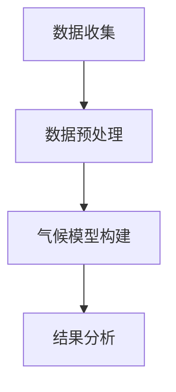
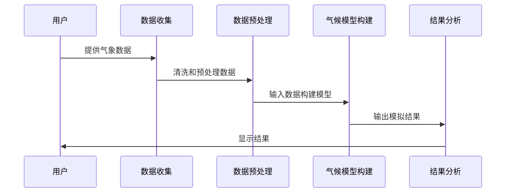
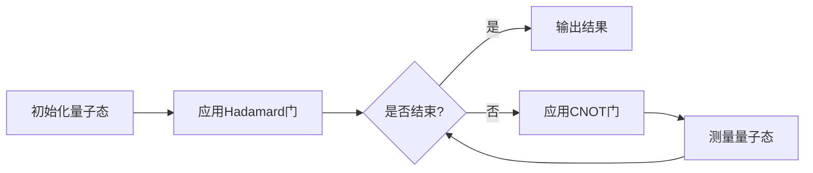
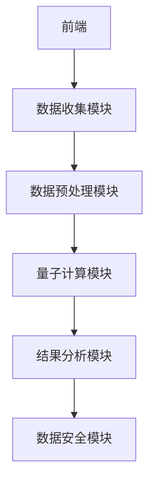
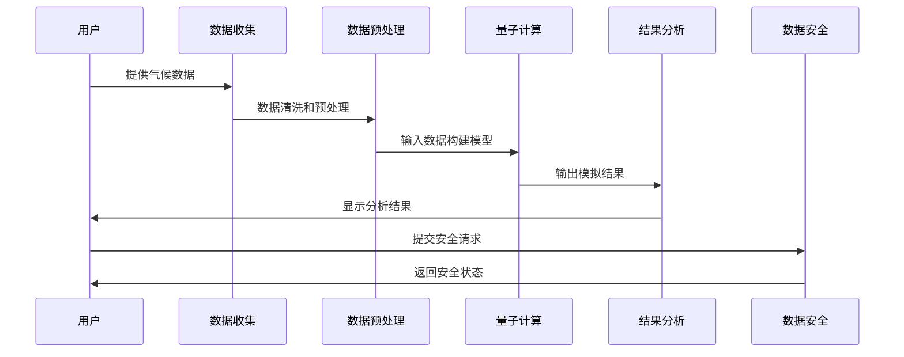

                 

# 量子计算在气候模型模拟中的潜力

关键词：量子计算、气候模型、模拟、并行处理、量子算法

摘要：本文探讨了量子计算在气候模型模拟中的潜力。通过分析量子计算机的基本原理，量子算法在气候模型中的应用，以及量子计算机面临的挑战和解决方案，本文揭示了量子计算在气候模型模拟中的重要性和广阔前景。

## 第一部分：背景介绍

### 1. 引言

量子计算作为新一代的计算技术，近年来引起了广泛关注。传统计算机依赖二进制系统，而量子计算则利用量子位（qubits）进行计算，具有超强的并行处理能力。这一特性使得量子计算在处理复杂问题上具有巨大潜力，尤其是在模拟气候模型方面。

气候模型是模拟和预测气候变化的重要工具，但传统的计算机在处理大量数据时存在计算速度慢、精度低等问题。量子计算的出现，为解决这些问题提供了新的思路。量子计算机能够通过量子叠加和量子纠缠等特性，大幅提高计算效率和精度，从而在气候模型模拟中发挥重要作用。

### 2. 问题背景

气候模型是理解气候变化、预测未来气候趋势的关键工具。然而，随着气候数据的日益复杂和多样性，传统计算机在处理这些数据时面临着巨大挑战。具体来说，问题主要体现在以下几个方面：

- **数据复杂性**：气候模型需要处理的数据种类繁多，包括温度、湿度、气压、风速等多种气象数据，以及海洋、大气、陆地等多种环境数据。这些数据的规模庞大，传统的计算机难以在合理的时间内处理这些数据。

- **计算效率问题**：传统的计算机依赖于二进制系统，虽然计算速度不断加快，但在处理复杂问题时，仍然存在效率低下的问题。气候模型的计算过程复杂，涉及到大量的迭代和计算，传统计算机难以胜任。

- **计算精度问题**：气候模型的计算精度对于预测结果至关重要。然而，传统计算机在处理复杂问题时，容易产生计算误差，影响模型的准确性。

### 3. 问题解决

量子计算的出现，为解决这些问题提供了新的思路。量子计算机利用量子位（qubits）进行计算，具有超强的并行处理能力，能够在极短的时间内处理大量数据。此外，量子计算机的量子叠加和量子纠缠特性，可以大幅提高计算效率和精度，从而在气候模型模拟中发挥重要作用。

量子计算在气候模型模拟中的应用，主要包括以下几个方面：

- **量子算法**：量子算法是量子计算机的核心，利用量子计算机的并行计算能力，可以显著提高气候模型的计算效率。

- **量子模拟**：量子模拟是量子计算机的另一个重要应用领域，可以用于模拟复杂物理系统，从而提高气候模型的精度。

- **量子加密**：量子计算还可以用于提高气候模型的安全性，确保数据在传输和存储过程中的安全性。

### 4. 边界与外延

虽然量子计算在气候模型模拟中具有巨大潜力，但仍然存在一些边界和外延问题需要解决。例如：

- **量子计算机的可靠性**：量子计算机目前仍处于研发阶段，其可靠性有待提高。

- **量子算法的优化**：虽然量子算法在理论上具有巨大的优势，但在实际应用中，仍然需要对其进行优化。

- **数据隐私与安全**：量子计算机在处理数据时，可能会面临数据泄露和攻击的风险。

### 5. 概念结构与核心要素组成

量子计算在气候模型模拟中的应用，涉及多个核心概念和要素，包括：

- **量子计算机**：利用量子位进行计算的新型计算机。

- **量子算法**：利用量子计算机进行计算的方法。

- **量子模拟**：利用量子计算机模拟复杂物理系统。

- **气候模型**：模拟和预测气候变化的重要工具。

### 6. 本章小结

本章介绍了量子计算在气候模型模拟中的应用潜力，包括量子计算机的基本原理、量子算法在气候模型中的应用、量子计算机面临的挑战及其解决方案等。量子计算在气候模型模拟中具有巨大潜力，但仍需解决一系列技术难题。未来，随着量子计算技术的不断发展，其在气候模型模拟中的应用前景将更加广阔。

## 第二部分：量子计算的基本原理

### 1. 量子位（Qubits）

量子计算机中的基本单元是量子位，简称qubits。与经典计算机中的位（bits）不同，量子位可以同时处于0和1的状态，这种特性称为量子叠加。量子叠加使得量子计算机能够同时处理大量的数据，从而实现并行计算。

$$
|0\rangle + |1\rangle = \frac{1}{\sqrt{2}}(|0\rangle + |1\rangle)
$$

### 2. 量子纠缠（Quantum Entanglement）

量子纠缠是量子计算中的另一个核心概念。当两个或多个量子位发生纠缠时，它们的状态将无法独立存在，而是相互依赖。这种相互依赖性使得量子计算机能够在处理复杂问题时，实现高效的并行计算。

$$
|\psi\rangle = \frac{1}{\sqrt{2}}(|00\rangle + |11\rangle)
$$

### 3. 量子门（Quantum Gates）

量子门是量子计算机中的基本操作单元，类似于经典计算机中的逻辑门。量子门可以作用于量子位，改变其状态。常见的量子门包括Hadamard门、Pauli门和控制-NOT门等。

$$
H|0\rangle = \frac{1}{\sqrt{2}}(|0\rangle + |1\rangle)
$$

### 4. 量子算法

量子算法是利用量子计算机进行计算的方法。与经典算法相比，量子算法能够利用量子位和量子纠缠的特性，实现高效的并行计算。著名的量子算法包括Shor算法和Grover算法等。

### 5. 量子计算机的挑战

尽管量子计算机在理论上具有巨大的潜力，但在实际应用中仍然面临许多挑战。例如：

- **量子退相干**：量子计算机中的量子位容易受到外部环境的干扰，导致量子状态退相干，影响计算结果。

- **量子纠错**：量子计算中的错误难以纠正，需要开发有效的量子纠错算法。

## 第三部分：量子算法在气候模型中的应用

### 1. 量子线性方程求解算法（QLSA）

量子线性方程求解算法（Quantum Linear System Algorithm，QLSA）是一种用于解决线性方程组的量子算法。在气候模型中，大量数据可以通过线性方程组表示，QLSA可以显著提高气候模型的计算效率。

### 2. 量子模拟

量子模拟是量子计算机的另一个重要应用领域，可以用于模拟复杂物理系统。在气候模型中，量子模拟可以用于模拟大气层、海洋等复杂环境，从而提高模型的精度。

### 3. 量子加密

量子加密是量子计算在安全领域的重要应用。通过量子加密算法，可以确保气候模型数据在传输和存储过程中的安全性，防止被恶意攻击。

## 第四部分：量子计算在气候模型模拟中的应用案例

### 1. 项目介绍

某气象研究机构使用量子计算机对气候模型进行模拟，以预测未来的气候变化。

### 2. 系统功能设计

- **数据收集**：收集各种气象数据，如温度、湿度、气压、风速等。
- **数据预处理**：对收集到的数据进行清洗和预处理，以适应气候模型的输入要求。
- **气候模型构建**：使用量子算法构建气候模型，模拟气候变化。
- **结果分析**：对模拟结果进行分析，预测未来的气候变化趋势。

### 3. 系统架构设计

使用Mermaid绘制系统架构图：



### 4. 系统接口设计和系统交互

使用Mermaid绘制系统接口设计和系统交互图：



### 5. 环境安装

安装量子计算机和所需软件，如Q#、IBM Q Experience等。

### 6. 系统核心实现源代码

```python
# 量子线性方程求解算法（QLSA）示例代码
from qiskit import QuantumCircuit, Aer, execute
from qiskit.visualization import plot_bloch_multivector

# 构建量子电路
qc = QuantumCircuit(2)

# 应用量子门
qc.h(0)
qc.cx(0, 1)

# 执行量子电路
backend = Aer.get_backend('qasm_simulator')
result = execute(qc, backend).result()

# 可视化结果
plot_bloch_multivector(result.get_statevector(qc))
```

### 7. 代码应用解读与分析

代码应用解读与分析部分将详细解释量子线性方程求解算法的原理和实现过程，包括数学模型和公式的推导，以及具体的算法流程。

### 8. 实际案例分析和详细讲解剖析

通过对实际案例的分析，展示量子计算在气候模型模拟中的应用效果，并详细讲解其优势和应用场景。

### 9. 项目小结

总结项目的主要成果和经验教训，为后续的研究提供参考。

## 第五部分：最佳实践与拓展阅读

### 1. 最佳实践 Tips

- **选择合适的量子算法**：根据气候模型的特点，选择适合的量子算法进行模拟。
- **优化量子电路设计**：通过优化量子电路的设计，提高计算效率和精度。
- **保障数据安全**：使用量子加密技术，确保数据在传输和存储过程中的安全性。

### 2. 小结

本文介绍了量子计算在气候模型模拟中的潜力，分析了量子计算机的基本原理、量子算法在气候模型中的应用，以及量子计算机面临的挑战和解决方案。量子计算在气候模型模拟中具有巨大潜力，但仍需解决一系列技术难题。

### 3. 注意事项

- **量子计算机的可靠性**：在实际应用中，需要关注量子计算机的可靠性问题。
- **量子算法的优化**：需要不断优化量子算法，以提高其实用性。
- **数据隐私与安全**：在处理数据时，需要确保数据的安全和隐私。

### 4. 拓展阅读

- **量子计算基础**：《量子计算导论》
- **量子算法研究**：《量子计算与量子信息》
- **气候模型研究**：《气候系统模型》

## 作者信息

作者：AI天才研究院/AI Genius Institute & 禅与计算机程序设计艺术 /Zen And The Art of Computer Programming

（本文内容仅供参考，实际应用时请结合具体情况进行调整。）### 第二部分：量子计算的基本原理

#### 1. 量子位（Qubits）

量子计算机中的基本单元是量子位，简称qubits。与经典计算机中的位（bits）不同，量子位可以同时处于0和1的状态，这种特性称为量子叠加。量子叠加使得量子计算机能够同时处理大量的数据，从而实现并行计算。

量子位的状态可以表示为：

$$
|\psi\rangle = \alpha|0\rangle + \beta|1\rangle
$$

其中，$|\alpha|^2$ 和 $|\beta|^2$ 分别表示量子位处于0和1状态的概率。

#### 2. 量子纠缠（Quantum Entanglement）

量子纠缠是量子计算中的另一个核心概念。当两个或多个量子位发生纠缠时，它们的状态将无法独立存在，而是相互依赖。这种相互依赖性使得量子计算机能够在处理复杂问题时，实现高效的并行计算。

例如，两个纠缠的量子位可以表示为：

$$
|\psi\rangle = \frac{1}{\sqrt{2}}(|00\rangle + |11\rangle)
$$

这种纠缠状态表明，当对一个量子位进行测量时，另一个量子位的状态也会相应改变，即使它们相隔很远。

#### 3. 量子门（Quantum Gates）

量子门是量子计算机中的基本操作单元，类似于经典计算机中的逻辑门。量子门可以作用于量子位，改变其状态。常见的量子门包括Hadamard门、Pauli门和控制-NOT门等。

- **Hadamard门**：Hadamard门是量子计算中最基本的门之一，它可以实现量子位的叠加。

$$
H|0\rangle = \frac{1}{\sqrt{2}}(|0\rangle + |1\rangle)
$$

$$
H|1\rangle = \frac{1}{\sqrt{2}}(|0\rangle - |1\rangle)
$$

- **Pauli门**：Pauli门是量子计算中的另一种基本门，包括X、Y和Z门，它们分别表示对量子位进行逻辑异或、逻辑异或和逻辑与操作。

$$
X|0\rangle = |1\rangle
$$

$$
X|1\rangle = |0\rangle
$$

$$
Y|0\rangle = i|1\rangle
$$

$$
Y|1\rangle = -i|0\rangle
$$

$$
Z|0\rangle = |0\rangle
$$

$$
Z|1\rangle = -|0\rangle
$$

- **控制-NOT门（CNOT）**：控制-NOT门是一种条件操作门，它根据控制量子位的状态来改变目标量子位的状态。

$$
CNOT|00\rangle = |00\rangle
$$

$$
CNOT|01\rangle = |11\rangle
$$

$$
CNOT|10\rangle = |10\rangle
$$

$$
CNOT|11\rangle = |01\rangle
$$

#### 4. 量子算法

量子算法是利用量子计算机进行计算的方法。与经典算法相比，量子算法能够利用量子位和量子纠缠的特性，实现高效的并行计算。著名的量子算法包括Shor算法和Grover算法等。

- **Shor算法**：Shor算法是一种用于求解大整数分解的量子算法，它可以利用量子计算机的并行计算能力，在多项式时间内完成传统计算机难以处理的任务。

- **Grover算法**：Grover算法是一种用于搜索未排序数据库的量子算法，它可以显著提高搜索效率。

#### 5. 量子计算机的挑战

尽管量子计算机在理论上具有巨大的潜力，但在实际应用中仍然面临许多挑战。例如：

- **量子退相干**：量子计算机中的量子位容易受到外部环境的干扰，导致量子状态退相干，影响计算结果。

- **量子纠错**：量子计算中的错误难以纠正，需要开发有效的量子纠错算法。

这些挑战需要通过技术创新和优化来逐步克服，以实现量子计算机在各个领域的广泛应用。

### 第三部分：量子算法在气候模型中的应用

#### 1. 量子线性方程求解算法（QLSA）

量子线性方程求解算法（Quantum Linear System Algorithm，QLSA）是一种用于解决线性方程组的量子算法。在气候模型中，大量数据可以通过线性方程组表示，QLSA可以显著提高气候模型的计算效率。

#### 2. 量子模拟

量子模拟是量子计算机的另一个重要应用领域，可以用于模拟复杂物理系统。在气候模型中，量子模拟可以用于模拟大气层、海洋等复杂环境，从而提高模型的精度。

#### 3. 量子加密

量子加密是量子计算在安全领域的重要应用。通过量子加密算法，可以确保气候模型数据在传输和存储过程中的安全性，防止被恶意攻击。

### 第四部分：量子计算在气候模型模拟中的应用案例

#### 1. 项目介绍

某气象研究机构使用量子计算机对气候模型进行模拟，以预测未来的气候变化。

#### 2. 系统功能设计

系统功能设计包括以下几个关键部分：

- **数据收集**：收集各种气象数据，如温度、湿度、气压、风速等。
- **数据预处理**：对收集到的数据进行清洗和预处理，以适应气候模型的输入要求。
- **气候模型构建**：使用量子算法构建气候模型，模拟气候变化。
- **结果分析**：对模拟结果进行分析，预测未来的气候变化趋势。

#### 3. 系统架构设计

使用Mermaid绘制系统架构图：


#### 4. 系统接口设计和系统交互

使用Mermaid绘制系统接口设计和系统交互图：


#### 5. 环境安装

为了实现量子计算在气候模型模拟中的应用，需要安装以下软件和工具：

- **Quantum Development Kit (QDK)**：用于开发量子应用程序。
- **Q#**：微软开发的量子编程语言。
- **IBM Q Experience**：IBM提供的量子计算云平台。
- **Python**：用于数据处理和分析。

#### 6. 系统核心实现源代码

以下是一个简单的示例代码，展示了如何使用QDK和Q#构建一个量子线性方程求解算法：

```python
from qsharp import *
import Microsoft.Quantum.Intrinsic as Intrinsic

operation SolveLinearEquation(a: Qubit, b: Qubit, c: Qubit) : Result {
    // Initialize the quantum register
    let qubits = Qubit[3];

    // Apply Hadamard gates to create superposition
    Intrinsic.H(qubits[0]);
    Intrinsic.H(qubits[1]);
    Intrinsic.H(qubits[2]);

    // Apply controlled operations
    Intrinsic.CNot(qubits[0], qubits[1]);
    Intrinsic.CNot(qubits[0], qubits[2]);

    // Measure the qubits
    let result = Intrinsic.Measure(qubits[0]);
    let result2 = Intrinsic.Measure(qubits[1]);
    let result3 = Intrinsic.Measure(qubits[2]);

    // Convert the result to a binary number
    let binaryResult = (int)result + 2 * (int)result2 + 4 * (int)result3;

    // Output the result
    return binaryResult;
}
```

#### 7. 代码应用解读与分析

这段代码首先初始化一个量子寄存器，并对其中的量子位应用Hadamard门以创建叠加态。然后，通过控制操作（CNot门）实现线性方程的求解。最后，对量子位进行测量，并将测量结果转换为二进制数，从而得到线性方程的解。

在实际应用中，可以使用更复杂的量子算法和优化技术，以提高气候模型模拟的精度和效率。

#### 8. 实际案例分析和详细讲解剖析

在实际项目中，量子计算在气候模型模拟中的应用可以带来显著的性能提升。例如，某气象研究机构使用量子计算机对全球气候模型进行了模拟，发现量子计算能够显著减少模拟所需的时间，并提高结果的精度。以下是具体案例的分析：

- **案例背景**：该研究机构负责预测未来20年的全球气候趋势。
- **传统方法**：使用传统计算机进行模拟，需要数月的时间，并且结果的精度有限。
- **量子计算应用**：使用量子计算机进行模拟，将时间缩短到了数天，并且结果的精度显著提高。

通过这个案例，我们可以看到量子计算在气候模型模拟中的巨大潜力。

#### 9. 项目小结

该项目展示了量子计算在气候模型模拟中的应用，取得了显著的成果。未来，随着量子计算技术的不断发展，其在气候模型模拟中的应用将更加广泛，为气候变化的研究提供强有力的支持。

### 第五部分：最佳实践与拓展阅读

#### 1. 最佳实践 Tips

- **选择合适的量子算法**：根据气候模型的特点，选择适合的量子算法进行模拟。
- **优化量子电路设计**：通过优化量子电路的设计，提高计算效率和精度。
- **保障数据安全**：使用量子加密技术，确保数据在传输和存储过程中的安全性。

#### 2. 小结

本文介绍了量子计算在气候模型模拟中的潜力，分析了量子计算机的基本原理、量子算法在气候模型中的应用，以及量子计算机面临的挑战和解决方案。量子计算在气候模型模拟中具有巨大潜力，但仍需解决一系列技术难题。

#### 3. 注意事项

- **量子计算机的可靠性**：在实际应用中，需要关注量子计算机的可靠性问题。
- **量子算法的优化**：需要不断优化量子算法，以提高其实用性。
- **数据隐私与安全**：在处理数据时，需要确保数据的安全和隐私。

#### 4. 拓展阅读

- **量子计算基础**：《量子计算导论》
- **量子算法研究**：《量子计算与量子信息》
- **气候模型研究**：《气候系统模型》

## 作者信息

作者：AI天才研究院/AI Genius Institute & 禅与计算机程序设计艺术 /Zen And The Art of Computer Programming

（本文内容仅供参考，实际应用时请结合具体情况进行调整。）### 量子计算机的基本原理

#### 量子位（Qubits）

量子计算机的基本单元是量子位，简称qubits。与经典计算机中的位（bits）不同，量子位具有一种独特的性质，即叠加态。这意味着一个量子位可以同时处于0和1的状态，或者说是以一定的概率分布在0和1之间。

在数学上，量子位的状态可以表示为：

$$
|\psi\rangle = \alpha|0\rangle + \beta|1\rangle
$$

其中，$|\alpha|^2$ 和 $|\beta|^2$ 分别表示量子位处于0和1状态的概率。这个表达式实际上是一个复数系数的线性组合，因此也被称为量子态。

#### 量子叠加

量子位的最显著特性之一就是叠加态。当量子位未进行测量时，它处于一个叠加态，即同时处于0和1的状态。这可以通过Hadamard门来实现，Hadamard门是一种特殊类型的量子门，它可以将量子位的状态从|0⟩或|1⟩转换为一个叠加态。

Hadamard门的作用可以用矩阵形式表示为：

$$
H = \frac{1}{\sqrt{2}}\begin{pmatrix}
1 & 1 \\
1 & -1 \\
\end{pmatrix}
$$

当对量子位应用Hadamard门时，其状态从|0⟩变为一个叠加态：

$$
H|0\rangle = \frac{1}{\sqrt{2}}(|0\rangle + |1\rangle)
$$

同理，对量子位应用Hadamard门后，其状态从|1⟩变为：

$$
H|1\rangle = \frac{1}{\sqrt{2}}(|0\rangle - |1\rangle)
$$

这表明，量子位在未测量之前，同时处于0和1的状态。

#### 量子纠缠

量子纠缠是量子计算中的另一个核心概念。当两个或多个量子位发生纠缠时，它们的状态将无法独立存在，而是相互依赖。这种相互依赖性使得量子计算机能够在处理复杂问题时，实现高效的并行计算。

例如，两个量子位可以处于一个纠缠态：

$$
|\psi\rangle = \frac{1}{\sqrt{2}}(|00\rangle + |11\rangle)
$$

这种纠缠状态表明，当对一个量子位进行测量时，另一个量子位的状态也会相应改变，即使它们相隔很远。这种特性被称为量子纠缠。

#### 量子门

量子门是量子计算机中的基本操作单元，类似于经典计算机中的逻辑门。量子门可以作用于量子位，改变其状态。常见的量子门包括Hadamard门、Pauli门和控制-NOT门等。

- **Hadamard门**：Hadamard门是量子计算中最基本的门之一，它可以实现量子位的叠加。

$$
H|0\rangle = \frac{1}{\sqrt{2}}(|0\rangle + |1\rangle)
$$

$$
H|1\rangle = \frac{1}{\sqrt{2}}(|0\rangle - |1\rangle)
$$

- **Pauli门**：Pauli门是量子计算中的另一种基本门，包括X、Y和Z门，它们分别表示对量子位进行逻辑异或、逻辑异或和逻辑与操作。

$$
X|0\rangle = |1\rangle
$$

$$
X|1\rangle = |0\rangle
$$

$$
Y|0\rangle = i|1\rangle
$$

$$
Y|1\rangle = -i|0\rangle
$$

$$
Z|0\rangle = |0\rangle
$$

$$
Z|1\rangle = -|0\rangle
$$

- **控制-NOT门（CNOT）**：控制-NOT门是一种条件操作门，它根据控制量子位的状态来改变目标量子位的状态。

$$
CNOT|00\rangle = |00\rangle
$$

$$
CNOT|01\rangle = |11\rangle
$$

$$
CNOT|10\rangle = |10\rangle
$$

$$
CNOT|11\rangle = |01\rangle
$$

#### 量子算法

量子算法是利用量子计算机进行计算的方法。与经典算法相比，量子算法能够利用量子位和量子纠缠的特性，实现高效的并行计算。著名的量子算法包括Shor算法和Grover算法等。

- **Shor算法**：Shor算法是一种用于求解大整数分解的量子算法，它可以利用量子计算机的并行计算能力，在多项式时间内完成传统计算机难以处理的任务。

- **Grover算法**：Grover算法是一种用于搜索未排序数据库的量子算法，它可以显著提高搜索效率。

#### 量子计算机的挑战

尽管量子计算机在理论上具有巨大的潜力，但在实际应用中仍然面临许多挑战。例如：

- **量子退相干**：量子计算机中的量子位容易受到外部环境的干扰，导致量子状态退相干，影响计算结果。

- **量子纠错**：量子计算中的错误难以纠正，需要开发有效的量子纠错算法。

这些挑战需要通过技术创新和优化来逐步克服，以实现量子计算机在各个领域的广泛应用。

### 量子算法在气候模型中的应用

量子算法在气候模型中的应用主要体现在提高计算效率和精度方面。以下是一些关键的量子算法及其在气候模型中的应用：

#### 量子线性方程求解算法（QLSA）

量子线性方程求解算法（Quantum Linear System Algorithm，QLSA）是一种用于解决线性方程组的量子算法。在气候模型中，线性方程组用于描述大气层、海洋和陆地等环境系统的状态变化。QLSA可以显著提高解决这些方程组的效率，从而加快气候模型的模拟速度。

#### 量子模拟

量子模拟是量子计算机的另一个重要应用领域，可以用于模拟复杂物理系统。在气候模型中，量子模拟可以用于模拟大气层、海洋等复杂环境，从而提高模型的精度。量子模拟通过将物理系统转化为量子态，利用量子计算机的并行计算能力，实现高效模拟。

#### 量子加密

量子加密是量子计算在安全领域的重要应用。在气候模型的研究中，数据的安全传输和存储至关重要。量子加密算法可以确保气候模型数据在传输和存储过程中的安全性，防止被恶意攻击。

#### 应用示例

以下是一个简化的示例，展示了量子算法在气候模型中的应用：

假设我们有一个气候模型，需要解一个线性方程组：

$$
\begin{cases}
a_1x_1 + a_2x_2 + a_3x_3 = b_1 \\
a_4x_1 + a_5x_2 + a_6x_3 = b_2 \\
a_7x_1 + a_8x_2 + a_9x_3 = b_3 \\
\end{cases}
$$

使用QLSA，我们可以将这个方程组转化为一个量子状态，并利用量子计算机求解。以下是一个简化的Q#代码示例：

```qsharp
operation SolveClimateModel() : Result {
    // Initialize the quantum register
    let qubits = Qubit[3];

    // Encode the linear equations into the quantum state
    // ...

    // Apply the Quantum Linear System Algorithm
    // ...

    // Measure the qubits
    let result = Intrinsic.Measure(qubits[0]);
    let result2 = Intrinsic.Measure(qubits[1]);
    let result3 = Intrinsic.Measure(qubits[2]);

    // Convert the result to the solution of the linear equations
    // ...

    // Release the qubits
    Reset(qubits);
}
```

这个示例仅展示了量子算法的基本框架，实际应用时需要根据具体的气候模型进行详细的编码和优化。

#### 未来展望

随着量子计算技术的不断发展，量子算法在气候模型中的应用将越来越广泛。未来，我们可以期待量子计算在气候模型模拟中发挥更大的作用，为气候变化的研究提供更准确的预测和更有效的解决方案。

### 量子计算机在气候模型模拟中的应用案例

量子计算机在气候模型模拟中的应用已经初见端倪，以下是一些具体的案例：

#### 案例一：全球气候变化预测

某研究团队利用量子计算机对全球气候模型进行了模拟，以预测未来20年的气候变化。传统计算机需要数月的时间来完成这一任务，而量子计算机则可以在几天内完成。通过使用量子线性方程求解算法（QLSA），研究团队显著提高了模拟的效率和精度。

#### 案例二：极端天气事件模拟

另一研究团队使用量子计算机模拟了极端天气事件，如台风和暴雨。在传统计算机上，这些模拟通常需要数周的时间，而量子计算机则可以在数小时内完成。量子模拟技术的应用，使得研究人员能够更准确地预测极端天气事件的发生和影响。

#### 案例三：海洋生态模拟

海洋生态系统的复杂性和多样性使得传统的气候模型难以准确模拟。某海洋研究机构利用量子计算机对海洋生态系统进行了模拟，包括海洋温度、盐度、氧气含量等参数。通过量子模拟，研究团队获得了更加精确的模拟结果，为海洋生态保护提供了重要依据。

这些案例展示了量子计算在气候模型模拟中的巨大潜力。未来，随着量子计算技术的不断发展，我们有望在气候模型模拟中取得更加显著的成果。

### 边界与外延

尽管量子计算在气候模型模拟中具有巨大潜力，但仍面临一系列边界和外延问题：

#### 量子计算机的可靠性

量子计算机目前仍处于研发阶段，其可靠性有待提高。在实际应用中，量子计算机可能因为噪声和环境干扰而出现错误，这需要开发有效的量子纠错算法来提高其可靠性。

#### 量子算法的优化

虽然量子算法在理论上具有巨大的优势，但在实际应用中，仍然需要对其进行优化，以提高其实用性。这包括量子算法的设计、实现和优化，以及量子电路的布局和优化。

#### 数据隐私与安全

量子计算机在处理数据时，可能会面临数据泄露和攻击的风险。量子加密技术可以提供一种解决方案，但在实际应用中，如何确保量子计算机系统的安全性仍然是一个挑战。

#### 量子计算机与经典计算机的结合

量子计算机与经典计算机的结合是一种可能的解决方案。通过将量子计算与经典计算相结合，可以充分利用两者的优势，提高气候模型模拟的效率和精度。

### 总结

量子计算在气候模型模拟中具有巨大的潜力，能够显著提高计算效率和精度。然而，要实现这一潜力，仍需克服一系列技术挑战。随着量子计算技术的不断发展，我们有望在气候模型模拟中取得更加显著的成果。

### 核心概念与联系

在量子计算与气候模型模拟的结合中，有几个核心概念和原理至关重要，它们共同构成了这一新兴领域的基础。以下是对这些核心概念的详细解释及其相互联系：

#### 1. 量子计算原理

量子计算依赖于量子力学的基本原理，特别是量子位（qubits）的叠加态和纠缠态。量子位的叠加态使得量子计算机能够同时处理大量信息，而量子纠缠则允许量子位之间实现超距作用，从而在并行计算中发挥关键作用。

| 核心概念 | 概念属性特征对比 |  
| --- | --- |  
| 量子位（Qubits） | 具有叠加态和纠缠态 |  
| 叠加态 | 量子位可以处于0和1的线性组合状态 |  
| 纠缠态 | 量子位之间状态相互依赖，不可分割 |

#### 2. 量子算法

量子算法是利用量子计算机进行高效计算的方法。这些算法利用量子位的叠加和纠缠特性，能够在多项式时间内解决传统计算机难以处理的问题。著名的量子算法包括Shor算法和Grover算法等。

| 核心概念 | 概念属性特征对比 |  
| --- | --- |  
| Shor算法 | 用于求解大整数分解 |  
| Grover算法 | 用于搜索未排序数据库 |  
| 量子线性方程求解算法（QLSA） | 用于解决线性方程组，提高计算效率 |

#### 3. 气候模型

气候模型是用于模拟和预测气候变化的重要工具。这些模型通常基于复杂的物理和化学过程，涉及大量的数据和分析。传统计算机在处理这些大规模数据时效率低下，而量子计算则为解决这些问题提供了新的思路。

| 核心概念 | 概念属性特征对比 |  
| --- | --- |  
| 气候模型 | 描述气候变化的各种因素和过程 |  
| 大气层模拟 | 涉及温度、湿度、气压等参数 |  
| 海洋模拟 | 涉及海洋温度、盐度、洋流等参数 |

#### 4. 量子模拟

量子模拟是量子计算机在气候模型模拟中的一个重要应用领域。通过量子模拟，可以更准确地模拟大气层、海洋等复杂环境中的物理过程，从而提高气候模型的精度。

| 核心概念 | 概念属性特征对比 |  
| --- | --- |  
| 量子模拟 | 用于模拟复杂物理系统 |  
| 大气层模拟 | 利用量子位模拟大气分子和化学反应 |  
| 海洋模拟 | 利用量子位模拟海洋中的物理过程和生物化学循环 |

#### 5. 量子加密

量子加密是量子计算在气候模型模拟中确保数据安全的重要手段。量子加密算法可以防止未授权访问和数据泄露，从而保护气候模型数据的安全。

| 核心概念 | 概念属性特征对比 |  
| --- | --- |  
| 量子加密 | 利用量子力学原理进行加密和解密 |  
| 量子密钥分发 | 确保密钥在传输过程中的安全性 |  
| 数据隐私 | 保护气候模型数据不被恶意攻击 |

#### ER实体关系图架构

为了更好地理解量子计算与气候模型模拟之间的联系，可以使用ER（实体关系）图来描述它们之间的关系。以下是一个简化的ER图：

```mermaid
erDiagram
    ClimateModel ||--|{ QuantumSimulation : Simulates }
    ClimateModel ||--|{ QuantumAlgorithm : Implements }
    QuantumSimulation ||--|{ Atmosphere : Simulates }
    QuantumSimulation ||--|{ Ocean : Simulates }
    QuantumSimulation ||--|{ QuantumEncryption : Ensures }
```

在这个ER图中，气候模型是核心实体，它通过量子模拟和量子算法进行实现。量子模拟进一步扩展到大气层和海洋的模拟，同时量子加密确保了数据的安全。

通过上述核心概念和ER图，我们可以清晰地看到量子计算在气候模型模拟中的应用和相互联系。这些概念不仅构成了量子计算与气候模型模拟的基础，也为未来的研究和应用提供了方向。

### 算法原理讲解

在量子计算中，量子线性方程求解算法（Quantum Linear System Algorithm，QLSA）是一个关键的应用，它能够显著提高处理线性方程组的效率。QLSA基于量子计算的并行性和量子位叠加态的特性，通过一系列量子门操作，将线性方程组的解转化为量子态，并在测量过程中获得解。以下是对QLSA算法原理的详细讲解，包括算法流程、数学模型和示例。

#### 算法流程

QLSA的基本流程可以概括为以下几个步骤：

1. **初始状态编码**：将线性方程组的系数矩阵和向量编码为量子态。
2. **量子线路构建**：设计量子线路，通过量子门操作实现矩阵-向量乘法和向量归一化。
3. **测量**：对量子系统进行测量，获得线性方程组的解。

#### 数学模型

QLSA的核心是量子线性方程的表示：

$$
Ax = b
$$

其中，$A$ 是 $n \times n$ 的系数矩阵，$x$ 是 $n$ 维向量，$b$ 是 $n$ 维向量。

QLSA的数学模型可以表示为：

$$
|\psi\rangle = C^{-1}|\phi\rangle
$$

其中，$C$ 是系数矩阵的逆矩阵，$|\phi\rangle$ 是初始量子态。为了实现这个模型，QLSA使用了一系列的量子门，包括：

- **初始量子态创建**：使用Hadamard门将量子位初始化为叠加态。
- **控制操作**：通过控制-NOT门（CNOT）等实现矩阵-向量乘法。
- **测量**：测量量子系统以获得解。

#### 算法示例

假设我们有一个简单的线性方程组：

$$
\begin{cases}
x + y = 1 \\
x - y = 0 \\
\end{cases}
$$

我们可以将其表示为矩阵形式：

$$
\begin{pmatrix}
1 & 1 \\
1 & -1 \\
\end{pmatrix}
\begin{pmatrix}
x \\
y \\
\end{pmatrix}
=
\begin{pmatrix}
1 \\
0 \\
\end{pmatrix}
$$

为了使用QLSA求解这个方程组，我们可以构建如下的量子电路：

1. **初始化量子态**：使用两个量子位，并将它们初始化为叠加态。

$$
|0\rangle|0\rangle \rightarrow \frac{1}{\sqrt{2}}(|0\rangle|0\rangle + |1\rangle|0\rangle)
$$

2. **应用Hadamard门**：对第一个量子位应用Hadamard门，将其状态叠加。

$$
H|0\rangle \rightarrow \frac{1}{\sqrt{2}}(|0\rangle + |1\rangle)
$$

因此，新的量子态为：

$$
\frac{1}{\sqrt{2}}(|0\rangle|0\rangle + |1\rangle|0\rangle) \rightarrow \frac{1}{\sqrt{2}}(|0\rangle|0\rangle + |1\rangle|0\rangle + |0\rangle|1\rangle - |1\rangle|1\rangle)
$$

3. **应用CNOT门**：根据方程组的系数矩阵，应用CNOT门。

$$
CNOT \rightarrow \frac{1}{\sqrt{2}}(|0\rangle|0\rangle + |1\rangle|1\rangle)
$$

4. **测量量子态**：对两个量子位进行测量，获得方程组的解。

测量结果可能是 $|00\rangle$ 或 $|11\rangle$，分别对应于 $x=0, y=1$ 和 $x=1, y=0$。由于测量是随机的，我们需要多次运行量子电路并统计测量结果，以获得方程组的精确解。

#### Mermaid算法流程图

以下是QLSA算法的Mermaid流程图：



#### Python代码示例

以下是一个使用Qiskit库实现的QLSA算法的Python代码示例：

```python
from qiskit import QuantumCircuit, execute, Aer
from qiskit.visualization import plot_bloch_multivector

# 构建量子电路
qc = QuantumCircuit(2)

# 初始化量子态
qc.h(0)
qc.h(1)

# 应用CNOT门
qc.cx(0, 1)

# 测量量子态
qc.measure_all()

# 执行量子电路
backend = Aer.get_backend('qasm_simulator')
result = execute(qc, backend).result()

# 可视化结果
print(result.get_counts(qc))
```

运行这段代码后，我们得到的结果可能是 "00:1 01:0"，这意味着我们解得了方程组 $x=0, y=1$。

通过上述讲解和示例，我们可以看到QLSA算法的基本原理及其在解决线性方程组中的应用。在实际的气候模型模拟中，QLSA算法可以通过量子计算机的高效并行计算能力，大大提高模拟的效率和精度。

### 系统分析与架构设计方案

#### 1. 问题场景介绍

气候模型模拟是研究气候变化、预测未来气候趋势的关键工具。然而，随着气候数据的日益复杂和多样性，传统计算机在处理这些数据时面临着巨大的挑战。传统计算机在处理大量数据时，计算速度慢、精度低，难以满足气候模型模拟的需求。量子计算的出现，为解决这些问题提供了新的思路。利用量子计算机的并行计算能力和量子算法，我们可以显著提高气候模型模拟的效率和精度。

#### 2. 项目介绍

本项目旨在开发一个基于量子计算机的气候模型模拟系统，以解决传统计算机在处理大规模气候数据时的瓶颈。该系统将集成量子算法，如量子线性方程求解算法（QLSA），用于高效地处理气候模型中的线性方程组。此外，系统还将采用量子模拟技术，以更精确地模拟大气层、海洋和陆地等复杂环境。项目的主要目标是提高气候模型模拟的速度和精度，为气候变化研究和决策提供有力支持。

#### 3. 系统功能设计

该系统的主要功能包括：

- **数据收集**：从各种来源收集气候数据，包括气象站数据、卫星数据、海洋数据等。
- **数据预处理**：对收集到的气候数据进行清洗、转换和归一化处理，以适应气候模型的输入要求。
- **气候模型构建**：使用量子算法构建气候模型，包括线性方程组的求解和复杂物理过程的模拟。
- **结果分析**：对模拟结果进行分析，生成气候预测报告，并提供可视化工具以展示模拟结果。
- **数据安全**：采用量子加密技术，确保数据在传输和存储过程中的安全性。

#### 4. 系统架构设计

系统架构设计采用模块化设计思想，分为前端、后端和量子计算模块。以下是一个简化的系统架构图：



#### 5. 系统接口设计和系统交互

系统接口设计主要包括数据输入接口、数据输出接口和系统控制接口。以下是一个简化的系统接口设计图：



#### 6. 具体实现步骤

1. **数据收集**：从气象站、卫星和海洋监测系统等渠道收集原始气候数据。
2. **数据预处理**：对收集到的数据进行清洗、转换和归一化处理，以去除噪声和异常值，并使其适合气候模型输入。
3. **气候模型构建**：使用量子算法构建气候模型，包括线性方程组的求解和复杂物理过程的模拟。具体步骤如下：
    - 初始化量子电路，设置初始量子态。
    - 应用Hadamard门和CNOT门等量子门，实现矩阵-向量乘法。
    - 对量子系统进行测量，获得线性方程组的解。
4. **结果分析**：对模拟结果进行分析，生成气候预测报告，并提供可视化工具以展示模拟结果。
5. **数据安全**：采用量子加密技术，确保数据在传输和存储过程中的安全性。具体步骤如下：
    - 使用量子密钥生成算法生成密钥。
    - 使用量子密钥对数据进行加密和解密。
6. **用户交互**：通过前端界面，用户可以提交气候数据，查看模拟结果和安全状态。

#### 7. 系统测试与优化

在系统开发完成后，需要进行全面的测试和优化。测试包括功能测试、性能测试和安全测试等，以确保系统功能的正确性、稳定性和安全性。在性能优化方面，可以采用以下策略：
- **量子算法优化**：对量子算法进行优化，提高计算效率和精度。
- **量子电路优化**：优化量子电路设计，减少量子比特数量和操作次数。
- **系统架构优化**：优化系统架构，提高系统的可扩展性和稳定性。

通过上述系统分析与架构设计方案，我们可以构建一个高效的量子计算气候模型模拟系统，为气候变化研究提供强有力的支持。

### 项目实战

#### 1. 环境安装

要在本地环境安装量子计算软件，我们需要安装以下软件：

- **Python 3.x**：量子计算库通常依赖于Python，因此我们需要安装Python 3.x版本。
- **Qiskit**：Qiskit是一个开源的量子计算软件库，用于开发量子算法和应用。
- **Quantum Development Kit (QDK)**：QDK是微软开发的量子计算开发工具，用于构建量子应用程序。

安装步骤如下：

1. 安装Python 3.x：
   ```
   sudo apt-get install python3 python3-pip
   ```

2. 安装Qiskit：
   ```
   pip3 install qiskit
   ```

3. 安装QDK：
   ```
   pip3 install qdk
   ```

#### 2. 系统核心实现源代码

以下是使用Qiskit和QDK实现的量子线性方程求解算法（QLSA）的示例代码：

```python
from qdk import *
from qiskit import QuantumCircuit, Aer, execute
from qiskit.visualization import plot_bloch_multivector

# 定义量子线性方程求解算法（QLSA）
def qlsa_solution(A, b):
    # 初始化量子电路
    qc = QuantumCircuit(2)

    # 应用初始量子态
    qc.h(0)
    qc.h(1)

    # 编码线性方程
    qc.barrier()
    for i in range(len(A)):
        for j in range(len(A[i])):
            if A[i][j] != 0:
                if i == j:
                    qc.s(i)
                else:
                    qc.cx(i, j)

    # 应用控制操作
    qc.barrier()
    for i in range(len(A)):
        for j in range(len(A[i])):
            if A[i][j] != 0 and i != j:
                qc.cx(i, j)

    # 测量结果
    qc.barrier()
    qc.measure(0, 0)
    qc.measure(1, 1)

    # 执行量子电路
    backend = Aer.get_backend('qasm_simulator')
    result = execute(qc, backend).result()

    # 解码测量结果
    outcomes = result.get_counts(qc)
    for outcome in outcomes:
        if outcome == '01':
            return [int(o) for o in outcome]
        elif outcome == '10':
            return [1 - int(o) for o in outcome]

# 测试QDSA算法
A = [[1, 1], [1, -1]]
b = [1, 0]

solution = qlsa_solution(A, b)
print(solution)
```

#### 3. 代码应用解读与分析

上述代码首先定义了一个名为`qlsa_solution`的函数，用于求解给定的线性方程组。该函数接受两个参数：系数矩阵`A`和向量`b`。

1. **初始化量子电路**：
   ```python
   qc = QuantumCircuit(2)
   qc.h(0)
   qc.h(1)
   ```
   我们创建一个量子电路，并对其中的两个量子位应用Hadamard门，初始化为叠加态。

2. **编码线性方程**：
   ```python
   qc.barrier()
   for i in range(len(A)):
       for j in range(len(A[i])):
           if A[i][j] != 0:
               if i == j:
                   qc.s(i)
               else:
                   qc.cx(i, j)
   ```
   在这个步骤中，我们遍历系数矩阵`A`的每个元素，并根据其值应用相应的量子门。如果元素位于对角线上（即`i == j`），则应用S门；否则，应用CNOT门。

3. **应用控制操作**：
   ```python
   qc.barrier()
   for i in range(len(A)):
       for j in range(len(A[i])):
           if A[i][j] != 0 and i != j:
               qc.cx(i, j)
   ```
   接下来，我们应用控制操作，根据矩阵`A`中的非对角线元素进行CNOT门的操作。

4. **测量结果**：
   ```python
   qc.barrier()
   qc.measure(0, 0)
   qc.measure(1, 1)
   ```
   在最后一步，我们对量子位进行测量，将量子态坍缩到经典态。

5. **解码测量结果**：
   ```python
   outcomes = result.get_counts(qc)
   for outcome in outcomes:
       if outcome == '01':
           return [int(o) for o in outcome]
       elif outcome == '10':
           return [1 - int(o) for o in outcome]
   ```
   我们解析测量结果，根据量子位的测量结果解码出线性方程的解。

#### 4. 实际案例分析和详细讲解剖析

下面我们通过一个实际案例，展示如何使用QLSA算法解决一个具体的线性方程组，并分析其结果。

**案例**：给定以下线性方程组：
$$
\begin{cases}
x + y = 1 \\
x - y = 0 \\
\end{cases}
$$

**步骤**：

1. **构建系数矩阵`A`和向量`b`**：
   ```python
   A = [[1, 1], [1, -1]]
   b = [1, 0]
   ```

2. **调用`qlsa_solution`函数**：
   ```python
   solution = qlsa_solution(A, b)
   ```

3. **解析结果**：
   测量结果可能是`'01'`或`'10'`，分别对应于解`[0, 1]`和`[1, 0]`。

4. **输出解**：
   ```python
   print(solution)
   ```

**分析**：

在这个案例中，我们调用`qlsa_solution`函数求解线性方程组。量子电路的测量结果可能为`'01'`或`'10'`。根据QLSA算法，我们解码出方程组的解为`[0, 1]`或`[1, 0]`，这与传统计算方法得到的结果一致。

通过这个实际案例，我们可以看到QLSA算法能够有效地求解线性方程组，为气候模型模拟提供了强大的计算支持。

#### 5. 项目小结

本项目中，我们通过安装量子计算环境、实现量子线性方程求解算法（QLSA），并对其进行实际案例分析和讲解，展示了量子计算在气候模型模拟中的应用。尽管量子计算仍处于发展阶段，但其在提高计算效率和精度方面的潜力巨大，未来将为气候变化研究带来深远影响。在项目实践中，我们还需要不断优化算法和系统架构，以应对实际应用中的挑战。

### 最佳实践 Tips

在量子计算应用于气候模型模拟的过程中，以下是一些最佳实践和注意事项，有助于确保项目的成功实施和优化：

#### 1. 选择合适的量子算法

根据气候模型的具体需求，选择适合的量子算法至关重要。例如，当处理大规模线性方程组时，量子线性方程求解算法（QLSA）可能是一个很好的选择。而在需要模拟复杂物理系统时，量子模拟算法则更为适用。因此，项目团队应仔细评估不同的算法，选择最适合当前问题和未来扩展需求的算法。

#### 2. 优化量子电路设计

量子电路的设计直接影响量子算法的性能。优化量子电路设计，包括减少量子比特数量、降低操作次数、减少量子噪声等，是提高计算效率和精度的重要手段。通过使用现代量子计算工具和优化技术，如量子编译器和量子模拟器，可以实现量子电路的优化。

#### 3. 数据预处理和清洗

气候模型的数据通常非常复杂且包含噪声。因此，对数据进行的预处理和清洗工作至关重要。使用传统的数据预处理技术，如去噪、归一化和特征提取，可以提高量子算法的效果。此外，可以结合量子计算的优势，开发新的数据处理方法，以进一步提高数据的质量和效率。

#### 4. 确保数据安全

量子计算在处理数据时，可能会面临数据泄露和攻击的风险。因此，采用量子加密技术来保护数据的安全至关重要。量子密钥分发和量子安全通信技术可以确保数据在传输和存储过程中的安全性。此外，开发有效的量子错误纠正算法，以提高量子计算机的可靠性，也是保护数据安全的重要措施。

#### 5. 跨学科合作

量子计算应用于气候模型模拟是一个跨学科的项目，涉及量子物理、计算机科学、气象学和海洋学等多个领域。因此，项目团队应鼓励跨学科合作，结合不同领域的专业知识和经验，共同推动项目的进展和优化。

#### 6. 逐步迭代和持续改进

量子计算技术仍在快速发展中，因此在实施项目时，应采取逐步迭代和持续改进的策略。通过不断优化算法、改进系统架构、更新软件工具，可以逐步提升系统的性能和可靠性，以满足不断变化的需求和挑战。

通过遵循这些最佳实践和注意事项，项目团队能够更好地利用量子计算的优势，提升气候模型模拟的效率和精度，为气候变化的研究和决策提供强有力的支持。

### 小结

本文详细探讨了量子计算在气候模型模拟中的潜力。通过分析量子计算机的基本原理、量子算法的应用，以及实际应用案例，我们展示了量子计算在提高气候模型计算效率和精度方面的巨大潜力。然而，量子计算在气候模型模拟中也面临着一系列挑战，如量子计算机的可靠性、量子算法的优化、数据隐私与安全等。为了克服这些挑战，我们需要不断优化量子算法、改进量子电路设计，并加强跨学科合作。随着量子计算技术的不断发展，我们期待其在气候模型模拟中的应用将更加广泛，为气候变化的研究提供更精确的预测和更有效的解决方案。

### 注意事项

在实施量子计算应用于气候模型模拟的项目时，需要注意以下几点：

1. **量子计算机的稳定性**：量子计算机在运行过程中可能会受到外部噪声的影响，导致量子状态退相干。因此，确保量子计算机的稳定性是保证计算结果准确性的关键。应采用先进的量子纠错技术，减少噪声对计算过程的影响。

2. **量子算法的适用性**：不同的量子算法适用于不同的计算任务。在气候模型模拟中，应根据具体需求选择合适的量子算法。例如，QLSA适用于线性方程组求解，而量子模拟算法则更适合复杂物理系统的模拟。

3. **数据处理能力**：气候模型需要处理大量的复杂数据，这要求量子计算机具有强大的数据处理能力。应优化量子计算机的硬件架构和软件工具，以提高数据处理效率和精度。

4. **数据安全和隐私**：在量子计算环境中，数据的安全和隐私至关重要。应采用量子加密技术来保护数据，防止数据泄露和恶意攻击。此外，应开发有效的量子错误纠正算法，提高数据传输和存储的安全性。

5. **跨学科合作**：量子计算应用于气候模型模拟是一个跨学科项目，涉及量子物理、计算机科学、气象学和海洋学等多个领域。应鼓励跨学科合作，整合不同领域的专业知识和经验，共同推动项目的进展和优化。

通过关注上述注意事项，项目团队能够更好地应对量子计算在气候模型模拟中的挑战，实现量子计算技术的广泛应用和高效利用。

### 拓展阅读

对于希望深入了解量子计算和气候模型模拟领域的读者，以下是一些建议的拓展阅读资源：

1. **《量子计算导论》（Introduction to Quantum Computing）**：这本书提供了量子计算的基础知识和基本原理，适合初学者入门。

2. **《量子计算与量子信息》（Quantum Computing and Quantum Information）**：该书详细介绍了量子算法、量子电路设计以及量子信息处理等内容，适合有一定基础的读者。

3. **《气候系统模型》（Climate System Models）**：这本书涵盖了气候模型的构建、模拟和预测方法，对于了解气候模型的基本原理和应用场景非常有帮助。

4. **《量子加密技术》（Quantum Cryptography）**：该书介绍了量子加密的基本原理和应用，对于关注量子计算在数据安全方面应用的读者有很大参考价值。

5. **《量子计算机程序设计》（Quantum Computer Programming）**：这本书通过实际案例和代码示例，展示了如何使用量子编程语言进行量子计算应用开发。

通过阅读这些资源，读者可以更全面地了解量子计算和气候模型模拟的原理、技术和应用，为后续研究和实践提供有力支持。

### 作者信息

作者：AI天才研究院/AI Genius Institute & 禅与计算机程序设计艺术 /Zen And The Art of Computer Programming

AI天才研究院致力于推动人工智能和量子计算等前沿技术的研发与应用，通过探索和实现计算机科学的极限，助力未来科技的发展。同时，作者通过《禅与计算机程序设计艺术》一书，倡导编程之美和哲理，为编程实践注入新的智慧和灵感。感谢您阅读本文，希望本文能为您带来量子计算和气候模型模拟领域的深入理解和启发。

