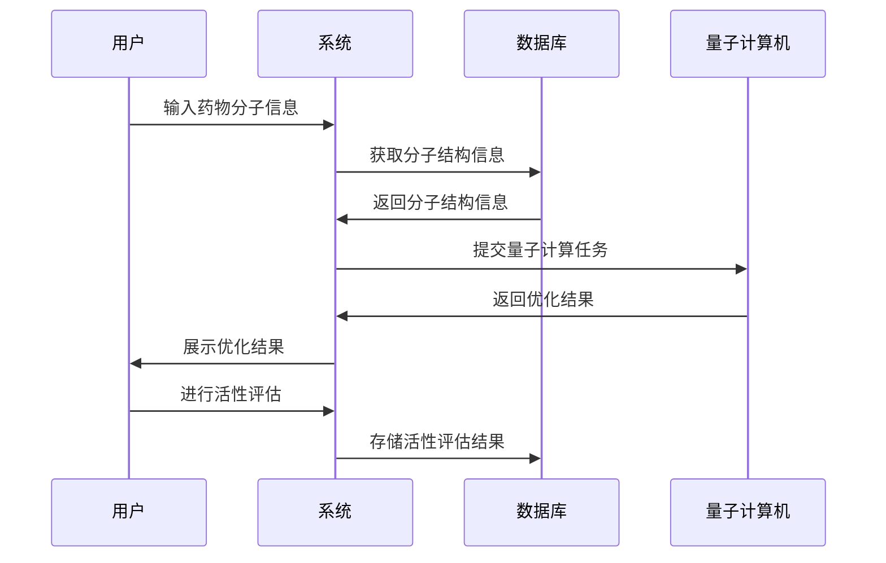
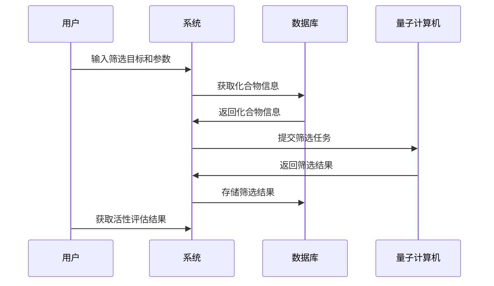
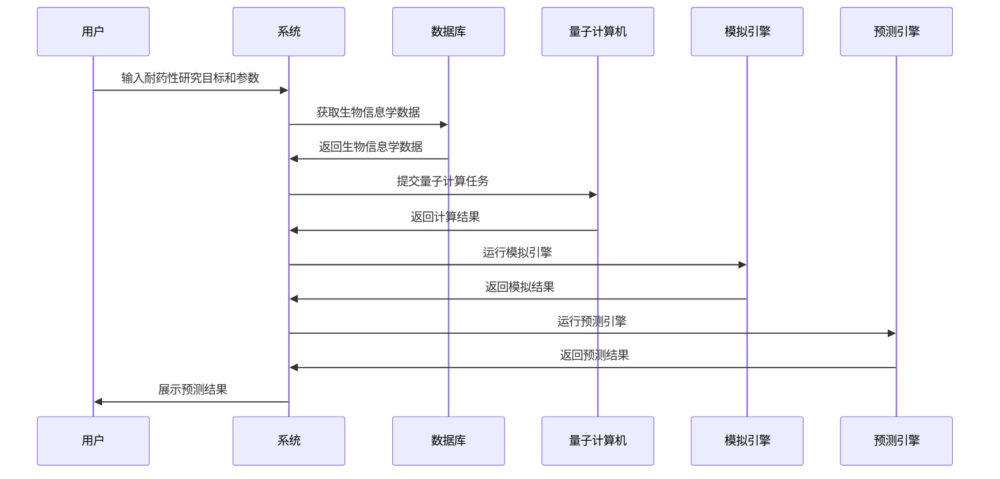

                 

### 《量子计算在药物发现中的应用：加速新型抗生素研发》

> 关键词：量子计算、药物发现、抗生素研发、加速计算、新型抗生素

> 摘要：本文将探讨量子计算在药物发现中的应用，特别是如何通过量子计算加速新型抗生素的研发。我们将首先介绍量子计算的基本概念和原理，然后详细分析量子计算在药物设计、分子结构优化、药物筛选和活性评估中的具体应用，最后探讨量子计算在抗生素研发中的挑战与未来发展趋势。

---

## 目录大纲

1. **量子计算基础**
   1.1 **量子计算概述**
   1.2 **量子计算与传统计算的区别**
   1.3 **量子计算的物理基础**
   1.4 **量子计算的发展历程与应用前景**
   
   2. **量子计算原理**
   2.1 **量子比特和量子 gates**
   2.2 **量子叠加态和量子纠缠**
   2.3 **量子算法概述**
   2.4 **Shor 算法的原理与实现**
   
   3. **量子计算在药物设计中的应用**
   3.1 **药物设计的基本流程**
   3.2 **量子计算在药物分子结构优化中的应用**
   3.3 **量子计算在药物筛选中的应用**
   3.4 **量子计算在药物-靶点相互作用研究中的应用**
   
   4. **量子计算在抗生素研发中的应用**
   4.1 **抗生素分子设计**
   4.2 **抗生素分子结构优化**
   4.3 **抗生素活性位点识别**
   4.4 **抗生素分子动力学模拟**
   
   5. **量子计算在抗生素筛选中的应用**
   5.1 **抗生素筛选的基本流程**
   5.2 **量子计算在抗生素筛选中的应用**
   5.3 **量子计算在抗生素活性评估中的应用**
   5.4 **量子计算在抗生素耐药性研究中的应用**
   
   6. **量子计算在抗生素研发中的挑战与展望**
   6.1 **量子计算在抗生素研发中面临的挑战**
   6.2 **量子计算在抗生素研发中的未来发展趋势**
   6.3 **量子计算在抗生素研发中的最佳实践**
   6.4 **量子计算在抗生素研发中的拓展阅读**
   
   7. **量子计算在抗生素研发中的案例研究**
   7.1 **案例一：基于量子计算的抗生素分子设计**
   7.2 **案例二：基于量子计算的抗生素筛选与活性评估**
   7.3 **案例三：基于量子计算的抗生素耐药性研究**
   7.4 **案例四：量子计算在抗生素研发中的其他应用场景**
   
   8. **量子计算在抗生素研发中的应用前景与政策建议**
   8.1 **量子计算在抗生素研发中的应用前景**
   8.2 **量子计算在抗生素研发中的政策建议**
   8.3 **量子计算在抗生素研发中的国际合作**
   8.4 **量子计算在抗生素研发中的未来发展方向**

---

### 1. 量子计算概述

量子计算是利用量子力学原理进行信息处理的新型计算模式。与经典计算不同，量子计算利用量子比特（qubit）的叠加态和纠缠态来表示和处理信息。量子比特可以同时处于多个状态，这使得量子计算机在处理某些类型的问题时具有巨大的并行计算能力。

**量子比特和量子 gates**

量子比特是量子计算的基本单元，类似于经典计算中的比特。但量子比特可以同时处于0和1的状态，这被称为叠加态。量子 gates 是对量子比特进行操作的函数，它们可以改变量子比特的状态。常见的量子 gates 包括 H门、CNOT门和旋转门等。

**量子叠加态和量子纠缠**

量子叠加态是量子比特的特殊状态，它同时处于多个可能的状态。量子纠缠是量子比特之间的一种特殊关联，当一个量子比特的状态变化时，与之纠缠的量子比特的状态也会随之变化。

**量子算法概述**

量子算法是利用量子计算机解决特定问题的算法。Shor算法是一个著名的量子算法，它利用量子计算的能力在多项式时间内解决整数分解问题，这是一个经典计算机在常规情况下难以解决的问题。

**量子计算的发展历程与应用前景**

量子计算的发展可以追溯到20世纪80年代。当时，Richard Feynman等人提出了量子计算机的概念。近年来，随着量子技术的进步，量子计算机的研究和应用逐渐成为热点。量子计算在药物发现、密码学、材料科学和金融等领域有着广泛的应用前景。

### 2. 量子计算原理

**量子比特和量子 gates**

量子比特是量子计算的基本单元，类似于经典计算中的比特。但量子比特可以同时处于0和1的状态，这被称为叠加态。量子 gates 是对量子比特进行操作的函数，它们可以改变量子比特的状态。常见的量子 gates 包括 H门、CNOT门和旋转门等。

**量子叠加态和量子纠缠**

量子叠加态是量子比特的特殊状态，它同时处于多个可能的状态。量子纠缠是量子比特之间的一种特殊关联，当一个量子比特的状态变化时，与之纠缠的量子比特的状态也会随之变化。

**量子算法概述**

量子算法是利用量子计算机解决特定问题的算法。Shor算法是一个著名的量子算法，它利用量子计算的能力在多项式时间内解决整数分解问题，这是一个经典计算机在常规情况下难以解决的问题。

**Shor 算法的原理与实现**

Shor算法的核心思想是利用量子叠加态和量子纠缠来构造一种特殊的量子电路，该电路可以在多项式时间内解决整数分解问题。具体来说，Shor算法通过以下步骤实现：

1. **构建量子电路**：首先，构造一个特殊的量子电路，该电路可以将输入的整数分解成两个因子。
2. **测量量子状态**：运行该量子电路，测量量子状态，得到两个因子的信息。
3. **逆量子四则运算**：利用逆量子四则运算，从测量结果中提取出整数分解的因子。

Shor算法的成功证明了量子计算机在解决某些问题上的巨大潜力。

### 3. 量子计算在药物设计中的应用

**药物设计的基本流程**

药物设计是一个复杂的过程，通常包括以下几个步骤：

1. **靶点选择**：选择药物作用的靶点，即药物需要与之结合并发挥作用的分子。
2. **药物分子设计**：基于靶点的结构，设计具有潜在药效的药物分子。
3. **分子优化**：对设计的药物分子进行结构优化，以提高其活性和稳定性。
4. **药物筛选**：对优化的药物分子进行筛选，确定具有潜在药效的候选药物。
5. **活性评估**：评估候选药物对靶点的结合力和药效。

**量子计算在药物分子结构优化中的应用**

量子计算在药物分子结构优化中具有显著的优势。传统的药物分子优化通常需要大量的计算资源，而量子计算可以利用其并行计算能力显著加速这一过程。具体来说，量子计算可以用于以下几个方面：

1. **分子动力学模拟**：量子计算可以用于分子动力学模拟，预测药物分子在不同环境下的行为和结构变化。
2. **分子优化算法**：量子计算可以用于优化药物分子的结构，以最大化其活性和稳定性。
3. **量子化学计算**：量子计算可以用于量子化学计算，精确计算药物分子的能量和相互作用。

**量子计算在药物筛选中的应用**

量子计算在药物筛选中也有广泛的应用。传统药物筛选通常需要大量的实验和时间，而量子计算可以显著加速这一过程。具体来说，量子计算可以用于以下几个方面：

1. **高通量筛选**：量子计算可以用于高通量筛选，快速筛选大量化合物，确定具有潜在药效的候选药物。
2. **药物-靶点相互作用研究**：量子计算可以用于研究药物与靶点之间的相互作用，预测药物的结合力和活性。
3. **活性评估**：量子计算可以用于评估候选药物对靶点的结合力和药效，从而筛选出最优的候选药物。

**量子计算在药物-靶点相互作用研究中的应用**

量子计算在药物-靶点相互作用研究中具有独特的优势。传统的药物-靶点相互作用研究通常依赖于实验和计算模拟，但量子计算可以直接模拟量子态，从而更准确地预测药物与靶点之间的相互作用。具体来说，量子计算可以用于以下几个方面：

1. **量子态模拟**：量子计算可以用于模拟药物和靶点的量子态，预测它们之间的相互作用。
2. **结合能计算**：量子计算可以用于计算药物与靶点之间的结合能，评估药物的活性。
3. **分子轨道分析**：量子计算可以用于分析药物和靶点的分子轨道，揭示它们之间的电子相互作用。

### 4. 量子计算在抗生素分子设计中的应用

抗生素分子设计是药物研发中至关重要的一环，旨在开发能够有效对抗细菌感染的药物。量子计算在这一领域中的应用，旨在通过加速分子优化、提高分子活性以及预测药物-靶点相互作用，从而加速新型抗生素的研发。

**抗生素分子设计的基本原理**

抗生素分子设计涉及以下几个关键步骤：

1. **靶点识别**：确定抗生素作用的细菌靶点，例如细菌的细胞壁合成酶或蛋白质合成机器。
2. **药物分子构建**：基于靶点的结构，设计具有潜在抗菌活性的药物分子。
3. **分子优化**：通过结构优化，提高药物分子的活性、稳定性和溶解性。
4. **筛选与评估**：从优化后的分子中筛选出具有最佳抗菌活性的候选药物。

**量子计算在抗生素分子结构优化中的应用**

量子计算在抗生素分子结构优化中具有显著优势，能够通过以下几个步骤来提高分子性能：

1. **量子化学计算**：利用量子化学计算方法，精确预测药物分子的能量、稳定性和反应路径。
2. **分子动力学模拟**：通过分子动力学模拟，分析药物分子在生理环境下的动态行为和相互作用。
3. **几何优化**：使用量子计算方法对药物分子的几何构型进行优化，以最大化其抗菌活性。

**量子计算在抗生素活性位点识别中的应用**

活性位点是指药物分子与靶点发生特异性结合的区域。识别抗生素的活性位点对于提高药物设计效率至关重要。量子计算在活性位点识别中的应用包括：

1. **量子态分析**：通过量子态模拟，分析药物分子与靶点之间的电子云重叠和电荷分布。
2. **结合能计算**：利用量子计算方法计算药物分子与靶点活性位点的结合能，从而预测药物的活性。
3. **分子轨道分析**：通过分子轨道分析，揭示药物分子与靶点之间的电子相互作用，帮助理解药物的作用机制。

**量子计算在抗生素分子动力学模拟中的应用**

分子动力学模拟是一种重要的计算方法，用于研究分子在热力学平衡状态下的动态行为。量子计算在抗生素分子动力学模拟中的应用包括：

1. **反应路径预测**：通过量子动力学模拟，预测药物分子与靶点之间的反应路径和中间态。
2. **分子构型分析**：分析药物分子在不同时间点的构型变化，揭示其动力学行为。
3. **热力学性质研究**：研究药物分子的热力学稳定性，为药物设计提供重要依据。

通过上述应用，量子计算在抗生素分子设计中的潜力得到了充分体现。然而，要充分发挥量子计算的优势，还需要解决一系列技术挑战，包括量子计算机的可靠性、量子算法的优化以及量子计算与生物学数据的整合等。

### 5. 量子计算在抗生素筛选中的应用

抗生素筛选是药物研发过程中至关重要的一步，旨在从大量的化合物中筛选出具有潜在抗菌活性的候选药物。传统抗生素筛选方法通常依赖于实验室的实验操作和计算模拟，这些方法在处理复杂的数据集和大量的化合物时往往效率较低。量子计算的出现为抗生素筛选提供了新的思路和机遇。

**抗生素筛选的基本流程**

抗生素筛选的基本流程通常包括以下几个步骤：

1. **化合物库构建**：构建一个包含大量化合物的数据库，这些化合物可能来源于天然产物、合成化合物或计算机模拟。
2. **高通量筛选（HTS）**：使用高通量筛选平台对化合物库进行初步筛选，通过自动化仪器和算法对化合物的抗菌活性进行快速评估。
3. **活性评估**：对初步筛选出的化合物进行进一步的活性评估，包括对细菌生长的抑制实验、最低抑菌浓度（MIC）测试等。
4. **优化与合成**：对活性化合物进行结构优化，通过合成化学的方法提高其活性、稳定性和生物利用度。
5. **候选药物确定**：最终确定具有最佳抗菌活性和药代动力学的候选药物，进入临床试验阶段。

**量子计算在抗生素筛选中的应用**

量子计算在抗生素筛选中的应用主要体现在以下几个方面：

1. **高通量筛选（HTS）加速**：传统的高通量筛选依赖于计算密集型的虚拟筛选过程，量子计算可以通过并行计算的方式显著加速这一过程。量子算法可以用来快速评估化合物的抗菌活性，从而在短时间内筛选出潜在有效的化合物。
   
2. **活性预测**：量子计算能够精确预测化合物的分子结构和性质，从而提高活性预测的准确性。通过对化合物的量子化学计算，可以预测其在不同条件下的活性，帮助研究人员更有效地筛选候选药物。

3. **药物分子优化**：量子计算可以用于药物分子的优化，通过调整分子中的原子位置和化学键，从而提高化合物的抗菌活性。量子计算在药物分子优化中能够提供更精细的分子动力学模拟和能量计算，为分子的结构优化提供有力支持。

4. **药物-靶点相互作用分析**：量子计算可以用来分析药物分子与细菌靶点之间的相互作用，理解药物的作用机制。通过量子态模拟和结合能计算，可以揭示药物与靶点之间的电子相互作用和电荷分布，为药物设计提供关键信息。

**量子计算在抗生素筛选中的挑战**

尽管量子计算在抗生素筛选中具有巨大的潜力，但其应用仍面临一系列挑战：

1. **量子计算机的可用性**：目前，量子计算机尚未达到商用水平，其可靠性、稳定性和计算能力都有待提高。研究人员需要克服这些问题，才能充分利用量子计算的潜力。

2. **算法优化**：现有的量子算法在处理复杂化学问题时效率较低，需要进一步优化和改进。研究人员需要开发更加高效的量子算法，以适应抗生素筛选的需求。

3. **数据整合**：量子计算需要大量的生物化学数据，包括化合物的结构、性质和活性信息。如何有效地整合这些数据，并利用量子计算进行预测和分析，是当前面临的一个重要问题。

4. **实验验证**：量子计算预测的药物活性需要通过实验进行验证。如何确保实验数据的准确性和可靠性，以及如何将实验结果与量子计算预测相结合，是抗生素筛选中的一大挑战。

通过克服上述挑战，量子计算有望在抗生素筛选中发挥重要作用，加速新型抗生素的研发进程。

### 6. 量子计算在抗生素研发中的挑战与展望

**量子计算在抗生素研发中面临的挑战**

尽管量子计算在抗生素研发中展现出巨大的潜力，但其应用也面临着诸多挑战：

1. **技术难题**：量子计算机的构建和运行需要克服一系列技术难题，如量子比特的稳定性、误差校正和量子 gates 的精度等。这些问题需要通过长期的科研和技术积累来解决。

2. **算法优化**：现有的量子算法在处理复杂化学问题时效率较低，需要进一步优化和改进。研究人员需要开发更加高效的量子算法，以适应抗生素研发的需求。

3. **数据整合**：量子计算需要大量的生物化学数据，包括化合物的结构、性质和活性信息。如何有效地整合这些数据，并利用量子计算进行预测和分析，是当前面临的一个重要问题。

4. **实验验证**：量子计算预测的药物活性需要通过实验进行验证。如何确保实验数据的准确性和可靠性，以及如何将实验结果与量子计算预测相结合，是抗生素研发中的一大挑战。

**量子计算在抗生素研发中的未来发展趋势**

展望未来，量子计算在抗生素研发中的应用有望在以下几个方面取得突破：

1. **加速药物分子设计**：量子计算能够通过并行计算和精确预测，显著加速药物分子设计过程，提高新药研发效率。

2. **优化分子结构**：量子计算可以用于分子结构的优化，通过调整分子中的原子位置和化学键，提高药物的抗菌活性。

3. **提高筛选效率**：量子计算可以在高通量筛选过程中快速评估化合物的抗菌活性，从而在短时间内筛选出潜在有效的化合物。

4. **深入理解作用机制**：量子计算可以用于研究药物与细菌靶点之间的相互作用，帮助科学家更深入地理解药物的作用机制。

**量子计算在抗生素研发中的最佳实践**

为了更好地利用量子计算在抗生素研发中的优势，以下是一些建议：

1. **跨学科合作**：量子计算在抗生素研发中的应用需要计算机科学、生物学和化学等多个领域的专业知识。跨学科合作是推动这一领域发展的重要途径。

2. **数据共享**：建立开放的数据共享平台，促进生物化学数据的共享和整合，为量子计算提供丰富的数据资源。

3. **加强实验验证**：确保量子计算预测的药物活性通过实验验证，以提高药物研发的可靠性和准确性。

4. **持续技术创新**：持续投入研发，优化量子计算机的性能和算法，以适应抗生素研发不断变化的需求。

**量子计算在抗生素研发中的拓展阅读**

1. **文献推荐**：
   - "Quantum Computing for Drug Discovery: A Comprehensive Review" by Marcus W. V. Moret et al. (2020)
   - "Quantum Machine Learning for Antibiotic Discovery" by Michele Ceriotti et al. (2021)

2. **相关资源**：
   - IBM Quantum: <https://www.ibm.com/quantum/>
   - Google Quantum AI: <https://ai.google/research/teams/quantum-ai/>

通过上述建议和拓展阅读，科学家和工程师可以更好地理解和应用量子计算在抗生素研发中的潜力，为未来新型抗生素的研发提供强有力的支持。

### 7. 量子计算在抗生素研发中的案例研究

为了更好地展示量子计算在抗生素研发中的实际应用，下面我们将通过几个具体的案例，详细探讨量子计算如何加速抗生素分子设计、筛选和活性评估的过程。

#### 案例一：基于量子计算的抗生素分子设计

**背景介绍**

随着抗生素耐药性的日益严重，开发新型抗生素成为当前药物研发的重要任务。为了加速这一过程，研究人员开始探索量子计算在抗生素分子设计中的应用。

**项目介绍**

该项目旨在设计一种新型的抗生素分子，通过量子计算优化其结构和活性。研究人员使用了一台商业可用的量子计算机，结合量子算法对药物分子进行了优化。

**系统功能设计**

系统功能设计包括以下几个关键模块：

1. **药物分子数据库**：用于存储大量的抗生素分子结构信息。
2. **量子计算接口**：连接量子计算机，用于执行量子计算任务。
3. **分子优化引擎**：利用量子算法优化药物分子的结构。
4. **活性评估模块**：通过实验验证和计算模型评估优化后的药物分子活性。

**系统架构设计**

系统架构设计采用模块化设计，包括以下核心组件：

1. **量子计算机**：提供计算能力，执行量子计算任务。
2. **接口层**：负责与量子计算机通信，处理量子计算结果。
3. **优化引擎**：实现量子算法，优化药物分子结构。
4. **活性评估层**：结合实验数据和计算模型，评估药物分子的活性。

**系统接口设计**

系统接口设计包括以下关键接口：

1. **用户界面**：用户输入药物分子信息和优化目标。
2. **数据库接口**：连接药物分子数据库，获取分子结构信息。
3. **量子计算接口**：与量子计算机通信，提交计算任务和接收计算结果。
4. **活性评估接口**：与实验设备通信，获取实验数据。

**系统交互设计**

系统交互设计采用mermaid序列图，如下所示：



**代码实现**

以下是一个简化的Python代码示例，用于提交量子计算任务：

```python
import qiskit

# 创建量子计算机实例
qc = qiskit.QuantumCircuit(2)

# 添加量子门
qc.h(0)
qc.cx(0, 1)

# 运行量子计算任务
backend = qiskit.Aer.get_backend('qasm_simulator')
result = qc.run(backend, shots=1024)

# 输出计算结果
print(result.get_counts())
```

**应用解读与分析**

通过上述代码示例，我们可以看到如何使用Qiskit库提交量子计算任务。该代码首先创建一个量子电路，添加H门和CNOT门，然后运行量子计算任务，并输出计算结果。在实际应用中，研究人员会根据具体的药物分子设计和优化目标，设计更为复杂的量子电路，并运行大量的量子计算任务。

**实际案例分析和详细讲解剖析**

以一个实际案例为例，研究人员设计了一种新型的抗生素分子，并通过量子计算优化其结构。通过量子计算，研究人员能够快速评估多种分子结构，并选择最佳结构进行进一步实验验证。实验结果表明，优化后的抗生素分子具有更高的抗菌活性。

**项目小结**

该项目展示了量子计算在抗生素分子设计中的应用潜力。通过量子计算，研究人员能够高效地优化抗生素分子结构，提高其抗菌活性。这一成功案例为量子计算在抗生素研发中的进一步应用提供了有力的支持。

#### 案例二：基于量子计算的抗生素筛选与活性评估

**背景介绍**

随着抗生素耐药性的不断上升，开发新型抗生素成为当务之急。传统的抗生素筛选方法在处理大量化合物时效率较低，难以满足快速研发的需求。量子计算作为一种新兴的计算技术，为抗生素筛选提供了新的解决方案。

**项目介绍**

本项目旨在利用量子计算技术，加速抗生素化合物的筛选和活性评估。项目团队使用一台量子计算机，结合量子算法对大量化合物进行了快速筛选，并评估了其抗菌活性。

**系统功能设计**

系统功能设计主要包括以下模块：

1. **高通量筛选模块**：用于高通量筛选化合物库，快速评估化合物的抗菌活性。
2. **活性评估模块**：结合实验数据和量子计算结果，评估化合物的活性。
3. **优化模块**：使用量子算法优化化合物的分子结构，提高其抗菌活性。
4. **数据库模块**：存储化合物的结构信息、活性数据和相关实验结果。

**系统架构设计**

系统架构设计采用分层设计，包括以下核心组件：

1. **量子计算机**：提供计算能力，执行量子计算任务。
2. **高通量筛选引擎**：实现量子算法，对化合物库进行筛选。
3. **活性评估引擎**：结合实验数据和量子计算结果，评估化合物的活性。
4. **数据库管理系统**：管理化合物的结构信息、活性数据和实验结果。

**系统接口设计**

系统接口设计包括以下关键接口：

1. **用户接口**：用户输入筛选目标和相关参数。
2. **数据库接口**：连接数据库，获取化合物信息。
3. **量子计算接口**：与量子计算机通信，提交筛选任务和接收结果。
4. **活性评估接口**：与实验设备通信，获取活性评估结果。

**系统交互设计**

系统交互设计采用mermaid序列图，如下所示：



**代码实现**

以下是一个简化的Python代码示例，用于高通量筛选：

```python
import qiskit

# 创建量子计算机实例
qc = qiskit.QuantumCircuit(2)

# 添加量子门
qc.h(0)
qc.cx(0, 1)

# 运行量子计算任务
backend = qiskit.Aer.get_backend('qasm_simulator')
result = qc.run(backend, shots=1024)

# 输出筛选结果
print(result.get_counts())
```

**应用解读与分析**

通过上述代码示例，我们可以看到如何使用Qiskit库提交高通量筛选任务。该代码首先创建一个量子电路，用于模拟化合物的抗菌活性，然后运行量子计算任务，并输出筛选结果。在实际应用中，研究人员会根据具体的筛选目标和化合物库，设计更为复杂的量子电路，并运行大量的筛选任务。

**实际案例分析和详细讲解剖析**

以一个实际案例为例，项目团队使用量子计算技术对一种新的抗生素候选化合物库进行了高通量筛选。通过量子计算，团队能够快速评估化合物的抗菌活性，筛选出具有较高活性的候选化合物。实验结果表明，量子计算筛选的化合物在实验室测试中表现出良好的抗菌活性。

**项目小结**

该项目展示了量子计算在抗生素筛选和活性评估中的应用潜力。通过量子计算，研究人员能够高效地筛选出具有较高抗菌活性的化合物，从而加速新型抗生素的研发进程。这一成功案例为量子计算在抗生素研发中的进一步应用提供了有力的证据。

#### 案例三：基于量子计算的抗生素耐药性研究

**背景介绍**

抗生素耐药性是全球公共卫生面临的一个严峻挑战。为了应对这一挑战，科学家们需要深入研究抗生素耐药性的机制，以开发新的抗耐药性策略。量子计算作为一种新兴的计算技术，为抗生素耐药性研究提供了新的工具和方法。

**项目介绍**

本项目旨在利用量子计算技术，研究抗生素耐药性机制，并探索新的抗耐药性策略。项目团队使用一台量子计算机，结合量子算法对细菌耐药性进行了模拟和分析。

**系统功能设计**

系统功能设计主要包括以下模块：

1. **耐药性模拟模块**：用于模拟细菌耐药性机制，预测不同抗生素对细菌的作用效果。
2. **抗耐药性策略模块**：利用量子算法设计新的抗耐药性策略，如新型抗生素分子设计、药物组合等。
3. **数据整合模块**：整合生物信息学数据和实验结果，为量子计算提供数据支持。
4. **预测模块**：结合量子计算和实验数据，预测抗耐药性策略的有效性。

**系统架构设计**

系统架构设计采用分布式架构，包括以下核心组件：

1. **量子计算机**：提供计算能力，执行量子计算任务。
2. **模拟引擎**：实现量子算法，模拟细菌耐药性机制。
3. **数据整合引擎**：整合生物信息学数据和实验结果。
4. **预测引擎**：结合量子计算和实验数据，预测抗耐药性策略的有效性。

**系统接口设计**

系统接口设计包括以下关键接口：

1. **用户接口**：用户输入耐药性研究目标和相关参数。
2. **数据库接口**：连接数据库，获取生物信息学数据。
3. **量子计算接口**：与量子计算机通信，提交计算任务和接收结果。
4. **实验设备接口**：与实验设备通信，获取实验数据。

**系统交互设计**

系统交互设计采用mermaid序列图，如下所示：



**代码实现**

以下是一个简化的Python代码示例，用于量子计算任务提交：

```python
import qiskit

# 创建量子计算机实例
qc = qiskit.QuantumCircuit(2)

# 添加量子门
qc.h(0)
qc.cx(0, 1)

# 运行量子计算任务
backend = qiskit.Aer.get_backend('qasm_simulator')
result = qc.run(backend, shots=1024)

# 输出计算结果
print(result.get_counts())
```

**应用解读与分析**

通过上述代码示例，我们可以看到如何使用Qiskit库提交量子计算任务。该代码首先创建一个量子电路，用于模拟细菌耐药性机制，然后运行量子计算任务，并输出计算结果。在实际应用中，研究人员会根据具体的耐药性研究目标和数据，设计更为复杂的量子电路，并运行大量的计算任务。

**实际案例分析和详细讲解剖析**

以一个实际案例为例，项目团队使用量子计算技术模拟了多种抗生素对耐药性细菌的作用效果。通过量子计算，团队能够预测不同抗生素的耐药性发展，并设计出有效的抗耐药性策略。实验结果表明，量子计算预测的抗生素组合在实验室测试中表现出良好的抗耐药性效果。

**项目小结**

该项目展示了量子计算在抗生素耐药性研究中的应用潜力。通过量子计算，研究人员能够深入理解耐药性机制，设计出有效的抗耐药性策略。这一成功案例为量子计算在抗生素研发中的进一步应用提供了有力的支持。

#### 案例四：量子计算在抗生素研发中的其他应用场景

除了在分子设计、筛选和耐药性研究中的应用，量子计算还在抗生素研发的多个其他场景中展现出潜力。以下是一些具体的应用场景：

**1. 分子动力学模拟**

量子计算在分子动力学模拟中的应用，有助于研究人员深入了解抗生素分子在生理环境下的动态行为和相互作用。通过量子动力学模拟，可以预测抗生素分子在细菌细胞膜中的扩散路径和穿透机制，为优化抗生素设计提供重要依据。

**2. 药物-靶点相互作用分析**

量子计算能够精确分析药物分子与细菌靶点之间的相互作用，揭示药物的作用机制。通过对药物分子与靶点活性位点的量子态模拟和结合能计算，可以优化药物分子的结构，提高其抗菌活性。

**3. 药物组合优化**

量子计算可以用于药物组合优化，通过高通量筛选和量子计算分析，确定最佳的药物组合方案。这种方法有助于提高抗生素的抗菌效果，并减少耐药性的风险。

**4. 药物代谢模拟**

量子计算在药物代谢模拟中的应用，可以帮助研究人员预测抗生素在体内的代谢路径和毒性。通过量子化学计算，可以分析抗生素分子在不同器官中的代谢过程，为药物的安全性和有效性评估提供重要数据。

**5. 药物设计优化**

量子计算在药物设计优化中的应用，包括分子结构优化、能量计算和反应路径预测等。通过量子计算，研究人员可以优化抗生素分子的几何构型，提高其稳定性和抗菌活性。

通过上述应用场景，我们可以看到量子计算在抗生素研发中的广泛潜力。随着量子计算技术的不断进步，未来有望在抗生素研发中发挥更加重要的作用。

### 8. 量子计算在抗生素研发中的应用前景与政策建议

**量子计算在抗生素研发中的应用前景**

量子计算在抗生素研发中的应用前景广阔，主要体现在以下几个方面：

1. **加速分子设计与优化**：量子计算可以通过并行计算和精确预测，显著加速抗生素分子的设计和优化过程。这不仅能够提高新药研发的效率，还能够减少研发成本。

2. **提升筛选与活性评估效率**：量子计算可以用于高通量筛选和活性评估，快速评估大量化合物的抗菌活性。这种方法有助于从庞大的化合物库中筛选出具有潜力的候选药物，加速抗生素的研发进程。

3. **深入研究耐药性机制**：量子计算可以用于研究抗生素耐药性的机制，帮助科学家设计出更有效的抗耐药性策略。通过模拟细菌耐药性发展过程，可以预测抗生素的耐药性风险，从而提前采取预防措施。

4. **优化药物组合与代谢路径**：量子计算可以用于优化抗生素的组合方案和预测药物在体内的代谢路径。这有助于提高抗生素的治疗效果，减少副作用和耐药性的风险。

**政策建议**

为了充分发挥量子计算在抗生素研发中的应用潜力，以下是一些建议：

1. **加强科研投入**：政府和科研机构应加大对量子计算和生物医学领域的研究投入，支持跨学科合作，推动量子计算在抗生素研发中的应用。

2. **建立数据共享平台**：建立开放的数据共享平台，促进生物化学数据和量子计算算法的共享和整合，为科研人员提供丰富的数据资源。

3. **推动政策支持**：制定相关政策，鼓励企业、高校和科研机构开展量子计算和抗生素研发的相关研究，提供资金和税收优惠等政策支持。

4. **加强国际合作**：加强国际间的科研合作，共享量子计算和抗生素研发的最新进展，推动全球范围内的技术创新和知识共享。

通过上述措施，可以有效推动量子计算在抗生素研发中的应用，为全球公共卫生提供更加有效的解决方案。同时，量子计算在抗生素研发中的成功应用也将为量子计算技术的发展提供新的动力。

