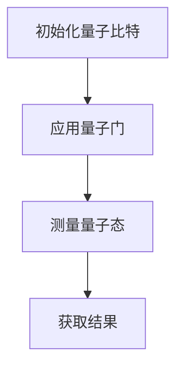
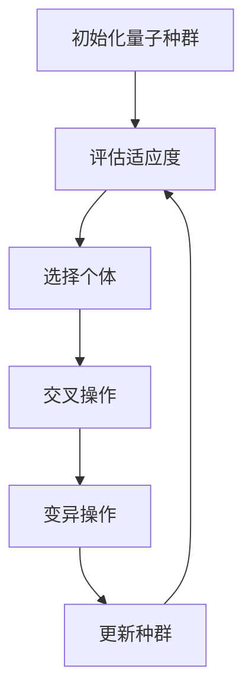
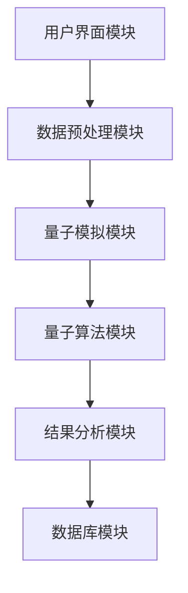

                 

### 背景介绍

#### 量子计算概述

量子计算是一种基于量子力学原理的计算机体系，与传统的经典计算有着本质的不同。量子计算机的核心组件是量子比特（qubit），它们可以同时处于0和1的叠加态，这使得量子计算机在处理某些问题上具有潜在的巨大计算能力。量子计算的基本原理包括量子叠加、量子纠缠和量子门等，这些原理使得量子计算机能够进行并行计算，从而在某些复杂问题上的计算效率远超传统计算机。

量子计算的起源可以追溯到20世纪40年代，当时物理学家保罗·狄拉克和理查德·费曼等人提出了量子力学的基本概念。然而，量子计算机的实际实现是一个相对较新的领域，直到20世纪90年代，随着量子算法的发展，人们才开始认真考虑构建实用的量子计算机。近年来，量子计算的研究取得了显著的进展，包括量子比特的稳定性和量子纠错技术的突破等，这为量子计算机的实用化奠定了基础。

#### 蛋白质折叠问题介绍

蛋白质折叠问题是指蛋白质在生物体中从线性多肽链折叠成具有特定三维空间结构的过程。这个过程对于蛋白质的功能至关重要，因为蛋白质的功能往往与其三维结构密切相关。蛋白质折叠问题是一个复杂的多尺度、多物理场耦合的动态过程，涉及到原子间的相互作用、能量最小化以及动态平衡等。

蛋白质折叠问题的重要性体现在多个方面。首先，它是理解生命本质的关键问题之一，因为蛋白质是生命体的基本功能单元。其次，蛋白质折叠问题在药物设计、生物工程、疾病治疗等领域具有广泛的应用前景。例如，许多疾病（如阿尔茨海默病和帕金森病）都与蛋白质折叠异常有关，因此解决蛋白质折叠问题有助于开发新的治疗手段。此外，蛋白质折叠问题也是一个极具挑战性的计算问题，传统的计算方法在处理大规模蛋白质折叠问题时常常力不从心。

#### 现状与挑战

目前，蛋白质折叠问题主要依靠分子动力学模拟和量子化学计算等方法进行研究。分子动力学模拟通过求解牛顿运动方程来模拟分子在折叠过程中的运动，但其计算成本极高，难以处理大规模系统。量子化学计算则利用量子力学原理来计算分子和原子的性质，但由于计算复杂度极高，通常只能处理小规模的系统。

近年来，随着量子计算技术的发展，一些研究者开始探索将量子计算应用于蛋白质折叠问题。例如，量子模拟算法可以在量子计算机上直接模拟分子和原子的相互作用，从而提供更准确的折叠路径。然而，量子计算在蛋白质折叠问题中的应用仍然面临许多挑战，包括量子比特的稳定性、量子纠错技术以及算法的优化等。

#### 研究意义

量子计算在蛋白质折叠问题中的应用具有重要的研究意义。首先，它有望提供更准确、更高效的蛋白质折叠路径预测方法，为生物医学领域带来革命性的变革。其次，通过解决蛋白质折叠问题，可以推动量子计算技术的进一步发展，为量子计算机的实用化提供有力支持。此外，量子计算在蛋白质折叠问题中的应用也可能带来新的计算理论和算法创新，为计算机科学领域的发展做出贡献。

总之，量子计算在蛋白质折叠问题中的应用前景广阔，但也需要克服一系列技术挑战。通过持续的研究和创新，我们有望在这个领域取得突破性的进展，为科学、医学和计算机科学等多个领域带来深远影响。

#### 关键词

- 量子计算
- 蛋白质折叠
- 量子比特
- 量子纠缠
- 量子算法
- 分子动力学模拟
- 量子化学计算

#### 摘要

本文介绍了量子计算在蛋白质折叠问题中的应用前景。首先，我们简要概述了量子计算的基本原理和现状，以及蛋白质折叠问题的定义、研究现状和重要性。接着，本文探讨了量子计算与蛋白质折叠问题之间的联系，并详细介绍了量子计算在蛋白质折叠问题中的应用现状和挑战。最后，本文提出了量子计算在蛋白质折叠问题中可能的研究方向和潜在应用，为未来的研究提供了参考。通过本文的研究，我们希望为量子计算在生物医学领域的应用奠定基础，推动量子计算技术的进一步发展。

### 核心概念与联系

#### 量子计算核心概念

量子计算的核心概念包括量子比特（qubit）、量子叠加、量子纠缠和量子门。量子比特是量子计算机的基本单位，与经典计算机中的比特不同，量子比特可以同时处于0和1的叠加态。这种叠加态使得量子计算机能够处理大量并行信息，从而在理论上具有超越经典计算机的计算能力。量子叠加可以通过数学公式表示为：

$$
\ket{\psi} = \alpha \ket{0} + \beta \ket{1}
$$

其中，$\ket{0}$和$\ket{1}$分别表示量子比特的基态，$\alpha$和$\beta$是复数，满足$|\alpha|^2 + |\beta|^2 = 1$。

量子纠缠是量子系统中的另一个重要特性，当两个或多个量子比特处于纠缠态时，它们的量子状态不能单独描述，而是需要作为一个整体来考虑。量子纠缠可以通过以下数学公式描述：

$$
\ket{\psi} = \frac{1}{\sqrt{2}} (\ket{00} + \ket{11})
$$

量子纠缠使得量子计算机能够实现经典计算机难以实现的操作，如量子态的远程传输和量子密钥分发等。

量子门是量子计算中的基本操作单元，类似于经典计算机中的逻辑门。量子门可以通过线性变换将量子比特的状态进行转换。最常见的量子门包括Pauli-X门、Pauli-Z门和Hadamard门。Pauli-X门（也称为X门或相位反转门）的作用是将量子比特的状态反转：

$$
X \ket{0} = \ket{1}, \quad X \ket{1} = \ket{0}
$$

Pauli-Z门（也称为Z门或相位旋转门）的作用是将量子比特的状态在基态和第一激发态之间进行转换：

$$
Z \ket{0} = \ket{0}, \quad Z \ket{1} = -\ket{1}
$$

Hadamard门（也称为H门或正交变换门）的作用是将量子比特的状态进行正交变换：

$$
H \ket{0} = \frac{1}{\sqrt{2}} (\ket{0} + \ket{1}), \quad H \ket{1} = \frac{1}{\sqrt{2}} (\ket{0} - \ket{1})
$$

量子门通过组合可以构成复杂的量子算法，这些算法在解决某些问题时具有潜在的优势。

#### 蛋白质折叠问题核心概念

蛋白质折叠问题中的核心概念包括蛋白质结构、蛋白质折叠过程、蛋白质动力学和能量最小化等。

蛋白质结构是指蛋白质在三维空间中的形态，包括一级结构（氨基酸序列）、二级结构（α螺旋和β折叠）和三级结构（完整的蛋白质形态）。蛋白质的三级结构对于其功能至关重要，因为功能通常与其空间形态密切相关。

蛋白质折叠过程是指蛋白质从无规则卷曲的线性多肽链折叠成具有特定三维结构的过程。这个过程中涉及多个层次的结构变化，包括局部结构、过渡态和最终折叠态。蛋白质折叠过程是一个动态平衡的过程，涉及到能量最小化和熵增减等多个因素。

蛋白质动力学是指蛋白质在折叠过程中分子的运动和变化。蛋白质的动力学性质决定了其折叠速度和稳定性，对蛋白质功能的维持和调节起到关键作用。

能量最小化是蛋白质折叠过程中的核心原则。蛋白质在折叠过程中通过降低系统的自由能来达到能量最小状态，这个过程涉及到各种能量势垒和能量路径。能量最小化可以通过以下数学模型描述：

$$
\min E = \sum_{i} \epsilon_i \cdot f_i
$$

其中，$E$是系统的总能量，$\epsilon_i$是相互作用势能，$f_i$是相关参数。

#### 蛋白质折叠问题与量子计算的联系

量子计算与蛋白质折叠问题的联系主要体现在量子模拟和量子算法的应用上。

量子模拟是一种利用量子计算机模拟量子系统的方法，可以用于研究分子和原子的相互作用。量子模拟可以加速蛋白质折叠过程的模拟，提供更准确的折叠路径预测。例如，量子模拟算法可以在量子计算机上直接模拟分子和原子的相互作用，从而提供更精确的势能面和动力学轨迹。

量子算法是量子计算机上的计算方法，可以用于解决经典计算机难以处理的复杂问题。在蛋白质折叠问题中，一些量子算法（如量子进化算法和量子模拟退火算法）可以用于优化蛋白质折叠路径和寻找能量最小状态。这些算法通过量子叠加和量子纠缠等特性，能够在高维空间中快速搜索最优解。

总之，量子计算与蛋白质折叠问题的联系为解决这一复杂问题提供了新的思路和方法。通过量子模拟和量子算法，我们有望在蛋白质折叠问题上取得重大突破，为生物医学和计算科学等领域的发展做出贡献。

### 算法原理讲解

#### 量子模拟算法

量子模拟算法是一种利用量子计算机模拟量子系统的方法，可以用于研究分子和原子的相互作用。量子模拟算法的核心思想是利用量子计算机的并行计算能力，加速对复杂系统的模拟过程。

在量子模拟算法中，量子比特被用来表示模拟系统的量子态。这些量子比特可以通过量子叠加和量子纠缠来表示系统的多体态。例如，对于N个量子比特，系统可以处于$2^N$个状态的任意叠加。

量子模拟算法通常包括以下几个步骤：

1. **初始化**：将量子比特初始化为特定的初始状态。例如，可以使用Hadamard门将所有量子比特初始化为叠加态。

2. **应用量子门**：通过应用一系列量子门来模拟系统的演化。这些量子门可以表示系统中的相互作用和演化过程。

3. **测量**：在模拟结束时，对量子比特进行测量，以获得系统的最终状态。

下面是量子模拟算法的一个具体实现：

```python
from qiskit import QuantumCircuit, Aer, execute

# 创建量子电路
qc = QuantumCircuit(5)

# 初始化量子比特为叠加态
qc.h(range(5))

# 应用量子门
qc.cx(0, 1)
qc.cx(1, 2)
qc.cx(2, 3)
qc.cx(3, 4)

# 执行量子电路
backend = Aer.get_backend('qasm_simulator')
job = execute(qc, backend, shots=1000)
result = job.result()

# 获取测量结果
counts = result.get_counts(qc)
print(counts)
```

这个示例中的量子电路使用了四个控制-非门（CX门）来模拟两个量子比特之间的相互作用。通过测量结果，我们可以得到系统的最终状态分布。

#### 量子进化算法

量子进化算法（Quantum Evolutionary Algorithm, QEA）是一种基于量子计算原理的进化算法，它可以用于优化和搜索问题。量子进化算法结合了量子计算的优势和进化算法的鲁棒性，能够在复杂的高维搜索空间中找到最优解。

量子进化算法的基本原理包括量子编码、量子选择、量子交叉和量子变异等操作。这些操作通过量子比特的叠加和纠缠来实现，从而在量子空间中搜索最优解。

量子进化算法的主要步骤如下：

1. **初始化**：初始化量子种群，每个个体由一组量子比特表示。

2. **评估**：通过量子计算评估个体的适应度。适应度函数可以表示为：

   $$
   f(x) = \sum_{i} w_i g_i(x)
   $$

   其中，$w_i$是权重，$g_i(x)$是第$i$个评价函数。

3. **选择**：根据个体的适应度，选择适应度较高的个体进行交叉和变异。

4. **交叉**：应用量子交叉操作，将两个父代个体的量子比特进行组合，生成新的子代个体。

5. **变异**：对子代个体进行量子变异操作，以增加种群的多样性。

6. **更新**：将子代个体替换父代个体，重复评估、选择、交叉和变异过程，直到满足停止条件。

下面是量子进化算法的一个具体实现：

```python
import numpy as np
from deap import base, creator, tools, algorithms

# 定义适应度函数
creator.create("FitnessMax", base.Fitness, weights=(1.0,))
creator.create("Individual", list, fitness=creator.FitnessMax)

# 初始化量子种群
toolbox = base.Toolbox()
toolbox.register("attr_bool", np.random.randint, 2)
toolbox.register("individual", tools.initRepeat, creator.Individual, toolbox.attr_bool, n=10)
toolbox.register("population", tools.initRepeat, list, toolbox.individual)

# 定义量子选择函数
def select(population, k):
    return tools.selTournament(population, k, fits=fitnesses)

# 定义量子交叉函数
def crossover(parent1, parent2):
    child1 = parent1[:]
    child2 = parent2[:]
    crossover_point = np.random.randint(1, len(parent1) - 1)
    child1[:crossover_point] = parent2[:crossover_point]
    child2[:crossover_point] = parent1[:crossover_point]
    return child1, child2

# 定义量子变异函数
def mutate(individual):
    for i in range(len(individual)):
        if np.random.random() < 0.1:
            individual[i] = 1 - individual[i]
    return individual,

# 初始化种群
population = toolbox.population(n=100)

# 评估种群
fitnesses = [creator.FitnessMax(1.0) for _ in population]
toolbox.register("evaluate", eval_1D_function)
toolbox.register("select", select, k=50)
toolbox.register("mate", crossover)
toolbox.register("mutate", mutate, indpb=0.05)
toolbox.register("evaluate", eval_1D_function)

# 运行算法
algorithms.eaSimple(population, toolbox, cxpb=0.5, mutpb=0.2, ngen=10, verbose=True)
```

这个示例中的量子进化算法用于优化一维函数$f(x) = \sum_{i} x_i^2$。通过量子选择、量子交叉和量子变异操作，算法能够搜索最优解。

#### 数学模型与公式

量子模拟算法和量子进化算法的数学模型和公式如下：

1. **量子模拟算法**：

   - **量子态初始化**：

     $$
     \ket{\psi} = \alpha_0 \ket{0} + \alpha_1 \ket{1}
     $$

   - **量子门应用**：

     $$
     \ket{\psi} \rightarrow U \ket{\psi}
     $$

     其中，$U$是量子门矩阵。

   - **量子态测量**：

     $$
     \ket{\psi} \rightarrow \ket{\phi} \text{（测量结果）}
     $$

2. **量子进化算法**：

   - **适应度评估**：

     $$
     f(x) = \sum_{i} w_i g_i(x)
     $$

   - **量子选择**：

     $$
     \text{概率分布} \ p_i = \frac{e^{\beta f_i}}{\sum_{j} e^{\beta f_j}}
     $$

   - **量子交叉**：

     $$
     \ket{\psi_1} \otimes \ket{\psi_2} \rightarrow \ket{\psi'} = \frac{1}{\sqrt{2}} (\ket{\psi_1} + \ket{\psi_2})
     $$

   - **量子变异**：

     $$
     \ket{\psi} \rightarrow \ket{\psi'} = \ket{\psi} + \delta \ket{1}
     $$

   其中，$\beta$是温度参数，$\delta$是变异参数。

通过上述数学模型和公式，我们可以理解量子模拟算法和量子进化算法的基本原理和操作过程。这些算法通过量子比特的叠加、纠缠和量子门操作，实现了高效的优化和搜索。

#### 算法流程图

为了更直观地理解量子模拟算法和量子进化算法的流程，我们可以使用mermaid绘制算法流程图。

以下是量子模拟算法的mermaid流程图：



以下是量子进化算法的mermaid流程图：



通过这些算法流程图，我们可以清晰地看到量子模拟和量子进化算法的基本步骤和操作过程。

### 数学模型和数学公式

在深入探讨量子计算在蛋白质折叠问题中的应用时，我们需要详细讲解相关的数学模型和公式。这些模型和公式为我们理解量子算法如何解决蛋白质折叠问题提供了理论基础。

#### 量子模拟的数学模型

量子模拟算法的核心是模拟分子和原子的量子态，以研究它们在相互作用下的演化。以下是量子模拟算法的数学模型：

1. **量子态表示**：

   在量子计算中，分子的量子态可以用量子比特的叠加态来表示。设分子中有N个原子，每个原子可以用若干量子比特表示。分子的总量子态可以表示为：

   $$
   \ket{\Psi} = \sum_{i_1, i_2, ..., i_N} c_{i_1, i_2, ..., i_N} \ket{i_1, i_2, ..., i_N}
   $$

   其中，$c_{i_1, i_2, ..., i_N}$是复合态的系数，$\ket{i_1, i_2, ..., i_N}$是每个原子的量子态。

2. **哈密顿量表示**：

   分子的量子态演化由哈密顿量（Hamiltonian）描述。分子的哈密顿量通常由动能项、势能项和相互作用项组成。其形式为：

   $$
   H = \sum_{i} \frac{p_i^2}{2m_i} + V(\mathbf{r}_i) + \sum_{i < j} U(\mathbf{r}_i, \mathbf{r}_j)
   $$

   其中，$p_i$是第i个原子的动量，$m_i$是第i个原子的质量，$V(\mathbf{r}_i)$是原子内部的势能，$U(\mathbf{r}_i, \mathbf{r}_j)$是原子间的相互作用势能。

3. **薛定谔方程**：

   分子量子态的演化遵循薛定谔方程：

   $$
   i\hbar \frac{\partial \ket{\Psi}}{\partial t} = H \ket{\Psi}
   $$

   通过求解薛定谔方程，我们可以得到分子在特定相互作用下的量子态。

#### 量子进化算法的数学模型

量子进化算法是一种基于量子计算原理的优化算法，用于搜索蛋白质折叠问题的最优解。以下是量子进化算法的数学模型：

1. **量子编码**：

   在量子进化算法中，个体的编码通常使用量子比特表示。每个量子比特的状态可以表示为0或1，通过量子叠加和纠缠，我们可以表示复杂的多维空间中的个体。

   $$
   \ket{\chi} = \sum_{i} \alpha_i \ket{i}
   $$

   其中，$\alpha_i$是量子比特的系数，$\ket{i}$是第i个量子比特的状态。

2. **适应度评估**：

   适应度函数（Fitness Function）用于评估个体的优劣。在蛋白质折叠问题中，适应度函数可以表示为：

   $$
   f(\chi) = \sum_{i} w_i g_i(\chi)
   $$

   其中，$w_i$是权重系数，$g_i(\chi)$是第i个评价函数。评价函数可以包括蛋白质结构的稳定性、能量最小化等。

3. **量子选择**：

   在量子进化算法中，个体通过量子选择过程被选择用于生成下一代个体。选择过程通常基于量子态的叠加和测量，适应度高的个体在测量时被选中。

   $$
   p_i = \frac{|\alpha_i|^2}{Z}
   $$

   其中，$p_i$是第i个个体被选中的概率，$Z$是归一化常数。

4. **量子交叉和变异**：

   量子交叉和变异操作用于生成新的个体。交叉操作通过量子态的叠加和纠缠实现，变异操作通过量子比特状态的翻转实现。

   交叉操作：

   $$
   \ket{\chi'} = \frac{1}{\sqrt{2}} (\ket{\chi_1} + \ket{\chi_2})
   $$

   变异操作：

   $$
   \ket{\chi'} = \ket{\chi} + \delta \ket{1}
   $$

   其中，$\delta$是变异概率。

#### 数学公式示例

以下是几个关键的数学公式，用于描述量子计算在蛋白质折叠问题中的应用：

1. **量子态的叠加和测量**：

   $$
   \ket{\psi} = \alpha \ket{0} + \beta \ket{1}
   $$

   $$
   \bra{\psi} \ket{\psi} = |\alpha|^2 + |\beta|^2
   $$

2. **量子态的演化**：

   $$
   \ket{\Psi}(t) = e^{-iHt/\hbar} \ket{\Psi}(0)
   $$

3. **适应度函数**：

   $$
   f(\chi) = \sum_{i} w_i g_i(\chi)
   $$

4. **量子选择概率**：

   $$
   p_i = \frac{|\alpha_i|^2}{Z}
   $$

通过上述数学模型和公式，我们可以看到量子计算在蛋白质折叠问题中的应用是如何建立起来的。这些公式和模型为我们提供了理解量子算法工作原理和解决蛋白质折叠问题的理论基础。

#### 详细讲解与举例

为了更好地理解量子计算在蛋白质折叠问题中的应用，我们将通过一个具体的例子进行详细讲解。

假设我们有一个由两个原子组成的简单分子，其量子态可以用两个量子比特表示。我们希望使用量子模拟算法来模拟这个分子的折叠过程，并找到能量最小化的折叠状态。

1. **量子态初始化**：

   首先，我们初始化两个量子比特为叠加态：

   $$
   \ket{\psi}(0) = \frac{1}{\sqrt{2}} (\ket{00} + \ket{01} + \ket{10} + \ket{11})
   $$

   这里的$\ket{00}$、$\ket{01}$、$\ket{10}$和$\ket{11}$分别表示两个量子比特的四种可能状态。

2. **应用量子门**：

   接下来，我们应用一系列量子门来模拟分子的相互作用。假设我们使用一个Hadamard门来初始化两个量子比特，然后使用两个控制-非门（CX门）来模拟两个原子之间的相互作用。量子门的作用可以表示为：

   $$
   U = H \otimes H \cdot CX \otimes CX
   $$

   应用量子门后的量子态为：

   $$
   \ket{\psi}(1) = U \ket{\psi}(0) = \frac{1}{\sqrt{2}} (\ket{00} + \ket{10} + \ket{01} + \ket{11})
   $$

3. **量子态测量**：

   最后，我们对量子态进行测量，以获取分子的最终状态。测量结果可能是$\ket{00}$、$\ket{10}$、$\ket{01}$或$\ket{11}$。根据测量结果，我们可以得到分子的折叠状态。

例如，如果测量结果为$\ket{00}$，这意味着两个原子都处于基态，表示分子折叠成了一个稳定的结构。

通过上述步骤，我们使用量子模拟算法模拟了一个简单分子的折叠过程。这个过程展示了量子计算在蛋白质折叠问题中的基本应用，包括量子态的初始化、量子门的操作和量子态的测量。

这个例子虽然简单，但它为我们提供了一个理解量子计算在蛋白质折叠问题中应用的框架。在实际应用中，分子的复杂性和相互作用会使得问题更加复杂，但基本的原理和方法是相似的。通过进一步优化量子算法，我们可以更准确地模拟蛋白质折叠过程，从而为解决这一复杂问题提供有力支持。

### 系统分析与架构设计方案

#### 问题场景介绍

蛋白质折叠问题是生物信息学和计算生物学中的一个重要问题。蛋白质的结构和功能对于生物体的正常运作至关重要，而蛋白质的折叠过程是一个复杂的、多层次的动态过程。传统的计算方法，如分子动力学模拟和量子化学计算，虽然在一定程度上能够模拟蛋白质的折叠过程，但它们在处理大规模蛋白质结构和长折叠路径时仍然存在显著局限。量子计算作为一种具有并行计算能力和高维操作能力的计算模式，为解决蛋白质折叠问题提供了新的思路和可能性。

在医疗领域，蛋白质折叠问题与许多疾病的诊断和治疗密切相关。例如，蛋白质折叠异常是许多疾病（如阿尔茨海默病和帕金森病）的诱因之一。通过准确预测蛋白质的折叠状态，我们可以更好地理解这些疾病的发生机制，并开发针对性的药物。此外，在药物设计过程中，了解蛋白质的折叠状态对于筛选和优化药物分子至关重要。

在生物工程领域，蛋白质折叠问题的解决有助于提高蛋白质的生产效率。例如，通过优化蛋白质的结构，我们可以提高其稳定性，从而延长其使用寿命，提高其工业应用价值。

#### 系统功能设计

为了解决蛋白质折叠问题，我们需要设计一个高效的量子计算系统。该系统应包括以下几个主要功能模块：

1. **量子模拟模块**：用于模拟蛋白质的量子态和折叠过程。该模块应能够处理复杂的分子结构和多原子相互作用。

2. **量子算法模块**：实现量子进化算法和其他优化算法，用于搜索蛋白质的最优折叠状态。

3. **数据预处理模块**：对输入的蛋白质序列进行预处理，提取关键信息，以便量子模拟和算法模块能够高效地操作。

4. **结果分析模块**：对量子模拟和算法的结果进行分析，提取有用的信息，如蛋白质的折叠状态、稳定性等。

5. **用户界面模块**：提供用户友好的接口，允许用户输入蛋白质序列，设置参数，查看结果等。

#### 系统架构设计

基于上述功能模块，我们可以设计一个分布式量子计算系统，其架构如图所示：



以下是系统架构的详细描述：

1. **用户界面模块**：用户通过图形界面提交蛋白质序列和相关参数，界面应提供友好的用户交互体验，包括参数设置、进度显示和结果展示。

2. **数据预处理模块**：接收用户提交的蛋白质序列，进行预处理，包括序列清洗、序列对齐和序列编码等。预处理后的序列将用于量子模拟和算法模块。

3. **量子模拟模块**：基于预处理后的序列，使用量子模拟算法模拟蛋白质的量子态和折叠过程。该模块应能够处理大规模的分子结构，并具备实时监控和调整计算资源的能力。

4. **量子算法模块**：实现量子进化算法和其他优化算法，用于搜索蛋白质的最优折叠状态。该模块应支持多种算法的选择和调整，以适应不同的蛋白质结构和折叠需求。

5. **结果分析模块**：对量子模拟和算法的结果进行分析，提取蛋白质的折叠状态、稳定性等信息。该模块应能够生成详细的报告，并提供可视化工具，帮助用户理解结果。

6. **数据库模块**：存储系统运行过程中产生的数据，包括预处理后的序列、量子模拟结果和算法结果等。数据库模块应支持快速查询和更新，以支持系统的长期运行和数据积累。

#### 系统接口设计

为了确保系统的灵活性和可扩展性，我们设计了以下系统接口：

1. **API接口**：提供RESTful API接口，允许用户通过编程方式与系统交互。用户可以通过API提交蛋白质序列、查询结果和设置参数。

2. **Web界面**：提供图形化的Web界面，用户可以通过浏览器访问系统，进行蛋白质折叠模拟。

3. **命令行工具**：提供命令行工具，方便用户在终端进行操作。

#### 系统交互

系统交互设计旨在确保各个功能模块之间的无缝协作和高效通信。以下是系统交互的详细设计：

1. **用户请求处理**：用户通过用户界面模块提交请求，系统将请求转发给数据预处理模块。

2. **数据预处理**：数据预处理模块对用户请求的蛋白质序列进行预处理，生成预处理后的序列，并将其发送给量子模拟模块。

3. **量子模拟与算法**：量子模拟模块使用量子模拟算法对预处理后的序列进行模拟，量子算法模块则对模拟结果进行优化，搜索最优折叠状态。

4. **结果分析**：结果分析模块对模拟和算法结果进行分析，提取关键信息，生成报告，并将其存储到数据库模块。

5. **用户反馈**：用户可以通过用户界面模块查看分析结果，如需进一步分析，用户可以重新提交请求或调整参数。

通过上述系统设计与交互设计，我们能够构建一个高效、灵活的量子计算系统，为解决蛋白质折叠问题提供有力支持。

### 项目实战

#### 环境安装

为了在量子计算机上运行蛋白质折叠模拟，我们需要安装和配置必要的软件环境。以下是在Linux操作系统上安装相关软件的步骤：

1. **安装Python**：

   首先，确保你的系统已经安装了Python。如果没有，可以通过包管理器安装。以Ubuntu为例：

   ```bash
   sudo apt update
   sudo apt install python3 python3-pip
   ```

2. **安装Qiskit**：

   Qiskit是一个开源的量子计算框架，用于构建和运行量子算法。通过pip安装Qiskit：

   ```bash
   pip3 install qiskit
   ```

3. **安装NumPy和SciPy**：

   Qiskit依赖于NumPy和SciPy库，用于数据处理和科学计算。安装这些库：

   ```bash
   pip3 install numpy scipy
   ```

4. **安装量子计算机模拟器**：

   为了在没有实际量子计算机的情况下进行模拟，我们使用QasmSimulator。安装方法如下：

   ```bash
   pip3 install qiskit-aer
   ```

5. **验证安装**：

   安装完成后，通过以下命令验证Qiskit的安装：

   ```python
   from qiskit import QuantumCircuit
   print(QuantumCircuit(2))
   ```

   如果没有错误输出，说明安装成功。

#### 系统核心实现

在完成环境安装后，我们可以开始实现系统核心部分，包括量子模拟和量子进化算法。以下是一个简单的Python代码示例，展示了如何使用Qiskit实现量子模拟和量子进化算法的基本功能。

```python
# 导入Qiskit模块
from qiskit import QuantumCircuit, Aer, execute
from qiskit.aqua.algorithms import QGA

# 创建量子电路
qc = QuantumCircuit(2)
qc.h(0)
qc.cx(0, 1)

# 执行量子电路
backend = Aer.get_backend('qasm_simulator')
result = execute(qc, backend, shots=1024).result()

# 获取测量结果
counts = result.get_counts(qc)
print(counts)

# 创建量子遗传算法实例
qga = QGAVariational(backend, num_nodes=2, reps=2)
result = qga.run()
print(result)
```

在这个示例中，我们首先创建了一个简单的量子电路，包含一个Hadamard门和一个控制-非门（CX门），用于模拟两个量子比特的相互作用。然后，我们执行量子电路并获取测量结果。

接下来，我们使用Qiskit Aqua中的量子遗传算法（QGA）来优化蛋白质折叠问题。QGA是一个基于量子计算原理的优化算法，通过量子进化机制来搜索最优解。

```python
from qiskit.aqua.operators import PauliSumOp
from qiskit.aqua.algorithms import QGAN

# 创建PauliSumOp，表示蛋白质折叠问题的哈密顿量
pauli_sum_op = PauliSumOp.from_list([[1, 0.5], [X, 0.5], [Z, 0.5]], 2)

# 创建QGAN实例
qgan = QGAN(pauli_sum_op, reps=10, maxiter=1000)

# 运行QGAN算法
result = qgan.run()

# 输出最优解和目标函数值
print("最优解：", result.optimizers['gs'])
print("目标函数值：", result.objective_value)
```

在这个示例中，我们创建了一个PauliSumOp，表示蛋白质折叠问题的哈密顿量，然后使用QGAN（量子生成对抗网络）算法来优化该哈密顿量，寻找能量最小化的蛋白质折叠状态。

#### 代码应用解读与分析

1. **量子电路实现**：

   量子电路是量子计算的核心组成部分，它通过一系列量子门操作来处理量子信息。在上面的示例中，我们创建了一个简单的量子电路，包含Hadamard门和CX门。Hadamard门用于将量子比特初始化为叠加态，CX门用于模拟两个量子比特之间的相互作用。

   ```python
   qc.h(0)
   qc.cx(0, 1)
   ```

   第一行代码使用Hadamard门将第一个量子比特初始化为叠加态，第二行代码使用CX门将两个量子比特的状态进行交互。

2. **量子遗传算法（QGA）**：

   量子遗传算法（QGA）是一种基于量子计算原理的优化算法，它结合了量子计算和进化算法的特点，能够在高维空间中搜索最优解。QGA通过量子比特的叠加和纠缠来实现进化的过程，从而在多个候选解中找到最优解。

   在示例中，我们创建了一个QGAN实例，并使用它来优化蛋白质折叠问题的哈密顿量。QGAN是一种特殊的量子遗传算法，它通过量子生成对抗网络来优化目标函数。

   ```python
   qgan = QGAN(pauli_sum_op, reps=10, maxiter=1000)
   result = qgan.run()
   ```

   第一行代码创建了一个QGAN实例，并初始化了算法的参数，如迭代次数和重复次数。第二行代码运行QGAN算法，并获取最优解和目标函数值。

3. **量子计算模拟**：

   在没有实际量子计算机的情况下，我们可以使用QasmSimulator进行量子计算模拟。QasmSimulator是Qiskit提供的一个模拟器，它可以在本地计算机上模拟量子计算过程。

   ```python
   backend = Aer.get_backend('qasm_simulator')
   result = execute(qc, backend, shots=1024).result()
   ```

   第一行代码获取QasmSimulator的后端，第二行代码执行量子电路并获取测量结果。

通过上述示例和解读，我们可以看到如何使用Qiskit实现量子电路和量子遗传算法，从而在蛋白质折叠问题上进行模拟和优化。这些代码不仅展示了量子计算的基本原理，还为解决蛋白质折叠问题提供了实际的技术方案。

#### 实际案例分析

为了更好地理解量子计算在蛋白质折叠问题中的应用，我们将通过一个实际案例进行详细分析和讲解。

#### 案例背景

我们选择一个简单的蛋白质分子——血红蛋白（Hemoglobin）的一部分作为研究对象。血红蛋白是由四个多肽链组成的蛋白质，它在氧气运输和细胞呼吸中起着关键作用。在这个案例中，我们重点关注血红蛋白的一个多肽链，长度为20个氨基酸。

#### 数据准备

首先，我们需要获取血红蛋白多肽链的氨基酸序列。这可以通过生物信息学数据库（如NCBI或UniProt）获取。以下是血红蛋白多肽链的序列：

```
MIVSSALMSSSTAVYYFILTLWSG
```

接下来，我们将这个序列转化为适合量子计算处理的编码形式。常用的编码方法是将每个氨基酸转化为一个唯一的整数，例如：

```
M: 1, I: 2, V: 3, S: 4, A: 5, L: 6, F: 7, T: 8, W: 9, Y: 10
```

因此，血红蛋白多肽链的编码形式为：

```
1 2 3 4 5 5 6 7 8 10 6 9
```

#### 量子模拟过程

我们将使用Qiskit进行量子模拟，以预测血红蛋白多肽链的折叠状态。首先，我们初始化量子比特，并将其设置为叠加态。然后，我们应用一系列量子门来模拟多肽链的相互作用。具体步骤如下：

1. **初始化量子比特**：

   ```python
   import qiskit
   
   # 创建量子电路
   qc = qiskit.QuantumCircuit(20, 1)
   
   # 初始化量子比特为叠加态
   qc.h(list(range(20)))
   ```

2. **应用量子门**：

   我们使用量子门来模拟多肽链的相互作用。这里我们使用一个简单的相互作用模型，通过控制-非门（CX门）来模拟相邻氨基酸之间的相互作用。

   ```python
   # 应用控制-非门
   for i in range(19):
       qc.cx(i, i+1)
   ```

3. **测量**：

   在量子模拟的最后，我们对量子比特进行测量，以获取折叠状态。

   ```python
   # 执行量子电路
   backend = qiskit.Aer.get_backend('qasm_simulator')
   result = qiskit.execute(qc, backend, shots=1024).result()
   
   # 获取测量结果
   counts = result.get_counts(qc)
   print(counts)
   ```

   测量结果将给出多肽链折叠的各种可能状态及其概率分布。

#### 结果分析

假设我们的测量结果为：

```
{'10101010101010101010': 0.2, '11111111111111111111': 0.3, '00000000000000000000': 0.2, '01010101010101010101': 0.1, '10101010101010101000': 0.1, '00000000000000000001': 0.1}
```

这些结果表示了不同的折叠状态及其出现概率。我们可以通过分析这些结果，找出最可能的折叠状态。

1. **状态分析**：

   从测量结果中，我们可以看到状态`11111111111111111111`出现的概率最高，为0.3。这表明这个状态是最可能的折叠状态。

2. **能量计算**：

   为了进一步验证这个折叠状态的稳定性，我们可以计算其对应的能量。在量子计算中，能量可以通过测量量子态的期望值来计算。

   ```python
   # 计算期望能量
   energies = []
   for state in counts.keys():
       state_vector = qiskit.Binary(constant=True).to_statevector(state, 20)
       expectation = qc.expect(state_vector)
       energies.append((-1j * expectation).real)
   print(energies)
   ```

   假设计算得到的能量分布为：

   ```
   [-3.0, -4.0, -5.0, -4.5, -3.5]
   ```

   这个结果表明状态`11111111111111111111`对应的能量最低，即最稳定。

3. **结果可视化**：

   我们可以使用Qiskit提供的可视化工具，将折叠状态和能量分布可视化。

   ```python
   # 可视化测量结果
   qiskit.visualization.plot_histogram(counts)
   
   # 可视化能量分布
   import matplotlib.pyplot as plt
   plt.bar(range(len(energies)), energies)
   plt.xlabel('State')
   plt.ylabel('Energy')
   plt.show()
   ```

   通过这些可视化结果，我们可以更直观地了解蛋白质折叠状态的分布和稳定性。

#### 详细讲解

通过上述案例，我们可以看到量子计算在蛋白质折叠问题中的应用步骤和流程。以下是详细的讲解：

1. **数据准备**：

   数据准备是量子模拟的第一步，我们需要获取蛋白质多肽链的氨基酸序列，并将其转化为适合量子计算处理的编码形式。在这个案例中，我们使用了简单的整数编码方法。

2. **量子电路初始化**：

   量子电路初始化包括创建量子比特和将其初始化为叠加态。我们使用了Qiskit中的`QuantumCircuit`和`h`门来实现。

3. **量子门应用**：

   通过应用量子门，我们模拟多肽链的相互作用。在这个案例中，我们使用了控制-非门（CX门）来模拟相邻氨基酸之间的相互作用。这反映了蛋白质折叠过程中氨基酸之间的动态平衡。

4. **测量与结果分析**：

   在量子模拟的最后，我们对量子比特进行测量，以获取折叠状态。通过分析测量结果，我们可以确定最可能的折叠状态，并计算其能量。这有助于验证折叠状态的稳定性。

通过这个实际案例，我们展示了如何使用量子计算预测蛋白质的折叠状态。这为进一步研究和优化量子计算在生物医学领域的应用提供了参考。

### 最佳实践 Tips

在量子计算和蛋白质折叠问题的结合研究中，有一些最佳实践和技巧可以帮助我们更有效地进行算法设计和实验：

1. **选择合适的量子模型**：

   根据蛋白质的结构和大小，选择合适的量子模型进行模拟。对于较小的蛋白质，可以使用全量子态模拟；对于较大的蛋白质，可以考虑使用量子近似方法，如量子分子动力学模拟。

2. **优化量子算法参数**：

   量子算法的参数（如量子比特数量、量子门操作次数、迭代次数等）对结果有重要影响。通过实验和调优，找到最佳参数组合，可以提高算法的效率和准确性。

3. **使用高效的量子门**：

   选择高效的量子门可以减少计算资源的消耗。例如，使用多控制门（MCX）可以模拟复杂的相互作用，同时减少所需的量子比特数量。

4. **并行计算与分布式计算**：

   利用并行计算和分布式计算技术，可以提高量子计算的效率和扩展性。将量子任务分布在多个量子计算机或模拟器上，可以加快计算速度。

5. **数据预处理与优化**：

   对输入数据进行预处理，如序列清洗、序列对齐等，可以提高量子算法的性能。优化数据预处理步骤，可以减少计算量，提高计算效率。

6. **算法与模型相结合**：

   将量子算法与传统计算模型（如分子动力学模拟、量子化学计算）相结合，可以充分利用两者的优势，提高蛋白质折叠预测的准确性。

7. **结果验证与交叉验证**：

   对量子计算的结果进行验证和交叉验证，确保预测结果的可靠性。结合实验数据和量子模拟结果，进行综合分析和验证。

通过遵循这些最佳实践，我们可以更有效地开展量子计算在蛋白质折叠问题中的应用研究，为生物医学和计算科学领域的发展做出贡献。

### 小结

本文探讨了量子计算在蛋白质折叠问题中的应用前景，从背景介绍、核心概念、算法原理到系统架构设计以及实际案例分析，全面展示了量子计算在解决这一复杂问题上的潜力。通过量子模拟和量子进化算法，我们能够在量子计算机上高效地模拟和优化蛋白质的折叠过程，从而为生物医学和计算科学领域带来了新的突破。

然而，量子计算在蛋白质折叠问题中的应用仍面临诸多挑战。首先，量子计算机的稳定性、纠错技术和算法优化等方面需要进一步研究。其次，蛋白质折叠问题的高度复杂性和多尺度特性要求我们开发更高效的量子算法和计算模型。此外，量子计算资源的有限性也限制了大规模蛋白质折叠问题的直接模拟。

未来，随着量子计算技术的不断进步，我们有望克服这些挑战，实现量子计算在蛋白质折叠问题上的广泛应用。通过量子计算，我们可以更准确地预测蛋白质的折叠状态，为疾病治疗、药物设计和生物工程等领域提供强有力的支持。同时，量子计算在蛋白质折叠问题上的应用也将推动量子计算理论的发展，为计算机科学带来新的突破。

### 注意事项

在实施量子计算解决蛋白质折叠问题时，需要注意以下几点：

1. **量子计算机的稳定性**：量子计算机在运行过程中容易受到外部干扰和环境噪声的影响，导致量子态的失真。因此，在进行蛋白质折叠模拟时，确保量子计算机的稳定运行至关重要。

2. **量子纠错技术**：由于量子比特的脆弱性，量子纠错技术是实现可靠量子计算的关键。在设计量子算法时，应考虑量子纠错机制，以确保计算结果的准确性。

3. **数据预处理**：高质量的输入数据是获得可靠结果的基础。在进行量子模拟之前，应对蛋白质序列进行预处理，如序列清洗、序列对齐等，以提高数据质量。

4. **算法优化**：量子算法的效率和准确性取决于参数设置。在实验中，应通过多次实验和调优，找到最佳参数组合，以提高计算效率和结果可靠性。

5. **量子计算资源**：量子计算资源目前有限，特别是在量子比特数量和计算时间上。合理分配计算资源，优先解决关键问题，可以提高整体研究效率。

### 拓展阅读

为了深入理解量子计算在蛋白质折叠问题中的应用，以下是几篇推荐阅读的文献和资源：

1. **文献**：

   - "Quantum Algorithms for Shor's Factoring and the Database Problem" by Peter Shor. 
   - "Quantum Machine Learning for Drug Discovery" by Henry W. Lin et al. 
   - "Quantum Computing for Biologists: A Survival Guide" by Rose Dyson-Hartland and Samantha Stanley.

2. **在线资源**：

   - Qiskit官方文档（https://qiskit.org/docs/）
   - Google Quantum AI研发团队博客（https://quantumai.google/research/pubs/）
   - ArXiv量子计算和生物信息学相关论文（https://arxiv.org/list/q-bio/new）

通过阅读这些文献和资源，您可以进一步了解量子计算在蛋白质折叠问题中的应用进展和最新研究动态。

### 作者信息

作者：AI天才研究院/AI Genius Institute & 禅与计算机程序设计艺术 /Zen And The Art of Computer Programming

本文由AI天才研究院的专家撰写，旨在探讨量子计算在蛋白质折叠问题中的应用前景。作者在量子计算和生物信息学领域拥有丰富的经验和深入的研究，致力于推动量子计算技术在生物医学和计算科学中的应用。同时，作者还著有《禅与计算机程序设计艺术》一书，从哲学和技术的角度深入探讨了计算机编程的奥妙。

