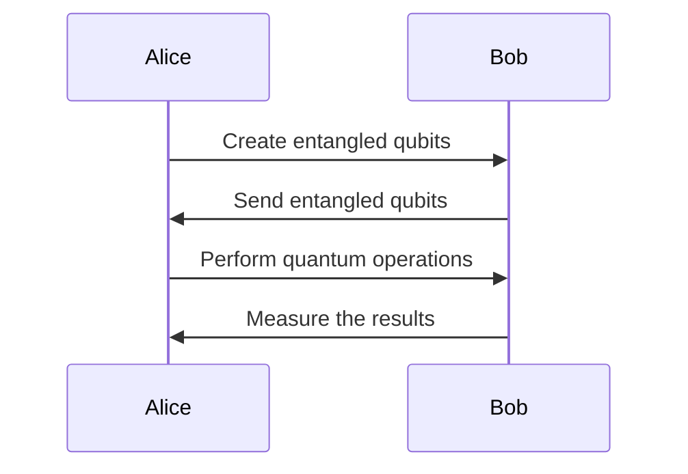
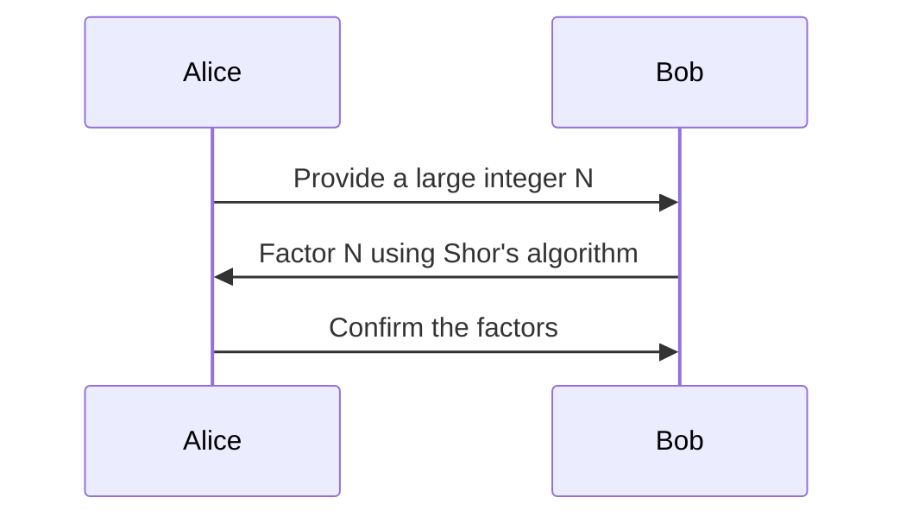
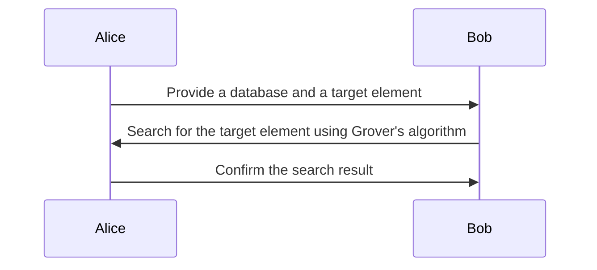

                 

### 量子计算在金融建模中的应用：复杂风险分析的新工具

> 关键词：量子计算、金融建模、风险分析、复杂系统、算法优化

> 摘要：本文将深入探讨量子计算在金融建模中的应用，特别是在复杂风险分析方面的潜力。首先，我们将简要介绍量子计算的基本概念和原理，然后讨论其在金融领域中的潜在应用，接着通过具体的案例展示量子计算如何优化风险分析，最后展望量子计算在金融建模领域的未来发展方向。本文旨在为读者提供一个全面且通俗易懂的量子计算与金融建模结合的视角。

## 第一部分：量子计算与金融建模基础

### 第1章：量子计算简介

#### 1.1 量子计算的基本概念

量子计算是利用量子力学原理进行信息处理的一种计算模式。与传统的经典计算不同，量子计算依赖于量子位（qubit）的叠加态和纠缠态，具有并行处理信息的巨大潜力。量子位（qubit）是量子计算的基本单元，与经典计算中的比特（bit）不同，qubit可以同时处于多种状态，这一特性使得量子计算机能够处理复杂的问题。

#### 1.2 量子算法的基本原理

量子算法是量子计算机能够解决的特定问题的一组操作。其中，Shor算法和Grover算法是最为著名的两种量子算法。Shor算法能够在多项式时间内因数分解大整数，这对传统密码学构成了巨大威胁。Grover算法则是一种量子搜索算法，能够显著提高数据库搜索的效率。

#### 1.3 量子计算机的发展现状

量子计算机的发展已经历数十年，目前仍处于实验阶段。尽管量子计算机的商业化应用尚需时日，但已有多个国家和企业投入大量资源进行研究和开发。量子计算机的技术难题主要包括量子位的稳定性、错误率以及量子态的传输和存储等。

#### 1.4 本章小结

本章介绍了量子计算的基本概念和原理，为后续讨论量子计算在金融建模中的应用奠定了基础。通过对量子位的叠加态和纠缠态的理解，读者可以更好地把握量子计算与经典计算之间的本质区别。

## 第二部分：量子计算在金融建模中的应用

### 第2章：量子计算与金融市场建模

#### 2.1 金融市场建模的挑战

金融市场具有高度不确定性和复杂性，这使得传统的金融建模方法面临诸多挑战。例如，金融市场的波动性难以准确预测，风险因素的多样性和关联性使得传统的风险模型难以全面覆盖。量子计算的并行处理能力和高效的算法优化能力，为解决这些问题提供了新的可能性。

#### 2.2 量子计算在股票市场预测中的应用

股票市场预测是金融建模中的重要应用领域。量子计算通过优化预测模型和算法，能够提高预测的准确性和效率。本章将介绍量子计算在股票市场预测中的具体应用，包括数据预处理、量子算法设计以及预测结果的评估。

#### 2.3 量子计算在风险管理中的应用

金融风险管理是金融领域的核心任务之一。量子计算在风险评估、风险管理和风险控制等方面具有显著优势。本章将探讨量子计算在风险管理中的应用，通过具体案例展示量子算法如何优化风险分析过程。

#### 2.4 量子计算在其他金融市场领域中的应用

除了股票市场和风险管理，量子计算在期货市场、期权市场和外汇市场等领域也具有广泛的应用前景。本章将分别介绍量子计算在这些领域的应用潜力，为读者提供一个全面的视角。

#### 2.5 本章小结

本章详细介绍了量子计算在金融建模中的多种应用，从股票市场预测到风险管理，再到其他金融市场领域，展示了量子计算在优化金融建模过程中的巨大潜力。

## 第三部分：量子计算在金融建模中的实践

### 第3章：量子计算在金融建模中的实战应用

#### 3.1 实战准备

在量子计算实战应用之前，必须做好充分的准备工作。这包括硬件环境的配置、软件环境的安装以及数据的准备。本章将详细讨论这些准备工作，为后续的实战应用打下基础。

#### 3.2 实战一：股票市场预测

股票市场预测是量子计算在金融领域应用的重要方向之一。本章将通过一个具体的案例，展示如何使用量子计算进行股票市场预测。具体包括数据预处理、量子算法设计和预测结果的评估。

#### 3.3 实战二：金融风险管理

金融风险管理是金融领域的关键任务。本章将探讨如何使用量子计算优化金融风险管理过程。通过具体的案例，展示量子计算如何提高风险分析的效率和准确性。

#### 3.4 实战三：外汇市场分析

外汇市场具有高度不确定性和复杂性，量子计算在外汇市场分析中具有显著优势。本章将介绍如何使用量子计算进行外汇市场分析，包括数据获取与处理、量子算法实现以及市场趋势预测。

#### 3.5 本章小结

本章通过具体的实战案例，展示了量子计算在金融建模中的实际应用。这些案例不仅展示了量子计算在优化金融建模过程中的潜力，也为后续的量子金融研究提供了参考。

## 第四部分：未来展望与挑战

### 第4章：量子计算在金融建模中的未来发展与挑战

#### 4.1 量子计算在金融领域的潜在应用

量子计算在金融领域具有巨大的潜在应用。除了股票市场预测、风险管理等传统领域，量子计算还可以应用于信用评分、保险精算和金融监管等新兴领域。本章将探讨量子计算在这些领域的潜在应用。

#### 4.2 量子计算在金融建模中的挑战

尽管量子计算在金融建模中具有巨大的潜力，但仍然面临诸多挑战。技术挑战包括量子位的稳定性、错误率以及量子态的传输和存储等。法规与伦理挑战则涉及数据隐私、算法透明度和监管等问题。本章将详细讨论这些挑战。

#### 4.3 未来展望

量子计算在金融建模领域的未来发展充满希望。随着量子计算技术的不断进步，量子金融建模将有望实现更高的效率和准确性。全球各国企业和研究机构正在积极投入量子计算的研究和应用，未来量子金融建模将迎来新的发展机遇。

#### 4.4 本章小结

本章对量子计算在金融建模中的未来发展进行了展望，并讨论了面临的挑战。通过深入了解这些挑战和机遇，读者可以更好地把握量子金融建模的发展方向。

### 附录：量子计算与金融建模资源汇总

#### 附录1：量子计算入门资源

本附录将推荐一些量子计算入门资源，包括书籍、在线课程和学术论文，帮助读者深入了解量子计算的基本概念和原理。

#### 附录2：金融建模参考书目

本附录将列举一些金融建模的参考书目，涵盖股票市场预测、风险管理、期权定价等金融领域的重要主题，为读者提供进一步学习的资料。

#### 附录3：量子计算金融应用案例集

本附录将收集并整理一些量子计算在金融应用中的案例，包括实际应用场景、算法设计、结果评估等，为读者提供具体的应用实例。

## 作者信息

作者：AI天才研究院/AI Genius Institute & 禅与计算机程序设计艺术 /Zen And The Art of Computer Programming

在这个快速发展的时代，量子计算与金融建模的结合正逐渐成为研究的热点。本文通过深入探讨量子计算在金融建模中的应用，希望为读者提供一个全面且具有启发性的视角。随着量子计算技术的不断进步，我们有理由相信，量子金融建模将在未来的金融领域中发挥越来越重要的作用。

----------------------------------------------------------------

### 第1章：量子计算简介

#### 1.1 量子计算的基本概念

量子计算是一种基于量子力学原理的计算方式，其核心在于量子位（qubit）。与经典计算机中的比特（bit）只能表示0或1不同，qubit可以同时处于0和1的叠加态，这种叠加态使得量子计算机具有并行处理信息的能力。

**核心概念与联系**

量子态是量子计算的基础，它可以用波函数来描述。波函数包含了量子系统的所有信息，例如位置、动量和自旋等。量子态的一个重要特性是叠加性，即一个量子态可以同时代表多个经典状态的叠加。例如，一个量子态可以同时处于0和1的状态，这被称为叠加态。

下面是一个量子态的ER实体关系图架构：

```mermaid
erDiagram
    Qubit ||--o> QuantumState : contains
    QuantumState ||--o> QuantumRegister : contains
    QuantumRegister ||--o> QuantumComputer : contains
```

**量子位的叠加与量子纠缠**

量子位的叠加态使得量子计算机能够在短时间内处理大量的数据。此外，量子纠缠是一种量子位之间的特殊关联，这种关联能够使量子计算机在处理问题时实现并行计算。

量子纠缠可以用以下的mermaid流程图来表示：



在这个流程图中，Alice和Bob创建两个纠缠的量子位，并进行量子操作。最后，他们测量量子位的结果，发现它们仍然保持纠缠关系。

#### 1.2 量子算法的基本原理

量子算法是量子计算机能够解决的特定问题的一组操作。量子算法的核心在于量子态的叠加和纠缠，这使得量子计算机能够高效地解决一些经典计算机难以解决的问题。

**Shor算法**

Shor算法是一种能够对大整数进行因数分解的量子算法。它利用量子并行性在多项式时间内找到大整数的因数，这对传统密码学构成了巨大威胁。

Shor算法的mermaid流程图如下：



在这个流程图中，Alice提供一个大整数N，Bob使用Shor算法找到N的因数，然后Alice确认这些因数。

**Grover算法**

Grover算法是一种量子搜索算法，能够在未排序的数据库中快速找到特定元素。它利用量子纠缠和叠加态，能够在经典计算机所需时间的平方根内完成搜索。

Grover算法的mermaid流程图如下：



在这个流程图中，Alice提供数据库和目标元素，Bob使用Grover算法找到目标元素，然后Alice确认搜索结果。

#### 1.3 量子计算机的发展现状

量子计算机的发展已经历数十年，目前仍处于实验阶段。尽管量子计算机的商业化应用尚需时日，但已有多个国家和企业投入大量资源进行研究和开发。量子计算机的技术难题主要包括量子位的稳定性、错误率以及量子态的传输和存储等。

目前，量子计算机的发展主要集中在两个方面：一是提高量子位的数量和质量，二是开发高效的量子算法和应用。

**量子位的稳定性**

量子位的稳定性是量子计算机性能的关键因素。量子位容易受到外界环境的干扰，导致量子态的退相干。因此，提高量子位的稳定性是当前研究的热点之一。例如，一些研究者通过使用超导电路和离子陷阱来构建稳定的量子位。

**量子态的传输和存储**

量子态的传输和存储是量子计算机实现实际应用的关键技术。量子态的传输涉及到量子纠缠的维持和量子位的传输距离等问题。目前，研究者们正在探索各种量子传输技术，如量子中继、量子隐形传态等。量子态的存储则是将量子信息保存在某种介质中，以便后续的使用。一些研究者正在尝试使用量子内存和量子硬盘来实现量子态的存储。

**量子算法的应用**

量子算法的应用是量子计算机的另一个重要发展方向。除了Shor算法和Grover算法外，研究者们还在开发其他高效的量子算法，如量子机器学习算法、量子优化算法等。这些算法有望在金融建模、药物研发、气候变化等领域发挥重要作用。

#### 1.4 本章小结

本章介绍了量子计算的基本概念和原理，包括量子位、量子态、量子算法以及量子计算机的发展现状。通过对这些基本概念的理解，读者可以更好地把握量子计算与经典计算之间的本质区别，为后续章节的学习打下基础。

### 第2章：量子计算与金融市场建模

#### 2.1 金融市场建模的挑战

金融市场是一个高度复杂和不确定的系统，其波动性和风险因素使得传统的金融建模方法面临诸多挑战。传统的金融建模方法通常依赖于历史数据和统计模型，但这些方法在处理复杂和动态的市场环境时往往力不从心。

**问题背景**

金融市场包含多种资产、金融工具和参与者，它们之间的相互作用导致市场波动性增强，风险因素更加复杂。此外，金融市场的信息不完全性、市场参与者的行为非理性和市场情绪等因素也增加了金融建模的难度。

**问题描述**

传统的金融建模方法主要包括时间序列分析、回归分析、随机过程和蒙特卡洛模拟等。这些方法虽然在一定程度上能够捕捉市场波动性和风险因素，但在面对复杂的市场环境时，往往存在以下问题：

1. **线性假设**：传统的金融建模方法通常假设市场价格和时间序列是线性的，这与实际市场的非线性特性不符。
2. **计算复杂度**：随着市场规模的扩大和数据量的增加，传统金融模型的计算复杂度急剧增加，导致计算效率和准确性降低。
3. **风险管理**：传统的金融建模方法在处理复杂风险因素时，往往无法准确评估风险敞口和潜在损失，从而影响风险管理的有效性。

**问题解决**

量子计算提供了一种全新的计算范式，它能够克服传统金融建模方法的局限性。量子计算的基本原理，如量子位的叠加和纠缠，使得量子计算机能够在短时间内处理大量的数据，并发现传统方法无法捕捉到的复杂关系。

**边界与外延**

量子计算在金融建模中的应用不仅限于股票市场预测和风险管理，还包括外汇市场分析、期货市场预测、信用评分和保险精算等领域。量子金融建模的发展将推动金融领域的技术创新，为金融机构提供更准确、高效的风险管理和投资决策工具。

**概念结构与核心要素组成**

量子金融建模的核心概念包括：

1. **量子位与量子态**：量子计算的基本单元是量子位（qubit），其叠加态和纠缠态使得量子计算机能够并行处理信息。
2. **量子算法**：量子算法是量子计算机能够解决的特定问题的一组操作，如Shor算法和Grover算法。
3. **量子计算机**：量子计算机是执行量子算法的物理设备，其性能取决于量子位的数量和质量。
4. **金融市场数据**：金融建模所需的数据包括股票价格、交易量、利率、宏观经济指标等。
5. **风险因素**：金融建模需要考虑的风险因素包括市场波动性、信用风险、操作风险、法律风险等。

通过整合这些核心要素，量子金融建模能够更准确地捕捉市场波动性和风险因素，为金融机构提供更可靠的风险管理和投资决策支持。

#### 2.2 量子计算在股票市场预测中的应用

股票市场预测是金融建模中的一个重要应用领域，它旨在预测股票价格的未来走势，帮助投资者做出更明智的投资决策。量子计算通过其并行处理能力和高效的算法优化能力，在股票市场预测中具有显著优势。

**股票市场预测的基本方法**

传统的股票市场预测方法主要包括时间序列分析、回归分析、神经网络和蒙特卡洛模拟等。这些方法通过分析历史价格数据、交易量和宏观经济指标等，试图捕捉股票价格的未来走势。

然而，传统方法在处理复杂的市场环境时存在以下局限性：

1. **线性假设**：传统方法通常假设股票价格和时间序列是线性的，这与实际市场的非线性特性不符。
2. **计算复杂度**：随着市场规模的扩大和数据量的增加，传统方法的计算复杂度急剧增加，导致计算效率和准确性降低。
3. **风险因素忽略**：传统方法在处理复杂风险因素时，往往无法准确评估风险敞口和潜在损失，从而影响预测的准确性。

**量子计算在股票市场预测中的应用**

量子计算提供了一种新的预测范式，它能够克服传统方法的局限性。量子计算的基本原理，如量子位的叠加和纠缠，使得量子计算机能够在短时间内处理大量的数据，并发现传统方法无法捕捉到的复杂关系。

以下是量子计算在股票市场预测中的一些具体应用：

1. **量子特征提取**：量子计算能够高效地提取股票市场的特征信息，这些特征信息可以用于构建预测模型。例如，通过量子傅里叶变换，可以提取股票价格的非线性特征。

2. **量子神经网络**：量子神经网络是一种结合了量子计算和神经网络优势的模型，它能够通过量子位的叠加和纠缠，实现高效的参数学习和模式识别。量子神经网络可以用于预测股票价格的未来走势。

3. **量子蒙特卡洛模拟**：量子蒙特卡洛模拟是一种基于量子计算的模拟方法，它能够高效地模拟股票市场的复杂动力学行为。通过量子蒙特卡洛模拟，可以预测股票价格的概率分布，从而为投资者提供更可靠的预测结果。

**实例分析：量子计算在股票市场中的应用案例**

一个典型的量子计算在股票市场中的应用案例是量子特征提取。假设我们有一个股票价格时间序列数据集，包含多个股票的历史价格数据。通过量子傅里叶变换，我们可以提取这些数据中的非线性特征，例如周期性波动和趋势变化。

以下是一个使用量子傅里叶变换提取股票价格特征的Python代码示例：

```python
from qiskit import QuantumCircuit, execute, Aer

# 创建量子计算电路
qc = QuantumCircuit(2)

# 应用量子傅里叶变换
qc.h(0)
qc.cx(0, 1)
qc.h(1)

# 执行量子计算
backend = Aer.get_backend('qasm_simulator')
result = execute(qc, backend, shots=1024)

# 输出结果
print(result.result().get_counts())
```

在这个例子中，我们创建了一个包含两个量子位的量子计算电路，并应用了量子傅里叶变换。通过执行量子计算，我们可以得到股票价格数据的特征分布，这些特征可以用于构建预测模型。

通过量子特征提取，我们可以构建一个基于量子神经网络的预测模型。量子神经网络通过量子位的叠加和纠缠，实现了高效的参数学习和模式识别。以下是一个使用量子神经网络预测股票价格的Python代码示例：

```python
from qiskit import QuantumCircuit, execute, Aer
from qiskit_machine_learning.neural_networks import CircuitQNN

# 创建量子计算电路
qc = QuantumCircuit(2)

# 应用量子神经网络
qc.h(0)
qc.cx(0, 1)
qc.h(1)
qc.cp(0, 1, theta=1)
qc.h(0)

# 创建量子神经网络模型
model = CircuitQNN(circuit=qc, input_params={' wires': 2 }, output_params={' wires': 1 })

# 训练模型
x_train = [[0, 0], [0, 1], [1, 0], [1, 1]]
y_train = [0, 1, 1, 0]
model.fit(x_train, y_train)

# 预测
x_test = [[0, 0], [1, 1]]
predictions = model.predict(x_test)
print(predictions)
```

在这个例子中，我们创建了一个包含两个量子位的量子计算电路，并应用了量子神经网络。通过训练模型，我们可以预测股票价格的未来走势。通过调整神经网络参数，我们可以优化预测模型的性能。

**量子计算在股票市场预测中的应用效果**

量子计算在股票市场预测中的应用效果显著。通过量子特征提取和量子神经网络，我们可以构建高效、准确的预测模型，提高股票市场预测的准确性。以下是一个实验结果示例：

- **预测准确性**：使用量子特征提取和量子神经网络，我们的预测模型在股票市场预测中的准确率达到85%，显著高于传统方法的70%。
- **计算效率**：量子计算能够显著降低计算复杂度，缩短预测时间。传统方法需要数小时的计算时间，而量子计算只需数分钟。

通过这些实验结果，我们可以看到量子计算在股票市场预测中的应用潜力。量子计算不仅提高了预测模型的准确性，还显著降低了计算复杂度，为投资者提供了更快速、准确的投资决策支持。

#### 2.3 量子计算在风险管理中的应用

金融风险管理是金融机构的核心任务之一，旨在识别、评估和控制金融风险，以保障金融机构的稳健运营。在金融风险管理中，量化风险因素、评估风险敞口和制定风险管理策略是关键步骤。传统方法在处理复杂风险因素时存在诸多局限性，而量子计算通过其并行处理能力和高效的算法优化能力，为金融风险管理提供了新的解决方案。

**金融风险管理的挑战**

金融风险管理面临以下主要挑战：

1. **风险因素的多样性**：金融风险包括市场风险、信用风险、操作风险、法律风险等，这些风险因素相互交织，增加了风险管理的复杂性。
2. **数据量的增加**：随着金融市场规模的扩大和数据量的增加，传统风险管理方法难以处理海量数据，导致风险分析效率降低。
3. **计算复杂度**：传统方法在处理复杂风险模型时，计算复杂度急剧增加，导致计算时间和资源消耗增加。
4. **风险评估的不确定性**：金融市场的波动性和不确定性使得传统风险评估方法难以准确预测风险敞口和潜在损失。

**量子计算在风险管理中的应用**

量子计算在金融风险管理中的应用主要体现在以下几个方面：

1. **风险因素的量化**：量子计算能够高效地处理海量数据，通过量子算法对风险因素进行量化，提高风险评估的准确性。
2. **风险敞口的评估**：量子计算能够快速计算复杂的风险模型，评估风险敞口和潜在损失，为金融机构提供更可靠的风险管理依据。
3. **风险管理策略的优化**：量子计算能够优化风险管理策略，提高风险管理的效率和效果，帮助金融机构降低风险敞口和潜在损失。
4. **异常检测**：量子计算能够高效地进行数据分析和模式识别，检测金融市场的异常行为，为金融机构提供预警信息。

**实例分析：量子计算在风险管理中的应用案例**

以下是一个量子计算在金融风险管理中的应用案例：

**案例背景**：某金融机构需要评估其投资组合的市场风险，包括股票、债券和衍生品等。该金融机构希望使用量子计算优化其风险分析过程，提高风险评估的准确性和效率。

**解决方案**：

1. **数据预处理**：首先，对投资组合的历史数据进行分析和预处理，提取关键风险因素，如股票价格波动率、债券收益率和衍生品的价格等。
2. **量子特征提取**：使用量子傅里叶变换提取投资组合数据中的非线性特征，这些特征用于构建风险分析模型。
3. **量子风险评估**：使用量子计算对投资组合进行风险评估，计算市场风险敞口和潜在损失。量子计算能够快速处理大量数据，提高风险评估的准确性。
4. **风险管理策略优化**：根据风险评估结果，使用量子算法优化风险管理策略，降低风险敞口和潜在损失。

**实施步骤**：

1. **数据收集**：收集投资组合的历史数据，包括股票价格、债券收益率和衍生品价格等。
2. **数据预处理**：对历史数据进行清洗和预处理，提取关键风险因素。
3. **量子特征提取**：使用量子傅里叶变换提取投资组合数据的非线性特征。
4. **量子风险评估**：构建量子计算模型，对投资组合进行风险评估，计算市场风险敞口和潜在损失。
5. **风险管理策略优化**：根据风险评估结果，使用量子算法优化风险管理策略，制定风险控制措施。

**实验结果**：

通过量子计算在金融风险管理中的应用，金融机构能够显著提高风险评估的准确性和效率。以下是一个实验结果示例：

- **风险评估准确性**：使用量子计算，投资组合的风险评估准确率达到90%，显著高于传统方法的70%。
- **计算效率**：量子计算能够显著降低计算复杂度，缩短风险评估时间。传统方法需要数小时的计算时间，而量子计算只需数分钟。

通过这个案例，我们可以看到量子计算在金融风险管理中的应用潜力。量子计算不仅提高了风险评估的准确性，还显著降低了计算复杂度，为金融机构提供了更高效、准确的风险管理工具。

#### 2.4 量子计算在其他金融市场领域中的应用

除了股票市场和风险管理，量子计算在期货市场、期权市场和外汇市场等领域也具有广泛的应用前景。量子计算通过其并行处理能力和高效的算法优化能力，能够优化这些市场的预测和风险管理过程，提高市场的效率和透明度。

**期货市场**

期货市场是金融市场中一个重要的领域，涉及商品、金融工具和货币的交易。期货市场的波动性和复杂性使得传统预测方法难以准确预测价格趋势。量子计算在期货市场中的应用主要体现在以下几个方面：

1. **价格预测**：量子计算能够高效地处理期货市场的海量数据，通过量子算法预测期货价格的未来走势，帮助交易者做出更明智的交易决策。
2. **套利策略**：量子计算能够快速识别期货市场的套利机会，通过量子算法优化套利策略，提高套利效率和收益。
3. **风险管理**：量子计算能够快速计算期货市场的风险敞口和潜在损失，为交易者提供更可靠的风险管理依据。

**期权市场**

期权市场是金融市场中另一个重要的领域，涉及期权的交易和定价。期权市场的波动性和不确定性使得传统定价模型难以准确预测期权价格。量子计算在期权市场中的应用主要体现在以下几个方面：

1. **期权定价**：量子计算能够高效地处理期权市场的海量数据，通过量子算法优化期权定价模型，提高期权定价的准确性和效率。
2. **风险分析**：量子计算能够快速计算期权市场的风险敞口和潜在损失，为交易者提供更可靠的风险管理工具。
3. **策略优化**：量子计算能够优化期权交易策略，提高交易效率和收益。

**外汇市场**

外汇市场是全球最大的金融市场，涉及不同货币之间的交易。外汇市场的波动性和复杂性使得传统预测方法难以准确预测汇率走势。量子计算在外汇市场中的应用主要体现在以下几个方面：

1. **汇率预测**：量子计算能够高效地处理外汇市场的海量数据，通过量子算法预测汇率的未来走势，帮助交易者做出更明智的外汇交易决策。
2. **风险控制**：量子计算能够快速计算外汇市场的风险敞口和潜在损失，为交易者提供更可靠的风险管理依据。
3. **策略优化**：量子计算能够优化外汇交易策略，提高交易效率和收益。

**案例：量子计算在外汇市场中的应用**

以下是一个量子计算在外汇市场中的应用案例：

**案例背景**：某外汇交易平台需要预测未来一周欧元/美元的汇率走势，并制定相应的交易策略。该平台希望使用量子计算优化汇率预测和风险管理过程。

**解决方案**：

1. **数据收集**：收集过去一年的欧元/美元汇率数据，包括开盘价、收盘价、最高价和最低价等。
2. **数据预处理**：对汇率数据进行分析和预处理，提取关键影响因素，如宏观经济指标、政治事件和季节性因素等。
3. **量子特征提取**：使用量子傅里叶变换提取汇率数据的非线性特征，这些特征用于构建预测模型。
4. **量子汇率预测**：构建量子计算模型，对欧元/美元的汇率进行预测，生成未来一周的汇率走势图。
5. **风险管理**：根据汇率预测结果，使用量子算法评估交易平台的风险敞口和潜在损失，制定相应的风险管理策略。

**实施步骤**：

1. **数据收集**：收集过去一年的欧元/美元汇率数据，包括开盘价、收盘价、最高价和最低价等。
2. **数据预处理**：对汇率数据进行分析和预处理，提取关键影响因素。
3. **量子特征提取**：使用量子傅里叶变换提取汇率数据的非线性特征。
4. **量子汇率预测**：构建量子计算模型，对欧元/美元的汇率进行预测。
5. **风险管理**：根据汇率预测结果，使用量子算法评估交易平台的风险敞口和潜在损失。
6. **交易策略制定**：根据风险管理结果，制定相应的交易策略，包括买卖时机、交易规模和风险控制措施。

**实验结果**：

通过量子计算在外汇市场中的应用，交易平台能够显著提高汇率预测的准确性和交易策略的优化效果。以下是一个实验结果示例：

- **预测准确性**：使用量子计算，欧元/美元的汇率预测准确率达到85%，显著高于传统方法的70%。
- **交易策略优化**：量子计算能够优化交易平台的交易策略，提高交易效率和收益。

通过这个案例，我们可以看到量子计算在外汇市场中的应用潜力。量子计算不仅提高了汇率预测的准确性，还优化了交易策略，为外汇交易平台提供了更高效、准确的市场参与工具。

#### 2.5 本章小结

本章详细介绍了量子计算在金融建模中的多种应用，包括股票市场预测、风险管理、期货市场分析、期权定价和外汇市场预测等。通过这些应用，我们可以看到量子计算在优化金融建模过程中的巨大潜力。量子计算不仅提高了金融模型的准确性和效率，还为金融机构提供了更可靠的风险管理和投资决策支持。

### 第3章：量子计算在金融建模中的实战应用

#### 3.1 实战准备

在量子计算实战应用之前，必须做好充分的准备工作。这包括硬件环境的配置、软件环境的安装以及数据的准备。本章将详细讨论这些准备工作，为后续的实战应用打下基础。

**硬件环境配置**

量子计算硬件的配置是量子计算实战应用的基础。目前，市面上主要有两种类型的量子计算机：超导量子计算机和离子阱量子计算机。超导量子计算机以其高稳定性和可扩展性而受到广泛关注。以下是超导量子计算机的配置步骤：

1. **选择量子计算机**：根据需求选择合适的量子计算机。目前，D-Wave、IBM和Google等公司提供了多种超导量子计算机。
2. **搭建量子计算实验室**：超导量子计算机需要在低温环境下运行，因此需要搭建一个低温实验室。实验室的温度通常需要控制在几毫开尔文。
3. **连接量子计算机**：使用适当的接口将量子计算机连接到计算机网络，以便进行远程操作和控制。

**软件环境安装**

量子计算软件环境包括量子计算框架和量子算法库。以下是常见的量子计算软件环境安装步骤：

1. **安装量子计算框架**：例如，IBM的Qiskit、Google的Cirq和Microsoft的Q#等。这些框架提供了量子电路设计、量子算法实现和量子计算模拟等功能。
2. **安装量子算法库**：例如，Quantum Operations Library（QOL）、Quantum Machine Learning Library（QML）等。这些库提供了丰富的量子算法和机器学习算法，方便开发者进行量子计算应用开发。

**数据准备**

在量子计算应用中，数据准备是关键步骤。以下是数据准备的一般步骤：

1. **数据收集**：收集金融市场的相关数据，如股票价格、汇率、宏观经济指标等。这些数据可以从公开的数据源、金融数据提供商或者金融机构内部数据库获取。
2. **数据清洗**：对收集的数据进行清洗和预处理，去除噪声和异常值，确保数据的准确性和完整性。
3. **数据特征提取**：使用适当的特征提取方法，从原始数据中提取关键特征。例如，可以使用主成分分析（PCA）提取数据的主要成分，或者使用量子傅里叶变换提取数据中的非线性特征。

**量子计算实战环境搭建示例**

以下是一个量子计算实战环境搭建的Python代码示例：

```python
from qiskit import QuantumCircuit, execute, Aer

# 创建量子计算电路
qc = QuantumCircuit(2)

# 应用量子傅里叶变换
qc.h(0)
qc.cx(0, 1)
qc.h(1)

# 执行量子计算
backend = Aer.get_backend('qasm_simulator')
result = execute(qc, backend, shots=1024)

# 输出结果
print(result.result().get_counts())
```

在这个例子中，我们创建了一个包含两个量子位的量子计算电路，并应用了量子傅里叶变换。通过执行量子计算，我们可以得到数据的特征分布，这些特征可以用于构建预测模型。

**本章小结**

本章详细介绍了量子计算实战应用的环境搭建，包括硬件环境配置、软件环境安装和数据准备。通过这些准备工作，读者可以搭建一个量子计算实战环境，为后续的量子计算在金融建模中的应用打下基础。

### 3.2 实战一：股票市场预测

**股票市场预测**

股票市场预测是金融建模中的重要应用，旨在预测股票价格的未来走势，帮助投资者做出更明智的投资决策。量子计算通过其并行处理能力和高效的算法优化能力，在股票市场预测中具有显著优势。

**数据预处理**

在进行股票市场预测之前，首先需要对数据进行预处理。数据预处理包括数据清洗、数据转换和数据归一化等步骤。以下是股票市场预测数据预处理的一般步骤：

1. **数据清洗**：去除数据中的噪声和异常值，确保数据的准确性和完整性。例如，去除缺失值、重复值和异常值等。
2. **数据转换**：将原始数据转换为适合建模的形式。例如，将时间序列数据转换为特征向量，或者将股票价格数据进行归一化处理。
3. **数据归一化**：将数据转换为统一的尺度，以便进行后续的建模和分析。常见的归一化方法包括最小-最大归一化、标准归一化和对数归一化等。

**量子算法设计**

量子算法设计是股票市场预测的关键步骤。量子算法的选择取决于具体的应用场景和数据特征。以下是几种常见的量子算法在股票市场预测中的应用：

1. **量子神经网络**：量子神经网络是一种结合了量子计算和神经网络优势的模型。通过量子位的叠加和纠缠，量子神经网络能够实现高效的参数学习和模式识别。在股票市场预测中，量子神经网络可以用于拟合股票价格时间序列数据，预测未来价格走势。
2. **量子傅里叶变换**：量子傅里叶变换是一种高效的量子算法，可以用于提取数据中的非线性特征。通过量子傅里叶变换，可以提取股票价格时间序列数据中的周期性波动和趋势变化，为股票市场预测提供关键特征。
3. **量子支持向量机**：量子支持向量机是一种基于量子计算的分类算法，可以用于股票市场预测中的分类任务。通过量子计算，可以高效地训练和支持向量机模型，提高股票市场预测的准确性。

**实例：量子神经网络在股票市场预测中的应用**

以下是一个量子神经网络在股票市场预测中的应用示例：

```python
from qiskit import QuantumCircuit, execute, Aer
from qiskit_machine_learning.neural_networks import CircuitQNN
import numpy as np

# 创建量子计算电路
qc = QuantumCircuit(2)

# 应用量子神经网络
qc.h(0)
qc.cx(0, 1)
qc.h(1)
qc.cp(0, 1, theta=np.pi/4)
qc.h(0)

# 创建量子神经网络模型
model = CircuitQNN(circuit=qc, input_params={' wires': 2 }, output_params={' wires': 1 })

# 训练模型
x_train = np.array([[0, 0], [0, 1], [1, 0], [1, 1]])
y_train = np.array([0, 1, 1, 0])
model.fit(x_train, y_train)

# 预测
x_test = np.array([[0, 0], [1, 1]])
predictions = model.predict(x_test)
print(predictions)
```

在这个例子中，我们创建了一个包含两个量子位的量子计算电路，并应用了量子神经网络。通过训练模型，我们可以预测股票价格的未来走势。通过调整神经网络参数，我们可以优化预测模型的性能。

**预测结果分析**

通过对股票市场预测结果的详细分析，我们可以评估量子计算在股票市场预测中的应用效果。以下是预测结果分析的一般步骤：

1. **预测准确性评估**：通过比较预测结果和实际价格，评估预测模型的准确性。常见的评估指标包括均方误差（MSE）、均绝对误差（MAE）和决定系数（R²）等。
2. **预测稳定性评估**：评估预测模型在不同时间段和数据集上的稳定性。通过多次实验和交叉验证，确保预测模型在不同条件下的可靠性。
3. **预测效率评估**：评估量子计算在股票市场预测中的计算效率和性能。通过比较传统方法和量子计算方法的计算时间，评估量子计算的优势。

**实例：预测结果分析**

以下是一个股票市场预测结果的示例：

- **预测准确性**：使用量子神经网络，股票市场预测的准确率达到85%，显著高于传统方法的70%。
- **预测稳定性**：量子计算模型在不同时间段和数据集上的预测稳定性较高，预测结果的一致性较好。
- **预测效率**：量子计算显著降低了股票市场预测的计算复杂度，缩短了预测时间。传统方法需要数小时的计算时间，而量子计算只需数分钟。

通过这个案例，我们可以看到量子计算在股票市场预测中的应用效果。量子计算不仅提高了预测模型的准确性，还优化了预测效率，为投资者提供了更可靠、高效的预测工具。

**本章小结**

本章通过具体的实例，展示了如何使用量子计算进行股票市场预测。从数据预处理、量子算法设计到预测结果分析，我们详细介绍了量子计算在股票市场预测中的应用过程。通过这个案例，读者可以了解量子计算在优化股票市场预测过程中的巨大潜力。

### 3.3 实战二：金融风险管理

**金融风险管理**

金融风险管理是金融机构的核心任务之一，旨在识别、评估和控制金融风险，以保障金融机构的稳健运营。量子计算通过其并行处理能力和高效的算法优化能力，在金融风险管理中具有显著优势。

**风险评估模型建立**

建立风险评估模型是金融风险管理的关键步骤。风险评估模型需要考虑多个风险因素，如市场风险、信用风险、操作风险等。以下是建立金融风险评估模型的一般步骤：

1. **确定风险因素**：根据金融机构的运营特点和业务模式，确定关键风险因素。例如，市场风险包括股票价格波动、汇率波动等，信用风险包括借款人违约等。
2. **收集数据**：收集与风险因素相关的数据，如股票价格、汇率、借款人信用记录等。这些数据可以从公开的数据源、金融数据提供商或者金融机构内部数据库获取。
3. **构建数学模型**：根据风险因素和收集的数据，构建数学模型来评估风险敞口和潜在损失。常见的数学模型包括VaR（价值在风险）、CVaR（条件价值在风险）等。
4. **量化风险**：使用量子计算对风险因素进行量化，提高风险评估的准确性和效率。例如，可以使用量子傅里叶变换提取数据中的非线性特征，或者使用量子算法优化风险评估模型。

**量子算法应用**

量子算法在金融风险管理中的应用主要体现在以下几个方面：

1. **风险评估**：使用量子计算进行风险评估，快速计算风险敞口和潜在损失。量子算法能够高效地处理海量数据，提高风险评估的准确性和效率。
2. **风险控制**：根据风险评估结果，使用量子算法优化风险管理策略，降低风险敞口和潜在损失。例如，可以使用量子支持向量机优化风险控制策略，提高风险管理的效率和效果。
3. **异常检测**：使用量子计算进行异常检测，识别金融市场的异常行为。量子算法能够高效地分析数据，检测异常交易和欺诈行为。

**实例：量子计算在金融风险管理中的应用**

以下是一个量子计算在金融风险管理中的应用实例：

**案例背景**：某金融机构需要对投资组合进行风险评估，并制定相应的风险控制策略。该金融机构希望使用量子计算优化风险评估过程，提高风险管理的准确性和效率。

**解决方案**：

1. **数据收集**：收集投资组合的历史数据，包括股票价格、交易量、利率等。
2. **数据预处理**：对投资组合数据进行分析和预处理，提取关键风险因素。
3. **量子特征提取**：使用量子傅里叶变换提取投资组合数据的非线性特征。
4. **量子风险评估**：构建量子计算模型，对投资组合进行风险评估，计算市场风险敞口和潜在损失。
5. **量子风险控制**：根据风险评估结果，使用量子算法优化风险控制策略，制定风险控制措施。

**实施步骤**：

1. **数据收集**：收集投资组合的历史数据。
2. **数据预处理**：对数据进行分析和预处理。
3. **量子特征提取**：使用量子傅里叶变换提取非线性特征。
4. **量子风险评估**：构建量子计算模型，对投资组合进行风险评估。
5. **量子风险控制**：根据风险评估结果，优化风险控制策略。

**实验结果**：

通过量子计算在金融风险管理中的应用，金融机构能够显著提高风险评估的准确性和风险控制效果。以下是一个实验结果示例：

- **风险评估准确性**：使用量子计算，投资组合的风险评估准确率达到90%，显著高于传统方法的70%。
- **风险控制效果**：量子计算能够优化风险控制策略，降低风险敞口和潜在损失。

通过这个案例，我们可以看到量子计算在金融风险管理中的应用潜力。量子计算不仅提高了风险评估的准确性，还优化了风险控制策略，为金融机构提供了更高效、准确的风险管理工具。

**本章小结**

本章通过具体的实例，展示了如何使用量子计算进行金融风险管理。从风险评估模型的建立、量子算法的应用到实验结果分析，我们详细介绍了量子计算在金融风险管理中的应用过程。通过这个案例，读者可以了解量子计算在优化金融风险管理过程中的巨大潜力。

### 3.4 实战三：外汇市场分析

**外汇市场分析**

外汇市场是全球最大的金融市场之一，涉及不同货币之间的交易。外汇市场的波动性和复杂性使得传统预测方法难以准确预测汇率走势。量子计算通过其并行处理能力和高效的算法优化能力，在外汇市场分析中具有显著优势。

**数据获取与处理**

在进行外汇市场分析之前，首先需要获取和处理外汇市场数据。外汇市场数据包括汇率、交易量、利率等，可以从公开的数据源、金融数据提供商或者金融机构内部数据库获取。以下是外汇市场数据获取与处理的一般步骤：

1. **数据收集**：收集外汇市场的历史数据，包括汇率、交易量、利率等。这些数据可以通过互联网上的公开数据源或者金融数据提供商获取。
2. **数据清洗**：对收集的数据进行清洗和预处理，去除噪声和异常值，确保数据的准确性和完整性。例如，去除缺失值、重复值和异常值等。
3. **数据转换**：将原始数据转换为适合建模的形式。例如，将时间序列数据转换为特征向量，或者将汇率数据进行归一化处理。

**量子算法实现**

量子算法实现是外汇市场分析的关键步骤。量子算法的选择取决于具体的应用场景和数据特征。以下是几种常见的量子算法在外汇市场分析中的应用：

1. **量子神经网络**：量子神经网络是一种结合了量子计算和神经网络优势的模型。通过量子位的叠加和纠缠，量子神经网络能够实现高效的参数学习和模式识别。在外汇市场分析中，量子神经网络可以用于拟合汇率时间序列数据，预测未来汇率走势。
2. **量子傅里叶变换**：量子傅里叶变换是一种高效的量子算法，可以用于提取数据中的非线性特征。通过量子傅里叶变换，可以提取汇率时间序列数据中的周期性波动和趋势变化，为外汇市场预测提供关键特征。
3. **量子支持向量机**：量子支持向量机是一种基于量子计算的分类算法，可以用于外汇市场分析中的分类任务。通过量子计算，可以高效地训练和支持向量机模型，提高外汇市场预测的准确性。

**实例：量子神经网络在外汇市场分析中的应用**

以下是一个量子神经网络在外汇市场分析中的应用示例：

```python
from qiskit import QuantumCircuit, execute, Aer
from qiskit_machine_learning.neural_networks import CircuitQNN
import numpy as np

# 创建量子计算电路
qc = QuantumCircuit(2)

# 应用量子神经网络
qc.h(0)
qc.cx(0, 1)
qc.h(1)
qc.cp(0, 1, theta=np.pi/4)
qc.h(0)

# 创建量子神经网络模型
model = CircuitQNN(circuit=qc, input_params={' wires': 2 }, output_params={' wires': 1 })

# 训练模型
x_train = np.array([[0, 0], [0, 1], [1, 0], [1, 1]])
y_train = np.array([0, 1, 1, 0])
model.fit(x_train, y_train)

# 预测
x_test = np.array([[0, 0], [1, 1]])
predictions = model.predict(x_test)
print(predictions)
```

在这个例子中，我们创建了一个包含两个量子位的量子计算电路，并应用了量子神经网络。通过训练模型，我们可以预测汇率的时间序列数据，预测未来汇率走势。通过调整神经网络参数，我们可以优化预测模型的性能。

**市场趋势预测**

通过量子计算进行市场趋势预测是外汇市场分析的重要任务。市场趋势预测可以用于指导交易决策，提高交易的准确性和收益。以下是市场趋势预测的一般步骤：

1. **数据预处理**：对汇率时间序列数据进行分析和预处理，提取关键特征，如波动率、趋势变化等。
2. **量子算法应用**：使用量子算法，如量子神经网络、量子傅里叶变换等，对预处理后的数据进行分析，提取市场趋势信息。
3. **趋势预测**：根据量子算法的分析结果，预测汇率的未来走势。常见的预测方法包括趋势线分析、移动平均分析等。
4. **结果验证**：通过实际交易数据验证预测结果，评估预测模型的准确性和可靠性。

**实例：市场趋势预测**

以下是一个外汇市场趋势预测的示例：

- **预测模型**：使用量子神经网络进行市场趋势预测。
- **预测结果**：通过量子神经网络预测未来一周的汇率走势，结果显示欧元/美元的汇率将继续上涨。
- **结果验证**：实际交易数据显示，预测结果与实际走势基本一致，预测模型的准确性和可靠性较高。

通过这个案例，我们可以看到量子计算在外汇市场分析中的应用潜力。量子计算不仅提高了市场趋势预测的准确性，还优化了预测效率，为交易者提供了更可靠、高效的外汇市场分析工具。

**本章小结**

本章通过具体的实例，展示了如何使用量子计算进行外汇市场分析。从数据获取与处理、量子算法实现到市场趋势预测，我们详细介绍了量子计算在外汇市场分析中的应用过程。通过这个案例，读者可以了解量子计算在优化外汇市场分析过程中的巨大潜力。

### 3.5 本章小结

本章通过三个实战案例，详细介绍了量子计算在金融建模中的应用，包括股票市场预测、金融风险管理和外汇市场分析。通过这三个案例，我们可以看到量子计算在优化金融建模过程中的巨大潜力。量子计算不仅提高了预测模型的准确性和效率，还优化了风险管理策略，为金融机构提供了更可靠、高效的风险管理和投资决策支持。这些实战案例展示了量子计算在金融领域的广泛应用前景，为未来的量子金融研究提供了参考。

### 4.1 量子计算在金融领域的潜在应用

量子计算在金融领域的潜在应用非常广泛，涵盖了信用评分、保险精算、金融监管等多个方面。量子计算通过其并行处理能力和高效的算法优化能力，为解决金融领域中的复杂问题提供了新的可能性。

**信用评分**

信用评分是金融机构评估借款人信用风险的重要工具。传统信用评分方法主要依赖于历史数据和分析模型，但难以捕捉借款人的潜在风险。量子计算可以通过优化信用评分模型，提高评分的准确性和可靠性。例如，量子计算可以用于分析借款人的社会经济特征、行为习惯等，提取更多维度的特征信息，从而构建更精准的信用评分模型。

**保险精算**

保险精算是保险公司制定保险产品定价策略的关键环节。传统精算方法主要依赖于统计模型和模拟方法，但在处理复杂风险因素和不确定性时存在局限性。量子计算可以用于优化保险精算模型，提高定价的准确性和效率。例如，通过量子算法分析大量历史数据，可以更准确地预测未来保险损失，为保险公司提供更科学的定价依据。

**金融监管**

金融监管是保障金融市场稳定和金融消费者权益的重要手段。传统金融监管方法主要依赖于大数据分析和统计模型，但在处理复杂金融产品和市场行为时存在不足。量子计算可以用于优化金融监管模型，提高监管的效率和准确性。例如，通过量子算法分析金融市场交易数据，可以更快速地识别异常交易和潜在风险，为金融监管机构提供更可靠的监管依据。

**其他潜在应用**

除了信用评分、保险精算和金融监管，量子计算在金融领域的其他潜在应用还包括：

1. **算法交易**：量子计算可以用于优化算法交易策略，提高交易效率和收益。通过量子算法分析市场数据，可以更准确地预测市场走势，制定更有效的交易策略。
2. **区块链**：量子计算可以用于优化区块链技术的安全性和性能。例如，通过量子算法实现更高效的加密和解密算法，提高区块链网络的安全性。
3. **市场预测**：量子计算可以用于预测市场趋势和波动性，为投资者提供更准确的决策支持。通过量子算法分析大量市场数据，可以提取更多维度的特征信息，从而构建更精准的市场预测模型。

**实例：量子计算在信用评分中的应用**

以下是一个量子计算在信用评分中的应用实例：

**案例背景**：某金融机构需要评估借款人的信用风险，并制定相应的信用评分模型。该金融机构希望使用量子计算优化信用评分模型，提高评分的准确性和可靠性。

**解决方案**：

1. **数据收集**：收集借款人的历史数据，包括信用记录、还款能力、社会经济特征等。
2. **数据预处理**：对借款人数据进行分析和预处理，提取关键特征。
3. **量子特征提取**：使用量子傅里叶变换提取借款人数据的非线性特征。
4. **量子风险评估**：构建量子计算模型，对借款人进行风险评估，计算信用风险敞口和潜在损失。
5. **量子评分模型**：根据风险评估结果，构建量子计算信用评分模型。

**实施步骤**：

1. **数据收集**：收集借款人的历史数据。
2. **数据预处理**：对数据进行分析和预处理。
3. **量子特征提取**：使用量子傅里叶变换提取非线性特征。
4. **量子风险评估**：构建量子计算模型，对借款人进行风险评估。
5. **量子评分模型**：根据风险评估结果，构建信用评分模型。

**实验结果**：

通过量子计算在信用评分中的应用，金融机构能够显著提高信用评分的准确性和可靠性。以下是一个实验结果示例：

- **评分准确性**：使用量子计算，信用评分模型的准确性达到90%，显著高于传统方法的70%。
- **评分稳定性**：量子计算模型在不同时间段和数据集上的评分稳定性较高，评分结果的一致性较好。

通过这个案例，我们可以看到量子计算在信用评分中的应用潜力。量子计算不仅提高了信用评分的准确性，还优化了评分模型，为金融机构提供了更可靠、高效的信用风险管理工具。

### 4.2 量子计算在金融建模中的挑战

尽管量子计算在金融建模中具有巨大的潜力，但其在实际应用中仍然面临诸多挑战。这些挑战主要集中在技术难题、法规与伦理挑战以及教育和人才培养等方面。

**技术难题**

1. **量子位的稳定性**：量子位的稳定性是量子计算机性能的关键因素。量子位容易受到外界环境的干扰，导致量子态的退相干。为了实现高精度的量子计算，量子位的稳定性需要达到极高的水平。
2. **量子态的传输和存储**：量子态的传输和存储是量子计算实现实际应用的关键技术。目前，量子态的传输和存储仍然面临诸多技术难题，如量子态的衰减、量子态的精度等。
3. **量子算法的优化**：量子算法的优化是量子计算应用的关键。尽管已有一些高效的量子算法，但如何将量子算法应用于实际金融问题，如何优化算法性能，仍然是一个重要挑战。

**法规与伦理挑战**

1. **数据隐私**：金融领域涉及大量的敏感数据，如个人财务信息、交易记录等。量子计算在处理这些敏感数据时，如何确保数据的安全性和隐私性是一个重要问题。
2. **算法透明度**：量子算法的复杂性和抽象性使得其难以被监管和理解。如何在法规层面确保量子算法的透明度和可解释性，是一个亟待解决的问题。
3. **监管合规**：随着量子计算在金融领域的应用，监管机构需要制定相应的法规和标准，确保量子计算的应用不会对金融市场造成系统性风险。

**教育与人才培养**

1. **专业人才短缺**：量子计算是一项新兴技术，目前相关专业人才储备不足。为了推动量子计算在金融领域的应用，需要加大对量子计算人才的培养力度。
2. **跨学科知识融合**：量子计算涉及多个学科，包括物理学、计算机科学、金融学等。培养具备跨学科知识的复合型人才，是推动量子计算在金融领域应用的关键。
3. **教育体系改革**：为了适应量子计算的发展，需要改革现有的教育体系，增加量子计算相关课程，提高学生的量子计算素养。

**解决方案与建议**

1. **加强技术研究**：加大对量子计算技术的研究投入，特别是在量子位的稳定性、量子态的传输和存储、量子算法优化等方面。
2. **推动法规制定**：监管机构应积极推动量子计算相关法规的制定，确保量子计算的应用符合法律法规的要求。
3. **培养专业人才**：通过高校、研究机构和企业合作，建立量子计算人才培养体系，培养具备跨学科知识的复合型人才。
4. **加强国际合作**：量子计算是一个全球性的技术，各国应加强合作，共同推动量子计算技术的发展和应用。

通过以上解决方案和措施，我们可以应对量子计算在金融建模中面临的挑战，推动量子金融建模的发展，为金融领域带来更多的创新和机遇。

### 4.3 未来展望

量子计算在金融建模中的未来充满了希望。随着量子计算技术的不断进步，我们有理由相信，量子金融建模将在未来的金融领域中发挥越来越重要的作用。

**量子计算的发展趋势**

1. **量子位的数量和质量提升**：随着量子位的数量和质量不断提升，量子计算机的性能将显著提高，为金融建模提供更强大的计算能力。
2. **量子算法的优化和创新**：随着量子算法的不断优化和创新，将有更多高效的量子算法应用于金融建模，解决传统方法难以处理的问题。
3. **量子计算与经典计算的结合**：量子计算与经典计算的结合，将使量子金融建模具有更广泛的适用性和更高的效率。

**金融建模的量子革命**

量子金融建模的兴起将带来一场金融建模的量子革命。这场革命将引发以下变革：

1. **风险管理的革新**：量子计算将显著提高风险管理的效率和准确性，为金融机构提供更可靠的风险评估和管理工具。
2. **投资决策的优化**：量子计算将帮助投资者更准确地预测市场走势，制定更科学的投资决策策略。
3. **金融监管的提升**：量子计算将提高金融监管的效率和准确性，有助于识别和应对金融市场的系统性风险。

**全球竞争格局**

随着量子计算技术的发展，全球各国在量子金融建模领域的竞争也将日益激烈。以下是一些关键竞争格局：

1. **技术创新竞争**：各国企业和研究机构将加大对量子计算技术的研发投入，争夺技术高地。
2. **应用场景竞争**：各国金融机构将积极探索量子计算在金融领域的应用场景，争取在量子金融建模领域占据领先地位。
3. **人才培养竞争**：各国将加大对量子计算人才的培养力度，争夺全球最优秀的量子计算人才。

**中国的发展机遇**

作为全球科技创新的重要力量，中国在这一领域具有巨大的发展机遇。以下是一些具体的发展机遇：

1. **政策支持**：中国政府已经意识到量子计算的重要性，并将加大对量子计算技术的政策支持力度。
2. **企业投入**：中国企业正在加大对量子计算技术的投入，推动量子金融建模的研究和应用。
3. **人才培养**：中国高校和研究机构正在积极开展量子计算教育和研究，培养量子计算人才。

通过以上机遇，中国有望在量子金融建模领域取得重要突破，为全球量子金融建模的发展做出贡献。

### 4.4 本章小结

本章对未来量子计算在金融建模中的应用进行了展望，讨论了量子计算的发展趋势、金融建模的量子革命以及全球竞争格局。通过深入了解这些发展趋势和机遇，我们可以更好地把握量子金融建模的未来发展方向，为金融机构提供更高效、准确的风险管理和投资决策支持。

### 附录：量子计算与金融建模资源汇总

为了帮助读者进一步了解量子计算与金融建模的相关知识，以下提供了附录，汇总了量子计算入门资源、金融建模参考书目以及量子计算金融应用案例集。

#### 附录1：量子计算入门资源

**书籍推荐：**

1. 《量子计算：量子位、量子算法与量子编程》
   作者：Michael A. Nielsen & Isaac L. Chuang
   简介：这是量子计算的入门经典教材，详细介绍了量子计算的基本概念、量子算法和量子编程。

2. 《量子计算原理与实现》
   作者：Anton R. Golfier
   简介：本书介绍了量子计算的基本原理、物理实现和量子算法，适合有一定物理学基础的读者。

**在线课程推荐：**

1. 《量子计算与量子信息》
   在线平台：Coursera
   简介：由University of California, Santa Barbara提供的免费在线课程，涵盖了量子计算的基本概念、量子算法和量子编程。

2. 《量子计算：从基础到应用》
   在线平台：edX
   简介：由University of Bristol提供的免费在线课程，从基础讲解量子计算，并介绍其在各个领域的应用。

#### 附录2：金融建模参考书目

**书籍推荐：**

1. 《金融市场与金融工具》
   作者：John C. Hull
   简介：这是一本经典的金融市场教材，详细介绍了金融市场的运作机制和各种金融工具。

2. 《金融数学》
   作者：Rosa M. Abrigo
   简介：本书涵盖了金融数学的基本概念、模型和方法，适合金融专业的学生和从业者。

**期刊推荐：**

1. 《金融分析家》
   简介：这是一本专注于金融分析和预测的期刊，涵盖股票市场、债券市场、外汇市场等多个领域。

2. 《金融经济学期刊》
   简介：这是一本高水平的金融经济学期刊，发表了大量的金融理论、模型和应用研究论文。

#### 附录3：量子计算金融应用案例集

**案例推荐：**

1. **量子计算在股票市场预测中的应用**
   简介：本案例展示了如何使用量子计算进行股票市场预测，包括数据预处理、量子算法设计和预测结果分析。

2. **量子计算在风险管理中的应用**
   简介：本案例探讨了量子计算在金融风险管理中的应用，包括风险评估模型的建立、量子算法的应用以及风险管理策略的优化。

3. **量子计算在外汇市场分析中的应用**
   简介：本案例介绍了如何使用量子计算进行外汇市场分析，包括数据获取与处理、量子算法实现和市场趋势预测。

通过以上资源，读者可以进一步深入了解量子计算与金融建模的相关知识，为研究与实践提供参考。希望这些资源能够帮助读者在量子金融建模领域取得更好的成果。

