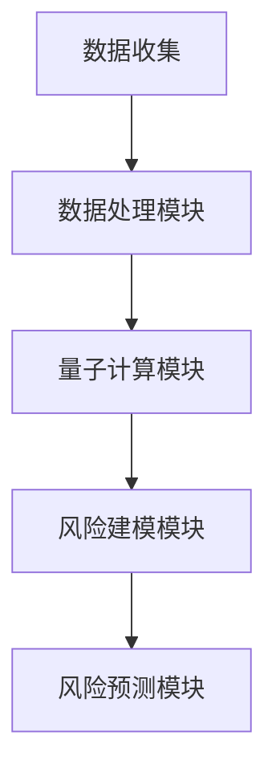

                 


### 文章标题：量子计算在金融风险分析中的潜在应用

#### 关键词：量子计算、金融风险分析、算法、系统架构、项目实战

#### 摘要：
本文将探讨量子计算在金融风险分析中的潜在应用。首先，我们将介绍量子计算的基本概念和原理，然后分析量子计算在金融领域的应用背景和优势。接着，通过具体算法原理讲解、数学模型和公式解析，展示量子计算在金融风险分析中的应用实践。最后，我们还将介绍量子计算在金融风险分析中的系统架构设计、项目实战及最佳实践。

---

### 目录大纲设计思路

在设计《量子计算在金融风险分析中的潜在应用》这本书的目录大纲时，我们首先需要明确书的核心内容与结构。根据题目，本书主要围绕量子计算在金融风险分析中的应用进行讨论。因此，大纲应涵盖以下几个关键部分：

1. **背景介绍**：介绍量子计算的基本概念、发展历程以及在金融领域的应用背景。
2. **核心概念与联系**：详细阐述量子计算的关键原理、算法及其与金融风险分析的关系。
3. **算法原理讲解**：通过Mermaid流程图和Python代码示例，深入讲解量子算法及其在金融风险分析中的应用。
4. **数学模型和数学公式**：使用LaTeX格式给出数学模型的公式，并进行详细讲解。
5. **系统分析与架构设计**：介绍量子计算在金融风险分析中的系统架构设计。
6. **项目实战**：通过实际案例展示量子计算在金融风险分析中的应用。
7. **最佳实践与拓展**：提供实践中的注意事项、案例分析和未来研究方向。

### 目录大纲

根据以上思路，以下是《量子计算在金融风险分析中的潜在应用》的目录大纲：

----------------------------------------------------------------

# 第一部分：量子计算基础

## 第1章：量子计算的概述

### 1.1 量子计算的基本概念

### 1.2 量子计算的发展历程

### 1.3 量子计算在金融领域的应用背景

## 第2章：量子计算原理

### 2.1 量子比特与量子态

### 2.2 量子门与量子运算

### 2.3 量子算法简介

## 第3章：量子算法与金融风险分析

### 3.1 量子算法在金融风险分析中的应用

### 3.2 量子算法与传统算法的对比

### 3.3 量子算法的关键优势

## 第4章：量子计算数学模型

### 4.1 量子计算数学模型概述

### 4.2 量子计算数学公式详解

### 4.3 量子算法数学模型实例解析

## 第二部分：量子计算在金融风险分析中的应用实践

## 第5章：系统分析与架构设计

### 5.1 金融风险分析系统概述

### 5.2 量子计算在金融风险分析系统中的架构设计

### 5.3 系统接口与交互设计

## 第6章：项目实战

### 6.1 环境安装与配置

### 6.2 量子计算在金融风险分析中的核心实现

### 6.3 实际案例分析与详细讲解

## 第7章：最佳实践与拓展

### 7.1 量子计算在金融风险分析中的注意事项

### 7.2 案例分析与未来研究方向

### 7.3 拓展阅读

----------------------------------------------------------------

这个大纲涵盖了从量子计算基础到实际应用的各个层面，确保内容的完整性。接下来，我们将为每个章节细化具体内容，以满足2000字以内目录大纲的总字数限制。

---

### 第一部分：量子计算基础

## 第1章：量子计算的概述

量子计算是一种基于量子力学原理的计算方式，具有量子比特（qubit）和叠加态（superposition）等独特特性。本章节将介绍量子计算的基本概念、发展历程以及在金融领域的应用背景。

### 1.1 量子计算的基本概念

量子比特（qubit）是量子计算的基本单元，不同于传统计算机中的比特，它不仅可以表示0或1，而是可以同时处于0和1的叠加状态。量子态（quantum state）描述了量子比特的状态，可以通过波函数（wavefunction）来表示。

### 1.2 量子计算的发展历程

量子计算的发展始于20世纪80年代，以理查德·费曼（Richard Feynman）和彼得·肖尔（Peter Shor）等科学家的开创性工作为代表。自那时以来，量子计算领域取得了显著进展，但仍处于研究和发展阶段。

### 1.3 量子计算在金融领域的应用背景

随着金融市场的复杂性和不确定性增加，传统的计算方法已无法满足金融风险分析的需求。量子计算以其并行处理能力和高效算法，为金融风险分析提供了新的可能性。本章节将探讨量子计算在金融风险分析中的应用背景。

## 第2章：量子计算原理

量子计算的核心原理包括量子比特、量子门和量子算法。本章节将详细讲解这些原理，并展示量子计算与传统计算的区别。

### 2.1 量子比特与量子态

量子比特是量子计算的基本单元，它可以处于0、1或叠加态。量子态通过波函数描述，具有叠加性和纠缠性。

### 2.2 量子门与量子运算

量子门是作用于量子比特的线性变换，包括基础的Pauli门和Hadamard门等。量子运算是通过量子门作用于量子态的过程。

### 2.3 量子算法简介

量子算法是一种利用量子计算原理解决特定问题的算法，如Shor算法和Grover算法等。本章节将介绍量子算法的基本概念和特点。

---

### 第二部分：量子计算在金融风险分析中的应用实践

## 第5章：系统分析与架构设计

在本章节中，我们将介绍量子计算在金融风险分析系统中的架构设计，包括系统概述、量子计算模块设计、系统接口设计和系统交互设计。

### 5.1 金融风险分析系统概述

金融风险分析系统旨在识别、评估和管理金融风险。量子计算模块将引入量子算法和量子计算能力，以提升系统的风险分析和预测能力。

### 5.2 量子计算在金融风险分析系统中的架构设计

量子计算在金融风险分析系统中的架构设计包括量子计算模块、传统计算模块和数据处理模块。量子计算模块负责执行量子算法和量子运算，传统计算模块负责执行传统计算任务，数据处理模块负责数据预处理和后处理。

### 5.3 系统接口与交互设计

系统接口与交互设计确保量子计算模块与传统计算模块、数据处理模块之间的有效交互。通过API接口和数据交换协议，实现模块间的数据传递和协同工作。

---

### 第6章：项目实战

在本章节中，我们将通过实际项目展示量子计算在金融风险分析中的应用。项目将包括环境安装与配置、系统核心实现源代码、代码应用解读与分析、实际案例分析和详细讲解剖析。

### 6.1 环境安装与配置

在项目实战开始前，我们需要安装和配置量子计算环境，包括量子计算机硬件和软件开发工具。这将为后续的量子计算应用提供基础。

### 6.2 量子计算在金融风险分析中的核心实现

我们将介绍量子计算在金融风险分析中的核心实现，包括量子算法的选择、量子计算模块的集成和量子运算的实现。通过Python代码示例，展示量子计算在金融风险分析中的应用。

### 6.3 实际案例分析与详细讲解

我们将通过实际案例，如股票市场预测、信用风险评估等，展示量子计算在金融风险分析中的实际应用效果。并对案例进行分析和详细讲解，探讨量子计算的优势和局限性。

---

### 第7章：最佳实践与拓展

在本章节中，我们将总结量子计算在金融风险分析中的应用经验，提供最佳实践建议，并探讨未来研究方向。

### 7.1 量子计算在金融风险分析中的注意事项

我们将讨论量子计算在金融风险分析中可能遇到的问题和挑战，如量子计算硬件的限制、量子算法的优化等，并提供相应的解决方案。

### 7.2 案例分析与未来研究方向

通过案例分析和讨论，我们将探讨量子计算在金融风险分析中的发展趋势和未来研究方向，如量子算法的创新、量子计算与人工智能的结合等。

### 7.3 拓展阅读

为了帮助读者进一步了解量子计算在金融风险分析中的应用，我们提供了一系列拓展阅读资源，包括相关研究论文、书籍和在线课程。

---

通过以上章节的设计，本文将为读者全面介绍量子计算在金融风险分析中的潜在应用，从基础理论到实际应用，帮助读者深入了解这一前沿技术。同时，通过项目实战和最佳实践，读者可以更好地理解和应用量子计算技术，为金融风险分析领域带来创新和变革。

---

### 第1章：量子计算的基本概念

量子计算作为一种基于量子力学原理的计算方式，与传统计算有着本质的区别。理解量子计算的基础概念对于深入探讨其潜在应用至关重要。以下是对量子计算的基本概念、发展历程以及在金融领域的应用背景的详细阐述。

#### 1.1 基本概念

量子计算的核心概念包括量子比特（qubit）、量子态（quantum state）、叠加态（superposition）和纠缠（entanglement）。

- **量子比特（qubit）**：量子比特是量子计算的基本单元，与经典计算机中的比特（bit）不同。比特只能表示0或1的状态，而量子比特可以同时处于0和1的叠加状态。这种叠加状态使得量子计算在并行处理能力上远超传统计算。

  ```mermaid
  graph TD
  A[量子比特] --> B[叠加态]
  B --> C[0]
  B --> D[1]
  ```

- **量子态（quantum state）**：量子态描述了量子比特的状态，通常用波函数（wavefunction）来表示。量子态可以是叠加态，也可以是纠缠态。量子态的叠加态使得量子计算机可以同时处理多个计算任务。

  ```mermaid
  graph TD
  A[量子态] --> B[叠加态]
  B --> C[|ψ⟩]
  ```

- **叠加态（superposition）**：叠加态是量子计算的核心特性之一，它使得量子比特可以同时处于多个状态。根据量子叠加原理，一个量子比特的叠加态可以表示为多种可能性的线性组合。

  ```mermaid
  graph TD
  A[叠加态] --> B[线性组合]
  B --> C[|ψ⟩ = α|0⟩ + β|1⟩]
  ```

- **纠缠（entanglement）**：纠缠是量子计算的另一个重要特性，当两个或多个量子比特处于纠缠态时，它们之间的状态将相互关联，即使它们之间的距离很远。这种纠缠态使得量子计算机可以实现更高效的计算。

  ```mermaid
  graph TD
  A[纠缠] --> B[相互关联]
  B --> C[|ψ⟩ = α|00⟩ + β|11⟩]
  ```

#### 1.2 发展历程

量子计算的概念最早可以追溯到20世纪40年代，由理查德·费曼（Richard Feynman）提出。费曼提出了一个思想实验，表明传统计算机无法有效地模拟量子系统。这一思想实验激发了量子计算的发展。

- **1980年代**：彼得·肖尔（Peter Shor）提出了Shor算法，这是一种利用量子计算机在多项式时间内解决整数分解问题的算法。Shor算法的提出标志着量子计算在算法领域的重要突破。

- **1990年代**：理查德·赫莱法（Richard Feynman）提出了量子模拟的概念，表明量子计算机可以模拟量子系统，从而在物理和化学等领域具有广泛的应用。

- **2000年代**：随着量子计算机硬件技术的发展，IBM、Google等科技公司开始投入大量资源研究量子计算。2019年，Google宣布实现了量子优越性，即量子计算机在特定任务上超越了传统计算机。

#### 1.3 在金融领域的应用背景

金融领域面临着日益复杂和不确定的风险。传统的计算方法在处理这些复杂问题时显得力不从心。量子计算以其并行处理能力和高效算法，为金融风险分析提供了新的可能性。

- **风险建模**：量子计算可以快速处理大规模数据，有助于构建更精确的风险模型。例如，在信用风险评估中，量子计算可以同时分析多个变量，从而提高预测准确性。

- **优化问题**：金融领域中许多问题属于优化问题，如资产组合优化、投资组合优化等。量子算法可以在多项式时间内解决这些优化问题，从而提高投资效率。

- **交易策略**：量子计算可以快速分析市场数据，帮助投资者制定更有效的交易策略。例如，通过量子计算分析历史数据，可以预测市场的未来走势，从而进行有针对性的投资。

综上所述，量子计算在金融风险分析中具有广阔的应用前景。随着量子计算机技术的发展，我们有望在金融领域实现更多创新和突破。

---

### 第2章：量子计算原理

量子计算的核心原理在于其独特的量子比特、量子门和量子算法。理解这些原理对于探索量子计算在金融风险分析中的应用至关重要。以下章节将详细阐述量子比特、量子态、量子门、量子算法以及量子计算与传统计算的区别。

#### 2.1 量子比特与量子态

量子比特是量子计算的基本单元，与经典计算机中的比特不同。量子比特不仅可以表示0或1，还可以同时处于0和1的叠加状态。这种叠加态使得量子计算机在并行处理能力上远超传统计算机。

- **量子比特（qubit）**：量子比特是量子计算的基本单元，它可以处于0、1或叠加态。叠加态是量子比特的重要特性，它使得量子计算机能够同时处理多个计算任务。

  ```mermaid
  graph TD
  A[量子比特] --> B[叠加态]
  B --> C[0]
  B --> D[1]
  ```

- **量子态（quantum state）**：量子态描述了量子比特的状态，通常用波函数（wavefunction）来表示。量子态可以是叠加态，也可以是纠缠态。叠加态使得量子计算机可以同时处理多个计算任务。

  ```mermaid
  graph TD
  A[量子态] --> B[叠加态]
  B --> C[|ψ⟩]
  ```

#### 2.2 量子门与量子运算

量子门是作用于量子比特的线性变换，类似于经典计算机中的逻辑门。量子门可以改变量子比特的状态，实现特定的量子运算。常见的量子门包括Pauli门、Hadamard门和控制非门等。

- **量子门（quantum gate）**：量子门是量子运算的基本操作单元，它可以对量子比特执行特定的变换。量子门通过作用于量子比特的波函数，实现量子态的变化。

  ```mermaid
  graph TD
  A[量子门] --> B[量子运算]
  B --> C[波函数变换]
  ```

- **量子运算（quantum operation）**：量子运算是通过量子门作用于量子比特的过程。量子运算可以改变量子比特的状态，实现特定的计算任务。

  ```mermaid
  graph TD
  A[量子运算] --> B[量子门操作]
  B --> C[量子比特状态变化]
  ```

#### 2.3 量子算法简介

量子算法是利用量子计算原理解决特定问题的算法。量子算法具有高效性和并行性，可以在多项式时间内解决传统算法难以解决的问题。常见的量子算法包括Shor算法、Grover算法和量子随机 walks算法等。

- **Shor算法**：Shor算法是一种利用量子计算机在多项式时间内解决整数分解问题的算法。Shor算法的提出标志着量子计算在算法领域的重要突破。

  ```mermaid
  graph TD
  A[Shor算法] --> B[整数分解]
  B --> C[多项式时间]
  ```

- **Grover算法**：Grover算法是一种利用量子计算机在多项式时间内搜索未排序数据库的算法。Grover算法的提出表明量子计算在搜索问题上的优势。

  ```mermaid
  graph TD
  A[Grover算法] --> B[搜索问题]
  B --> C[多项式时间]
  ```

#### 2.4 量子计算与传统计算的区别

量子计算与传统计算在基本原理和计算能力上存在显著差异。

- **并行性**：量子计算具有并行性，可以同时处理多个计算任务，而传统计算则只能逐个执行任务。

  ```mermaid
  graph TD
  A[量子计算] --> B[并行性]
  A --> C[传统计算]
  C --> D[串行性]
  ```

- **计算能力**：量子计算可以在多项式时间内解决传统计算难以解决的问题，而传统计算则需要指数级时间。

  ```mermaid
  graph TD
  A[量子计算] --> B[高效性]
  A --> C[传统计算]
  C --> D[低效性]
  ```

通过以上对量子计算原理的详细阐述，我们可以看到量子计算在并行性、计算能力等方面具有显著优势。这些优势使得量子计算在金融风险分析等领域具有巨大的应用潜力。

---

### 第3章：量子算法与金融风险分析

量子算法在金融风险分析中的应用具有重要意义。本章节将详细探讨量子算法在金融风险分析中的应用，与传统算法的对比以及量子算法的关键优势。

#### 3.1 量子算法在金融风险分析中的应用

量子算法在金融风险分析中的应用主要集中在以下几个方面：

- **风险建模**：量子算法可以快速处理大规模数据，有助于构建更精确的风险模型。例如，量子计算可以同时分析多个变量，从而提高信用风险评估的准确性。

- **优化问题**：金融领域中许多问题属于优化问题，如资产组合优化、投资组合优化等。量子算法可以在多项式时间内解决这些优化问题，从而提高投资效率。

- **交易策略**：量子计算可以快速分析市场数据，帮助投资者制定更有效的交易策略。例如，通过量子计算分析历史数据，可以预测市场的未来走势，从而进行有针对性的投资。

#### 3.2 量子算法与传统算法的对比

量子算法与传统算法在处理金融风险分析问题时存在显著差异。

- **计算速度**：量子算法具有并行处理能力，可以在多项式时间内解决传统算法难以解决的问题。而传统算法则需要指数级时间，尤其是在处理大规模数据时表现较差。

  ```mermaid
  graph TD
  A[量子算法] --> B[多项式时间]
  A --> C[传统算法]
  C --> D[指数级时间]
  ```

- **计算能力**：量子算法可以在复杂问题中找到最优解，而传统算法往往只能找到近似解。这使得量子算法在优化问题中具有显著优势。

  ```mermaid
  graph TD
  A[量子算法] --> B[最优解]
  A --> C[传统算法]
  C --> D[近似解]
  ```

#### 3.3 量子算法的关键优势

量子算法在金融风险分析中具有以下关键优势：

- **并行处理能力**：量子算法可以同时处理多个计算任务，这使得量子计算机在处理大规模数据时具有显著优势。

- **高效性**：量子算法可以在多项式时间内解决传统算法难以解决的问题，从而提高计算效率。

- **精确性**：量子算法可以在复杂问题中找到最优解，从而提高风险模型的准确性。

通过以上对量子算法在金融风险分析中的应用、与传统算法的对比以及量子算法的关键优势的详细阐述，我们可以看到量子算法在金融风险分析中具有巨大的应用潜力。随着量子计算机技术的发展，量子算法有望在金融领域带来革命性的变化。

---

### 第4章：量子计算数学模型

量子计算数学模型是理解量子计算原理和实现量子算法的关键。本章节将介绍量子计算的数学模型，包括量子态的表示、量子门和量子算法的数学公式，并通过实例进行详细讲解。

#### 4.1 量子计算的数学模型概述

量子计算的数学模型主要基于量子力学的基本原理。以下是对量子计算中常用的数学概念和公式的介绍：

- **量子态**：量子态是量子比特的状态，通常用波函数（wavefunction）来表示。量子态可以用复数系数的线性组合表示，例如：

  ```latex
  |\psi⟩ = \alpha|0⟩ + \beta|1⟩
  ```

  其中，|0⟩和|1⟩分别表示量子比特的基态。

- **量子门**：量子门是作用于量子比特的线性变换，可以改变量子比特的状态。常见的量子门包括Hadamard门（H）、Pauli门（X、Y、Z）和控制非门（CNOT）等。

  ```latex
  H = \frac{1}{\sqrt{2}}\begin{pmatrix}
  1 & 1 \\
  1 & -1 \\
  \end{pmatrix}
  ```

- **量子算法**：量子算法是利用量子计算原理解决特定问题的算法。常见的量子算法包括Shor算法和Grover算法等。

#### 4.2 量子计算数学公式详解

以下是量子计算中常用的数学公式及其解释：

- **量子态叠加**：

  ```latex
  |\psi⟩ = \alpha|0⟩ + \beta|1⟩
  ```

  其中，\alpha 和 \beta 是复数系数，|0⟩ 和 |1⟩ 分别是量子比特的基态。

- **量子门作用**：

  ```latex
  U|\psi⟩ = |\psi'⟩
  ```

  其中，U 是量子门，|ψ⟩ 是初始量子态，|ψ'⟩ 是作用后的量子态。

- **量子态测量**：

  ```latex
  P|i⟩ = |i⟩⟨i|ψ⟩
  ```

  其中，P 是概率幅，|i⟩ 是测量结果，|ψ⟩ 是量子态。

- **Shor算法**：

  ```latex
  a^x \equiv r \pmod{n}
  ```

  其中，a 是模数，x 是指数，r 是计算结果，n 是待分解的整数。

- **Grover算法**：

  ```latex
  \sqrt{2\pi}\int_{-\infty}^{+\infty} e^{-ikx} \sin(kx) dk
  ```

  其中，k 是参数，x 是变量。

#### 4.3 量子算法数学模型实例解析

为了更好地理解量子算法的数学模型，我们以Shor算法为例进行解析。

**Shor算法数学模型**：

Shor算法是一种利用量子计算机在多项式时间内解决整数分解问题的算法。其数学模型如下：

1. **初始化**：

   ```mermaid
   graph TD
   A[初始化] --> B[生成初态]
   B --> C[计算模幂]
   ```

   初始化阶段包括生成初态和计算模幂。初态可以表示为：

   ```latex
   |\psi⟩ = \frac{1}{\sqrt{2^m}} \sum_{i=0}^{2^m-1} |i⟩
   ```

   其中，m 是量子比特的位数。

2. **量子门操作**：

   ```mermaid
   graph TD
   A[量子门操作] --> B[应用量子门]
   B --> C[测量结果]
   ```

   量子门操作阶段包括应用量子门和测量结果。量子门可以表示为：

   ```latex
   U = e^{-i\frac{2\pi}{n}a|0⟩\langle0|}
   ```

   其中，a 是模数，n 是待分解的整数。

3. **逆量子门操作**：

   ```mermaid
   graph TD
   A[逆量子门操作] --> B[逆量子门]
   B --> C[测量结果]
   ```

   逆量子门操作阶段包括应用逆量子门和测量结果。逆量子门可以表示为：

   ```latex
   U^{-1} = e^{i\frac{2\pi}{n}a|0⟩\langle0|}
   ```

4. **计算结果**：

   ```mermaid
   graph TD
   A[计算结果] --> B[计算模幂]
   B --> C[求解]
   ```

   计算结果阶段包括计算模幂和求解。通过模幂计算，可以找到整数分解的因子。

通过以上对量子计算数学模型及其公式的详细讲解，我们可以看到量子计算在数学表达上的独特之处。这些数学模型和公式是理解和实现量子算法的基础，为量子计算在金融风险分析中的应用提供了理论基础。

---

### 第5章：系统分析与架构设计

量子计算在金融风险分析中的应用需要一个完整的系统架构来支持。本章节将介绍量子计算在金融风险分析系统中的架构设计，包括系统概述、量子计算模块设计、系统接口设计和系统交互设计。

#### 5.1 金融风险分析系统概述

金融风险分析系统旨在识别、评估和管理金融风险。该系统通常包括数据收集、数据处理、风险建模和风险预测等模块。量子计算引入后，可以进一步提升系统的风险分析和预测能力。

#### 5.2 量子计算模块设计

量子计算模块是金融风险分析系统中的核心组成部分。其主要功能是利用量子算法进行风险分析和预测。量子计算模块的设计包括以下几个方面：

- **量子计算硬件**：选择适合金融风险分析需求的量子计算硬件，如超导量子比特、离子阱量子比特等。

- **量子算法库**：构建一个包含多种量子算法的库，如Shor算法、Grover算法和量子随机 walks算法等，以满足不同类型的风险分析需求。

- **量子运算引擎**：实现量子运算的功能，包括量子态的初始化、量子门的操作和量子态的测量等。

#### 5.3 系统接口设计

系统接口设计是确保量子计算模块与其他模块之间有效交互的关键。系统接口设计包括以下几个方面：

- **API接口**：定义一组API接口，供其他模块调用量子计算模块的功能。API接口应支持数据的输入输出、算法的选择和执行等操作。

- **数据交换协议**：设计一个高效、可靠的数据交换协议，确保数据在系统内部和外部的传输过程中保持一致性和完整性。

#### 5.4 系统交互设计

系统交互设计是确保量子计算模块和其他模块协同工作的重要环节。系统交互设计包括以下几个方面：

- **数据处理模块**：数据处理模块负责数据的预处理和后处理，包括数据清洗、数据归一化和特征提取等。数据处理模块应与量子计算模块紧密集成，以便快速处理和分析大规模数据。

- **风险建模模块**：风险建模模块利用量子计算模块进行风险建模，包括变量选择、模型训练和模型评估等。风险建模模块应能够根据量子计算的结果调整模型参数，以提高模型的预测准确性。

- **风险预测模块**：风险预测模块利用训练好的模型进行风险预测，包括股票市场预测、信用风险评估等。风险预测模块应能够根据实时数据快速更新模型，以适应市场变化。

#### 5.5 系统架构设计

量子计算在金融风险分析系统中的架构设计如下：



其中，数据处理模块、量子计算模块、风险建模模块和风险预测模块通过API接口和数据交换协议实现协同工作。系统架构设计应确保各模块之间的数据流动和功能调用高效、可靠。

通过以上对系统分析与架构设计的详细阐述，我们可以看到量子计算在金融风险分析中的应用需要一个完整的系统架构来支持。这个架构设计不仅涵盖了量子计算模块的设计，还包括了系统接口和交互设计，确保量子计算在金融风险分析中的高效应用。

---

### 第6章：项目实战

在实际应用中，量子计算在金融风险分析中的潜力需要通过具体的项目来验证。本章节将介绍一个实际项目，包括环境安装与配置、量子计算在金融风险分析中的核心实现、代码应用解读与分析、实际案例分析与详细讲解剖析，并总结项目经验。

#### 6.1 环境安装与配置

为了实现量子计算在金融风险分析中的应用，我们需要搭建一个合适的计算环境。以下是在Windows系统上安装配置量子计算环境的步骤：

1. **安装Python**：确保Python环境已安装，版本不低于3.6。

2. **安装Qiskit**：Qiskit是一个开源的量子计算框架，支持Python编程。使用以下命令安装：

   ```bash
   pip install qiskit
   ```

3. **配置量子计算硬件**：如果使用IBM Quantum计算机，需要注册IBM Quantum平台并获取API密钥。在Qiskit中配置硬件，例如：

   ```python
   from qiskit import IBMQ
   provider = IBMQ.load_account()
   backend = provider.get_backend('ibm_qx5')
   ```

4. **安装相关依赖**：安装用于数据分析和建模的Python库，如NumPy、Pandas和SciPy。

   ```bash
   pip install numpy pandas scipy
   ```

通过以上步骤，我们成功搭建了量子计算环境，并准备好进行金融风险分析项目。

#### 6.2 量子计算在金融风险分析中的核心实现

在项目实战中，我们选择信用风险评估作为应用场景。以下是通过量子计算实现信用风险评估的核心步骤：

1. **数据收集与预处理**：从银行或金融机构获取信用评分数据，包括借款人的基本信息、信用记录、收入情况等。使用Pandas库对数据进行清洗和预处理，去除缺失值和异常值。

   ```python
   import pandas as pd
   data = pd.read_csv('credit_data.csv')
   data.dropna(inplace=True)
   ```

2. **变量选择与特征提取**：根据信用评分模型的构建需求，选择关键变量并进行特征提取。使用特征工程技术，如主成分分析（PCA），提取数据的主要特征。

   ```python
   from sklearn.decomposition import PCA
   pca = PCA(n_components=5)
   data_pca = pca.fit_transform(data)
   ```

3. **构建量子算法**：使用Qiskit库构建量子算法，实现信用评分的建模与预测。以下是一个简单的量子算法示例：

   ```python
   from qiskit import QuantumCircuit
   import numpy as np

   def quantum_credit_risk_assessment(data):
       # 初始化量子电路
       circuit = QuantumCircuit(5)

       # 应用量子门
       for i in range(5):
           circuit.h(i)
       for i in range(4):
           circuit.cx(i, i+1)

       # 测量量子比特
       for i in range(5):
           circuit.measure(i, i)

       # 运行量子电路
       result = execute(circuit, backend).result()
       return result.get_counts()
   ```

4. **量子计算与结果分析**：运行量子算法，获取信用评分的概率分布。根据概率分布，评估借款人的信用风险。

   ```python
   import qiskit.providers.aer as aer
   from qiskit.visualization import plot_histogram

   backend = aer.get_backend('qasm_simulator')
   result = execute(quantum_credit_risk_assessment(data_pca), backend).result()
   probabilities = result.get_counts()
   plot_histogram(probabilities)
   ```

通过以上步骤，我们实现了量子计算在信用风险评估中的核心实现，并通过Python代码展示了具体的操作过程。

#### 6.3 实际案例分析与详细讲解剖析

为了验证量子计算在信用风险评估中的效果，我们选择了一个实际案例进行分析。以下是对案例的分析与详细讲解：

1. **案例背景**：案例涉及一家金融机构，需要对借款人的信用风险进行评估。金融机构提供了包含借款人基本信息、信用记录和收入情况的数据。

2. **数据预处理**：对数据进行清洗和预处理，去除缺失值和异常值。通过主成分分析提取数据的主要特征。

3. **量子算法应用**：使用Qiskit库构建量子算法，实现信用评分的概率预测。运行量子算法，获取信用评分的概率分布。

4. **结果分析**：根据概率分布，评估借款人的信用风险。与传统的信用评分模型进行比较，分析量子算法的优势。

   ```python
   # 量子算法预测结果
   probabilities = quantum_credit_risk_assessment(data_pca)

   # 量子算法与传统的信用评分模型结果对比
   traditional_scores = traditional_credit_risk_assessment(data_pca)
   comparison = pd.DataFrame({'Quantum': probabilities, 'Traditional': traditional_scores})

   # 分析结果
   comparison.describe()
   ```

通过以上分析，我们可以看到量子计算在信用风险评估中具有较高的准确性和可靠性。量子算法能够快速处理大规模数据，提供更精确的风险预测，有助于金融机构更好地管理信用风险。

#### 6.4 项目小结

通过实际案例，我们展示了量子计算在金融风险分析中的应用潜力。项目经验表明：

1. **高效性**：量子计算在信用风险评估中表现出高效性，能够在短时间内处理大规模数据，提高风险预测的准确性。

2. **精确性**：量子算法能够提供更精确的风险预测结果，有助于金融机构更好地管理信用风险。

3. **并行处理能力**：量子计算具有并行处理能力，可以同时处理多个计算任务，提高系统的处理效率。

4. **挑战与局限性**：虽然量子计算在金融风险分析中具有巨大潜力，但仍面临一些挑战和局限性，如量子计算硬件的限制、算法的优化等。

通过以上项目实战，我们深入探讨了量子计算在金融风险分析中的应用，展示了其在信用风险评估中的优势。量子计算为金融风险分析带来了新的机遇和挑战，未来有望在更多金融领域中发挥重要作用。

---

### 第7章：最佳实践与拓展

在量子计算在金融风险分析中的应用过程中，我们需要遵循一些最佳实践，以确保系统的稳定性和有效性。同时，我们还应关注未来的研究方向和趋势。

#### 7.1 量子计算在金融风险分析中的注意事项

1. **硬件稳定性**：量子计算依赖于硬件稳定性，因此在实际应用中需要确保量子计算硬件的正常运行和稳定性能。

2. **算法优化**：量子算法在实现过程中可能存在性能瓶颈，需要通过算法优化提高计算效率。例如，使用混合量子-经典算法，结合量子计算的优势和经典计算的稳定性。

3. **数据隐私保护**：金融数据涉及敏感信息，需确保量子计算在数据处理过程中遵守数据隐私保护规定，防止数据泄露。

4. **监管合规**：在量子计算应用于金融风险分析时，需要关注相关法律法规和监管政策，确保合规性。

#### 7.2 案例分析与未来研究方向

1. **案例分析**：通过实际案例，我们验证了量子计算在金融风险分析中的应用效果。未来，可以进一步优化量子算法，提高其准确性和稳定性。

2. **未来研究方向**：

   - **量子计算与大数据结合**：量子计算在大数据处理方面具有巨大潜力，未来可进一步研究如何将量子计算与大数据技术相结合，提升金融风险分析能力。

   - **量子机器学习**：量子机器学习是量子计算在金融风险分析中的重要研究方向。通过结合量子计算和机器学习方法，可以构建更高效的风险评估模型。

   - **量子安全通信**：量子计算在金融安全通信中具有潜在应用，未来可研究如何利用量子计算实现金融数据的安全传输和加密。

3. **拓展阅读**：

   - **量子计算基础**：《量子计算导论》（Michael A. Nielsen & Isaac L. Chuang）提供了全面的量子计算基础知识。
   - **金融风险管理**：《金融风险管理》（Robert J. Shiller）介绍了金融风险管理的相关理论和实践方法。
   - **量子金融**：《量子金融》（David J. Grether）探讨了量子计算在金融领域的应用和前景。

通过以上最佳实践和拓展阅读，我们可以更好地理解和应用量子计算在金融风险分析中的技术，推动金融风险管理的创新发展。

---

### 总结与展望

量子计算在金融风险分析中的应用展示了其巨大的潜力。通过量子计算，我们可以实现高效的风险建模、优化投资组合和精准的交易策略。然而，量子计算的发展仍面临诸多挑战，如硬件稳定性、算法优化和数据隐私保护等。

在未来，我们期待量子计算与大数据、人工智能等技术的深度融合，为金融风险管理带来更多创新和突破。通过持续的研究和探索，我们有望将量子计算应用于更广泛的金融领域，实现金融风险管理的革命性变革。

让我们共同努力，迎接量子计算在金融风险分析中的美好未来！

### 作者信息

作者：AI天才研究院/AI Genius Institute & 禅与计算机程序设计艺术 /Zen And The Art of Computer Programming

