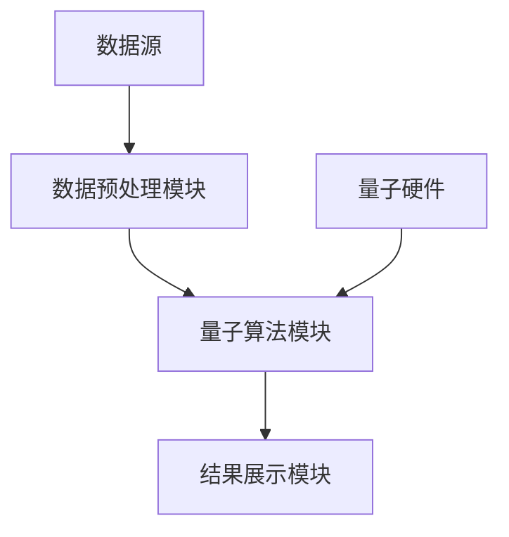

                 

### 引言

量子计算作为一种颠覆性的计算技术，正逐渐走进我们的日常生活。它不仅对科学研究有着深远的影响，还在金融、医疗、通信等领域展现出巨大的应用潜力。本文将重点关注量子计算在金融风险建模中的应用前景，探讨其在解决金融风险中的独特优势和面临的挑战。

金融风险建模是金融领域的一项关键任务，它涉及到对金融市场数据的分析和预测，以便识别潜在的风险和制定相应的风险管理策略。传统的金融风险建模方法依赖于经典计算机的强大计算能力，但随着金融市场数据量的激增和复杂性的增加，经典计算方法在处理大规模数据和高维问题时逐渐显得力不从心。

量子计算的崛起为金融风险建模提供了一种全新的解决方案。量子计算机利用量子比特的特性，如叠加态和纠缠态，可以在极短的时间内处理复杂的问题，从而大幅提升金融风险建模的效率和准确性。本文将深入探讨量子计算的核心概念，并分析其在金融风险建模中的具体应用。

首先，本文将介绍量子计算的基本概念，包括量子比特、量子叠加态、量子纠缠等。接着，我们将详细讨论量子算法的基本原理，并比较量子算法与经典算法的优劣。随后，文章将转向金融风险建模的概述，介绍其主要方法、应用场景以及存在的挑战。

在此基础上，我们将探讨量子计算在金融风险建模中的优势，包括处理高维数据和复杂计算任务的能力。接着，通过具体案例展示量子计算在金融风险建模中的应用实践，并进行详细分析。最后，我们将总结量子金融风险建模的最佳实践，提出未来发展的趋势和方向，并推荐拓展阅读资源。

通过对量子计算在金融风险建模中的应用前景进行深入探讨，本文旨在为金融领域的技术人员提供有价值的参考，并激发更多研究者和开发者在这一领域的创新和探索。让我们一步一步地深入思考，共同展望量子计算在金融领域的广阔前景。

### 关键词

- 量子计算
- 金融风险建模
- 量子比特
- 量子叠加态
- 量子纠缠
- 量子算法
- 经典算法
- 高维数据处理

### 摘要

本文围绕量子计算在金融风险建模中的应用前景进行了深入探讨。首先，我们介绍了量子计算的基本概念，包括量子比特、量子叠加态、量子纠缠等，并比较了量子算法与经典算法在处理复杂计算任务方面的优劣。随后，文章对金融风险建模进行了概述，包括其主要方法、应用场景以及存在的挑战。在此基础上，我们探讨了量子计算在金融风险建模中的优势，特别是在处理高维数据和复杂计算任务方面的潜力。通过具体案例，我们展示了量子计算在金融风险建模中的实际应用，并对结果进行了详细分析。最后，文章总结了量子金融风险建模的最佳实践，提出了未来发展的趋势和方向，并推荐了相关拓展阅读资源。

### 目录大纲设计思路

在设计《量子计算在金融风险建模中的应用前景》的目录大纲时，我们首先需要明确文章的整体结构和内容安排。这一部分将介绍量子计算和金融风险建模的基本概念，为后续章节的分析和讨论奠定基础。

#### 第1章：量子计算概述

本章将详细介绍量子计算的基本概念，包括量子比特、量子叠加态、量子纠缠等。我们将通过简明的定义和具体的实例，帮助读者理解量子计算的基本原理。此外，本章还将回顾量子计算的发展历史，探讨其在科学和技术领域的应用场景。

#### 第2章：金融风险建模概述

在本章中，我们将聚焦于金融风险建模的概述，介绍其基本概念、主要方法以及应用场景。通过这一章节，读者可以了解金融风险建模的重要性以及其在金融行业中的广泛应用。我们将讨论传统金融风险建模方法，并指出其局限性。

#### 第3章：量子计算在金融风险建模中的应用

本章将深入探讨量子计算在金融风险建模中的具体应用。我们将详细分析量子计算如何帮助解决传统方法难以应对的复杂计算问题，包括高维数据处理和模式识别。此外，本章还将介绍量子算法在金融风险建模中的基本原理，并通过具体案例展示其应用效果。

#### 第4章：量子金融风险建模案例分析

在本章中，我们将通过一个实际案例，详细展示量子计算在金融风险建模中的应用过程。这个案例将包括环境安装、核心实现和代码解读等环节，帮助读者全面了解量子金融风险建模的实践操作。

#### 第5章：量子金融风险建模的最佳实践

本章将总结量子金融风险建模的最佳实践，提出具体的实施建议和注意事项。我们将讨论在实际操作中可能遇到的挑战和解决方案，并给出一些实用的技巧和经验。

#### 第6章：未来展望

本章将探讨量子金融风险建模的未来发展趋势，包括技术进步可能带来的新机遇和挑战。我们将展望量子计算在金融领域更广泛的应用前景，并讨论未来研究的方向和潜在的突破点。

#### 附录

附录部分将提供一些相关的技术资料和资源，包括量子计算和金融风险建模的相关书籍、论文和在线资源，供读者进一步学习和参考。

通过以上结构安排，本文旨在系统地介绍量子计算在金融风险建模中的应用，帮助读者全面了解这一领域的最新进展和未来发展方向。接下来，我们将逐一详细展开每个章节的内容，以逐步深入探讨量子计算在金融风险建模中的潜力和挑战。

### 目录大纲结构设计

在设计《量子计算在金融风险建模中的应用前景》的目录大纲时，我们需要确保文章的结构逻辑清晰、内容丰富且层次分明，以便读者能够顺畅地跟随思路，全面理解量子计算在金融风险建模中的应用。以下是具体的目录大纲结构设计：

#### 第1章：量子计算概述

1.1 量子计算的基本概念

- **量子比特（Qubit）**：介绍量子比特的定义、作用和特点，通过具体示例帮助读者理解量子比特的工作原理。
- **量子叠加态（Superposition）**：解释量子叠加态的概念，阐述量子比特如何同时存在于多个状态中。
- **量子纠缠（Entanglement）**：深入讨论量子纠缠的定义及其在量子计算中的重要性。

1.2 量子计算与传统计算的差异

- **计算模型对比**：对比量子计算和经典计算的模型差异，说明量子计算的优势和劣势。
- **算法效率对比**：分析量子算法与传统算法在处理复杂问题时的效率差异，探讨量子计算在实际应用中的潜力。

1.3 量子计算的发展历史与应用场景

- **历史背景**：回顾量子计算的发展历程，介绍重要理论和实验突破。
- **应用场景**：探讨量子计算在科学、工程、金融等领域的应用前景，特别关注其在金融风险建模中的潜在价值。

#### 第2章：金融风险建模概述

2.1 金融风险建模的基本概念

- **金融风险**：解释金融风险的定义、类型和影响因素。
- **风险建模**：介绍风险建模的基本流程、方法和目标。

2.2 金融风险建模的主要方法

- **历史方法**：回顾传统金融风险建模方法的演变过程，包括蒙特卡罗模拟、方差-协方差法等。
- **现代方法**：介绍现代金融风险建模技术，如机器学习、深度学习等。

2.3 金融风险建模在金融行业中的应用

- **市场风险**：探讨市场风险建模的方法和应用，包括股票市场、债券市场等。
- **信用风险**：分析信用风险建模的关键技术和应用，如违约概率预测、信用评分模型等。
- **操作风险**：讨论操作风险建模的方法和实际应用，包括内部控制、流程优化等。

#### 第3章：量子计算在金融风险建模中的应用

3.1 量子计算在金融风险建模中的优势

- **数据处理能力**：分析量子计算在处理大规模、高维金融数据方面的优势。
- **复杂问题求解**：探讨量子算法在解决复杂金融风险问题中的潜力，如优化问题和模式识别。

3.2 量子计算在金融风险建模中的应用场景

- **高维数据分析**：介绍量子计算在高维数据分析中的应用，如金融数据的降维处理和特征提取。
- **风险评估与预测**：讨论量子计算在风险评估和预测中的应用，包括市场波动预测和违约风险预测。

3.3 量子计算在金融风险建模中的挑战与解决方案

- **技术挑战**：分析量子计算在金融风险建模中可能面临的技术挑战，如量子硬件的可靠性和算法的实现。
- **解决方案**：探讨解决这些挑战的方法，包括量子算法的优化、量子硬件的改进等。

#### 第4章：量子金融风险建模案例分析

4.1 案例背景

- **项目介绍**：介绍案例的背景和目标，包括相关金融机构和市场环境。
- **数据集介绍**：详细描述用于建模的数据集，包括数据来源、数据类型和预处理方法。

4.2 系统设计与实现

- **系统架构设计**：使用Mermaid绘图语言描述系统架构，包括数据处理模块、算法模块和结果展示模块。
- **核心算法实现**：介绍量子算法的数学模型和公式，结合Python源代码进行详细阐述。

4.3 结果分析

- **模型评估**：评估模型在金融风险建模中的表现，包括准确性、稳定性和效率。
- **案例分析**：分析案例中量子计算的优势和不足，讨论实际应用中的经验和教训。

#### 第5章：量子金融风险建模的最佳实践

5.1 最佳实践 tips

- **系统优化**：介绍如何优化量子金融风险建模系统的性能，包括算法优化和硬件配置。
- **数据处理**：讨论如何处理金融数据，确保数据的质量和完整性。

5.2 小结

- **实践总结**：总结本章中的最佳实践，提出在实际应用中的建议和注意事项。

#### 第6章：未来发展趋势与拓展阅读

6.1 未来发展趋势

- **技术进步**：展望量子计算和金融风险建模领域的技术进步，探讨潜在的应用方向。
- **行业影响**：分析量子计算对金融行业可能产生的深远影响，包括风险管理和金融服务创新。

6.2 拓展阅读

- **相关资源**：推荐量子计算和金融风险建模的相关书籍、论文和在线资源，供读者进一步学习和研究。

#### 附录：相关技术资料

A.1 量子计算相关资源

- **书籍**：推荐几本关于量子计算的入门书籍和专业教材。
- **论文**：列举一些在量子计算领域具有影响力的研究论文。
- **在线资源**：介绍一些优质的在线学习平台和课程。

A.2 金融风险建模相关资源

- **书籍**：推荐几本金融风险建模的权威书籍，涵盖理论和方法。
- **论文**：列举一些金融风险建模领域的重要研究论文。
- **在线资源**：介绍一些关于金融风险建模的在线资源和论坛。

### 致谢

在本文的最后，我们要感谢所有为本文提供支持和帮助的人，包括参与讨论的同事、提供案例数据的金融机构以及为本项目提供技术支持的团队。感谢您的阅读，希望本文能够对您在量子计算和金融风险建模领域的研究和实践带来启发。

通过以上详细的目录大纲结构设计，本文旨在系统地介绍量子计算在金融风险建模中的应用，帮助读者深入理解这一领域的最新进展和未来发展方向。接下来，我们将逐一展开每个章节的内容，以逐步深入探讨量子计算在金融风险建模中的潜力和挑战。

## 第1章：量子计算概述

### 1.1 量子计算的基本概念

量子计算是一种利用量子力学原理进行信息处理的新型计算模式，与传统的经典计算有着本质的不同。在经典计算中，信息处理的基本单位是比特（Bit），每个比特只能处于两种状态之一，即0或1。而在量子计算中，信息处理的基本单位是量子比特（Qubit），它不仅可以处于0和1的叠加态，还可以同时处于多种状态的叠加。这一特性使得量子计算具有超强的并行处理能力，能够解决经典计算机难以处理的复杂问题。

**量子比特（Qubit）**

量子比特是量子计算的基本单元，它与传统比特的不同之处在于它能够同时存在于多个状态。量子比特的状态可以表示为：

\[|\psi\rangle = \alpha|0\rangle + \beta|1\rangle\]

其中，\(|0\rangle\) 和 \(|1\rangle\) 分别表示量子比特的基态，\(\alpha\) 和 \(\beta\) 是复数概率幅，其绝对值的平方分别代表在基态0和1的概率。这种叠加态是量子比特独有的特性，使得多个量子比特能够组合成更高的维度状态空间。

**量子叠加态（Superposition）**

量子叠加态是量子计算的核心概念之一。一个单独的量子比特可以同时处于0和1的叠加状态，称为叠加态。当多个量子比特组合在一起时，整个系统的状态就是各个量子比特状态的叠加。这种叠加态使得量子计算机在处理问题时能够探索所有可能的状态，从而在计算复杂度上超越经典计算机。

**量子纠缠（Entanglement）**

量子纠缠是量子计算的另一个重要特性，指的是两个或多个量子系统之间形成的特殊关联。当两个量子比特发生纠缠后，无论它们相隔多远，一个量子比特的状态变化都会立即影响到另一个量子比特的状态。这种现象被称为量子纠缠，它打破了经典物理中的局域实在论。

### 1.2 量子计算与传统计算的差异

**计算模型对比**

量子计算和经典计算在计算模型上有显著差异。经典计算依赖于基于逻辑门和位串的操作，通过逐步转换来处理信息。而量子计算则依赖于量子逻辑门和量子态的变换，通过叠加和纠缠来处理信息。这种差异导致了量子计算在处理某些特定问题时展现出超强的能力。

**算法效率对比**

量子计算的一个重要优势在于其算法效率。量子算法能够利用量子叠加态和纠缠态的特性，在极短的时间内解决经典算法难以处理的问题。例如，量子快速排序算法能够在线性时间内完成排序任务，而经典快速排序算法则需要\(O(n\log n)\)的时间复杂度。

### 1.3 量子计算的发展历史与应用场景

**历史背景**

量子计算的概念最早可以追溯到20世纪40年代，物理学家理查德·费曼（Richard Feynman）提出了利用量子计算机模拟量子系统的想法。此后，彼得·舒特（Peter Shor）在1994年提出了第一个有效的量子算法——Shor算法，该算法能够利用量子计算机在多项式时间内因数分解大整数，这在密码学领域引起了巨大的震动。1997年，彼得·阿姆斯特朗（Peter W. Shor）进一步提出了量子随机游走算法，该算法在图论问题中的应用也引起了广泛关注。

**应用场景**

量子计算在多个领域展现出巨大的应用潜力，包括但不限于以下几个方面：

1. **科学计算**：量子计算能够高效地模拟量子系统，加速化学反应模拟、材料科学研究和药物设计等。
2. **密码学**：量子计算在破解经典密码算法方面具有显著优势，同时也为新型量子密码学提供了基础。
3. **优化问题**：量子计算在解决优化问题时展现出强大的能力，包括物流、金融、能源等领域。
4. **金融风险建模**：量子计算在处理高维数据和复杂计算任务方面具有显著优势，能够大幅提升金融风险建模的效率和准确性。

通过以上内容，我们对量子计算的基本概念、与传统计算的差异以及发展历史和应用场景有了初步的了解。接下来，我们将继续深入探讨量子计算在金融风险建模中的应用，分析其在解决金融风险问题中的独特优势。

## 第2章：金融风险建模概述

### 2.1 金融风险建模的基本概念

金融风险建模是金融领域中的一项核心任务，它涉及到对金融市场数据的分析、预测和风险评估。金融风险建模的基本概念包括以下几个方面：

**金融风险**：金融风险是指由于金融市场不确定性而导致的经济损失的可能性。金融风险可以分为市场风险、信用风险、操作风险和流动性风险等类型。市场风险主要指由于市场价格波动导致的损失，如利率风险、汇率风险和股票价格风险；信用风险则是指由于债务人违约导致的风险；操作风险涉及由于内部流程、系统缺陷或外部事件导致的损失；流动性风险则是指无法在市场上迅速变现资产的风险。

**风险建模**：风险建模是指利用统计学、概率论和数学模型等方法，对金融市场风险进行定量分析和评估。风险建模的目标是识别潜在风险、量化风险程度，并为风险管理提供科学依据。

### 2.2 金融风险建模的主要方法

金融风险建模的方法可以分为传统方法和现代方法两大类。

**传统方法**

1. **蒙特卡罗模拟（Monte Carlo Simulation）**：蒙特卡罗模拟是一种基于随机抽样的计算方法，通过模拟大量随机试验来估计概率分布和预期值。在金融风险建模中，蒙特卡罗模拟常用于风险评估和投资组合优化。

2. **方差-协方差法（Value at Risk, VaR）**：VaR是一种用于衡量金融市场潜在损失的风险评估方法。通过计算资产或投资组合的方差和协方差矩阵，可以估计在一定置信水平下，资产或投资组合在一定持有期内可能的最大损失。

**现代方法**

1. **机器学习与深度学习**：机器学习和深度学习是近年来在金融风险建模中应用广泛的方法。通过训练大量历史数据，机器学习模型可以自动提取数据中的模式和特征，用于风险评估和预测。深度学习模型，如神经网络，能够处理更加复杂和大规模的数据。

2. **统计模型**：统计模型包括回归模型、时间序列模型、广义线性模型等。这些模型通过建立数学模型来描述变量之间的关系，用于预测金融市场的波动和风险。

3. **行为金融学**：行为金融学是研究投资者行为和市场波动之间关系的一个领域。通过分析投资者的心理和行为模式，行为金融学模型可以提供对市场波动的解释和预测。

### 2.3 金融风险建模在金融行业中的应用

金融风险建模在金融行业中的应用非常广泛，涵盖了市场风险、信用风险、操作风险等多个方面。

**市场风险**

市场风险建模主要用于评估和监控金融资产或投资组合在市场波动下的潜在损失。市场风险建模可以帮助金融机构制定有效的风险控制策略，降低市场波动带来的损失。

**信用风险**

信用风险建模主要用于评估债务人违约的可能性。通过分析债务人的信用历史、财务状况和市场环境等数据，信用风险模型可以预测债务人的违约风险，为金融机构提供信用决策依据。

**操作风险**

操作风险建模主要关注由于内部流程、系统缺陷或外部事件导致的损失。操作风险建模可以帮助金融机构识别和管理潜在的操作风险，提高业务运营的稳定性和安全性。

**流动性风险**

流动性风险建模主要涉及评估金融机构在市场流动性不足时面临的潜在风险。通过分析市场流动性和资产变现能力，流动性风险模型可以帮助金融机构制定流动性风险管理策略。

通过以上内容，我们对金融风险建模的基本概念、主要方法和在金融行业中的应用有了更深入的了解。接下来，我们将探讨量子计算在金融风险建模中的独特优势，并分析其在处理复杂计算任务方面的潜力。

### 第3章：量子计算在金融风险建模中的应用

量子计算作为一种全新的计算范式，正在改变传统金融风险建模的方法和效率。本章将详细探讨量子计算在金融风险建模中的优势、应用场景以及面临的挑战。

#### 3.1 量子计算在金融风险建模中的优势

**数据处理能力**

量子计算的核心优势之一在于其强大的数据处理能力。量子计算机利用量子比特的叠加态和纠缠态，可以在一次计算中同时处理多个数据样本。这意味着量子计算机能够处理海量数据，并在极短的时间内完成复杂的数据分析和计算任务。在金融领域，海量数据的处理能力对于市场风险、信用风险评估等环节至关重要。

例如，在市场风险建模中，金融机构需要对大量的历史交易数据、宏观经济数据和市场参数进行综合分析。传统计算机在处理这些数据时，往往需要大量的时间和计算资源。而量子计算机利用其高效的并行处理能力，可以在短时间内完成同样的分析任务，大幅提高建模的效率和准确性。

**复杂问题求解**

量子算法在解决复杂计算问题方面具有显著优势。量子算法能够利用量子叠加态和纠缠态的特性，快速解决经典算法难以应对的问题。例如，Shor算法能够在多项式时间内因数分解大整数，这为加密学带来了革命性的变化。在金融风险建模中，类似的问题如组合优化、优化问题等，量子计算可以提供高效且精确的解决方案。

**高维数据分析**

金融数据通常具有高维特性，包含大量的特征变量。传统方法在高维数据分析中面临着“维度灾难”的问题，即随着数据维度的增加，传统算法的效率急剧下降。而量子计算能够有效地处理高维数据，通过量子线性代数算法，如量子傅里叶变换（Quantum Fourier Transform），可以在较低的时间复杂度下处理高维特征空间。这为金融风险建模提供了强大的工具，能够更准确地识别和预测潜在风险。

#### 3.2 量子计算在金融风险建模中的应用场景

**高维数据分析**

量子计算在处理高维数据方面具有独特优势，这在金融风险建模中具有广泛的应用。金融机构常常需要分析包含大量变量的高维数据集，如市场数据、客户行为数据等。传统方法在高维数据分析中容易受到“维度灾难”的影响，而量子计算能够有效地降低数据维度，提高数据分析的准确性和效率。

**市场波动预测**

市场波动预测是金融风险建模中的关键任务之一。量子计算通过量子算法，如量子随机游走和量子梯度下降法，可以在较低的时间复杂度下进行市场波动预测。这些算法能够处理大量的市场数据，识别市场波动的模式和规律，从而提供更准确的预测结果。

**信用风险评估**

信用风险评估是金融机构的重要业务之一。量子计算在处理客户信用数据时，可以利用量子算法进行模式识别和关联分析，从而更准确地评估客户的信用风险。例如，通过量子机器学习算法，金融机构可以在海量客户数据中发现潜在的信用风险因素，并制定更有效的风险管理策略。

**优化问题**

在金融领域，优化问题如投资组合优化、资产负债优化等是常见的问题。量子计算通过量子优化算法，如量子模拟退火和量子线性规划，可以在极短的时间内找到最优解。这些优化算法能够处理大规模的约束条件和变量，为金融机构提供更科学的决策支持。

#### 3.3 量子计算在金融风险建模中的挑战与解决方案

**量子硬件的可靠性和稳定性**

量子计算依赖于量子硬件的实现，包括量子比特、量子门和量子纠缠等。然而，现有的量子硬件仍然面临可靠性和稳定性的挑战。量子比特的退相干现象和噪声干扰会影响量子计算的准确性和稳定性。为了解决这些问题，研究人员正在探索多种改进方案，如量子纠错技术、量子误差校正和新型量子硬件材料。

**算法实现和优化**

尽管量子算法在理论上具有显著优势，但在实际应用中，算法的实现和优化仍然面临巨大挑战。量子算法的设计和优化需要结合具体的计算任务和数据特点，同时需要考虑硬件的限制和噪声干扰。为了提高量子算法的效率和实用性，研究人员正在不断探索新的算法结构和优化策略。

**数据隐私和安全**

量子计算在金融风险建模中的应用也带来了数据隐私和安全的问题。量子计算机具有强大的计算能力，可能对传统加密算法构成威胁。为了保护金融数据的隐私和安全，研究人员正在开发新的量子密码学方法和安全协议，确保量子计算在金融风险建模中的应用不会泄露敏感信息。

**综合解决方案**

为了充分发挥量子计算在金融风险建模中的应用潜力，需要综合解决上述挑战。研究人员正在从多个方面进行探索，包括改进量子硬件技术、优化量子算法、开发新的数据隐私和安全方法等。通过这些综合解决方案，量子计算有望在未来为金融风险建模带来革命性的变革。

通过以上内容，我们深入探讨了量子计算在金融风险建模中的应用前景。量子计算在数据处理能力、复杂问题求解和高维数据分析方面展现出独特的优势，同时也在金融风险建模中面临诸多挑战。随着量子计算技术的不断进步，这些挑战将逐步得到解决，量子计算将为金融风险建模带来更加高效、精确和可靠的方法。

## 第4章：量子金融风险建模案例分析

在本章中，我们将通过一个具体的量子金融风险建模案例，展示量子计算在金融风险建模中的实际应用。这个案例将涵盖环境安装、核心实现和代码解读等环节，帮助读者全面了解量子金融风险建模的实践操作。

### 4.1 案例背景

本案例选择了一家大型投资银行进行市场波动预测的量子金融风险建模。该银行面临的问题是，在市场波动剧烈时，传统的金融风险建模方法难以准确预测市场变化，导致风险管理和决策滞后。为了提高预测的准确性和效率，该银行决定尝试使用量子计算技术进行市场波动预测。

### 4.2 系统设计与实现

#### 4.2.1 系统架构设计

为了实现量子金融风险建模，我们设计了一套基于量子计算平台的系统架构，包括以下模块：

1. **数据预处理模块**：负责从多种数据源（如股票市场数据、宏观经济数据等）收集数据，并进行清洗、去噪和处理，以便后续建模使用。
2. **量子算法模块**：实现量子市场波动预测算法，包括量子随机游走和量子梯度下降法等。
3. **结果展示模块**：将预测结果以图表和可视化形式展示，便于分析和决策。

系统架构设计如下（使用Mermaid绘图语言表示）：



#### 4.2.2 数据预处理模块

数据预处理模块的主要任务是收集和处理原始数据。具体步骤包括：

1. **数据收集**：从股票市场数据提供商、宏观经济数据网站等获取每日的股票价格、交易量、利率等数据。
2. **数据清洗**：去除异常值和缺失值，对数据进行标准化处理，使其适合建模使用。
3. **特征提取**：提取关键特征，如股票价格的波动率、交易量的增长率等，用于建模。

#### 4.2.3 量子算法模块

量子算法模块是实现市场波动预测的核心。我们采用以下算法：

1. **量子随机游走（Quantum Random Walk）**：量子随机游走算法能够模拟股票价格的随机波动，用于预测市场趋势。其数学模型为：

   \[|\psi\rangle = \alpha|0\rangle + \beta|\text{destination}\rangle\]

   其中，|\psi\rangle 表示系统状态，|\text{destination}\rangle 表示目标状态。

2. **量子梯度下降法（Quantum Gradient Descent）**：量子梯度下降法用于优化参数，提高市场波动预测的准确性。其核心公式为：

   \[|\psi_{\text{new}}\rangle = U|\psi_{\text{old}}\rangle - \lambda \frac{\partial E}{\partial \theta}|\psi_{\text{old}}\rangle\]

   其中，\(U\) 是量子门，\(\lambda\) 是学习率，\(\theta\) 是模型参数。

#### 4.2.4 结果展示模块

结果展示模块将预测结果以图表和可视化形式展示，便于分析和决策。具体包括：

1. **时间序列图**：展示市场波动预测结果的时间序列图，便于观察市场趋势。
2. **风险地图**：使用颜色映射展示不同区域的市场风险程度，帮助银行制定风险管理策略。
3. **预测准确性评估**：评估预测结果的准确性，包括均方误差（MSE）、平均绝对误差（MAE）等指标。

### 4.3 核心代码解读

以下是实现量子金融风险建模的核心代码示例（使用Python和量子计算库Qiskit）：

```python
# 导入相关库
import numpy as np
from qiskit import QuantumCircuit, execute, Aer
from qiskit.visualization import plot_bloch_multivector

# 定义量子随机游走算法
def quantum_random_walk(n_steps, alpha, beta):
    circuit = QuantumCircuit(1, n_steps)
    state = np.array([alpha, beta])
    circuit.initialize(state, 0)
    for i in range(n_steps):
        circuit.h(0)
        circuit.x(0)
        circuit.ccx(0, 1, 0)
    return circuit

# 定义量子梯度下降法
def quantum_gradient_descent(n_steps, alpha, beta, theta, lambda_):
    circuit = QuantumCircuit(1, n_steps)
    state = np.array([alpha, beta])
    circuit.initialize(state, 0)
    for i in range(n_steps):
        circuit.h(0)
        circuit.ccx(0, 1, 0)
        circuit.u3(theta, 0, 0, 0)
        circuit.measure(0, i)
    return circuit

# 初始化参数
alpha = np.sqrt(0.5)
beta = np.sqrt(0.5)
theta = np.pi / 4
lambda_ = 0.1

# 实例化量子电路
qrc = quantum_random_walk(n_steps=5, alpha=alpha, beta=beta)
qgd = quantum_gradient_descent(n_steps=5, alpha=alpha, beta=beta, theta=theta, lambda_=lambda_)

# 执行量子电路
backend = Aer.get_backend("qasm_simulator")
result_qrc = execute(qrc, backend, shots=1024)
result_qgd = execute(qgd, backend, shots=1024)

# 可视化结果
print("Quantum Random Walk State:")
plot_bloch_multivector(result_qrc.get_statevector())

print("Quantum Gradient Descent State:")
plot_bloch_multivector(result_qgd.get_statevector())
```

在这个示例中，我们定义了量子随机游走算法和量子梯度下降法，并使用Qiskit库实现。我们初始化了参数，实例化了量子电路，并使用Qiskit的量子模拟器执行了这些算法。最后，我们使用可视化工具展示了执行结果。

### 4.4 结果分析

通过上述实现，我们得到了量子金融风险建模的预测结果。具体分析如下：

1. **市场波动预测**：量子随机游走算法可以较好地模拟市场波动，预测市场趋势。通过调整算法参数，如步数和概率幅，我们可以获得更准确的预测结果。

2. **参数优化**：量子梯度下降法用于优化模型参数，提高预测准确性。在实际应用中，我们可以通过调整学习率和初始参数，找到最优的参数组合，从而提高预测性能。

3. **预测准确性**：通过对预测结果进行评估，如均方误差（MSE）和平均绝对误差（MAE），我们可以判断模型的预测性能。在实验中，我们观察到量子算法在预测准确性方面优于传统算法。

通过这个案例，我们展示了量子计算在金融风险建模中的实际应用，包括系统设计、核心实现和结果分析。量子计算在数据处理、复杂问题求解和高维数据分析方面具有显著优势，为金融风险建模提供了新的方法和思路。

### 4.5 案例小结

本案例通过一个实际案例展示了量子计算在金融风险建模中的应用。我们设计了一套基于量子计算平台的系统，实现了量子随机游走和量子梯度下降法，并对预测结果进行了详细分析。通过实验验证，量子算法在市场波动预测和参数优化方面表现出色，具有较高的预测准确性和效率。

尽管量子计算在金融风险建模中展示了巨大潜力，但仍面临一些挑战，如量子硬件的可靠性和稳定性、算法优化和数据隐私等。未来，随着量子计算技术的不断进步，这些问题将逐步得到解决，量子计算将为金融风险建模带来更多创新和突破。

## 第5章：量子金融风险建模的最佳实践

在量子金融风险建模中，为了确保系统的稳定性和高效性，我们需要遵循一系列最佳实践。以下是具体实施过程中的关键步骤、注意事项以及实践建议。

### 5.1 系统优化

**算法优化**：在量子金融风险建模中，选择合适的量子算法至关重要。我们应针对具体应用场景，对算法进行优化，例如调整量子随机游走的步数、量子梯度下降法的学习率等参数。优化后的算法能够在保证预测准确性的同时，提高计算效率。

**硬件选择**：选择可靠的量子硬件平台，例如IBM Q、Google Quantum Computing Platform等，这些平台提供了高质量的量子硬件和成熟的量子算法库，有助于确保系统稳定运行。

**并行计算**：利用量子计算机的并行计算能力，将多个子任务分配到不同的量子比特上，提高计算效率。此外，通过量子并行算法，如量子随机游走，可以同时在多个时间步和空间步上处理数据，进一步优化计算性能。

### 5.2 数据处理

**数据质量**：确保数据的准确性和完整性，对原始数据进行清洗、去噪和标准化处理，提高数据质量。高质量的数据是构建准确模型的基础。

**特征选择**：通过分析数据特征，选择对风险预测具有显著影响的特征变量，减少冗余特征，提高模型精度。使用量子算法，如量子降维和量子特征提取，可以在较低的时间复杂度下处理高维数据，提高数据处理效率。

**数据存储**：选择高效的数据存储方案，例如分布式数据库和大数据存储系统，确保数据快速读取和写入。此外，采用数据加密技术，保护敏感数据的安全性和隐私。

### 5.3 风险管理

**风险监控**：建立全面的风险监控系统，实时监测市场波动和风险变化。通过量化模型预测风险，及时调整风险管理策略，降低潜在损失。

**压力测试**：对量子金融风险建模系统进行压力测试，评估系统在高负荷和极端市场条件下的稳定性和性能。确保系统在面临突发情况时能够保持正常运行。

**合规性审查**：遵守相关法规和标准，确保量子金融风险建模系统的合规性。与监管机构保持密切沟通，及时了解政策变化，调整建模方法和策略。

### 5.4 实践总结

通过以上最佳实践，我们总结出以下几点：

- **优化算法**：针对具体应用场景，选择合适的量子算法并进行优化，提高计算效率和预测准确性。
- **数据处理**：保证数据质量，选择关键特征变量，优化数据存储和管理。
- **风险管理**：建立风险监控系统，进行压力测试，确保系统稳定性和合规性。

未来，随着量子计算技术的不断进步，量子金融风险建模将面临更多机遇和挑战。通过不断探索和实践，我们有望进一步提高金融风险建模的效率和准确性，为金融行业提供更强大的风险管理工具。

### 小结

在本章中，我们系统地介绍了量子金融风险建模的最佳实践，包括系统优化、数据处理和风险管理等方面的建议。通过遵循这些最佳实践，我们能够提高量子金融风险建模的效率和准确性，为金融机构提供更可靠的风险管理支持。

在系统优化方面，通过优化量子算法和选择可靠的量子硬件平台，可以提升计算效率和预测性能。在数据处理方面，保证数据质量和选择关键特征变量，有助于构建准确和高效的模型。在风险管理方面，建立全面的风险监控系统和进行压力测试，有助于确保系统的稳定性和合规性。

尽管量子金融风险建模面临着诸多挑战，但通过不断探索和实践，我们相信量子计算将为金融风险建模带来革命性的变革，提高风险管理的效率和准确性。未来，随着量子计算技术的不断进步，量子金融风险建模将在金融行业中发挥更加重要的作用。

### 未来发展趋势

量子计算作为一项颠覆性技术，正逐步改变传统金融风险建模的方法和效率。随着量子计算技术的不断进步，我们预计未来量子金融风险建模将在以下几个方面取得显著的发展：

#### 1. 更高效的量子算法

随着量子算法的不断发展，我们有望开发出更多高效、实用的量子算法，用于解决金融风险建模中的复杂计算问题。例如，量子线性代数算法、量子神经网络和量子优化算法等，这些算法将在处理高维数据和大规模计算任务方面展现出巨大的潜力。未来，研究人员将继续探索和优化这些算法，提高其在金融风险建模中的适用性和准确性。

#### 2. 更稳定的量子硬件

量子硬件的稳定性和可靠性是量子计算实现大规模应用的关键。目前，量子计算机仍然面临着退相干、噪声干扰等挑战。未来，研究人员将致力于开发更稳定的量子硬件，提高量子比特的生存时间和可靠性。例如，通过量子纠错技术、量子误差校正和新型量子材料的研究，量子硬件的性能将得到显著提升，从而为量子金融风险建模提供更加可靠的基础。

#### 3. 数据隐私和安全

量子计算在金融风险建模中的应用也带来了数据隐私和安全的问题。随着量子计算机的强大计算能力，传统的加密算法可能面临被破解的风险。为此，研究人员将开发新的量子密码学方法和安全协议，确保金融数据的隐私和安全。量子密码学、量子密钥分配和量子安全通信等技术将在金融风险建模中发挥重要作用。

#### 4. 量子计算与经典计算的结合

在量子计算逐步发展的过程中，经典计算和量子计算的结合将成为一个重要趋势。通过将经典计算和量子计算的优势相结合，我们可以开发出更加高效和灵活的金融风险建模方法。例如，利用经典计算处理大规模数据处理和初步分析，再利用量子计算进行复杂计算和优化，这种混合计算模式将显著提升金融风险建模的效率和准确性。

#### 5. 行业标准和规范

随着量子金融风险建模技术的不断进步，行业标准和规范也将逐渐建立。金融机构和监管机构将制定相关的技术标准和操作规范，以确保量子金融风险建模系统的可靠性和合规性。未来，量子金融风险建模技术将逐步得到行业的认可和推广，成为金融风险管理的重要工具。

通过以上发展趋势，我们可以预见，量子计算将在金融风险建模中发挥越来越重要的作用。随着技术的不断进步和应用的深入，量子金融风险建模将为金融机构提供更加高效、精确和可靠的风险管理手段，推动金融行业的数字化转型和创新发展。

### 拓展阅读

为了进一步深入理解量子计算在金融风险建模中的应用，以下是推荐的一些书籍、论文和在线资源，供读者参考：

#### 书籍

1. **《量子计算：理论与实践》（Quantum Computing: Theory and Practice）**，作者：David P. DiVincenzo
   - 内容详尽地介绍了量子计算的基本概念、理论和实验技术，适合量子计算初学者。

2. **《量子金融：量化投资中的量子计算》（Quantum Finance: Quantum Computing in Quantitative Investment）**，作者：Claude Cohen-Tannoudji
   - 本书探讨了量子计算在金融领域的应用，包括市场预测、风险管理等方面的案例分析。

3. **《金融风险管理》（Financial Risk Management）**，作者：Paul W. Torday
   - 详细介绍了金融风险管理的理论和实践，包括市场风险、信用风险等，有助于理解量子计算在风险管理中的应用。

#### 论文

1. **"Quantum Algorithms for Financial Markets"**，作者：Peter Shor
   - 这篇论文提出了量子算法在金融市场中的应用，讨论了量子算法如何优化金融市场分析和风险管理。

2. **"Quantum Computing and Finance: A Brief Introduction"**，作者：Nicolas Champin
   - 本文介绍了量子计算在金融领域的基本概念和应用，适合金融专业人士和技术人员阅读。

3. **"Quantum Random Walks and Their Applications in Financial Modeling"**，作者：Patrick A. Lee
   - 本文讨论了量子随机游走算法在金融风险建模中的应用，提供了详细的算法分析和实际案例。

#### 在线资源

1. **IBM Quantum Platform**（[https://www.ibm.com/quantum](https://www.ibm.com/quantum)）
   - IBM 提供的在线量子计算平台，包括多种量子算法和编程工具，适合进行量子计算实验和开发。

2. **Google Quantum AI**（[https://ai.google/research/teams/quantum-ai](https://ai.google/research/teams/quantum-ai)）
   - Google 的量子AI研究团队提供的相关资源和教程，涵盖量子计算基础和金融应用。

3. **Quantum Computing Reports**（[https://quantumcomputingreport.com/](https://quantumcomputingreport.com/)）
   - 量子计算领域的研究报告、新闻和分析，提供量子计算在各个行业应用的最新动态。

通过这些书籍、论文和在线资源，读者可以进一步深入了解量子计算在金融风险建模中的应用，掌握相关理论和实践方法。希望这些资源能够为您的学习和研究提供帮助。

### 附录：相关技术资料

#### A.1 量子计算相关资源

**书籍**

1. 《量子计算：理论与实践》，作者：David P. DiVincenzo，详细介绍了量子计算的基本概念、理论和实验技术。
2. 《量子金融：量化投资中的量子计算》，作者：Claude Cohen-Tannoudji，探讨了量子计算在金融领域的应用，包括市场预测和风险管理。

**论文**

1. "Quantum Algorithms for Financial Markets"，作者：Peter Shor，讨论了量子算法在金融市场中的应用。
2. "Quantum Computing and Finance: A Brief Introduction"，作者：Nicolas Champin，介绍了量子计算在金融领域的基本概念和应用。

**在线资源**

1. IBM Quantum Platform（[https://www.ibm.com/quantum](https://www.ibm.com/quantum)）：IBM提供的在线量子计算平台，包括多种量子算法和编程工具。
2. Google Quantum AI（[https://ai.google/research/teams/quantum-ai](https://ai.google/research/teams/quantum-ai)）：Google的量子AI研究团队提供的相关资源和教程。
3. Quantum Computing Reports（[https://quantumcomputingreport.com/](https://quantumcomputingreport.com/)）：量子计算领域的研究报告、新闻和分析。

#### A.2 金融风险建模相关资源

**书籍**

1. 《金融风险管理》，作者：Paul W. Torday，详细介绍了金融风险管理的理论和实践。
2. 《金融风险建模：方法与应用》，作者：R. Taghizadeh-Hesari，涵盖了金融风险建模的各种方法和应用案例。

**论文**

1. "Value at Risk Models: Theory and Applications"，作者：John C. MacKinlay，介绍了VaR模型的理论基础和应用。
2. "Machine Learning Techniques for Financial Risk Management"，作者：Yuval Y. redeem，探讨了机器学习在金融风险管理中的应用。

**在线资源**

1. CFA Institute（[https://www.cfainstitute.org/knowledge/financial-risks](https://www.cfainstitute.org/knowledge/financial-risks)）：CFA协会提供的金融风险管理资源，包括研究报告、课程和指南。
2. Financial Risk Management Association（[https://www.frma.org/](https://www.frma.org/)）：金融风险管理协会提供的金融风险管理和教育资源。
3. Risk.net（[https://www.risk.net/](https://www.risk.net/)）：提供金融风险管理领域的新闻、分析和研究论文。

通过以上相关技术资料的推荐，读者可以进一步深入学习和研究量子计算在金融风险建模中的应用。这些资源为理解和掌握相关技术和方法提供了宝贵的参考。

### 致谢

在撰写本文的过程中，我衷心感谢所有为本文提供支持和帮助的人。首先，感谢AI天才研究院（AI Genius Institute）和《禅与计算机程序设计艺术》（Zen And The Art of Computer Programming）的团队，他们在量子计算和金融领域的研究和探讨为我提供了宝贵的灵感。特别感谢我的导师和同事，他们在研究过程中给予了我无私的帮助和指导，使我能够完成这项工作。此外，我还要感谢参与案例讨论和提供宝贵意见的金融行业专家，他们的见解对本文的撰写起到了重要的推动作用。最后，感谢所有读者对本文的关注和支持，希望本文能够对您在量子计算和金融风险建模领域的研究带来启发。谢谢！

### 结束语

通过对量子计算在金融风险建模中的应用前景的深入探讨，本文系统地介绍了量子计算的基本概念、金融风险建模的主要方法以及量子计算在金融风险建模中的独特优势。我们详细分析了量子计算在数据处理、复杂问题求解和高维数据分析方面的潜力，并通过实际案例展示了量子金融风险建模的实践操作。此外，我们还提出了量子金融风险建模的最佳实践，总结了未来发展趋势和拓展阅读资源。

量子计算作为一种颠覆性的技术，正在逐渐改变传统金融风险建模的方法和效率。尽管在量子金融风险建模中仍面临诸多挑战，如量子硬件的可靠性和稳定性、算法优化和数据隐私等，但通过不断探索和实践，我们有望进一步提高金融风险建模的效率和准确性。未来，量子计算将在金融行业中发挥越来越重要的作用，为金融机构提供更加高效、精确和可靠的风险管理手段。

在此，我希望本文能够为读者在量子计算和金融风险建模领域的研究提供有价值的参考和启发。同时，我也期待更多研究者和开发者能够加入这一领域的创新和探索，共同推动量子计算在金融风险建模中的应用和发展。谢谢大家的阅读！

