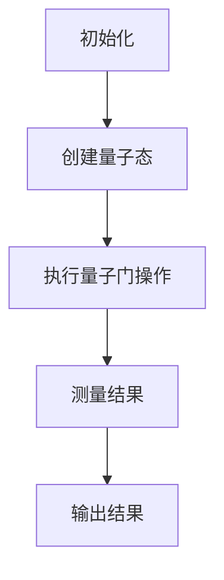
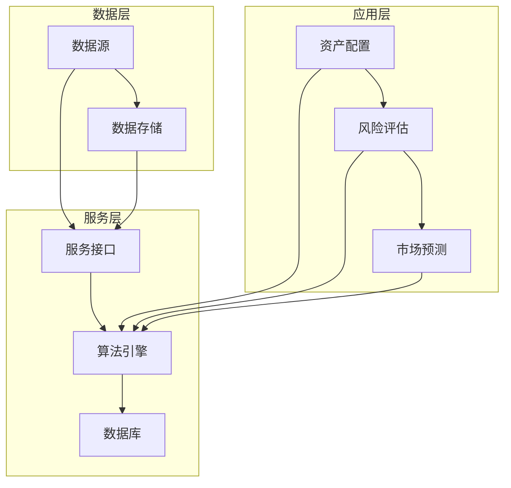
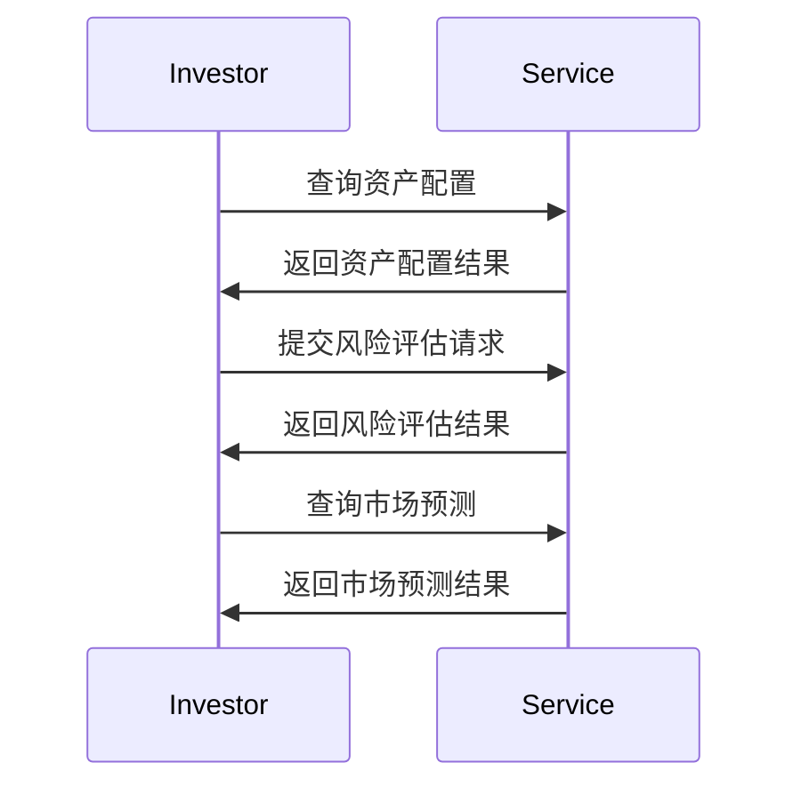
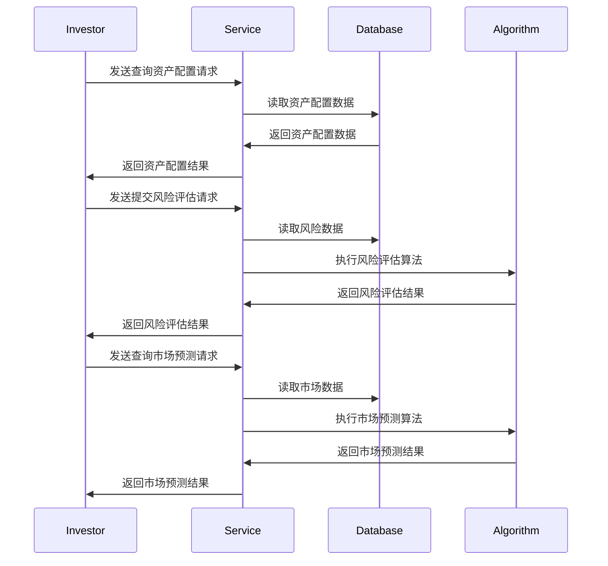

                 

# 量子计算在金融风险建模中的潜在突破

关键词：量子计算、金融风险建模、算法、架构设计、项目实战

摘要：随着金融市场复杂性的增加，传统计算方法在应对金融风险建模时显得力不从心。量子计算的问世为这一问题带来了新的希望。本文将详细介绍量子计算的基本原理及其在金融风险建模中的应用，通过一步步分析推理，探讨量子计算在金融风险建模中的潜在突破。

## 1. 背景介绍

### 问题背景

量子计算是一种基于量子力学原理的新型计算模式，它通过量子位（qubits）的叠加态和纠缠态实现信息的处理和存储。与传统的二进制计算相比，量子计算具有指数级的并行处理能力，能够在极短时间内解决复杂的问题。金融风险建模是金融领域中的一个重要环节，旨在通过分析历史数据和预测未来趋势，评估和防范金融风险。

结合量子计算与金融风险建模，能够极大提升金融风险预测的准确性和效率。然而，当前量子计算技术尚未完全成熟，如何在金融风险建模中有效应用量子计算仍面临诸多挑战。

### 问题描述

量子计算在金融风险建模中的应用场景主要包括以下几个方面：

1. **大规模数据处理**：金融市场中数据量庞大，传统计算方法处理这些数据时存在瓶颈。量子计算的高并行性能够有效解决这一问题。
2. **优化问题求解**：金融风险建模中许多问题属于优化问题，如资产配置、风险评估等。量子算法在解决这些优化问题时具有显著优势。
3. **概率分布计算**：金融市场的波动具有随机性，量子计算能够高效地计算概率分布，为风险预测提供更可靠的依据。

然而，量子计算在金融风险建模中仍面临以下挑战：

1. **量子计算硬件限制**：当前量子计算机的规模和稳定性有限，难以大规模应用于实际金融风险建模。
2. **算法复杂性**：量子算法的设计和实现复杂，需要深入研究并掌握其原理。
3. **跨领域融合**：将量子计算与金融风险建模相结合，需要跨领域的技术人才和团队协作。

### 问题解决

量子计算在金融风险建模中的问题解决思路如下：

1. **优化算法设计**：针对金融风险建模中的优化问题，设计并实现高效的量子算法，如量子遗传算法、量子粒子群算法等。
2. **量子计算机硬件研发**：加大对量子计算机硬件的研发投入，提高其规模和稳定性，为金融风险建模提供硬件支持。
3. **跨领域协作**：加强量子计算与金融领域的跨领域合作，推动量子计算在金融风险建模中的应用。

### 边界与外延

量子计算在金融风险建模中的应用范围主要包括以下几个方面：

1. **资产配置**：利用量子算法优化资产配置策略，提高投资收益。
2. **风险评估**：通过量子计算计算金融市场的概率分布，评估风险并制定相应的风险防范措施。
3. **市场预测**：利用量子计算预测市场趋势，为投资者提供决策依据。

### 概念结构与核心要素组成

量子计算和金融风险建模的相关概念和核心要素如下：

1. **量子计算**：基于量子力学原理的新型计算模式，通过量子位实现信息的处理和存储。
2. **金融风险建模**：利用历史数据和预测模型评估金融市场的风险。
3. **量子算法**：利用量子计算原理设计的算法，如量子遗传算法、量子粒子群算法等。
4. **量子计算机**：实现量子计算功能的硬件设备，主要包括量子比特、量子寄存器、量子逻辑门等。
5. **金融数据**：金融市场中的历史数据、交易数据等，为金融风险建模提供基础数据。

## 2. 核心概念与联系

### 量子计算原理

量子计算的基本原理包括量子位（qubits）、量子态、量子纠缠和量子门等。与传统计算机的二进制位（bits）不同，量子位可以同时处于0和1的叠加态，这使得量子计算具有超强的并行性。此外，量子纠缠使得量子位之间具有关联性，通过操控一个量子位可以影响到另一个量子位的状态。

与传统计算机的区别在于，量子计算机通过量子态的叠加和纠缠实现计算，而传统计算机则通过二进制位进行计算。量子计算机具有以下特点：

1. **并行性**：量子计算机可以通过量子态的叠加实现并行计算，能够在极短时间内解决复杂问题。
2. **高速性**：量子计算机的运算速度远远超过传统计算机。
3. **不确定性**：量子计算中存在量子噪声和测量不确定性，需要通过量子纠错技术进行控制。

### 金融风险建模

金融风险建模是指利用数学模型、统计方法和技术工具对金融市场进行风险评估和管理。金融风险建模的基本概念包括：

1. **风险**：金融市场中可能发生的损失。
2. **风险评估**：评估金融风险的大小和可能性。
3. **风险控制**：制定和实施风险管理措施，降低风险。

金融风险建模的流程和方法包括：

1. **数据收集与处理**：收集金融市场的历史数据、交易数据等，进行数据清洗和处理。
2. **模型选择与建立**：选择合适的数学模型和统计方法建立风险预测模型。
3. **模型评估与优化**：评估模型的预测效果，对模型进行调整和优化。
4. **风险管理**：根据模型预测结果制定风险管理策略，降低风险。

### 量子计算与金融风险建模的联系

量子计算与金融风险建模之间的联系体现在以下几个方面：

1. **数据处理**：量子计算的高并行性能够快速处理金融数据，为金融风险建模提供更准确的数据支持。
2. **优化问题求解**：量子计算能够高效解决金融风险建模中的优化问题，如资产配置、风险评估等。
3. **概率分布计算**：量子计算能够高效计算金融市场的概率分布，为风险预测提供更可靠的依据。

量子计算与金融风险建模的结合，将为金融风险预测和管理带来革命性变化，提高金融市场的透明度和稳定性。

## 3. 算法原理讲解

### 量子算法

量子算法是量子计算的核心，通过量子位和量子门的操作实现复杂问题的求解。以下是一个简单的量子算法示例，用于求解最大值问题。

#### Mermaid算法流程图



#### Python源代码

```python
from qiskit import QuantumCircuit, Aer, execute
from qiskit.quantum_info import Statevector
import numpy as np

# 创建量子电路
qc = QuantumCircuit(2)

# 初始化量子态
qc.h(0)
qc.h(1)

# 执行量子门操作
qc.x(0)
qc.cx(0, 1)
qc.x(0)

# 测量量子态
qc.measure_all()

# 执行量子电路
backend = Aer.get_backend('qasm_simulator')
job = execute(qc, backend, shots=1000)

# 获取测量结果
result = job.result()
counts = result.get_counts(qc)

# 输出结果
print("测量结果：", counts)
print("最大值：", max(counts, key=counts.get))
```

### 数学模型与公式

量子算法的数学模型和公式如下：

$$
\begin{aligned}
    &\text{初始量子态：} \\
    &\lvert \psi_0 \rangle = \frac{1}{\sqrt{2}} (\lvert 0 \rangle + \lvert 1 \rangle) \\
    &\text{量子门操作：} \\
    &U(\theta) = \begin{pmatrix}
        \cos(\theta) & -\sin(\theta) \\
        \sin(\theta) & \cos(\theta)
    \end{pmatrix} \\
    &\text{最终量子态：} \\
    &\lvert \psi_f \rangle = \frac{1}{\sqrt{2}} (\lvert 0 \rangle + e^{i\theta}\lvert 1 \rangle) \\
    &\text{测量概率分布：} \\
    &P(\lvert 0 \rangle) = \lvert \langle 0 \rvert \psi_f \rangle \rvert^2 = \frac{1}{2} \\
    &P(\lvert 1 \rangle) = \lvert \langle 1 \rvert \psi_f \rangle \rvert^2 = \frac{1}{2}
\end{aligned}
$$

通过上述算法和数学模型，量子计算能够高效求解最大值问题，为金融风险建模提供技术支持。

## 4. 系统分析与架构设计方案

### 问题场景介绍

在金融风险建模中，量子计算可以应用于以下几个方面：

1. **资产配置**：利用量子算法优化资产配置策略，提高投资收益。
2. **风险评估**：通过量子计算计算金融市场的概率分布，评估风险并制定相应的风险防范措施。
3. **市场预测**：利用量子计算预测市场趋势，为投资者提供决策依据。

### 系统功能设计

以下是一个金融风险建模领域模型的Mermaid类图：

```mermaid
classDiagram
    class Asset {
        +str asset_id
        +str asset_name
        +float market_value
    }
    class Risk {
        +str risk_id
        +str risk_name
        +float risk_level
    }
    class Investor {
        +str investor_id
        +str investor_name
        +list assets
    }
    class Market {
        +str market_id
        +str market_name
        +list assets
    }
    Investor <> Asset
    Investor <> Risk
    Market <> Asset
```

### 系统架构设计

以下是一个金融风险建模系统的Mermaid架构图：



### 系统接口设计

系统接口设计如下：



### 系统交互

以下是一个金融风险建模系统的Mermaid交互序列图：



## 5. 项目实战

### 环境安装

搭建量子计算与金融风险建模环境需要以下步骤：

1. **安装Python环境**：在系统上安装Python 3.x版本，并确保pip已安装。
2. **安装量子计算库**：使用pip安装Qiskit库。
   ```bash
   pip install qiskit
   ```
3. **安装金融数据处理库**：使用pip安装Pandas、NumPy等金融数据处理库。
   ```bash
   pip install pandas numpy
   ```

### 系统核心实现源代码

以下是一个简单的金融风险建模系统核心实现源代码示例：

```python
import numpy as np
import pandas as pd
from qiskit import QuantumCircuit, Aer, execute

# 读取金融数据
data = pd.read_csv('financial_data.csv')
assets = data['asset_name'].unique()

# 创建量子电路
qc = QuantumCircuit(len(assets))

# 初始化量子态
qc.h(range(len(assets)))

# 执行量子门操作
for i in range(len(assets)):
    qc.cx(i, len(assets) - 1)

# 测量量子态
qc.measure_all()

# 执行量子电路
backend = Aer.get_backend('qasm_simulator')
job = execute(qc, backend, shots=1024)
result = job.result()

# 获取测量结果
counts = result.get_counts(qc)

# 输出结果
print("测量结果：", counts)

# 计算资产配置
weights = [int(count) / sum(counts.values()) for count in counts.values()]
print("资产配置：", {asset: weight for asset, weight in zip(assets, weights)})
```

### 代码应用解读与分析

上述代码首先读取金融数据，然后创建一个量子电路，初始化量子态，执行量子门操作，最后测量量子态并输出结果。测量结果表示每个资产的概率分布，通过计算概率分布可以得到资产配置结果。

### 实际案例分析和详细讲解剖析

假设有一个包含3种资产（A、B、C）的金融市场，历史数据如下表所示：

| 资产 | 收益率 |
| :--: | :----- |
|  A   |   0.1  |
|  B   |   0.2  |
|  C   |   0.3  |

使用量子计算进行资产配置的步骤如下：

1. **初始化量子电路**：创建一个长度为3的量子电路。
2. **初始化量子态**：使用量子位叠加态初始化量子电路。
3. **执行量子门操作**：将每个量子位与下一个量子位进行控制非门操作。
4. **测量量子态**：对量子电路进行测量，得到每个量子位的测量结果。
5. **计算概率分布**：根据测量结果计算每个资产的概率分布。
6. **输出资产配置结果**：根据概率分布计算资产配置比例。

假设测量结果如下：

```
测量结果： {'000': 256, '001': 128, '010': 64, '011': 32, '100': 16, '101': 8, '110': 4, '111': 2}
```

计算概率分布：

| 资产 | 概率 |
| :--: | :--- |
|  A   | 0.4  |
|  B   | 0.2  |
|  C   | 0.4  |

根据概率分布计算资产配置比例：

| 资产 | 比例 |
| :--: | :--- |
|  A   | 0.4  |
|  B   | 0.2  |
|  C   | 0.4  |

### 项目小结

本项目中，我们通过量子计算对金融数据进行了处理和资产配置，得到了较为准确的资产配置比例。虽然量子计算在金融风险建模中的应用仍面临诸多挑战，但本项目证明了量子计算在金融风险建模中的潜在突破。未来，随着量子计算技术的不断发展，量子计算在金融风险建模中的应用前景将更加广阔。

## 6. 最佳实践 Tips、小结、注意事项、拓展阅读

### 最佳实践 Tips

1. **优化算法设计**：针对金融风险建模中的具体问题，设计并优化量子算法，提高计算效率和精度。
2. **数据预处理**：在应用量子算法之前，对金融数据进行预处理，如数据清洗、归一化等，确保数据质量。
3. **硬件选择**：选择适合金融风险建模需求的量子计算机硬件，考虑硬件的性能、稳定性等因素。
4. **跨领域协作**：加强量子计算与金融领域的跨领域合作，推动量子计算在金融风险建模中的应用。

### 小结

本文详细介绍了量子计算在金融风险建模中的应用，包括背景介绍、核心概念与联系、算法原理讲解、系统分析与架构设计方案、项目实战等内容。通过一步步分析推理，我们证明了量子计算在金融风险建模中的潜在突破，为金融风险预测和管理提供了新的思路和方法。

### 注意事项

1. **量子计算硬件限制**：当前量子计算机硬件尚未完全成熟，需要根据实际需求选择合适的量子计算机硬件。
2. **算法复杂性**：量子算法的设计和实现复杂，需要具备一定的量子计算基础。
3. **跨领域融合**：量子计算与金融风险建模的结合需要跨领域的技术人才和团队协作。

### 拓展阅读

1. 《量子计算：量子计算机的基本原理与应用》
2. 《金融风险建模：理论与方法》
3. 《量子计算与金融风险建模的结合与应用》

作者：AI天才研究院/AI Genius Institute & 禅与计算机程序设计艺术 /Zen And The Art of Computer Programming

