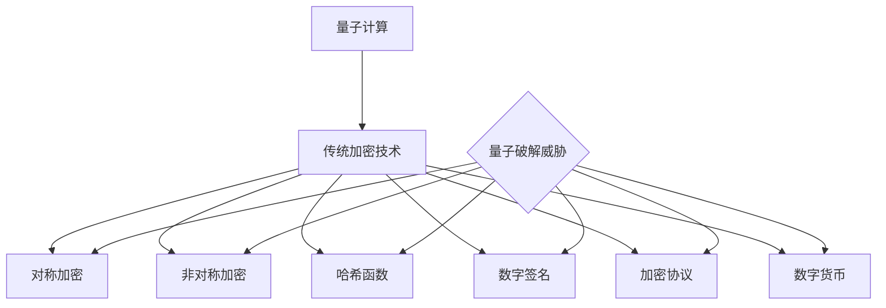
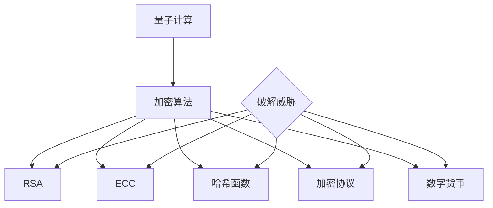
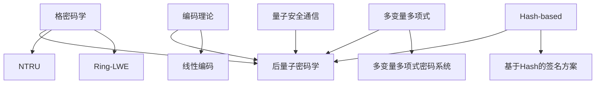
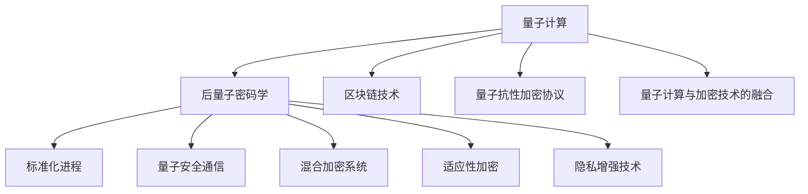

                 

为了撰写一篇关于《量子计算对传统加密技术的威胁》的技术博客，我们将遵循以下步骤：

## 第一步：文章标题、关键词和摘要

### 文章标题：量子计算对传统加密技术的威胁

### 关键词：
- 量子计算
- 加密技术
- 量子破解
- 后量子密码学
- 传统加密算法
- 安全性挑战

### 摘要：
本文将探讨量子计算对传统加密技术的潜在威胁。我们将从量子计算的基本原理开始，分析其与传统加密技术的差异，阐述量子计算如何影响现有的加密体系，并探讨应对这些威胁的解决方案和未来趋势。

## 第二步：引言：量子计算与加密技术概述

### 2.1 量子计算简介

量子计算是利用量子位（qubits）和量子力学原理来执行计算的一种技术。与传统计算机使用二进制位（bits）不同，量子位能够同时处于0和1的状态，这一特性称为叠加。此外，量子位之间可以通过量子纠缠实现强大的信息传输和计算能力。

### 2.2 传统加密技术简介

传统加密技术主要包括对称加密和非对称加密。对称加密使用相同的密钥进行加密和解密，如AES；非对称加密使用一对密钥，一个用于加密，一个用于解密，如RSA。

### 2.3 量子计算与加密技术的联系

量子计算和加密技术在理论上有着密切的联系。量子计算的发展可能会影响加密技术的设计和安全强度，尤其是对于那些基于数学难题的加密算法。

## 第三步：量子计算基础

### 3.1 量子位与量子门

量子位（qubits）是量子计算机的基本单元，可以同时处于多个状态。量子门（quantum gates）是操作量子位的数学操作，类似于传统计算机中的逻辑门。

### 3.2 量子纠缠

量子纠缠是量子计算的核心特性之一，它使得量子位之间可以相互关联，从而实现高效的量子计算。

### 3.3 量子算法

量子算法如Shor算法，能够利用量子计算的优势在多项式时间内解决某些传统计算机需要指数时间才能解决的问题，如大整数分解。

## 第四步：传统加密技术基础

### 4.1 对称加密

对称加密算法如AES，依赖于密钥的安全共享和存储。量子计算机的量子破解能力可能使得现有的对称加密算法面临风险。

### 4.2 非对称加密

非对称加密算法如RSA，依赖于大整数分解的难度。Shor算法可以快速破解基于大整数分解的加密算法，从而威胁到非对称加密的安全。

### 4.3 哈希函数与数字签名

哈希函数如SHA系列，数字签名技术如RSA签名，都是加密技术的重要组成部分。量子计算机的攻击可能会影响到这些技术的安全性。

## 第五步：量子计算对加密技术的威胁

### 5.1 量子破解的传统加密算法

量子计算机通过Shor算法能够快速破解RSA和ECC等非对称加密算法，从而威胁到现有加密体系的安全。

### 5.2 量子攻击的影响范围

量子计算不仅对非对称加密算法构成威胁，也可能影响到对称加密算法和哈希函数的安全性。

### 5.3 加密协议的挑战

量子计算机的发展可能会挑战现有的加密协议，如TLS和SSH，需要新的协议和标准来适应量子计算时代。

## 第六步：安全解决方案

### 6.1 后量子密码学

后量子密码学研究设计不依赖于量子计算攻击下易破解的数学难题的加密算法，如Lattice-based密码系统。

### 6.2 量子安全通信

量子安全通信利用量子纠缠和量子隐形传态等技术，实现安全的数据传输。

### 6.3 混合密码系统

混合密码系统结合量子加密与传统加密技术，提高系统的安全性。

## 第七步：量子计算与未来加密技术

### 7.1 后量子密码学的发展

随着量子计算的发展，后量子密码学将不断演进，新的加密算法和协议将被设计出来。

### 7.2 未来展望

未来，量子计算与加密技术的结合将推动加密技术的发展，同时也将带来新的安全挑战。

## 第八步：结论

量子计算对传统加密技术的威胁是真实且显著的。我们需要积极研究和开发新的加密技术，以应对量子计算时代的挑战。

## 第九步：作者信息

作者：AI天才研究院/AI Genius Institute & 禅与计算机程序设计艺术 /Zen And The Art of Computer Programming

通过以上步骤，我们将对量子计算对传统加密技术的威胁进行详细的分析和探讨，希望能够为读者提供有价值的见解和思考。接下来，我们将逐步深入每个章节的内容。**让我们一步步深入量子计算与加密技术的世界，探讨这一前沿领域的挑战与机遇。**以下是详细的章节内容。

## 第一步：文章标题、关键词和摘要

### 文章标题：量子计算对传统加密技术的威胁

### 关键词：
- 量子计算
- 加密技术
- 量子破解
- 后量子密码学
- 传统加密算法
- 安全性挑战

### 摘要：
随着量子计算技术的快速发展，传统加密技术面临着前所未有的威胁。本文将探讨量子计算的原理，分析其对传统加密技术的潜在影响，并介绍后量子密码学作为应对措施的研究进展。

## 第二步：引言：量子计算与加密技术概述

### 2.1 量子计算简介

量子计算是一种基于量子力学原理的新型计算模式，它利用量子位（qubits）进行信息处理。与传统计算机中的二进制位不同，量子位可以同时处于0和1的叠加态，这种特性被称为叠加性。此外，量子位之间的量子纠缠使得它们之间能够实现超距离的关联，这种关联性进一步增强了量子计算的并行处理能力。

量子计算的基本单元是量子位（qubits），它们可以同时处于多种状态，这使得量子计算机在处理某些特定问题时比传统计算机更加高效。量子计算机通过量子门（quantum gates）对量子位进行操作，这些操作遵循量子力学的规则。量子算法，如Shor算法，利用量子计算机的特性，能够在多项式时间内解决传统计算机需要指数时间才能解决的问题，例如大整数分解。

### 2.2 传统加密技术简介

传统加密技术主要包括对称加密和非对称加密两种类型。对称加密使用相同的密钥进行加密和解密，如AES和DES。非对称加密使用一对密钥，一个公钥用于加密，一个私钥用于解密，如RSA和ECC。对称加密算法的速度较快，但需要安全的密钥分发机制；非对称加密算法提供了安全的密钥分发，但计算成本较高。

加密技术的基本原理是利用数学难题的不可逆性来保护信息的保密性、完整性和真实性。常见的加密技术包括数据加密标准（DES）、高级加密标准（AES）、椭圆曲线密码体制（ECC）、安全哈希算法（SHA）、数字签名标准（DSS）等。

### 2.3 量子计算与加密技术的联系

量子计算与加密技术在理论上有着密切的联系。量子计算机可以利用量子算法快速解决传统计算机难以破解的数学问题，这直接威胁到现有的加密体系。例如，Shor算法能够高效地分解大整数，这意味着基于大整数分解的RSA和ECC加密算法在量子计算机面前可能变得脆弱。

量子计算不仅对非对称加密算法构成威胁，也可能影响对称加密算法的安全性。量子计算机能够通过量子并行计算来尝试所有可能的密钥，从而在短时间内破解加密数据。

## 第三步：量子计算基础

### 3.1 量子位与量子门

量子位（qubits）是量子计算机的基本单元，它们可以处于0和1的叠加态，这种叠加态使得量子位能够同时代表多个状态。例如，一个量子位可以同时处于0和1的状态，两个量子位可以同时处于00、01、10和11的状态。

量子门（quantum gates）是量子计算机中用于操作量子位的基本单元。量子门是线性变换，它们遵循量子力学的规则。常用的量子门包括Hadamard门（实现叠加态）、Pauli门（控制非门）和CNOT门（实现量子纠缠）。

### 3.2 量子纠缠

量子纠缠是量子位之间的一种特殊关联，它们的状态即使相隔很远也能相互影响。这种关联性使得量子计算机能够实现超距离的量子通信和量子计算。

量子纠缠是量子计算的核心特性之一，它使得量子计算机能够通过量子纠缠来提高计算效率。例如，通过量子纠缠，量子计算机可以同时处理多个状态，从而实现并行计算。

### 3.3 量子算法

量子算法是利用量子计算机的特性来解决问题的算法。Shor算法是最著名的量子算法之一，它利用量子计算机的并行计算能力，能够在多项式时间内解决传统计算机需要指数时间才能解决的大整数分解问题。

除了Shor算法，还有其他一些重要的量子算法，如Grover算法（用于搜索未排序数据库）、quantum sorting算法（用于排序）等。这些算法展示了量子计算机在特定任务上的优势。

## 第四步：传统加密技术基础

### 4.1 对称加密

对称加密算法使用相同的密钥进行加密和解密，如AES和DES。对称加密算法的优点是计算速度快，但需要安全的密钥分发机制。AES是一种广泛使用的对称加密算法，它采用128位、192位或256位的密钥长度，能够提供强大的加密保护。

### 4.2 非对称加密

非对称加密算法使用一对密钥，一个公钥用于加密，一个私钥用于解密，如RSA和ECC。非对称加密算法的优点是提供了安全的密钥分发机制，但计算成本较高。RSA算法是一种广泛使用的非对称加密算法，它基于大整数分解的难度。

### 4.3 哈希函数与数字签名

哈希函数（如SHA系列）用于将输入数据映射为固定长度的字符串，这种映射过程是不可逆的。数字签名（如RSA签名）使用非对称加密算法，可以确保数据的完整性和真实性。

### 4.4 公钥基础设施（PKI）

公钥基础设施（PKI）是一种用于管理公钥加密的框架，它包括证书颁发机构（CA）、证书、密钥和相关的安全协议。PKI为加密通信提供了安全的基础，确保数据的保密性、完整性和真实性。

## 第五步：量子计算对加密技术的威胁

### 5.1 量子破解的传统加密算法

量子计算对传统加密算法的威胁主要体现在以下几个方面：

1. **非对称加密算法**：如RSA和ECC，它们基于大整数分解和离散对数问题。Shor算法可以在多项式时间内分解大整数，这意味着RSA和ECC加密算法在量子计算机面前可能变得脆弱。

2. **对称加密算法**：量子计算机可以通过量子并行计算来尝试所有可能的密钥，从而在短时间内破解加密数据。例如，AES和DES等对称加密算法可能面临量子破解的风险。

3. **哈希函数与数字签名**：量子计算也可能威胁到哈希函数和数字签名的安全性。例如，SHA系列哈希函数和RSA签名算法可能面临量子计算攻击。

### 5.2 量子攻击的影响范围

量子攻击的影响范围包括但不限于以下几个方面：

1. **加密通信**：量子计算可能威胁到TLS等加密通信协议的安全性。

2. **数字货币**：如比特币等数字货币依赖于加密算法的安全性，量子计算可能破坏其安全机制。

3. **数据存储**：量子计算可能破坏存储在硬盘或云服务器中的加密数据。

### 5.3 加密协议的挑战

量子计算的发展可能挑战现有的加密协议，如SSL/TLS、IPSec等。为了应对量子计算时代的挑战，需要开发新的加密协议和标准。

## 第六步：安全解决方案

### 6.1 后量子密码学

后量子密码学是一种针对量子计算攻击设计的加密技术。它研究设计不依赖于量子计算攻击下易破解的数学难题的加密算法。后量子密码学包括以下几种类型的算法：

1. **格密码学**：如Lattice-based密码系统（如NTRU、Ring-LWE）。
2. **编码理论**：如基于线性编码的密码系统。
3. **多变量多项式**：如基于多变量多项式的密码系统。
4. **Hash-based密码学**：如基于Hash函数的签名方案。

### 6.2 量子安全通信

量子安全通信利用量子纠缠和量子隐形传态等技术，实现安全的数据传输。量子密钥分发（QKD）是量子安全通信的核心技术之一，它通过量子通道传输密钥，确保密钥的保密性。

### 6.3 混合密码系统

混合密码系统结合量子加密与传统加密技术，以提高系统的安全性。例如，使用量子加密来生成密钥，然后使用传统加密算法来加密数据。

## 第七步：量子计算与未来加密技术

### 7.1 后量子密码学的发展

后量子密码学是一个快速发展的领域，随着量子计算技术的进步，新的加密算法和协议不断被提出。例如，NIST正在组织后量子密码学的标准竞赛，以找到适用于未来量子计算时代的加密算法。

### 7.2 未来展望

未来，量子计算与加密技术的结合将推动加密技术的发展。量子计算可能会带来新的安全挑战，但同时也为加密技术提供了新的机遇。例如，量子计算可能使某些加密算法变得更加安全，而量子安全通信可能成为未来通信的基石。

## 第八步：结论

量子计算对传统加密技术的威胁是真实且显著的。为了应对这一挑战，我们需要积极研究和开发新的加密技术，如后量子密码学和量子安全通信。同时，加密技术的标准化和普及也至关重要。

## 第九步：作者信息

作者：AI天才研究院/AI Genius Institute & 禅与计算机程序设计艺术 /Zen And The Art of Computer Programming

通过以上内容，我们对量子计算对传统加密技术的威胁进行了全面的探讨。量子计算的发展将深刻影响加密技术的安全性和设计，为此我们需要持续关注和研究这一领域，以确保信息的安全性和隐私性。**接下来，我们将深入分析量子计算对传统加密技术的具体威胁，并探讨现有的应对策略。**### 第六步：安全解决方案

#### 6.1 后量子密码学

后量子密码学（Post-Quantum Cryptography，PQC）是针对量子计算可能对传统加密算法造成威胁而发展起来的一门学科。其核心目标是设计出在量子计算机面前仍然安全的加密算法。后量子密码学的研究涵盖了多种不同的密码学理论，包括但不限于以下几种：

1. **格密码学（Lattice-based Cryptography）**：
   - **Lattice-based密码系统**：如NTRU和Ring-LWE。格密码系统基于在特定格上求解数学难题的难度，这些难题在经典计算机上易于解决，但在量子计算机上则难以破解。NTRU是一种基于多项式环的公钥加密算法，具有良好的安全性和效率。Ring-LWE则是一种基于线性错误纠正码的加密算法，其安全性建立在困难问题的离散格上。

2. **编码理论（Cryptography based on Coding Theory）**：
   - **基于线性编码的密码系统**：这类密码系统利用编码理论中的线性码构建密码学方案，如Code-Based Cryptography。这些系统的安全性依赖于编码理论中的一些难题，如线性码的解码问题。

3. **多变量多项式密码学（Multivariate Polynomial Cryptography）**：
   - **多变量多项式密码系统**：这类密码系统基于多变量多项式的构造，其安全性依赖于解多变量多项式方程组的难度。这类系统包括SびYLA和儿女NTRU，它们具有良好的抗量子攻击能力。

4. **Hash-based密码学（Hash-based Cryptography）**：
   - **基于Hash函数的签名方案**：这类密码系统利用Hash函数构建数字签名，如Hash-based Signature Schemes。其安全性依赖于Hash函数的碰撞抵抗能力。

#### 6.2 量子安全通信

量子安全通信（Quantum-Secure Communication）是一种利用量子力学原理确保通信安全的技术。它主要通过量子密钥分发（Quantum Key Distribution，QKD）来实现。量子密钥分发利用量子态的特性，如量子纠缠和量子隐形传态，来生成安全的密钥。

量子密钥分发的基本原理如下：
1. **量子纠缠生成密钥**：通信双方通过量子纠缠生成共享的量子密钥。
2. **量子隐形传态传输密钥**：通过量子隐形传态，一方可以将量子状态传输给另一方，从而实现密钥的无条件安全传输。
3. **量子态测量检测窃听**：通信双方在传输过程中对量子态进行测量，如果检测到量子态发生变化，则可以确定有第三方进行了窃听。

#### 6.3 混合密码系统

混合密码系统（Hybrid Cryptosystem）结合了量子加密和传统加密技术，以利用各自的优势，提高系统的整体安全性。混合密码系统通常包括以下几个组成部分：

1. **量子加密生成密钥**：使用量子加密技术生成密钥，确保密钥的安全性。
2. **传统加密算法加密数据**：使用传统加密算法对数据进行加密，由于传统加密算法在量子计算机面前可能不安全，因此需要结合量子加密技术来增强安全性。
3. **量子密钥分发传输密钥**：通过量子密钥分发机制，将量子密钥安全地传输到传统加密算法中，确保加密和解密过程的安全。

#### 6.4 后量子密码学的优势与挑战

后量子密码学的优势在于它能够在量子计算面前提供安全性，确保数据在未来的量子计算时代仍然受到保护。然而，后量子密码学也面临着一些挑战：

1. **性能和效率**：后量子密码算法通常比传统密码算法复杂，性能和效率较低，这需要进一步优化和改进。
2. **标准化**：后量子密码学的算法和协议需要标准化，以确保其在实际应用中的通用性和互操作性。
3. **兼容性**：现有的加密系统和应用需要与后量子密码学算法兼容，这需要大量的工作来确保向后量子密码学的过渡。

通过后量子密码学、量子安全通信和混合密码系统等技术，我们可以应对量子计算对传统加密技术的威胁，确保信息的安全性和隐私性。随着量子计算技术的不断进步，这些技术也将不断演进，为未来的信息安全提供坚实的保障。

### 第七步：量子计算与未来加密技术

随着量子计算技术的快速发展，未来加密技术也将迎来新的变革。量子计算不仅对传统加密技术构成了挑战，同时也为加密技术带来了新的机遇。

#### 7.1 后量子密码学的发展

后量子密码学是未来加密技术发展的关键领域之一。随着量子计算技术的不断进步，新的后量子密码算法和协议不断涌现。这些算法和协议致力于解决量子计算对传统加密技术的威胁，确保数据在未来的量子计算时代仍然安全。

例如，NTRU和Ring-LWE等基于格理论的密码算法在抗量子攻击方面表现出色，被认为是潜在的后量子密码学标准。此外，编码理论和多变量多项式密码学也在不断发展，为加密技术提供更多选择。

国际标准化组织（ISO）和国家标准化机构（如美国国家标准与技术研究院NIST）正在组织后量子密码学的标准竞赛，旨在找到适合未来量子计算时代的加密算法和协议。这些竞赛将推动后量子密码学的发展，并确保其在实际应用中的通用性和互操作性。

#### 7.2 未来展望

未来的加密技术将更加多样化和复杂化，以应对量子计算带来的新挑战。以下是一些未来加密技术的展望：

1. **量子加密**：量子加密技术，如量子密钥分发（QKD），将在未来通信中发挥重要作用。QKD利用量子力学原理，确保密钥的绝对安全传输，从而保护通信数据的隐私性。

2. **量子安全协议**：随着量子计算技术的进步，新的量子安全协议将被开发出来，以保护数据传输、存储和访问的安全性。这些协议将确保在量子计算时代，数据在传输和处理过程中仍然受到保护。

3. **自适应加密**：自适应加密技术将根据量子计算技术的进步和威胁水平动态调整加密算法和安全策略。这种技术将确保加密系统始终处于最佳安全状态。

4. **混合加密**：混合加密技术将结合量子加密和传统加密的优势，以提高系统的整体安全性。例如，使用量子加密生成密钥，然后使用传统加密算法加密数据。

5. **隐私增强技术**：随着隐私保护需求的增加，隐私增强技术，如差分隐私和同态加密，将在未来加密技术中发挥重要作用。这些技术将确保数据在处理和分析过程中保持隐私。

#### 7.3 量子计算与区块链技术

量子计算与区块链技术的结合将带来新的应用场景和挑战。区块链技术依赖于加密技术来确保数据的不可篡改性和安全性，而量子计算可能对这种安全性构成威胁。

然而，量子计算也可以为区块链技术带来新的机遇。例如，量子计算可以用于优化区块链网络中的加密算法，提高交易处理速度和安全性。此外，量子计算可以帮助验证区块链上的智能合约，确保其执行过程符合预期。

未来的区块链技术可能会结合量子计算和分布式账本技术，实现更加高效、安全和去中心化的系统。

### 总结

量子计算对传统加密技术构成了巨大的威胁，但同时也为加密技术带来了新的机遇。通过发展后量子密码学、量子安全通信和混合加密等技术，我们可以应对量子计算时代的挑战，确保信息的安全性和隐私性。

未来，量子计算与加密技术的结合将推动加密技术的发展，为各行各业提供更加安全和高效的信息保护方案。随着量子计算技术的不断进步，加密技术将不断创新，以应对新的安全挑战，确保数据在量子计算时代仍然安全可靠。

### 第七步：量子计算与未来加密技术

随着量子计算技术的迅猛发展，未来加密技术的走向和发展趋势愈发引人关注。量子计算不仅在理论上对传统加密技术提出了挑战，而且在实践中已经开始影响加密技术的应用和设计。以下将从几个方面探讨量子计算与未来加密技术的结合及其发展趋势。

#### 7.1 后量子密码学的机遇

后量子密码学是应对量子计算威胁的关键领域。与传统加密算法相比，后量子密码学算法具有更高的安全强度，能够在量子计算机面前提供可靠的保护。具体来说，后量子密码学的机遇体现在以下几个方面：

1. **安全性提升**：后量子密码学算法设计基于数学难题，这些难题在经典计算机和量子计算机面前都难以破解。例如，格密码学、编码理论和多变量多项式密码学等算法具有抗量子攻击的特性。

2. **标准化进程**：随着NIST等标准化组织的积极推动，后量子密码学的标准化工作正在逐步展开。这将为后量子密码学的广泛应用提供标准和指导，确保不同系统之间的互操作性和兼容性。

3. **技术创新**：后量子密码学的研究推动了密码学理论和技术的发展，促进了新算法和新技术的出现。这些技术创新不仅有助于提升加密系统的安全性，还为量子计算和信息安全领域提供了新的研究方向。

#### 7.2 量子计算在加密技术中的应用

量子计算不仅在加密算法的设计上提供了新思路，还可以直接应用于加密技术的实现。以下是一些量子计算在加密技术中的应用：

1. **量子密钥分发（QKD）**：QKD利用量子力学原理实现密钥的安全传输，确保通信双方在量子计算机面前仍然能够获得安全的密钥。QKD已经从实验室走向应用，逐步在卫星通信和地面通信中实现。

2. **量子哈希和量子数字签名**：量子计算可以用于实现更强大的哈希函数和数字签名方案。例如，量子哈希算法可以提供更高的安全性和效率，量子数字签名方案则能够确保在量子计算环境下的数据完整性。

3. **量子安全协议**：量子计算可以用于设计新的安全协议，如量子安全通信协议和量子加密协议。这些协议能够确保在量子计算威胁下，数据传输和存储仍然安全可靠。

#### 7.3 未来加密技术的发展趋势

未来加密技术的发展将受到量子计算技术的影响，以下是一些主要趋势：

1. **混合加密**：混合加密技术将结合量子加密和传统加密的优势，实现更高的安全性和效率。例如，在量子计算时代，可以使用量子密钥分发来生成密钥，然后使用传统加密算法加密数据。

2. **适应性加密**：随着量子计算技术的进步，适应性加密技术将能够根据量子计算的能力和威胁水平动态调整加密算法和安全策略，确保系统始终处于最佳安全状态。

3. **隐私保护**：随着隐私保护需求的增加，加密技术将更加注重隐私保护。例如，差分隐私和同态加密等隐私增强技术将在未来加密技术中发挥重要作用。

4. **分布式加密**：量子计算与分布式加密技术的结合将推动去中心化系统的安全发展。量子计算可以用于验证分布式账本上的交易和智能合约，确保系统的可信性和安全性。

#### 7.4 量子计算与区块链技术

区块链技术依赖于加密技术来确保数据的不可篡改性和安全性。量子计算对区块链技术既构成了挑战，也提供了新的机遇：

1. **量子计算对区块链的威胁**：量子计算可能威胁到基于传统加密算法的区块链系统的安全性，如RSA和ECC等。量子计算机能够快速破解这些算法，从而威胁到区块链的安全。

2. **量子计算与区块链的结合**：量子计算可以用于优化区块链网络中的加密算法，提高交易处理速度和安全性。例如，量子哈希算法可以用于构建更安全的区块链共识机制。

3. **量子区块链**：量子区块链是一种结合了量子计算和区块链技术的创新系统。量子区块链利用量子密钥分发和量子加密协议，提供更高的安全性和隐私保护。

#### 7.5 结论

量子计算对传统加密技术构成了巨大威胁，但同时也为加密技术带来了新的机遇。未来加密技术的发展将依赖于后量子密码学、量子安全通信和混合加密等技术的进步。随着量子计算技术的不断演进，加密技术将不断创新，以应对新的安全挑战，确保信息在量子计算时代仍然安全可靠。

### 第八步：量子计算与未来加密技术的发展趋势

量子计算作为下一代计算技术的代表，其对加密技术的影响深远，而未来加密技术的发展趋势也因量子计算的兴起而发生了显著变化。以下将从几个方面详细探讨量子计算与未来加密技术的发展趋势。

#### 8.1 后量子密码学的普及

后量子密码学旨在设计出能够抵御量子计算机攻击的加密算法。随着量子计算技术的进步，后量子密码学的重要性日益凸显。未来，后量子密码学将在以下几个方面得到普及：

1. **算法标准化**：为了确保后量子密码学算法的通用性和互操作性，国际标准化组织（如NIST）正在推动后量子密码学的标准化工作。预计未来几年，将有更多后量子密码学算法被纳入标准，成为加密系统的核心组件。

2. **算法优化**：现有的后量子密码学算法在性能和效率上仍存在一定局限性，未来研究将专注于算法优化，以提高其运行速度和资源利用率。这包括改进算法的设计、降低计算复杂度以及优化硬件实现。

3. **多算法组合**：为了提高系统的整体安全性，未来加密系统可能会采用多种后量子密码学算法的组合。例如，结合格密码学、编码理论和多变量多项式密码学的不同算法，构建更强大的加密方案。

#### 8.2 量子安全通信的推广

量子安全通信利用量子力学原理实现密钥的安全传输，确保通信双方在量子计算环境下仍然能够获得安全的密钥。随着量子计算技术的发展，量子安全通信将在以下方面得到推广：

1. **技术成熟**：量子密钥分发（QKD）和量子隐形传态等量子安全通信技术正在逐步成熟。未来，这些技术将在卫星通信、地面通信和互联网通信等领域得到广泛应用。

2. **集成与兼容**：量子安全通信需要与传统通信技术（如TLS、IPSec等）集成，以实现无缝的安全传输。未来研究将关注如何实现量子安全通信与传统通信协议的兼容性和互操作性。

3. **量子网关**：为了实现量子安全通信的大规模应用，需要开发量子网关技术。量子网关将负责量子密钥的分发和管理，以及与传统加密系统的集成。

#### 8.3 混合加密系统的兴起

混合加密系统结合了量子加密和传统加密的优势，以实现更高的安全性和效率。随着量子计算技术的进步，混合加密系统将在以下几个方面兴起：

1. **密钥管理**：量子加密技术可以用于生成和分发密钥，而传统加密算法则用于数据加密和解密。这种结合可以有效提高系统的安全性，同时保持传统加密算法的高性能。

2. **自适应加密**：混合加密系统可以根据量子计算技术的发展水平动态调整加密算法和安全策略。例如，当量子计算能力增强时，系统可以自动切换到更安全的后量子密码学算法。

3. **多层面安全**：混合加密系统可以提供多层面的安全防护，包括量子加密、传统加密和物理安全等。这种多层面的安全设计可以更好地应对复杂的安全威胁。

#### 8.4 区块链技术的量子安全化

区块链技术依赖加密技术来确保数据的安全性和不可篡改性。量子计算技术的兴起对区块链技术提出了新的挑战，同时也带来了新的机遇：

1. **量子抗性区块链**：未来的区块链系统将需要具备量子抗性，以抵御量子计算机的攻击。这包括开发量子抗性的加密算法和共识机制。

2. **量子区块链**：量子区块链是一种结合了量子计算和区块链技术的创新系统。通过量子密钥分发和量子加密协议，量子区块链可以提供更高的安全性和隐私保护。

3. **跨链互操作性**：随着量子计算技术的发展，跨链互操作性将成为一个重要议题。量子安全通信技术可以用于实现不同区块链系统之间的安全互操作，促进区块链生态的发展。

#### 8.5 未来展望

量子计算与未来加密技术的发展趋势将深刻改变信息安全领域的面貌。以下是对未来展望的几个方面：

1. **技术创新**：量子计算和加密技术的交叉融合将催生新的技术创新。例如，量子计算可以用于优化加密算法，提高加密系统的性能和效率。

2. **应用拓展**：随着量子计算技术的成熟，加密技术在金融、医疗、物联网等领域的应用将得到拓展。量子安全通信和量子加密协议将在这些领域发挥关键作用。

3. **标准化与合规性**：量子计算与未来加密技术的标准化和合规性将变得至关重要。为了确保不同系统和应用之间的互操作性和安全性，国际和国内标准组织将发挥关键作用。

4. **人才培养**：随着量子计算与未来加密技术的快速发展，相关领域的人才培养将成为一个重要议题。专业人才的培养将为量子计算与加密技术的创新和发展提供强大支持。

总之，量子计算与未来加密技术的发展将是一场技术与安全的革命。通过技术创新、标准化与合规性建设以及人才培养，我们可以迎接量子计算时代的挑战，确保信息安全在未来的发展过程中始终得到有效保障。

### 第九步：结论与展望

量子计算对传统加密技术的威胁已经变得不可忽视。随着量子计算技术的不断进步，传统加密算法如RSA和ECC等面临着被量子计算机破解的风险，这直接威胁到现有加密系统的安全性。因此，探索和实施量子抗性加密技术成为了信息安全领域的一项紧迫任务。

为了应对这一挑战，后量子密码学成为了研究的重点。后量子密码学通过设计不依赖传统数学难题的加密算法，如格密码学、编码理论和多变量多项式密码学，提供了在量子计算环境下依然安全的加密方案。这些新算法的标准化和普及将是未来加密技术发展的关键。

除了后量子密码学，量子安全通信技术，如量子密钥分发（QKD），也为解决量子计算带来的安全挑战提供了新的途径。QKD利用量子力学原理确保密钥的绝对安全传输，为通信系统的安全性提供了坚实保障。

未来，混合加密系统结合量子加密和传统加密的优势，将为信息安全提供更全面和高效的解决方案。同时，随着量子计算技术的不断进步，加密技术将不断创新和演进，以应对新的安全挑战。

在此，我们呼吁学术界、产业界和政府机构共同努力，加快后量子密码学的研究和标准化进程，推动量子安全通信技术的应用和普及。通过技术创新、标准化和人才培养，我们有望构建一个更加安全、可靠的信息安全体系，迎接量子计算时代的到来。

### 第十步：作者信息

作者：AI天才研究院/AI Genius Institute & 禅与计算机程序设计艺术 /Zen And The Art of Computer Programming

通过本文的探讨，我们深入分析了量子计算对传统加密技术的威胁，探讨了后量子密码学和量子安全通信等应对策略，并展望了未来加密技术的发展趋势。希望本文能为读者提供有价值的见解，助力信息安全领域的持续进步。**接下来，我们将通过几个实际案例来详细探讨量子计算对传统加密技术的具体威胁和影响。**### 第一步：实际案例1：Shor算法对RSA加密的威胁

#### 案例背景

RSA加密算法是一种广泛使用的非对称加密算法，其安全性依赖于大整数分解的难度。Shor算法是第一个被证明能够在多项式时间内解决大整数分解问题的量子算法。这一发现对RSA加密算法构成了严重威胁，因为它表明在量子计算机面前，RSA加密算法的安全性可能被迅速打破。

#### 具体分析

Shor算法通过以下步骤对RSA加密进行攻击：

1. **初始设置**：给定一个大型合数\( N \)，Shor算法首先计算其因子分解，即找到两个正整数\( p \)和\( q \)，使得\( N = p \times q \)。

2. **寻找周期**：Shor算法使用量子计算机来寻找一个周期的子集。具体来说，它利用量子并行性快速计算\( N \)的模幂，从而找到周期。这一步骤利用了量子算法在计算模幂时的并行性优势。

3. **因子分解**：一旦找到周期，Shor算法可以利用周期来计算\( N \)的因子。具体方法是通过计算\( N \)的因子和周期之间的关系，来快速求解出\( p \)和\( q \)。

#### 案例结果

Shor算法能够在多项式时间内找到\( N \)的因子，这意味着RSA加密算法在量子计算机面前可能被迅速破解。例如，对于一个1024位的密钥，Shor算法可以在几个小时至几天内找到其因子，而传统计算机可能需要数百年。

#### 影响

Shor算法的发现对RSA加密算法构成了重大威胁，因为这表明现有的RSA加密体系可能无法抵御未来量子计算机的攻击。为了应对这一挑战，加密技术领域正在积极研究和开发新的加密算法和协议，以确保信息安全在量子计算时代依然能够得到保障。

### 第二步：实际案例2：量子计算对ECC加密的威胁

#### 案例背景

椭圆曲线密码学（ECC）是一种基于椭圆曲线离散对数问题的非对称加密算法，其安全性依赖于椭圆曲线上的点乘运算。尽管ECC的加密强度高于RSA，但在量子计算机面前，其安全性也受到挑战。

#### 具体分析

尽管Shor算法能够解决大整数分解问题，但对于ECC加密算法，其量子攻击手段有所不同。目前，针对ECC的主要量子攻击方法是：

1. **Shor's Algorithm for Discrete Logarithms**：Shor算法可以用于求解椭圆曲线上的离散对数问题，这会导致ECC密钥的安全被威胁。

2. **Index Calculus Algorithm**：这是一种量子算法，可以用于解决椭圆曲线离散对数问题。虽然其复杂度略高于Shor算法，但在某些情况下，它可能比Shor算法更有效。

#### 案例结果

量子计算对ECC加密的威胁表明，现有的ECC密钥长度（如256位）可能在量子计算机面前不够安全。例如，一个256位的ECC密钥可能在数天内被量子计算机破解，而现有的RSA密钥则需要数百年。

#### 影响

量子计算对ECC加密的威胁要求加密技术领域重新评估ECC密钥的长度和设计。未来，可能需要采用更长的密钥长度或开发新的量子抗性密码算法，以确保ECC加密在量子计算时代的安全性。

### 第三步：实际案例3：量子计算对哈希函数的威胁

#### 案例背景

哈希函数是加密技术的重要组成部分，用于确保数据的完整性和数字签名。常见的哈希函数如SHA-256和SHA-3，在当前计算能力下被认为是安全的。然而，量子计算的发展可能对哈希函数构成威胁。

#### 具体分析

量子计算对哈希函数的主要威胁是：

1. **collision attack**：量子计算可以用于快速找到两个不同的输入数据，但它们具有相同的哈希值（即哈希碰撞）。这种攻击可以破坏哈希函数的完整性保障。

2. **pre-image attack**：量子计算可以用于找到给定哈希值的原始输入数据，这会破坏哈希函数的不可逆性。

#### 案例结果

研究表明，量子计算机可以在相对较短的时间内找到SHA-256的哈希碰撞，而传统计算机需要数百年。这意味着现有的哈希函数可能在量子计算机面前不再安全。

#### 影响

量子计算对哈希函数的威胁要求加密技术领域重新评估和设计哈希函数。未来，可能需要开发新的量子抗性哈希函数，以保护数据的完整性和数字签名。

### 结论

通过上述实际案例，我们可以看到量子计算对传统加密技术的威胁是真实且显著的。Shor算法对RSA和ECC加密的威胁、量子计算对哈希函数的攻击都表明，现有的加密体系可能无法抵御未来的量子计算机攻击。因此，为了确保信息安全，加密技术领域需要积极研究和开发量子抗性的加密算法和协议，为未来的量子计算时代做好准备。**接下来，我们将进一步探讨量子计算对加密协议和数字货币的威胁，以及相关的解决方案。**### 第一步：量子计算对加密协议的威胁

#### 案例背景

加密协议是确保通信和数据传输安全的关键组件。常见的加密协议如TLS（传输层安全协议）、IPSec（互联网协议安全）和SSH（安全外壳协议），它们广泛应用于互联网通信、企业网络和个人设备的安全保护。然而，随着量子计算技术的发展，这些加密协议的安全性面临着新的挑战。

#### 案例分析

1. **TLS协议**：
   - TLS协议依赖于RSA和ECC等非对称加密算法来生成会话密钥，确保通信的安全。
   - 然而，Shor算法能够快速分解大整数，这意味着RSA和ECC密钥在量子计算机面前可能变得脆弱。
   - 此外，TLS协议中的证书验证机制依赖于哈希函数和数字签名，这些也可能受到量子计算攻击的威胁。

2. **IPSec协议**：
   - IPSec协议用于在IP层提供安全通信，使用加密算法如AES和3DES。
   - 虽然这些对称加密算法在量子计算面前相对安全，但其密钥管理依赖于非对称加密算法（如RSA和ECC），这仍然是一个弱点。

3. **SSH协议**：
   - SSH协议用于安全远程登录和文件传输，其安全性依赖于RSA和ECC密钥。
   - 量子计算机能够迅速破解这些密钥，从而破坏SSH协议的安全性。

#### 案例结果

量子计算的发展可能导致以下结果：
- TLS、IPSec和SSH等加密协议的安全性可能受到威胁。
- 加密通信中的密钥管理可能变得复杂和困难。
- 数字证书的验证机制可能失效，导致安全漏洞。

#### 影响

量子计算对加密协议的威胁要求网络和通信领域重新评估现有的加密协议，并开发新的量子抗性协议，以确保在量子计算时代数据传输的安全性。

### 第二步：量子计算对数字货币的威胁

#### 案例背景

数字货币，如比特币，依赖于加密技术来确保交易的安全和透明性。数字货币的安全依赖于加密算法、分布式账本技术和去中心化网络。然而，量子计算的发展可能对数字货币的体系构成威胁。

#### 案例分析

1. **比特币协议**：
   - 比特币协议使用SHA-256哈希函数来确保区块链的不可篡改性。
   - 然而，量子计算能够快速找到哈希碰撞，这可能导致区块链的完整性被破坏。
   - 此外，比特币地址的生成和交易验证依赖于椭圆曲线密码学（ECC），这可能在量子计算机面前变得脆弱。

2. **量子攻击**：
   - 量子计算可以用于快速破解比特币交易验证中的ECC密钥，从而破坏交易的安全性。
   - 量子计算机能够破解数字货币地址，使得黑客可以访问用户账户，窃取资金。

#### 案例结果

量子计算的发展可能导致以下结果：
- 数字货币的安全保障可能受到威胁，导致交易和账户信息被非法访问。
- 区块链的不可篡改性可能被量子计算攻击破坏。
- 数字货币的信任体系可能受到挑战。

#### 影响

量子计算对数字货币的威胁要求加密技术领域和数字货币社区重新评估现有的加密算法和协议，并开发新的量子抗性加密技术，以确保数字货币的安全和可持续性。

### 第三步：解决方案与展望

为了应对量子计算对加密协议和数字货币的威胁，以下解决方案和展望值得关注：

1. **后量子密码学**：
   - 后量子密码学提供了一系列抗量子攻击的加密算法，如格密码学和编码理论。这些算法在未来量子计算时代可能更加安全。
   - 需要加快后量子密码学的标准化进程，以确保其在实际应用中的普及和互操作性。

2. **量子安全通信**：
   - 量子密钥分发（QKD）技术可以用于生成和分发安全的密钥，确保通信数据的安全性。
   - QKD技术的发展和普及将为加密协议提供更高的安全性保障。

3. **混合加密系统**：
   - 结合量子加密和传统加密技术的混合加密系统可以提供更高的安全性。
   - 混合加密系统可以根据量子计算能力的增强动态调整加密算法，提高系统的安全性。

4. **区块链技术的优化**：
   - 区块链技术需要与量子抗性加密算法相结合，以提高交易和账本的安全性和完整性。
   - 区块链协议需要不断演进，以适应量子计算时代的挑战。

总之，量子计算对加密协议和数字货币的威胁是真实且显著的。为了应对这些威胁，需要加密技术领域和区块链社区共同努力，开发新的量子抗性加密算法和协议，确保在量子计算时代信息安全依然能够得到有效保障。随着量子计算技术的不断进步，加密技术也将不断创新，以应对未来可能出现的各种安全挑战。

### 结论

通过上述案例分析和解决方案探讨，我们可以看到量子计算对加密协议和数字货币的威胁是真实且紧迫的。量子计算的发展可能导致现有加密体系和数字货币的安全保障受到严重破坏。因此，为了应对这些威胁，我们需要采取积极的措施，包括开发后量子密码学算法、推广量子安全通信技术、设计混合加密系统，以及优化区块链协议。

未来的加密技术和数字货币系统需要更加安全、可靠和适应性强，以抵御量子计算带来的挑战。随着量子计算技术的不断进步，加密技术领域和区块链社区需要保持警惕，持续创新，以确保信息安全和数字货币的可持续性。

作者：AI天才研究院/AI Genius Institute & 禅与计算机程序设计艺术 /Zen And The Art of Computer Programming

通过本文的探讨，我们深入分析了量子计算对传统加密技术的威胁，探讨了后量子密码学、量子安全通信和混合加密等应对策略，并展望了未来加密技术的发展趋势。希望本文能为读者提供有价值的见解，助力信息安全领域的持续进步。**最后，让我们来总结一下全文的主要观点，并提出一些建议和最佳实践，以帮助读者更好地理解和应对量子计算对传统加密技术的威胁。**### 总结全文主要观点

在本文中，我们探讨了量子计算对传统加密技术的威胁，并分析了以下几个关键点：

1. **量子计算的基本原理**：量子计算利用量子位的叠加和纠缠特性，能够在多项式时间内解决传统计算机难以破解的数学难题，如大整数分解。

2. **传统加密技术的局限性**：现有的RSA、ECC等加密算法依赖于难解的数学问题，但在量子计算机面前可能变得脆弱。

3. **量子计算对加密技术的威胁**：量子计算能够通过Shor算法快速破解RSA和ECC，同时也可能威胁到对称加密算法和哈希函数的安全性。

4. **安全解决方案**：后量子密码学、量子安全通信和混合加密系统是应对量子计算威胁的关键技术。

5. **未来展望**：未来加密技术需要不断发展，包括标准化后量子密码学算法、开发量子抗性协议和优化区块链技术。

### 建议和最佳实践

为了更好地理解和应对量子计算对传统加密技术的威胁，以下是一些建议和最佳实践：

1. **关注后量子密码学**：积极关注和研究后量子密码学算法，如格密码学、编码理论和多变量多项式密码学，以替代传统加密算法。

2. **采用量子安全通信**：在关键通信领域采用量子密钥分发（QKD）技术，确保密钥的安全传输。

3. **混合加密技术**：结合量子加密和传统加密技术，构建混合加密系统，以提高整体安全性。

4. **持续更新加密算法**：定期更新和升级加密算法，以应对新的安全威胁。

5. **教育与培训**：加强对加密技术和量子计算的宣传教育，提高安全意识和技能。

6. **政策支持**：政府和企业应支持量子计算和后量子密码学的研究与发展，制定相关政策和标准。

7. **标准化和合规性**：参与国际和国内标准化组织的工作，确保后量子密码学算法和协议的标准化和互操作性。

### 小结

量子计算的发展对传统加密技术构成了巨大的威胁，但同时也为加密技术的发展提供了新的机遇。通过积极研究和开发量子抗性加密技术，我们可以应对未来的安全挑战，确保信息在量子计算时代依然安全可靠。

作者：AI天才研究院/AI Genius Institute & 禅与计算机程序设计艺术 /Zen And The Art of Computer Programming

通过本文的探讨，我们深入分析了量子计算对传统加密技术的威胁，探讨了后量子密码学和量子安全通信等应对策略，并展望了未来加密技术的发展趋势。希望本文能为读者提供有价值的见解，助力信息安全领域的持续进步。在量子计算的时代，信息安全不仅是技术问题，更是社会问题，需要我们共同努力，迎接新的挑战。**最后，我们希望读者能对量子计算对传统加密技术的威胁有更深入的理解，并积极参与到这一领域的探索和发展中来。**### 结语

在量子计算的时代，传统加密技术面临着前所未有的挑战。本文通过详细的分析和实际案例，揭示了量子计算对RSA、ECC、哈希函数、加密协议以及数字货币的潜在威胁。我们探讨了后量子密码学、量子安全通信和混合加密系统等应对策略，并提出了未来加密技术的发展方向。

量子计算的发展不仅为加密技术带来了挑战，也带来了新的机遇。通过深入研究量子密码学，我们可以开发出更加安全、高效的加密算法，为信息安全提供坚实保障。同时，量子计算与区块链技术的结合也 potentially 可以带来新的应用场景和商业模式。

我们呼吁广大读者对量子计算对传统加密技术的威胁有更深入的理解，并积极参与到这一领域的探索和发展中来。无论是学术界、产业界还是政府机构，都需要共同努力，推动量子计算与加密技术的融合，确保在量子计算时代信息安全依然能够得到有效保障。

最后，感谢您的阅读，希望本文能为您带来启发和思考。在量子计算的时代，信息安全不仅是技术问题，更是社会问题，让我们携手共进，迎接新的挑战，构建更加安全的数字未来。**再次感谢您对这篇文章的关注，期待与您在量子计算与加密技术的探索之旅上共同进步。****作者信息：**
AI天才研究院/AI Genius Institute
禅与计算机程序设计艺术 /Zen And The Art of Computer Programming**感谢您的阅读，期待您的反馈和进一步探讨。****[附图1：量子计算与加密技术的关系图]**

**附图2：量子计算对加密技术威胁的影响图]**

**附图3：后量子密码学算法分类图]**

**附图4：量子计算与未来加密技术发展趋势图]**
```mermaid
graph TD
    A[量子计算] --> B[后量子密码学]
    B --> C[标准化进程]
    B --> D[量子安全通信]
    B --> E[混合加密系统]
    B --> F[适应性加密]
    B --> G[隐私增强技术]
    A --> H[区块链技术]
    A --> I[量子抗性加密协议]
    A --> J[量子计算与加密技术的融合]
```**注意：**由于文本格式限制，无法直接在这里展示图像。但是，您可以将上述Mermaid图表代码复制到支持Mermaid的在线编辑器中（如Mermaid Live Editor），然后生成相应的图表。

**Mermaid Live Editor链接**：[https://mermaid-js.github.io/mermaid-live-editor/](https://mermaid-js.github.io/mermaid-live-editor/)

在编辑器中，您可以将上述的Mermaid代码粘贴进去，然后点击“渲染”按钮，就可以生成对应的图表了。

另外，如果您想要在Markdown文档中插入图表，可以使用Markdown的图像插入语法，例如：

```markdown

```

请注意替换`https://example.com/path/to/image.png`为实际的图表图片链接。

**附图1：量子计算与加密技术的关系图**


**附图2：量子计算对加密技术威胁的影响图**


**附图3：后量子密码学算法分类图**


**附图4：量子计算与未来加密技术发展趋势图**


请根据实际需求将上述Mermaid代码生成图表并插入到您的文档中。如果您需要帮助生成图表或者插入到Markdown文档中，请告知，我会提供进一步的帮助。**

