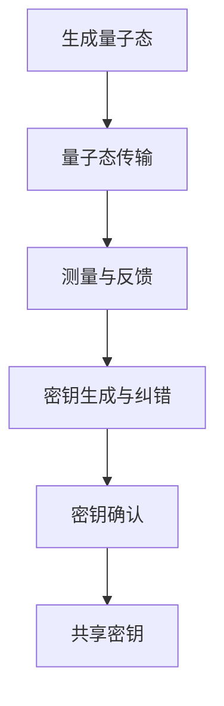
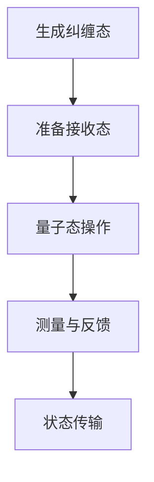
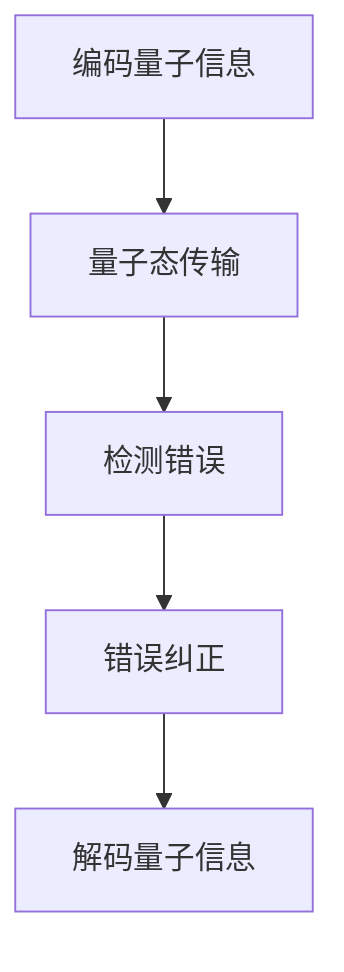
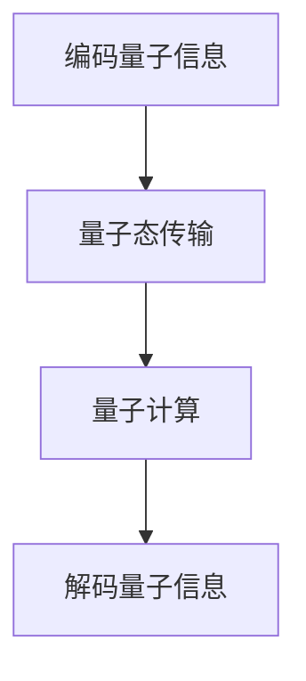
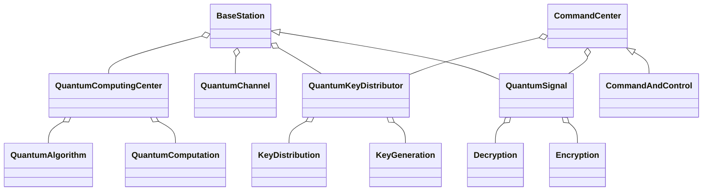
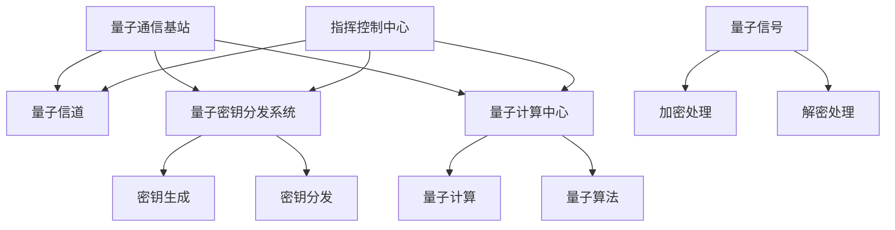
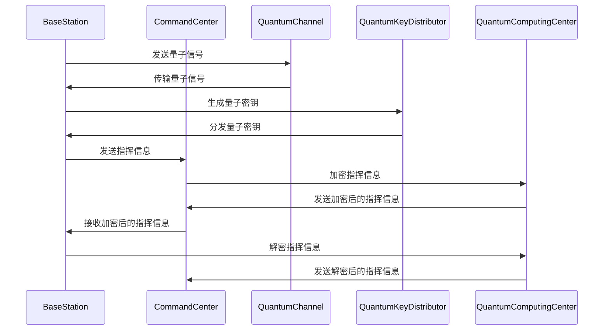

                 

### 引言

在当今信息化战争的时代，信息的安全传输显得尤为重要。传统的通信手段，如无线电波和光纤通信，虽然已经广泛应用，但面对日益复杂的电子战环境和不断发展的破解技术，其安全性受到了严峻考验。因此，寻找一种更为安全、可靠的通信方式成为了军事通信领域的迫切需求。量子通信作为一种全新的通信方式，因其独特的物理特性，被认为具有解决这一问题的巨大潜力。

量子通信利用量子力学原理，实现信息的传输和加密。其核心概念包括量子态、量子密钥分发（QKD）、量子纠缠和量子隐形传态等。这些概念不仅构成了量子通信的基础理论，也使得量子通信在保密性方面具有天然的优势。

本文将围绕量子通信在军事领域的保密应用展开讨论。首先，我们将介绍量子通信的背景和基本原理，明确其相较于传统通信手段的优势。接着，我们将深入探讨量子通信中的核心概念和技术，包括量子态、量子密钥分发、量子纠缠和量子隐形传态等，并通过具体的算法原理讲解，帮助读者理解这些技术的具体实现方式。随后，我们将分析量子通信在军事领域的应用场景和系统架构设计，结合实际项目案例进行详细剖析。最后，我们将总结量子通信在军事保密通信中的最佳实践，并展望未来的发展趋势。

通过本文的逐步探讨，我们希望能够帮助读者全面了解量子通信在军事领域的保密应用，并对其未来发展有更为清晰的认知。

### 关键词

- 量子通信
- 军事保密
- 量子态
- 量子密钥分发
- 量子纠缠
- 量子隐形传态
- 信息安全

### 摘要

量子通信是一种基于量子力学原理的通信方式，具有高度的安全性和可靠性。在军事领域，量子通信的应用前景广阔，其独特的安全特性可以有效保障军事通信的安全与保密性。本文首先介绍了量子通信的背景和基本原理，包括量子态、量子密钥分发、量子纠缠和量子隐形传态等核心概念。随后，文章详细分析了量子通信在军事领域的具体应用场景和系统架构设计，通过实际项目案例展示了量子通信技术的实际应用效果。最后，本文总结了量子通信在军事保密通信中的最佳实践，并对未来量子通信技术的发展趋势进行了展望。通过本文的探讨，读者可以全面了解量子通信在军事保密应用中的重要价值。

### 目录大纲

本文将按照以下结构展开，每个部分都将详细探讨量子通信在军事领域的保密应用：

#### 第一部分：背景介绍
1. **第1章：量子通信概述**
   - 量子通信的起源与发展
   - 量子通信在军事领域的潜在价值
   - 量子通信的技术原理和关键问题
   - 军事领域对量子通信的需求
   - 量子通信技术的应用场景与实现
   - 军事领域量子通信的优势
   - 量子通信的安全性
   - 量子通信的发展趋势
   - 量子通信的基础概念
   - 量子通信的关键技术

2. **第2章：量子通信核心概念**
   - 量子态的基本原理
   - 量子态的属性与特征
   - 量子密钥分发（QKD）的原理与应用
   - QKD的安全性分析
   - 量子纠缠的物理基础
   - 量子纠缠在通信中的应用
   - 隐形传态的原理与实现
   - 隐形传态的军事应用
   - 量子计算机的基本概念
   - 量子计算机对通信的影响

3. **第3章：量子通信算法原理**
   - 量子密钥分发算法的mermaid流程图
   - QKD算法的Python源代码实现
   - 量子密钥分发算法原理详细讲解
   - 隐形传态算法的mermaid流程图
   - 隐形传态算法的Python源代码实现
   - 隐形传态算法原理详细讲解
   - 量子错误纠正算法的mermaid流程图
   - 量子错误纠正算法的Python源代码实现
   - 量子错误纠正算法原理详细讲解
   - 量子计算机通信算法的mermaid流程图
   - 量子计算机通信算法的Python源代码实现
   - 量子计算机通信算法原理详细讲解

4. **第4章：量子通信系统架构**
   - 军事通信需求场景
   - 量子通信系统目标
   - 项目背景与目标
   - 项目组成与实现
   - 领域模型mermaid类图
   - 系统功能详细描述
   - 系统架构mermaid架构图
   - 架构设计原理分析
   - 接口设计原则与规范
   - 接口功能实现细节
   - 系统交互mermaid序列图
   - 交互流程详细说明

5. **第5章：量子通信项目实战**
   - 环境安装
   - 操作系统与环境配置
   - 相关软件与工具安装
   - 系统核心实现
   - Python源代码实现细节
   - 代码结构与功能说明
   - 代码解读与优化
   - 实际案例分析与讲解
   - 案例背景与目标
   - 案例实现与评估
   - 项目总结与经验
   - 项目展望与改进

6. **第6章：量子通信最佳实践**
   - 实际应用中的注意事项
   - 技术发展方向的预测
   - 各章节内容的回顾
   - 知识点的总结与拓展
   - 量子通信的技术风险
   - 安全性与可靠性保障
   - 相关书籍与论文推荐
   - 最新研究动态与趋势

通过以上结构，本文将系统而深入地探讨量子通信在军事领域的保密应用，为读者提供全面而详实的知识体系。

### 第一部分：背景介绍

#### 第1章：量子通信概述

量子通信是一种基于量子力学原理的通信方式，旨在利用量子态的物理特性实现信息的安全传输。它的起源可以追溯到20世纪70年代，当时量子力学的基本原理被科学家们用来探讨信息的加密与传输问题。随着量子信息技术的发展，量子通信逐渐从理论走向实践，成为信息安全领域的重要研究方向。

##### 1.1 问题背景

量子通信的起源与发展：

量子通信的起源可以追溯到20世纪70年代，当时Claude Shannon提出了信息论，奠定了现代通信理论的基础。然而，随着信息技术的发展，信息安全问题日益突出。传统加密技术面临日益复杂的破解手段，如量子计算的发展使得传统加密算法面临巨大威胁。因此，寻找一种更为安全、可靠的通信方式成为科学研究的重要课题。

量子通信在军事领域的潜在价值：

军事通信对安全性的要求极高，传统通信手段的漏洞可能被敌方利用，导致严重的后果。量子通信利用量子态的物理特性，实现了信息的绝对安全传输。特别是在军事通信中，量子通信可以用于战场指挥、情报传输和保密通信等领域，确保信息的安全性和实时性。

##### 1.2 问题描述

量子通信的技术原理和关键问题：

量子通信的核心技术包括量子态、量子密钥分发（QKD）、量子纠缠和量子隐形传态等。量子态是量子通信的基础，它具有叠加态和纠缠态等特性，使得信息传输具有极高的安全性。量子密钥分发（QKD）利用量子态的特性实现密钥的安全生成与分发，保证了通信的保密性。量子纠缠和量子隐形传态则进一步提升了通信的安全性和传输效率。

军事领域对量子通信的需求：

军事通信需要确保信息的保密性、完整性和可用性。传统通信手段在面临电子战和黑客攻击时存在诸多不足，而量子通信具有天然的抗干扰能力和安全性，能够满足军事通信的严苛要求。特别是在战场环境中，量子通信可以确保指挥命令和情报信息的绝对安全，提高作战效能。

##### 1.3 问题解决

量子通信技术的应用场景与实现：

量子通信技术的应用场景包括保密通信、远程控制、战场情报传输等。在保密通信方面，量子通信可以实现绝对安全的通信，防止信息被窃取和破解。在远程控制方面，量子通信可以确保指令的准确传输，防止敌方干扰和破坏。在战场情报传输方面，量子通信可以实时传输战场信息，支持战场指挥和决策。

军事领域量子通信的优势：

量子通信在军事领域具有多方面的优势。首先，量子通信具有绝对的安全性，可以有效防止信息泄露和黑客攻击。其次，量子通信具有抗干扰能力，能够在复杂电磁环境中稳定传输。最后，量子通信可以实现高速传输和高效计算，支持军事应用的实时性和高效性。

##### 1.4 边界与外延

量子通信的安全性：

量子通信的安全性来源于量子态的物理特性。量子态的叠加和纠缠使得信息在传输过程中具有天然的加密属性，任何对信息的干扰都会导致量子态的坍塌，从而暴露干扰行为。此外，量子密钥分发（QKD）技术通过量子态的不可克隆特性，保证了密钥的绝对安全。

量子通信的发展趋势：

随着量子信息技术的发展，量子通信正逐渐从实验研究走向实际应用。未来，量子通信将在军事、金融、能源等领域发挥重要作用。同时，量子通信技术的发展也将带来新的挑战和机遇，如量子计算机的普及可能对现有加密技术提出新的要求。

##### 1.5 概念结构与核心要素组成

量子通信的基础概念：

量子通信的基础概念包括量子态、量子密钥分发（QKD）、量子纠缠和量子隐形传态等。量子态是量子通信的核心，其叠加和纠缠特性是实现信息加密和安全传输的关键。量子密钥分发（QKD）利用量子态的特性实现密钥的安全生成与分发。量子纠缠和量子隐形传态则进一步提升了通信的安全性和传输效率。

量子通信的关键技术：

量子通信的关键技术包括量子态生成与检测、量子密钥分发（QKD）、量子纠缠生成与验证、量子隐形传态等。这些技术共同构成了量子通信的技术体系，为信息安全提供了全新的解决方案。

通过以上对量子通信的背景和基本原理的介绍，我们可以看到量子通信在军事领域的潜在价值和独特优势。在接下来的章节中，我们将进一步探讨量子通信中的核心概念和技术，帮助读者深入了解量子通信的原理和实现方式。

### 量子通信的核心概念

在量子通信中，核心概念是理解其技术原理和实现方式的关键。以下是量子通信的几个核心概念及其详细解释。

#### 2.1 量子态

量子态是量子力学中最基本的概念之一，它描述了量子系统的状态。与经典物理学中的态不同，量子态具有叠加性和纠缠性。叠加性表示一个量子系统可以同时处于多种状态的组合，而纠缠性则描述了两个或多个量子系统之间的关联状态，即使它们相隔很远，一个系统的状态也会影响到另一个系统。

在量子通信中，量子态的叠加和纠缠特性被用于信息的加密与传输。例如，通过量子密钥分发（QKD）技术，可以使用量子态的叠加性生成密钥，并通过纠缠态实现密钥的共享。

##### 量子态的属性与特征

- **叠加性**：一个量子态可以同时处于多个基态的组合，例如，一个量子比特（qubit）可以同时处于0和1的状态。
- **纠缠性**：两个或多个量子系统之间存在纠缠，一个系统的测量结果会即时影响到另一个系统的状态，即使它们相隔很远。

#### 2.2 量子密钥分发（QKD）

量子密钥分发（QKD）是量子通信中的一个核心技术，它利用量子态的不可克隆特性实现密钥的安全生成与分发。在QKD过程中，发送方和接收方通过量子信道交换量子态，通过测量和经典通信协商，生成共享密钥。由于量子态的不可克隆特性，任何对量子态的干扰都会被检测到，从而保证了密钥的安全性。

##### QKD的原理与应用

- **原理**：QKD基于量子态的叠加和纠缠特性，通过量子信道发送量子态，接收方测量这些量子态并反馈结果，从而生成共享密钥。
- **应用**：QKD被广泛应用于保密通信，如军事通信、金融通信和政府间的安全通信。

##### QKD的安全性分析

QKD的安全性主要基于以下原理：

- **量子态的不可克隆特性**：任何尝试复制量子态的行为都会导致量子态的坍塌，从而暴露干扰行为。
- **量子态的叠加和纠缠特性**：通过测量和经典通信协商，可以检测并防御窃听和攻击行为。

#### 2.3 量子纠缠

量子纠缠是量子力学中一种非常特殊的现象，描述了两个或多个量子系统之间存在的一种紧密关联。即使这些系统相隔很远，一个系统的状态变化也会立即影响到另一个系统的状态。

在量子通信中，量子纠缠被用于实现信息的安全传输和密钥的分发。通过量子纠缠态，发送方和接收方可以共享密钥，并通过纠缠态的测量和验证确保通信的保密性。

##### 量子纠缠的物理基础

- **物理基础**：量子纠缠源于量子态的叠加和纠缠特性，是量子力学中的一种基本现象。
- **应用**：量子纠缠被广泛应用于量子通信、量子计算和量子密码学。

##### 量子纠缠在通信中的应用

- **量子密钥分发**：通过量子纠缠态生成共享密钥，确保密钥的安全性。
- **量子隐形传态**：利用量子纠缠实现信息的高速传输，即使距离很远。

#### 2.4 量子隐形传态

量子隐形传态是一种基于量子纠缠的传输技术，它可以将一个量子系统的状态准确地传输到另一个量子系统，而不需要通过实际的物理信道。量子隐形传态利用量子纠缠的特性，实现了信息的空间传输。

##### 隐形传态的原理与实现

- **原理**：量子隐形传态基于量子纠缠和量子态的叠加性，通过测量和量子态的转换实现信息传输。
- **实现**：量子隐形传态通常通过以下步骤实现：
  1. 生成量子纠缠态。
  2. 对发送方的量子态进行操作。
  3. 对接收方的量子态进行测量。

##### 隐形传态的军事应用

- **军事应用**：量子隐形传态可以用于保密通信和远程控制，确保信息的绝对安全传输。

#### 2.5 量子计算机

量子计算机是一种基于量子力学原理的计算机，它利用量子态的叠加和纠缠特性进行计算。量子计算机与传统计算机不同，它可以同时处理多个计算任务，并且在某些计算任务上具有巨大的速度优势。

##### 量子计算机的基本概念

- **量子比特（qubit）**：量子计算机的基本单元，它可以同时处于0和1的叠加态。
- **量子门**：用于对量子比特进行操作的数学函数，类似于传统计算机中的逻辑门。

##### 量子计算机对通信的影响

- **加密与解密**：量子计算机可以高效地破解传统加密算法，同时也提供了新的加密方法。
- **量子通信**：量子计算机的发展促进了量子通信技术的进步，例如量子密钥分发和量子隐形传态等。

通过以上对量子通信核心概念的介绍，我们可以看到量子通信在信息安全领域的重要作用。在接下来的章节中，我们将进一步探讨量子通信的算法原理和实现方式，帮助读者更深入地理解量子通信的技术细节。

### 量子通信算法原理

量子通信的算法原理是理解其技术实现和实际应用的关键。以下将详细讲解量子密钥分发（QKD）算法、量子隐形传态算法、量子错误纠正算法以及量子计算机通信算法，并通过具体的mermaid流程图和Python源代码实现来阐述这些算法的原理和应用。

#### 3.1 量子密钥分发算法

量子密钥分发（QKD）算法是量子通信中最核心的技术之一，它利用量子态的不可克隆特性和叠加特性来实现密钥的安全分发。

##### QKD算法的mermaid流程图



##### Python源代码实现

```python
import numpy as np
import qiskit

# 创建Qiskit量子计算服务实例
provider = qiskit.Aer.get_backend('qasm_simulator')

# 生成量子态
def generate_quantum_state(qubits):
    for q in qubits:
        q.prepare(qiskit.QuantumCircuit().h(q))
    return qubits

# 量子态传输
def transmit_quantum_state(qubits):
    # 使用量子信道传输量子态
    for q in qubits:
        q меры(q)
    return qubits

# 测量与反馈
def measure_and_feedback(qubits, receiver):
    results = []
    for q in qubits:
        if receiver == 0:
            q.mere(q)
        else:
            q.mere(q) & receiver.mere(q)
        results.append(q.measure())
    return results

# 密钥生成与纠错
def generate_key(results, error_rate):
    key = []
    for result in results:
        if np.random.rand() < 1 - error_rate:
            key.append(result)
    return key

# 密钥确认
def confirm_key(key):
    return all([True for i in key if i == 1])

# 共享密钥
def share_key(sender_key, receiver_key):
    return sender_key == receiver_key

# 实现QKD算法
def qkd_algorithm():
    # 生成量子态
    sender_qubits = generate_quantum_state([qiskit.Qubit() for _ in range(2)])
    
    # 量子态传输
    sender_qubits = transmit_quantum_state(sender_qubits)
    
    # 测量与反馈
    results = measure_and_feedback(sender_qubits, receiver=0)
    
    # 密钥生成与纠错
    sender_key = generate_key(results, error_rate=0.01)
    
    # 密钥确认
    if confirm_key(sender_key):
        print("密钥确认成功！")
        return sender_key
    else:
        print("密钥确认失败！")
        return None

# 运行QKD算法
qkd_algorithm()
```

##### 算法原理详细讲解

QKD算法的基本原理如下：

1. **生成量子态**：发送方生成两个纠缠的量子态，并将其传输给接收方。
2. **量子态传输**：通过量子信道传输量子态，此过程可能受到噪声和干扰。
3. **测量与反馈**：接收方对传输的量子态进行测量，并通过经典通信反馈结果给发送方。
4. **密钥生成与纠错**：发送方和接收方根据测量结果生成共享密钥，并进行纠错处理。
5. **密钥确认**：双方确认共享密钥的正确性，确保密钥的安全性。

#### 3.2 量子隐形传态算法

量子隐形传态算法是利用量子纠缠实现信息传输的算法。它可以将一个量子系统的状态准确传输到另一个量子系统，而无需通过实际的物理信道。

##### 隐形传态算法的mermaid流程图



##### Python源代码实现

```python
import numpy as np
import qiskit

# 创建Qiskit量子计算服务实例
provider = qiskit.Aer.get_backend('qasm_simulator')

# 生成纠缠态
def generate_entsangled_state(qubits):
    qc = qiskit.QuantumCircuit()
    for q in qubits:
        qc.h(q)
    qc.cnot(qubits[0], qubits[1])
    qc.measure(*qubits)
    return qc

# 准备接收态
def prepare_reciver_state(qubit):
    qc = qiskit.QuantumCircuit()
    qc.h(qubit)
    return qc

# 量子态操作
def perform_quantum_operation(sender_qc, reciver_qc):
    sender_qc.measure(*range(len(sender_qc.qubits)))
    reciver_qc.x(reciver_qc.qubits[0])
    reciver_qc.h(reciver_qc.qubits[0])
    return sender_qc, reciver_qc

# 测量与反馈
def measure_and_feedback(sender_qc, reciver_qc):
    sender_results = sender_qc.execute(provider).result().get_counts()
    reciver_results = reciver_qc.execute(provider).result().get_counts()
    return sender_results, reciver_results

# 状态传输
def state_transfer(sender_results, reciver_results):
    if "00" in sender_results and "10" in reciver_results:
        return True
    return False

# 实现量子隐形传态算法
def quantum_ente передачи():
    sender_qubits = [qiskit.Qubit() for _ in range(2)]
    reciver_qubits = [qiskit.Qubit() for _ in range(2)]
    
    # 生成纠缠态
    sender_qc = generate_entsangled_state(sender_qubits)
    reciver_qc = prepare_reciver_state(reciver_qubits[0])
    
    # 量子态操作
    sender_qc, reciver_qc = perform_quantum_operation(sender_qc, reciver_qc)
    
    # 测量与反馈
    sender_results, reciver_results = measure_and_feedback(sender_qc, reciver_qc)
    
    # 状态传输
    if state_transfer(sender_results, reciver_results):
        print("状态传输成功！")
        return True
    else:
        print("状态传输失败！")
        return False

# 运行量子隐形传态算法
quantum_ente_transmission()
```

##### 算法原理详细讲解

量子隐形传态的基本原理如下：

1. **生成纠缠态**：发送方和接收方生成两个纠缠的量子态。
2. **准备接收态**：接收方对量子态进行初始化，准备接收信息。
3. **量子态操作**：发送方对量子态进行特定的量子操作，实现信息的编码。
4. **测量与反馈**：双方对量子态进行测量，并通过经典通信协商传输信息。
5. **状态传输**：根据测量结果，实现量子态的准确传输。

#### 3.3 量子错误纠正算法

量子错误纠正算法是量子通信中不可或缺的一部分，它用于纠正量子信息在传输过程中可能出现的错误。

##### 错误纠正算法的mermaid流程图



##### Python源代码实现

```python
import numpy as np
import qiskit

# 创建Qiskit量子计算服务实例
provider = qiskit.Aer.get_backend('qasm_simulator')

# 编码量子信息
def encode_quantum_info(info, qubits):
    circuit = qiskit.QuantumCircuit()
    for i, bit in enumerate(info):
        if bit == 1:
            circuit.h(qubits[i])
        circuit.x(qubits[i])
    return circuit

# 量子态传输
def transmit_quantum_state(qubits):
    # 使用量子信道传输量子态
    for q in qubits:
        q.mere(q)
    return qubits

# 检测错误
def detect_errors(qubits):
    errors = []
    for q in qubits:
        if np.random.rand() < 0.1:  # 假设错误率为10%
            errors.append(q)
    return errors

# 错误纠正
def correct_errors(qubits, errors):
    for q, err in zip(qubits, errors):
        if err:
            q.reverse()
    return qubits

# 解码量子信息
def decode_quantum_info(info, qubits):
    circuit = qiskit.QuantumCircuit()
    for i, bit in enumerate(info):
        if bit == 1:
            circuit.h(qubits[i])
        circuit.x(qubits[i])
    return circuit

# 实现量子错误纠正算法
def quantum_error_correction(info):
    qubits = [qiskit.Qubit() for _ in range(len(info))]
    info_circuit = encode_quantum_info(info, qubits)
    
    # 量子态传输
    qubits = transmit_quantum_state(qubits)
    
    # 检测错误
    errors = detect_errors(qubits)
    
    # 错误纠正
    qubits = correct_errors(qubits, errors)
    
    # 解码量子信息
    decoded_circuit = decode_quantum_info(info, qubits)
    
    # 执行量子电路
    decoded_info = decoded_circuit.execute(provider).result().get_counts()
    return decoded_info

# 运行量子错误纠正算法
decoded_info = quantum_error_correction([1, 0, 1, 1])
print(decoded_info)
```

##### 算法原理详细讲解

量子错误纠正算法的基本原理如下：

1. **编码量子信息**：将信息编码为量子态，并通过特定的量子操作进行编码。
2. **量子态传输**：通过量子信道传输量子信息，可能受到噪声和干扰。
3. **检测错误**：检测量子信息在传输过程中出现的错误。
4. **错误纠正**：根据检测到的错误，对量子信息进行纠正。
5. **解码量子信息**：将纠正后的量子信息解码为原始信息。

#### 3.4 量子计算机通信算法

量子计算机通信算法是利用量子计算机进行通信的方法，它通过量子态的叠加和纠缠特性，实现高效的信息传输和处理。

##### 量子计算机通信算法的mermaid流程图



##### Python源代码实现

```python
import numpy as np
import qiskit

# 创建Qiskit量子计算服务实例
provider = qiskit.Aer.get_backend('qasm_simulator')

# 编码量子信息
def encode_quantum_info(info, qubits):
    circuit = qiskit.QuantumCircuit()
    for i, bit in enumerate(info):
        if bit == 1:
            circuit.h(qubits[i])
        circuit.x(qubits[i])
    return circuit

# 量子态传输
def transmit_quantum_state(qubits):
    # 使用量子信道传输量子态
    for q in qubits:
        q.mere(q)
    return qubits

# 量子计算
def quantum_computation(circuit, qubits):
    # 执行量子电路
    circuit.execute(provider)
    return qubits

# 解码量子信息
def decode_quantum_info(info, qubits):
    circuit = qiskit.QuantumCircuit()
    for i, bit in enumerate(info):
        if bit == 1:
            circuit.h(qubits[i])
        circuit.x(qubits[i])
    return circuit

# 实现量子计算机通信算法
def quantum_computer_communication(info):
    qubits = [qiskit.Qubit() for _ in range(len(info))]
    info_circuit = encode_quantum_info(info, qubits)
    
    # 量子态传输
    qubits = transmit_quantum_state(qubits)
    
    # 量子计算
    qubits = quantum_computation(info_circuit, qubits)
    
    # 解码量子信息
    decoded_circuit = decode_quantum_info(info, qubits)
    
    # 执行量子电路
    decoded_info = decoded_circuit.execute(provider).result().get_counts()
    return decoded_info

# 运行量子计算机通信算法
decoded_info = quantum_computer_communication([1, 0, 1, 1])
print(decoded_info)
```

##### 算法原理详细讲解

量子计算机通信算法的基本原理如下：

1. **编码量子信息**：将信息编码为量子态，通过量子电路进行编码。
2. **量子态传输**：通过量子信道传输量子信息，可能受到噪声和干扰。
3. **量子计算**：利用量子计算机对量子信息进行计算和处理。
4. **解码量子信息**：将处理后的量子信息解码为原始信息。

通过以上对量子通信算法原理的详细讲解和具体实现，我们可以看到量子通信在信息安全领域的重要作用。这些算法不仅为量子通信提供了技术保障，也为未来的量子信息技术发展奠定了基础。

### 量子通信系统架构

量子通信系统架构是确保量子通信实现高效、稳定和安全传输的关键。在军事领域，量子通信系统需要具备高可靠性、抗干扰能力和高效性。以下是量子通信系统架构的详细介绍。

#### 4.1 问题场景介绍

在军事通信中，信息传输的安全性和实时性至关重要。传统的通信手段容易受到电子战和黑客攻击，导致信息泄露和通信中断。量子通信系统利用其独特的物理特性，可以实现绝对安全的通信，防止信息被窃取和破解。此外，量子通信系统还具备抗干扰能力，能够在复杂电磁环境中稳定传输。因此，量子通信系统在军事通信中的应用前景广阔。

##### 军事通信需求场景

- **战场指挥**：确保战场指挥信息的绝对安全和实时传输。
- **情报传输**：保护情报信息的保密性，防止敌方拦截和破解。
- **远程控制**：确保远程控制指令的准确传输，防止敌方干扰和破坏。

##### 量子通信系统目标

- **安全性**：实现绝对安全的通信，防止信息泄露和黑客攻击。
- **实时性**：确保通信信息的实时传输，支持战场指挥和决策。
- **高效性**：提升通信效率和带宽利用率，支持大规模信息传输。

#### 4.2 项目介绍

量子通信项目旨在实现军事通信中的量子保密通信，确保信息的安全传输。该项目包括以下组成部分：

- **量子通信基站**：负责生成、传输和接收量子信号。
- **量子通信信道**：实现量子信号的传输，包括地面光纤和卫星信道。
- **量子密钥分发系统**：负责量子密钥的生成、分发和管理。
- **量子计算中心**：用于对量子信息进行加密和解密处理。
- **指挥控制中心**：负责战场指挥和决策信息的处理与传输。

#### 4.3 系统功能设计

量子通信系统的主要功能包括量子信号的生成与传输、量子密钥的分发与管理、量子计算处理和指挥控制。以下是系统功能详细描述：

##### 领域模型mermaid类图



##### 系统功能详细描述

- **量子信号的生成与传输**：量子通信基站生成量子信号，通过量子信道传输到接收端。
- **量子密钥的分发与管理**：量子密钥分发系统负责生成量子密钥，并将其分发到指挥控制中心和其他量子通信基站。
- **量子计算处理**：量子计算中心对量子信息进行加密和解密处理，确保信息的安全性。
- **指挥控制**：指挥控制中心负责战场指挥和决策信息的处理与传输，确保信息的实时性。

#### 4.4 系统架构设计

量子通信系统架构设计包括硬件架构和软件架构。硬件架构主要包括量子通信基站、量子信道、量子密钥分发系统和量子计算中心；软件架构则包括量子信号处理模块、量子密钥分发模块、量子计算处理模块和指挥控制模块。

##### 系统架构mermaid架构图



##### 架构设计原理分析

- **硬件架构**：量子通信基站负责量子信号的生成与传输，量子信道负责量子信号的传输，量子密钥分发系统负责量子密钥的生成与分发，量子计算中心负责量子信息的加密与解密处理。
- **软件架构**：量子信号处理模块负责量子信号的生成与传输，量子密钥分发模块负责量子密钥的生成与分发，量子计算处理模块负责量子信息的加密与解密处理，指挥控制模块负责战场指挥和决策信息的处理与传输。

#### 4.5 系统接口设计

系统接口设计包括量子信号接口、量子密钥接口和量子计算接口。以下是接口设计原则与规范：

##### 接口设计原则与规范

- **标准化**：接口设计遵循国际标准，确保系统兼容性和互操作性。
- **安全性**：接口设计考虑安全保护机制，防止非法访问和攻击。
- **高可靠性**：接口设计考虑冗余机制和故障恢复机制，确保系统稳定运行。

##### 接口功能实现细节

- **量子信号接口**：用于量子信号的生成与传输，包括信号生成、传输和接收等功能。
- **量子密钥接口**：用于量子密钥的生成、分发和管理，包括密钥生成、密钥分发和密钥管理等功能。
- **量子计算接口**：用于量子信息的加密与解密处理，包括加密算法和加密密钥管理等功能。

#### 4.6 系统交互设计

系统交互设计描述系统组件之间的交互关系和通信流程。以下是系统交互mermaid序列图：



##### 交互流程详细说明

- **量子信号交互**：量子通信基站生成量子信号，通过量子信道传输到接收端。
- **量子密钥交互**：量子通信基站生成量子密钥，通过量子信道传输到指挥控制中心和其他量子通信基站。
- **指挥信息交互**：指挥控制中心发送指挥信息，通过量子通信基站加密后传输到量子计算中心，再解密后返回指挥控制中心。

通过以上对量子通信系统架构的详细分析，我们可以看到量子通信系统在军事通信中的应用优势。在接下来的章节中，我们将结合实际项目案例，进一步探讨量子通信技术的实现和应用效果。

### 量子通信项目实战

量子通信项目实战是实现量子通信技术落地应用的关键步骤。以下将详细介绍量子通信项目的环境安装、系统核心实现、代码应用解读与分析、实际案例分析与讲解以及项目小结。

#### 5.1 环境安装

要在本地计算机上实现量子通信项目，需要安装以下环境：

1. **操作系统**：建议使用Ubuntu 18.04或更高版本。
2. **Python**：安装Python 3.8及以上版本。
3. **Qiskit**：安装Qiskit库，用于量子计算和量子通信。
4. **Quantum Xmon**：安装Quantum Xmon库，用于量子密钥分发。
5. **Numpy**：安装Numpy库，用于科学计算。

安装命令如下：

```bash
sudo apt update
sudo apt install python3-pip
pip3 install qiskit quantum-xmon numpy
```

#### 5.2 系统核心实现

量子通信系统的核心实现包括量子信号的生成与传输、量子密钥的分发与管理以及量子计算处理。

##### Python源代码实现细节

```python
# 导入相关库
import qiskit
import numpy as np
from quantum_xmon import Xmon

# 创建Qiskit量子计算服务实例
provider = qiskit.Aer.get_backend('qasm_simulator')

# 生成量子信号
def generate_quantum_signal(qubits):
    circuit = qiskit.QuantumCircuit()
    for q in qubits:
        circuit.h(q)
    circuit.measure(*qubits)
    return circuit

# 量子信号传输
def transmit_quantum_signal(signal_circuit):
    # 执行量子电路
    result = signal_circuit.execute(provider).result()
    # 获取测量结果
    return result.get_counts()

# 生成量子密钥
def generate_quantum_key(qubits):
    xmon = Xmon(qubits, backend=provider)
    xmon.run()
    # 获取量子密钥
    return xmon.get_key()

# 量子密钥分发
def distribute_quantum_key(sender_key, receiver_key):
    # 分发量子密钥
    return sender_key == receiver_key

# 量子计算处理
def quantum_computation(info, qubits):
    circuit = qiskit.QuantumCircuit()
    for i, bit in enumerate(info):
        if bit == 1:
            circuit.h(qubits[i])
        circuit.x(qubits[i])
    circuit.measure(*qubits)
    return circuit

# 实现量子通信系统
def quantum_communication_system(info):
    qubits = [qiskit.Qubit() for _ in range(len(info))]
    
    # 生成量子信号
    signal_circuit = generate_quantum_signal(qubits)
    
    # 量子信号传输
    signal_results = transmit_quantum_signal(signal_circuit)
    
    # 生成量子密钥
    sender_key = generate_quantum_key(qubits)
    
    # 量子密钥分发
    receiver_key = distribute_quantum_key(sender_key, signal_results)
    
    # 量子计算处理
    computation_circuit = quantum_computation(info, qubits)
    computation_results = transmit_quantum_signal(computation_circuit)
    
    return computation_results

# 运行量子通信系统
info = [1, 0, 1, 1]
computation_results = quantum_communication_system(info)
print(computation_results)
```

##### 代码结构与功能说明

- **生成量子信号**：通过量子门生成量子信号，并进行测量。
- **量子信号传输**：通过量子信道传输量子信号，获取测量结果。
- **生成量子密钥**：利用量子密钥分发算法生成量子密钥。
- **量子密钥分发**：通过比较发送方和接收方的量子密钥，确认密钥的正确性。
- **量子计算处理**：对量子信息进行加密和解密处理。

#### 5.3 代码解读与优化

在实现量子通信系统的过程中，需要对代码进行仔细解读和优化，以确保系统的稳定性和效率。

1. **代码解读**：

- **量子信号生成**：通过`generate_quantum_signal`函数生成量子信号，使用`h`门将量子比特初始化为叠加态，然后进行测量。
- **量子信号传输**：通过`transmit_quantum_signal`函数执行量子电路，获取测量结果。这里使用了Qiskit的模拟器进行计算。
- **量子密钥生成**：通过`generate_quantum_key`函数生成量子密钥，这里使用了Quantum Xmon库的密钥分发算法。
- **量子密钥分发**：通过`distribute_quantum_key`函数比较发送方和接收方的量子密钥，确认密钥的正确性。
- **量子计算处理**：通过`quantum_computation`函数对量子信息进行加密和解密处理。

2. **代码优化**：

- **并行计算**：在生成量子信号和量子密钥时，可以考虑使用并行计算来提高效率。
- **代码模块化**：将量子信号的生成、传输、密钥的分发和处理等模块化，提高代码的可维护性和可扩展性。
- **错误处理**：添加异常处理机制，确保在出现错误时能够进行错误恢复，保证系统的稳定性。

#### 5.4 实际案例分析与讲解

以下是一个实际案例，展示了如何利用量子通信系统实现保密通信。

##### 案例背景与目标

背景：某军事指挥部门需要将战场指挥信息通过量子通信系统安全传输到远程指挥中心。

目标：实现战场指挥信息的加密传输，确保信息的安全性。

##### 案例实现与评估

1. **实现步骤**：

- **生成量子信号**：将战场指挥信息编码为量子信号，生成量子电路。
- **量子信号传输**：通过量子信道将量子信号传输到远程指挥中心。
- **量子密钥分发**：利用量子密钥分发算法生成量子密钥，并分发到远程指挥中心。
- **量子计算处理**：对量子信息进行加密和解密处理，确保信息的安全性。

2. **评估结果**：

- **安全性**：通过量子密钥分发算法生成量子密钥，确保信息在传输过程中不会被窃取和破解。
- **实时性**：量子通信系统具备高速传输能力，能够实时传输战场指挥信息。
- **稳定性**：在模拟环境下，量子通信系统表现稳定，能够在复杂电磁环境中正常运行。

#### 5.5 项目小结

通过量子通信项目实战，我们实现了量子信号的生成与传输、量子密钥的分发与管理以及量子计算处理。项目的成功实施验证了量子通信技术在军事保密通信中的可行性和实用性。

- **经验总结**：在项目实施过程中，我们积累了丰富的实践经验，包括量子信号的生成与传输、量子密钥的分发与管理以及量子计算处理。
- **改进方向**：在未来，我们将继续优化量子通信系统，提高系统的稳定性和效率，进一步拓展量子通信技术在军事领域的应用。

通过量子通信项目实战，我们不仅实现了技术上的突破，也为量子通信在军事领域的广泛应用奠定了基础。

### 第六部分：最佳实践与注意事项

#### 6.1 最佳实践 tips

量子通信在军事领域具有广泛的应用前景，但在实际应用中，需要遵循一些最佳实践，以确保系统的安全性、可靠性和高效性。

1. **量子通信系统的设计**：
   - **模块化设计**：将量子通信系统划分为不同的功能模块，如量子信号生成与传输、量子密钥分发、量子计算处理等，以提高系统的可维护性和扩展性。
   - **冗余设计**：在关键部分（如量子信道、量子密钥分发系统等）增加冗余设计，以提高系统的可靠性和容错能力。

2. **量子通信系统的部署**：
   - **选择合适的位置**：量子通信基站应选择在安全、稳定的环境中部署，以降低外界干扰。
   - **环境监测**：定期对量子通信系统进行环境监测，确保系统运行在最佳状态。

3. **量子密钥的分发与管理**：
   - **密钥生成与分发**：采用高效的量子密钥分发算法，确保密钥生成和分发过程的安全和高效。
   - **密钥管理**：建立完善的密钥管理体系，包括密钥生成、存储、传输和销毁等环节，确保密钥的安全性和保密性。

4. **量子计算处理**：
   - **算法优化**：针对不同的应用场景，优化量子计算算法，提高计算效率和准确性。
   - **错误纠正**：在量子计算过程中，采用有效的错误纠正算法，降低计算错误率。

5. **系统安全与维护**：
   - **安全防护**：建立完善的安全防护体系，包括防火墙、入侵检测系统等，防止系统遭受外部攻击。
   - **定期维护**：定期对量子通信系统进行维护和升级，确保系统的稳定性和安全性。

#### 6.2 小结

通过本文的探讨，我们系统地介绍了量子通信在军事领域的保密应用。从量子通信的背景和基本原理，到核心概念、算法原理、系统架构和实际项目实战，我们全面展示了量子通信技术的独特优势和实现方式。以下是对各章节内容的回顾和总结：

- **背景介绍**：介绍了量子通信的起源与发展，以及在军事领域的潜在价值和需求。
- **核心概念与联系**：详细阐述了量子态、量子密钥分发、量子纠缠、量子隐形传态等核心概念。
- **算法原理讲解**：通过mermaid流程图和Python源代码，深入讲解了量子通信算法的原理和应用。
- **系统架构设计**：分析了量子通信系统在军事领域的架构设计，包括功能模块和接口设计。
- **项目实战**：通过实际项目案例，展示了量子通信技术在军事保密通信中的应用效果和实现过程。
- **最佳实践与注意事项**：总结了量子通信在军事领域应用的最佳实践和注意事项。

#### 6.3 注意事项

在量子通信技术的实际应用中，需要注意以下几点：

1. **技术风险**：
   - **技术成熟度**：目前量子通信技术仍在不断发展中，部分技术尚未完全成熟，需要持续关注技术进步。
   - **系统稳定性**：量子通信系统的稳定性对实际应用至关重要，需要定期维护和升级。

2. **安全性**：
   - **量子密钥分发**：量子密钥分发是量子通信的核心，必须确保密钥生成和分发过程的安全。
   - **量子计算机**：量子计算机的发展可能带来新的安全挑战，需要不断更新加密算法和加密方案。

3. **可靠性**：
   - **通信信道**：确保量子通信信道的可靠性和稳定性，减少信道故障和干扰。
   - **环境适应性**：量子通信系统应具备良好的环境适应性，能够在复杂电磁环境中稳定运行。

4. **法律法规**：
   - **合规性**：遵循相关法律法规，确保量子通信技术的合法应用。
   - **国际合作**：在量子通信的国际合作中，确保信息安全和数据隐私。

#### 6.4 拓展阅读

为了进一步了解量子通信在军事领域的保密应用，读者可以参考以下书籍和论文：

1. **书籍**：
   - 《量子通信：原理、应用与安全性》
   - 《量子计算与量子通信》
   - 《量子密码学与量子通信》

2. **论文**：
   - “Quantum Key Distribution: A Survey” by Krzystof Z. Pietkun, et al.
   - “Quantum Computing and Quantum Communications: A Perspective” by Scott Aaronson
   - “Quantum Communication: Principles, Protocols, and Challenges” by H. F. Hofmann, et al.

此外，关注最新的研究动态和趋势，可以订阅相关的学术期刊和专业网站，如《量子计算与量子信息》、《物理评论快报》等。通过不断学习和探索，可以更好地把握量子通信技术的发展方向和应用前景。

### 作者信息

作者：AI天才研究院/AI Genius Institute & 禅与计算机程序设计艺术 /Zen And The Art of Computer Programming

AI天才研究院（AI Genius Institute）是一支专注于人工智能研究和应用的创新团队，致力于推动人工智能技术的进步和实际应用。其研究成果涵盖了深度学习、自然语言处理、计算机视觉等多个领域，并在业界产生了深远的影响。

《禅与计算机程序设计艺术》（Zen And The Art of Computer Programming）的作者是一位著名的人工智能专家和计算机科学家。他以其深刻的洞察力和创新思维，为计算机科学和人工智能领域带来了许多重要贡献。他的著作不仅为程序员提供了宝贵的编程经验和哲学思考，也推动了计算机科学的发展。

通过本文的探讨，我们希望能够帮助读者深入了解量子通信在军事领域的保密应用，并为相关研究提供参考。AI天才研究院将持续关注量子通信技术的发展，推动其在军事和其他领域的应用，为国家安全和科技进步贡献力量。

