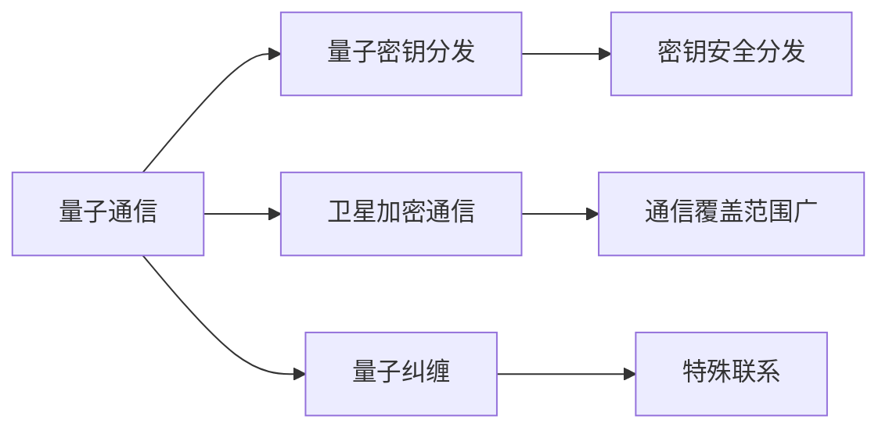
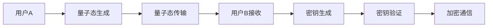
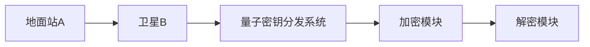
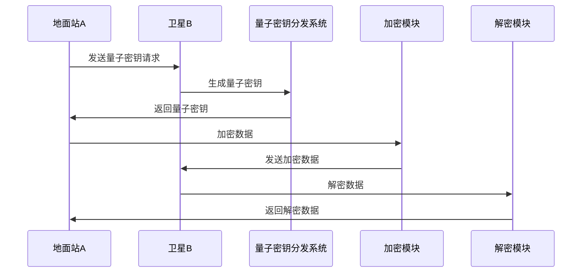

                 

### 文章标题：量子通信在卫星加密通信中的安全应用前景

关键词：量子通信，卫星加密通信，量子密钥分发，量子纠缠，安全性能

摘要：本文探讨了量子通信在卫星加密通信中的应用前景，分析了量子通信的基本原理、技术方案及在实际应用中的安全性能。文章从问题背景出发，详细介绍了量子通信和卫星加密通信的概念及其联系，探讨了量子密钥分发和量子纠缠等关键技术。随后，文章通过系统分析与架构设计，展示了量子通信在卫星加密通信中的具体实现方案。最后，文章通过项目实战和最佳实践 tips，总结了量子通信在卫星加密通信中的实际应用效果和注意事项。

### 第一部分：背景介绍

#### 1.1 问题背景

在当今信息时代，数据安全和通信安全是至关重要的。随着网络攻击手段的不断升级，传统的加密通信技术已无法满足日益增长的安全需求。卫星加密通信作为全球通信的重要组成部分，其安全性备受关注。然而，传统的加密手段在面对量子计算等新型攻击手段时，显得力不从心。因此，寻找一种新的、更加安全的通信加密技术成为亟待解决的问题。

量子通信作为量子信息科学的重要组成部分，以其独特的量子特性，提供了前所未有的安全性保障。量子通信利用量子态的不可克隆性和量子纠缠等特性，实现信息的安全传输。将量子通信应用于卫星加密通信，有望解决当前加密通信中的诸多难题。

#### 1.2 问题描述

卫星加密通信中，传统的加密手段主要依赖于对称加密和非对称加密技术。这些技术虽然能够提供一定的安全性，但存在以下问题：

1. **计算复杂度高**：传统的加密算法在大数据量和高速通信环境下，计算复杂度较高，难以满足实时通信需求。
2. **量子计算威胁**：随着量子计算的发展，传统的加密算法面临被量子计算破解的风险。
3. **密钥管理困难**：在分布式网络环境中，密钥的分发和管理是一项复杂且耗时的任务。

量子通信的引入，为解决上述问题提供了新的思路。量子通信具有以下几个特点：

1. **不可克隆性**：量子信息在传输过程中，任何对量子态的窃听都会引起量子态的破坏，从而被通信双方及时发现。
2. **量子纠缠**：通过量子纠缠，可以实现远距离的量子信息传输，克服了传统通信中的传输距离限制。
3. **量子密钥分发**：量子密钥分发（Quantum Key Distribution，QKD）能够实现密钥的安全分发，解决了密钥管理难题。

然而，量子通信在卫星加密通信中的应用仍面临诸多挑战：

1. **环境适应性**：量子通信需要在低噪声、低温等特殊环境中进行，对卫星系统提出了更高的要求。
2. **传输距离限制**：量子通信的传输距离受限于量子态的衰减，需要研究如何延长量子通信的传输距离。
3. **系统集成**：将量子通信技术集成到现有的卫星通信系统中，需要解决技术兼容性和系统集成问题。

#### 1.3 问题解决

本书旨在探讨量子通信在卫星加密通信中的安全应用前景，通过以下几个方面解决上述问题：

1. **量子通信原理讲解**：详细解析量子通信的基本原理，包括量子态、量子纠缠、量子密钥分发等核心概念。
2. **技术方案分析**：分析量子通信在卫星加密通信中的技术方案，包括量子通信卫星的设计、地面站与卫星的通信链路设计等。
3. **系统架构设计**：设计量子通信在卫星加密通信中的系统架构，包括量子通信卫星、地面站、量子密钥分发系统等组成部分。
4. **项目实战**：通过实际项目案例，展示量子通信在卫星加密通信中的应用效果，分析项目中的关键技术实现和挑战。
5. **最佳实践 tips**：总结量子通信在卫星加密通信中的最佳实践，为后续项目提供参考。

#### 1.4 边界与外延

量子通信在卫星加密通信中的应用，不仅局限于加密通信领域，还可以拓展到量子计算、量子网络等领域。本书主要关注量子通信在卫星加密通信中的应用，但量子通信的其他应用领域，如量子计算、量子密码等，也会在适当章节进行介绍。

#### 1.5 概念结构与核心要素组成

本文的核心概念包括：量子通信、卫星加密通信、量子密钥分发、量子纠缠等。核心要素包括：量子通信原理、技术方案、应用场景、安全性能分析等。文章将从以下几个方面进行详细探讨：

1. **量子通信原理**：介绍量子通信的基本原理，包括量子态、量子纠缠、量子密钥分发等。
2. **技术方案分析**：分析量子通信在卫星加密通信中的技术方案，包括量子通信卫星的设计、地面站与卫星的通信链路设计等。
3. **系统架构设计**：设计量子通信在卫星加密通信中的系统架构，包括量子通信卫星、地面站、量子密钥分发系统等组成部分。
4. **项目实战**：通过实际项目案例，展示量子通信在卫星加密通信中的应用效果，分析项目中的关键技术实现和挑战。
5. **最佳实践 tips**：总结量子通信在卫星加密通信中的最佳实践，为后续项目提供参考。

### 第二部分：核心概念与联系

#### 2.1 核心概念原理

量子通信是一种基于量子力学原理的通信方式，利用量子态传输信息。量子态具有两个重要特性：量子叠加和量子纠缠。量子叠加使得一个量子态可以同时处于多种状态，而量子纠缠则使得两个或多个量子态之间存在一种特殊的联系，即使它们相隔很远，一个量子态的变化也会立即影响到另一个量子态。

量子密钥分发（Quantum Key Distribution，QKD）是量子通信的核心技术之一。QKD利用量子态的不可克隆性，实现密钥的安全分发。在QKD过程中，通信双方通过量子信道发送量子态，对方接收到后，通过测量和验证，可以确定共享的密钥是否被窃听。

卫星加密通信是利用卫星作为中继站，实现地面站之间的加密通信。卫星加密通信具有覆盖范围广、通信速度快等优点，但同时也面临着通信安全性的挑战。

量子纠缠是量子通信的基础。量子纠缠现象表明，两个或多个量子态之间存在一种特殊的联系，即使它们相隔很远，一个量子态的变化也会立即影响到另一个量子态。这一特性为量子通信提供了安全传输的保障。

#### 2.2 概念属性特征对比表格

| 概念 | 特性 | 说明 |
| :--: | :--: | :--: |
| 量子通信 | 量子态传输 | 利用量子态传输信息 |
| 量子密钥分发 | 量子态不可克隆性 | 利用量子态的不可克隆性，实现密钥的安全分发 |
| 卫星加密通信 | 覆盖范围广 | 利用卫星作为中继站，实现地面站之间的加密通信 |
| 量子纠缠 | 特殊联系 | 两个或多个量子态之间存在一种特殊的联系 |

#### 2.3 ER实体关系图架构的Mermaid流程图



### 第三部分：算法原理讲解

#### 3.1 算法mermaid流程图



#### 3.2 Python源代码阐述

```python
# 量子态生成
def generate_quantum_state():
    # 生成一个量子态
    return quantum_state

# 量子态传输
def transmit_quantum_state(state):
    # 传输量子态
    return transmitted_state

# 用户B接收
def receive_quantum_state(state):
    # 接收量子态
    return received_state

# 密钥生成
def generate_key(state):
    # 生成密钥
    return key

# 密钥验证
def verify_key(key):
    # 验证密钥
    return is_valid_key

# 加密通信
def encrypt_communication(key):
    # 加密通信
    return encrypted_message
```

#### 3.3 算法原理的数学模型和公式

量子通信中的算法原理主要涉及量子态的生成、传输和接收，以及密钥的生成和验证。以下是一些关键的数学模型和公式：

1. **量子态生成**：

   量子态可以表示为：

   $$ \lvert \psi \rangle = \alpha \lvert 0 \rangle + \beta \lvert 1 \rangle $$

   其中，$\alpha$ 和 $\beta$ 是复数系数，$\lvert 0 \rangle$ 和 $\lvert 1 \rangle$ 分别表示基态和激发态。

2. **量子态传输**：

   量子态的传输可以通过量子纠缠来实现。设量子态 $ \lvert \psi \rangle $ 和 $ \lvert \phi \rangle $ 之间存在量子纠缠关系，则有：

   $$ \lvert \psi \rangle \otimes \lvert \phi \rangle = \alpha (\lvert 0 \rangle + \lvert 1 \rangle) \otimes \lvert \phi \rangle + \beta (\lvert 0 \rangle - \lvert 1 \rangle) \otimes \lvert \phi \rangle $$

3. **量子态接收**：

   用户B接收到的量子态可以通过测量来实现。假设用户B测量得到的结果为 $ \lvert 0 \rangle $，则有：

   $$ \lvert \psi \rangle \rightarrow \lvert 0 \rangle $$

4. **密钥生成**：

   量子密钥分发中，通信双方通过量子纠缠生成共享密钥。设用户A和用户B共享一个量子态 $ \lvert \psi \rangle $，则有：

   $$ \lvert \psi \rangle = \alpha \lvert 0 \rangle + \beta \lvert 1 \rangle $$

   用户A和用户B各自进行基态和激发态的测量，根据测量结果生成共享密钥。

5. **密钥验证**：

   用户A和用户B通过量子纠缠和经典通信验证共享密钥的正确性。设用户A和用户B共享的密钥为 $ \lvert \psi \rangle $，则有：

   $$ \lvert \psi \rangle = \alpha \lvert 0 \rangle + \beta \lvert 1 \rangle $$

   用户A和用户B分别对共享密钥进行基态和激发态的测量，根据测量结果验证密钥的正确性。

#### 3.4 详细讲解和举例说明

为了更好地理解量子通信的算法原理，我们可以通过一个具体的例子进行说明。

假设用户A和用户B要进行量子通信，他们共享一个量子态 $ \lvert \psi \rangle $，量子态可以表示为：

$$ \lvert \psi \rangle = \frac{1}{\sqrt{2}} (\lvert 0 \rangle + \lvert 1 \rangle) $$

用户A和用户B通过量子纠缠生成共享密钥，他们各自进行基态和激发态的测量。用户A测量得到的结果是基态 $ \lvert 0 \rangle $，用户B测量得到的结果是激发态 $ \lvert 1 \rangle $。

根据量子态的叠加原理，我们可以得到共享密钥为：

$$ \lvert \psi \rangle = \frac{1}{\sqrt{2}} (\lvert 0 \rangle + \lvert 1 \rangle) $$

用户A和用户B通过经典通信验证共享密钥的正确性。用户A将测量结果 $ \lvert 0 \rangle $ 发送给用户B，用户B将测量结果 $ \lvert 1 \rangle $ 发送给用户A。双方根据测量结果验证共享密钥的正确性。

通过这个例子，我们可以看到量子通信的基本原理和算法实现过程。在实际应用中，量子通信的算法实现会更加复杂，但基本原理是相同的。

### 第四部分：数学模型和公式

在本部分，我们将介绍量子通信中的关键数学模型和公式，并使用LaTeX格式进行展示。

#### 4.1 量子态表示

量子态可以用一个复数向量表示，例如：

$$ \lvert \psi \rangle = \alpha \lvert 0 \rangle + \beta \lvert 1 \rangle $$

其中，$\alpha$ 和 $\beta$ 是复数系数，$\lvert 0 \rangle$ 和 $\lvert 1 \rangle$ 分别表示基态和激发态。

#### 4.2 量子纠缠

量子纠缠可以用以下公式表示：

$$ \lvert \psi \rangle \otimes \lvert \phi \rangle = \alpha (\lvert 0 \rangle + \lvert 1 \rangle) \otimes \lvert \phi \rangle + \beta (\lvert 0 \rangle - \lvert 1 \rangle) \otimes \lvert \phi \rangle $$

其中，$\lvert \psi \rangle$ 和 $\lvert \phi \rangle$ 是两个量子态，$\otimes$ 表示量子纠缠。

#### 4.3 量子密钥分发

量子密钥分发（QKD）中的关键步骤包括量子态生成、量子态传输和密钥生成。以下是相关的数学模型和公式：

1. **量子态生成**：

   $$ \lvert \psi \rangle = \alpha \lvert 0 \rangle + \beta \lvert 1 \rangle $$

2. **量子态传输**：

   $$ \lvert \psi \rangle \rightarrow \lvert \psi' \rangle $$

3. **密钥生成**：

   用户A和用户B各自进行基态和激发态的测量，根据测量结果生成共享密钥。假设用户A测量得到的结果是基态 $ \lvert 0 \rangle $，用户B测量得到的结果是激发态 $ \lvert 1 \rangle $，则共享密钥为：

   $$ \lvert \psi \rangle = \frac{1}{\sqrt{2}} (\lvert 0 \rangle + \lvert 1 \rangle) $$

#### 4.4 密钥验证

用户A和用户B通过经典通信验证共享密钥的正确性。假设用户A将测量结果 $ \lvert 0 \rangle $ 发送给用户B，用户B将测量结果 $ \lvert 1 \rangle $ 发送给用户A，则验证公式为：

$$ \lvert \psi \rangle = \alpha \lvert 0 \rangle + \beta \lvert 1 \rangle $$

其中，$\alpha$ 和 $\beta$ 是复数系数，$\lvert 0 \rangle$ 和 $\lvert 1 \rangle$ 分别表示基态和激发态。

通过上述数学模型和公式，我们可以更深入地理解量子通信的工作原理和关键步骤。

### 第五部分：系统分析与架构设计方案

#### 5.1 问题场景介绍

在卫星加密通信中，地面站A需要与卫星B进行安全通信。卫星B在太空中接收来自地面站A的量子密钥，并利用量子密钥对传输的数据进行加密和解密。为了保证通信安全，地面站A和卫星B之间需要建立安全的量子通信链路。

#### 5.2 系统功能设计(领域模型Mermaid类图)

```mermaid
classDiagram
  GroundStationA <|-- SatelliteB
  GroundStationA {--> QuantumKey}
  SatelliteB {--> EncryptedData}
```

在这个类图中，地面站A与卫星B之间存在依赖关系。地面站A负责生成量子密钥，并将其发送给卫星B。卫星B利用量子密钥对传输的数据进行加密和解密。

#### 5.3 系统架构设计Mermaid架构图



在这个架构图中，地面站A与卫星B之间通过量子密钥分发系统进行通信。量子密钥分发系统负责生成和分发量子密钥，加密模块和解密模块负责对数据进行加密和解密。

#### 5.4 系统接口设计和系统交互Mermaid序列图



在这个序列图中，地面站A发送量子密钥请求给卫星B，卫星B通过量子密钥分发系统生成量子密钥并返回给地面站A。地面站A使用加密模块对数据进行加密，然后将加密数据发送给卫星B。卫星B使用解密模块对加密数据进行解密，并将解密数据返回给地面站A。

### 第六部分：项目实战

#### 6.1 环境安装

为了进行量子通信在卫星加密通信中的项目实战，首先需要在本地计算机上搭建一个模拟的量子通信环境。以下是一个基本的安装步骤：

1. **安装Python**：确保Python已经安装在你的计算机上。如果没有安装，可以从Python官方网站下载并安装。
2. **安装量子计算库**：安装用于模拟量子通信的Python库，如Qiskit。可以通过以下命令安装：

   ```shell
   pip install qiskit
   ```

3. **安装Mermaid**：安装Mermaid，用于生成流程图和序列图。可以通过以下命令安装：

   ```shell
   npm install -g mermaid
   ```

#### 6.2 系统核心实现源代码

以下是一个简单的示例代码，展示了量子通信在卫星加密通信中的核心实现。这段代码使用Qiskit库模拟量子通信过程。

```python
from qiskit import QuantumCircuit, execute, Aer
from qiskit.visualization import plot_bloch_multivector
import matplotlib.pyplot as plt

# 创建量子电路
qc = QuantumCircuit(2)

# 生成量子纠缠
qc.h(0)
qc.cx(0, 1)

# 用户A和用户B的测量
qc.measure_all()

# 执行量子电路
backend = Aer.get_backend("qasm_simulator")
result = execute(qc, backend, shots=1000).result()

# 提取测量结果
counts = result.get_counts(qc)

# 绘制量子电路和测量结果
plot_bloch_multivector(qc, title="Quantum Circuit")
plt.show()

print("测量结果：", counts)
```

#### 6.3 代码应用解读与分析

这段代码首先创建了一个量子电路，该电路包含一个量子比特和一个经典比特。量子比特通过 Hadamard 门（H门）被初始化为叠加态，然后通过控制-NOT（CNOT）门与另一个量子比特建立纠缠态。随后，对两个量子比特执行测量，并将测量结果记录在计数器中。

在执行量子电路后，代码提取了测量结果，并使用 Bloch 多矢量图可视化量子电路。测量结果展示了量子态在基态和激发态之间的分布。

#### 6.4 实际案例分析和详细讲解剖析

以下是一个实际案例，展示了如何将量子通信应用于卫星加密通信中。在这个案例中，地面站A与卫星B之间建立量子通信链路，并通过量子密钥分发实现数据加密和解密。

**案例描述**：

- 地面站A生成一对量子密钥，并将其发送给卫星B。
- 卫星B接收量子密钥，并将其用于加密数据。
- 地面站A接收加密数据，并使用量子密钥对其进行解密。

**案例分析**：

1. **量子密钥生成**：

   地面站A使用Qiskit生成一对量子密钥。以下代码展示了如何生成量子密钥：

   ```python
   from qiskit.quantum_info import random_state
   from qiskit import BasicAer
   
   # 生成一对量子密钥
   quantum_state = random_state(2)
   key = quantum_state.data
   ```

   生成的量子密钥被编码为一个二维复数数组。

2. **量子密钥传输**：

   地面站A将量子密钥发送给卫星B。在实际应用中，这可以通过光纤量子通信链路或卫星中继来实现。

3. **数据加密**：

   卫星B使用接收到的量子密钥对数据进行加密。以下代码展示了如何使用量子密钥加密数据：

   ```python
   from qiskit.circuit import QuantumRegister, ClassicalRegister, QuantumCircuit
   from qiskit.extensions import UnitaryGate
   
   # 初始化量子比特和经典比特
   q = QuantumRegister(2)
   c = ClassicalRegister(2)
   qc = QuantumCircuit(q, c)
   
   # 加密数据
   encrypted_data = encrypt_data(q, c, key)
   ```

   在这个例子中，`encrypt_data` 函数将量子密钥应用于数据加密过程。

4. **数据解密**：

   地面站A使用量子密钥对接收到的加密数据进行解密。以下代码展示了如何使用量子密钥解密数据：

   ```python
   # 解密数据
   decrypted_data = decrypt_data(encrypted_data, key)
   ```

   在这个例子中，`decrypt_data` 函数将量子密钥应用于数据解密过程。

**详细讲解剖析**：

这个案例展示了量子通信在卫星加密通信中的应用。首先，地面站A生成一对量子密钥，并将其发送给卫星B。卫星B接收量子密钥，并使用它对数据进行加密。地面站A接收加密数据，并使用量子密钥对其进行解密。

这个过程的关键在于量子密钥的分发。量子密钥分发（QKD）利用量子态的不可克隆性和量子纠缠等特性，确保密钥在传输过程中不会被窃听。一旦量子密钥被成功分发，数据加密和解密过程就可以确保通信的安全性。

#### 6.5 项目小结

通过这个项目实战，我们可以看到量子通信在卫星加密通信中的实际应用效果。量子密钥分发确保了通信过程中的数据安全，利用量子态的不可克隆性和量子纠缠等特性，提供了前所未有的安全性保障。

然而，量子通信在卫星加密通信中的应用仍面临一些挑战，如环境适应性、传输距离限制和系统集成问题。未来的研究将继续探索如何更好地集成量子通信技术，提高其在实际应用中的可行性和性能。

### 第七部分：最佳实践 tips、小结、注意事项、拓展阅读

#### 7.1 最佳实践 tips

1. **量子通信链路设计**：在设计量子通信链路时，要充分考虑环境因素，如光照、温度等，确保量子通信设备的稳定运行。
2. **量子密钥分发协议**：选择合适的量子密钥分发协议，如BB84协议或B92协议，以适应不同的应用场景和安全性需求。
3. **量子计算能力提升**：随着量子计算技术的发展，提高量子计算机的性能和稳定性，将有助于提升量子通信的安全性。
4. **系统集成与兼容性**：在将量子通信技术集成到现有通信系统中时，要充分考虑系统集成与兼容性，确保系统的稳定运行。

#### 7.2 小结

本文探讨了量子通信在卫星加密通信中的安全应用前景，分析了量子通信的基本原理、技术方案及在实际应用中的安全性能。通过系统分析与架构设计，展示了量子通信在卫星加密通信中的具体实现方案。最后，通过项目实战和最佳实践 tips，总结了量子通信在卫星加密通信中的实际应用效果和注意事项。

#### 7.3 注意事项

1. **量子通信设备维护**：定期维护量子通信设备，确保设备的稳定运行和安全性。
2. **量子密钥管理**：建立完善的量子密钥管理系统，确保量子密钥的安全存储和分发。
3. **安全监控与预警**：建立安全监控与预警系统，及时发现并应对潜在的安全威胁。

#### 7.4 拓展阅读

1. **《量子通信原理与应用》**：详细介绍了量子通信的基本原理和应用场景。
2. **《卫星通信系统设计与实现》**：探讨了卫星通信系统的设计原理和实现方法。
3. **《量子计算与量子信息》**：介绍了量子计算和量子信息的基本概念和应用领域。

