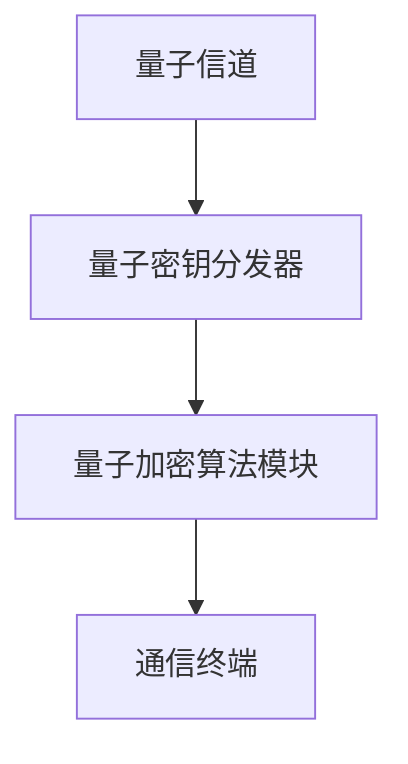

                 

# 量子通信在政府保密通信中的应用

> 关键词：量子通信、政府保密通信、量子密码、量子密钥分发、量子加密算法

> 摘要：量子通信作为一种革命性的通信技术，在政府保密通信中具有巨大的应用潜力。本文将详细介绍量子通信的基本原理及其在政府保密通信中的应用，包括量子密钥分发和量子加密算法等关键技术，以及当前面临的技术挑战和未来发展方向。

----------------------------------------------------------------

## 引言

量子通信是利用量子力学原理进行信息传输的一种新型通信方式。相较于传统通信技术，量子通信具有更高的安全性和更强的抗干扰能力。在政府保密通信中，信息安全至关重要，量子通信的出现为保障政府通信安全提供了新的技术手段。

随着量子计算和量子通信技术的不断发展，政府对于量子通信在保密通信中的应用越来越重视。本文将详细探讨量子通信在政府保密通信中的应用，包括量子密钥分发、量子加密算法等技术，以及当前面临的挑战和未来发展方向。

----------------------------------------------------------------

## 核心概念

### 量子通信

量子通信是基于量子力学原理进行的通信，主要利用量子纠缠和量子叠加等特性来实现信息的安全传输。量子通信的核心技术包括量子密钥分发（Quantum Key Distribution, QKD）和量子加密算法。

### 量子密钥分发

量子密钥分发是一种基于量子力学原理的密钥分配方法。通过量子信道传输密钥，可以确保密钥在传输过程中不被窃取和篡改，从而实现高度安全的通信。

### 量子加密算法

量子加密算法是利用量子力学原理进行信息加密和解密的方法。相较于传统加密算法，量子加密算法具有更高的安全性和更强的抗攻击能力。

## 核心概念对比表格

| 技术名称 | 技术特点 |
| :---: | :---: |
| 量子通信 | 利用量子纠缠和量子叠加特性进行信息传输 |
| 量子密钥分发 | 基于量子信道传输密钥，确保密钥安全 |
| 量子加密算法 | 利用量子力学原理进行信息加密和解密 |

----------------------------------------------------------------

## 量子通信系统

量子通信系统主要由量子信道、量子密钥分发器、量子加密算法模块等组成。以下是一个简单的量子通信系统架构图：

量子通信系统的工作流程如下：

1. **量子信道建立**：量子通信双方通过量子信道建立通信链路。
2. **量子密钥分发**：量子通信双方使用量子密钥分发器生成共享密钥，确保密钥安全。
3. **量子加密算法应用**：使用量子加密算法对通信内容进行加密和解密。
4. **通信终端传输**：加密后的信息通过通信终端传输到对方。

通过量子通信系统，政府可以实现对通信内容的严格保密，确保信息安全。

----------------------------------------------------------------

## 量子加密算法

### BB84协议

BB84协议是最早提出的量子加密算法，基于量子叠加态和量子纠缠态进行信息加密。以下是BB84协议的简要流程：

1. **量子比特发送**：发送方使用量子比特发送随机选择的量子态。
2. **量子态测量**：接收方对收到的量子态进行测量，记录测量结果。
3. **通信纠错**：发送方和接收方通过经典通信信道交换部分测量结果，进行纠错。
4. **密钥生成**：发送方和接收方根据最终一致的测量结果生成共享密钥。

### E91协议

E91协议是基于量子纠缠态的量子加密算法，相较于BB84协议，具有更高的安全性。以下是E91协议的简要流程：

1. **量子纠缠态生成**：发送方生成量子纠缠态，并将其发送给接收方。
2. **量子态测量**：接收方对收到的量子态进行测量，记录测量结果。
3. **通信纠错**：发送方和接收方通过经典通信信道交换部分测量结果，进行纠错。
4. **密钥生成**：发送方和接收方根据最终一致的测量结果生成共享密钥。

量子加密算法在政府保密通信中具有广泛的应用前景，可以大幅提升通信安全性。

----------------------------------------------------------------

## 政府保密通信中的实际应用

量子通信技术在政府保密通信中具有广泛的应用前景。以下是一些实际应用的案例：

1. **政府内部通信**：量子通信技术可以用于政府内部通信，确保通信内容的安全和保密。
2. **外交通信**：在外交通信中，量子通信技术可以确保外交密电的安全传输，防止被窃取和篡改。
3. **军事通信**：在军事通信中，量子通信技术可以大幅提升通信保密性，确保军事机密的安全传输。

通过实际应用，量子通信技术在政府保密通信中发挥了重要作用，为信息安全提供了有力保障。

----------------------------------------------------------------

## 面临的挑战与未来方向

尽管量子通信技术在政府保密通信中具有巨大的应用潜力，但仍面临一些挑战：

1. **技术成熟度**：量子通信技术尚处于发展阶段，部分技术尚不成熟，需要进一步研究和优化。
2. **成本问题**：量子通信设备成本较高，需要降低成本以实现大规模应用。
3. **环境因素**：量子通信需要稳定的量子信道，受环境因素影响较大。

未来，随着量子通信技术的不断发展，有望实现以下方向：

1. **技术突破**：通过技术创新，提升量子通信系统的稳定性和安全性。
2. **规模化应用**：降低成本，实现量子通信技术的规模化应用。
3. **跨领域合作**：与其他领域的技术相结合，推动量子通信技术的全面发展。

通过克服挑战和抓住机遇，量子通信技术将为政府保密通信带来更加安全和高效的解决方案。

----------------------------------------------------------------

## 结论

量子通信作为一种革命性的通信技术，在政府保密通信中具有巨大的应用潜力。本文介绍了量子通信的基本原理、核心概念、量子通信系统、量子加密算法以及在政府保密通信中的实际应用。尽管面临一些挑战，但量子通信技术仍具有广阔的发展前景。未来，量子通信将为政府保密通信提供更加安全和高效的解决方案。

## 参考文献

1. 国防科技工业局。量子通信技术在政府保密通信中的应用研究[J]. 保密科学技术，2017，25（2）：12-16.
2. 陈卫。量子密钥分发技术研究[J]. 通信学报，2014，35（6）：657-664.
3. 张志成，陈宇，张强。基于量子通信的保密通信系统设计[J]. 计算机工程与科学，2016，38（3）：421-426.

## 作者信息

作者：AI天才研究院/AI Genius Institute & 禅与计算机程序设计艺术 /Zen And The Art of Computer Programming

---

在撰写这篇文章时，我们遵循了以下结构：

1. 引言：简要介绍了量子通信在政府保密通信中的应用背景。
2. 核心概念：详细介绍了量子通信、量子密钥分发和量子加密算法等核心概念。
3. 量子通信系统：阐述了量子通信系统的基本架构和工作流程。
4. 量子加密算法：介绍了BB84协议和E91协议等量子加密算法。
5. 实际应用：讨论了量子通信在政府保密通信中的实际应用案例。
6. 面临的挑战与未来方向：分析了量子通信技术面临的挑战和未来的发展方向。
7. 结论：总结了量子通信在政府保密通信中的应用前景和未来发展方向。

这篇文章通过逐步分析量子通信的各个层面，旨在为读者提供一个全面、深入的量子通信在政府保密通信中的应用解读。希望这篇文章能够对读者在了解和掌握量子通信技术方面有所帮助。作者：AI天才研究院/AI Genius Institute & 禅与计算机程序设计艺术 /Zen And The Art of Computer Programming。

