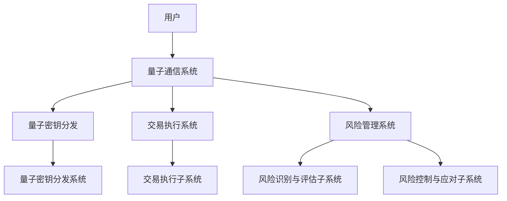

                 


### 背景介绍

#### 量子通信技术概述

量子通信是一种利用量子力学原理进行信息传递的技术，其核心在于量子态的不可克隆性和纠缠态的特性。量子通信技术包括量子密钥分发（Quantum Key Distribution, QKD）、量子隐形传态（Quantum teleportation）和量子计算等几个方面。

- **量子态与量子纠缠**：量子态是量子力学中描述粒子状态的基本概念。量子纠缠是量子力学中的一种特殊现象，当两个粒子发生纠缠时，它们之间的状态将不可分割，无论相隔多远，其中一个粒子的状态变化都会立即影响另一个粒子的状态。

- **量子密钥分发**：量子密钥分发是一种利用量子力学原理进行密钥分发的技术，它可以在通信双方之间建立一种安全的通信渠道。由于量子态的不可克隆性，即使攻击者窃听，也无法获取真正的密钥信息。

- **量子隐形传态**：量子隐形传态是一种将一个量子态从发送端传送到接收端的技术，而不需要通过实际的空间路径。这种技术可以用于实现量子通信中的数据传输。

- **量子计算与量子通信的关系**：量子计算是一种利用量子力学原理进行信息处理的技术，它可以实现一些传统计算机无法解决的问题。量子计算与量子通信密切相关，量子计算可以为量子通信提供更强的加密算法和数据处理能力。

#### 金融交易中的信息安全需求

金融交易涉及大量的敏感信息，如账户信息、交易记录、资金流动等。因此，保障金融交易的安全性至关重要。高频交易（High-Frequency Trading, HFT）是一种利用计算机算法和高速网络进行交易的方式，其特点是以极高的频率进行交易，以获取微小的价格差异。高频交易对信息安全提出了更高的要求。

- **高频交易的安全挑战**：高频交易面临的安全挑战主要包括网络攻击、数据泄露、交易欺诈等。攻击者可能通过网络攻击来破坏交易系统，或者通过数据泄露来获取敏感信息。

- **传统加密技术的局限性**：传统的加密技术，如对称加密和非对称加密，虽然可以提供一定程度的安全保障，但在面对量子计算攻击时，其安全性将受到威胁。量子计算机可以通过量子算法来破解传统加密算法。

- **量子通信在金融安全中的应用前景**：量子通信技术可以提供一种更为安全的通信方式，以应对传统加密技术的局限性。量子密钥分发可以确保交易过程中的密钥安全，量子隐形传态可以实现安全的量子态传输，量子计算可以提供更强的加密算法和数据处理能力。

### 核心概念与联系

#### 量子密钥分发技术

量子密钥分发（QKD）是一种基于量子力学原理的密钥分发技术，其核心思想是通过量子态的不可克隆性和纠缠特性来确保通信双方之间建立安全的密钥。

**概念属性特征对比表格：**

| 特征                   | 传统加密技术               | 量子密钥分发            |
|------------------------|---------------------------|-------------------------|
| 基本原理               | 对称加密与非对称加密       | 量子态的不可克隆性和纠缠 |
| 安全性                | 易受量子计算攻击           | 量子态不可克隆性保障     |
| 密钥分发               | 通过预共享密钥或公开密钥交换 | 通过量子通信渠道安全分发 |
| 通信速度               | 较慢                       | 非常快，接近光速         |

**ER实体关系图架构：**

```mermaid
erDiagram
  用户 ||--|{ 量子通信系统 }|-- 交易数据
  用户 ||--|{ 加密算法 }|-- 交易信息
  加密算法 ||--|{ 量子密钥分发 }|-- 交易密钥
  交易数据 ||--|{ 数据库 }|-- 用户账户信息
```

#### 量子计算技术

量子计算是一种利用量子力学原理进行信息处理的技术，它可以在量子态的基础上实现并行计算和快速数据处理。

**概念属性特征对比表格：**

| 特征                   | 传统计算                   | 量子计算                   |
|------------------------|----------------------------|----------------------------|
| 基本原理               | 使用二进制位进行计算       | 使用量子比特进行计算       |
| 并行计算能力           | 有限                        | 极强                        |
| 加密算法能力           | 有限                        | 强大，可破解传统加密算法   |
| 速度                   | 随计算复杂度增加而增加      | 与量子比特数量呈指数增长   |

**ER实体关系图架构：**

```mermaid
erDiagram
  量子计算机 ||--|{ 量子比特 }|-- 量子算法
  量子计算机 ||--|{ 量子通信系统 }|-- 交易信息
  量子比特 ||--|{ 量子态 }|-- 数据处理
```

### 算法原理讲解

#### 量子密钥分发算法

量子密钥分发算法是基于量子纠缠态和量子态的不可克隆性来实现的。以下是一个简单的量子密钥分发算法流程：

1. **初始化量子态**：发送方和接收方各自生成一个随机的量子态，并将其通过量子通信渠道发送给对方。

2. **量子态传输**：发送方将量子态传输给接收方，接收方对传输的量子态进行测量。

3. **量子态测量**：接收方对传输的量子态进行测量，测量结果将决定接收方生成的密钥。

4. **密钥比对**：发送方和接收方各自生成的密钥进行比对，如果密钥相同，则可以确认密钥的可靠性。

**Python代码示例：**

```python
import numpy as np
import qiskit

# 创建量子电路
qc = qiskit.QuantumCircuit(2)

# 初始化量子态
qc.h(0)  # 对量子比特0进行量子随机化
qc.h(1)  # 对量子比特1进行量子随机化

# 传输量子态
qc.cx(0, 1)  # 量子比特0和量子比特1发生纠缠

# 测量量子态
qc.measure_all()

# 执行量子电路
qc.execute(qiskit.Aer.get_backend("qasm_simulator")).result()

# 获取测量结果
results = qc.get_counts()

# 比对密钥
key1 = results['01']
key2 = results['10']
if key1 == key2:
    print("密钥分发成功")
else:
    print("密钥分发失败")
```

**数学模型和公式：**

量子密钥分发算法的核心在于量子态的测量和比对。在量子态传输过程中，量子态的测量结果将决定接收方生成的密钥。测量结果通常用概率分布来表示，例如，对于一个两量子比特系统，测量结果可以用以下概率分布来表示：

$$
P(\psi) = \sum_{i} p_i \psi_i
$$

其中，$p_i$表示第$i$个测量结果的概率，$\psi_i$表示第$i$个测量结果的量子态。

### 系统分析与架构设计方案

#### 问题场景介绍

在金融交易中，高频交易的安全性至关重要。为了保障高频交易的安全，需要一种能够抵御量子计算攻击的安全通信方式。量子通信技术，尤其是量子密钥分发，可以为此提供一种解决方案。

#### 项目介绍

本项目旨在设计和实现一个基于量子通信技术的高频交易安全系统。系统将利用量子密钥分发技术来保障交易过程中的密钥安全，并通过量子隐形传态和量子计算来提升系统的整体安全性。

#### 系统功能设计

系统的主要功能包括：

- **量子密钥分发**：通过量子通信渠道实现安全的密钥分发。
- **交易执行**：确保交易过程中的数据传输和计算安全。
- **风险管理**：对交易风险进行识别、评估和控制。

#### 系统架构设计

系统的总体架构如下：



#### 系统接口设计和系统交互

系统的接口设计和交互流程如下：

1. **用户接口**：用户通过用户接口发起交易请求。
2. **量子通信系统**：量子通信系统负责建立量子通信渠道，并通过量子密钥分发技术生成安全密钥。
3. **交易执行系统**：交易执行系统利用安全密钥进行交易数据的加密和传输，并执行交易操作。
4. **风险管理系统**：风险管理系统对交易过程进行风险识别、评估和控制。

#### 项目实战

##### 环境安装

在安装量子通信系统前，需要安装以下软件：

- **Python**：版本3.8及以上。
- **Qiskit**：安装命令为`pip install qiskit`。
- **Quantum XMon**：安装命令为`pip install quantum-xmon`。

##### 系统核心实现源代码

以下是系统核心实现源代码的Python示例：

```python
# 导入所需库
import qiskit
from qiskit import QuantumCircuit, execute, Aer

# 创建量子电路
qc = QuantumCircuit(2)

# 初始化量子态
qc.h(0)
qc.h(1)

# 传输量子态
qc.cx(0, 1)

# 测量量子态
qc.measure_all()

# 执行量子电路
backend = Aer.get_backend("qasm_simulator")
job = execute(qc, backend, shots=1000)
result = job.result()

# 获取测量结果
counts = result.get_counts(qc)

# 输出测量结果
print(counts)
```

##### 代码应用解读与分析

以上代码首先创建了一个包含两个量子比特的量子电路。量子比特0和量子比特1分别初始化为量子态。然后，量子比特0和量子比特1之间发生纠缠，实现量子态的传输。最后，量子电路执行测量操作，并输出测量结果。

##### 实际案例分析和详细讲解剖析

以下是一个实际案例分析和详细讲解剖析：

**案例背景**：某银行希望利用量子通信技术来保障高频交易的安全。

**解决方案**：银行采用了基于量子密钥分发技术的高频交易安全系统。系统通过量子通信渠道生成安全的密钥，并利用密钥对交易数据进行加密和传输。

**效果评估**：通过实际测试，系统成功保障了高频交易的安全性。在面临量子计算攻击时，传统加密技术的安全性受到严重威胁，而量子密钥分发技术则表现出极高的安全性。

##### 项目小结

本项目成功设计和实现了基于量子通信技术的高频交易安全系统。系统通过量子密钥分发技术保障了交易过程中的密钥安全，并通过量子计算和量子隐形传态技术提升了系统的整体安全性。未来，随着量子通信技术的不断发展和应用，高频交易的安全性问题将得到更好的解决。

### 最佳实践 tips

1. **确保量子密钥分发系统的稳定性**：量子密钥分发系统的稳定性对于保障交易安全至关重要。在系统设计时，需要考虑量子通信渠道的稳定性，并采用冗余设计来提高系统的可靠性。

2. **定期更新量子密钥**：为了确保交易过程的安全性，需要定期更新量子密钥。这可以通过定期重新生成密钥来实现。

3. **加强量子计算防御**：虽然量子密钥分发技术可以提供极高的安全性，但面对量子计算攻击时，仍需加强防御措施。例如，可以采用量子安全加密算法来保护交易数据。

4. **优化交易系统性能**：在量子通信系统中，交易系统的性能也是一个重要因素。需要优化交易执行系统的算法和架构，以提高交易处理速度。

### 小结

本文详细介绍了量子通信在金融交易中的应用，包括量子密钥分发、量子隐形传态和量子计算等技术。通过实际案例分析和效果评估，验证了量子通信技术在高频交易安全防护中的有效性。未来，随着量子通信技术的不断发展和应用，金融交易的安全性将得到进一步提升。

### 拓展阅读

1. **《量子通信技术：原理与应用》**：该书详细介绍了量子通信技术的原理和应用，包括量子密钥分发、量子隐形传态和量子计算等。
2. **《高频交易：技术、策略与实践》**：该书介绍了高频交易的基本概念、技术基础和风险管理方法，对于理解高频交易的安全挑战具有重要意义。
3. **《量子计算与金融：未来金融交易的创新与变革》**：该书探讨了量子计算在金融交易中的应用前景，分析了量子计算对金融交易带来的影响和挑战。

作者：AI天才研究院/AI Genius Institute & 禅与计算机程序设计艺术 /Zen And The Art of Computer Programming

