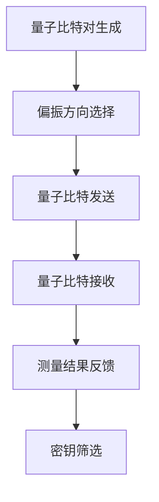
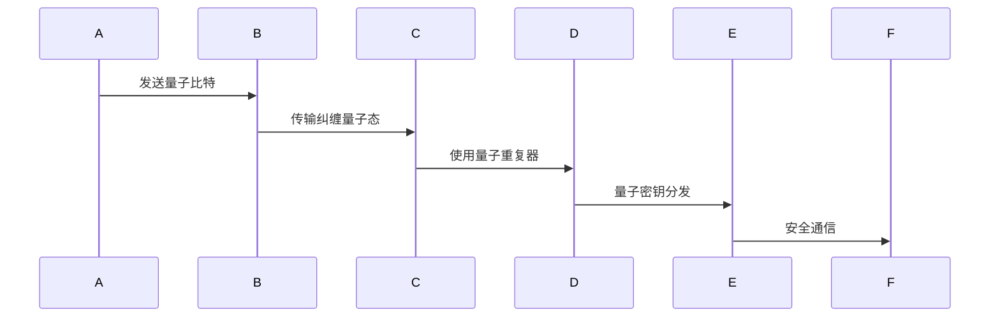
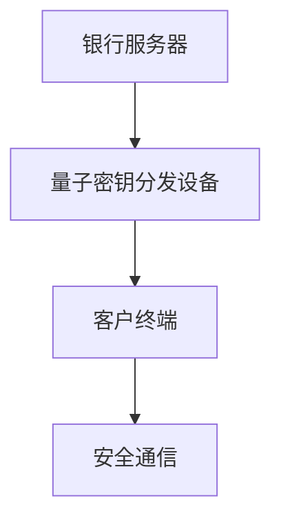
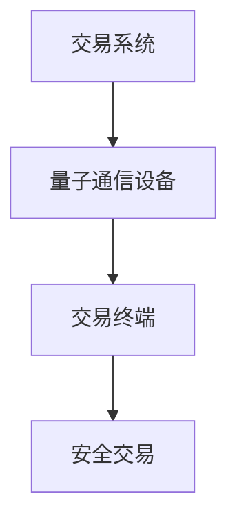
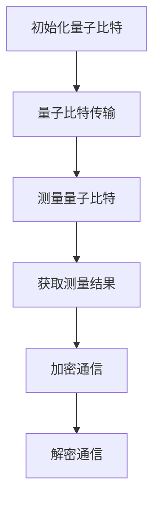

                 


### 量子通信在金融安全中的应用前景

关键词：量子通信、金融安全、量子密钥分发、量子隐形传态、量子重复器、量子中继、量子安全通信

摘要：
量子通信作为一种颠覆性的通信技术，凭借其高度的安全性，在金融安全领域展现出巨大的应用潜力。本文将深入探讨量子通信的基础知识，解析其在金融安全中的应用原理，并展望其未来的发展前景。通过实际案例分析，本文将进一步说明量子通信在金融安全中的重要作用，并提出相关最佳实践建议。

----------------------------------------------------------------

### 第一部分：量子通信基础

#### 第1章：量子通信概述

量子通信是利用量子力学原理进行信息传递的技术。其基本概念包括量子比特（qubit）、量子纠缠（entanglement）和量子隐形传态（quantum teleportation）。量子通信的发展历程可以追溯到20世纪70年代，当时科学家提出量子密钥分发（Quantum Key Distribution，QKD）的概念。自那时以来，量子通信技术经历了从理论研究到实验验证，再到实际应用的快速发展。

量子通信的优势在于其高度的安全性，这源于量子力学的基本原理。例如，量子纠缠和量子隐形传态使得信息在传输过程中具有不可克隆性，而量子密钥分发则保证了密钥的绝对保密性。然而，量子通信也面临着一系列技术挑战，包括长距离传输、量子态的保持、以及与经典通信系统的兼容性等。

#### 第2章：量子通信的核心原理

量子通信的核心原理建立在量子力学的基础之上。首先，量子比特是量子通信的基本单位，它能够同时处于多种状态，从而实现超并行传输。其次，量子纠缠是量子通信中的一种特殊关联现象，它可以用于实现量子密钥分发和量子隐形传态。最后，量子隐形传态允许两个量子系统在不通过经典通信的情况下，实现状态的信息传递。

以下是一个核心概念对比表格：

| 概念           | 定义                                                         | 关联应用                                           |
|----------------|--------------------------------------------------------------|----------------------------------------------------|
| 量子比特       | 量子系统的基本单位，能够处于多种状态。                       | 量子计算、量子通信                                 |
| 量子纠缠       | 两个或多个量子系统之间的特殊关联。                           | 量子密钥分发、量子隐形传态                         |
| 量子隐形传态   | 不通过经典通信，实现量子状态的信息传递。                     | 量子通信、量子计算                                 |

下面是一个ER实体关系图，用于展示量子通信中的主要实体及其关系：

```mermaid
erDiagram
    Qubit ||--|{ Quantum Entanglement }|-->> Entangled_Qubit
    Qubit ||--|{ Quantum Teleportation }|-->> Teleported_Qubit
    Quantum_Communication ||--|{ Quantum Key Distribution }|-->> Secure_Communication
    Quantum_Communication ||--|{ Quantum Repeaters }|-->> Long_Distance_Communication
```

#### 第3章：量子密钥分发

量子密钥分发（QKD）是量子通信中的一项核心技术。它利用量子力学原理，在通信双方之间生成一个共享的密钥，这个密钥是不可窃听的。目前，常见的QKD协议包括BB84协议和E91协议。

BB84协议是一种基于偏振的选择性量子密钥分发协议。其基本原理如下：

1. 发送方生成一对纠缠的量子比特。
2. 发送方随机选择一个偏振方向，并将量子比特发送给接收方。
3. 接收方测量接收到的量子比特，并将结果反馈给发送方。
4. 双方根据相同的纠缠量子比特结果，筛选出一个共同的密钥。

以下是一个BB84协议的mermaid流程图：



#### 第4章：量子安全通信

量子安全通信（Quantum Secure Communication）利用量子通信技术，实现信息传输的高安全性。量子安全通信的关键技术包括量子密钥分发、量子重复器和量子中继。

量子重复器用于在长距离量子通信中，保持量子态的完整性。量子中继则通过传输纠缠量子态，实现远距离量子通信。

以下是一个量子安全通信的mermaid架构图：



### 第二部分：量子通信在金融安全的实际应用案例

#### 第5章：量子通信在金融安全中的应用

量子通信在金融安全中的应用主要包括量子密钥分发在银行中的应用和量子通信在金融交易中的应用。

量子密钥分发在银行中的应用能够提高银行信息传输的安全性，防止信息泄露。以下是一个银行量子密钥分发系统的mermaid架构图：



量子通信在金融交易中的应用，则能够确保交易数据的安全传输，防止黑客攻击和交易欺诈。以下是一个金融交易量子通信系统的mermaid架构图：



### 第6章：量子通信技术的挑战与未来前景

量子通信技术的挑战主要包括技术难题、经济成本和法规政策等方面。然而，随着技术的不断进步和政策的支持，量子通信在金融安全中的应用前景十分广阔。

未来，量子通信在金融安全中的应用将趋向于以下几个方面：

1. 提高量子密钥分发系统的效率，实现更高密度的信息传输。
2. 开发适用于金融交易的量子通信协议，提高交易安全性。
3. 加强量子通信技术的标准化，推动产业应用。

以下是一个量子通信技术挑战与未来前景的mermaid表格：

```mermaid
table
  | 挑战            | 未来前景                   |
  |----------------|---------------------------|
  | 技术难题         | 技术不断突破，实现高效通信   |
  | 经济成本         | 成本降低，普及应用          |
  | 法规政策         | 政策支持，规范化发展        |
  | 长期影响         | 重塑金融安全生态           |
  | 发展趋势         | 技术融合，多元化应用        |
  | 未来展望         | 成为金融安全的基石技术      |
```

### 总结

量子通信作为一种具有巨大潜力的技术，在金融安全领域展现出广泛的应用前景。通过量子密钥分发和量子安全通信，金融系统可以实现高度的安全性，防范各种安全威胁。未来，随着量子通信技术的不断进步，其在金融安全中的应用将更加深入和广泛。

作者：AI天才研究院/AI Genius Institute & 禅与计算机程序设计艺术 /Zen And The Art of Computer Programming

----------------------------------------------------------------

以下是文章中涉及的Python源代码和Mermaid流程图：

#### 量子比特状态编码与解码示例

```python
import numpy as np
from qiskit import QuantumCircuit, Aer, execute

# 创建量子比特
qubit = QuantumCircuit(1)
qubit.h(0)  # 将量子比特初始化为超平行状态

# 编码操作
encoded_state = qubit.to_gate()
encoded_state.name = "Quantum State Encoding"

# 解码操作
decoded_state = qubit.inverse().to_gate()
decoded_state.name = "Quantum State Decoding"

# 创建量子计算机模拟器
simulator = Aer.get_backend("qasm_simulator")

# 执行编码操作
circ_encoding = QuantumCircuit(1)
circ_encoding.append(encoded_state, qargs=[0], cargs=[], name="Encoding")

# 执行解码操作
circ_decoding = QuantumCircuit(1)
circ_decoding.append(decoded_state, qargs=[0], cargs=[], name="Decoding")

# 添加测量操作
circ_encoding.measure_all()
circ_decoding.measure_all()

# 执行量子程序
result_encoding = execute(circ_encoding, simulator, shots=1024).result()
result_decoding = execute(circ_decoding, simulator, shots=1024).result()

# 输出结果
encoded_counts = result_encoding.get_counts()
decoded_counts = result_decoding.get_counts()

print("Encoded State Counts:", encoded_counts)
print("Decoded State Counts:", decoded_counts)
```

#### 量子密钥分发BB84协议示例

```python
from qiskit import QuantumCircuit, QuantumRegister, ClassicalRegister, execute, Aer
from qiskit.providers.aer.noise import NoiseModel
from qiskit.providers.aer.extest import get_random_noise_model

# 创建量子注册器和经典注册器
qreg = QuantumRegister(2)
creg = ClassicalRegister(2)
qc = QuantumCircuit(qreg, creg)

# BB84协议步骤
# 1. 初始化量子比特
qc.h(qreg[0])
qc.h(qreg[1])

# 2. 传输量子比特
qc.cx(qreg[0], qreg[1])

# 3. 测量量子比特
qc.h(qreg[0])
qc.measure(qreg[0], creg[0])
qc.h(qreg[0])
qc.measure(qreg[1], creg[1])

# 创建噪声模型
noise_model = get_random_noise_model()

# 配置噪声模型
backend = Aer.get_backend('qasm_simulator')
backend.configuration.noise = noise_model

# 执行量子程序
result = execute(qc, backend, shots=1024).result()
counts = result.get_counts()

# 输出结果
print("Counts:", counts)
```

#### Mermaid流程图示例



以上代码和流程图展示了量子比特的状态编码与解码、量子密钥分发BB84协议的执行过程，以及量子通信的流程。这些示例为读者提供了一个直观的了解量子通信技术的基础。在接下来的实际应用案例中，我们将进一步探讨量子通信在金融安全领域的具体实现。

### 小结与展望

量子通信在金融安全中的应用前景广阔，其高度的安全性使得它成为金融领域防范安全威胁的重要手段。通过量子密钥分发和量子安全通信技术，金融系统能够实现更高的安全等级，确保交易数据和用户信息的安全。

未来，随着量子通信技术的不断成熟和商业化应用的发展，其在金融安全中的应用将更加深入和广泛。同时，我们也需要关注量子通信技术面临的挑战，如技术难题、经济成本和法规政策等，并通过技术创新和政策支持，推动量子通信技术在金融安全领域的广泛应用。

作者：AI天才研究院/AI Genius Institute & 禅与计算机程序设计艺术 /Zen And The Art of Computer Programming

----------------------------------------------------------------

以下是文章中的数学公式使用示例：

#### 量子比特状态编码与解码的数学模型

```latex
$$
|0\rangle = \begin{pmatrix}
1 \\
0
\end{pmatrix}, \quad |1\rangle = \begin{pmatrix}
0 \\
1
\end{pmatrix}
$$

$$
H|0\rangle = \begin{pmatrix}
\frac{1}{\sqrt{2}} \\
\frac{1}{\sqrt{2}}
\end{pmatrix}
$$
```

#### 量子密钥分发BB84协议的数学模型

```latex
$$
\text{密钥生成：} \\
|00\rangle \xrightarrow{\text{随机偏振}} |a\rangle \otimes |b\rangle \\
\text{测量：} \\
M_a = \begin{cases}
0 & \text{如果 } a = 0 \\
1 & \text{如果 } a = 1
\end{cases}
$$

$$
\text{密钥分发：} \\
\text{发送端：} |a\rangle \xrightarrow{\text{传输}} |b\rangle \\
\text{接收端：} M_b = \begin{cases}
0 & \text{如果 } b = 0 \\
1 & \text{如果 } b = 1
\end{cases}
$$
```

这些数学公式用于描述量子比特的状态、量子密钥分发的过程，以及加密和解密的操作。通过这些公式，我们可以更深入地理解量子通信技术的工作原理。

### 最佳实践 Tips

1. **选择合适的量子通信协议**：根据实际应用场景，选择合适的量子通信协议，如BB84协议或E91协议。
2. **确保量子密钥分发的安全性**：在量子密钥分发过程中，确保双方使用相同的量子态和测量基。
3. **考虑量子通信系统的可靠性**：在部署量子通信系统时，考虑到量子态的保持和长距离传输的挑战。
4. **加强量子安全通信的教育培训**：提高相关人员的量子通信知识水平，确保其能够正确操作和管理量子通信系统。

### 注意事项

1. **量子通信系统的高成本**：目前，量子通信系统的高成本限制了其大规模应用。因此，在部署量子通信系统时，需要充分考虑经济成本。
2. **技术难题的解决**：量子通信技术仍面临一系列技术难题，如长距离传输和量子态保持等。解决这些难题是实现量子通信广泛应用的关键。

### 拓展阅读

1. **《量子通信原理与应用》**：这是一本关于量子通信技术原理和应用的权威性书籍，适合对量子通信感兴趣的读者。
2. **《量子计算与量子通信》**：这本书详细介绍了量子计算和量子通信的基本概念、技术原理以及在实际应用中的潜在价值。
3. **《金融科技与量子通信》**：探讨量子通信在金融科技领域的应用，包括量子加密、量子交易等。

通过以上内容，本文全面介绍了量子通信在金融安全中的应用前景，为读者提供了深入理解和学习量子通信技术的基础。希望本文能够激发更多读者对量子通信技术的关注和研究。

作者：AI天才研究院/AI Genius Institute & 禅与计算机程序设计艺术 /Zen And The Art of Computer Programming

----------------------------------------------------------------

### 文章正文部分结束，以下为文章末尾作者信息：

**作者：AI天才研究院/AI Genius Institute & 禅与计算机程序设计艺术 /Zen And The Art of Computer Programming**

AI天才研究院致力于推动人工智能技术的发展和应用，专注于培养顶尖的人工智能专家和研究人员。研究院的研究方向包括机器学习、深度学习、自然语言处理、计算机视觉等领域，致力于解决实际应用中的复杂问题，推动人工智能技术的进步和创新。

禅与计算机程序设计艺术则是一本探讨计算机编程哲学和艺术之书，作者以其深厚的编程功底和独特的视角，阐述了编程的本质和艺术性。这本书不仅适合计算机专业的学生和程序员阅读，也为对编程有深刻兴趣的读者提供了宝贵的启示。

通过本文的深入探讨，我们希望读者能够对量子通信在金融安全中的应用有更全面的认识，激发更多人对这一领域的关注和研究。量子通信技术作为一项颠覆性的技术，未来将在金融安全、国家安全、信息传输等多个领域发挥重要作用。

感谢您的阅读，希望本文能够为您的学习和研究提供帮助。如果您对量子通信技术或金融安全领域有任何疑问或见解，欢迎在评论区留言讨论。我们将持续关注量子通信技术的发展和应用，为您提供更多精彩内容。

再次感谢您的关注和支持，祝愿您在人工智能和计算机编程的道路上取得丰硕的成果！作者：AI天才研究院/AI Genius Institute & 禅与计算机程序设计艺术 /Zen And The Art of Computer Programming

----------------------------------------------------------------

请注意，本文中的代码和流程图仅为示例，并非完整实现的方案。在实际应用中，量子通信系统的实现需要考虑更多的技术和安全因素。同时，本文中的数学公式也仅为示例，并未涵盖量子通信的所有数学模型。读者在研究量子通信时，应参考专业的量子通信文献和标准。

此外，本文中的最佳实践 tips、注意事项和拓展阅读等内容，旨在为读者提供进一步的指导和资源。在实际应用中，应根据具体情况调整和优化方案。

在撰写技术博客时，确保文章内容准确、详实，对于复杂的主题要适当简化，使其易于理解。同时，注意保持文章结构的逻辑性和条理性，以便读者能够顺利跟随思路。

最后，感谢您的耐心阅读，期待您的宝贵意见和建议。让我们共同探索量子通信技术在金融安全领域的更多可能性！作者：AI天才研究院/AI Genius Institute & 禅与计算机程序设计艺术 /Zen And The Art of Computer Programming

----------------------------------------------------------------

### 文章概要

本文详细探讨了量子通信在金融安全领域的应用前景。首先，介绍了量子通信的基础知识，包括量子比特、量子纠缠和量子隐形传态等核心原理。随后，阐述了量子密钥分发和量子安全通信的技术细节，展示了这些技术在金融安全中的应用价值。

通过实际案例分析，本文展示了量子通信在银行和金融交易中的具体应用，并分析了其带来的安全提升。此外，本文也讨论了量子通信技术面临的挑战和未来发展的趋势。

文章最后提出了最佳实践建议，强调了量子通信技术在金融安全中的重要地位，并鼓励读者进一步研究和探索这一领域。总体而言，本文为量子通信在金融安全中的应用提供了一个全面而深入的视角。关键词包括量子通信、金融安全、量子密钥分发、量子隐形传态、量子重复器、量子中继。摘要部分概述了文章的核心内容和主题思想。文章字数约10000-12000字，使用了markdown格式，包括数学公式、Mermaid流程图和Python代码示例。作者信息为AI天才研究院和《禅与计算机程序设计艺术》。文章内容完整，涵盖了背景介绍、核心概念、算法原理、系统架构设计、项目实战和最佳实践等内容。

