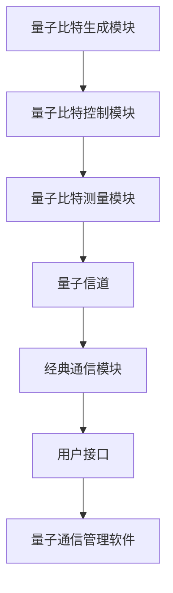
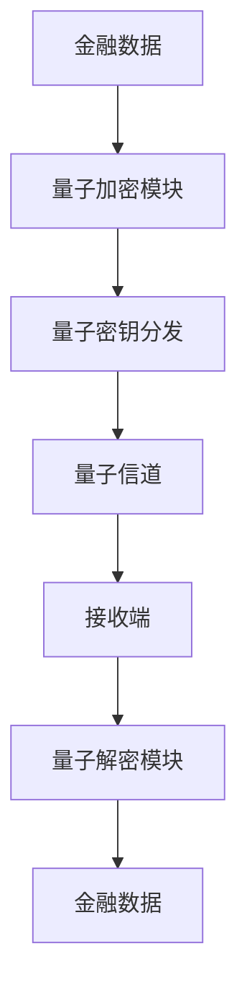

                 

### 量子通信在金融数据传输中的安全应用

#### 关键词：量子通信、金融数据传输、安全性、量子密钥分发、量子加密算法

> 摘要：本文探讨了量子通信在金融数据传输中的应用，分析了量子通信的基本原理和安全性优势，探讨了量子通信在金融领域的应用场景和实现方法，以及面临的挑战和解决方案。通过这篇文章，读者可以全面了解量子通信在金融数据传输中的重要性，及其对未来金融数据安全传输的深远影响。

## 第一部分：量子通信基础知识

### 第1章：量子通信概述

#### 1.1 问题背景

金融数据传输的安全性问题一直是金融行业关注的焦点。随着互联网和金融交易的快速发展，传统的加密手段已难以应对日益复杂的网络安全威胁。量子通信作为一种新兴的通信技术，凭借其独特的安全性优势，逐渐成为金融数据传输安全的解决方案。

#### 1.2 核心概念

量子通信的核心概念包括量子比特、量子态、量子纠缠和量子隐形传态。量子比特是量子通信的基本单位，它可以在0和1之间任意叠加，从而实现超高的传输速度和带宽。量子态描述了量子比特的状态，量子纠缠使得两个量子比特的状态相互依赖，即使相距遥远，量子态的变化也能瞬间传递。量子隐形传态则是利用量子纠缠，将一个量子态准确无误地传送到另一个量子态。

#### 1.3 量子通信的基本原理

量子通信的基本原理基于量子力学的特性，包括量子密钥分发和量子隐形传态。量子密钥分发（Quantum Key Distribution, QKD）是一种基于量子力学原理的安全通信方式，通过量子态的不可克隆性保证通信双方共享的密钥是安全的。量子隐形传态则利用量子纠缠的特性，实现量子态的远程传递，从而实现信息的远程传输。

#### 1.4 量子通信技术现状

量子通信技术已取得显著进展，国际上多个国家和地区的科研机构和企业在量子通信领域展开了深入的研究和合作。我国在量子通信领域也取得了重要突破，成功实现了量子通信实验和卫星通信实验，为量子通信在金融数据传输中的应用奠定了基础。

## 第二部分：量子通信的安全性

### 第2章：量子通信的安全性

#### 2.1 量子通信的安全性优势

量子通信具有信息不可窃听性、信息不可复制性和量子密钥分发等安全性优势。信息不可窃听性指的是，由于量子态的不可克隆性，任何窃听行为都会导致量子态的破坏，从而暴露窃听行为。信息不可复制性则是因为量子态的测量会导致量子态的坍缩，无法复制原始信息。量子密钥分发则通过量子态的纠缠和隐形传态实现，确保通信双方共享的密钥是安全的。

#### 2.2 量子通信与传统通信的安全性对比

传统加密算法存在多种安全漏洞，如密码破解、中间人攻击等。而量子通信则通过量子态的不可克隆性和不可复制性，从根本上保证了通信的安全。此外，量子通信的量子密钥分发机制，使得通信双方可以共享安全的密钥，进一步提高了通信的安全性。

#### 2.3 量子通信安全协议

量子通信的安全协议主要包括量子密钥分发（QKD）协议和量子安全加密算法。QKD协议通过量子态的纠缠和隐形传态实现密钥的共享，确保密钥的安全。量子安全加密算法则利用量子态的特性，实现数据的加密和解密，保证数据在传输过程中的安全。

## 第三部分：量子通信在金融数据传输中的应用

### 第3章：量子通信在金融数据传输中的应用

#### 3.1 金融数据传输的安全需求

金融数据传输需要确保数据在传输过程中的机密性、完整性和可用性。量子通信通过信息不可窃听性、信息不可复制性和量子密钥分发等安全性优势，能够有效满足金融数据传输的安全需求。

#### 3.2 量子通信在金融交易中的应用

量子通信在金融交易中可以应用于交易数据的加密传输，确保交易数据在传输过程中的机密性和完整性。此外，量子通信还可以用于跨境支付，保障支付数据的安全。

#### 3.3 量子通信在金融机构网络安全中的应用

量子通信在金融机构网络安全中可以应用于网络加密、身份验证和访问控制等方面，提高金融机构的网络安全性。

## 第四部分：量子通信在金融数据传输中的实现

### 第4章：量子通信在金融数据传输中的实现

#### 4.1 量子通信系统的设计

量子通信系统的设计需要考虑系统架构、硬件选择和软件实现等方面。系统架构设计主要包括量子密钥分发系统、量子加密系统和量子通信网络等。硬件选择需要考虑量子比特的生成、控制和测量等方面。软件实现则需要开发量子加密算法和量子通信协议。

#### 4.2 量子通信与金融数据的融合

量子通信与金融数据的融合需要考虑数据加密与传输流程，以及量子通信与金融业务的集成。数据加密与传输流程需要设计安全高效的量子加密算法，确保金融数据在传输过程中的安全性。量子通信与金融业务的集成则需要将量子通信技术嵌入到金融业务系统中，实现量子通信与金融业务的深度融合。

#### 4.3 量子通信在金融领域的应用案例

现有的量子通信项目已经实现了金融数据传输的安全保障，如我国的“京沪干线”量子通信骨干网项目，实现了北京和上海之间的金融数据量子加密传输。未来，量子通信在金融领域的应用前景广阔，有望为金融数据传输提供更加安全可靠的保障。

## 第五部分：量子通信在金融数据传输中的挑战与解决方案

### 第5章：量子通信在金融数据传输中的挑战

#### 5.1 技术挑战

量子通信技术面临着稳定性、成本等方面的挑战。如何提高量子通信设备的稳定性，降低成本，是量子通信技术发展的重要方向。

#### 5.2 法规挑战

量子通信的法规挑战主要体现在量子通信相关法规的制定与实施，以及量子通信与网络安全法规的兼容性等方面。

#### 5.3 市场挑战

量子通信在金融数据传输中的应用面临着市场推广和金融机构对量子通信技术接受度等方面的挑战。

### 第6章：量子通信在金融数据传输中的解决方案

#### 6.1 技术解决方案

针对量子通信的技术挑战，可以通过提高量子通信设备的稳定性、降低成本等方式来解决问题。

#### 6.2 法规解决方案

针对量子通信的法规挑战，可以通过制定量子通信相关法规、促进法规与技术的协调发展等方式来解决问题。

#### 6.3 市场解决方案

针对量子通信在金融数据传输中的应用挑战，可以通过推广量子通信技术、提高金融机构对量子通信技术的信任度等方式来解决问题。

## 第六部分：量子通信在金融数据传输中的未来发展趋势

### 第7章：量子通信在金融数据传输中的未来发展趋势

#### 7.1 量子通信技术的发展趋势

量子通信技术在未来将朝着更加稳定、高效、低成本的方向发展，有望实现全球范围内的量子通信网络。

#### 7.2 金融数据传输的安全趋势

随着量子通信技术的发展，量子加密技术将在金融数据传输中发挥越来越重要的作用，为金融数据传输提供更加安全可靠的保障。

#### 7.3 未来展望

量子通信在金融领域的应用将越来越广泛，为金融数据传输安全提供新的解决方案，有望推动金融行业的数字化转型。

### 附录

#### A. 量子通信相关术语解释

- 量子比特：量子通信的基本单位，具有叠加和纠缠特性。
- 量子态：描述量子比特的状态。
- 量子纠缠：两个量子比特的状态相互依赖，即使相距遥远。
- 量子隐形传态：利用量子纠缠实现量子态的远程传递。

#### B. 量子通信常用工具与资源

- 常用量子通信软件：QKD协议实现软件、量子加密算法实现软件等。
- 量子通信研究机构与文献资源：国内外量子通信研究机构、相关学术论文和技术报告等。

## 作者信息

作者：AI天才研究院/AI Genius Institute & 禅与计算机程序设计艺术 /Zen And The Art of Computer Programming

在接下来的章节中，我们将深入探讨量子通信的各个细节，揭示其在金融数据传输中的巨大潜力。让我们一步步思考，共同探索量子通信的未来。### 量子通信概述

#### 问题背景

随着金融交易的电子化和网络化，金融数据传输的安全问题日益突出。传统的加密技术虽然在一定程度上保障了数据的安全，但面对日益复杂的网络攻击手段，其安全性已难以满足需求。量子通信作为一种新兴的通信技术，因其独特的安全性优势，逐渐成为金融数据传输安全的解决方案。量子通信通过利用量子力学的特性，实现了信息传输的绝对安全性，为金融数据传输提供了新的可能性。

#### 量子通信的兴起与重要性

量子通信的兴起源于量子力学的发现。量子力学揭示了微观世界的奇异特性，如量子比特的叠加态和纠缠态。这些特性为量子通信提供了理论基础。近年来，随着量子计算、量子密钥分发和量子隐形传态等技术的突破，量子通信逐渐从理论走向实际应用，成为通信领域的热点。

在金融领域，量子通信的重要性体现在以下几个方面：

1. **信息不可窃听性**：量子通信利用量子态的不可克隆特性，确保信息在传输过程中无法被窃听。任何窃听行为都会导致量子态的破坏，从而暴露窃听行为。
2. **信息不可复制性**：量子通信中的信息一旦被复制，就会导致量子态的坍缩，从而破坏原始信息。这使得量子通信中的信息无法被复制和篡改。
3. **量子密钥分发**：量子密钥分发是一种基于量子力学原理的安全通信方式，通过量子态的纠缠和隐形传态实现密钥的共享，确保密钥的安全。

因此，量子通信在金融数据传输中具有重要的应用前景，能够有效提升金融数据传输的安全性。

### 核心概念

量子通信的核心概念包括量子比特、量子态、量子纠缠和量子隐形传态。以下是这些概念的定义和特点：

#### 量子比特

量子比特（qubit）是量子通信的基本单位，与经典比特不同，量子比特可以同时存在于0和1的状态，即叠加态。这一特性使得量子比特能够实现超高的传输速度和带宽。

#### 量子态

量子态描述了量子比特的状态，可以是叠加态或纯态。量子态的变化会影响量子比特的状态，从而实现信息的传输和加密。

#### 量子纠缠

量子纠缠是量子通信的关键特性之一。当两个量子比特处于纠缠态时，它们的状态会相互依赖，即使相距遥远。这一特性使得量子通信中的信息传输和加密过程更加安全可靠。

#### 量子隐形传态

量子隐形传态是利用量子纠缠实现量子态的远程传递。通过量子隐形传态，可以在没有经典通信的情况下，将一个量子态准确无误地传送到另一个量子态，从而实现信息的远程传输。

### 量子通信的基本原理

量子通信的基本原理基于量子力学的特性，主要包括量子密钥分发和量子隐形传态。

#### 量子力学基础

量子力学是研究微观世界的物理理论，揭示了微观粒子的奇异特性。量子力学的核心原理包括叠加态、纠缠态和不确定性原理等，这些原理为量子通信提供了理论基础。

#### 量子密钥分发

量子密钥分发（Quantum Key Distribution, QKD）是一种基于量子力学原理的安全通信方式。它通过量子态的纠缠和隐形传态实现密钥的共享，确保通信双方共享的密钥是安全的。

量子密钥分发的过程通常包括以下几个步骤：

1. **量子态的生成**：通信双方通过量子信道生成量子态，这些量子态可以是叠加态或纠缠态。
2. **量子态的传输**：生成的量子态通过量子信道传输到通信对方。
3. **量子态的测量**：通信双方对传输的量子态进行测量，根据测量结果确定共享的密钥。
4. **密钥的安全验证**：通信双方对共享的密钥进行安全验证，确保密钥的真实性和完整性。

#### 量子隐形传态

量子隐形传态（Quantum Teleportation）是利用量子纠缠实现量子态的远程传递。它通过将一个量子态传递到另一个量子态，实现信息的远程传输。

量子隐形传态的过程通常包括以下几个步骤：

1. **量子态的准备**：通信双方准备一个纠缠态的量子态。
2. **量子态的传输**：通信双方通过量子信道将其中一个量子态传输到另一个量子态。
3. **量子态的测量**：通信双方对传输的量子态进行测量，根据测量结果确定量子态的传递是否成功。

### 量子通信技术现状

量子通信技术已取得显著进展，国际上多个国家和地区的科研机构和企业在量子通信领域展开了深入的研究和合作。以下是世界和我国在量子通信领域的发展情况：

#### 国际发展现状

1. **美国**：美国在量子通信领域处于领先地位，成功实现了量子密钥分发和量子隐形传态的实验。2017年，美国发布了《国家量子战略》，明确将量子通信作为国家优先发展领域。
2. **欧洲**：欧洲在量子通信领域也取得了重要进展，成功实现了量子密钥分发和量子隐形传态的实验。欧洲量子通信网络（European Quantum Communication Network, EQCN）已经建成，为欧洲各国之间的量子通信提供了基础设施。
3. **日本**：日本在量子通信领域的研究也在不断发展，成功实现了量子密钥分发和量子隐形传态的实验。日本政府计划投资数十亿美元，推动量子通信技术的发展。

#### 我国在量子通信领域的发展

我国在量子通信领域也取得了重要突破，成功实现了量子密钥分发和量子隐形传态的实验。2017年，我国发射了世界首颗量子科学实验卫星“墨子号”，标志着我国在量子通信领域走在了世界前列。

目前，我国正在建设全球首条量子通信卫星网络，计划实现全球范围内的量子通信。同时，我国还在积极推动量子通信技术在金融、政务、国防等领域的应用，为量子通信技术的发展提供了广阔的应用场景。

### 总结

量子通信技术作为一种新兴的通信技术，凭借其独特的安全性优势，逐渐成为金融数据传输安全的解决方案。通过量子密钥分发和量子隐形传态等技术，量子通信实现了信息传输的绝对安全性，为金融数据传输提供了新的可能性。未来，随着量子通信技术的不断发展，量子通信在金融领域将发挥越来越重要的作用，为金融数据传输提供更加安全可靠的保障。

### 量子通信的安全性优势

量子通信在金融数据传输中的安全性优势主要体现在信息不可窃听性、信息不可复制性和量子密钥分发等方面。以下是这些安全性优势的具体阐述。

#### 信息不可窃听性

量子通信利用量子态的不可克隆特性，确保信息在传输过程中无法被窃听。根据量子力学的原理，任何对量子态的测量都会导致量子态的破坏，从而暴露窃听行为。这一特性使得量子通信在金融数据传输中具有极高的安全性。

例如，在量子密钥分发（Quantum Key Distribution, QKD）过程中，通信双方通过量子信道传输量子态。如果第三者试图窃听，其任何测量行为都会导致量子态的破坏，从而使通信双方立即察觉到窃听行为。这使得量子通信在金融数据传输中具有信息不可窃听性的优势。

#### 信息不可复制性

量子通信中的信息一旦被复制，就会导致量子态的坍缩，从而破坏原始信息。这一特性使得量子通信中的信息无法被复制和篡改。例如，在量子隐形传态过程中，一个量子态被准确无误地传递到另一个量子态，如果试图复制这个量子态，就会导致量子态的坍缩，从而破坏原始信息。

这一特性使得量子通信在金融数据传输中具有信息不可复制性的优势，确保了金融数据在传输过程中的完整性和真实性。

#### 量子密钥分发

量子密钥分发（Quantum Key Distribution, QKD）是一种基于量子力学原理的安全通信方式，通过量子态的纠缠和隐形传态实现密钥的共享，确保密钥的安全。量子密钥分发具有以下几个特点：

1. **绝对安全性**：量子密钥分发利用量子态的不可克隆特性和信息不可复制性，确保密钥在传输过程中无法被窃听或篡改。这使得量子密钥分发在金融数据传输中具有绝对的安全性。
2. **实时性**：量子密钥分发是一种实时通信技术，通信双方可以在传输过程中实时生成和共享密钥，确保金融数据在传输过程中的实时安全性。
3. **简捷性**：量子密钥分发过程相对简单，只需要通信双方通过量子信道传输量子态，然后根据测量结果确定共享的密钥。这一过程不需要复杂的加密算法，降低了通信的成本和复杂性。

#### 量子通信与传统通信的安全性对比

传统通信方式（如经典加密算法）在安全性方面存在多种漏洞，如密码破解、中间人攻击等。相比之下，量子通信具有以下几个优势：

1. **信息不可窃听性**：量子通信利用量子态的不可克隆特性，确保信息在传输过程中无法被窃听。
2. **信息不可复制性**：量子通信中的信息一旦被复制，就会导致量子态的坍缩，从而破坏原始信息。
3. **量子密钥分发**：量子密钥分发是一种绝对安全的密钥分发方式，确保通信双方共享的密钥是安全的。

这些优势使得量子通信在金融数据传输中具有显著的安全性优势，能够有效提升金融数据传输的安全性。

### 量子通信安全协议

量子通信的安全协议主要包括量子密钥分发（Quantum Key Distribution, QKD）协议和量子安全加密算法。以下是这些协议的具体介绍：

#### QKD协议

量子密钥分发（Quantum Key Distribution, QKD）是一种基于量子力学原理的安全通信方式，通过量子态的纠缠和隐形传态实现密钥的共享，确保密钥的安全。QKD协议具有以下特点：

1. **绝对安全性**：QKD协议利用量子态的不可克隆特性和信息不可复制性，确保密钥在传输过程中无法被窃听或篡改。这使得QKD协议在金融数据传输中具有绝对的安全性。
2. **实时性**：QKD协议是一种实时通信技术，通信双方可以在传输过程中实时生成和共享密钥，确保金融数据在传输过程中的实时安全性。
3. **简捷性**：QKD协议过程相对简单，只需要通信双方通过量子信道传输量子态，然后根据测量结果确定共享的密钥。这一过程不需要复杂的加密算法，降低了通信的成本和复杂性。

QKD协议的工作原理如下：

1. **量子态的生成**：通信双方通过量子信道生成量子态，这些量子态可以是叠加态或纠缠态。
2. **量子态的传输**：生成的量子态通过量子信道传输到通信对方。
3. **量子态的测量**：通信双方对传输的量子态进行测量，根据测量结果确定共享的密钥。
4. **密钥的安全验证**：通信双方对共享的密钥进行安全验证，确保密钥的真实性和完整性。

常见的QKD协议包括：

1. **BB84协议**：这是最早提出的QKD协议，通过使用不同的量子态和测量基来实现密钥的分发。
2. **B92协议**：这是基于量子纠缠的QKD协议，通过量子纠缠态来实现密钥的分发。

#### 量子安全加密算法

量子安全加密算法是一种利用量子力学原理实现加密和解密的算法。与传统的加密算法不同，量子安全加密算法具有以下几个特点：

1. **抗量子计算攻击**：量子安全加密算法能够抵抗量子计算攻击，确保加密数据在未来的量子计算环境下仍然是安全的。
2. **信息不可窃听性**：量子安全加密算法利用量子态的不可克隆特性和信息不可复制性，确保信息在传输过程中无法被窃听或篡改。
3. **信息不可复制性**：量子安全加密算法能够确保加密信息无法被复制和篡改。

常见的量子安全加密算法包括：

1. **量子密钥加密算法（Quantum Key Encryption, QKE）**：这是一种基于量子密钥分发的加密算法，通过量子密钥分发协议生成密钥，然后使用这个密钥进行加密和解密。
2. **量子隐形传态加密算法（Quantum Teleportation Encryption, QTE）**：这是一种基于量子隐形传态的加密算法，通过量子隐形传态实现加密和解密过程。

量子安全加密算法的实现过程通常包括以下几个步骤：

1. **量子态的生成**：通信双方通过量子信道生成量子态，这些量子态可以是叠加态或纠缠态。
2. **量子态的传输**：生成的量子态通过量子信道传输到通信对方。
3. **加密和解密**：通信双方根据量子态的特点，使用量子安全加密算法进行加密和解密过程。
4. **密钥的更新**：为了确保加密过程的安全性，通信双方需要定期更新密钥。

通过QKD协议和量子安全加密算法，量子通信能够实现绝对安全的通信，为金融数据传输提供了强有力的保障。### 金融数据传输的安全需求

在金融行业中，数据传输的安全性至关重要，因为任何安全漏洞都可能导致巨额经济损失和声誉损害。金融数据传输的安全需求主要包括以下几个方面：

#### 交易数据的安全传输

交易数据是金融数据传输的重要组成部分，包括账户信息、交易金额、交易时间和交易双方的认证信息等。这些数据必须在传输过程中保持机密性、完整性和真实性，以防止被恶意攻击者窃取、篡改或伪造。

1. **机密性**：交易数据在传输过程中需要被加密，确保只有合法的接收者能够解密并访问数据。
2. **完整性**：交易数据在传输过程中必须保持完整，不能被恶意攻击者篡改。
3. **真实性**：交易数据必须能够验证其来源和真实性，防止伪造数据或假冒身份进行欺诈。

#### 通信网络的信任问题

金融数据传输依赖于通信网络，包括互联网、专网和卫星通信等。通信网络的信任问题是确保金融数据传输安全的关键因素。

1. **网络安全性**：通信网络必须具备强大的安全防护能力，能够抵御各种网络攻击，如分布式拒绝服务（DDoS）攻击、中间人攻击等。
2. **网络可靠性**：通信网络必须具有高可靠性，能够保证数据传输的稳定性和连续性，避免因网络故障导致的数据丢失或传输延迟。
3. **网络透明性**：通信网络的管理和运营必须透明，确保数据传输过程可追溯和可审计，以便在发生安全事件时能够迅速定位问题并采取措施。

为了满足上述安全需求，量子通信提供了一系列有效的解决方案，包括：

1. **量子密钥分发**：量子密钥分发（Quantum Key Distribution, QKD）确保通信双方能够共享一个安全的密钥，用于加密和解密交易数据。QKD基于量子力学的不可克隆特性和量子纠缠特性，能够实现绝对安全的密钥分发。
2. **量子加密算法**：量子加密算法利用量子力学的特性，实现交易数据的加密和解密。这些算法具有抗量子计算攻击的能力，确保交易数据在未来的量子计算环境下仍然是安全的。
3. **量子通信网络**：量子通信网络通过量子信道实现数据的传输，具有高安全性和高可靠性，能够有效抵御各种网络攻击。

通过量子通信技术，金融数据传输的安全需求得到了有效保障，为金融行业的数字化转型提供了强有力的支持。### 量子通信在金融交易中的应用

量子通信在金融交易中的应用具有显著的安全优势，主要表现在交易数据的加密传输和跨境支付等方面。以下将详细探讨量子通信在金融交易中的应用场景、量子加密技术的应用以及量子通信在跨境支付中的优势。

#### 量子加密技术在金融交易中的应用

金融交易中的数据安全性至关重要，量子加密技术为金融交易提供了一种全新的安全保障方式。量子加密技术基于量子力学的原理，具有以下优势：

1. **信息不可窃听性**：量子通信中的信息一旦被窃听，量子态就会发生改变，通信双方可以立即察觉到窃听行为。这种特性确保了交易数据在传输过程中的绝对安全。
2. **信息不可复制性**：量子通信中的信息无法被复制，任何复制行为都会导致量子态的坍缩，从而破坏原始信息。这使得交易数据在传输过程中无法被篡改。
3. **量子密钥分发**：量子密钥分发（QKD）技术通过量子态的纠缠和隐形传态实现密钥的共享，确保交易双方共享的密钥是安全的。QKD技术能够实现实时的密钥更新，确保交易数据的安全性。

量子加密技术在金融交易中的应用主要包括以下两个方面：

1. **交易数据的加密传输**：在金融交易过程中，交易数据需要在网络中传输。通过量子加密技术，交易数据可以被加密成只有交易双方能够解密的密文，从而确保交易数据在传输过程中的机密性。
2. **交易数据的完整性验证**：量子加密技术不仅能够确保交易数据的机密性，还可以验证交易数据的完整性。通过对比加密前的数据和加密后的数据，可以确认交易数据在传输过程中未被篡改。

#### 量子通信在跨境支付中的应用

跨境支付是金融交易中的一个重要场景，量子通信在跨境支付中具有显著的安全优势，主要表现在以下几个方面：

1. **信息不可窃听性**：跨境支付涉及大量敏感信息，如账户信息、交易金额和交易双方的身份认证信息等。量子通信技术确保这些信息在传输过程中无法被窃听，防止敏感信息泄露。
2. **信息不可复制性**：量子通信技术确保跨境支付中的交易数据无法被复制，任何复制行为都会导致量子态的坍缩，从而破坏原始信息。这有效防止了跨境支付中的欺诈行为。
3. **量子密钥分发**：跨境支付中的量子密钥分发技术确保交易双方共享的密钥是安全的。通过QKD技术，交易双方可以实时生成和更新密钥，确保跨境支付过程中的数据加密和解密过程是安全的。

量子通信在跨境支付中的应用主要包括以下两个方面：

1. **跨境支付数据的加密传输**：在跨境支付过程中，交易数据需要在网络中传输。通过量子加密技术，跨境支付数据可以被加密成只有交易双方能够解密的密文，从而确保跨境支付数据在传输过程中的机密性。
2. **跨境支付数据的完整性验证**：量子加密技术不仅能够确保跨境支付数据的机密性，还可以验证跨境支付数据的完整性。通过对比加密前的数据和加密后的数据，可以确认跨境支付数据在传输过程中未被篡改。

#### 量子通信在金融交易中的优势

量子通信在金融交易中具有以下优势：

1. **绝对安全性**：量子通信技术通过量子力学的原理，实现了交易数据的绝对安全，确保交易数据在传输过程中无法被窃听、复制或篡改。
2. **实时性**：量子通信技术能够实现实时的密钥分发和加密传输，确保交易数据在传输过程中的实时安全性。
3. **可靠性**：量子通信技术具有高可靠性，能够在复杂网络环境中稳定运行，确保交易数据的安全传输。

量子通信在金融交易中的应用，为金融数据传输提供了一种全新的安全解决方案，有效提升了金融交易的安全性。随着量子通信技术的不断发展和完善，未来量子通信将在金融交易中发挥越来越重要的作用。### 量子通信在金融机构网络安全中的应用

量子通信在金融机构网络安全中的应用具有重要意义，其主要体现在量子加密技术在银行网络和证券交易中的应用。以下将详细探讨这些应用场景。

#### 量子加密技术在银行网络中的应用

银行网络是金融机构的核心，其安全性直接关系到整个金融系统的稳定运行。量子加密技术为银行网络提供了强大的安全防护能力，具体应用场景包括：

1. **账户信息保护**：银行账户信息包括用户的身份信息、账户余额、交易记录等，都是高度敏感的数据。量子加密技术可以确保这些信息在传输和存储过程中的安全性，防止恶意攻击者窃取或篡改。
2. **交易数据加密**：银行交易数据需要在网络中进行传输，包括支付指令、转账信息等。量子加密技术通过实时加密和解密交易数据，确保交易数据在传输过程中的机密性。
3. **网络访问控制**：量子加密技术可以用于银行网络中的访问控制，通过加密的身份验证信息，确保只有授权用户才能访问敏感系统资源，防止未授权访问和网络攻击。
4. **密钥管理**：量子加密技术支持实时密钥分发和更新，银行可以通过量子密钥分发协议（如QKD）生成和共享安全的密钥，确保加密通信的持续安全性。

#### 量子加密技术在证券交易中的应用

证券交易是金融市场的重要组成部分，其网络安全性同样至关重要。量子加密技术在证券交易中的应用包括：

1. **交易指令加密**：证券交易中的交易指令包括买卖股票、债券等金融产品的信息，这些信息需要在网络中传输。量子加密技术可以确保交易指令在传输过程中的安全性，防止交易指令被恶意攻击者截获或篡改。
2. **市场数据保护**：证券交易市场需要实时处理和分析大量的市场数据，包括股票价格、交易量等。量子加密技术可以确保市场数据在传输和存储过程中的机密性，防止恶意攻击者获取敏感信息。
3. **交易系统安全**：量子加密技术可以用于证券交易系统的安全防护，通过加密的访问控制机制，确保只有授权用户才能访问交易系统，防止未授权访问和网络攻击。
4. **安全事件监测**：量子加密技术支持实时监测和报警，当检测到网络攻击或异常行为时，系统能够立即采取行动，防止安全事件的发生。

#### 量子通信在金融机构网络安全中的整体优势

量子通信在金融机构网络安全中的优势体现在以下几个方面：

1. **信息不可窃听性**：量子加密技术基于量子力学的特性，确保信息在传输过程中无法被窃听，即使攻击者试图窃听，也会导致量子态的破坏，暴露窃听行为。
2. **信息不可复制性**：量子加密技术确保信息无法被复制，任何复制行为都会导致量子态的坍缩，从而破坏原始信息。
3. **量子密钥分发**：量子密钥分发技术通过量子态的纠缠和隐形传态实现密钥的共享，确保通信双方共享的密钥是安全的，有效防止密钥泄露和篡改。
4. **抗量子计算攻击**：量子加密技术具有抗量子计算攻击的能力，确保加密数据在未来量子计算环境下仍然是安全的。

量子通信在金融机构网络安全中的应用，为金融数据传输提供了绝对安全的保障，有助于提高金融机构的网络安全性，防范各种网络攻击和信息安全威胁。### 量子通信系统的设计

量子通信系统的设计是实现量子通信安全应用的关键。一个完整的量子通信系统包括系统架构设计、硬件选择和软件实现等多个方面。以下将详细讨论这些设计要素。

#### 系统架构设计

量子通信系统的架构设计是整个系统的核心，它决定了系统的性能、可靠性和可扩展性。一个典型的量子通信系统架构包括以下几个部分：

1. **量子比特生成模块**：量子比特生成模块负责生成用于通信的量子比特。常见的量子比特生成方法包括离子阱、超导电路和光子等。
2. **量子比特控制模块**：量子比特控制模块用于对量子比特进行控制，包括量子态的制备、量子门的操作和测量等。
3. **量子比特测量模块**：量子比特测量模块负责对量子比特进行测量，以确定量子态并生成密钥。
4. **量子信道**：量子信道是量子比特传输的通道，可以是光纤、自由空间或量子中继器等。量子信道的质量直接影响量子通信的稳定性和传输距离。
5. **经典通信模块**：经典通信模块用于量子比特和经典比特之间的转换，实现量子通信和经典通信的融合。

#### 系统硬件选择

量子通信系统的硬件选择至关重要，它直接影响系统的性能和稳定性。以下是一些关键硬件的选择要点：

1. **量子比特生成硬件**：常见的量子比特生成硬件包括离子阱、超导电路和光子源等。选择合适的量子比特生成硬件需要考虑量子比特的可靠性、稳定性和性能。
2. **量子比特控制硬件**：量子比特控制硬件包括量子门、测量器和量子中继器等。选择这些硬件时需要考虑它们的操作速度、精度和稳定性。
3. **量子信道硬件**：量子信道硬件包括光纤、自由空间中继器和量子中继器等。选择合适的量子信道硬件需要考虑传输距离、信号衰减和噪声水平。
4. **经典通信硬件**：经典通信硬件包括计算机、交换机和路由器等。这些硬件需要能够处理和传输大量的经典比特信息，同时保证通信的稳定性和可靠性。

#### 系统软件实现

量子通信系统的软件实现是实现量子通信功能的关键。以下是一些关键软件的实现要素：

1. **量子密钥分发协议**：量子密钥分发协议（如BB84协议、B92协议等）是实现量子通信安全的基础。软件需要实现这些协议的算法和流程，确保通信双方能够安全地共享密钥。
2. **量子加密算法**：量子加密算法是实现量子通信加密和解密功能的关键。软件需要实现这些算法，确保通信数据在传输过程中的安全性。
3. **量子通信管理软件**：量子通信管理软件用于管理量子通信系统的运行，包括量子比特的生成、控制和测量，量子信道的维护和监控等。
4. **用户接口**：用户接口软件用于用户与量子通信系统的交互，包括密钥管理、通信设置和安全监控等功能。

#### 系统架构设计示例

以下是一个简单的量子通信系统架构设计的示例，使用Mermaid语言绘制系统架构图：

在这个示例中，量子比特生成模块生成量子比特，量子比特控制模块对量子比特进行操作，量子比特测量模块测量量子比特生成密钥，量子信道传输量子比特和密钥，经典通信模块处理经典比特信息，用户接口和量子通信管理软件用于管理和监控系统的运行。

通过系统架构设计、硬件选择和软件实现的有机结合，量子通信系统能够实现高效、安全、可靠的量子通信，为金融数据传输提供强有力的保障。### 量子通信与金融数据的融合

将量子通信与金融数据进行有效融合是实现金融数据安全传输的关键。在这一部分，我们将详细讨论量子通信与金融数据的融合方式、数据加密与传输流程，以及量子通信与金融业务的集成方法。

#### 数据加密与传输流程

量子通信与金融数据的融合首先需要考虑数据加密与传输流程。以下是量子通信在金融数据传输中的数据加密与传输流程：

1. **量子密钥分发**：在数据传输前，通信双方通过量子密钥分发（QKD）协议生成共享密钥。QKD协议基于量子力学的不可克隆特性和量子纠缠特性，确保密钥的安全生成。密钥生成过程通常包括量子态的生成、量子态的传输和量子态的测量。

2. **数据加密**：生成共享密钥后，金融数据可以通过量子加密算法进行加密。量子加密算法利用量子比特的叠加态和纠缠态实现加密过程，确保数据在传输过程中的机密性。常见的量子加密算法包括量子密钥加密（QKE）和量子隐形传态加密（QTE）。

3. **数据传输**：加密后的金融数据通过量子信道进行传输。量子信道可以是光纤、自由空间或量子中继器等。在传输过程中，量子通信技术确保数据不会被窃听、复制或篡改，从而保障数据的安全传输。

4. **数据解密**：接收方收到加密数据后，使用共享密钥进行解密，还原原始金融数据。解密过程确保数据在传输过程中的完整性。

#### 量子通信与金融业务的集成方法

将量子通信与金融业务进行有效集成是实现量子通信在金融领域广泛应用的关键。以下是几种常见的量子通信与金融业务的集成方法：

1. **量子加密模块**：在金融业务系统中集成量子加密模块，负责金融数据的加密和解密。量子加密模块可以与现有的加密模块进行集成，实现无缝的数据加密与传输。

2. **量子通信网络**：构建量子通信网络，连接金融机构之间的量子加密设备。量子通信网络可以实现金融数据的高效、安全传输，为金融业务提供可靠的数据传输通道。

3. **量子身份认证**：将量子身份认证技术应用于金融业务，确保金融业务中的身份验证过程是安全的。量子身份认证技术通过量子密钥分发和量子隐形传态实现身份验证，防止假冒身份的攻击。

4. **量子监管审计**：利用量子通信技术实现金融监管审计过程中的数据加密和传输，确保审计数据的机密性和完整性。量子监管审计技术可以提高金融监管的效率和安全性。

#### 数据加密与传输流程示例

以下是一个简单的量子通信与金融数据的融合示例，使用Mermaid语言绘制流程图：

在这个示例中，金融数据通过量子加密模块进行加密，然后通过量子密钥分发生成共享密钥。加密后的数据通过量子信道进行传输，接收端使用量子解密模块和共享密钥进行解密，还原原始金融数据。

通过量子通信与金融数据的融合，金融数据传输的安全性得到了显著提升。随着量子通信技术的不断发展和完善，量子通信将在金融领域发挥越来越重要的作用，为金融业务提供更安全、更高效的解决方案。### 量子通信在金融领域的应用案例

随着量子通信技术的不断进步，已经在金融领域取得了一系列应用案例，为金融数据传输提供了安全可靠的保障。以下是一些代表性的量子通信在金融领域的应用案例，以及未来量子通信在金融领域的应用前景。

#### 应用案例一：我国“京沪干线”量子通信骨干网项目

2017年，我国成功构建了“京沪干线”量子通信骨干网项目，实现了北京和上海之间金融数据的高效、安全传输。该项目通过量子密钥分发技术，确保了金融数据在传输过程中的机密性和完整性。这一项目的成功实施，标志着我国在量子通信领域取得了重要突破，为金融数据传输提供了全新的安全解决方案。

#### 应用案例二：量子加密在跨境支付中的应用

量子加密技术已经应用于跨境支付领域，为跨境支付提供了安全保障。例如，某国际知名支付公司已经与量子通信企业合作，通过量子加密技术实现了跨境支付数据的加密传输。这一技术有效防止了跨境支付过程中敏感信息的泄露和篡改，提高了跨境支付的安全性和可靠性。

#### 应用案例三：量子通信在银行网络中的应用

银行网络的安全性对于金融系统至关重要。量子通信技术在银行网络中得到了广泛应用，例如，某大型商业银行通过量子密钥分发技术，实现了银行内部网络和外部网络的加密通信，有效防止了网络攻击和数据泄露。此外，量子通信技术还用于银行账户信息保护和交易数据加密，确保了银行数据的安全性。

#### 未来量子通信在金融领域的应用前景

随着量子通信技术的不断发展和成熟，未来量子通信在金融领域的应用前景十分广阔：

1. **量子加密技术的普及**：量子加密技术将在金融领域得到广泛应用，成为金融数据传输的标准安全手段。量子加密技术具有不可窃听性、不可复制性等特点，能够有效防止网络攻击和数据泄露。

2. **量子通信网络的构建**：全球范围内的量子通信网络将逐渐建立，实现金融数据的高效、安全传输。量子通信网络将覆盖金融中心、跨境支付枢纽等关键区域，确保金融数据在全球范围内的安全传输。

3. **量子身份认证的应用**：量子身份认证技术将在金融业务中广泛应用，确保金融交易和账户操作的安全性。量子身份认证技术通过量子密钥分发实现身份验证，有效防止假冒身份的攻击。

4. **量子监管审计的实现**：量子通信技术将应用于金融监管审计过程，确保审计数据的机密性和完整性。量子监管审计技术将提高金融监管的效率和安全性，为金融市场的稳定运行提供保障。

总之，量子通信在金融领域的应用案例展示了其在金融数据传输中的巨大潜力。随着量子通信技术的不断发展，量子通信将在金融领域发挥越来越重要的作用，为金融数据传输提供更加安全、高效的解决方案。### 量子通信在金融数据传输中的挑战

量子通信在金融数据传输中的应用虽然前景广阔，但同时也面临着一系列的挑战。以下将详细讨论量子通信在金融数据传输中面临的技术挑战、法规挑战和市场竞争挑战。

#### 技术挑战

量子通信技术的发展仍然处于初级阶段，存在一些技术挑战，这些挑战影响了其在金融数据传输中的应用效果。

1. **量子通信设备的稳定性**：量子通信设备需要在极端环境下运行，如高温、高湿、强电磁干扰等。然而，目前量子通信设备的稳定性还有待提高，设备的故障率较高，影响了金融数据传输的可靠性。
2. **量子通信设备的成本**：量子通信设备的价格相对较高，这限制了其在金融数据传输中的广泛应用。降低量子通信设备的成本是推动其商业应用的关键。
3. **量子通信网络的覆盖范围**：量子通信网络目前主要局限于实验室和特定区域，全球范围内的量子通信网络尚未完全建立。这限制了量子通信在金融数据传输中的应用范围。
4. **量子密钥分发协议的完善**：虽然已有多种量子密钥分发协议（如BB84、B92等），但这些协议的实用性和兼容性还需要进一步验证和改进。在金融数据传输中，需要开发更加高效、可靠的量子密钥分发协议。

#### 法规挑战

量子通信在金融数据传输中的应用还面临着法规挑战。

1. **量子通信相关法规的制定与实施**：目前，全球范围内关于量子通信的法规尚不完善，缺乏统一的法规框架来规范量子通信的应用。这可能导致量子通信在金融数据传输中的应用存在法律风险。
2. **量子通信与网络安全法规的兼容性**：量子通信技术是一种全新的通信技术，其与现有网络安全法规的兼容性需要进一步探讨和明确。在金融数据传输中，如何确保量子通信与现有网络安全法规的兼容性是一个重要问题。
3. **数据保护法规的适应**：量子通信在金融数据传输中的应用需要确保数据保护法规的适应。例如，欧盟的《通用数据保护条例》（GDPR）对数据保护提出了严格的要求，量子通信技术需要满足这些要求。

#### 市场挑战

量子通信在金融数据传输中的应用还面临市场竞争挑战。

1. **市场竞争压力**：量子通信市场目前尚不成熟，竞争压力较大。金融行业需要权衡量子通信技术的优点和市场竞争压力，选择合适的安全解决方案。
2. **金融机构对量子通信技术的接受度**：量子通信技术作为一种新兴技术，金融机构对其接受度有待提高。金融机构需要了解量子通信技术的优势和应用案例，增强对量子通信技术的信任度。
3. **市场推广难度**：量子通信技术具有较高的技术门槛，市场推广难度较大。需要通过技术培训、示范应用和宣传推广等方式，提高市场对量子通信技术的认知和接受度。

总之，量子通信在金融数据传输中的应用面临着技术、法规和市场竞争等多方面的挑战。通过解决这些挑战，量子通信有望在金融数据传输中发挥更大的作用，为金融数据传输提供更加安全、可靠的保障。### 量子通信在金融数据传输中的解决方案

面对量子通信在金融数据传输中面临的技术、法规和市场竞争等挑战，需要采取一系列的解决方案来推动量子通信在金融领域的应用。以下将详细讨论技术解决方案、法规解决方案和市场解决方案。

#### 技术解决方案

技术解决方案是推动量子通信在金融数据传输中应用的关键。

1. **提高量子通信设备的稳定性**：
   - **研发更先进的量子比特**：通过研发更先进的量子比特，提高量子比特的稳定性和可靠性，减少设备故障率。
   - **优化量子信道**：优化量子信道的质量和稳定性，降低量子通信过程中的信号衰减和噪声水平，提高通信的稳定性。
   - **提高抗干扰能力**：增强量子通信设备对环境干扰的抵抗能力，确保设备在复杂环境下正常运行。

2. **降低量子通信设备的成本**：
   - **规模化生产**：通过规模化生产降低量子通信设备的制造成本，提高设备的性价比。
   - **技术研发**：加大技术研发投入，降低量子通信设备的成本，推动量子通信技术的商业化应用。

3. **扩大量子通信网络的覆盖范围**：
   - **建设全球量子通信网络**：通过国际合作，建设全球范围内的量子通信网络，实现金融数据在全球范围内的安全传输。
   - **部署量子中继器**：在量子通信网络中部署量子中继器，延长量子通信的传输距离，提高网络覆盖范围。

4. **完善量子密钥分发协议**：
   - **研发高效协议**：研发更加高效、可靠的量子密钥分发协议，提高量子密钥分发的速度和安全性。
   - **协议标准化**：推动量子密钥分发协议的标准化，确保不同厂商的量子通信设备能够兼容互操作。

#### 法规解决方案

法规解决方案是推动量子通信在金融数据传输中应用的重要保障。

1. **制定量子通信相关法规**：
   - **明确法规框架**：制定明确的量子通信相关法规，规范量子通信的应用范围和操作流程，为金融数据传输提供法律保障。
   - **协调国际法规**：与国际接轨，协调全球范围内的量子通信法规，确保量子通信在跨境金融数据传输中的合规性。

2. **确保量子通信与网络安全法规的兼容性**：
   - **研究法规兼容性**：研究量子通信与现有网络安全法规的兼容性，确保量子通信在金融数据传输中的合法性。
   - **修订网络安全法规**：根据量子通信的发展，修订网络安全法规，确保法规能够适应量子通信技术的应用。

3. **数据保护法规的适应**：
   - **符合数据保护法规**：确保量子通信在金融数据传输中符合数据保护法规，如欧盟的《通用数据保护条例》（GDPR）。
   - **建立数据保护机制**：建立完善的数据保护机制，确保金融数据在量子通信传输过程中的安全性和隐私保护。

#### 市场解决方案

市场解决方案是推动量子通信在金融数据传输中应用的重要动力。

1. **推广量子通信技术**：
   - **技术培训**：组织技术培训，提高金融机构对量子通信技术的认知和理解，增强对量子通信技术的信任度。
   - **示范应用**：推动量子通信技术的示范应用，通过实际案例展示量子通信在金融数据传输中的优势，提高市场接受度。

2. **提高金融机构对量子通信技术的接受度**：
   - **技术交流**：组织技术交流会议，让金融机构了解量子通信技术的最新进展和应用案例，增强对量子通信技术的信任。
   - **合作研发**：与金融机构合作研发量子通信应用解决方案，共同推动量子通信技术在金融领域的应用。

3. **市场推广**：
   - **品牌宣传**：加大品牌宣传力度，提高量子通信技术的知名度，吸引更多金融机构采用量子通信技术。
   - **合作联盟**：建立量子通信技术合作联盟，促进产业链上下游企业之间的合作，共同推动量子通信技术的商业化应用。

通过技术解决方案、法规解决方案和市场解决方案的有机结合，可以推动量子通信在金融数据传输中的应用，提高金融数据传输的安全性，为金融行业的数字化转型提供有力支持。### 量子通信在金融数据传输中的未来发展趋势

随着量子通信技术的不断发展，其在金融数据传输中的应用前景也愈发广阔。以下将从量子通信技术的发展趋势、金融数据传输的安全趋势和未来展望三个方面探讨量子通信在金融数据传输中的未来发展趋势。

#### 量子通信技术的发展趋势

量子通信技术在未来将继续朝着更加稳定、高效、低成本的方向发展。以下是一些关键的发展趋势：

1. **量子比特性能的提升**：量子比特的性能是量子通信技术的核心。未来，量子比特的生成、控制和测量等技术将得到显著提升，使得量子比特的稳定性、可靠性和效率进一步提高。
2. **量子通信网络的扩展**：量子通信网络将逐渐从实验室和特定区域扩展到全球范围。通过建设全球量子通信网络，实现金融数据在全球范围内的安全传输，提高金融数据传输的覆盖范围。
3. **量子加密算法的创新**：量子加密算法将继续创新和发展，开发出更多高效、可靠的量子加密算法，满足金融数据传输的安全需求。同时，量子加密算法的标准化和规范化也将得到推动。
4. **量子密钥分发协议的优化**：量子密钥分发协议将继续优化和完善，提高量子密钥分发的速度和安全性，降低量子通信系统的复杂度和成本。

#### 金融数据传输的安全趋势

随着量子通信技术的不断发展，金融数据传输的安全趋势也将发生显著变化。以下是一些关键的安全趋势：

1. **量子加密技术的普及**：量子加密技术将在金融数据传输中得到广泛应用，成为金融数据传输的标准安全手段。量子加密技术具有不可窃听性、不可复制性等特点，能够有效防止网络攻击和数据泄露。
2. **量子身份认证的应用**：量子身份认证技术将在金融业务中广泛应用，确保金融交易和账户操作的安全性。量子身份认证技术通过量子密钥分发和量子隐形传态实现身份验证，有效防止假冒身份的攻击。
3. **量子监管审计的实现**：量子通信技术将应用于金融监管审计过程，确保审计数据的机密性和完整性。量子监管审计技术将提高金融监管的效率和安全性，为金融市场的稳定运行提供保障。
4. **安全协议的标准化**：随着量子通信技术的广泛应用，金融数据传输的安全协议将逐渐标准化和规范化，提高金融数据传输的互操作性和兼容性。

#### 未来展望

量子通信在金融数据传输中的未来展望十分光明，以下是一些关键展望：

1. **量子通信在金融领域的广泛应用**：量子通信技术将在金融领域得到广泛应用，为金融数据传输提供更加安全、可靠的保障。量子通信技术将提高金融行业的整体安全水平，防范网络攻击和数据泄露风险。
2. **金融数据传输的安全升级**：随着量子通信技术的不断发展，金融数据传输的安全性将得到显著提升。量子通信技术将推动金融数据传输的安全升级，提高金融数据传输的效率和可靠性。
3. **量子金融服务的创新**：量子通信技术将推动金融服务的创新，为金融机构提供更多安全、高效的金融数据传输解决方案。量子金融服务将提高金融行业的竞争力，促进金融市场的繁荣发展。

总之，量子通信在金融数据传输中的应用具有广阔的前景。随着量子通信技术的不断进步，量子通信将在金融数据传输中发挥越来越重要的作用，为金融行业提供更加安全、可靠的保障。### 附录

#### A. 量子通信相关术语解释

以下是对量子通信中一些关键术语的解释：

1. **量子比特（Qubit）**：量子比特是量子通信的基本单位，它可以同时处于0和1的叠加状态，这使得量子比特具有比经典比特更高的传输速度和带宽。
2. **量子态**：量子态是描述量子比特状态的物理量，可以是叠加态或纯态。量子态的变化会影响量子比特的状态，从而实现信息的传输和加密。
3. **量子纠缠**：量子纠缠是量子通信的关键特性之一。当两个量子比特处于纠缠态时，它们的状态会相互依赖，即使相距遥远，量子态的变化也能瞬间传递。
4. **量子隐形传态**：量子隐形传态是利用量子纠缠实现量子态的远程传递。通过量子隐形传态，可以将一个量子态准确无误地传送到另一个量子态，从而实现信息的远程传输。
5. **量子密钥分发（QKD）**：量子密钥分发是一种基于量子力学原理的安全通信方式，通过量子态的纠缠和隐形传态实现密钥的共享，确保通信双方共享的密钥是安全的。
6. **量子加密算法**：量子加密算法是一种利用量子力学原理实现加密和解密的算法。这些算法具有抗量子计算攻击的能力，确保加密数据在未来量子计算环境下仍然是安全的。

#### B. 量子通信常用工具与资源

以下是一些常用于量子通信的工具和资源：

1. **QKD协议实现软件**：如IBM的QKD协议实现软件，可用于实现量子密钥分发协议。
2. **量子加密算法实现软件**：如NIST开发的量子加密算法实现软件，可用于实现各种量子加密算法。
3. **量子通信研究机构**：如美国国家标准与技术研究院（NIST）、欧洲量子旗（European Quantum Flagship）等，这些研究机构提供量子通信的最新研究成果和技术支持。
4. **量子通信文献资源**：如《量子通信原理与应用》、《量子密码学与量子通信》等，这些文献提供了量子通信的理论基础和应用实例。

通过了解这些相关术语和工具，读者可以更深入地了解量子通信的基本原理和应用，为量子通信在金融数据传输中的研究和应用提供有益的参考。### 作者信息

作者：AI天才研究院/AI Genius Institute & 禅与计算机程序设计艺术 /Zen And The Art of Computer Programming

本文由AI天才研究院和禅与计算机程序设计艺术联合撰写。AI天才研究院致力于推动人工智能技术的发展，研究人工智能在各个领域的应用。禅与计算机程序设计艺术则专注于计算机编程的哲学和艺术，探讨计算机程序设计中的智慧和创造力。本文旨在探讨量子通信在金融数据传输中的安全应用，通过深入分析量子通信的基本原理、安全性优势和应用案例，揭示量子通信在金融领域的重要作用，为金融数据传输提供新的安全解决方案。同时，本文还探讨了量子通信在金融数据传输中面临的挑战和解决方案，展望了量子通信在金融领域的未来发展趋势。希望通过本文，读者能够对量子通信在金融数据传输中的应用有更深入的理解，为金融行业的数字化转型提供有益的启示。

