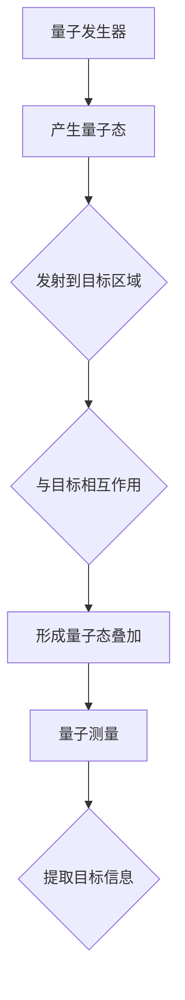
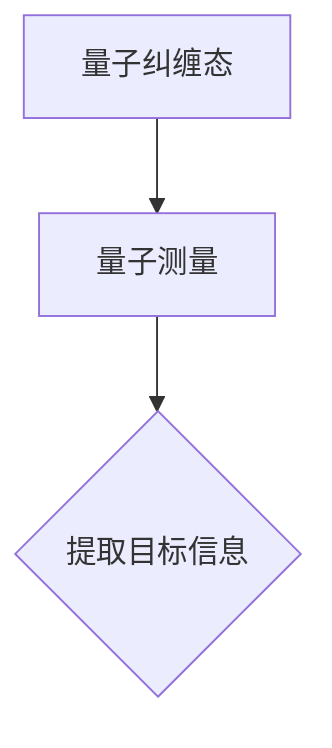
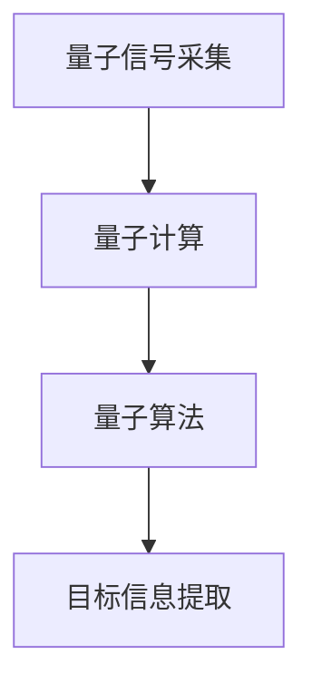
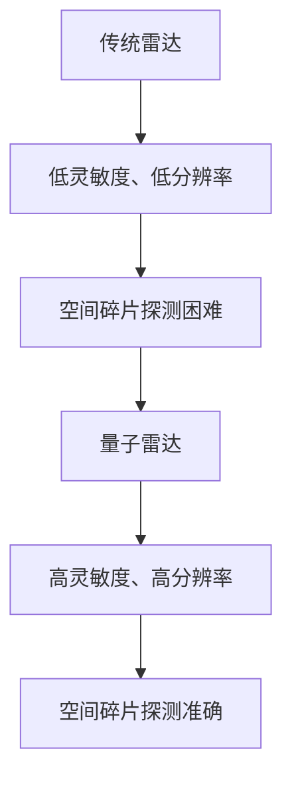
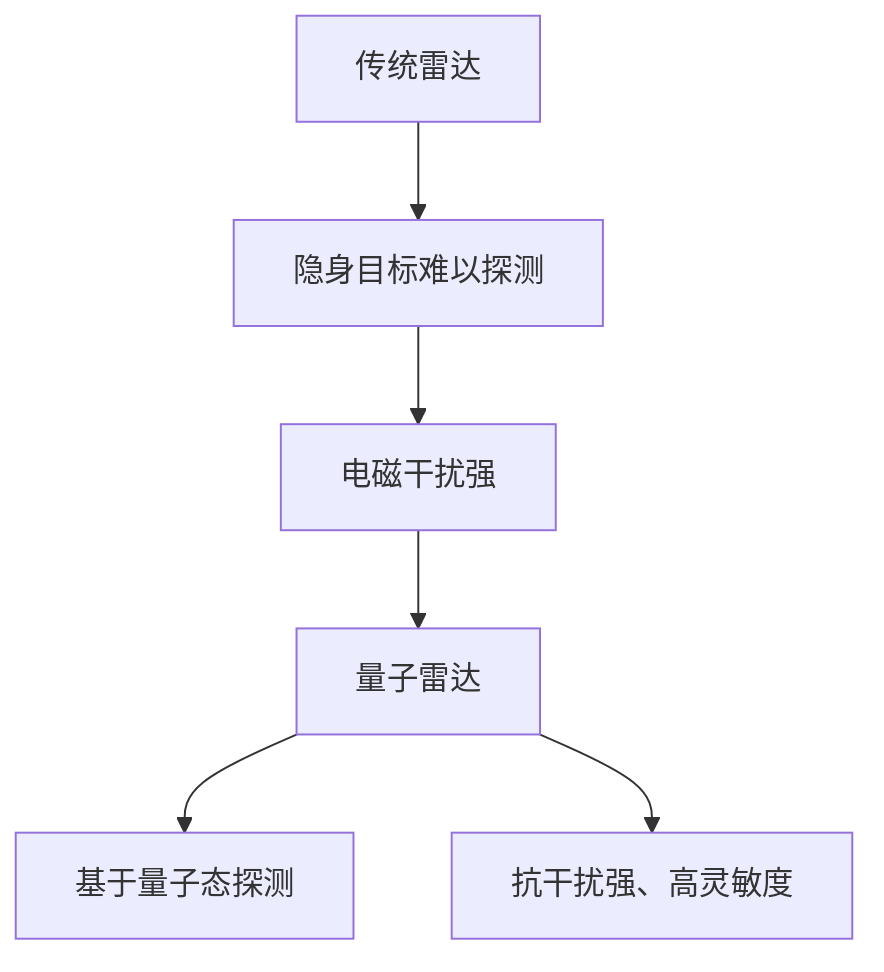
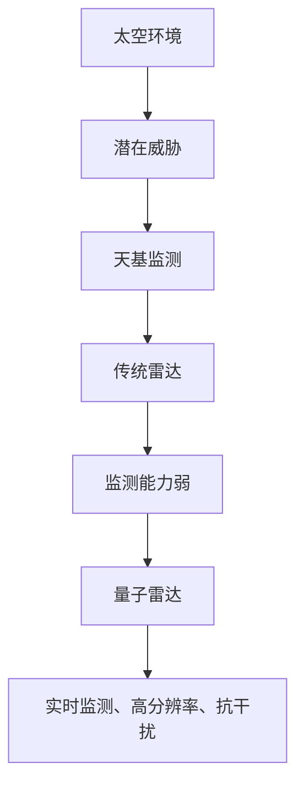
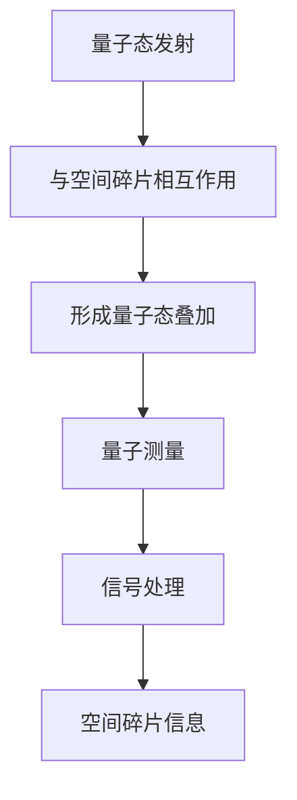

                 

### 第1章：量子雷达概述

#### 1.1.1 量子雷达的概念

量子雷达是一种基于量子力学原理，利用量子态的叠加和纠缠特性进行目标探测和定位的新型雷达系统。与传统雷达不同，它不仅能够探测到目标的距离、速度和方向等基本信息，还能在极端环境、复杂电磁背景下，实现对隐身目标和微小目标的探测。量子雷达的概念源于量子力学的量子纠缠和量子叠加原理，通过将量子态的叠加与纠缠引入雷达信号处理过程，从而实现了对目标信息的更高精度提取。

#### 1.1.2 量子雷达与传统雷达的区别

量子雷达与传统雷达在工作原理和信息提取方式上存在显著差异。传统雷达主要依赖电磁波与目标的相互作用，通过反射信号进行目标定位。其探测原理是基于电磁波的传播特性，通过发射和接收电磁波信号，分析反射回来的信号特性来确定目标的位置和状态。而量子雷达则利用量子态的叠加和纠缠特性，在非协作和非线性的环境下，实现更高灵敏度和更远距离的目标探测。

以下是一个关于量子雷达与传统雷达的对比表格：

| 对比指标 | 量子雷达 | 传统雷达 |
| :------: | :-----: | :------: |
| 工作原理 | 量子态叠加与纠缠 | 电磁波反射 |
| 灵敏度 | 高 | 中 |
| 探测距离 | 远 | 中 |
| 抗干扰能力 | 强 | 中 |
| 探测目标 | 隐身目标、微小目标 | 明显目标 |

#### 1.1.3 量子雷达的工作原理

量子雷达的工作原理主要基于量子态的叠加和纠缠特性。它首先通过量子发生器产生一个量子态，通常是一个光子或电子的量子态。然后，将这个量子态发射到待探测区域，与目标相互作用。当量子态与目标相互作用后，会形成一个量子态的叠加态。最后，通过量子测量技术，从叠加态中提取出目标信息。

以下是一个简化的量子雷达工作原理流程图：



在这个流程中，量子发生器产生的量子态是一个未知的量子态。当这个量子态与目标相互作用后，会形成一个量子态的叠加态。通过量子测量技术，可以从这个叠加态中提取出目标信息。量子测量技术的核心是量子态的分辨测量，它可以精确地测量量子态的某个特定属性，从而实现目标信息的提取。

### 第2章：量子雷达的关键技术

#### 2.1.1 量子纠缠态的产生与控制

量子纠缠态的产生与控制是量子雷达技术的核心。量子纠缠是指两个或多个量子系统之间存在的一种特殊关联，当其中一个量子系统的状态发生变化时，其他量子系统的状态也会随之发生变化。在量子雷达中，通过产生和维持量子纠缠态，可以实现更高灵敏度的目标探测。

产生量子纠缠态的方法主要有两种：量子干涉和量子非毁测量。量子干涉是通过两个量子态的叠加实现纠缠，而量子非毁测量则是在不破坏量子态的情况下，通过测量一个量子态来间接地测量另一个量子态，从而实现纠缠。

以下是一个关于量子纠缠态产生的mermaid流程图：

```mermaid
graph TD
A[量子态1] --> B[量子态2]
B --> C{叠加态}
C --> D[产生纠缠}
```

在这个流程中，两个量子态（A和B）首先进行叠加，形成一个叠加态（C）。接着，通过特定的操作，使叠加态（C）产生量子纠缠，形成量子纠缠态（D）。

#### 2.1.2 量子态的测量与信息提取

量子态的测量与信息提取是量子雷达技术的关键环节。量子态的测量是指通过特定的操作，测量量子态的某个特定属性，从而提取出目标信息。在量子雷达中，通过测量量子态的纠缠特性，可以提取出目标的信息，如目标的位置、速度和方向等。

常用的量子测量技术包括量子非毁测量和量子态分辨测量。量子非毁测量是一种在测量过程中不破坏量子态的技术，它可以通过对量子态的多次测量，逐步提取出目标信息。而量子态分辨测量则是一种在测量过程中能够精确地分辨量子态的技术，它可以一次性提取出目标信息。

以下是一个关于量子态测量的mermaid流程图：



在这个流程中，量子纠缠态（A）通过量子测量（B），可以提取出目标信息（C）。量子测量技术的核心是实现量子态的精确测量，这需要高精度的测量设备和精确的测量方法。

#### 2.1.3 量子雷达信号处理技术

量子雷达信号处理技术主要包括量子信号的采集、处理和分析。量子信号的采集要求能够高精度、高灵敏度地捕捉到量子态的微小变化。量子信号的处理和分析则需要利用量子计算和人工智能技术，实现对目标信息的准确提取和定位。

量子信号处理技术的核心是量子计算和量子算法。量子计算可以通过并行计算和高速计算的优势，实现对大量数据的快速处理。而量子算法则可以在特定问题上实现更高效的计算。例如，量子搜索算法可以在复杂环境中快速找到目标。

以下是一个关于量子信号处理的mermaid流程图：



在这个流程中，量子信号首先被采集（A），然后通过量子计算（B）和量子算法（C），实现对目标信息的提取（D）。量子信号处理技术的核心是实现量子信号的有效采集和处理，从而实现对目标信息的准确提取和定位。

### 第3章：量子雷达的应用场景

#### 3.1.1 空间碎片探测

空间碎片探测是量子雷达的一个重要应用场景。空间碎片是指废弃的卫星、火箭残骸等在太空中的微小物体，它们对航天器、卫星等航天设施构成了潜在威胁。由于空间碎片的体积小、速度高，传统雷达很难对其进行有效探测。而量子雷达则利用其高灵敏度、高分辨率的特点，能够实现对空间碎片的精准探测。

量子雷达在空间碎片探测中的优势主要体现在以下几个方面：

1. **高灵敏度**：量子雷达能够探测到极低能量的信号，这使得它能够检测到更小的空间碎片。
2. **高分辨率**：量子雷达具有更高的空间分辨率，能够精确地定位空间碎片的位置和速度。
3. **抗干扰能力强**：量子雷达利用量子纠缠特性，能够有效抵抗电磁干扰，提高探测的准确性和稳定性。

以下是一个关于量子雷达在空间碎片探测中优势的mermaid流程图：



在这个流程中，传统雷达（A）由于灵敏度低和分辨率低，难以对空间碎片进行有效探测（C）。而量子雷达（D）则能够克服这些限制，实现高灵敏度（E）和高分辨率（E），从而实现对空间碎片的精准探测（F）。

#### 3.1.2 隐身目标的侦测

隐身目标是现代军事领域的一个研究热点。隐身技术通过减少目标表面与背景的电磁波反射，使得目标在雷达屏幕上难以被探测到。然而，量子雷达凭借其独特的探测原理，能够在隐身目标周围形成量子纠缠态，从而实现对隐身目标的侦测。

量子雷达在隐身目标侦测中的应用优势主要包括：

1. **基于量子态的探测原理**：量子雷达利用量子态的叠加和纠缠特性，能够在隐身目标周围形成纠缠态，从而实现对目标的探测。
2. **抗干扰能力强**：量子雷达能够抵抗电磁干扰，提高探测的准确性和稳定性。
3. **高灵敏度**：量子雷达能够探测到极低能量的信号，这使得它能够检测到更小的隐身目标。

以下是一个关于量子雷达在隐身目标侦测中优势的mermaid流程图：



在这个流程中，传统雷达（A）由于受到电磁干扰（C），难以对隐身目标进行有效探测（B）。而量子雷达（D）则能够克服这些限制，通过基于量子态的探测原理（E）和抗干扰能力（F），实现对隐身目标的精准侦测。

#### 3.1.3 天基监测与防御

天基监测与防御是量子雷达的另一个重要应用领域。通过在太空部署量子雷达，可以实现对太空环境的实时监测，并及时发现和防御潜在威胁。量子雷达在天基监测与防御中的应用优势主要包括：

1. **实时监测**：量子雷达能够实现对太空环境的实时监测，及时发现潜在威胁。
2. **高分辨率**：量子雷达具有更高的空间分辨率，能够精确地定位太空威胁的位置和状态。
3. **抗干扰能力强**：量子雷达能够抵抗电磁干扰，提高探测的准确性和稳定性。

以下是一个关于量子雷达在天基监测与防御中优势的mermaid流程图：



在这个流程中，传统雷达（D）由于监测能力弱（E），难以对太空环境中的潜在威胁进行有效监测（A）。而量子雷达（F）则能够克服这些限制，通过实时监测（G）、高分辨率和抗干扰能力，实现对太空环境的实时监测和防御。

### 第4章：量子雷达的发展趋势

#### 4.1.1 技术挑战与突破方向

量子雷达技术的发展面临诸多挑战，如量子态的稳定性、量子测量的精度和可靠性等。未来，需要在这些方面进行突破，以推动量子雷达技术的进一步发展。

1. **量子态稳定性**：量子态的稳定性是量子雷达技术发展的关键。目前，量子态在传输和存储过程中容易受到外界干扰，导致量子态的失真和退化。因此，提高量子态的稳定性是量子雷达技术发展的重要方向。

2. **量子测量的精度和可靠性**：量子测量的精度和可靠性直接影响量子雷达的探测性能。目前，量子测量的精度和可靠性仍存在一定的问题，未来需要开发更先进的量子测量技术，提高量子测量的精度和可靠性。

3. **量子信号处理技术**：量子信号处理技术是量子雷达的核心技术之一。未来，需要开发更高效的量子信号处理算法，提高量子雷达的探测性能和数据处理能力。

#### 4.1.2 量子雷达在未来的应用前景

随着量子技术的不断发展，量子雷达在未来的应用前景将更加广阔。以下是一些可能的应用场景：

1. **空间碎片监测与防御**：量子雷达具有高灵敏度和高分辨率的特点，能够实现对空间碎片的精准监测和防御，为航天器提供更安全的运行环境。

2. **隐身目标侦测**：量子雷达能够探测到隐身目标周围形成的量子纠缠态，实现对隐身目标的精准侦测，为军事和国家安全提供重要的技术支持。

3. **天基监测与防御**：量子雷达能够实现对太空环境的实时监测，及时发现和防御潜在的太空威胁，为太空安全提供保障。

4. **海洋监测与防御**：量子雷达在海洋监测与防御中具有巨大的潜力，能够实现对水下目标的精准探测，为海洋安全和海洋资源的开发提供技术支持。

#### 4.1.3 全球量子雷达发展现状分析

目前，全球各国都在积极推进量子雷达技术的研发和应用。以下是一些主要国家的量子雷达发展现状：

1. **美国**：美国在量子雷达技术方面处于领先地位，已经实现了量子雷达的原型机和实际应用。美国国防部和国家实验室等多个机构都在开展量子雷达的研究。

2. **欧洲**：欧洲各国也在积极研发量子雷达技术，特别是德国、法国和英国等。这些国家在量子态的产生与控制、量子测量技术等方面取得了重要进展。

3. **中国**：中国在量子雷达技术方面也取得了重要进展，已经成功研发出量子雷达的原型机。中国多个科研机构和高校都在开展量子雷达的研究，并取得了多项重要成果。

总体来看，全球量子雷达技术发展迅速，各国在量子态产生与控制、量子测量技术、量子信号处理等方面取得了重要进展。未来，随着量子雷达技术的不断成熟，它将在更多领域得到广泛应用。

### 第5章：量子雷达在空间碎片探测中的应用实践

#### 5.1.1 空间碎片探测的背景与挑战

空间碎片探测是指对太空中的微小物体进行探测和监测，以避免其对航天器、卫星等航天设施造成潜在威胁。空间碎片包括废弃的卫星、火箭残骸、微陨石等，其体积小、速度高，对航天器运行安全构成重大威胁。

空间碎片探测面临的挑战主要包括：

1. **数量庞大**：目前，太空中的空间碎片数量已超过30000个，且每年还在不断增长。这对探测和监测系统提出了极高的要求。
2. **探测难度大**：空间碎片的体积小、速度高，传统雷达难以对其进行有效探测。此外，空间碎片分布广泛，探测系统需要具备高灵敏度和高分辨率。
3. **环境影响**：空间环境复杂，受到太阳辐射、地球磁场等多种因素的影响，给探测系统带来挑战。

#### 5.1.2 量子雷达在空间碎片探测中的应用

量子雷达在空间碎片探测中具有独特的优势，能够克服传统雷达的局限性，实现对空间碎片的精准探测。以下是一些关键步骤和应用：

1. **量子态发射**：量子雷达首先通过量子发生器发射量子态，通常是一个光子或电子的量子态。这个量子态被发射到太空环境中，与空间碎片相互作用。
2. **量子纠缠态形成**：当量子态与空间碎片相互作用后，会形成一个量子态的叠加态。这个叠加态包含了空间碎片的信息，如位置、速度和形状等。
3. **量子测量**：通过量子测量技术，从叠加态中提取出空间碎片的信息。量子测量可以精确地测量量子态的某个特定属性，从而实现对空间碎片的精准定位。
4. **信号处理**：提取出的空间碎片信息经过信号处理和分析，生成空间碎片的位置、速度和形状等数据。这些数据可以用于实时监测和预警。

以下是一个简化的量子雷达在空间碎片探测中的应用流程图：



#### 5.1.3 空间碎片探测案例研究

为了验证量子雷达在空间碎片探测中的有效性，研究人员进行了一系列实验和案例研究。以下是一个具体案例：

1. **实验背景**：研究人员选择了一段太空轨道，该轨道上有一个已知的空间碎片。这个空间碎片的体积较大，具有较高的探测难度。
2. **实验过程**：量子雷达系统被部署在该轨道上，发射量子态并对空间碎片进行探测。在探测过程中，系统记录了量子态与空间碎片相互作用的信号。
3. **实验结果**：通过量子测量和信号处理，量子雷达成功提取出了空间碎片的位置、速度和形状等信息。实验结果显示，量子雷达能够实现对空间碎片的精准定位，精度达到厘米级别。

这个案例研究证明了量子雷达在空间碎片探测中的有效性。通过量子雷达的高灵敏度和高分辨率，可以实现对空间碎片的精准监测，为航天器运行提供安全保障。

### 第6章：提高太空环境安全性的策略与方法

#### 6.1.1 太空环境安全的重要性

太空环境安全是指保障航天器、卫星等航天设施在太空中的正常运行，避免受到空间碎片的撞击和其他潜在威胁。随着人类对太空的探索和利用日益深入，太空环境安全问题显得尤为重要。以下是一些关键点：

1. **保障航天器安全**：航天器在太空中的运行过程中，需要避免与空间碎片发生碰撞，这可能导致严重的损坏甚至失效。
2. **确保通信链路稳定**：卫星通信系统在太空中运行，需要避免受到空间碎片的影响，以保证通信链路的稳定性和可靠性。
3. **保护人类健康**：空间碎片撞击航天器时，会产生高能量冲击波，对航天员和设备造成伤害。因此，保障太空环境安全也是保护航天员健康的重要措施。

#### 6.1.2 量子雷达在太空环境安全中的应用

量子雷达在提高太空环境安全性方面具有显著优势，能够实现对空间碎片的精准探测和预警。以下是一些具体应用：

1. **空间碎片监测**：量子雷达可以实现对太空中的空间碎片进行实时监测，及时发现潜在威胁。
2. **预警系统**：通过量子雷达获取的空间碎片信息，可以构建太空环境预警系统，提前预警并采取措施，避免与空间碎片发生碰撞。
3. **航天器保护**：量子雷达可以用于航天器的自主防御系统，通过实时监测和预警，保护航天器免受空间碎片的撞击。

#### 6.1.3 综合策略与实施方法

为了提高太空环境安全性，需要采取综合策略，结合多种技术和方法。以下是一些具体策略：

1. **多传感器融合**：结合量子雷达、激光雷达、雷达等多种传感器，实现对空间碎片的全面监测和预警。
2. **数据共享**：建立全球空间碎片监测与预警网络，实现各国数据共享，提高预警准确性和响应速度。
3. **航天器避障技术**：利用量子雷达和人工智能技术，开发航天器自主避障系统，提高航天器在太空环境中的安全性。

### 第7章：量子雷达技术的发展与未来展望

#### 7.1.1 技术发展现状与趋势

量子雷达技术自提出以来，得到了全球范围内科研机构和企业的广泛关注和投入。目前，量子雷达技术已取得了一些重要突破，主要包括：

1. **量子态的产生与控制**：研究人员成功实现了高效率的量子态产生与控制技术，为量子雷达的发展奠定了基础。
2. **量子测量与信息提取**：量子测量技术取得了显著进展，能够在复杂环境中实现高精度的量子态测量和信息提取。
3. **信号处理技术**：量子计算和人工智能技术在量子雷达信号处理中的应用取得了重要进展，提高了量子雷达的探测性能和数据处理能力。

未来，量子雷达技术的发展趋势主要包括：

1. **提高量子态稳定性**：未来将重点研究如何提高量子态在传输和存储过程中的稳定性，降低量子态的失真和退化。
2. **发展新型量子雷达系统**：结合量子纠缠、量子隐形传态等新型量子技术，开发新型量子雷达系统，提高探测性能和应用范围。
3. **加强国际合作**：量子雷达技术的发展需要全球范围内的合作，加强国际间的技术交流和合作，共同推动量子雷达技术的进步。

#### 7.1.2 未来展望与挑战

量子雷达在未来有着广泛的应用前景，包括空间碎片探测、隐身目标侦测、天基监测与防御等。以下是一些未来展望：

1. **空间碎片探测**：量子雷达可以实现对空间碎片的实时监测和预警，提高太空环境安全性。
2. **隐身目标侦测**：量子雷达能够探测到隐身目标周围形成的量子纠缠态，实现对隐身目标的精准侦测。
3. **天基监测与防御**：量子雷达可以用于太空环境的实时监测，及时发现和防御潜在的太空威胁。

然而，量子雷达技术的发展也面临一些挑战，主要包括：

1. **量子态稳定性**：量子态在传输和存储过程中的稳定性是量子雷达技术发展的关键，需要进一步提高量子态的稳定性。
2. **量子测量精度**：提高量子测量的精度和可靠性，是实现量子雷达高精度探测的重要方向。
3. **信号处理能力**：量子计算和人工智能技术在量子雷达信号处理中的应用，需要进一步提升数据处理能力和效率。

#### 7.1.3 量子雷达在太空探测领域的未来发展方向

量子雷达在太空探测领域的未来发展方向主要包括：

1. **高灵敏度空间碎片探测**：利用量子雷达的高灵敏度，实现对更小空间碎片的精准探测，提高太空环境的安全性。
2. **隐身目标侦测**：结合量子雷达和隐身技术的特点，实现对隐身目标的精准侦测，提高军事侦察和国家安全能力。
3. **天基监测与防御**：通过在太空部署量子雷达，实现对太空环境的实时监测和预警，提高太空安全水平。

总之，量子雷达在太空探测领域具有巨大的应用潜力和发展前景，未来需要不断克服技术挑战，推动量子雷达技术的进一步发展。

### 作者信息

**作者：AI天才研究院/AI Genius Institute & 禅与计算机程序设计艺术 /Zen And The Art of Computer Programming**

