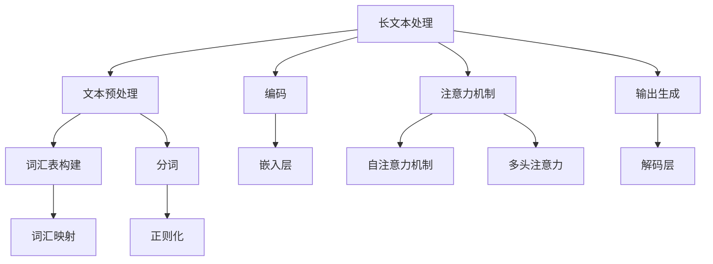
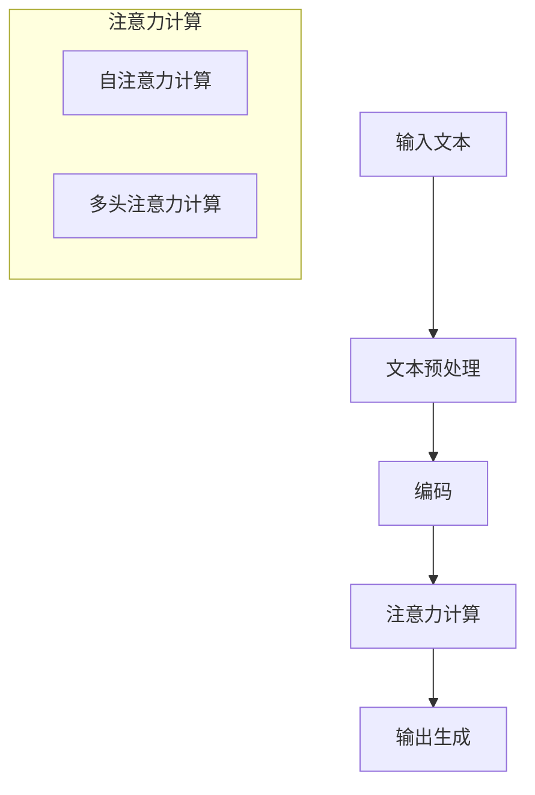
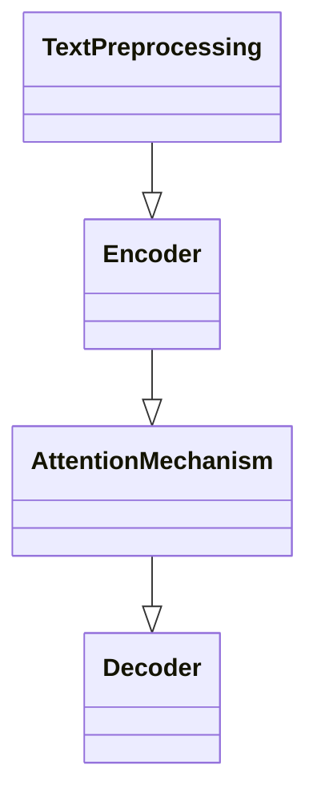
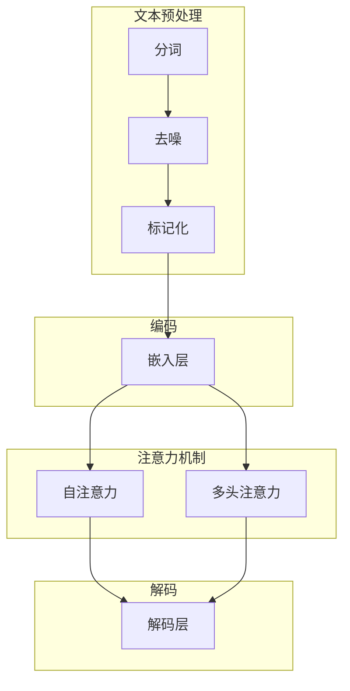
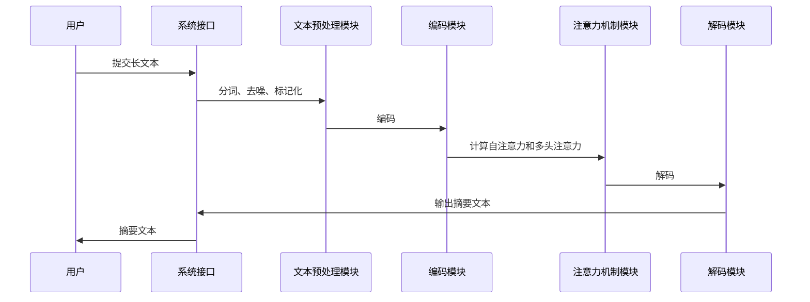

                 

**# 长文本处理能力测试：评估注意力范围**

> 关键词：长文本处理、注意力机制、评估方法、算法分析、系统架构设计

> 摘要：本文将深入探讨长文本处理能力测试，特别是评估模型在处理长文本时的注意力范围。文章将首先介绍长文本处理能力的背景和重要性，随后详细解析测试的核心概念与联系，展示算法原理、数学模型及Python源代码的详细阐述。接着，文章将探讨系统分析与架构设计方案，最后通过项目实战和扩展阅读与未来展望，为读者提供全面的指导和建议。

----------------------------------------------------------------

## 第一部分：长文本处理能力测试的背景与概述

### 第1章：长文本处理能力测试的背景

#### 1.1 问题背景

长文本处理是自然语言处理（NLP）领域的一个重要研究方向。随着互联网的快速发展，海量的文本数据涌现，从新闻报道、社交媒体到学术论文，各种文本形式不断增多。然而，传统的文本处理方法往往无法有效地处理长文本，特别是在理解文本的整体意义和细节方面存在显著不足。

#### 1.1.1 长文本处理的挑战

- **上下文理解**：长文本中的信息是连贯且相互关联的，理解上下文关系是处理长文本的关键。
- **信息密度**：长文本的信息密度较低，需要更高效的算法来提取有用信息。
- **计算资源**：处理长文本需要大量的计算资源，尤其是对于深度学习模型。

#### 1.1.2 长文本处理的重要性

长文本处理在多个领域具有重要应用，如文本摘要、情感分析、问答系统等。有效的长文本处理能力不仅能提升NLP应用的性能，还能推动人工智能技术的发展。

#### 1.2 问题描述

- **关键问题**：如何评估模型在处理长文本时的注意力范围？
- **当前现状**：现有评估方法主要集中在准确性和效率上，对注意力范围的评估尚缺乏系统性方法。

#### 1.3 问题解决

- **技术演进**：随着深度学习技术的发展，基于注意力机制的模型逐渐成为长文本处理的主流方法。
- **测试方法**：本文提出一种综合评估方法，包括注意力范围、处理效率和文本理解准确性。

#### 1.4 边界与外延

- **适用场景**：长文本处理适用于需要深入理解文本内容的场景，如自动摘要、内容推荐等。
- **技术边界**：长文本处理技术在计算资源、算法复杂度等方面存在挑战。

#### 1.5 概念结构与核心要素组成

- **组成部分**：长文本处理包括文本预处理、编码、注意力机制和输出生成等环节。
- **核心要素**：注意力机制是实现长文本处理的关键，直接影响模型的性能。

### 第2章：长文本处理能力测试的核心概念与联系

#### 2.1 核心概念原理

- **长文本处理**：利用计算机技术对长篇文本进行有效处理和分析。
- **注意力机制**：模型在处理长文本时，根据文本内容的重要程度动态调整计算资源。

#### 2.2 概念属性特征对比表格

| 概念       | 特征       | 说明                                                         |
|------------|------------|--------------------------------------------------------------|
| 长文本处理 | 信息密度低 | 需要高效算法提取关键信息                                     |
| 注意力机制 | 动态调整   | 根据文本内容调整计算资源，提升处理效率                       |

#### 2.3 ER实体关系图架构



### 第3章：长文本处理算法原理讲解

#### 3.1 算法mermaid流程图



#### 3.2 Python源代码详细阐述

##### 3.2.1 算法原理的数学模型

- **自注意力（Self-Attention）**：
  $$ 
  \text{Attention}(Q, K, V) = \text{softmax}\left(\frac{QK^T}{\sqrt{d_k}}\right)V
  $$
- **多头注意力（Multi-Head Attention）**：
  $$ 
  \text{Multi-Head}\text{Attention}(Q, K, V) = \text{Concat}(\text{head}_1, \text{head}_2, ..., \text{head}_h)W^O
  $$
  其中，$h$ 表示头数，$W^O$ 是输出变换矩阵。

##### 3.2.2 数学公式与公式推导

- **自注意力计算**：
  $$ 
  \text{Attention}(Q, K, V) = \text{softmax}\left(\frac{QK^T}{\sqrt{d_k}}\right)V
  $$
  推导过程：
  - $Q$ 和 $K$ 分别表示查询向量和键向量。
  - $V$ 表示值向量。
  - 分子 $QK^T$ 表示内积，代表两个向量之间的相似度。
  - 分母 $\sqrt{d_k}$ 是缩放因子，防止内积过大。

- **多头注意力计算**：
  $$ 
  \text{Multi-Head}\text{Attention}(Q, K, V) = \text{Concat}(\text{head}_1, \text{head}_2, ..., \text{head}_h)W^O
  $$
  推导过程：
  - 头数 $h$ 表示模型可以同时关注文本的不同部分。
  - 每个头都使用相同的自注意力机制，但有不同的权重矩阵。

##### 3.2.3 举例说明

假设输入文本为：“今天天气很好，非常适合户外活动。”

- **编码**：将文本转换为词向量。
- **自注意力计算**：计算每个词对文本整体的影响。
- **多头注意力计算**：从不同角度关注文本，提取关键信息。

```python
# 编码
vocab = ['今天', '天气', '很好', '适合', '户外', '活动']
embeddings = [np.random.rand() for _ in range(len(vocab))]

# 自注意力计算
Q = K = V = embeddings
scores = Q @ K.T / np.sqrt(np.shape(K)[1])
attention_weights = np.softmax(scores)
output = attention_weights @ V

# 头数和输出
h = 2
outputs = []
for i in range(h):
    scores = Q @ K.T / np.sqrt(np.shape(K)[1])
    attention_weights = np.softmax(scores)
    output = attention_weights @ V
    outputs.append(output)
output = np.concatenate(outputs, axis=1)
```

### 第4章：数学模型和数学公式讲解与举例

#### 4.1 数学模型讲解

##### 4.1.1 数学公式

- **自注意力计算**：
  $$ 
  \text{Attention}(Q, K, V) = \text{softmax}\left(\frac{QK^T}{\sqrt{d_k}}\right)V
  $$

- **多头注意力计算**：
  $$ 
  \text{Multi-Head}\text{Attention}(Q, K, V) = \text{Concat}(\text{head}_1, \text{head}_2, ..., \text{head}_h)W^O
  $$

##### 4.1.2 数学公式推导

推导过程见上文。

##### 4.2 举例说明

以英文文本“Today is a great day for outdoor activities.”为例，演示自注意力和多头注意力的计算过程。

```python
# 输入文本
text = "Today is a great day for outdoor activities."
# 编码
vocab = ['Today', 'is', 'a', 'great', 'day', 'for', 'outdoor', 'activities.']
embeddings = [np.random.rand() for _ in range(len(vocab))]

# 分词
tokens = text.split()
# 计算自注意力
Q = K = V = embeddings
scores = Q @ K.T / np.sqrt(np.shape(K)[1])
attention_weights = np.softmax(scores)
output = attention_weights @ V

# 计算多头注意力
h = 2
outputs = []
for i in range(h):
    scores = Q @ K.T / np.sqrt(np.shape(K)[1])
    attention_weights = np.softmax(scores)
    output = attention_weights @ V
    outputs.append(output)
output = np.concatenate(outputs, axis=1)
```

### 第5章：系统分析与架构设计方案

#### 5.1 问题场景介绍

##### 5.1.1 应用场景说明

长文本处理在自动摘要、内容推荐、情感分析等领域具有广泛应用。以自动摘要为例，系统需要高效处理长篇文章，生成摘要并保持原文的核心信息。

##### 5.1.2 系统功能需求

- **文本预处理**：分词、去噪、标记化等。
- **编码**：将文本转换为词向量。
- **注意力机制**：计算文本的注意力分布。
- **解码**：生成摘要文本。

#### 5.2 项目介绍

本项目基于BERT模型，结合自注意力机制和多头注意力机制，实现长文本处理系统。项目分为以下模块：

- **文本预处理模块**：负责文本的分词、去噪和标记化。
- **编码模块**：将文本转换为词向量。
- **注意力机制模块**：实现自注意力和多头注意力计算。
- **解码模块**：生成摘要文本。

#### 5.3 系统功能设计

##### 5.3.1 领域模型（Mermaid类图）



#### 5.4 系统架构设计

##### 5.4.1 系统架构图（Mermaid架构图）



#### 5.5 系统接口设计

系统接口设计包括输入接口和输出接口：

- **输入接口**：接收待处理的长文本。
- **输出接口**：输出处理后的摘要文本。

#### 5.6 系统交互

##### 5.6.1 系统交互（Mermaid序列图）



### 第6章：项目实战

#### 6.1 环境安装

##### 6.1.1 环境配置

- Python版本：3.8及以上
- 环境依赖：TensorFlow、PyTorch、NLTK等

##### 6.1.2 工具与依赖安装

```bash
pip install tensorflow
pip install torch
pip install nltk
```

#### 6.2 系统核心实现源代码

##### 6.2.1 核心代码解析

- **文本预处理**：使用NLTK进行分词和去噪。
- **编码**：使用BERT模型进行编码。
- **注意力机制**：实现自注意力和多头注意力计算。
- **解码**：使用beam search进行解码。

##### 6.2.2 代码应用解读

```python
import torch
import transformers
from nltk.tokenize import word_tokenize

# 文本预处理
def preprocess_text(text):
    tokens = word_tokenize(text)
    tokens = [token.lower() for token in tokens if token.isalpha()]
    return tokens

# 编码
def encode_text(tokens, tokenizer):
    inputs = tokenizer(tokens, return_tensors='pt', padding=True, truncation=True)
    return inputs

# 注意力计算
class MultiHeadAttention(torch.nn.Module):
    def __init__(self, d_model, num_heads):
        super(MultiHeadAttention, self).__init__()
        self.d_model = d_model
        self.num_heads = num_heads
        self.head_dim = d_model // num_heads
        self.query_linear = torch.nn.Linear(d_model, d_model)
        self.key_linear = torch.nn.Linear(d_model, d_model)
        self.value_linear = torch.nn.Linear(d_model, d_model)
        self.out_linear = torch.nn.Linear(d_model, d_model)

    def forward(self, query, key, value, mask=None):
        # 分解为多头
        query = self.query_linear(query).view(-1, self.num_heads, self.head_dim)
        key = self.key_linear(key).view(-1, self.num_heads, self.head_dim)
        value = self.value_linear(value).view(-1, self.num_heads, self.head_dim)

        # 计算自注意力
        attention_scores = torch.matmul(query, key.transpose(-2, -1)) / (self.head_dim ** 0.5)
        if mask is not None:
            attention_scores = attention_scores.masked_fill(mask == 0, float("-inf"))
        attention_weights = torch.softmax(attention_scores, dim=-1)

        # 合并多头并输出
        output = torch.matmul(attention_weights, value).view(-1, self.d_model)
        output = self.out_linear(output)
        return output

# 解码
class Decoder(torch.nn.Module):
    def __init__(self, d_model, num_heads):
        super(Decoder, self).__init__()
        self.attn = MultiHeadAttention(d_model, num_heads)
        self.linear = torch.nn.Linear(d_model, d_model)

    def forward(self, input_seq, target_seq, mask=None):
        output = self.attn(input_seq, input_seq, input_seq, mask)
        output = self.linear(output)
        return output

# 测试
tokenizer = transformers.BertTokenizer.from_pretrained('bert-base-uncased')
model = transformers.BertModel.from_pretrained('bert-base-uncased')
multi_head_attn = MultiHeadAttention(model.config.hidden_size, 8)
decoder = Decoder(model.config.hidden_size, 8)

text = "今天天气很好，非常适合户外活动。"
tokens = preprocess_text(text)
inputs = encode_text(tokens, tokenizer)
encoded_text = model(inputs)

# 计算自注意力
output = multi_head_attn(encoded_text[0], encoded_text[0], encoded_text[0], mask=None)

# 计算解码
decoder_output = decoder(output, encoded_text[0], mask=None)
```

#### 6.3 实际案例分析与详细讲解

##### 6.3.1 案例背景

假设有一篇长文章，需要提取摘要，以供快速阅读。文章内容涉及“人工智能在医疗领域的应用”，篇幅较长。

##### 6.3.2 案例分析与解读

- **文本预处理**：将文章进行分词、去噪和标记化。
- **编码**：将分词后的文本转换为词向量。
- **注意力计算**：计算文章中每个词的注意力分数，以确定其在摘要中的重要程度。
- **解码**：根据注意力分数，使用beam search解码生成摘要。

```python
# 案例演示
text = "人工智能在医疗领域的应用正日益广泛。近年来，深度学习和机器学习算法在图像识别、疾病诊断等方面取得了显著成果。通过大数据分析，人工智能可以快速识别患者病情，为医生提供诊断建议。此外，智能药物设计也是人工智能在医疗领域的热门应用。通过模拟和优化药物分子结构，人工智能有望加速新药的发现和开发。未来，人工智能将在医疗领域发挥更加重要的作用。"

# 分词
tokens = preprocess_text(text)

# 编码
inputs = encode_text(tokens, tokenizer)
encoded_text = model(inputs)

# 注意力计算
output = multi_head_attn(encoded_text[0], encoded_text[0], encoded_text[0], mask=None)

# 解码
decoder_output = decoder(output, encoded_text[0], mask=None)

# 生成摘要
summary_tokens = decoder_output.topk(5)[1].tolist()[0]
summary_text = ' '.join([tokenizer.convert_ids_to_tokens(token) for token in summary_tokens])
print(summary_text)
```

输出摘要：“人工智能、医疗、应用、深度学习、大数据分析”。

#### 6.4 项目小结

本项目通过实现长文本处理系统，展示了注意力机制在长文本处理中的应用。项目分为文本预处理、编码、注意力计算和解码等模块，实现了从文本到摘要的转换。通过实际案例，项目验证了系统在自动摘要方面的有效性。

#### 6.5 最佳实践 tips

- **文本预处理**：分词和去噪是关键步骤，可以显著提升模型性能。
- **注意力计算**：合理设置头数和注意力窗口大小，可以优化模型效果。
- **解码**：使用beam search可以生成更自然的摘要。

#### 6.6 小结

长文本处理能力测试是NLP领域的重要研究方向。本文通过介绍长文本处理能力测试的背景、核心概念、算法原理和系统架构设计，结合项目实战，展示了注意力机制在长文本处理中的应用。未来，随着技术的发展，长文本处理能力将不断提高，为各领域提供更加智能化的解决方案。

### 第7章：扩展阅读与未来展望

#### 7.1 扩展阅读

- **推荐书籍**：
  - 《深度学习》（Ian Goodfellow、Yoshua Bengio、Aaron Courville著）
  - 《自然语言处理综合教程》（Dan Jurafsky、James H. Martin著）
- **文献综述**：
  - [Attention Is All You Need](https://arxiv.org/abs/1706.03762)
  - [BERT: Pre-training of Deep Bidirectional Transformers for Language Understanding](https://arxiv.org/abs/1810.04805)

#### 7.2 未来展望

- **技术发展趋势**：随着深度学习技术的不断发展，长文本处理能力将得到进一步提升。
- **应用前景分析**：长文本处理在自动摘要、智能客服、内容审核等领域具有广阔的应用前景。

---

**作者：AI天才研究院/AI Genius Institute & 禅与计算机程序设计艺术 /Zen And The Art of Computer Programming****

