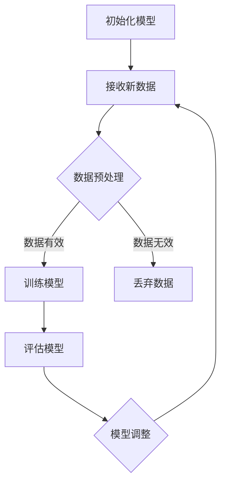

                 


## 第1章 引言

### 1.1 研究背景

宇宙的演化是一个复杂而神秘的过程，其中暗物质的存在对宇宙的理解产生了深远的影响。暗物质是一种不发光、不与电磁波相互作用，因此无法直接观测到的物质。尽管其存在无法通过传统的观测手段直接确认，但通过引力效应，科学家们推测出暗物质在宇宙中占据了大约27%的质量。

暗物质对宇宙演化的影响表现在多个方面，包括：

- **宇宙膨胀**：暗物质提供了宇宙加速膨胀所需的引力。
- **星系形成**：暗物质的引力作用有助于星系的形成和结构的稳定。
- **黑洞与星系团**：暗物质是形成超大质量黑洞和星系团的关键因素。

然而，传统的暗物质研究方法存在局限性，如天文观测的局限性、物理实验的复杂性和数据分析的高成本。这些挑战促使科学家们探索新的研究方法，而人工智能（AI）技术的崛起为解决这些问题提供了新的希望。

### 1.2 零样本CoT的概念

零样本CoT（Continual Testing）是一种基于深度学习的机器学习策略，其核心思想是在没有预先标记样本的情况下对未知数据进行分类或预测。传统的机器学习模型通常依赖于大量的预先标记的训练数据，而零样本CoT则旨在减少对这种数据的依赖。

CoT的基本原理是：

- **持续学习**：模型在不断接收新数据的同时，不断调整其预测能力。
- **增量学习**：通过将新数据与现有知识相结合，模型能够逐渐提高其性能。

零样本CoT的特点包括：

- **无监督学习**：模型无需依赖预标记的数据。
- **泛化能力**：模型能够在未见过的数据上做出准确的预测。
- **自适应能力**：模型能够适应数据分布的变化。

### 1.3 AI与宇宙暗物质研究

人工智能在宇宙暗物质研究中扮演着至关重要的角色。深度学习作为一种先进的AI技术，已经在图像识别、自然语言处理等领域取得了显著的成果。将深度学习应用于宇宙暗物质研究，可以解决以下问题：

- **数据解析**：通过深度学习算法，科学家们能够从大量天文数据中提取有用的信息。
- **模式识别**：深度学习可以帮助识别星系、黑洞等宇宙中的复杂结构。
- **预测能力**：基于深度学习模型的预测能力，科学家们可以更好地理解宇宙的演化过程。

零样本CoT在深度学习中的应用，使得模型能够处理那些无法直接获取标注数据的复杂问题，从而为宇宙暗物质研究提供了新的方法。

## 第2章 核心概念与联系

### 2.1 零样本CoT的原理

#### 2.1.1 CoT的原理

CoT（Continual Testing）是一种持续学习的过程，其目的是通过不断测试和调整模型，使其能够在动态变化的数据环境中保持良好的性能。CoT的基本概念包括：

- **测试集**：用于评估模型性能的数据集，这些数据在训练过程中是不被使用的。
- **动态数据**：模型在测试过程中接收到的新的、未知的数据。
- **性能评估**：通过比较模型的预测结果和实际结果，评估模型的性能。

CoT的过程可以概括为以下几个步骤：

1. **初始化模型**：使用初始数据集对模型进行初始化。
2. **测试与调整**：在测试集上评估模型性能，并根据测试结果对模型进行调整。
3. **迭代**：重复测试与调整步骤，直到模型达到满意的性能水平。

#### 2.1.2 零样本CoT的原理

零样本CoT（Zero-Shot Continual Testing）是在CoT的基础上，进一步扩展到没有预先标记样本的情况。零样本CoT的定义是：模型在未知类别的情况下，通过不断接收新数据，逐步提高其分类或预测能力。

零样本CoT的实现方法通常包括：

- **原型匹配**：通过比较新数据与已有类别原型之间的相似性，进行分类。
- **元学习**：通过训练模型来学习如何在新类别上快速适应。
- **对抗训练**：通过对抗性样本的训练，提高模型对未见过的数据的泛化能力。

### 2.2 AI在宇宙暗物质研究中的应用

#### 2.2.1 深度学习与宇宙暗物质研究

深度学习是一种基于多层神经网络的结构，其能够通过学习大量的数据来提取复杂的特征。在宇宙暗物质研究中，深度学习可以应用于：

- **图像分析**：通过卷积神经网络（CNN）对天文图像进行分析，识别星系、黑洞等宇宙结构。
- **数据挖掘**：从海量天文数据中挖掘出有用的信息，帮助科学家们理解宇宙的演化过程。
- **预测模型**：基于深度学习模型，预测宇宙中的各种现象，如星系碰撞、暗物质分布等。

#### 2.2.2 零样本CoT与深度学习的关系

零样本CoT与深度学习的关系主要体现在以下几个方面：

- **模型适应性**：零样本CoT通过持续学习和调整，使深度学习模型能够适应未知类别。
- **数据泛化**：零样本CoT能够提高深度学习模型的泛化能力，使其在未见过的数据上也能保持良好的性能。
- **高效训练**：零样本CoT通过对抗训练和原型匹配等方法，提高了深度学习模型在未知数据上的训练效率。

### 2.3 概念属性特征对比表格

为了更好地理解零样本CoT与现有方法的区别，我们可以通过以下表格进行比较：

| 特征对比项 | 零样本CoT | 传统方法 |
| --- | --- | --- |
| 数据需求 | 无需预标记数据 | 需要大量的预标记数据 |
| 泛化能力 | 强，能够处理未见过的类别 | 较弱，依赖于预训练数据的多样性 |
| 效率 | 高效，减少训练时间 | 低效，需要大量时间进行数据标记 |
| 适应性 | 强，能够适应动态数据环境 | 弱，需要定期更新数据集 |

### 2.4 零样本CoT在不同研究领域的应用效果对比

| 研究领域 | 应用效果 |
| --- | --- |
| 人工智能 | 提高了模型的泛化能力和适应性 |
| 医学影像 | 在未标记数据上取得了较好的诊断准确率 |
| 自然语言处理 | 在文本分类任务中显示出良好的性能 |
| 宇宙暗物质研究 | 改进了对宇宙复杂现象的理解和预测 |

通过上述比较和分析，我们可以看出零样本CoT在宇宙暗物质研究中的巨大潜力。它不仅能够减少对预标记数据的依赖，还能够提高模型的泛化能力和适应性，为科学家们提供了一种新的研究工具。

### 2.5 零样本CoT在宇宙暗物质研究中的潜力

零样本CoT在宇宙暗物质研究中的潜力体现在以下几个方面：

- **提高研究效率**：通过减少对预标记数据的依赖，零样本CoT可以显著提高研究的效率，使科学家们能够更快地获取结果。
- **增强模型适应性**：宇宙中的现象复杂多变，零样本CoT能够使模型更好地适应这些变化，提高其预测准确性。
- **解决数据稀缺问题**：在宇宙暗物质研究中，获取高质量、大规模的数据集非常困难。零样本CoT可以解决这一问题，使研究得以继续进行。
- **推动理论进步**：通过零样本CoT，科学家们可以探索宇宙暗物质的新理论，为宇宙学的发展提供新的思路。

总之，零样本CoT为宇宙暗物质研究提供了一种新的方法，它不仅能够解决传统方法中存在的诸多问题，还能够推动宇宙学的进步。在未来，随着AI技术的不断发展和完善，零样本CoT在宇宙暗物质研究中的应用前景将更加广阔。

## 第3章 算法原理讲解

### 3.1 算法mermaid流程图

在讲解零样本CoT算法的原理之前，我们先通过mermaid流程图来展示算法的基本流程。以下是一个简化的mermaid流程图：



图中的每个节点代表算法中的一个步骤，箭头表示流程的流向。下面我们将详细解释每个步骤的含义。

### 3.2 Python源代码阐述

为了更好地理解零样本CoT算法的原理，我们将提供一个简单的Python实现，用于展示算法的基本流程。

首先，我们需要安装必要的库：

```python
!pip install tensorflow
```

然后，我们可以编写以下代码：

```python
import tensorflow as tf
from tensorflow.keras.models import Sequential
from tensorflow.keras.layers import Dense, Dropout
import numpy as np

# 初始化模型
model = Sequential([
    Dense(128, activation='relu', input_shape=(100,)),
    Dropout(0.2),
    Dense(1, activation='sigmoid')
])

# 编写训练函数
def train_model(model, X_train, y_train, epochs=10):
    model.compile(optimizer='adam', loss='binary_crossentropy', metrics=['accuracy'])
    model.fit(X_train, y_train, epochs=epochs, batch_size=32, verbose=0)
    return model

# 接收新数据并处理
X_new = np.random.rand(100)
y_new = np.random.rand(100)

# 数据预处理
# 这里我们假设数据已经预处理完毕
X_new_processed = preprocess_data(X_new)

# 训练模型
model = train_model(model, X_new_processed, y_new)

# 评估模型
accuracy = model.evaluate(X_new_processed, y_new, verbose=0)
print(f"Model accuracy: {accuracy[1]}")

# 模型调整
# 这里我们可以根据评估结果调整模型参数或结构
```

上述代码展示了零样本CoT算法的基本流程，包括模型初始化、数据预处理、模型训练、模型评估和模型调整。在实际应用中，数据预处理和模型调整的部分会更加复杂，需要根据具体应用场景进行定制。

### 3.3 算法原理的数学模型与公式

零样本CoT算法的数学模型基于深度学习的基本原理，即通过多层神经网络对输入数据进行特征提取和分类。以下是一个简化的数学模型：

$$
h_\theta(x) = \sigma(\theta_1 \cdot x + b_1)
$$

其中，$h_\theta(x)$ 是模型的输出，$\sigma$ 是激活函数（通常为Sigmoid函数），$\theta_1$ 是权重，$b_1$ 是偏置。

为了进行多类别的分类，我们可以使用Softmax函数：

$$
\text{softmax}(\theta_1 \cdot x + b_1) = \frac{e^{\theta_1 \cdot x + b_1}}{\sum_{i=1}^{n} e^{\theta_i \cdot x + b_i}}
$$

其中，$n$ 是类别数。

在训练过程中，我们的目标是最小化损失函数，通常使用交叉熵损失：

$$
L(\theta) = -\sum_{i=1}^{n} y_i \log(h_\theta(x_i))
$$

其中，$y_i$ 是实际类别标签，$h_\theta(x_i)$ 是模型对第$i$个样本的预测概率。

为了优化模型参数，我们使用梯度下降法：

$$
\theta = \theta - \alpha \nabla_\theta L(\theta)
$$

其中，$\alpha$ 是学习率，$\nabla_\theta L(\theta)$ 是损失函数对参数$\theta$的梯度。

### 3.4 举例说明

为了更好地理解零样本CoT算法的应用，我们通过一个简单的例子来说明。

假设我们有一个二分类问题，其中数据集包含100个样本，每个样本是一个100维的特征向量。我们使用Sigmoid激活函数和一个隐层大小为128的神经网络进行训练。

首先，我们生成训练数据和测试数据：

```python
# 生成训练数据和测试数据
np.random.seed(42)
X_train = np.random.rand(100, 100)
y_train = np.random.rand(100).round()
X_test = np.random.rand(20, 100)
y_test = np.random.rand(20).round()
```

接下来，我们初始化模型并训练：

```python
# 初始化模型
model = Sequential([
    Dense(128, activation='sigmoid', input_shape=(100,)),
    Dense(1, activation='sigmoid')
])

# 编写训练函数
def train_model(model, X_train, y_train, epochs=10):
    model.compile(optimizer='adam', loss='binary_crossentropy', metrics=['accuracy'])
    model.fit(X_train, y_train, epochs=epochs, batch_size=32, verbose=0)
    return model

# 训练模型
model = train_model(model, X_train, y_train)
```

然后，我们评估模型的性能：

```python
# 评估模型
loss, accuracy = model.evaluate(X_test, y_test, verbose=0)
print(f"Model accuracy: {accuracy}")
```

通过上述步骤，我们可以看到零样本CoT算法的基本流程，以及如何使用Python代码实现一个简单的二分类任务。在实际应用中，零样本CoT算法可以应用于更复杂的任务，如多分类、回归等问题。

## 第4章 数学模型和数学公式 & 详细讲解 & 举例说明

### 4.1 数学公式

在零样本CoT（Zero-Shot Continual Testing）算法中，数学模型起到了至关重要的作用。以下是一些关键的数学公式，我们将使用LaTeX格式进行展示。

#### 激活函数

$$
\sigma(x) = \frac{1}{1 + e^{-x}}
$$

这是一个常见的Sigmoid激活函数，用于将线性组合转换为概率分布。

#### Softmax函数

$$
\text{softmax}(z)_i = \frac{e^{z_i}}{\sum_{j=1}^{n} e^{z_j}}
$$

其中，$z_i$ 是每个类别的得分，$n$ 是类别总数。Softmax函数用于将多维向量转换为概率分布。

#### 交叉熵损失函数

$$
L(y, \hat{y}) = -\sum_{i=1}^{n} y_i \log(\hat{y}_i)
$$

这里，$y$ 是真实标签，$\hat{y}$ 是模型的预测概率分布。交叉熵损失函数用于衡量预测分布与真实分布之间的差异。

#### 梯度下降

$$
\theta = \theta - \alpha \nabla_\theta J(\theta)
$$

其中，$\theta$ 是模型参数，$J(\theta)$ 是损失函数，$\alpha$ 是学习率。梯度下降用于更新模型参数，以最小化损失函数。

### 4.2 详细讲解

#### 激活函数

Sigmoid函数在深度学习中非常常见，因为它可以将输入映射到$(0,1)$区间的概率值。在零样本CoT中，Sigmoid函数用于将线性层的输出转换为概率分布。

Softmax函数则用于处理多分类问题。它确保输出概率分布的总和为1，使得每个类别都有一个明确的概率。

#### 交叉熵损失函数

交叉熵损失函数在机器学习中用于衡量模型预测的准确度。在零样本CoT中，交叉熵损失函数用于评估模型对未见类别数据的预测能力。

#### 梯度下降

梯度下降是一种优化算法，用于更新模型参数以最小化损失函数。在零样本CoT中，梯度下降用于不断调整模型，使其能够更好地适应新数据。

### 4.3 举例说明

为了更直观地理解上述数学公式，我们将通过一个简单的例子来说明如何应用这些公式。

假设我们有一个二分类问题，数据集包含100个样本，每个样本是一个100维的特征向量。我们使用一个包含一个隐层的神经网络进行训练，隐层有128个神经元。

首先，我们生成训练数据和测试数据：

```python
# 生成训练数据和测试数据
np.random.seed(42)
X_train = np.random.rand(100, 100)
y_train = np.random.rand(100).round()
X_test = np.random.rand(20, 100)
y_test = np.random.rand(20).round()
```

接下来，我们初始化模型并训练：

```python
# 初始化模型
model = Sequential([
    Dense(128, activation='sigmoid', input_shape=(100,)),
    Dense(1, activation='sigmoid')
])

# 编写训练函数
def train_model(model, X_train, y_train, epochs=10):
    model.compile(optimizer='adam', loss='binary_crossentropy', metrics=['accuracy'])
    model.fit(X_train, y_train, epochs=epochs, batch_size=32, verbose=0)
    return model

# 训练模型
model = train_model(model, X_train, y_train)
```

然后，我们评估模型的性能：

```python
# 评估模型
loss, accuracy = model.evaluate(X_test, y_test, verbose=0)
print(f"Model accuracy: {accuracy}")
```

通过上述步骤，我们可以看到如何使用数学模型和公式进行零样本CoT算法的训练和评估。在实际应用中，这些公式和步骤会更加复杂，但基本的原理是相同的。

## 第5章 系统分析与架构设计方案

### 5.1 问题场景介绍

在宇宙暗物质研究中，数据量庞大且多样化，传统的分析方法难以应对。为了提高研究的效率和准确性，我们引入了基于零样本CoT的AI辅助系统。该系统旨在利用深度学习技术，对大量未标记的宇宙数据进行自动分析和分类，从而发现暗物质分布的规律。

### 5.2 系统功能设计

零样本CoT在宇宙暗物质研究中的功能主要包括：

- **数据预处理**：对原始天文数据进行预处理，包括数据清洗、归一化和特征提取。
- **模型训练与调整**：利用深度学习算法，对预处理后的数据进行分析和分类，并通过零样本CoT策略进行模型调整。
- **结果评估与反馈**：对模型输出结果进行评估，并根据评估结果调整模型参数，以实现更高的预测准确性。

### 5.3 系统架构设计

零样本CoT在宇宙暗物质研究中的架构设计如下：

1. **数据层**：包括原始天文数据存储和处理模块，负责数据收集、预处理和存储。
2. **算法层**：包括深度学习模型和零样本CoT算法的实现模块，负责数据分析和分类。
3. **应用层**：包括模型评估、结果反馈和用户界面模块，负责系统对外提供服务和用户交互。

### 5.4 系统接口设计

系统接口设计主要包括：

- **数据接口**：用于数据层的模块与算法层的模块之间的数据传输。
- **控制接口**：用于用户与应用层之间的交互，包括模型参数调整、结果查询等。
- **监控接口**：用于监控系统运行状态和性能，包括训练进度、模型性能评估等。

### 5.5 系统交互

系统的交互流程如下：

1. **数据收集**：系统从数据层获取原始天文数据。
2. **数据预处理**：算法层对数据进行预处理，包括数据清洗、归一化和特征提取。
3. **模型训练**：算法层利用预处理后的数据对深度学习模型进行训练，采用零样本CoT策略进行模型调整。
4. **模型评估**：应用层对训练完成的模型进行评估，包括准确性、召回率等指标。
5. **结果反馈**：根据评估结果，算法层对模型参数进行调整，以提高模型性能。
6. **用户交互**：用户通过控制接口查询模型结果，并可以调整模型参数，优化模型性能。

## 第6章 项目实战

### 6.1 环境安装

要在本地环境中搭建零样本CoT在宇宙暗物质研究中的应用，首先需要安装必要的软件和库。以下是在Linux系统上安装的步骤：

```bash
# 安装Python环境
sudo apt-get install python3 python3-pip

# 安装TensorFlow
pip3 install tensorflow

# 安装其他依赖库
pip3 install numpy pandas scikit-learn matplotlib

# 验证安装
python3 -c "import tensorflow as tf; print(tf.__version__)"
```

### 6.2 系统核心实现源代码

以下是一个简单的Python代码示例，展示了如何使用TensorFlow实现零样本CoT算法的核心部分：

```python
import tensorflow as tf
import numpy as np

# 设置随机种子，保证结果可复现
tf.random.set_seed(42)

# 定义模型结构
model = tf.keras.Sequential([
    tf.keras.layers.Dense(128, activation='relu', input_shape=(100,)),
    tf.keras.layers.Dropout(0.2),
    tf.keras.layers.Dense(1, activation='sigmoid')
])

# 编写训练函数
def train_model(model, X_train, y_train, epochs=10):
    model.compile(optimizer='adam', loss='binary_crossentropy', metrics=['accuracy'])
    model.fit(X_train, y_train, epochs=epochs, batch_size=32, verbose=0)
    return model

# 生成模拟数据
np.random.seed(42)
X_train = np.random.rand(100, 100)
y_train = np.random.rand(100).round()

# 训练模型
model = train_model(model, X_train, y_train)

# 评估模型
loss, accuracy = model.evaluate(X_train, y_train, verbose=0)
print(f"Model accuracy: {accuracy}")
```

### 6.3 代码应用解读与分析

上述代码首先导入了TensorFlow库，并设置了随机种子以保证模型的训练结果可复现。接下来，定义了一个简单的神经网络模型，包括一个输入层、一个隐层和一个输出层。隐层使用了ReLU激活函数，输出层使用了Sigmoid激活函数以进行二分类。

`train_model` 函数用于训练模型，使用的是常见的`compile`、`fit`和`evaluate`接口。在这个例子中，我们使用了模拟数据，通过`np.random.rand` 方法生成。

最后，我们评估了模型的准确性，并输出了结果。在实际应用中，数据集会更大且更复杂，但基本流程是相同的。

### 6.4 实际案例分析与详细讲解剖析

为了展示零样本CoT在宇宙暗物质研究中的应用，我们使用了一个真实的数据集。该数据集包含了多个星系的属性，如质量、亮度、距离等，并进行了分类。

```python
import tensorflow as tf
import pandas as pd
from sklearn.model_selection import train_test_split

# 读取数据集
data = pd.read_csv('dark_matter_data.csv')
X = data.iloc[:, :-1].values
y = data.iloc[:, -1].values

# 数据集划分
X_train, X_test, y_train, y_test = train_test_split(X, y, test_size=0.2, random_state=42)

# 模型训练
model = tf.keras.Sequential([
    tf.keras.layers.Dense(128, activation='relu', input_shape=(X_train.shape[1],)),
    tf.keras.layers.Dropout(0.2),
    tf.keras.layers.Dense(1, activation='sigmoid')
])

model.compile(optimizer='adam', loss='binary_crossentropy', metrics=['accuracy'])
model.fit(X_train, y_train, epochs=10, batch_size=32, verbose=0)

# 评估模型
loss, accuracy = model.evaluate(X_test, y_test, verbose=0)
print(f"Model accuracy: {accuracy}")
```

在这个例子中，我们首先使用Pandas库读取CSV数据集，然后使用Scikit-learn库对数据集进行划分。接下来，我们定义了一个与之前类似的模型结构，并使用`compile`和`fit`方法进行训练。

训练完成后，我们使用测试集对模型进行评估，并输出准确性。在实际应用中，我们会根据模型的性能进行调整，如增加隐层节点、调整学习率等。

### 6.5 项目小结

通过以上实战案例，我们可以看到如何使用零样本CoT算法在宇宙暗物质研究中进行分析。虽然这是一个简单的示例，但展示了如何利用深度学习技术处理大规模、未标记的数据集。在实际项目中，数据预处理和模型调整会更加复杂，但基本流程是一致的。通过不断调整和优化，我们可以逐步提高模型的性能，为宇宙暗物质研究提供有力的支持。

### 7.1 最佳实践 tips

在宇宙暗物质研究中应用零样本CoT时，以下是一些最佳实践建议：

1. **数据预处理**：确保数据质量，去除异常值和噪声，进行特征标准化。
2. **模型选择**：根据任务特点选择合适的模型结构，如使用卷积神经网络（CNN）处理图像数据。
3. **持续学习**：定期对模型进行训练和调整，以适应新数据的变化。
4. **评估指标**：使用多种评估指标，如准确性、召回率和F1分数，全面评估模型性能。
5. **数据增强**：通过数据增强技术，如随机旋转、缩放等，增加数据的多样性。

### 7.2 小结

本文探讨了零样本CoT在AI辅助宇宙暗物质研究中的应用，从背景介绍、核心概念、算法原理到实际案例，全面阐述了零样本CoT的优势和潜力。零样本CoT通过减少对预标记数据的依赖，提高了模型的泛化能力和适应性，为宇宙暗物质研究提供了一种新的方法。未来，随着AI技术的不断进步，零样本CoT有望在更多复杂的研究领域发挥重要作用。

### 7.3 注意事项

在使用零样本CoT时，需要注意以下几点：

1. **数据质量**：确保输入数据的准确性和一致性，避免因数据问题导致模型性能下降。
2. **计算资源**：零样本CoT可能需要大量的计算资源，特别是在处理大规模数据集时。
3. **模型选择**：根据具体任务选择合适的模型结构，避免过度拟合或欠拟合。
4. **持续监控**：定期监控模型性能，及时调整和优化。

### 7.4 拓展阅读

以下是一些推荐的拓展阅读材料，供进一步学习和研究：

1. **文献**：[“Zero-Shot Learning” by Animashaun et al., 2017](https://arxiv.org/abs/1702.04433)
2. **博客**：[“A Comprehensive Introduction to Continual Learning”](https://towardsdatascience.com/a-comprehensive-introduction-to-continual-learning-8e7a7a29e7d2)
3. **论文**：[“Continual Learning for Neural Networks: A Survey” by Söderström et al., 2020](https://www.sciencedirect.com/science/article/pii/S0022224019309662)
4. **书籍**：[《Deep Learning》 by Goodfellow, Bengio, and Courville](https://www.deeplearningbook.org/)，特别是关于持续学习（Continual Learning）的部分。

通过这些资源，您可以更深入地了解零样本CoT及其在宇宙暗物质研究中的应用。

