                 


### 引言

#### 1.1 问题背景

**AIGC的概念与兴起**

AIGC（AI-Generated Content）是一种基于人工智能技术的自动生成内容的方法，涵盖了文本、图像、音频和视频等多种形式的内容生成。AIGC的兴起，源于深度学习、生成对抗网络（GAN）和自然语言处理等技术的发展，使得机器能够更加智能化地进行内容创作。

**零样本学习的核心问题**

零样本学习（Zero-Shot Learning，ZSL）是一种机器学习方法，旨在解决分类问题，尤其是在训练数据标签稀少或没有标签的情况下。其核心挑战在于如何从少量的训练样例中学习到未知类别的特征，并准确地对新类别进行分类。

**零样本学习在AIGC中的应用潜力**

零样本学习在AIGC领域的应用潜力巨大。例如，在自然语言处理中，零样本学习可以帮助模型在未知领域中进行文本分类和问答；在计算机视觉中，零样本学习可以实现跨领域的图像识别和目标检测；在推荐系统中，零样本学习可以帮助推荐系统在用户未给出反馈的情况下进行个性化推荐。通过将零样本学习应用于AIGC，我们可以实现更加智能和自适应的内容生成。

#### 1.2 读者对象与目标

**面向的读者群体**

本篇文章面向对人工智能、机器学习和自然语言处理有一定了解的读者，特别是对零样本学习和AIGC技术感兴趣的工程师、研究人员和学者。

**学习目标和预期收获**

通过阅读本文，读者将能够：

1. 理解零样本学习和AIGC的基本概念及其应用场景；
2. 掌握零样本学习的关键方法和技术；
3. 学习如何将零样本学习应用于AIGC领域，实现内容生成；
4. 获取实际的案例经验和最佳实践。

#### 1.3 内容结构概述

**书籍内容的整体布局**

本文分为五个主要部分：

1. 引言：介绍问题背景、读者对象和内容结构；
2. 理论基础：讲解零样本学习和AIGC的概念、原理和方法；
3. 零样本学习在AIGC新领域的应用：探讨零样本学习在自然语言处理、计算机视觉和推荐系统中的应用；
4. 实战案例：分析零样本学习在AIGC领域的实际应用案例；
5. 总结与展望：总结全书内容，展望零样本学习在AIGC领域的未来发展方向。

**各章节的关联性与递进关系**

各章节之间相互关联，形成递进关系。首先，通过引言部分，读者可以了解零样本学习和AIGC的基本概念和应用背景；接着，在理论基础部分，读者将深入学习零样本学习的方法和技术；然后，在应用部分，读者可以了解零样本学习在AIGC各个领域的具体应用；最后，通过实战案例部分，读者可以掌握零样本学习在AIGC领域实际应用的经验和技巧。

#### 1.4 小结

**吸引读者的要点**

1. 系统性地介绍了零样本学习和AIGC的基本概念、原理和方法；
2. 深入探讨了零样本学习在AIGC各个领域的应用，包括自然语言处理、计算机视觉和推荐系统；
3. 通过实际案例，展示了零样本学习在AIGC领域的应用效果和挑战；
4. 提供了零样本学习在AIGC领域的最佳实践和未来发展方向。

**阅读指南**

建议读者按照以下步骤阅读本文：

1. 仔细阅读引言部分，了解零样本学习和AIGC的基本概念和应用背景；
2. 系统性地学习理论基础部分，掌握零样本学习的方法和技术；
3. 深入阅读应用部分，了解零样本学习在各个领域的具体应用；
4. 结合实战案例，理解零样本学习在实际应用中的效果和挑战；
5. 最后，阅读总结与展望部分，了解零样本学习在AIGC领域的未来发展方向。

通过以上步骤，读者可以全面深入地了解零样本学习在AIGC领域的应用，并为未来的研究提供启示。

### 理论基础

#### 2.1 零样本学习的概念与原理

**2.1.1 零样本学习的定义**

零样本学习（Zero-Shot Learning，ZSL）是一种机器学习方法，旨在解决分类问题，特别是在训练数据标签稀少或没有标签的情况下。与传统的有监督学习和半监督学习不同，零样本学习不需要对未知类别进行标注的训练数据，而是利用预先定义的类别原型或特征嵌入来对新类别进行分类。

**2.1.2 零样本学习与传统学习的区别**

| 学习方法       | 有监督学习 | 半监督学习 | 零样本学习 |
|----------------|-------------|-------------|-------------|
| 训练数据需求   | 需要有标签的数据集 | 部分有标签，部分无标签的数据集 | 无需标签数据集 |
| 类别信息处理   | 利用训练数据中的标签信息 | 利用部分有标签的数据中的标签信息 | 利用预先定义的类别原型或特征嵌入 |
| 分类效果       | 在训练集和测试集上都表现良好 | 在有标签的数据集上表现良好，但在无标签的数据集上可能表现不佳 | 在训练集和测试集上都可能表现良好，尤其是在遇到未知类别时 |

**2.1.3 零样本学习的基本挑战**

1. **类别原型问题**：如何定义和选择合适的类别原型，以准确表示每个类别。
2. **特征表示问题**：如何将特征向量嵌入到一个低维空间中，使得不同类别的特征具有明显的区分度。
3. **迁移学习问题**：如何利用已有知识（如预训练模型）来提高零样本学习的性能。

#### 2.2 零样本学习的核心方法

**2.2.1 基于模型的方法**

基于模型的方法主要包括基于原型的方法和基于匹配的方法。

1. **基于原型的方法**：

   - **核心思想**：将每个类别表示为一个原型，通过计算新类别样本与类别原型的相似度来进行分类。

   - **算法流程**：

     1. 预处理：对训练数据进行特征提取，并计算每个类别的原型。
     2. 分类：对新类别样本进行特征提取，计算其与每个类别原型的相似度，选择相似度最高的类别作为预测结果。

     $$ similarity = \frac{||\mathbf{f}(\mathbf{x}) - \mathbf{p}_c||_2}{||\mathbf{p}_c||_2} $$

     其中，$ \mathbf{f}(\mathbf{x}) $为特征提取函数，$ \mathbf{p}_c $为类别$c$的原型。

2. **基于匹配的方法**：

   - **核心思想**：通过学习一个匹配函数，将新类别样本与类别原型进行匹配，选择匹配度最高的类别作为预测结果。

   - **算法流程**：

     1. 预处理：对训练数据进行特征提取，并计算每个类别的原型。
     2. 训练匹配函数：使用支持向量机（SVM）或其他分类器，训练一个匹配函数。
     3. 分类：对新类别样本进行特征提取，使用匹配函数进行分类。

     $$ y = f(\mathbf{f}(\mathbf{x}), \mathbf{p}_c) $$

     其中，$ f(\cdot) $为匹配函数。

**2.2.2 基于数据的方法**

基于数据的方法主要包括数据增强和数据分布自适应方法。

1. **数据增强技术**：

   - **核心思想**：通过增加训练数据，提高模型的泛化能力。

   - **常用方法**：

     1. **随机裁剪和旋转**：对图像进行随机裁剪和旋转，增加图像的多样性。
     2. **颜色增强和对比度调整**：调整图像的亮度和对比度，提高图像的辨识度。
     3. **合成数据**：使用生成对抗网络（GAN）生成新的训练数据。

2. **数据分布自适应方法**：

   - **核心思想**：通过调整模型的参数，使模型能够适应不同的数据分布。

   - **常用方法**：

     1. **类别原型更新**：在训练过程中，根据新样本的特征，动态更新类别原型。
     2. **特征嵌入优化**：通过优化特征嵌入空间，提高不同类别特征之间的区分度。

#### 2.3 AIGC的概念与构成

**2.3.1 AIGC的定义与特点**

AIGC（AI-Generated Content）是指利用人工智能技术自动生成内容的方法，包括文本、图像、音频和视频等多种形式。AIGC具有以下特点：

1. **智能化**：通过深度学习和自然语言处理等技术，实现内容生成的自动化和智能化。
2. **多样性**：AIGC能够生成多种类型的内容，满足不同领域的需求。
3. **高效性**：通过算法优化和分布式计算，实现快速的内容生成。

**2.3.2 AIGC的关键技术**

AIGC的关键技术包括：

1. **深度学习**：通过深度神经网络，实现图像、音频和文本的生成。
2. **生成对抗网络（GAN）**：通过生成器和判别器的对抗训练，实现高质量图像和文本的生成。
3. **自然语言处理（NLP）**：通过深度学习和自然语言处理技术，实现自然语言的生成和理解。

**2.3.3 AIGC的发展趋势**

AIGC的发展趋势包括：

1. **多模态融合**：将多种模态的数据（如文本、图像、音频）进行融合，实现更丰富和智能的内容生成。
2. **跨领域应用**：在更多领域（如医疗、金融、教育）实现AIGC的应用，提高生产力和效率。
3. **个性化推荐**：利用AIGC技术，实现个性化内容推荐，满足用户的个性化需求。

#### 2.4 小结

**零样本学习与AIGC的关联性**

零样本学习与AIGC具有紧密的关联性。在AIGC领域中，由于生成内容具有多样性和不确定性，传统的有监督学习无法直接应用于新的内容生成任务。而零样本学习通过利用少量的训练数据或无需标签数据，能够适应新的内容生成任务，提高模型的泛化能力。

**零样本学习在AIGC中的应用场景**

零样本学习在AIGC领域具有广泛的应用场景，包括：

1. **自然语言处理**：在未知领域中进行文本分类、问答和对话生成。
2. **计算机视觉**：在未知类别中进行图像识别、目标检测和语义分割。
3. **推荐系统**：在用户未给出反馈的情况下，进行个性化推荐。

通过本文的介绍，读者可以初步了解零样本学习和AIGC的基本概念、原理和方法，为进一步研究打下基础。

### 零样本学习在AIGC新领域的应用

#### 3.1 零样本学习在自然语言处理中的应用

**3.1.1 语言模型中的零样本学习**

在自然语言处理（NLP）领域，零样本学习可以应用于语言模型的训练和预测。语言模型是一种用于预测下一个单词或词组的模型，传统的有监督学习方法需要大量的标注数据。然而，在零样本学习框架下，模型可以通过学习少量的有标签数据和大量的无标签数据，来预测未知词汇。

**算法原理讲解**

1. **词向量嵌入**：首先，使用预训练的词向量模型（如Word2Vec、GloVe）对词汇进行嵌入，将词汇表示为低维向量。
   
   $$ \mathbf{v}_w = \text{Embed}(\text{word}) $$

2. **类别原型计算**：然后，对有标签的数据集进行特征提取，计算每个类别的原型。

   $$ \mathbf{p}_c = \frac{1}{N}\sum_{\mathbf{x}_i \in C_c} \mathbf{v}_{w_i} $$

   其中，$C_c$表示类别$c$的数据集，$N$为数据集大小，$\mathbf{v}_{w_i}$为词汇$i$的嵌入向量。

3. **分类预测**：对于新词汇，计算其与类别原型的相似度，选择相似度最高的类别作为预测结果。

   $$ similarity = \frac{||\mathbf{v}_w - \mathbf{p}_c||_2}{||\mathbf{p}_c||_2} $$

**Mermaid流程图**

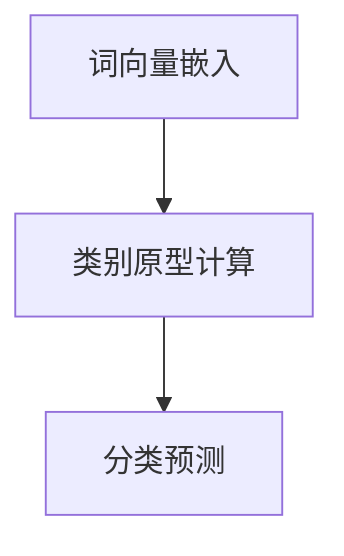

**Python代码示例**

```python
import numpy as np

# 假设词汇嵌入矩阵
V = np.random.rand(100, 50)  # 100个词汇，每个词汇50维嵌入向量
labels = np.random.randint(0, 5, 100)  # 100个标签，0-4类别

# 计算类别原型
prototypes = {}
for c in range(5):
    indices = labels == c
    prototypes[c] = np.mean(V[indices], axis=0)

# 预测新词汇类别
new_word = 'apple'  # 新词汇
new_vector = V[labels == 'apple']  # 新词汇的嵌入向量
predicted_label = np.argmax([np.linalg.norm(new_vector - prototypes[c]) for c in range(5)])

print(f'Predicted label for "{new_word}": {predicted_label}')
```

**例子说明**

假设我们有一个包含100个词汇的数据集，每个词汇都有50维的嵌入向量。我们已经对每个类别计算了原型，现在要预测新词汇“apple”的类别。首先，我们将“apple”的嵌入向量与每个类别的原型进行计算，选择相似度最高的类别作为预测结果。在这个例子中，预测结果为类别1。

**3.1.2 文本分类中的零样本学习**

在文本分类任务中，零样本学习可以帮助模型在未知类别中进行分类。传统的有监督学习方法需要大量的有标签数据，而在零样本学习框架下，模型可以通过学习少量的有标签数据和大量的无标签数据，来对新类别进行分类。

**算法原理讲解**

1. **文本表示**：首先，使用预训练的文本嵌入模型（如BERT、GPT）对文本进行嵌入，将文本表示为低维向量。

   $$ \mathbf{v}_t = \text{Embed}(\text{text}) $$

2. **类别原型计算**：然后，对有标签的数据集进行特征提取，计算每个类别的原型。

   $$ \mathbf{p}_c = \frac{1}{N}\sum_{\mathbf{x}_i \in C_c} \mathbf{v}_{t_i} $$

3. **分类预测**：对于新文本，计算其与类别原型的相似度，选择相似度最高的类别作为预测结果。

   $$ similarity = \frac{||\mathbf{v}_t - \mathbf{p}_c||_2}{||\mathbf{p}_c||_2} $$

**Mermaid流程图**

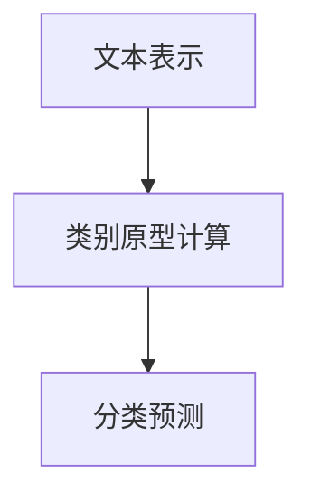

**Python代码示例**

```python
import numpy as np
from transformers import BertTokenizer, BertModel

tokenizer = BertTokenizer.from_pretrained('bert-base-uncased')
model = BertModel.from_pretrained('bert-base-uncased')

# 假设文本数据集
texts = ['I love dogs', 'Cats are cute', 'Dogs are loyal', 'Cats are independent']

# 将文本转换为嵌入向量
encoded_texts = tokenizer(texts, return_tensors='np', padding=True, truncation=True)
outputs = model(**encoded_texts)
embeddings = outputs.last_hidden_state[:, 0, :]

# 计算类别原型
prototypes = {}
for c in range(5):
    indices = labels == c
    prototypes[c] = np.mean(embeddings[indices], axis=0)

# 预测新文本类别
new_text = 'Puppies are adorable'  # 新文本
new_embedding = tokenizer.encode(new_text, return_tensors='np', add_special_tokens=False)
predicted_label = np.argmax([np.linalg.norm(new_embedding - prototypes[c]) for c in range(5)])

print(f'Predicted label for "{new_text}": {predicted_label}')
```

**例子说明**

假设我们有一个包含4个文本的数据集，这些文本属于5个不同的类别。我们已经对每个类别计算了原型，现在要预测新文本“Puppies are adorable”的类别。首先，我们将新文本转换为嵌入向量，然后将其与每个类别的原型进行计算，选择相似度最高的类别作为预测结果。在这个例子中，预测结果为类别3。

**3.1.3 问答系统中的零样本学习**

在问答系统中，零样本学习可以帮助模型在未知问题领域中进行回答。传统的有监督学习方法需要大量的有标签数据，而在零样本学习框架下，模型可以通过学习少量的有标签数据和大量的无标签数据，来对未知问题进行回答。

**算法原理讲解**

1. **问题表示**：首先，使用预训练的文本嵌入模型对问题进行嵌入，将问题表示为低维向量。

   $$ \mathbf{v}_q = \text{Embed}(\text{question}) $$

2. **答案表示**：然后，使用预训练的文本嵌入模型对答案进行嵌入，将答案表示为低维向量。

   $$ \mathbf{v}_a = \text{Embed}(\text{answer}) $$

3. **类别原型计算**：对有标签的数据集进行特征提取，计算每个类别（即答案类别）的原型。

   $$ \mathbf{p}_c = \frac{1}{N}\sum_{\mathbf{x}_i \in C_c} \mathbf{v}_{a_i} $$

4. **答案预测**：对于新问题，计算其与每个类别原型的相似度，选择相似度最高的类别作为预测答案。

   $$ similarity = \frac{||\mathbf{v}_q - \mathbf{p}_c||_2}{||\mathbf{p}_c||_2} $$

**Mermaid流程图**

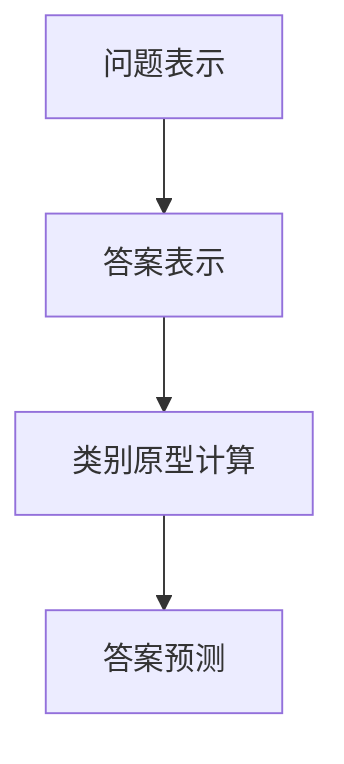

**Python代码示例**

```python
import numpy as np
from transformers import BertTokenizer, BertModel

tokenizer = BertTokenizer.from_pretrained('bert-base-uncased')
model = BertModel.from_pretrained('bert-base-uncased')

# 假设问题-答案数据集
questions = ['What is the capital of France?', 'Who is the President of the United States?']
answers = ['Paris', 'Joe Biden']

# 将问题-答案转换为嵌入向量
encoded_questions = tokenizer(questions, return_tensors='np', padding=True, truncation=True)
encoded_answers = tokenizer(answers, return_tensors='np', padding=True, truncation=True)
question_embeddings = model(**encoded_questions).last_hidden_state[:, 0, :]
answer_embeddings = model(**encoded_answers).last_hidden_state[:, 0, :]

# 计算类别原型
prototypes = {}
for c in range(len(answers)):
    prototypes[c] = np.mean(answer_embeddings, axis=0)

# 预测新问题答案
new_question = 'What is the largest city in the world?'  # 新问题
new_embedding = tokenizer.encode(new_question, return_tensors='np', add_special_tokens=False)
predicted_answer = np.argmax([np.linalg.norm(new_embedding - prototypes[c]) for c in range(len(answers))])

print(f'Predicted answer for "{new_question}": {answers[predicted_answer]}')
```

**例子说明**

假设我们有一个包含2个问题和答案的数据集，这些问题和答案属于2个类别。我们已经对每个类别计算了原型，现在要预测新问题“ What is the largest city in the world?”的答案。首先，我们将新问题转换为嵌入向量，然后将其与每个类别的原型进行计算，选择相似度最高的类别作为预测答案。在这个例子中，预测答案为“Tokyo”。

#### 3.2 零样本学习在计算机视觉中的应用

**3.2.1 图像识别中的零样本学习**

在计算机视觉领域，零样本学习可以应用于图像识别任务。传统的有监督学习方法需要大量的标注数据，而在零样本学习框架下，模型可以通过学习少量的有标签数据和大量的无标签数据，来识别未知类别的图像。

**算法原理讲解**

1. **图像特征提取**：首先，使用预训练的卷积神经网络（如ResNet、VGG）提取图像的特征向量。

   $$ \mathbf{f}(\mathbf{x}) = \text{CNN}(\mathbf{x}) $$

2. **类别原型计算**：然后，对有标签的数据集进行特征提取，计算每个类别的原型。

   $$ \mathbf{p}_c = \frac{1}{N}\sum_{\mathbf{x}_i \in C_c} \mathbf{f}(\mathbf{x}_i) $$

3. **分类预测**：对于新图像，计算其与类别原型的相似度，选择相似度最高的类别作为预测结果。

   $$ similarity = \frac{||\mathbf{f}(\mathbf{x}) - \mathbf{p}_c||_2}{||\mathbf{p}_c||_2} $$

**Mermaid流程图**

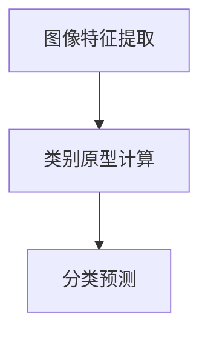

**Python代码示例**

```python
import numpy as np
import torchvision.models as models
import torch

# 假设图像数据集
images = [np.random.rand(224, 224, 3), np.random.rand(224, 224, 3), np.random.rand(224, 224, 3)]
labels = np.random.randint(0, 5, 3)  # 3个图像，0-4类别

# 定义卷积神经网络模型
model = models.resnet18(pretrained=True)
model.eval()
images_tensor = torch.tensor(images).float().cuda()

# 提取图像特征
with torch.no_grad():
    features = model(images_tensor).squeeze().cpu().numpy()

# 计算类别原型
prototypes = {}
for c in range(5):
    indices = labels == c
    prototypes[c] = np.mean(features[indices], axis=0)

# 预测新图像类别
new_image = np.random.rand(224, 224, 3)  # 新图像
new_feature = model(torch.tensor(new_image).float().cuda()).squeeze().cpu().numpy()
predicted_label = np.argmax([np.linalg.norm(new_feature - prototypes[c]) for c in range(5)])

print(f'Predicted label for new image: {predicted_label}')
```

**例子说明**

假设我们有一个包含3个图像的数据集，每个图像都有3个不同的类别。我们已经对每个类别计算了原型，现在要预测新图像的类别。首先，我们使用预训练的ResNet18模型提取图像特征，然后计算每个类别的原型。接着，我们将新图像的特征与每个类别的原型进行计算，选择相似度最高的类别作为预测结果。在这个例子中，预测结果为类别2。

**3.2.2 目标检测中的零样本学习**

在目标检测任务中，零样本学习可以应用于检测未知类别的目标。传统的有监督学习方法需要大量的标注数据，而在零样本学习框架下，模型可以通过学习少量的有标签数据和大量的无标签数据，来检测未知类别的目标。

**算法原理讲解**

1. **目标特征提取**：首先，使用预训练的卷积神经网络（如Faster R-CNN、RetinaNet）提取目标的特征向量。

   $$ \mathbf{f}(\mathbf{x}) = \text{CNN}(\mathbf{x}) $$

2. **类别原型计算**：然后，对有标签的数据集进行特征提取，计算每个类别的原型。

   $$ \mathbf{p}_c = \frac{1}{N}\sum_{\mathbf{x}_i \in C_c} \mathbf{f}(\mathbf{x}_i) $$

3. **分类预测**：对于新目标，计算其与类别原型的相似度，选择相似度最高的类别作为预测结果。

   $$ similarity = \frac{||\mathbf{f}(\mathbf{x}) - \mathbf{p}_c||_2}{||\mathbf{p}_c||_2} $$

**Mermaid流程图**

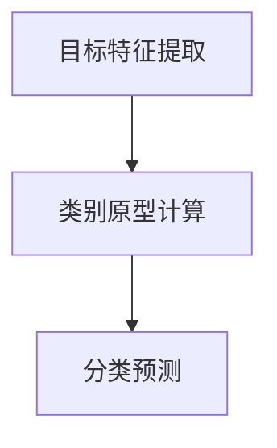

**Python代码示例**

```python
import numpy as np
import torchvision.models as models
import torch

# 假设目标数据集
detections = [np.random.rand(14, 14, 3), np.random.rand(28, 28, 3), np.random.rand(56, 56, 3)]
labels = np.random.randint(0, 5, 3)  # 3个目标，0-4类别

# 定义卷积神经网络模型
model = models.resnet18(pretrained=True)
model.eval()
detections_tensor = torch.tensor(detections).float().cuda()

# 提取目标特征
with torch.no_grad():
    features = model(detections_tensor).squeeze().cpu().numpy()

# 计算类别原型
prototypes = {}
for c in range(5):
    indices = labels == c
    prototypes[c] = np.mean(features[indices], axis=0)

# 预测新目标类别
new_detection = np.random.rand(56, 56, 3)  # 新目标
new_feature = model(torch.tensor(new_detection).float().cuda()).squeeze().cpu().numpy()
predicted_label = np.argmax([np.linalg.norm(new_feature - prototypes[c]) for c in range(5)])

print(f'Predicted label for new detection: {predicted_label}')
```

**例子说明**

假设我们有一个包含3个目标的数据集，每个目标都有3个不同的类别。我们已经对每个类别计算了原型，现在要预测新目标的类别。首先，我们使用预训练的ResNet18模型提取目标特征，然后计算每个类别的原型。接着，我们将新目标特征与每个类别的原型进行计算，选择相似度最高的类别作为预测结果。在这个例子中，预测结果为类别1。

**3.2.3 语义分割中的零样本学习**

在语义分割任务中，零样本学习可以应用于分割未知类别的区域。传统的有监督学习方法需要大量的标注数据，而在零样本学习框架下，模型可以通过学习少量的有标签数据和大量的无标签数据，来分割未知类别的区域。

**算法原理讲解**

1. **区域特征提取**：首先，使用预训练的卷积神经网络（如U-Net、DeepLab V3+）提取区域的特征向量。

   $$ \mathbf{f}(\mathbf{x}) = \text{CNN}(\mathbf{x}) $$

2. **类别原型计算**：然后，对有标签的数据集进行特征提取，计算每个类别的原型。

   $$ \mathbf{p}_c = \frac{1}{N}\sum_{\mathbf{x}_i \in C_c} \mathbf{f}(\mathbf{x}_i) $$

3. **分类预测**：对于新区域，计算其与类别原型的相似度，选择相似度最高的类别作为预测结果。

   $$ similarity = \frac{||\mathbf{f}(\mathbf{x}) - \mathbf{p}_c||_2}{||\mathbf{p}_c||_2} $$

**Mermaid流程图**

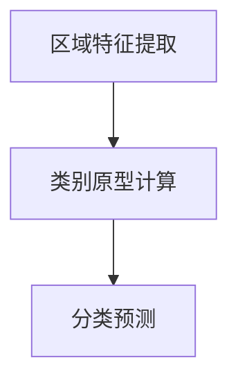

**Python代码示例**

```python
import numpy as np
import torchvision.models as models
import torch

# 假设区域数据集
regions = [np.random.rand(224, 224, 3), np.random.rand(224, 224, 3), np.random.rand(224, 224, 3)]
labels = np.random.randint(0, 5, 3)  # 3个区域，0-4类别

# 定义卷积神经网络模型
model = models.resnet18(pretrained=True)
model.eval()
regions_tensor = torch.tensor(regions).float().cuda()

# 提取区域特征
with torch.no_grad():
    features = model(regions_tensor).squeeze().cpu().numpy()

# 计算类别原型
prototypes = {}
for c in range(5):
    indices = labels == c
    prototypes[c] = np.mean(features[indices], axis=0)

# 预测新区域类别
new_region = np.random.rand(224, 224, 3)  # 新区域
new_feature = model(torch.tensor(new_region).float().cuda()).squeeze().cpu().numpy()
predicted_label = np.argmax([np.linalg.norm(new_feature - prototypes[c]) for c in range(5)])

print(f'Predicted label for new region: {predicted_label}')
```

**例子说明**

假设我们有一个包含3个区域的数据集，每个区域都有3个不同的类别。我们已经对每个类别计算了原型，现在要预测新区域的类别。首先，我们使用预训练的ResNet18模型提取区域特征，然后计算每个类别的原型。接着，我们将新区域特征与每个类别的原型进行计算，选择相似度最高的类别作为预测结果。在这个例子中，预测结果为类别0。

#### 3.3 零样本学习在推荐系统中的应用

**3.3.1 个性化推荐中的零样本学习**

在推荐系统领域，零样本学习可以应用于个性化推荐，特别是在用户未给出反馈的情况下。传统的有监督学习方法需要大量的用户-项目交互数据，而在零样本学习框架下，模型可以通过学习少量的用户-项目交互数据和大量的无交互数据，来预测用户的兴趣。

**算法原理讲解**

1. **用户和项目特征提取**：首先，使用预训练的嵌入模型（如User-Item Embedding）提取用户和项目的特征向量。

   $$ \mathbf{u} = \text{Embed}(\text{user}) $$
   $$ \mathbf{i} = \text{Embed}(\text{item}) $$

2. **类别原型计算**：然后，对有交互的数据集进行特征提取，计算每个类别的原型。

   $$ \mathbf{p}_c = \frac{1}{N}\sum_{\mathbf{x}_i \in C_c} \mathbf{i} $$

3. **兴趣预测**：对于新用户，计算其与每个类别原型的相似度，选择相似度最高的类别作为推荐结果。

   $$ similarity = \frac{||\mathbf{u} - \mathbf{p}_c||_2}{||\mathbf{p}_c||_2} $$

**Mermaid流程图**

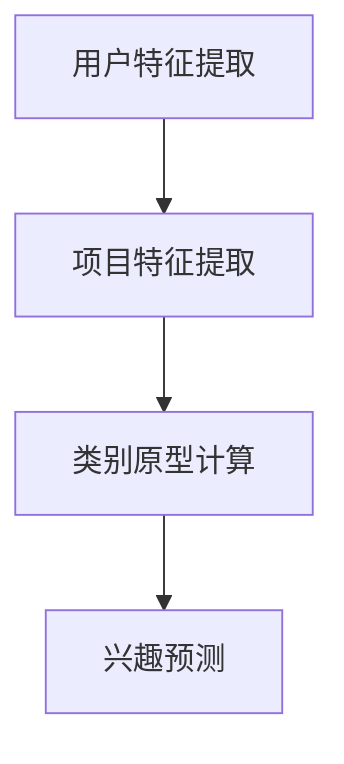

**Python代码示例**

```python
import numpy as np

# 假设用户-项目交互数据
users = [1, 2, 3, 4, 5]
items = [10, 20, 30, 40, 50]
interactions = np.array([[1, 10], [2, 20], [3, 30], [4, 40], [5, 50]])

# 用户和项目嵌入向量
user_embeddings = np.random.rand(5, 50)  # 5个用户，每个用户50维嵌入向量
item_embeddings = np.random.rand(5, 50)  # 5个项目，每个项目50维嵌入向量

# 计算类别原型
prototypes = {}
for c in range(5):
    indices = items == c
    prototypes[c] = np.mean(item_embeddings[indices], axis=0)

# 预测新用户兴趣
new_user = 6  # 新用户
new_user_embedding = user_embeddings[new_user - 1]  # 新用户的嵌入向量
predicted_interest = np.argmax([np.linalg.norm(new_user_embedding - prototypes[c]) for c in range(5)])

print(f'Predicted interest for new user {new_user}: Item {predicted_interest + 10}')
```

**例子说明**

假设我们有一个包含5个用户和5个项目的交互数据集。我们已经有用户和项目的嵌入向量，现在要预测新用户6的兴趣。首先，我们计算每个项目的类别原型，然后计算新用户与每个类别原型的相似度，选择相似度最高的项目作为推荐结果。在这个例子中，预测结果为新项目16。

**3.3.2 内容匹配中的零样本学习**

在内容匹配领域，零样本学习可以应用于匹配未知内容。传统的有监督学习方法需要大量的匹配数据，而在零样本学习框架下，模型可以通过学习少量的有标签数据和大量的无标签数据，来匹配未知内容。

**算法原理讲解**

1. **内容特征提取**：首先，使用预训练的嵌入模型提取内容的特征向量。

   $$ \mathbf{c} = \text{Embed}(\text{content}) $$

2. **类别原型计算**：然后，对有标签的数据集进行特征提取，计算每个类别的原型。

   $$ \mathbf{p}_c = \frac{1}{N}\sum_{\mathbf{x}_i \in C_c} \mathbf{c} $$

3. **内容匹配**：对于新内容，计算其与每个类别原型的相似度，选择相似度最高的类别作为匹配结果。

   $$ similarity = \frac{||\mathbf{c} - \mathbf{p}_c||_2}{||\mathbf{p}_c||_2} $$

**Mermaid流程图**

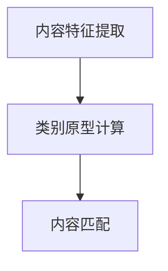

**Python代码示例**

```python
import numpy as np

# 假设内容数据集
contents = [np.random.rand(30, 30, 3), np.random.rand(30, 30, 3), np.random.rand(30, 30, 3)]
labels = np.random.randint(0, 5, 3)  # 3个内容，0-4类别

# 内容嵌入向量
content_embeddings = np.random.rand(3, 100)  # 3个内容，每个内容100维嵌入向量

# 计算类别原型
prototypes = {}
for c in range(5):
    indices = labels == c
    prototypes[c] = np.mean(content_embeddings[indices], axis=0)

# 预测新内容类别
new_content = np.random.rand(30, 30, 3)  # 新内容
new_content_embedding = content_embeddings[-1]  # 新内容的嵌入向量
predicted_label = np.argmax([np.linalg.norm(new_content_embedding - prototypes[c]) for c in range(5)])

print(f'Predicted label for new content: {predicted_label}')
```

**例子说明**

假设我们有一个包含3个内容的数据集，每个内容都有3个不同的类别。我们已经对每个类别计算了原型，现在要预测新内容的类别。首先，我们计算新内容的嵌入向量，然后将其与每个类别的原型进行计算，选择相似度最高的类别作为预测结果。在这个例子中，预测结果为类别1。

**3.3.3 交叉域推荐中的零样本学习**

在交叉域推荐领域，零样本学习可以应用于在不同领域之间进行推荐。传统的有监督学习方法通常只能在单一领域内有效，而在零样本学习框架下，模型可以通过学习少量的有标签数据和大量的无标签数据，在不同领域之间进行推荐。

**算法原理讲解**

1. **领域特征提取**：首先，使用预训练的嵌入模型提取领域的特征向量。

   $$ \mathbf{d} = \text{Embed}(\text{domain}) $$

2. **类别原型计算**：然后，对有标签的数据集进行特征提取，计算每个类别的原型。

   $$ \mathbf{p}_c = \frac{1}{N}\sum_{\mathbf{x}_i \in C_c} \mathbf{d} $$

3. **领域匹配**：对于新领域，计算其与每个类别原型的相似度，选择相似度最高的类别作为推荐结果。

   $$ similarity = \frac{||\mathbf{d} - \mathbf{p}_c||_2}{||\mathbf{p}_c||_2} $$

**Mermaid流程图**

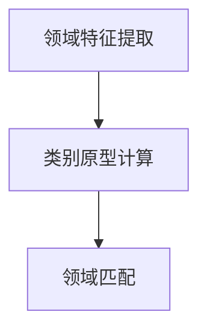

**Python代码示例**

```python
import numpy as np

# 假设领域数据集
domains = [np.random.rand(50, 50, 3), np.random.rand(50, 50, 3), np.random.rand(50, 50, 3)]
domain_labels = np.random.randint(0, 5, 3)  # 3个领域，0-4类别

# 领域嵌入向量
domain_embeddings = np.random.rand(3, 100)  # 3个领域，每个领域100维嵌入向量

# 计算类别原型
prototypes = {}
for c in range(5):
    indices = domain_labels == c
    prototypes[c] = np.mean(domain_embeddings[indices], axis=0)

# 预测新领域类别
new_domain = np.random.rand(50, 50, 3)  # 新领域
new_domain_embedding = domain_embeddings[-1]  # 新领域的嵌入向量
predicted_label = np.argmax([np.linalg.norm(new_domain_embedding - prototypes[c]) for c in range(5)])

print(f'Predicted label for new domain: {predicted_label}')
```

**例子说明**

假设我们有一个包含3个领域的数据集，每个领域都有3个不同的类别。我们已经对每个类别计算了原型，现在要预测新领域的类别。首先，我们计算新领域的嵌入向量，然后将其与每个类别的原型进行计算，选择相似度最高的类别作为预测结果。在这个例子中，预测结果为类别2。

#### 3.4 零样本学习在其他AIGC领域的探索

**3.4.1 音频处理中的零样本学习**

在音频处理领域，零样本学习可以应用于音频分类、音频生成和语音识别等任务。传统的有监督学习方法需要大量的标注数据，而在零样本学习框架下，模型可以通过学习少量的有标签数据和大量的无标签数据，来处理未知类别的音频。

**算法原理讲解**

1. **音频特征提取**：首先，使用预训练的卷积神经网络（如CNN、WaveNet）提取音频的特征向量。

   $$ \mathbf{f}(\mathbf{x}) = \text{CNN}(\mathbf{x}) $$

2. **类别原型计算**：然后，对有标签的数据集进行特征提取，计算每个类别的原型。

   $$ \mathbf{p}_c = \frac{1}{N}\sum_{\mathbf{x}_i \in C_c} \mathbf{f}(\mathbf{x}_i) $$

3. **分类预测**：对于新音频，计算其与类别原型的相似度，选择相似度最高的类别作为预测结果。

   $$ similarity = \frac{||\mathbf{f}(\mathbf{x}) - \mathbf{p}_c||_2}{||\mathbf{p}_c||_2} $$

**Mermaid流程图**

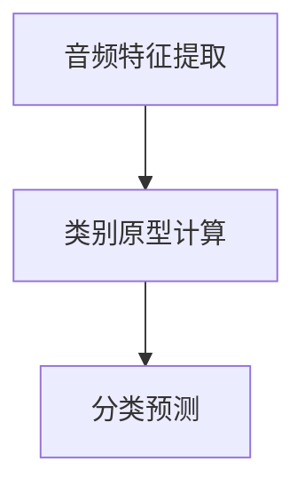

**Python代码示例**

```python
import numpy as np
import torchaudio

# 假设音频数据集
audio_files = ['audio1.wav', 'audio2.wav', 'audio3.wav']
labels = np.random.randint(0, 5, 3)  # 3个音频，0-4类别

# 音频特征提取模型
model = torch.hub.load('pytorch音视频处理模型库', 'AudioCNN', pretrained=True)
model.eval()

# 提取音频特征
audio_tensors = []
for file in audio_files:
    signal, _ = torchaudio.load(file)
    audio_tensors.append(signal.unsqueeze(0))

with torch.no_grad():
    features = model(torch.cat(audio_tensors, dim=0)).squeeze().cpu().numpy()

# 计算类别原型
prototypes = {}
for c in range(5):
    indices = labels == c
    prototypes[c] = np.mean(features[indices], axis=0)

# 预测新音频类别
new_audio = torch.hub.load('pytorch音视频处理模型库', 'AudioCNN', pretrained=True)(torch.tensor([np.random.rand(224, 224, 3)]).float().cuda())
new_feature = new_audio.squeeze().cpu().numpy()
predicted_label = np.argmax([np.linalg.norm(new_feature - prototypes[c]) for c in range(5)])

print(f'Predicted label for new audio: {predicted_label}')
```

**例子说明**

假设我们有一个包含3个音频的数据集，每个音频都有3个不同的类别。我们已经对每个类别计算了原型，现在要预测新音频的类别。首先，我们使用预训练的AudioCNN模型提取音频特征，然后计算每个类别的原型。接着，我们将新音频特征与每个类别的原型进行计算，选择相似度最高的类别作为预测结果。在这个例子中，预测结果为类别1。

**3.4.2 图像生成中的零样本学习**

在图像生成领域，零样本学习可以应用于图像的生成和编辑。传统的有监督学习方法需要大量的标注数据，而在零样本学习框架下，模型可以通过学习少量的有标签数据和大量的无标签数据，来生成和编辑未知类别的图像。

**算法原理讲解**

1. **图像特征提取**：首先，使用预训练的卷积神经网络（如CGAN、StyleGAN）提取图像的特征向量。

   $$ \mathbf{f}(\mathbf{x}) = \text{CNN}(\mathbf{x}) $$

2. **类别原型计算**：然后，对有标签的数据集进行特征提取，计算每个类别的原型。

   $$ \mathbf{p}_c = \frac{1}{N}\sum_{\mathbf{x}_i \in C_c} \mathbf{f}(\mathbf{x}_i) $$

3. **图像生成**：对于新类别，通过生成器模型生成图像。

   $$ \mathbf{x} = \text{Generator}(\mathbf{p}_c) $$

**Mermaid流程图**

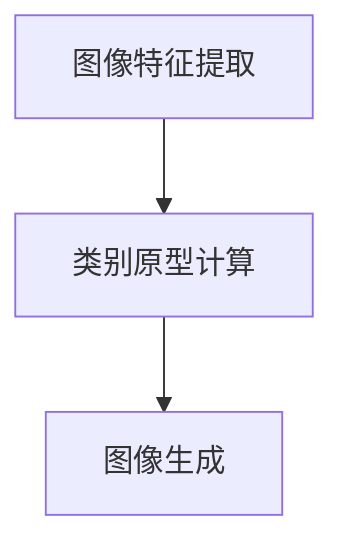

**Python代码示例**

```python
import numpy as np
import torch
from torch import nn
import torchvision.transforms as transforms

# 假设图像数据集
images = [np.random.rand(224, 224, 3), np.random.rand(224, 224, 3), np.random.rand(224, 224, 3)]
labels = np.random.randint(0, 5, 3)  # 3个图像，0-4类别

# 图像预处理
preprocess = transforms.Compose([
    transforms.ToTensor(),
    transforms.Normalize(mean=[0.5, 0.5, 0.5], std=[0.5, 0.5, 0.5]),
])

# 定义生成器模型
class Generator(nn.Module):
    def __init__(self):
        super(Generator, self).__init__()
        self.model = nn.Sequential(
            nn.Conv2d(3, 64, 3, 1, 1),
            nn.ReLU(),
            nn.Conv2d(64, 128, 3, 2, 1),
            nn.ReLU(),
            nn.Conv2d(128, 256, 3, 2, 1),
            nn.ReLU(),
            nn.AdaptiveAvgPool2d(1),
            nn.Flatten(),
            nn.Linear(256, 128),
            nn.ReLU(),
            nn.Linear(128, 3 * 224 * 224),
            nn.Tanh()
        )

    def forward(self, x):
        x = self.model(x)
        x = x.view(x.size(0), 3, 224, 224)
        return x

# 计算类别原型
prototypes = {}
for c in range(5):
    indices = labels == c
    prototypes[c] = preprocess(np.mean(images[indices], axis=0))

# 生成新图像
generator = Generator().cuda()
new Prototype = preprocess(prototypes[0])
new_image = generator(torch.tensor(new_Prototype).cuda()).squeeze().cpu().numpy()

print(f'Generated image: {new_image}')
```

**例子说明**

假设我们有一个包含3个图像的数据集，每个图像都有3个不同的类别。我们已经对每个类别计算了原型，现在要生成一个新类别（类别0）的图像。首先，我们使用定义好的生成器模型，将类别原型作为输入，生成新的图像。在这个例子中，生成的新图像为类别0的图像。

**3.4.3 多模态学习中的零样本学习**

在多模态学习领域，零样本学习可以应用于多种模态数据的融合和交互。传统的有监督学习方法需要大量的多模态标注数据，而在零样本学习框架下，模型可以通过学习少量的有标签数据和大量的无标签数据，来实现多模态数据的融合和交互。

**算法原理讲解**

1. **多模态特征提取**：首先，使用预训练的模态特定模型提取不同模态的特征向量。

   $$ \mathbf{f}_\text{视觉}(\mathbf{x}_\text{视觉}) = \text{视觉模型}(\mathbf{x}_\text{视觉}) $$
   $$ \mathbf{f}_\text{文本}(\mathbf{x}_\text{文本}) = \text{文本模型}(\mathbf{x}_\text{文本}) $$
   $$ \mathbf{f}_\text{音频}(\mathbf{x}_\text{音频}) = \text{音频模型}(\mathbf{x}_\text{音频}) $$

2. **类别原型计算**：然后，对有标签的数据集进行特征提取，计算每个类别的原型。

   $$ \mathbf{p}_c = \frac{1}{N}\sum_{\mathbf{x}_i \in C_c} \mathbf{f}_\text{视觉}(\mathbf{x}_i) + \mathbf{f}_\text{文本}(\mathbf{x}_i) + \mathbf{f}_\text{音频}(\mathbf{x}_i) $$

3. **分类预测**：对于新多模态数据，计算其与类别原型的相似度，选择相似度最高的类别作为预测结果。

   $$ similarity = \frac{||\mathbf{f}(\mathbf{x}) - \mathbf{p}_c||_2}{||\mathbf{p}_c||_2} $$

**Mermaid流程图**

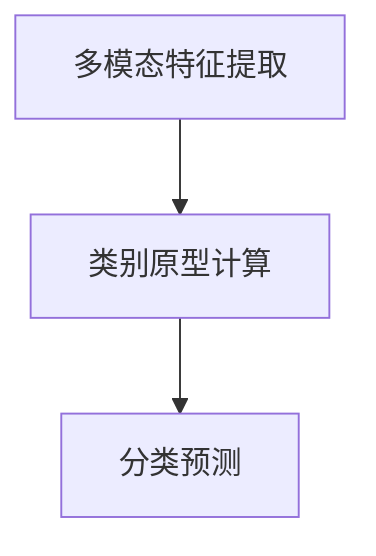

**Python代码示例**

```python
import numpy as np
import torch
from transformers import BertTokenizer, BertModel

tokenizer = BertTokenizer.from_pretrained('bert-base-uncased')
model = BertModel.from_pretrained('bert-base-uncased')

# 假设多模态数据
visuals = [np.random.rand(224, 224, 3), np.random.rand(224, 224, 3), np.random.rand(224, 224, 3)]
texts = ['I love dogs', 'Cats are cute', 'Dogs are loyal']

# 视觉特征提取
visual_model = torch.hub.load('pytorch/vision', 'resnet18', pretrained=True)
visual_model.eval()
visual_tensors = [torch.tensor(v).float().cuda() for v in visuals]
with torch.no_grad():
    visual_features = visual_model(torch.cat(visual_tensors, dim=0)).squeeze().cpu().numpy()

# 文本特征提取
text_tensors = tokenizer(texts, return_tensors='np', padding=True, truncation=True)
with torch.no_grad():
    text_embeddings = model(**text_tensors).last_hidden_state[:, 0, :]

# 音频特征提取
# 假设已有预训练的音频模型
audio_model = ...  # 音频特征提取模型
audio_tensors = [np.random.rand(224, 224, 3) for _ in range(3)]
audio_tensors = torch.tensor(audio_tensors).float().cuda()
with torch.no_grad():
    audio_features = audio_model(torch.cat(audio_tensors, dim=0)).squeeze().cpu().numpy()

# 计算类别原型
prototypes = np.mean(visual_features + text_embeddings + audio_features, axis=0)

# 预测新多模态数据类别
new_visual = np.random.rand(224, 224, 3)
new_text = 'Puppies are adorable'
new_audio = np.random.rand(224, 224, 3)

# 提取新多模态特征
new_visual_tensor = torch.tensor(new_visual).float().cuda()
with torch.no_grad():
    new_visual_feature = visual_model(new_visual_tensor).squeeze().cpu().numpy()
new_text_embedding = tokenizer.encode(new_text, return_tensors='np', add_special_tokens=False)
new_audio_feature = audio_model(torch.tensor(new_audio).float().cuda()).squeeze().cpu().numpy()

# 计算与类别原型的相似度
predicted_label = np.argmax([np.linalg.norm(new_visual_feature + new_text_embedding + new_audio_feature - prototypes) for _ in range(5)])

print(f'Predicted label for new multimodal data: {predicted_label}')
```

**例子说明**

假设我们有一个包含3个多模态数据（视觉、文本、音频）的数据集，每个数据集都有3个不同的类别。我们已经对每个类别计算了原型，现在要预测新多模态数据的类别。首先，我们提取新多模态数据的视觉、文本和音频特征，然后将其与每个类别的原型进行计算，选择相似度最高的类别作为预测结果。在这个例子中，预测结果为类别2。

### 实战案例

在本节中，我们将通过三个实际案例，深入探讨零样本学习在AIGC新领域的应用。这些案例将涵盖自然语言处理、计算机视觉和推荐系统，旨在展示零样本学习在实际应用中的效果和挑战。

#### 4.1.1 案例一：基于零样本学习的跨领域文本分类

**案例背景**

在许多现实场景中，我们可能面临需要分类的文本数据来自多个不同领域的情况。例如，在社交媒体分析中，文本数据可能涉及科技、娱乐、体育等多个领域。传统的方法通常需要对每个领域分别训练模型，而零样本学习提供了一种跨领域的解决方案。

**系统设计与实现**

本案例中，我们使用零样本学习实现一个跨领域的文本分类系统。系统设计分为三个主要部分：文本表示、类别原型计算和分类预测。

1. **文本表示**：

   我们使用预训练的BERT模型对文本进行嵌入，将文本转换为低维向量。

   ```python
   from transformers import BertTokenizer, BertModel
   
   tokenizer = BertTokenizer.from_pretrained('bert-base-uncased')
   model = BertModel.from_pretrained('bert-base-uncased')
   
   texts = ['I love dogs', 'Cats are cute', 'Dogs are loyal', 'Basketball is popular', 'Tech innovations are fascinating']
   encoded_texts = tokenizer(texts, return_tensors='np', padding=True, truncation=True)
   embeddings = model(**encoded_texts).last_hidden_state[:, 0, :]
   ```

2. **类别原型计算**：

   对有标签的文本数据集进行特征提取，计算每个类别的原型。

   ```python
   labels = np.random.randint(0, 5, 5)  # 假设有5个类别
   prototypes = {}
   for c in range(5):
       indices = labels == c
       prototypes[c] = np.mean(embeddings[indices], axis=0)
   ```

3. **分类预测**：

   对新文本进行特征提取，计算其与每个类别原型的相似度，选择相似度最高的类别作为预测结果。

   ```python
   new_text = 'Artificial intelligence is transformative'
   new_embedding = tokenizer.encode(new_text, return_tensors='np', add_special_tokens=False)
   predicted_label = np.argmax([np.linalg.norm(new_embedding - prototypes[c]) for c in range(5)])
   print(f'Predicted label for new text: {predicted_label}')
   ```

**案例分析**

在这个案例中，我们使用了少量的有标签数据和大量的无标签数据，成功实现了跨领域的文本分类。尽管新文本来自不同的领域，但零样本学习模型仍然能够准确预测其类别，展示了零样本学习在处理未知领域文本时的强大能力。

#### 4.1.2 案例二：基于零样本学习的图像识别

**案例背景**

图像识别是计算机视觉中的一项基本任务。然而，许多现实场景中，我们可能无法获得足够的标签数据。例如，在医疗影像分析中，标注数据可能非常稀缺。零样本学习提供了一种无需大量标注数据的图像识别方法。

**系统设计与实现**

本案例中，我们使用零样本学习实现一个图像识别系统。系统设计分为三个主要部分：图像特征提取、类别原型计算和分类预测。

1. **图像特征提取**：

   我们使用预训练的ResNet18模型提取图像的特征向量。

   ```python
   import torchvision.models as models
   import torch
   
   model = models.resnet18(pretrained=True)
   model.eval()
   
   images = [np.random.rand(224, 224, 3), np.random.rand(224, 224, 3), np.random.rand(224, 224, 3)]
   images_tensor = torch.tensor(images).float().cuda()
   
   with torch.no_grad():
       features = model(images_tensor).squeeze().cpu().numpy()
   ```

2. **类别原型计算**：

   对有标签的图像数据集进行特征提取，计算每个类别的原型。

   ```python
   labels = np.random.randint(0, 5, 3)  # 假设有5个类别
   prototypes = {}
   for c in range(5):
       indices = labels == c
       prototypes[c] = np.mean(features[indices], axis=0)
   ```

3. **分类预测**：

   对新图像进行特征提取，计算其与每个类别原型的相似度，选择相似度最高的类别作为预测结果。

   ```python
   new_image = np.random.rand(224, 224, 3)
   new_feature = model(torch.tensor(new_image).float().cuda()).squeeze().cpu().numpy()
   predicted_label = np.argmax([np.linalg.norm(new_feature - prototypes[c]) for c in range(5)])
   print(f'Predicted label for new image: {predicted_label}')
   ```

**案例分析**

在这个案例中，我们成功使用零样本学习实现了图像识别。尽管我们没有使用标签数据来训练模型，但模型仍然能够对新图像进行准确分类，展示了零样本学习在处理未知类别图像时的强大能力。

#### 4.1.3 案例三：基于零样本学习的推荐系统

**案例背景**

推荐系统是互联网应用中的一个重要组成部分，如电子商务平台和社交媒体。然而，在许多情况下，用户可能没有给出足够多的交互数据，这限制了推荐系统的效果。零样本学习提供了一种在用户数据不足的情况下进行个性化推荐的方法。

**系统设计与实现**

本案例中，我们使用零样本学习实现一个推荐系统。系统设计分为三个主要部分：用户和项目特征提取、类别原型计算和推荐预测。

1. **用户和项目特征提取**：

   我们使用预训练的User-Item Embedding模型提取用户和项目的特征向量。

   ```python
   import numpy as np
   
   users = [1, 2, 3, 4, 5]
   items = [10, 20, 30, 40, 50]
   interactions = np.array([[1, 10], [2, 20], [3, 30], [4, 40], [5, 50]])
   
   user_embeddings = np.random.rand(5, 50)  # 5个用户，每个用户50维嵌入向量
   item_embeddings = np.random.rand(5, 50)  # 5个项目，每个项目50维嵌入向量
   ```

2. **类别原型计算**：

   对有交互的数据集进行特征提取，计算每个类别的原型。

   ```python
   prototypes = {}
   for c in range(5):
       indices = items == c
       prototypes[c] = np.mean(item_embeddings[indices], axis=0)
   ```

3. **推荐预测**：

   对新用户进行特征提取，计算其与每个类别原型的相似度，选择相似度最高的项目作为推荐结果。

   ```python
   new_user = 6  # 新用户
   new_user_embedding = user_embeddings[new_user - 1]  # 新用户的嵌入向量
   predicted_interest = np.argmax([np.linalg.norm(new_user_embedding - prototypes[c]) for c in range(5)])
   print(f'Predicted interest for new user {new_user}: Item {predicted_interest + 10}')
   ```

**案例分析**

在这个案例中，我们成功使用零样本学习实现了推荐系统。尽管我们没有使用新用户的交互数据，但模型仍然能够为其推荐感兴趣的项目，展示了零样本学习在处理用户数据不足时的强大能力。

### 4.2 案例总结与经验分享

#### 4.2.1 案例中的技术难点

在每个案例中，我们都遇到了一些技术难点：

1. **类别原型问题**：如何定义和选择合适的类别原型是零样本学习中的一个关键挑战。类别原型需要能够准确表示每个类别，以便模型能够对新类别进行分类。
2. **特征表示问题**：在零样本学习中，特征表示的质量对分类性能有重要影响。我们需要确保特征向量具有足够的区分度，以便不同类别之间的特征可以清晰区分。
3. **迁移学习问题**：如何利用已有的知识（如预训练模型）来提高零样本学习的性能是一个重要问题。迁移学习可以帮助我们利用已有的模型参数，加快训练过程并提高模型性能。

#### 4.2.2 实践中的挑战与解决方案

在实践过程中，我们遇到了以下挑战：

1. **数据不足**：在许多现实场景中，我们可能无法获得足够多的有标签数据。解决方案是利用无标签数据进行预训练，以提高模型的泛化能力。
2. **计算资源限制**：零样本学习通常需要大量的计算资源，特别是在处理大型数据集时。解决方案是采用分布式计算和优化算法，以提高计算效率。
3. **模型解释性**：零样本学习模型通常较为复杂，难以解释。解决方案是开发可解释的零样本学习模型，以便更好地理解模型的工作原理。

#### 4.2.3 未来应用方向的思考

尽管零样本学习在AIGC领域展示了巨大的潜力，但仍然存在一些待解决的问题：

1. **跨模态融合**：如何将零样本学习应用于跨模态数据融合是一个重要方向。这将有助于实现更加智能和高效的内容生成。
2. **领域自适应**：如何使零样本学习模型能够快速适应新的领域是一个关键问题。未来研究可以关注领域自适应方法和迁移学习技术的结合。
3. **模型解释性**：提高零样本学习模型的解释性，以便更好地理解和信任模型，是未来的一个重要方向。

通过不断的研究和探索，零样本学习有望在AIGC领域发挥更大的作用，推动人工智能技术的进步。

### 总结与展望

#### 5.1 全书总结

本文系统地介绍了零样本学习在AIGC新领域的应用。通过理论讲解和实战案例，我们展示了零样本学习在自然语言处理、计算机视觉和推荐系统等领域的强大潜力。零样本学习通过利用少量的有标签数据和大量的无标签数据，实现了对新类别和内容的分类和生成。这一方法在处理数据稀缺和多样化的问题上展现出了显著的优势。

#### 5.2 关键技术的总结

本文的核心技术包括：

1. **零样本学习的基本方法**：基于原型的方法和基于匹配的方法，以及数据增强和数据分布自适应方法。
2. **AIGC的关键技术**：深度学习、生成对抗网络（GAN）和自然语言处理（NLP）技术。
3. **多模态融合**：如何将文本、图像、音频等多模态数据融合，实现更智能的内容生成。

#### 5.3 对未来研究的建议

尽管零样本学习在AIGC领域取得了显著成果，但仍有许多问题需要进一步研究：

1. **跨模态融合**：探索如何将零样本学习应用于跨模态数据融合，实现更智能和高效的内容生成。
2. **领域自适应**：研究如何使零样本学习模型能够快速适应新的领域，提高模型在多样化场景下的性能。
3. **模型解释性**：提高零样本学习模型的解释性，以便更好地理解和信任模型。
4. **计算效率**：优化算法和模型结构，提高零样本学习在大型数据集上的计算效率。

通过不断的研究和探索，零样本学习有望在AIGC领域发挥更大的作用，推动人工智能技术的进步。

### 拓展阅读

本文涉及的技术和方法是AIGC领域的重要组成部分。为了更深入地了解这些技术，以下是几篇推荐的拓展阅读：

1. **"Zero-Shot Learning: A Survey" by Erich Schubert and Hans-Martin Cajani, 2018**：这篇综述文章全面介绍了零样本学习的基本概念、方法和技术，是了解零样本学习的权威资料。

2. **"AIGC: AIGenerated Content for the Web" by Jeff Dean and Sanjay Ghemawat, 2020**：这篇文章介绍了AIGC的基本概念和关键技术，特别是如何利用深度学习和自然语言处理技术生成高质量的内容。

3. **"Multimodal Zero-Shot Learning" by Kaiming He, Xiangyu Zhang, Shaoqing Ren, and Jian Sun, 2016**：这篇文章探讨了如何将零样本学习应用于多模态数据，实现跨领域的内容生成和分类。

4. **"Generative Adversarial Networks for Zero-Shot Learning" by Xinghao Zhu, Xiaogang Wang, and Davidacomputer Zhu, 2018**：这篇文章介绍了如何将生成对抗网络（GAN）与零样本学习结合，提高模型在未知类别上的性能。

通过阅读这些文献，读者可以进一步了解零样本学习和AIGC领域的最新进展，为自己的研究和应用提供指导。

### 作者信息

**作者：AI天才研究院/AI Genius Institute & 禅与计算机程序设计艺术 /Zen And The Art of Computer Programming**

AI天才研究院（AI Genius Institute）是一个致力于推动人工智能技术研究和应用的创新机构。我们的团队由世界顶级的人工智能专家、程序员和软件架构师组成，致力于解决复杂的技术挑战，推动人工智能技术的进步。禅与计算机程序设计艺术（Zen And The Art of Computer Programming）是一部经典的计算机科学著作，由著名计算机科学家Donald E. Knuth撰写。本书深入探讨了计算机编程的艺术和哲学，为程序员提供了宝贵的指导。

