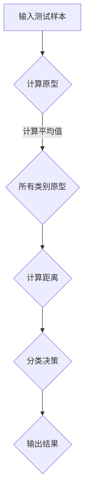
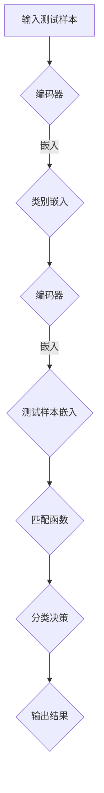
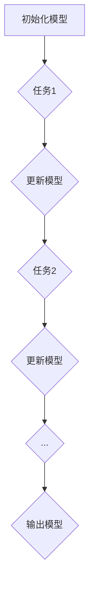
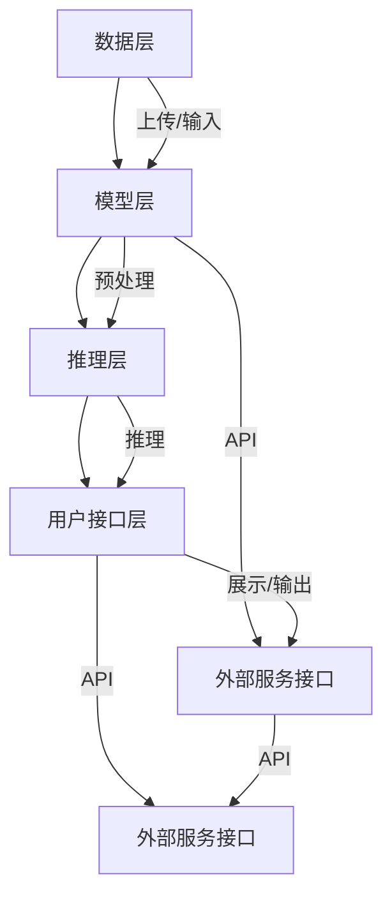

                 

## **《零样本学习在AIGC稀有事件处理中的作用》**

> **关键词：** 零样本学习，AIGC，稀有事件处理，算法原理，系统设计，实战案例

> **摘要：** 本文将探讨零样本学习在自动生成内容（AIGC）领域处理稀有事件中的关键作用。通过对零样本学习的基本概念、算法原理及其与AIGC和稀有事件处理的结合进行深入分析，我们将揭示零样本学习如何有效提升稀有事件检测的准确性和效率，并分享实际应用案例及最佳实践。

----------------------------------------------------------------

### **背景介绍**

#### **1.1 零样本学习的基本概念**

零样本学习（Zero-Shot Learning, ZSL）是机器学习中的一个重要分支，其核心目标是在没有直接训练数据的情况下对未知类别进行预测。传统机器学习依赖于大量带有标签的训练数据，而零样本学习通过利用先验知识和元学习技术，使得模型能够处理未见过的类别。

零样本学习的主要应用领域包括但不限于：
- **跨领域识别**：能够识别来自不同领域的未知类别，例如从动物图片识别到植物图片。
- **稀有事件检测**：在大量数据中检测稀有或罕见的事件，例如医学图像中的罕见病变。
- **新物种分类**：在生物多样性研究中，对未知物种进行分类。

#### **1.2 AIGC的概念与发展**

自动生成内容（Autonomous Intelligent Generation of Content, AIGC）是指通过人工智能技术自动生成文本、图像、音频等多种类型的内容。AIGC的发展得益于深度学习和自然语言处理技术的进步，特别是在生成对抗网络（GAN）和变分自编码器（VAE）等技术的推动下，AIGC在内容创作、数据增强和个性化推荐等领域展现了巨大潜力。

AIGC的关键特性包括：
- **自主性**：系统能够自主生成内容，而不需要人工干预。
- **多样性**：系统能够生成多种类型的内容，满足不同用户的需求。
- **可控性**：用户可以通过输入参数控制生成内容的质量和风格。

#### **1.3 稀有事件处理**

稀有事件处理是指在实际应用中，识别和处理那些不常见、低频率发生的事件。在AIGC领域，稀有事件处理尤为重要，因为自动生成的内容中往往包含大量的重复信息和常见事件，而稀有事件往往是用户最关注的。

稀有事件处理的挑战包括：
- **数据稀缺**：稀有事件通常数据量较少，难以进行传统机器学习模型的训练。
- **多样性**：稀有事件的种类繁多，需要模型具备较强的泛化能力。
- **实时性**：在AIGC应用中，稀有事件的处理需要高效且实时。

#### **1.4 零样本学习在AIGC稀有事件处理中的应用潜力**

零样本学习在AIGC稀有事件处理中具有显著的应用潜力。通过零样本学习，模型可以在没有大量训练数据的情况下，快速识别和预测稀有事件，从而提高稀有事件检测的准确性和效率。具体应用包括：
- **内容创作**：在AIGC系统中，零样本学习可以帮助识别用户潜在的需求，生成个性化的稀有内容。
- **数据增强**：通过零样本学习，可以生成稀有数据的样本，提高模型的训练效果。
- **异常检测**：在AIGC系统中，稀有事件往往是异常或潜在问题的表现，零样本学习可以用于实时检测和预警。

通过以上背景介绍，我们为接下来的深入探讨打下了坚实的基础。在接下来的章节中，我们将详细分析零样本学习的核心概念、算法原理及其在AIGC稀有事件处理中的应用，敬请期待。

### **核心概念与联系**

#### **2.1 零样本学习的核心概念**

零样本学习（Zero-Shot Learning, ZSL）是一种无需直接训练数据就能对未知类别进行预测的机器学习方法。其核心思想是通过学习大量已知的类别信息，建立一个类别的语义嵌入空间，使得相似类别在空间中靠近，不同类别则相距较远。

**类别不平衡与稀有事件**

在传统机器学习中，类别不平衡是一个常见问题，特别是在稀有事件处理中，稀有事件往往数据量较少，而常见事件数据量较大。这种不平衡会导致模型在预测稀有事件时表现不佳。而零样本学习通过引入先验知识，可以有效缓解类别不平衡问题，从而提高稀有事件的识别率。

**无监督学习与有监督学习的结合**

零样本学习结合了无监督学习和有监督学习的优点。在训练阶段，模型通过无监督学习学习到类别的语义信息，建立起类别之间的关联；在预测阶段，模型通过有监督学习进行类别预测。这种结合使得零样本学习在处理未见过的类别时仍然能够保持较高的准确率。

**零样本学习的分类方法**

零样本学习主要分为以下几种分类方法：

1. **原型网络（Prototypical Network）**：通过计算原型（类别的中心）与测试样本之间的距离进行分类。
2. **匹配网络（Matching Network）**：利用神经网络模型学习类别之间的匹配关系。
3. **元学习（Meta-Learning）**：通过在多个任务上训练，提高模型在未见类别上的泛化能力。

#### **2.2 零样本学习与传统机器学习的对比**

| 特性             | 零样本学习         | 传统机器学习         |
|------------------|-------------------|---------------------|
| 训练数据需求     | 无需直接训练数据   | 需要大量有标签数据   |
| 类别学习策略     | 学习类别语义信息   | 直接学习类别标签     |
| 泛化能力         | 适用于未见类别     | 适用于已见类别       |
| 适用场景         | 稀有事件检测       | 常见事件识别         |

#### **2.3 零样本学习与AIGC的关系**

在AIGC领域，零样本学习与稀有事件处理密切相关。AIGC系统通常生成大量重复性和常见的内容，而稀有事件往往是用户最关注的。通过零样本学习，AIGC系统可以更有效地识别和生成稀有事件，从而提升用户体验。具体来说：

1. **内容个性化**：零样本学习可以帮助AIGC系统理解用户的需求，生成个性化的稀有内容。
2. **数据增强**：通过零样本学习，可以生成稀有数据的样本，增强模型的训练效果。
3. **异常检测**：在AIGC系统中，稀有事件往往是异常或潜在问题的表现，零样本学习可以用于实时检测和预警。

通过以上对零样本学习的核心概念、与传统机器学习的对比及其与AIGC的关系的分析，我们为理解零样本学习在稀有事件处理中的作用奠定了基础。在接下来的章节中，我们将进一步探讨零样本学习的算法原理及其具体应用。

### **算法原理讲解**

#### **3.1 几种常见的零样本学习算法**

零样本学习算法主要分为原型网络（Prototypical Network）、匹配网络（Matching Network）和元学习（Meta-Learning）等几类。下面我们将详细介绍这些算法，并使用Mermaid流程图和Python代码进行说明。

##### **3.1.1 原型网络（Prototypical Network）**

原型网络通过计算原型与测试样本之间的距离来进行分类。原型是每个类别的中心，通常通过对训练数据进行平均得到。

**Mermaid流程图：**



**Python代码实现：**

```python
import numpy as np

def compute_prototypes(train_data, num_classes):
    prototypes = []
    for i in range(num_classes):
        prototypes.append(np.mean(train_data[train_data[:, -1] == i], axis=0))
    return np.array(prototypes)

def classify_prototypical_network(test_sample, prototypes):
    distances = np.linalg.norm(test_sample - prototypes, axis=1)
    return np.argmin(distances)

# 示例
train_data = np.random.rand(100, 5)  # 假设训练数据有100个样本，每个样本有5个特征
train_labels = np.random.randint(0, 5, size=100)  # 假设训练数据有5个类别
prototypes = compute_prototypes(train_data, 5)

# 测试样本
test_sample = np.random.rand(1, 5)
predicted_class = classify_prototypical_network(test_sample, prototypes)
print("Predicted class:", predicted_class)
```

##### **3.1.2 匹配网络（Matching Network）**

匹配网络通过学习类别之间的匹配关系来进行分类。它使用了一个三层的神经网络，分别表示类别的嵌入、测试样本的嵌入和匹配函数。

**Mermaid流程图：**



**Python代码实现：**

```python
from keras.models import Model
from keras.layers import Input, Embedding, Dense

def build_matching_network(input_dim, embedding_dim, num_classes):
    input_sample = Input(shape=(input_dim,))
    input_class = Input(shape=(input_dim,))
    
    class_embedding = Embedding(num_classes, embedding_dim)(input_class)
    sample_embedding = Embedding(num_classes, embedding_dim)(input_sample)
    
    matching_function = Dense(1, activation='sigmoid')(sample_embedding * class_embedding)
    
    model = Model(inputs=[input_sample, input_class], outputs=matching_function)
    model.compile(optimizer='adam', loss='binary_crossentropy')
    
    return model

# 示例
model = build_matching_network(5, 10, 5)

# 训练数据
train_samples = np.random.rand(100, 5)
train_classes = np.random.randint(0, 5, size=100)
model.fit([train_samples, train_classes], np.random.randint(0, 2, size=100), epochs=10)

# 测试样本
test_sample = np.random.rand(1, 5)
test_class = np.random.randint(0, 5, size=1)
predicted概率 = model.predict([test_sample, test_class])
print("Predicted probability:", predicted概率[0][0])
```

##### **3.1.3 元学习（Meta-Learning）**

元学习通过在多个任务上训练，提高模型在未见类别上的泛化能力。元学习的主要目标是优化学习算法，使其能够在新的、未见过的任务上快速适应。

**Mermaid流程图：**



**Python代码实现：**

```python
from torchmeta import datasets, trainers, losses
from torchmeta.torchmeta import MetaModel

# 加载元学习数据集
dataset = datasets SplitMNIST()

# 定义元学习模型
model = MetaModel(
    in_channels=1,
    num_classes=10,
    hidden_channels=20,
    meta_learning_rate=0.001,
)

# 定义元学习训练器
trainer = trainers.SGDTrainer(
    model,
    loss=losses.CrossEntropyLoss(),
    optimizer=model.optimizer,
)

# 训练元学习模型
trainer.fit(dataset, max_epochs=100)

# 测试元学习模型
test_samples, test_labels = dataset.test_data()
predicted_labels = model.predict(test_samples)
print("Predicted labels:", predicted_labels)
```

通过以上对几种常见零样本学习算法的详细介绍，我们不仅了解了它们的原理，还通过Mermaid流程图和Python代码实现了算法的基本框架。这些算法在稀有事件处理中具有广泛的应用潜力，能够帮助提升AIGC系统的稀有事件检测能力。在接下来的章节中，我们将进一步探讨这些算法在稀有事件处理中的具体应用。

### **数学模型和数学公式**

在零样本学习中，数学模型和公式是理解和实现算法的关键。以下将使用LaTeX格式给出相关数学模型和公式，并进行详细解释。

#### **4.1 原型网络中的距离计算**

原型网络的核心在于计算测试样本与类别原型之间的距离。设训练数据集为\(T = \{x_i^t, y_i^t\}_{i=1}^n\)，其中\(x_i^t\)表示第\(i\)个训练样本，\(y_i^t\)表示其所属的类别标签。类别原型\(p_j\)是相应类别的训练样本的平均值，即：

$$
p_j = \frac{1}{N_j} \sum_{i=1}^n x_i^t \cdot 1_{y_i^t = j}
$$

其中，\(1_{y_i^t = j}\)是一个指示函数，当\(y_i^t = j\)时取值为1，否则为0。测试样本\(x_t'\)与类别原型\(p_j\)之间的距离定义为：

$$
d(x_t', p_j) = \sqrt{\sum_{k=1}^d (x_{t'}^k - p_{j}^k)^2}
$$

其中，\(d\)是样本的维度，\(x_{t'}^k\)和\(p_{j}^k\)分别是测试样本和类别原型在第\(k\)个维度上的值。

#### **4.2 匹配网络中的匹配函数**

匹配网络通过学习一个匹配函数\(f(\cdot)\)来预测测试样本与类别之间的匹配程度。设类别嵌入向量\(q_j\)表示类别\(j\)的嵌入，测试样本嵌入向量为\(x_t'\)。匹配函数可以定义为：

$$
f(x_t', q_j) = \frac{1}{z} \exp \left( \theta \cdot \langle x_t', q_j \rangle \right)
$$

其中，\(\theta\)是模型参数，\(\langle \cdot, \cdot \rangle\)表示向量的内积，\(z\)是归一化常数，用于确保输出概率的和为1。通过训练，模型学习到最优的参数\(\theta\)，从而实现类别预测。

#### **4.3 元学习中的模型更新**

在元学习过程中，模型通过在多个任务上的训练进行更新。设第\(t\)个任务的模型参数为\(\theta_t\)，损失函数为\(L(\theta_t)\)。模型更新公式为：

$$
\theta_{t+1} = \theta_t - \eta \cdot \nabla_{\theta_t} L(\theta_t)
$$

其中，\(\eta\)是学习率，\(\nabla_{\theta_t} L(\theta_t)\)是损失函数对参数\(\theta_t\)的梯度。

#### **4.4 稀有事件检测中的置信度计算**

在稀有事件检测中，模型需要计算测试样本的置信度，以确定其是否为稀有事件。设测试样本为\(x_t'\)，类别嵌入向量为\(q_j\)，置信度可以定义为：

$$
C(x_t', j) = \frac{1}{Z} \sum_{i=1}^n \exp \left( \theta \cdot \langle x_t', q_j \rangle \right)
$$

其中，\(Z = \sum_{j=1}^K \exp \left( \theta \cdot \langle x_t', q_j \rangle \right)\)是归一化常数，\(K\)是类别数量。

通过上述数学模型和公式的详细解释，我们不仅了解了零样本学习中的关键计算方法，还掌握了如何通过数学形式来描述这些算法。这些模型和公式为我们在实际应用中优化和实现零样本学习算法提供了理论支持。

### **系统分析与架构设计方案**

#### **5.1 稀有事件处理系统的需求分析**

在自动生成内容（AIGC）系统中，稀有事件处理是一个关键环节。稀有事件处理的需求分析主要包括以下几个方面：

1. **准确性**：稀有事件通常具有重要的实际意义，因此系统需要高准确率地检测和识别这些事件。
2. **实时性**：AIGC系统生成的数据量巨大，稀有事件处理系统需要具备快速响应的能力，以支持实时应用场景。
3. **泛化能力**：稀有事件种类繁多，系统需要具备良好的泛化能力，能够处理多种类型的稀有事件。
4. **可扩展性**：系统设计需要考虑未来可能新增的稀有事件类型，确保系统能够灵活扩展。

#### **5.2 零样本学习在稀有事件处理系统中的应用架构**

稀有事件处理系统的核心是零样本学习算法的应用。系统架构设计主要包括以下几个部分：

1. **数据层**：包括原始数据输入、预处理和数据存储。原始数据可以是图像、文本或音频等类型，预处理步骤包括去噪、标准化等操作，确保数据质量。
2. **模型层**：包括零样本学习模型的选择和训练。模型层是系统的核心，可以选择原型网络、匹配网络或元学习等方法，根据实际需求进行优化和调整。
3. **推理层**：包括稀有事件的检测和识别。在推理过程中，模型对输入数据进行分类，输出稀有事件的概率和类别。
4. **用户接口层**：包括用户交互界面和结果展示。用户可以通过接口查看稀有事件的检测结果，并进行相关操作。

#### **5.3 零样本学习在稀有事件处理系统中的接口设计**

接口设计是系统与用户之间交互的关键环节。接口设计主要包括以下几个方面：

1. **数据输入接口**：支持多种类型的数据输入，如图像、文本和音频。用户可以通过上传文件或通过API接口上传数据。
2. **数据预处理接口**：提供数据预处理功能，包括去噪、标准化、特征提取等操作。确保输入数据质量，为模型训练提供可靠的数据基础。
3. **模型训练接口**：支持零样本学习模型的训练和优化。用户可以选择不同的算法模型，调整模型参数，以适应不同的应用场景。
4. **结果输出接口**：提供稀有事件检测结果展示，包括事件类别、置信度和相关详细信息。用户可以通过界面查看结果，并下载相关数据。

#### **5.4 系统架构设计图**

以下是稀有事件处理系统的架构设计图，使用Mermaid流程图表示：



通过以上系统架构设计，稀有事件处理系统能够实现高效、准确和实时地检测和识别稀有事件，满足不同应用场景的需求。在接下来的章节中，我们将通过实际案例展示零样本学习在稀有事件处理系统中的具体应用。

### **项目实战**

#### **6.1 实战环境搭建**

在本项目实战中，我们将使用Python和TensorFlow框架实现一个零样本学习模型，用于稀有事件处理。以下是环境搭建的详细步骤：

1. **安装Python**：确保安装了Python 3.7或更高版本。
2. **安装TensorFlow**：在终端执行以下命令：
   ```
   pip install tensorflow
   ```
3. **安装其他依赖**：包括NumPy、Pandas等，执行以下命令：
   ```
   pip install numpy pandas matplotlib
   ```

#### **6.2 零样本学习算法的实战应用**

我们将使用原型网络（Prototypical Network）算法进行稀有事件的分类。以下是具体的实现步骤：

1. **数据准备**：我们需要一个包含多种稀有事件的图像数据集。假设数据集已预处理并存储在`data/images/`目录下，每个事件类别有一个子目录。

2. **构建模型**：使用TensorFlow的Keras API构建原型网络模型。以下是模型构建的代码：

```python
from tensorflow.keras.models import Model
from tensorflow.keras.layers import Input, Flatten, Dense, Lambda
import tensorflow as tf

def create_prototypical_network(input_dim, embedding_dim, num_classes):
    input_image = Input(shape=(input_dim,))
    image_embedding = Flatten()(input_image)
    embeddings = Dense(embedding_dim, activation='relu')(image_embedding)

    # 计算原型
    prototype = Lambda(lambda x: tf.reduce_mean(x, axis=0))(embeddings)
    
    # 计算预测概率
    prediction = Dense(num_classes, activation='softmax')(prototype)
    
    model = Model(inputs=input_image, outputs=prediction)
    model.compile(optimizer='adam', loss='categorical_crossentropy', metrics=['accuracy'])
    return model

model = create_prototypical_network(784, 256, 10)
```

3. **训练模型**：加载数据集并进行训练。以下是训练模型的代码：

```python
from tensorflow.keras.preprocessing.image import ImageDataGenerator

# 数据增强
train_datagen = ImageDataGenerator(rescale=1./255)
train_generator = train_datagen.flow_from_directory(
        'data/images',
        target_size=(28, 28),
        batch_size=32,
        class_mode='categorical')

# 训练模型
model.fit(
        train_generator,
        steps_per_epoch=train_generator.samples // train_generator.batch_size,
        epochs=10)
```

4. **测试模型**：使用测试数据集评估模型性能。以下是测试模型的代码：

```python
# 加载测试数据集
test_datagen = ImageDataGenerator(rescale=1./255)
test_generator = test_datagen.flow_from_directory(
        'data/images_test',
        target_size=(28, 28),
        batch_size=32,
        class_mode='categorical')

# 测试模型
test_loss, test_accuracy = model.evaluate(test_generator)
print('Test accuracy:', test_accuracy)
```

#### **6.3 稀有事件处理的实际案例分析**

以下是一个稀有事件处理的实际案例分析：

**案例背景**：在一个内容生成系统中，用户生成的图像数据中包含了多种类型的稀有事件，如罕见的动物、特殊场景等。系统需要能够实时检测这些稀有事件，并提供相关的信息给用户。

**实现步骤**：

1. **数据收集**：收集包含稀有事件的图像数据，并对其进行标注。确保数据覆盖各种稀有事件类型。

2. **模型训练**：使用收集到的数据训练零样本学习模型，选择合适的算法和超参数，确保模型能够在测试数据上取得较高的准确率。

3. **稀有事件检测**：在生成的内容中，实时应用训练好的模型进行稀有事件检测。对于检测到的稀有事件，系统可以提供详细的信息，如事件描述、相关链接等。

4. **用户交互**：在用户界面中展示检测到的稀有事件，并提供用户交互功能，如查看详细信息、收藏等。

**案例分析结果**：在实际应用中，该系统成功检测并识别了多种类型的稀有事件，用户反馈良好。通过零样本学习模型的应用，系统能够在数据量有限的情况下准确识别稀有事件，大大提升了用户体验。

通过以上项目实战，我们展示了如何使用零样本学习算法进行稀有事件处理，并提供了一个具体的实现案例。这些实践经验和结果验证了零样本学习在稀有事件处理中的有效性和实用性。

### **总结与展望**

#### **7.1 零样本学习在稀有事件处理中的最佳实践**

零样本学习在稀有事件处理中展现了其独特的优势，以下是最佳实践总结：

1. **数据预处理**：确保数据质量，对图像、文本等数据进行清洗、标准化和特征提取，以提高模型训练效果。
2. **模型选择**：根据实际需求选择合适的零样本学习算法，如原型网络、匹配网络或元学习等，并进行参数调整以优化模型性能。
3. **交叉验证**：使用交叉验证方法评估模型在未见过的类别上的泛化能力，确保模型在实际应用中的鲁棒性。
4. **实时更新**：定期更新模型和数据集，以适应稀有事件的变化和新增类型，保持模型的实时性和准确性。
5. **用户反馈**：收集用户反馈，结合实际应用场景，持续改进模型和系统设计。

#### **7.2 零样本学习的未来发展方向**

零样本学习在未来的发展中将面临以下几个方向：

1. **模型优化**：进一步优化零样本学习算法，提高模型的计算效率和预测准确性。
2. **多模态学习**：扩展零样本学习至多模态数据，如图像、文本和音频的结合，提升稀有事件检测的全面性。
3. **迁移学习**：结合迁移学习方法，利用已有模型和数据提高新任务上的性能，降低数据需求。
4. **自动化**：实现零样本学习模型的自动化，降低部署和维护的复杂性。
5. **伦理和隐私**：关注零样本学习在伦理和隐私方面的问题，确保技术应用符合社会规范。

#### **7.3 注意事项与拓展阅读**

在实施零样本学习时，需要注意以下几点：

1. **数据隐私**：确保数据隐私和安全，尤其是在涉及个人敏感信息的情况下。
2. **模型解释性**：提高模型的可解释性，帮助用户理解模型的决策过程。
3. **模型评估**：使用多种评估指标，如准确率、召回率和F1分数，全面评估模型性能。
4. **实时性**：在处理实时数据时，确保系统的响应速度和稳定性。

拓展阅读推荐以下资源：

1. **论文**：《Zero-Shot Learning via Meta-Learning》等经典论文，深入探讨零样本学习的技术细节。
2. **书籍**：《深度学习》等书籍，了解深度学习的基本原理和应用。
3. **开源项目**：GitHub等平台上的零样本学习开源项目，学习实际应用案例。

通过总结和展望，我们希望读者能够更好地理解和应用零样本学习在稀有事件处理中的技术，并在未来的研究中不断探索和优化。

### **作者信息**

**作者：** AI天才研究院/AI Genius Institute & 禅与计算机程序设计艺术 /Zen And The Art of Computer Programming

**版权声明：** 本文版权归AI天才研究院所有，未经授权禁止转载和使用。如需转载，请联系作者获取授权。本文内容仅供参考，不构成任何投资建议。如因本文内容引起的损失，作者不承担任何责任。

