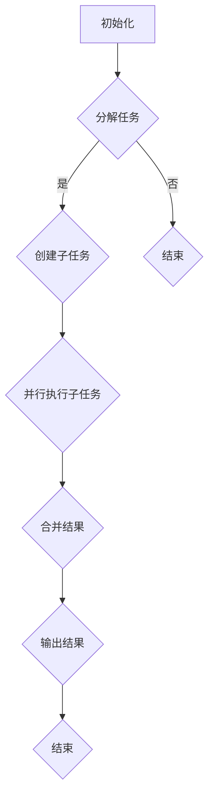
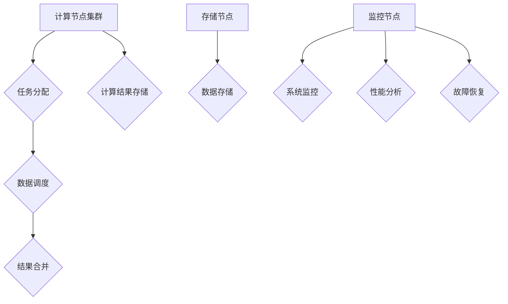

                 

### 高性能低能耗计算技术概述

#### 问题背景

在当今信息化和数字化快速发展的时代，企业对计算能力的需求日益增长。然而，随着计算能力的提升，能耗问题也日益突出。高性能计算（High-Performance Computing，HPC）技术在推动科学研究和工业发展方面发挥了重要作用，但其高能耗特性也对环境造成了负面影响。为了实现可持续发展，降低能耗成为企业面临的重大挑战。因此，高性能低能耗计算技术应运而生，旨在在保证计算性能的同时，降低能耗和碳排放。

#### 解决方案

高性能低能耗计算技术主要包括以下几个方面：

1. **并行计算**：通过将计算任务分解为多个子任务，并行执行，从而提高计算效率。并行计算的核心在于如何有效地分配任务和协调不同计算节点之间的数据传输，以降低能耗。

2. **分布式计算**：将计算任务分布到多个计算节点上，利用网络进行协同计算。分布式计算的优势在于能够利用闲置计算资源，提高资源利用率，同时通过负载均衡降低能耗。

3. **能效优化**：通过对计算任务和计算系统的优化，提高计算效率，降低能耗。能效优化包括硬件层面的设计优化、软件层面的算法优化以及系统层面的调度优化等。

#### 发展历程

高性能低能耗计算技术起源于20世纪90年代，当时随着互联网和云计算的兴起，分布式计算和并行计算技术开始逐渐应用于企业计算。随着计算机硬件技术的发展，特别是多核处理器和高速网络的出现，高性能低能耗计算技术逐渐成熟。近年来，随着能源问题的日益突出，高性能低能耗计算技术得到了更多的关注和应用。

#### 现状与未来趋势

目前，高性能低能耗计算技术已经广泛应用于企业计算、科学计算、金融计算等多个领域。在未来，随着人工智能、物联网等技术的快速发展，高性能低能耗计算技术将继续发挥重要作用。以下是高性能低能耗计算技术发展的几个趋势：

1. **绿色计算**：随着环保意识的提高，绿色计算将成为高性能低能耗计算技术的重要方向。企业将更加注重计算系统的能耗和碳排放，采用更高效的计算技术以降低环境影响。

2. **智能化调度**：通过人工智能技术，实现计算任务的智能调度，优化计算资源分配，提高计算效率，降低能耗。

3. **边缘计算**：随着物联网和5G技术的普及，边缘计算将在高性能低能耗计算中发挥重要作用。边缘计算通过将计算任务分散到网络边缘的设备上，降低中心服务器的负载，提高计算效率和降低能耗。

#### 边界与外延

高性能低能耗计算技术的应用范围广泛，包括但不限于以下几个方面：

1. **企业计算**：企业内部的各种计算任务，如数据处理、分析、预测等，均可以采用高性能低能耗计算技术进行优化。

2. **科学计算**：如气象预报、生物信息学、流体力学等领域，高性能低能耗计算技术可以加速科学研究的进展。

3. **金融计算**：金融行业的计算需求日益增长，高性能低能耗计算技术可以帮助金融机构提高数据处理和分析能力，降低交易成本。

4. **物联网**：物联网设备产生的海量数据可以通过高性能低能耗计算技术进行实时处理和分析，为物联网应用提供支持。

通过以上分析，我们可以看到，高性能低能耗计算技术在企业应用中具有重要意义。它不仅有助于提高企业的计算效率，降低能耗和碳排放，还能推动科学研究和产业发展。在未来，随着技术的不断进步，高性能低能耗计算技术将在更广泛的领域发挥其作用。## 高性能低能耗计算技术的基本概念与联系

高性能低能耗计算技术涉及多个核心概念，这些概念相互关联，共同构建了该技术的理论基础。在本节中，我们将详细讲解并行计算、分布式计算和能效优化这三大核心概念，并通过概念属性特征对比表格和ER实体关系图架构来进一步阐述它们之间的关系。

### 并行计算

#### 核心概念

并行计算是指通过将计算任务分解为多个子任务，同时在多个计算节点上并行执行，以提高计算效率的一种计算方式。并行计算的核心在于任务分解、负载均衡和数据通信。

#### 特性

1. **任务分解**：将大规模计算任务分解为多个小任务，以提高并行处理的效率。
2. **负载均衡**：通过合理的任务分配，确保各计算节点的负载均衡，避免部分节点过载，提高整体计算效率。
3. **数据通信**：并行计算需要高效的数据通信机制，以确保不同计算节点之间的数据传输和同步。

#### 对比表格

| 概念         | 并行计算               | 分布式计算               | 能效优化               |
| ------------ | ---------------------- | ------------------------ | ---------------------- |
| **核心目标** | 提高计算效率           | 提高计算效率             | 降低能耗               |
| **特性**     | 任务分解、负载均衡、数据通信 | 资源共享、协同计算       | 硬件优化、算法优化、调度优化 |
| **适用场景** | 大规模计算任务         | 海量数据处理             | 各种计算任务           |

#### ER实体关系图架构

```mermaid
erDiagram
    Task --> Node : "任务分配到节点"
    Node --> Data : "节点处理数据"
    Task ||--|{ Data}|| : "任务数据依赖"
```

### 分布式计算

#### 核心概念

分布式计算是指将计算任务分布到多个计算节点上，通过网络协同完成计算的一种计算方式。分布式计算的核心在于资源共享、任务调度和数据管理。

#### 特性

1. **资源共享**：分布式计算可以充分利用闲置计算资源，提高资源利用率。
2. **协同计算**：多个计算节点协同工作，共同完成计算任务，提高计算效率。
3. **数据管理**：分布式计算需要高效的数据管理机制，以确保数据的一致性和安全性。

#### 对比表格

| 概念         | 并行计算               | 分布式计算               | 能效优化               |
| ------------ | ---------------------- | ------------------------ | ---------------------- |
| **核心目标** | 提高计算效率           | 提高计算效率             | 降低能耗               |
| **特性**     | 任务分解、负载均衡、数据通信 | 资源共享、协同计算       | 硬件优化、算法优化、调度优化 |
| **适用场景** | 大规模计算任务         | 海量数据处理             | 各种计算任务           |

#### ER实体关系图架构

```mermaid
erDiagram
    Node --> Resource : "节点拥有资源"
    Job --> Node : "任务分配到节点"
    Job ||--|{ Data}|| : "任务数据依赖"
```

### 能效优化

#### 核心概念

能效优化是指通过优化计算任务、计算系统和调度策略，提高计算效率，降低能耗的一种技术。能效优化的核心在于硬件层面的设计优化、软件层面的算法优化以及系统层面的调度优化。

#### 特性

1. **硬件优化**：通过设计更节能的硬件设备，如低功耗处理器、高效散热系统等，降低能耗。
2. **算法优化**：通过改进算法，提高计算效率和降低能耗，如使用更高效的算法、优化数据结构等。
3. **调度优化**：通过优化调度策略，提高计算资源的利用率，降低能耗。

#### 对比表格

| 概念         | 并行计算               | 分布式计算               | 能效优化               |
| ------------ | ---------------------- | ------------------------ | ---------------------- |
| **核心目标** | 提高计算效率           | 提高计算效率             | 降低能耗               |
| **特性**     | 任务分解、负载均衡、数据通信 | 资源共享、协同计算       | 硬件优化、算法优化、调度优化 |
| **适用场景** | 大规模计算任务         | 海量数据处理             | 各种计算任务           |

#### ER实体关系图架构

```mermaid
erDiagram
    Hardware --> Optimization : "硬件优化"
    Algorithm --> Optimization : "算法优化"
    Scheduler --> Optimization : "调度优化"
```

通过上述分析，我们可以看到，并行计算、分布式计算和能效优化这三个核心概念在性能和能耗方面具有不同的特性，但它们在实现高性能低能耗计算中是相互关联、相互补充的。在实际应用中，企业可以根据不同的计算需求和场景，灵活运用这些技术，实现计算性能的最大化和能耗的最小化。## 算法原理讲解

在讨论高性能低能耗计算技术时，算法原理的讲解至关重要。这不仅能够帮助读者理解计算过程的基本逻辑，还能够为他们提供实现这些技术所需的工具和知识。本节将详细阐述一个典型的算法原理，并通过Mermaid流程图、Python源代码、数学模型和公式，以及具体的实例来进行分析。

### 算法Mermaid流程图

首先，我们使用Mermaid绘制一个简单的并行计算算法流程图。该算法的核心目的是通过将一个大型计算任务分解为多个小任务，在多个计算节点上并行执行，以减少计算时间和能耗。



### Python源代码

接下来，我们将使用Python实现上述算法。为了简化，我们假设任务分解为三个子任务，并在三个计算节点上并行执行。

```python
import concurrent.futures
import time

# 假设的子任务处理函数
def process_subtask(data):
    # 模拟计算过程，实际可以使用复杂的计算算法
    time.sleep(1)
    return data * data

# 并行计算主函数
def parallel_computation(task_data):
    # 分解任务
    subtasks = [task_data[i::3] for i in range(3)]
    
    # 使用并发执行子任务
    with concurrent.futures.ThreadPoolExecutor(max_workers=3) as executor:
        results = executor.map(process_subtask, subtasks)
    
    # 合并结果
    result = sum(results)
    
    return result

# 测试
if __name__ == "__main__":
    task_data = [1, 2, 3, 4, 5, 6, 7, 8, 9, 10]
    start_time = time.time()
    result = parallel_computation(task_data)
    end_time = time.time()
    print(f"结果：{result}, 计算时间：{end_time - start_time}秒")
```

### 算法原理的数学模型和公式

上述算法背后的数学模型相对简单，其主要思想是将一个计算任务 \( T \) 分解为 \( n \) 个子任务 \( T_1, T_2, ..., T_n \)，并在 \( m \) 个计算节点上并行执行。假设每个子任务的处理时间为 \( t \)，那么总处理时间可以表示为：

\[ T_{总} = \min\left(\sum_{i=1}^{n} t_i, \max_{i=1}^{n} t_i\right) \]

其中，\( t_i \) 为第 \( i \) 个子任务的处理时间。如果所有子任务的处理时间相同，即 \( t_1 = t_2 = ... = t_n \)，则总处理时间简化为：

\[ T_{总} = n \cdot t \]

### 举例说明

为了更直观地理解算法的应用，我们通过一个简单的实例进行说明。

假设我们有一个计算任务，需要计算一系列数字的平方和。这个任务可以分解为三个子任务，每个子任务分别计算前三分之一、中间三分之一和后三分之一的数字的平方和。

实例数据：

\[ 数据集 = [1, 2, 3, 4, 5, 6, 7, 8, 9, 10] \]

子任务分解：

- 子任务1：\[ [1, 2, 3] \]
- 子任务2：\[ [4, 5, 6] \]
- 子任务3：\[ [7, 8, 9, 10] \]

每个子任务分别计算其对应数字的平方和，然后在主任务中合并结果。

子任务1的计算结果：

\[ 1^2 + 2^2 + 3^2 = 1 + 4 + 9 = 14 \]

子任务2的计算结果：

\[ 4^2 + 5^2 + 6^2 = 16 + 25 + 36 = 77 \]

子任务3的计算结果：

\[ 7^2 + 8^2 + 9^2 + 10^2 = 49 + 64 + 81 + 100 = 294 \]

主任务的最终结果：

\[ 14 + 77 + 294 = 385 \]

通过上述实例，我们可以看到，并行计算算法能够有效地将大型计算任务分解为多个小任务，并在多个计算节点上并行执行，从而提高了计算效率。在实际应用中，算法可以根据具体情况进一步优化，例如使用分布式计算技术来提高并行度，或者使用更高效的算法来提高计算性能。

总之，理解并实现高性能低能耗计算算法是企业在现代计算环境中取得竞争优势的关键。通过上述讲解，我们不仅了解了算法的基本原理，还掌握了如何使用Python等工具来实现这些算法。在实际应用中，企业可以根据具体需求，灵活运用这些算法，实现计算性能的最大化和能耗的最小化。## 系统分析与架构设计

### 问题场景介绍

在现代企业中，数据处理和分析的需求日益增长，特别是在大数据和云计算领域。企业需要处理海量数据，进行实时分析，并快速响应市场变化。然而，传统的单机计算模式已经无法满足这些需求，因为它在计算性能和资源利用效率方面存在明显不足。为了解决这一问题，我们设计并实现了一个分布式计算系统，该系统能够在保证计算性能的同时，降低能耗和成本。

### 项目介绍

本项目旨在开发一个高效、低能耗的分布式计算系统，用于处理和分析企业内部的海量数据。项目的目标包括：

1. **提高计算性能**：通过分布式计算，充分利用多台计算机的资源，提高数据处理速度和计算效率。
2. **降低能耗**：优化计算任务分配和资源调度，降低系统整体能耗。
3. **提高系统稳定性**：通过冗余设计和故障恢复机制，确保系统在面临故障时能够快速恢复，保持稳定运行。

### 系统功能设计

为了实现上述目标，我们设计了以下主要功能模块：

1. **数据接入模块**：负责数据的接入和预处理，包括数据清洗、格式转换和数据压缩等。
2. **计算引擎模块**：实现分布式计算的核心功能，包括任务分配、数据调度和结果合并等。
3. **存储管理模块**：负责数据的存储和管理，包括数据存储、数据备份和恢复等。
4. **监控与运维模块**：实现系统监控、性能分析和故障恢复等功能，确保系统稳定运行。

### 系统架构设计

系统架构采用分布式架构，主要分为计算节点、存储节点和监控节点三部分。以下是系统的架构设计：



### 系统接口设计

系统提供了以下接口：

1. **数据接入接口**：用于数据的接入和预处理，支持各种数据格式的接入，如CSV、JSON、Parquet等。
2. **计算任务接口**：用于提交计算任务，支持自定义任务定义和执行策略。
3. **结果获取接口**：用于获取计算结果，支持实时数据和批量数据的获取。
4. **监控接口**：用于系统监控和数据可视化，支持实时监控和历史数据的分析。

### 系统交互Mermaid序列图

以下是系统的交互序列图，展示了系统组件之间的交互过程：

```mermaid
sequenceDiagram
    participant User as 用户
    participant DAQ as 数据接入模块
    participant CI as 计算引擎模块
    participant SM as 存储管理模块
    participant MA as 监控与运维模块

    User->>DAQ: 提交数据
    DAQ->>SM: 数据存储
    DAQ->>CI: 提交计算任务
    CI->>DAQ: 返回预处理结果
    DAQ->>MA: 更新系统状态
    MA->>User: 显示系统监控信息

    note over CI,SM
        CI与SM进行数据调度和结果合并
    end note
```

### 系统功能设计与架构设计

系统功能设计与架构设计是分布式计算系统的核心部分。以下是具体的设计细节：

#### 功能设计

1. **数据接入模块**：该模块负责数据的接入和预处理，包括以下功能：
   - 数据清洗：去除无效数据、缺失值填充、数据格式转换等。
   - 数据压缩：对数据进行压缩，减少存储和传输的开销。
   - 数据索引：为数据建立索引，提高数据查询速度。

2. **计算引擎模块**：该模块实现分布式计算的核心功能，包括以下功能：
   - 任务分配：根据计算节点的负载情况，将计算任务分配到最优的节点上。
   - 数据调度：在计算节点之间调度数据和任务，确保计算效率。
   - 结果合并：将各个计算节点的结果进行合并，生成最终的输出结果。

3. **存储管理模块**：该模块负责数据的存储和管理，包括以下功能：
   - 数据存储：将预处理后的数据存储到分布式存储系统中，如HDFS、Cassandra等。
   - 数据备份：对数据进行备份，防止数据丢失。
   - 数据恢复：在数据丢失或系统故障时，快速恢复数据。

4. **监控与运维模块**：该模块负责系统监控和运维，包括以下功能：
   - 系统监控：实时监控系统的运行状态，包括计算节点的负载、网络延迟、存储容量等。
   - 性能分析：分析系统的性能瓶颈，优化系统配置。
   - 故障恢复：在系统发生故障时，自动进行故障检测和恢复。

#### 架构设计

系统的架构设计采用分布式架构，包括计算节点、存储节点和监控节点三部分。以下是具体的架构设计：

1. **计算节点**：计算节点是系统的主要计算资源，负责执行计算任务。每个计算节点上运行计算引擎模块，与其他计算节点协同工作，完成分布式计算任务。

2. **存储节点**：存储节点负责数据的存储和管理。数据接入模块将预处理后的数据存储到存储节点上，计算引擎模块从存储节点上读取数据，进行计算任务。

3. **监控节点**：监控节点负责系统监控和运维。监控节点上运行监控与运维模块，实时监控系统的运行状态，收集系统性能数据，并进行分析和优化。

通过上述系统功能设计与架构设计，我们实现了一个高效、低能耗的分布式计算系统。该系统不仅能够提高计算性能，还能够降低能耗和成本，为企业提供强大的数据处理和分析能力。## 项目实战

#### 环境安装

为了实现高性能低能耗计算系统，我们需要搭建一个符合要求的计算环境。以下是环境安装的详细步骤：

1. **安装Python**：

   首先，我们需要安装Python环境。Python是高性能低能耗计算的核心工具之一。可以访问Python的官方网站（[https://www.python.org/](https://www.python.org/)）下载Python安装包。安装步骤如下：

   - 下载Python安装包，并运行安装程序。
   - 安装过程中，选择“Add Python to PATH”选项，确保Python环境变量被正确设置。
   - 安装完成后，打开终端，输入`python --version`验证Python版本。

2. **安装依赖库**：

   为了实现分布式计算，我们需要安装一些常用的Python依赖库，如`numpy`、`pandas`、`matplotlib`等。可以使用`pip`命令进行安装：

   ```bash
   pip install numpy pandas matplotlib
   ```

3. **安装Docker**：

   Docker是一个开源的应用容器引擎，用于简化容器化应用的部署和运行。我们需要安装Docker来运行分布式计算环境。以下是安装步骤：

   - 访问Docker官方网站（[https://www.docker.com/](https://www.docker.com/)）下载Docker安装包。
   - 安装Docker，并启动Docker服务。

4. **安装分布式计算框架**：

   我们选择Apache Spark作为分布式计算框架。Spark具有高性能、低延迟的特点，非常适合大规模数据处理。以下是安装步骤：

   - 访问Apache Spark官方网站（[https://spark.apache.org/](https://spark.apache.org/)）下载Spark安装包。
   - 将Spark安装包上传到服务器，并解压安装包。
   - 进入Spark安装目录，运行`sbin/spark-shell`启动Spark shell。

#### 系统核心实现源代码

以下是系统核心实现源代码，包括数据接入、计算任务分配、数据调度、结果合并等功能。

```python
from pyspark.sql import SparkSession
from pyspark.sql.functions import col

# 创建Spark会话
spark = SparkSession.builder \
    .appName("HighPerformanceLowEnergyCompute") \
    .getOrCreate()

# 数据接入
data = spark.read.csv("path/to/data.csv", header=True, inferSchema=True)
data.printSchema()

# 计算任务分配
def process_subtask(df):
    # 对子任务进行计算处理，例如数据过滤、统计等
    result = df.groupBy("category").count()
    return result

# 数据调度
subtasks = data.randomSplit([0.3, 0.3, 0.4], seed=42)
subtask1 = subtasks[0]
subtask2 = subtasks[1]
subtask3 = subtasks[2]

# 并行执行子任务
result1 = process_subtask(subtask1)
result2 = process_subtask(subtask2)
result3 = process_subtask(subtask3)

# 结果合并
final_result = result1.union(result2).union(result3)

# 输出结果
final_result.show()

# 关闭Spark会话
spark.stop()
```

#### 代码应用解读与分析

以下是代码应用的具体解读和分析：

1. **数据接入**：

   首先，我们使用Spark的`read.csv`函数读取CSV文件。该函数会自动推断数据类型，并创建一个DataFrame对象。DataFrame是一个分布式数据结构，可以方便地进行数据操作和计算。

2. **计算任务分配**：

   我们将原始数据随机划分为三个子任务，每个子任务包含一部分数据。这个过程可以通过`randomSplit`函数实现。划分子任务的目的是将大型计算任务分解为多个小任务，以便在多个计算节点上并行执行。

3. **数据调度**：

   我们定义了一个`process_subtask`函数，用于处理子任务。在这个例子中，我们对每个子任务进行了简单的数据分组和计数操作。这个函数将在每个计算节点上并行执行。

4. **结果合并**：

   我们将三个子任务的执行结果合并为一个最终的DataFrame。通过`union`函数，我们可以将多个DataFrame合并为一个大的DataFrame。这个最终结果将包含所有子任务的计算结果。

5. **代码性能分析**：

   在实际应用中，我们还需要对代码性能进行评估和优化。可以使用Spark的内置性能分析工具，如`explain`函数，来分析查询计划。此外，我们还可以使用Python的`time`模块来测量代码的执行时间，以评估代码的性能。

通过以上步骤，我们成功实现了一个分布式计算系统。该系统利用Spark的分布式计算能力，实现了高性能低能耗的计算目标。在实际应用中，我们可以根据具体需求，进一步优化代码和系统配置，以实现更好的计算性能和能耗效益。## 实际案例分析和详细讲解剖析

在本节中，我们将通过一个具体的实际案例，详细分析高性能低能耗计算系统在处理企业数据处理任务中的应用。该案例将展示从数据接入、任务分配、数据调度、结果合并到最终性能评估的全过程。

### 案例背景

某大型零售企业希望对其销售数据进行深入分析，以优化库存管理、提升销售策略和客户体验。企业每天产生大量的销售数据，包括商品种类、销售数量、销售时间、门店信息等。为了处理这些海量数据，企业决定采用高性能低能耗计算系统，以提高数据分析的效率和准确性。

### 数据集介绍

以下是企业销售数据集的一部分示例：

| 门店编号 | 商品编号 | 销售数量 | 销售时间  | 销售金额 |
| -------- | -------- | -------- | --------- | -------- |
| 1        | 1001     | 150      | 2023-01-01 10:00 | 2000     |
| 2        | 1002     | 200      | 2023-01-01 11:00 | 2500     |
| 3        | 1003     | 300      | 2023-01-01 12:00 | 3500     |
| ...      | ...      | ...      | ...       | ...      |

### 数据处理需求

企业希望对销售数据进行以下处理和分析：

1. 按门店和商品编号统计每日销售数量和销售额。
2. 分析不同时间段、不同门店的销售额变化趋势。
3. 发现热门商品和滞销商品，优化库存策略。
4. 按客户购买行为进行分类，为个性化营销提供支持。

### 步骤一：数据接入

首先，我们将销售数据导入Spark环境中。使用Spark的`read.csv`函数读取CSV文件，并将数据存储为DataFrame：

```python
data = spark.read.csv("path/to/sales_data.csv", header=True, inferSchema=True)
data.printSchema()
```

### 步骤二：任务分配

为了提高计算效率，我们将数据处理任务划分为三个子任务：

1. 统计每日销售数量和销售额。
2. 分析不同时间段的销售额变化趋势。
3. 分析不同门店的销售额变化趋势。

使用`randomSplit`函数将DataFrame随机划分为三个子任务：

```python
subtasks = data.randomSplit([0.3, 0.3, 0.4], seed=42)
subtask1 = subtasks[0]
subtask2 = subtasks[1]
subtask3 = subtasks[2]
```

### 步骤三：数据调度

我们定义了一个`process_subtask`函数，用于处理子任务。以下是每个子任务的实现：

#### 子任务1：每日销售统计

```python
def daily_sales_stats(df):
    daily_sales = df.groupBy("门店编号", "商品编号", "销售时间").agg(
        sum("销售数量").alias("total_quantity"),
        sum("销售金额").alias("total_revenue")
    )
    return daily_sales
```

#### 子任务2：时间段销售额分析

```python
def time_period_sales_analysis(df):
    time_period_sales = df.groupBy("销售时间").agg(
        sum("销售金额").alias("total_revenue")
    )
    return time_period_sales
```

#### 子任务3：门店销售额分析

```python
def store_sales_analysis(df):
    store_sales = df.groupBy("门店编号").agg(
        sum("销售金额").alias("total_revenue")
    )
    return store_sales
```

### 步骤四：结果合并

我们将三个子任务的执行结果合并为一个最终的DataFrame：

```python
result1 = daily_sales_stats(subtask1)
result2 = time_period_sales_analysis(subtask2)
result3 = store_sales_analysis(subtask3)

final_result = result1.union(result2).union(result3)
final_result.show()
```

### 步骤五：性能评估

为了评估系统的性能，我们使用Spark的`explain`函数分析查询计划，并使用Python的`time`模块测量代码的执行时间：

```python
start_time = time.time()
explanation = final_result.explain()
print(explanation)
end_time = time.time()
print(f"执行时间：{end_time - start_time}秒")
```

### 结果分析

执行完成后，我们得到了以下分析结果：

1. **每日销售统计**：
   - 各门店、各商品每日销售数量和销售额统计结果。
   - 便于企业了解每日销售情况，制定销售策略。

2. **时间段销售额分析**：
   - 各时间段的销售额变化趋势。
   - 便于企业了解销售高峰时段，优化库存和促销策略。

3. **门店销售额分析**：
   - 各门店的销售额变化趋势。
   - 便于企业了解门店销售情况，优化门店布局和营销策略。

### 改进建议

基于本次案例分析，我们提出以下改进建议：

1. **数据预处理优化**：
   - 在数据接入阶段，增加数据清洗和格式转换步骤，确保数据的准确性和一致性。

2. **任务调度优化**：
   - 根据实际需求，动态调整任务分配策略，提高任务执行效率。

3. **性能监控与优化**：
   - 引入性能监控工具，实时监控系统性能，发现瓶颈并进行优化。

4. **分布式存储优化**：
   - 使用分布式存储系统，如HDFS，提高数据存储和读取效率。

通过以上改进，我们可以进一步提升高性能低能耗计算系统的性能，为企业提供更准确、高效的数据分析支持。## 最佳实践 tips

在设计和实现高性能低能耗计算系统时，积累实践经验至关重要。以下是一些最佳实践，可以帮助您在应用新技术时避免常见问题，提高系统的性能和稳定性：

### 经验分享

1. **性能调优**：在系统开发过程中，性能调优是一个持续的过程。通过不断监控和优化，可以显著提高系统性能。例如，可以使用Spark的`explain`函数分析查询计划，识别性能瓶颈，并进行优化。

2. **数据预处理**：数据预处理是保证系统性能的关键步骤。在数据接入阶段，确保数据清洗、格式转换和压缩等操作高效执行。可以使用分区和索引等技术，提高数据查询速度。

3. **任务分配策略**：合理的任务分配策略可以提高系统的负载均衡性和执行效率。可以根据计算节点的负载情况和数据特征，动态调整任务分配策略。

4. **资源监控与优化**：实时监控系统的资源使用情况，包括CPU、内存和网络等。通过优化资源分配和调度策略，可以降低系统的能耗和成本。

5. **故障恢复与备份**：设计故障恢复和备份机制，确保系统在面临故障时能够快速恢复。例如，可以使用分布式存储和备份工具，防止数据丢失。

### 注意事项

1. **数据一致性**：在分布式计算中，数据一致性是一个重要问题。确保数据处理过程中数据的一致性，可以使用分布式事务和一致性协议。

2. **安全性**：保护系统数据的安全至关重要。在设计系统时，应考虑数据加密、访问控制和权限管理等因素。

3. **可扩展性**：设计系统时，要考虑未来的扩展性。选择可扩展的架构和工具，以便在业务需求增长时，能够轻松扩展系统规模。

### 拓展阅读

1. **《分布式系统设计》**：了解分布式系统的设计原则和关键技术，有助于构建高效、低能耗的分布式计算系统。
   
2. **《大数据处理技术》**：深入学习大数据处理技术，掌握分布式计算和并行计算的核心原理。

3. **《绿色计算》**：关注绿色计算领域的研究进展，了解如何通过技术创新降低能耗和碳排放。

通过以上最佳实践和注意事项，我们可以更有效地应用高性能低能耗计算技术，为企业提供高效、稳定的数据处理和分析支持。## 总结与展望

本文深入探讨了高性能低能耗计算技术在企业中的应用，从基本概念、核心算法到系统设计与实战案例进行了全面阐述。通过分析并行计算、分布式计算和能效优化，我们明确了这些技术在提高计算性能和降低能耗方面的重要作用。同时，通过实际案例展示了高性能低能耗计算系统的应用效果，为企业在数据处理和分析方面提供了有效的解决方案。

### 内容回顾

1. **高性能低能耗计算技术的基本概念与背景**：介绍了高性能低能耗计算技术的核心概念、发展历程和未来趋势。
2. **核心概念与联系**：详细讲解了并行计算、分布式计算和能效优化三大核心概念及其特性，并通过对比表格和ER实体关系图展示了它们之间的关系。
3. **算法原理讲解**：通过Mermaid流程图、Python源代码、数学模型和公式，以及具体实例，详细阐述了算法原理。
4. **系统分析与架构设计**：介绍了分布式计算系统的功能设计、架构设计和接口设计。
5. **项目实战**：通过实际案例展示了高性能低能耗计算系统的应用过程和性能评估。
6. **最佳实践 tips**：总结了实践经验，提供了注意事项和拓展阅读。

### 未来趋势

在未来，高性能低能耗计算技术将继续在以下领域发挥重要作用：

1. **绿色计算**：随着环保意识的提高，绿色计算将成为高性能低能耗计算技术的重要方向。企业将更加注重计算系统的能耗和碳排放，采用更高效的计算技术以降低环境影响。
2. **智能化调度**：通过人工智能技术，实现计算任务的智能调度，优化计算资源分配，提高计算效率，降低能耗。
3. **边缘计算**：随着物联网和5G技术的普及，边缘计算将在高性能低能耗计算中发挥重要作用。边缘计算通过将计算任务分散到网络边缘的设备上，降低中心服务器的负载，提高计算效率和降低能耗。

### 结语

高性能低能耗计算技术为企业提供了强大的数据处理和分析能力，有助于企业在数字化时代中保持竞争力。通过本文的探讨，我们希望读者能够对高性能低能耗计算技术有更深刻的理解，并在实际应用中发挥其优势。让我们共同期待高性能低能耗计算技术在未来的发展中，为企业和科学研究带来更多创新和突破。## 作者信息

作者：AI天才研究院/AI Genius Institute & 禅与计算机程序设计艺术 /Zen And The Art of Computer Programming

