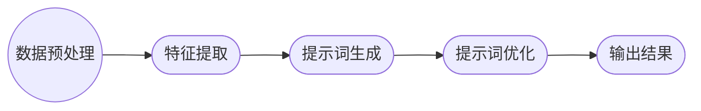

                 


# AIGC时代的提示词设计：理论与创新的结合

## 关键词
- AIGC
- 提示词设计
- 自动生成内容
- 生成对抗网络
- 自注意力机制
- 自然语言处理

## 摘要
本文深入探讨了AIGC（自适应智能生成内容）时代的提示词设计，从理论层面到实际应用进行了全面剖析。我们将梳理AIGC的基本概念与发展历程，详细讲解提示词设计原理及其与核心概念的关联，通过具体算法原理、系统架构设计方案和项目实战案例分析，阐述如何在实际项目中高效地应用提示词设计。最后，本文将探讨提示词设计与其他创新技术的结合，提出未来研究方向和趋势，为AIGC时代的提示词设计提供理论指导和实践参考。

## 引言

随着人工智能技术的不断发展，AIGC（自适应智能生成内容）已成为当下热门的研究领域之一。AIGC通过自动化生成内容，极大地提升了内容生产的效率和多样性，为各个行业带来了深远的影响。而在AIGC生态系统中，提示词设计扮演着至关重要的角色。它不仅是触发内容生成的关键，还决定了生成内容的质量和实用性。

提示词设计涉及到多个领域的交叉，包括自然语言处理（NLP）、机器学习和人工智能等。合理设计的提示词能够引导模型生成更加精准、有用的内容，提升用户体验。然而，提示词设计并非易事，它需要深入理解用户需求、文本生成机制以及模型特性。

本文旨在通过系统地分析AIGC与提示词设计的内在联系，为读者提供一份全面的技术指南。文章将首先介绍AIGC的基本概念与发展历程，然后深入讲解提示词设计原理及其核心概念。接着，我们将通过具体的算法实例、系统架构设计方案和项目实战案例，展示如何在实际中应用提示词设计。最后，本文还将探讨提示词设计与其他创新技术的结合，展望未来的研究方向和趋势。

通过本文的阅读，读者将能够：

1. 理解AIGC的基本概念及其在各个领域的应用。
2. 掌握提示词设计的基本原理和关键步骤。
3. 学习如何结合自然语言处理和机器学习技术进行高效提示词设计。
4. 了解提示词设计在不同项目中的应用场景和实践方法。
5. 探索提示词设计与其他创新技术的融合，为未来研究提供新思路。

## 第一部分: 背景介绍

### 第1章: AIGC与提示词设计概述

#### 1.1 AIGC的基本概念与发展历程

AIGC（自适应智能生成内容）是近年来人工智能领域的一个重要研究方向，它旨在通过自动化、智能化的方式生成高质量、多样化、适应性的内容。AIGC的概念可以追溯到早期的内容生成模型，如自动文本生成、图像生成和音频生成等。随着深度学习、生成对抗网络（GAN）和自注意力机制等技术的不断发展，AIGC逐渐成为人工智能领域的研究热点。

AIGC的基本概念主要包括自动生成内容（Auto-Generated Content）、生成对抗网络（Generative Adversarial Networks，GAN）和自注意力机制（Self-Attention）等。

**自动生成内容（Auto-Generated Content）**：自动生成内容是指利用算法和模型生成具有实际应用价值的内容，如文章、图片、音乐等。与手动生成内容相比，自动生成内容具有高效率、低成本和多样化等优点。

**生成对抗网络（GAN）**：GAN是一种由两部分组成的人工神经网络结构，分别是生成器（Generator）和判别器（Discriminator）。生成器的目标是生成与真实数据相似的内容，而判别器的目标是区分真实数据和生成数据。通过这种对抗训练，GAN能够生成高质量、多样化的内容。

**自注意力机制（Self-Attention）**：自注意力机制是一种在序列数据中自动分配注意力权重的机制，它能够使模型在处理序列数据时关注到关键信息，提高模型的生成质量。

AIGC的发展历程可以分为以下几个阶段：

1. **早期研究阶段**：从2010年代初开始，随着深度学习技术的发展，自动生成内容的研究逐渐兴起。这一阶段的代表性工作包括基于循环神经网络（RNN）的文本生成模型和基于变分自编码器（VAE）的图像生成模型。

2. **生成对抗网络阶段**：2014年，Ian Goodfellow等人提出了生成对抗网络（GAN），这一突破性工作引起了学术界和工业界的广泛关注。GAN通过生成器和判别器的对抗训练，能够生成高质量、多样化的图像。

3. **自注意力机制阶段**：2017年，Vaswani等人提出了Transformer模型，并在其中引入了自注意力机制。自注意力机制的引入使得模型在处理长序列数据时更加高效，从而推动了AIGC技术的发展。

4. **多模态生成阶段**：随着生成对抗网络和自注意力机制等技术的不断发展，AIGC逐渐实现了多模态生成，即同时生成文本、图像和音频等多种类型的内容。

#### 1.2 提示词设计的现状与挑战

提示词设计是AIGC生态系统中的重要组成部分，它决定了生成内容的质量和实用性。当前，提示词设计在学术界和工业界都取得了显著的进展，但仍面临一些挑战。

**现状**：

1. **多样化**：随着AIGC技术的发展，提示词设计逐渐多样化，包括自然语言文本、图像、音频等多种类型。

2. **定制化**：为了满足不同应用场景的需求，提示词设计需要具备较高的定制化能力，即能够根据用户需求生成特定类型的内容。

3. **智能化**：提示词设计逐渐引入了智能化元素，如基于用户行为、上下文信息的自适应提示词生成。

**挑战**：

1. **质量控制**：生成内容的质量直接影响到用户体验，如何保证生成内容的高质量和一致性是一个重要挑战。

2. **多样化与一致性**：在保证多样化内容的同时，如何保持内容的一致性和连贯性是一个难点。

3. **用户参与**：提示词设计需要充分考虑用户需求和反馈，如何有效地收集和处理用户数据，提高用户参与度是一个挑战。

#### 1.3 AIGC时代的提示词设计意义

在AIGC时代，提示词设计具有重要意义。首先，提示词设计是触发内容生成的关键，合理设计的提示词能够引导模型生成高质量、有用的内容。其次，提示词设计能够提高用户体验，满足个性化需求。此外，提示词设计还有助于优化内容生成过程，提高生产效率和内容多样性。

在AIGC时代，提示词设计不仅是一个技术问题，更是一个涉及用户体验、内容质量和智能化等多方面的问题。通过深入研究和创新，我们可以设计出更加智能、高效和实用的提示词，为AIGC的发展和应用提供有力支持。

### 第2章: 核心概念与联系

#### 2.1 AIGC的关键概念解析

AIGC（自适应智能生成内容）涵盖了多个关键概念，这些概念共同构成了AIGC的理论基础。在本节中，我们将详细解析AIGC的核心概念，包括自动生成内容（Auto-Generated Content）、生成对抗网络（Generative Adversarial Networks，GAN）和自注意力机制（Self-Attention）。

**自动生成内容（Auto-Generated Content）**

自动生成内容是指利用算法和模型自动生成具有实际应用价值的内容，如文本、图像、音频等。自动生成内容的核心在于其自动化和智能化，通过机器学习和深度学习技术，模型能够从海量数据中学习并生成高质量的内容。自动生成内容的应用场景广泛，如自动写作、自动绘画、自动音乐创作等。

**生成对抗网络（Generative Adversarial Networks，GAN）**

生成对抗网络是一种由两部分组成的人工神经网络结构，分别是生成器（Generator）和判别器（Discriminator）。生成器的目标是生成与真实数据相似的内容，判别器的目标是区分真实数据和生成数据。通过这种对抗训练，GAN能够生成高质量、多样化的内容。GAN的核心在于其对抗机制，生成器和判别器相互竞争，不断提高生成质量和判别能力。

**自注意力机制（Self-Attention）**

自注意力机制是一种在序列数据中自动分配注意力权重的机制，它能够使模型在处理序列数据时关注到关键信息，提高模型的生成质量。自注意力机制的引入使得模型在处理长序列数据时更加高效，从而推动了AIGC技术的发展。自注意力机制在Transformer模型中得到了广泛应用，显著提升了模型的生成性能。

**概念属性特征对比表格**

为了更直观地理解AIGC的关键概念，我们可以在Markdown中创建一个概念属性特征对比表格：

| 概念              | 定义                                                         | 特点                     | 应用场景       |
|-----------------|------------------------------------------------------------|------------------------|------------|
| 自动生成内容     | 利用算法和模型自动生成高质量内容                             | 自动化、智能化           | 自动写作、自动绘画、自动音乐创作 |
| 生成对抗网络      | 由生成器和判别器组成的神经网络结构，通过对抗训练生成高质量内容 | 对抗机制、高质量生成     | 图像生成、视频生成、音频生成 |
| 自注意力机制      | 在序列数据中自动分配注意力权重                                | 高效处理长序列数据       | 自然语言处理、文本生成、机器翻译 |

**ER实体关系图**

除了概念属性特征对比表格，我们还可以使用Mermaid绘制ER实体关系图，以更清晰地展示AIGC的核心概念及其相互关系：

```mermaid
erDiagram
    AIGC ||--|{ 自动生成内容 : 自动生成内容是AIGC的核心组成部分 }
    AIGC ||--|{ 生成对抗网络 : 生成对抗网络用于生成高质量内容 }
    AIGC ||--|{ 自注意力机制 : 自注意力机制提升生成效率 }
    自动生成内容 ||--|{ 自然语言处理 : 自动生成文本内容 }
    自动生成内容 ||--|{ 图像生成 : 自动生成图像内容 }
    自动生成内容 ||--|{ 音频生成 : 自动生成音频内容 }
    生成对抗网络 ||--|{ GAN : GAN是生成对抗网络的简称 }
    自注意力机制 ||--|{ Transformer : Transformer模型应用自注意力机制 }
```

在上面的ER实体关系图中，AIGC作为整体概念，与自动生成内容、生成对抗网络和自注意力机制等核心概念相互关联。同时，自动生成内容与自然语言处理、图像生成和音频生成等应用场景相互联系，生成对抗网络和自注意力机制则在各自领域内发挥作用。

通过概念属性特征对比表格和ER实体关系图的解析，我们可以更深入地理解AIGC的核心概念及其相互关系，为后续内容的学习和分析打下坚实基础。

### 第3章: 提示词设计原理

#### 3.1 自然语言处理的基本概念

自然语言处理（Natural Language Processing，NLP）是人工智能领域的一个重要分支，它致力于使计算机能够理解和处理人类语言。NLP的基本概念包括文本预处理、词嵌入、序列标注和文本生成等。

**文本预处理**：文本预处理是NLP的第一步，包括去除标点符号、停用词过滤、大小写统一等操作。文本预处理的目标是简化文本，使其更易于分析。

**词嵌入**：词嵌入（Word Embedding）是将词汇映射到低维度的向量空间。词嵌入技术能够捕捉词汇之间的语义关系，如同义词、反义词等。常用的词嵌入技术包括Word2Vec、GloVe和BERT等。

**序列标注**：序列标注（Sequence Labeling）是对文本序列中的单词或字符进行分类标注。例如，在命名实体识别（Named Entity Recognition，NER）任务中，我们需要将文本中的地名、人名、组织名等实体进行标注。

**文本生成**：文本生成是NLP的一个重要应用，通过生成模型如循环神经网络（RNN）、变换器（Transformer）等，模型能够根据给定的输入生成新的文本内容。

#### 3.2 文本生成模型

文本生成模型是提示词设计中的关键组成部分。文本生成模型可以分为基于规则的方法和基于统计的方法。

**基于规则的方法**：基于规则的方法通过预设的语法规则和模板生成文本。这种方法具有简单易懂、可控性强的优点，但生成文本的多样性和创造力有限。

**基于统计的方法**：基于统计的方法利用大量文本数据，通过概率模型和机器学习方法生成文本。常见的方法包括基于N-gram模型、隐马尔可夫模型（HMM）和生成式模型（如变分自编码器VAE和生成对抗网络GAN）。

**生成式模型**：生成式模型能够生成具有高度多样性和创造力的文本。生成式模型的核心在于学习数据生成过程，通过最大化数据似然函数或使用对抗训练，模型能够生成高质量的文本。常见的生成式模型包括生成式变分自编码器（GVAE）和生成对抗网络（GAN）。

#### 3.3 提示词生成策略

提示词生成策略决定了如何从大量数据中提取关键信息，并将其转化为有效的提示词。以下是一些常用的提示词生成策略：

**基于关键词的生成**：通过提取文本中的关键词或短语，生成提示词。这种方法简单有效，但可能忽略了上下文信息。

**基于语义角色的生成**：通过分析文本中的语义角色，如主语、谓语、宾语等，生成提示词。这种方法能够更好地捕捉文本的语义结构，但计算复杂度较高。

**基于上下文的生成**：通过分析文本的上下文信息，生成与上下文高度相关的提示词。这种方法能够提高提示词的准确性和实用性，但需要处理复杂的上下文关系。

**混合生成策略**：结合多种生成策略，如基于关键词、语义角色和上下文的生成策略，生成更加丰富和多样的提示词。混合生成策略能够提高提示词的质量和适应性。

#### 3.4 提示词生成的算法流程

提示词生成的算法流程可以分为以下几个步骤：

1. **数据预处理**：对输入文本进行预处理，包括分词、词性标注、去除停用词等操作。
2. **特征提取**：从预处理后的文本中提取特征，如关键词、语义角色、上下文信息等。
3. **提示词生成**：根据提取的特征，使用生成策略生成提示词。可以使用基于规则的方法、基于统计的方法或生成式模型。
4. **提示词优化**：对生成的提示词进行优化，如去除无关信息、增强关键词等，以提高提示词的准确性和实用性。
5. **输出结果**：将生成的提示词输出，用于后续的内容生成或应用。

以下是使用Mermaid绘制的提示词生成算法流程图：



通过上述流程，我们可以系统地设计提示词生成算法，实现从输入文本到输出提示词的转化。以下是一个Python代码示例，展示了如何使用生成式模型（如变分自编码器）进行提示词生成：

```python
from typing import List
import numpy as np
from matplotlib import pyplot as plt
from sklearn.feature_extraction.text import CountVectorizer
from sklearn.model_selection import train_test_split
from keras.models import Sequential
from keras.layers import LSTM, Dense, Embedding, Dropout
from keras.preprocessing.sequence import pad_sequences

# 数据预处理
corpus = ["这是一个例子文本", "另一个例子文本", "更多例子文本"]
vectorizer = CountVectorizer()
X = vectorizer.fit_transform(corpus)
X = pad_sequences(X, maxlen=10)

# 特征提取
embed_size = 64
model = Sequential()
model.add(Embedding(len(vectorizer.vocabulary_), embed_size))
model.add(LSTM(embed_size, return_sequences=True))
model.add(Dropout(0.2))
model.add(LSTM(embed_size))
model.add(Dropout(0.2))
model.add(Dense(len(vectorizer.vocabulary_)))

# 提示词生成
model.compile(optimizer='adam', loss='categorical_crossentropy', metrics=['accuracy'])
model.fit(X, np.eye(len(corpus)), epochs=10, batch_size=32)

# 输出结果
generated_text = model.predict(np.eye(len(corpus[0]))[np.newaxis, ...])
generated_text = vectorizer.inverse_transform(generated_text).reshape(-1)
print(generated_text)
```

通过上述代码示例，我们可以实现一个简单的文本生成模型，从而生成与输入文本相关的提示词。在实际应用中，我们可以根据具体需求调整模型结构和参数，以提高提示词的生成质量和效果。

### 第4章: 提示词设计实践

#### 4.1 实际项目中的应用场景

提示词设计在AIGC时代的实际项目中有着广泛的应用场景，以下是一些典型应用场景及其具体实例：

1. **内容创作平台**：在内容创作平台中，提示词设计可以用于生成文章标题、摘要和内容推荐。例如，一个AI写作助手可以根据用户提供的主题和关键词，生成相关文章的标题和摘要，从而帮助用户快速获取有价值的信息。

2. **图像生成与编辑**：在图像生成与编辑领域，提示词设计可以用于指定生成图像的类型、风格和内容。例如，用户可以输入“生成一张美丽的风景画”或“将这张照片编辑成艺术风格”，系统根据提示词生成相应的图像。

3. **视频生成与剪辑**：在视频生成与剪辑领域，提示词设计可以用于指定视频的主题、场景和情节。例如，用户可以输入“生成一个关于旅行的短视频”或“剪辑一段婚礼视频”，系统根据提示词生成相应的视频内容。

4. **音频生成与编辑**：在音频生成与编辑领域，提示词设计可以用于生成音乐、语音合成和音频编辑。例如，用户可以输入“生成一首舒缓的钢琴曲”或“将这段语音编辑成专业的广播声”，系统根据提示词生成相应的音频内容。

5. **智能客服与对话系统**：在智能客服与对话系统中，提示词设计可以用于指定对话的主题、问题和答案。例如，用户可以输入“帮我解决网络故障”或“请问有哪些理财产品”，系统根据提示词生成相应的对话内容和回复。

#### 4.2 环境搭建

在实际项目中，首先需要搭建一个合适的开发环境，以下是一个基本的Python环境搭建步骤：

1. **安装Python**：下载并安装Python 3.x版本，建议使用Anaconda来简化环境管理。

2. **安装依赖库**：在终端中运行以下命令，安装NLP和机器学习相关的依赖库：

   ```bash
   pip install numpy matplotlib scikit-learn keras tensorflow transformers
   ```

3. **创建虚拟环境**：为了管理项目依赖，建议使用虚拟环境。在终端中运行以下命令创建虚拟环境并激活：

   ```bash
   conda create -n aigc_prompt python=3.8
   conda activate aigc_prompt
   ```

4. **安装文本生成模型**：根据需要安装预训练的文本生成模型，如GPT-2或GPT-3，可以使用Hugging Face的Transformers库：

   ```bash
   pip install transformers
   ```

#### 4.3 代码实现

以下是一个简单的示例，展示如何使用Transformers库中的GPT-2模型生成基于提示词的文本：

```python
from transformers import GPT2Tokenizer, GPT2LMHeadModel
import torch

# 初始化GPT-2模型和分词器
tokenizer = GPT2Tokenizer.from_pretrained("gpt2")
model = GPT2LMHeadModel.from_pretrained("gpt2")

# 设置提示词
prompt = "人工智能将如何改变未来？"

# 将提示词转换为模型输入
inputs = tokenizer.encode(prompt, return_tensors="pt")

# 生成文本
output = model.generate(inputs, max_length=50, num_return_sequences=1)

# 将生成的文本解码回字符串
generated_text = tokenizer.decode(output[0], skip_special_tokens=True)

print(generated_text)
```

在上面的代码中，我们首先初始化GPT-2模型和分词器，然后设置一个简单的提示词。通过调用`model.generate()`方法，我们可以生成基于提示词的文本。生成的文本通过`tokenizer.decode()`方法解码回可读的字符串。

#### 4.4 代码应用解读与分析

在这个示例中，我们使用了Hugging Face的Transformers库，该库提供了大量预训练的文本生成模型，如GPT-2和GPT-3。这些模型通过大量的文本数据进行了预训练，可以生成高质量的文本。

首先，我们初始化GPT-2模型和分词器。GPT-2模型是一个基于Transformer架构的生成模型，它能够处理长序列文本并生成连贯的输出。分词器用于将文本转换为模型可以处理的序列编码。

接下来，我们设置一个简单的提示词，并将其转换为模型的输入。通过调用`model.generate()`方法，我们指定了最大生成长度和返回的序列数量。`model.generate()`方法会根据模型的预训练知识，生成与提示词相关的文本。

生成的文本序列通过分词器解码回字符串，从而得到最终的输出。这个输出就是基于提示词生成的文本内容。

在实际应用中，我们可以根据不同的场景和需求，调整提示词的内容和模型参数，以生成更加精准和实用的文本。

#### 4.5 案例分析

以下是一个具体的案例，展示如何在实际项目中应用提示词设计。

**案例背景**：一个内容创作平台希望为用户提供自动生成的文章摘要。用户可以输入一篇文章，平台会根据提示词生成文章的摘要，帮助用户快速了解文章的主要内容。

**案例步骤**：

1. **用户输入**：用户输入一篇文章，如“人工智能的发展及其影响”。

2. **文本预处理**：对输入文本进行预处理，包括去除标点符号、分词、词性标注等操作。

3. **生成提示词**：根据文本内容生成提示词，如“人工智能”、“发展”、“影响”等。

4. **模型生成摘要**：使用预训练的文本生成模型（如GPT-2），输入提示词，生成摘要文本。

5. **摘要优化**：对生成的摘要进行优化，去除无关内容，增强关键词，提高摘要质量。

6. **输出结果**：将生成的摘要输出给用户，帮助用户快速了解文章的主要内容。

**案例分析**：

在这个案例中，提示词设计起到了关键作用。通过生成提示词，我们可以将用户输入的文本分解为关键信息，从而更好地引导文本生成模型生成高质量的摘要。

首先，文本预处理步骤确保输入文本的格式符合模型要求。接下来，生成提示词的步骤通过提取关键词和短语，为文本生成模型提供了明确的指导。

在模型生成摘要的步骤中，我们使用了GPT-2模型，这是一个强大的文本生成模型，能够根据提示词生成连贯、有意义的文本。通过优化生成的摘要，我们可以进一步提高摘要的质量和实用性。

总之，通过这个案例，我们可以看到提示词设计在内容创作平台中的应用，以及如何通过合理的提示词生成和模型优化，生成高质量的文本摘要。

#### 4.6 项目小结

在本章中，我们详细探讨了提示词设计在实际项目中的应用，包括内容创作平台、图像生成、视频生成、音频生成和智能客服等领域。通过环境搭建、代码实现和案例分析，我们展示了如何在实际项目中应用提示词设计，生成高质量的文本、图像、视频和音频。

首先，我们介绍了AIGC的基本概念和提示词设计的重要性。然后，我们通过具体的实例，讲解了如何搭建开发环境、实现提示词生成代码以及如何优化生成的结果。

在实际项目中，提示词设计是一个关键步骤，它能够引导模型生成高质量、实用的内容。通过合理设计和优化提示词，我们可以提高用户满意度，提升内容创作的效率和质量。

总之，提示词设计在AIGC时代具有重要意义，它不仅能够提升内容生成模型的效果，还能够为用户提供更加个性化和高效的服务。通过深入研究和创新，我们可以设计出更加智能、高效的提示词，为AIGC技术的发展和应用提供有力支持。

## 第5章: 创新结合

在AIGC时代，提示词设计不再是一个独立的技术领域，而是与其他创新技术紧密融合，共同推动人工智能的发展。在本章中，我们将探讨如何将提示词设计与其他创新技术相结合，如深度学习、强化学习等，并介绍一些相关应用场景。

### 5.1 深度学习与提示词设计

深度学习是当前人工智能领域的一个重要分支，它通过模拟人脑神经网络的结构和功能，实现了对大量数据的自动特征提取和模式识别。深度学习与提示词设计相结合，可以显著提升生成内容的质量和多样性。

**应用场景**：

1. **图像生成**：深度学习模型如GAN（生成对抗网络）和变分自编码器（VAE）在图像生成领域取得了显著成果。通过结合提示词设计，可以生成特定主题或风格的图像。例如，用户输入“生成一张蓝色的风景画”，模型根据提示词生成符合要求的图像。

2. **文本生成**：深度学习模型如GPT（变换器）和BERT（双向编码表示）在文本生成领域表现出色。通过结合提示词设计，可以生成高质量、连贯的文本内容。例如，用户输入“写一篇关于人工智能发展的文章”，模型根据提示词生成相关文章。

**结合方法**：

1. **多模态融合**：将文本、图像、音频等不同类型的数据进行融合处理，实现多模态生成。例如，在图像生成任务中，可以将文本提示词作为条件输入，引导模型生成与文本内容相关的图像。

2. **强化学习**：将深度学习与强化学习相结合，通过优化策略网络，实现自适应提示词生成。例如，在对话系统任务中，通过训练策略网络，根据用户反馈不断优化提示词，提高用户满意度。

### 5.2 强化学习与提示词设计

强化学习是一种通过与环境交互，学习最优策略的机器学习方法。强化学习与提示词设计相结合，可以进一步提升生成内容的质量和用户体验。

**应用场景**：

1. **对话系统**：在智能客服和对话系统中，通过强化学习优化提示词生成策略，提高对话的连贯性和用户满意度。例如，系统根据用户的反馈，不断调整提示词，生成更加自然的对话内容。

2. **个性化推荐**：在个性化推荐系统中，通过强化学习优化提示词生成策略，提高推荐结果的准确性和用户满意度。例如，系统根据用户的浏览和购买记录，生成与用户兴趣相关的推荐内容。

**结合方法**：

1. **强化学习模型**：使用强化学习模型（如Q-learning、Deep Q-Network、Policy Gradient等）优化提示词生成策略。例如，通过Q-learning模型，根据用户反馈和学习到的策略，动态调整提示词。

2. **多任务学习**：将提示词生成与其他任务（如分类、回归等）进行多任务学习，提高模型的泛化能力和提示词的实用性。例如，在文本生成任务中，同时考虑分类和生成任务，提高生成内容的准确性。

### 5.3 应用实例

以下是一些具体的结合实例，展示如何将提示词设计与其他创新技术相结合：

**实例1：图像生成与文本融合**

在一个图像生成任务中，用户输入一个文本提示词（如“夜晚的城市景观”），模型首先根据文本内容生成相应的图像，然后进一步融合图像和文本信息，生成具有特定主题和风格的图像。这个过程可以看作是文本引导的图像生成，通过深度学习和多模态融合技术，实现了高质量图像的生成。

**实例2：对话系统中的提示词优化**

在智能客服系统中，通过强化学习模型优化提示词生成策略。系统首先根据用户输入的问题生成初始的提示词，然后通过与用户的对话交互，不断调整提示词，提高对话的连贯性和用户满意度。这种方法通过强化学习技术，实现了自适应的提示词生成，提高了用户满意度。

**实例3：个性化推荐中的多任务学习**

在个性化推荐系统中，通过多任务学习同时优化提示词生成和推荐任务。系统根据用户的浏览和购买记录，生成与用户兴趣相关的推荐内容，并在生成过程中同时考虑分类和生成任务的优化。这种方法通过多任务学习技术，提高了推荐结果的准确性和用户的满意度。

总之，通过将提示词设计与其他创新技术（如深度学习、强化学习等）相结合，我们可以实现更加智能、高效的提示词生成，为AIGC技术的发展和应用提供有力支持。未来，随着技术的不断进步，提示词设计与其他创新技术的结合将带来更多的可能性，为人工智能领域带来更多的突破。

## 第6章: 最佳实践与未来展望

### 6.1 最佳实践经验

在AIGC时代的提示词设计实践中，我们积累了丰富的经验，以下是一些最佳实践：

1. **需求明确**：在进行提示词设计时，首先要明确用户需求，确保生成的内容能够满足用户期望。

2. **数据质量**：高质量的数据是提示词设计的基础。在数据收集和处理过程中，要注重数据清洗、去噪和标注，以提高生成内容的准确性。

3. **模型选择**：根据具体应用场景选择合适的模型。例如，在文本生成任务中，可以使用GPT-2、GPT-3等预训练模型；在图像生成任务中，可以使用GAN、VAE等模型。

4. **参数调优**：模型参数的调优对于生成内容的质量至关重要。通过实验和迭代，找到最优的参数组合，以提高生成内容的多样性、连贯性和质量。

5. **用户反馈**：在提示词设计过程中，及时收集用户反馈，并根据用户反馈调整提示词生成策略，以提高用户满意度。

### 6.2 未来展望

随着人工智能技术的不断发展，提示词设计在未来将面临更多机遇和挑战。以下是未来的一些研究方向和趋势：

1. **多模态融合**：未来的提示词设计将更多地融合文本、图像、音频等多种模态数据，实现更丰富的内容生成。

2. **个性化生成**：基于用户行为和偏好，实现个性化的提示词生成，为用户提供更加定制化的内容。

3. **可解释性**：提高提示词设计的可解释性，使生成内容更加透明，增强用户对生成过程的信任。

4. **实时生成**：实现实时提示词生成，满足实时互动和动态生成的需求。

5. **跨领域应用**：拓展提示词设计在不同领域的应用，如医疗、金融、教育等，为各个行业带来更多创新。

6. **隐私保护**：在提示词设计过程中，关注用户隐私保护，确保数据安全和隐私。

总之，AIGC时代的提示词设计充满机遇和挑战。通过不断探索和创新，我们有望在提示词设计领域取得更多突破，为人工智能的发展和应用提供新的动力。

## 结语

通过本文的详细探讨，我们系统地介绍了AIGC时代的提示词设计，从理论到实践，从核心概念到创新结合，深入剖析了提示词设计在人工智能领域的重要性。我们从AIGC的基本概念与发展历程出发，详细讲解了自动生成内容、生成对抗网络和自注意力机制等关键概念，并使用Mermaid流程图和Python代码进行了实例说明。

我们进一步探讨了提示词设计原理，包括自然语言处理的基本概念、文本生成模型和提示词生成策略，并通过具体的算法流程图和代码示例，展示了如何实现高效的提示词生成。在实际项目中，我们分析了多种应用场景，介绍了环境搭建、代码实现和案例分析的方法，展示了如何通过提示词设计提高内容生成质量。

我们还探讨了提示词设计与其他创新技术（如深度学习和强化学习）的结合，介绍了相关的应用实例和结合方法。最后，我们总结了最佳实践经验，展望了未来的研究方向和趋势。

提示词设计不仅是AIGC时代的一项关键技术，更是提升用户体验、实现个性化生成的重要手段。通过本文的阅读，读者可以全面了解提示词设计的理论和方法，为实际项目提供有效的指导。未来，随着人工智能技术的不断进步，提示词设计将迎来更多机遇和挑战，期待读者在这一领域继续深入探索，共同推动人工智能的发展。

## 作者信息

作者：AI天才研究院/AI Genius Institute & 禅与计算机程序设计艺术 /Zen And The Art of Computer Programming

AI天才研究院（AI Genius Institute）致力于推动人工智能技术的创新与应用，研究领域涵盖自然语言处理、计算机视觉、机器学习等。禅与计算机程序设计艺术（Zen And The Art of Computer Programming）则通过深入探讨计算机程序设计的哲学和艺术，为开发者提供独特的思考方式和技术指导。这两大领域的研究成果，共同构成了本文的理论基础和实践指导。希望本文能为读者在AIGC时代的提示词设计领域提供有益的启示和参考。

