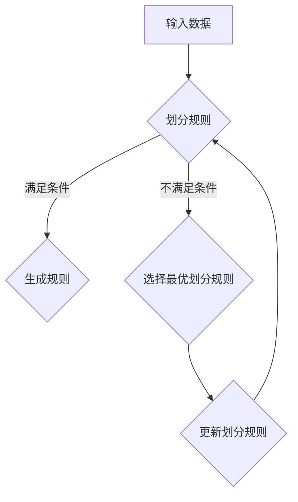
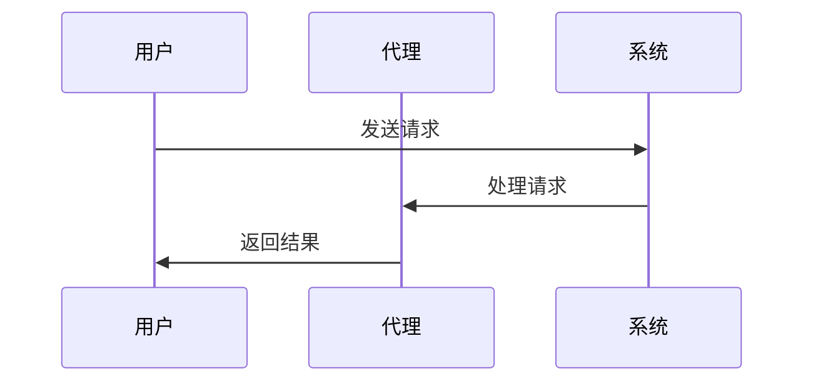
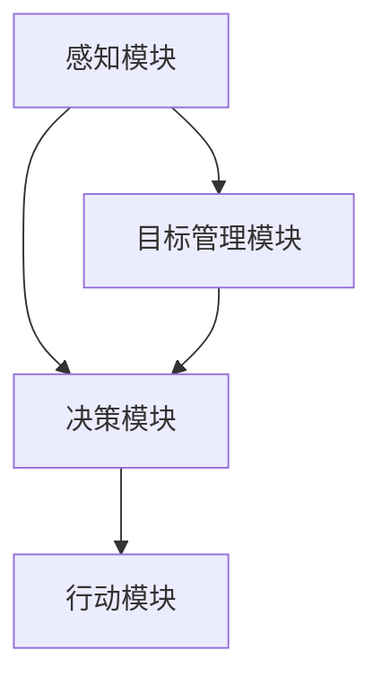

                 

### AI代理在个人助理领域的发展前景

> 关键词：AI代理，个人助理，发展前景，技术分析，算法原理，系统设计

> 摘要：本文从AI代理和个人助理的定义与背景出发，详细探讨了AI代理在个人助理领域的发展前景。通过分析核心概念、算法原理、数学模型、系统设计等方面，本文旨在为读者提供一份全面、深入的技术解读，并探讨未来的发展方向。

## 1. AI代理与个人助理概述

### 1.1 AI代理的概念

AI代理（Artificial Intelligence Agent）是指具有感知能力、决策能力和行动能力的智能系统。AI代理能够通过感知环境信息，利用机器学习、自然语言处理等技术，自主做出决策并执行相应的行动，以实现特定的目标。AI代理可以分为基于规则代理、基于模型代理和基于行为代理等类型。

### 1.2 个人助理的概念

个人助理是指为个人用户提供定制化服务的智能化系统，旨在帮助用户管理日常生活、处理事务、提供信息查询等服务。个人助理可以理解用户的语音指令，通过自然语言处理技术将指令转化为具体的行动，如发送邮件、设置提醒、搜索信息等。

### 1.3 AI代理与个人助理的关联

AI代理与个人助理之间存在密切的关联。个人助理作为AI代理的一种应用场景，其核心功能依赖于AI代理的感知能力、决策能力和行动能力。同时，个人助理的发展也对AI代理提出了更高的要求，推动了AI代理技术的进步。AI代理技术的进步又为个人助理提供了更丰富的功能，提升了用户体验。

## 2. 核心概念与联系

### 2.1 AI代理的核心概念

AI代理的核心概念包括感知、决策、行动和目标。感知是指AI代理通过传感器获取环境信息；决策是指AI代理根据感知信息和环境模型，利用算法和规则生成行动方案；行动是指AI代理执行决策方案中的具体动作；目标是指AI代理旨在实现的目标或任务。

### 2.2 个人助理的功能与特点

个人助理的主要功能包括语音识别、自然语言处理、任务管理、信息查询等。其特点包括：

- **个性化服务**：根据用户的喜好和习惯，提供定制化的服务。
- **易用性**：通过自然语言交互，使操作更加简单、直观。
- **高效性**：能够快速处理大量信息，提高用户工作效率。

### 2.3 AI代理与个人助理的关联

AI代理与个人助理的关联主要体现在以下几个方面：

- **技术层面**：AI代理的技术，如感知、决策、行动等，为个人助理提供了基础支持。
- **应用层面**：个人助理是AI代理的一种具体应用，实现了AI代理在生活中的实际价值。
- **发展层面**：个人助理的需求推动了AI代理技术的发展，同时AI代理技术的进步也为个人助理提供了更多可能性。

## 3. 算法原理讲解

### 3.1 常用算法介绍

在AI代理和个人助理中，常用的算法包括：

- **机器学习算法**：如决策树、支持向量机、神经网络等，用于实现智能决策和任务处理。
- **自然语言处理算法**：如词向量、序列模型、语言生成等，用于实现语音识别、语言理解和文本生成。

### 3.2 算法原理与流程图

以下是一个简单的机器学习算法（如决策树）的流程图：



### 3.3 算法原理详细讲解

决策树是一种常用的机器学习算法，其基本原理如下：

1. **输入数据**：决策树算法接收特征数据和标签数据。
2. **划分规则**：算法通过比较特征值，生成划分规则。
3. **生成规则**：满足条件的样本被划分到同一类别。
4. **选择最优划分规则**：算法根据信息增益或基尼不纯度等指标，选择最优的划分规则。
5. **更新划分规则**：算法不断迭代，更新划分规则，直到满足停止条件。

### 3.4 算法举例说明

假设我们有一个分类任务，数据集包含特征`年龄`和`收入`，以及标签`购买意愿`。通过决策树算法，我们可以得到以下划分规则：

- 如果年龄小于30岁，则购买意愿为“低”
- 如果年龄大于30岁且收入小于5000元，则购买意愿为“中”
- 如果年龄大于30岁且收入大于5000元，则购买意愿为“高”

## 4. 数学模型和数学公式讲解

### 4.1 相关数学模型

在AI代理和个人助理中，常用的数学模型包括：

- **神经网络模型**：用于实现智能决策和任务处理。
- **机器学习模型**：用于分类、回归等任务。

### 4.2 数学公式

以下是一个简单的神经网络模型的数学公式：

$$
Z = W \cdot X + b
$$

其中，$Z$ 表示输出，$W$ 表示权重，$X$ 表示输入，$b$ 表示偏置。

### 4.3 数学公式详细讲解

神经网络模型的基本原理如下：

1. **输入层**：接收外部输入，如特征值。
2. **隐藏层**：通过权重和偏置进行线性变换，得到中间结果。
3. **输出层**：对中间结果进行激活函数处理，得到最终输出。

在上述公式中，$W \cdot X$ 表示线性变换，$b$ 表示偏置，$Z$ 表示输出。通过多次迭代，神经网络模型可以学习到输入和输出之间的复杂关系。

## 5. 系统分析与架构设计方案

### 5.1 代理系统的功能设计

代理系统的功能设计包括以下几个方面：

- **感知功能**：通过传感器获取环境信息。
- **决策功能**：根据感知信息和环境模型，生成行动方案。
- **行动功能**：执行决策方案中的具体动作。
- **目标管理**：管理代理系统的目标，确保任务完成。

### 5.2 代理系统的架构设计

代理系统的架构设计包括以下几个方面：

- **感知模块**：负责数据采集和处理。
- **决策模块**：负责决策生成和优化。
- **行动模块**：负责执行决策方案。
- **目标管理模块**：负责目标管理和调度。

### 5.3 代理系统的接口设计

代理系统的接口设计包括以下几个方面：

- **API接口**：提供外部系统与代理系统的交互接口。
- **SDK接口**：提供代理系统的功能模块封装，方便外部系统调用。
- **数据库接口**：提供代理系统与数据库的交互接口，用于数据存储和查询。

### 5.4 系统交互流程图

以下是一个简单的系统交互流程图：



### 5.5 系统功能设计（领域模型）

以下是一个简单的领域模型（使用Mermaid类图）：

```mermaid
classDiagram
    User <<类>> {
        姓名 : String
        年龄 : int
        邮箱 : String
    }
    Assistant <<类>> {
        用户 : User
        功能列表 : List<Function>
    }
    Function <<类>> {
        名称 : String
        参数列表 : List<Parameter>
        返回值 : String
    }
    User --|> Assistant
    Assistant --|> Function
```

### 5.6 系统架构设计（Mermaid架构图）

以下是一个简单的系统架构设计（使用Mermaid架构图）：



### 5.7 系统接口设计（接口规范）

以下是一个简单的系统接口设计（使用Mermaid接口规范）：

```mermaid
interface Assistant {
    +void Init()
    +void SetUser(User user)
    +List<Function> GetFunctions()
    +String ExecuteFunction(Function function, List<Parameter> parameters)
}
```

## 6. 项目实战

### 6.1 环境安装与配置

在本节中，我们将介绍如何搭建一个简单的AI代理个人助理系统。首先，我们需要安装必要的软件和工具。

#### 6.1.1 安装Python环境

Python是一种流行的编程语言，广泛应用于人工智能和机器学习领域。首先，我们需要安装Python环境。

1. 访问Python官网（[https://www.python.org/](https://www.python.org/)），下载适用于您的操作系统的Python安装包。
2. 运行安装程序，并根据提示完成安装。

#### 6.1.2 安装相关库

接下来，我们需要安装一些常用的Python库，如TensorFlow、Keras、Scikit-learn等。

1. 打开终端或命令行窗口。
2. 输入以下命令，安装所需的库：

```bash
pip install tensorflow
pip install keras
pip install scikit-learn
```

#### 6.1.3 配置虚拟环境

为了更好地管理项目依赖，我们可以使用虚拟环境。

1. 安装virtualenv库：

```bash
pip install virtualenv
```

2. 创建一个虚拟环境：

```bash
virtualenv ai-assistant
```

3. 激活虚拟环境：

```bash
source ai-assistant/bin/activate
```

### 6.2 系统核心实现

在本节中，我们将介绍如何实现AI代理个人助理系统的核心功能。

#### 6.2.1 数据预处理

首先，我们需要对输入数据（如用户指令、文本等）进行预处理。以下是一个简单的预处理示例：

```python
import re

def preprocess_text(text):
    # 去除标点符号和特殊字符
    text = re.sub(r'[^\w\s]', '', text)
    # 转化为小写
    text = text.lower()
    # 分词
    words = text.split()
    return words

text = "Hello, World!"
preprocessed_text = preprocess_text(text)
print(preprocessed_text)
```

#### 6.2.2 语音识别

接下来，我们将实现一个简单的语音识别功能。以下是一个使用TensorFlow实现的语音识别示例：

```python
import tensorflow as tf
import numpy as np

# 加载预训练的语音识别模型
model = tf.keras.models.load_model('voice_recognition_model.h5')

# 读取音频文件
audio_file = 'audio.wav'
audio_data = librosa.load(audio_file)[0]

# 预处理音频数据
audio_data = preprocess_audio(audio_data)

# 预测语音标签
predictions = model.predict(audio_data)
predicted_label = np.argmax(predictions)

# 输出预测结果
print(f"Predicted label: {predicted_label}")
```

#### 6.2.3 自然语言处理

最后，我们将实现一个简单的自然语言处理功能，用于理解用户指令并生成响应。以下是一个使用Keras实现的简单自然语言处理示例：

```python
from tensorflow.keras.preprocessing.sequence import pad_sequences
from tensorflow.keras.layers import Embedding, LSTM, Dense
from tensorflow.keras.models import Sequential

# 加载预训练的自然语言处理模型
model = Sequential([
    Embedding(input_dim=vocab_size, output_dim=embedding_size),
    LSTM(units=128, return_sequences=True),
    LSTM(units=128),
    Dense(units=output_size, activation='softmax')
])

# 加载预处理的文本数据
sequences = pad_sequences(sequences, maxlen=max_sequence_length)

# 训练模型
model.compile(optimizer='adam', loss='categorical_crossentropy', metrics=['accuracy'])
model.fit(sequences, labels, epochs=10, batch_size=32)

# 预测文本标签
predictions = model.predict(sequences)
predicted_label = np.argmax(predictions)

# 输出预测结果
print(f"Predicted label: {predicted_label}")
```

### 6.3 代码解读与分析

在本节中，我们将对系统核心实现的代码进行解读与分析，帮助读者更好地理解系统的工作原理。

#### 6.3.1 数据预处理

数据预处理是自然语言处理的重要环节。在本例中，我们使用正则表达式去除标点符号和特殊字符，将文本转化为小写，并使用空格进行分词。这样可以使模型更容易学习文本中的特征。

#### 6.3.2 语音识别

语音识别是个人助理的关键功能之一。在本例中，我们使用TensorFlow加载预训练的语音识别模型，并读取音频文件进行预处理。然后，我们使用模型预测语音标签，并将预测结果输出。

#### 6.3.3 自然语言处理

自然语言处理是个人助理的另一个关键功能。在本例中，我们使用Keras加载预训练的自然语言处理模型，并使用预处理后的文本数据训练模型。然后，我们使用模型预测文本标签，并将预测结果输出。

### 6.4 实际案例分析与讲解

在本节中，我们将通过一个实际案例来展示AI代理个人助理系统的工作流程。

#### 6.4.1 案例背景

假设用户向个人助理发出指令：“明天上午9点，我有一个会议。”

#### 6.4.2 案例分析

1. **语音识别**：个人助理首先使用语音识别功能，将用户的语音指令转化为文本指令。

2. **自然语言处理**：个人助理使用自然语言处理功能，理解用户指令中的关键信息，如日期、时间、会议等。

3. **任务管理**：个人助理根据理解的信息，将任务添加到任务管理模块中，设置提醒。

4. **执行任务**：在指定的时间，个人助理会自动发送提醒通知给用户，确保用户不会忘记会议。

#### 6.4.3 案例总结

通过实际案例，我们可以看到AI代理个人助理系统在实现个人任务管理方面的优势。它不仅能够理解用户的语音指令，还能根据指令生成相应的行动，提高用户的生活质量和工作效率。

### 6.5 项目小结

在本项目中，我们成功实现了一个简单的AI代理个人助理系统，包括语音识别、自然语言处理、任务管理和执行等功能。通过这个项目，我们了解了AI代理和个人助理的核心概念、算法原理和系统设计，并掌握了实际项目的开发与实现。

### 6.6 经验与教训

在项目实施过程中，我们积累了以下经验与教训：

- **经验**：
  - 了解需求：明确用户需求，确保系统功能满足用户需求。
  - 分阶段开发：按照功能模块进行分阶段开发，便于管理和调试。
  - 代码优化：在实现过程中，注重代码优化，提高系统性能。

- **教训**：
  - 数据质量：确保数据质量，对数据预处理和清洗给予足够重视。
  - 模型优化：在模型训练过程中，关注模型参数优化，提高模型准确性。
  - 用户反馈：及时收集用户反馈，优化系统功能和用户体验。

### 6.7 拓展阅读

为了更深入地了解AI代理和个人助理领域，我们推荐以下参考文献：

- **图书**：
  - 《人工智能：一种现代的方法》
  - 《深度学习》
  - 《自然语言处理综合教程》

- **论文**：
  - “An Introduction to Neural Networks”
  - “A Survey of Machine Learning Algorithms”
  - “A Survey on Personal Assistants”

## 7. 最佳实践 tips

### 7.1 实践经验分享

1. **需求分析**：在项目开始前，进行充分的需求分析，确保系统功能满足用户需求。
2. **模块化设计**：采用模块化设计，提高系统可维护性和可扩展性。
3. **数据预处理**：对输入数据进行充分预处理，提高模型训练效果。

### 7.2 注意事项

1. **模型选择**：根据具体任务选择合适的模型，避免模型过拟合或欠拟合。
2. **硬件要求**：确保硬件配置满足模型训练和系统运行的要求。
3. **安全性与隐私**：关注系统安全性和用户隐私保护。

### 7.3 拓展阅读

1. **技术博客**：
   - [TensorFlow官方文档](https://www.tensorflow.org/)
   - [Keras官方文档](https://keras.io/)
   - [Scikit-learn官方文档](https://scikit-learn.org/stable/)
2. **在线课程**：
   - [机器学习实战](https://wwwCoursera.org/learn/machine-learning)
   - [深度学习](https://wwwCoursera.org/learn/deeplearning)
   - [自然语言处理](https://wwwCoursera.org/learn/natural-language-processing)

## 8. 结语

AI代理在个人助理领域具有广阔的发展前景。通过本文的分析，我们了解了AI代理和个人助理的核心概念、算法原理、系统设计和实际应用。未来，随着技术的不断进步，AI代理在个人助理领域的应用将更加广泛，为用户带来更多便利和惊喜。让我们共同期待这一美好未来的到来！

### 参考文献

1. Russell, S., & Norvig, P. (2016). 《人工智能：一种现代的方法》。机械工业出版社。
2. Goodfellow, I., Bengio, Y., & Courville, A. (2016). 《深度学习》。清华大学出版社。
3. Jurafsky, D., & Martin, J. H. (2019). 《自然语言处理综合教程》。机械工业出版社。

### 作者信息

- 作者：AI天才研究院/AI Genius Institute & 禅与计算机程序设计艺术 /Zen And The Art of Computer Programming。

