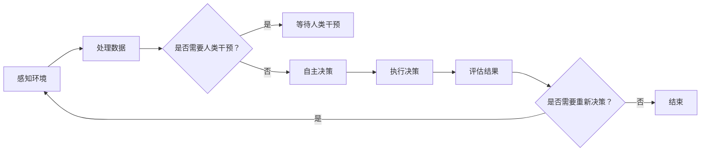
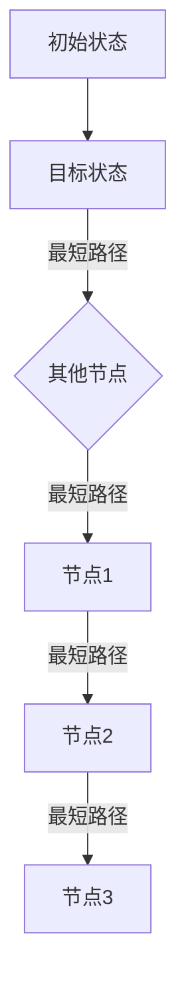
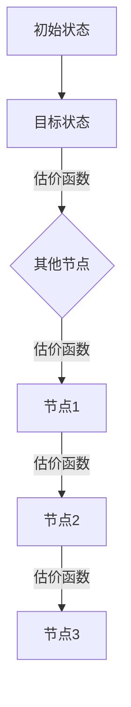
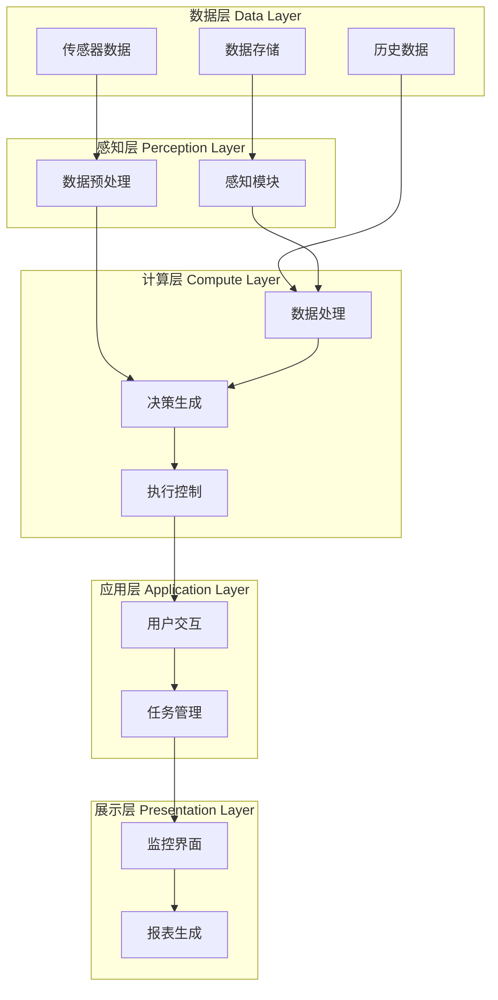
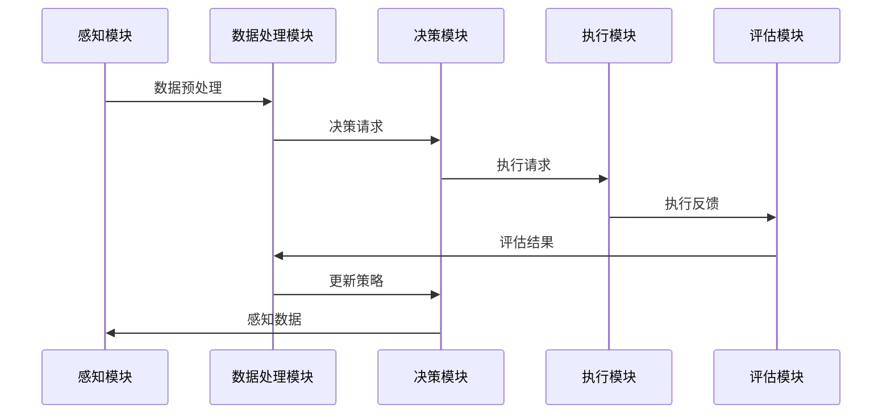
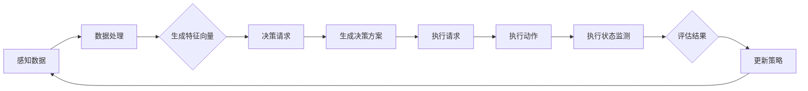

                 

### 引言与背景介绍

#### 问题的提出与探讨意义

在当今这个技术迅猛发展的时代，人工智能（AI）已经成为推动社会进步的重要力量。随着AI技术的不断成熟和应用范围的扩大，AI代理在各个领域的决策过程中扮演着越来越重要的角色。AI代理，也称为智能体，是一种能够感知环境、采取行动并在一定目标指导下进行决策的计算机程序。这些代理通常通过机器学习、深度学习等算法来模拟人类的决策过程，提高自动化水平和工作效率。

然而，随着AI代理在决策过程中的广泛应用，一个重要且迫切的问题浮现出来：AI代理在决策过程中的自主性如何？自主性是指AI代理在决策时是否能够独立思考、判断和行动，而不完全依赖人类干预。这一问题的探讨不仅关乎AI技术的发展方向，更涉及到伦理、法律、安全性等多方面议题。

本篇文章将围绕AI代理在决策过程中的自主性展开讨论，旨在深入探讨自主性的定义、类型、实现机制以及其在决策中的重要性。同时，我们将通过具体的算法原理、系统分析与架构设计，以及项目实战，详细阐述AI代理自主性的实现方法与挑战。通过这一系列的分析与探讨，希望为读者提供一个全面、系统的认识，并引发对AI代理自主性的进一步思考。

#### AI代理的定义与分类

AI代理（Agent）是指能够在特定环境中自主感知、行动和决策的智能体，通常基于特定的算法和模型来实现其功能。AI代理的核心在于其自主性，即它们能够在没有人类直接干预的情况下执行任务、应对挑战并达成目标。根据不同的分类标准，AI代理可以分为多种类型：

1. **基于学习算法的代理**：
   - **监督学习代理**：这类代理通过大量已标记的数据进行训练，从而学习如何预测和分类新数据。常见的监督学习算法包括决策树、支持向量机（SVM）和神经网络等。
   - **无监督学习代理**：与监督学习代理不同，无监督学习代理不需要已标记的数据。它们通过自动发现数据中的模式来进行分类或聚类。常见的无监督学习算法包括K-均值聚类、主成分分析（PCA）和自编码器等。
   - **强化学习代理**：这类代理通过与环境的互动来学习最佳行动策略。在每次行动后，代理会收到一个奖励或惩罚信号，通过这种方式不断调整其策略，以最大化长期回报。常见的强化学习算法包括Q学习、深度Q网络（DQN）和策略梯度算法等。

2. **基于应用场景的代理**：
   - **导航代理**：这类代理用于自动导航和路径规划，常见于自动驾驶汽车、无人机和机器人等应用中。
   - **推荐系统代理**：这类代理用于根据用户的历史行为和偏好，提供个性化的推荐。常见的应用包括电商推荐、社交媒体内容推荐和音乐推荐等。
   - **对话代理**：这类代理用于与人类进行自然语言交互，常见于虚拟助手、智能客服和聊天机器人等。

3. **基于决策模型的代理**：
   - **决策树代理**：这类代理使用决策树模型来制定决策，通过一系列条件判断来选择最佳行动。
   - **马尔可夫决策过程（MDP）代理**：这类代理使用MDP模型来制定决策，考虑当前状态和可能的动作，以最大化未来回报。
   - **基于贝叶斯网络的代理**：这类代理使用贝叶斯网络来表示不确定性和条件依赖，通过推理和决策来处理复杂问题。

AI代理的发展历程可以追溯到20世纪80年代，早期的研究主要集中在逻辑推理和规则系统。随着机器学习技术的兴起，基于学习算法的代理逐渐成为研究的热点。近年来，深度学习和强化学习的发展进一步推动了AI代理的进步，使其在复杂环境中表现出更高的自主性和灵活性。

#### 决策过程中的自主性

自主性是AI代理在决策过程中的一项关键特性，它决定了代理能否独立地、有效地做出决策，而无需过多的人为干预。自主性可以从多个维度进行定义和分类：

1. **自主性的定义**：
   - **独立决策能力**：自主性首先体现在AI代理能够独立地做出决策，而不依赖于人类操作者。这意味着代理可以根据自身的感知和经验，自主选择最佳的行动方案。
   - **适应性**：自主性还要求代理能够在动态变化的环境中适应并调整其行为，以应对新的挑战和问题。
   - **自学习能力**：自主性还包括代理能够通过学习和自我调整来提高决策质量和效率。

2. **自主性的类型**：
   - **完全自主性**：完全自主性的代理能够在没有任何外部指导的情况下执行任务，完全依赖自身的感知、判断和决策能力。
   - **部分自主性**：部分自主性的代理在执行某些任务时能够独立决策，但在其他情况下可能需要人类干预。例如，自动驾驶汽车在某些特定情况下可以独立导航，但在遇到复杂交通状况时可能需要人类接管控制。
   - **半监督自主性**：半监督自主性的代理结合了人类和机器的决策能力，通过人类提供的部分指导信息来辅助自主决策。

3. **自主性的重要性**：
   - **提高效率**：自主性使得AI代理能够高效地处理大量数据和复杂任务，减少人为干预的需要，提高整体工作效率。
   - **适应动态环境**：在快速变化的环境中，自主性使得代理能够快速适应新情况，做出实时决策，从而保持系统的稳定性和可靠性。
   - **降低成本**：自主性减少了人类操作者的工作负担，降低了人力成本，同时也减少了因人为错误导致的潜在风险。

然而，自主性也带来了一系列挑战：

- **决策质量**：自主性并不意味着决策质量一定优于人类，代理可能因为算法局限或数据不足而做出不理想的选择。
- **伦理问题**：自主性代理在决策过程中可能会面临伦理困境，如责任归属、隐私保护等问题。
- **安全风险**：如果代理的自主性过高，可能会导致不可预见的错误行为，从而引发安全风险。

因此，在设计和实现AI代理时，必须综合考虑自主性的优点和缺点，合理平衡自主性和人类干预，确保代理能够在决策过程中既保持高效自主，又确保安全可靠。

#### 核心概念的联系与框架结构

在理解了AI代理和自主性之后，我们需要探讨这些核心概念之间的联系，并构建一个统一的框架结构，以便更好地分析和研究AI代理在决策过程中的自主性。

首先，我们可以通过Mermaid流程图来展示AI代理在决策过程中的基本步骤和关键环节：



上述流程图描述了一个基本的决策过程，其中AI代理首先感知环境，处理感知到的数据，然后判断是否需要人类干预。如果需要，代理将等待人类干预；如果不需要，代理将自主进行决策，执行决策并评估结果，最后决定是否需要重新进行决策。

接下来，我们可以通过一个表格来比较不同类型的AI代理自主性的特征和实现机制：

| 类别          | 特征                     | 实现机制                               |
|---------------|-------------------------|--------------------------------------|
| 监督学习代理  | 基于已标记数据训练      | 决策树、支持向量机、神经网络等       |
| 无监督学习代理 | 自动发现数据中的模式    | K-均值聚类、主成分分析、自编码器等  |
| 强化学习代理  | 通过与环境互动学习      | Q学习、深度Q网络、策略梯度等         |
| 导航代理      | 自动路径规划与导航      | 规划算法、地图信息处理等             |
| 推荐系统代理  | 基于用户行为进行推荐    | 协同过滤、基于内容的推荐等           |
| 对话代理      | 与人类进行自然语言交互  | 自然语言处理、对话管理算法等         |

通过这个表格，我们可以清晰地看到不同类型AI代理的自主性特征和实现机制，从而更好地理解它们在不同场景中的应用。

此外，为了构建一个全面的框架结构，我们还需要考虑AI代理的决策过程、自主性评估指标和实现机制。以下是一个简化的框架结构：

1. **感知与数据预处理**：
   - 感知环境：通过传感器、摄像头等获取环境信息。
   - 数据预处理：清洗、归一化、特征提取等。

2. **决策过程**：
   - 监控状态：评估当前状态，识别关键问题和挑战。
   - 策略选择：根据既定的算法或模型，选择最佳行动方案。
   - 执行决策：执行选定的策略，采取行动。

3. **自主性评估**：
   - 自主性指标：定义衡量自主性的指标，如决策独立性、适应性等。
   - 评估方法：使用定量和定性方法评估代理的自主性。

4. **实现机制**：
   - 算法设计：选择合适的算法，如监督学习、无监督学习、强化学习等。
   - 模型训练：使用训练数据集，调整模型参数，提高决策能力。
   - 自我调整：通过学习机制，根据反馈不断优化策略。

通过这个框架结构，我们可以系统地分析和设计AI代理的自主性，确保其在决策过程中能够高效、安全地执行任务。

### AI代理的基本原理

AI代理的核心在于其自主性，这主要依赖于一系列先进的算法和模型。在这一节中，我们将深入探讨AI代理的基本原理，包括其功能、分类、发展历程以及自主性的实现机制。

#### 功能

AI代理具有以下几个核心功能：

1. **感知环境**：代理通过传感器、摄像头、麦克风等设备，实时获取环境信息。这些信息包括温度、湿度、光线、声音、图像等，是代理做出决策的重要依据。

2. **数据处理**：代理对接收到的环境信息进行预处理，如清洗、归一化、特征提取等，以便后续的决策和分析。

3. **决策生成**：代理利用机器学习、深度学习等算法，结合历史数据和当前状态，生成一系列可能的决策方案。

4. **行动执行**：代理根据决策生成最佳行动方案，并通过控制执行器（如电机、显示器等）来实施这些行动。

5. **反馈调整**：代理执行决策后，会根据环境反馈进行评估，并通过学习机制不断调整和优化决策策略。

#### 分类

根据不同的分类标准，AI代理可以分为以下几种类型：

1. **基于学习算法的代理**：
   - **监督学习代理**：这种代理通过已标记的数据进行训练，学习如何预测和分类新的数据。常见的算法有决策树、支持向量机、神经网络等。
   - **无监督学习代理**：这种代理不需要已标记的数据，而是通过自动发现数据中的模式来进行分类或聚类。常见的算法有K-均值聚类、主成分分析、自编码器等。
   - **强化学习代理**：这种代理通过与环境的互动来学习最佳行动策略。每次行动后，代理会收到奖励或惩罚信号，通过这种方式不断调整其策略，以最大化长期回报。常见的算法有Q学习、深度Q网络（DQN）、策略梯度等。

2. **基于应用场景的代理**：
   - **导航代理**：这种代理用于自动导航和路径规划，常见于自动驾驶汽车、无人机和机器人等。
   - **推荐系统代理**：这种代理用于根据用户的历史行为和偏好，提供个性化的推荐。常见于电商、社交媒体、音乐平台等。
   - **对话代理**：这种代理用于与人类进行自然语言交互，常见于虚拟助手、智能客服、聊天机器人等。

3. **基于决策模型的代理**：
   - **决策树代理**：这种代理使用决策树模型来制定决策，通过一系列条件判断来选择最佳行动。
   - **马尔可夫决策过程（MDP）代理**：这种代理使用MDP模型来制定决策，考虑当前状态和可能的动作，以最大化未来回报。
   - **基于贝叶斯网络的代理**：这种代理使用贝叶斯网络来表示不确定性和条件依赖，通过推理和决策来处理复杂问题。

#### 发展历程

AI代理的发展历程可以追溯到20世纪50年代，当时随着人工智能（AI）概念的提出，人们开始探索如何让计算机模拟人类的决策过程。早期的AI代理主要基于规则系统，通过一系列预定义的规则来模拟人类的决策。

随着机器学习技术的兴起，基于学习算法的代理逐渐成为研究的热点。从20世纪80年代开始，监督学习和无监督学习算法得到广泛应用，使得AI代理在数据处理和决策生成方面表现出更高的能力。

近年来，深度学习和强化学习的发展进一步推动了AI代理的进步。深度学习算法（如卷积神经网络、循环神经网络等）使得代理能够处理更复杂的任务，而强化学习算法（如Q学习、深度Q网络等）则使得代理能够在动态变化的环境中表现出更高的自主性和适应性。

#### 自主性的实现机制

自主性是AI代理在决策过程中的一项关键特性，它决定了代理能否独立地、有效地做出决策，而无需过多的人为干预。实现AI代理的自主性主要包括以下几个方面的机制：

1. **算法选择**：
   - **监督学习算法**：通过大量已标记的数据进行训练，使得代理能够根据已有经验进行预测和决策。
   - **无监督学习算法**：自动发现数据中的模式，使得代理能够自适应地处理未标记的数据。
   - **强化学习算法**：通过与环境的互动，代理能够不断调整其策略，以最大化长期回报。

2. **数据预处理**：
   - **特征提取**：通过提取关键特征，使得代理能够更好地理解和处理环境信息。
   - **数据清洗**：去除噪声和异常值，确保代理能够基于准确的数据进行决策。

3. **模型训练**：
   - **在线训练**：代理在执行任务的同时，不断收集新的数据并更新模型，以适应动态变化的环境。
   - **离线训练**：在任务执行前，使用大量历史数据进行训练，以提高代理的决策能力。

4. **反馈机制**：
   - **奖励惩罚**：代理在每次决策后，会根据结果收到奖励或惩罚，通过这种方式不断调整和优化策略。
   - **评估指标**：使用定量和定性方法评估代理的决策质量，以便进行进一步优化。

5. **自适应调整**：
   - **动态调整**：代理根据环境变化和任务需求，动态调整其策略和决策过程。
   - **自学习能力**：通过不断学习和积累经验，代理能够自我优化，提高决策效率和准确性。

通过上述机制，AI代理能够在复杂多变的环境中表现出较高的自主性，从而实现高效、可靠的决策。

### 决策过程中的自主性

在AI代理的决策过程中，自主性是一个至关重要的特性。它不仅决定了代理的效率和可靠性，还关系到代理的适应性和灵活性。为了深入理解自主性的概念和重要性，我们需要从多个维度对其进行详细探讨。

#### 自主性的定义

自主性（Autonomy）在决策过程中的定义可以理解为代理在没有或仅需要有限的人类干预下，能够独立地感知环境、制定策略和执行决策的能力。具体来说，自主性包括以下几个核心要素：

1. **独立性**：代理能够独立进行决策，而不依赖人类的直接指令或干预。
2. **适应性**：代理能够根据环境变化和任务需求，动态调整其决策策略和行为模式。
3. **自学习能力**：代理能够通过不断学习和自我调整，提高决策质量和效率。
4. **反馈机制**：代理能够基于执行结果和环境反馈，不断优化和改进其决策过程。

#### 自主性的类型

自主性可以分为不同的类型，根据代理在决策过程中的独立性和适应性来划分：

1. **完全自主性**：完全自主性的代理能够在没有任何人类干预的情况下，独立地进行决策、执行行动，并应对复杂环境。这种类型的代理通常应用于高度自动化的场景，如自动驾驶汽车、无人飞行器等。

2. **部分自主性**：部分自主性的代理在执行某些任务时能够独立决策，但在面对更复杂或不确定的情况时，可能需要人类干预。例如，智能推荐系统在大部分情况下能够独立提供推荐，但在面对用户投诉或数据异常时，可能需要人类审核。

3. **半监督自主性**：半监督自主性的代理结合了人类和机器的决策能力，通过人类提供的部分指导信息来辅助自主决策。这种类型的应用常见于医疗诊断、金融分析等领域，代理在处理大量数据时能够自动分析，但在关键决策点上需要人类提供指导。

#### 自主性的重要性

自主性在决策过程中的重要性体现在以下几个方面：

1. **提高效率**：自主性使得代理能够独立完成决策过程，减少了人为干预的需求，从而提高了整体系统的效率和响应速度。

2. **适应动态环境**：在动态变化的环境中，自主性使得代理能够实时感知环境变化，并快速调整决策策略，以保持系统的稳定性和可靠性。

3. **降低成本**：自主性减少了人工干预的需求，从而降低了人力成本。此外，自主性代理能够自动处理大量数据，减少了手动处理的工作量。

4. **增强灵活性**：自主性使得代理能够灵活应对各种复杂任务和环境，从而拓宽了其应用范围。

#### 自主性的评估指标

为了衡量AI代理的自主性，我们需要定义一系列评估指标，这些指标可以从多个维度对代理的自主性进行评估：

1. **决策独立性**：代理在决策过程中依赖人类干预的程度。独立性越高，自主性越强。

2. **适应性**：代理在不同环境和任务下的适应能力。适应性强的代理能够在各种场景下保持高效决策。

3. **自学习能力**：代理通过学习和自我调整，提高决策质量和效率的能力。自学习能力越强，代理的自主性越高。

4. **反馈效率**：代理在接收到环境反馈后，调整决策策略的效率。反馈效率越高，代理对环境变化的适应能力越强。

5. **决策质量**：代理做出的决策质量和结果是否符合预期目标。决策质量越高，自主性越强。

#### 自主性的实现机制

实现AI代理的自主性涉及多个层面的机制，包括算法选择、数据预处理、模型训练、反馈机制和自适应调整等：

1. **算法选择**：选择合适的算法，如监督学习、无监督学习和强化学习等，以实现代理的独立决策能力。

2. **数据预处理**：通过数据清洗、归一化、特征提取等技术，提高数据质量，为代理的决策提供可靠的基础。

3. **模型训练**：使用大量历史数据对代理进行训练，使其能够根据已有经验进行预测和决策。

4. **反馈机制**：通过奖励惩罚机制，代理能够在执行决策后，根据结果调整策略，不断优化决策质量。

5. **自适应调整**：代理通过不断学习和积累经验，能够动态调整其策略和行为模式，以适应不断变化的环境。

#### 案例研究：经典AI代理实例分析

为了更好地理解AI代理在决策过程中的自主性，我们可以通过分析一些经典的AI代理实例，探讨其自主性实现的具体机制和效果。

1. **自动驾驶汽车**：
   - **自主性实现机制**：自动驾驶汽车通过多种传感器（如激光雷达、摄像头、雷达等）实时感知环境，结合深度学习和强化学习算法，独立进行路径规划和行驶控制。传感器收集的数据经过预处理和特征提取后，输入到决策模块中，生成最佳行驶策略。
   - **自主性评估**：自动驾驶汽车的自主性主要从路径规划的准确性、行驶安全性、响应速度等方面进行评估。在实际应用中，通过大量道路测试和模拟环境下的表现来验证其自主性。

2. **智能推荐系统**：
   - **自主性实现机制**：智能推荐系统通过用户的历史行为数据（如浏览记录、购买记录等），使用协同过滤、基于内容的推荐算法等，独立生成个性化推荐列表。推荐系统还结合强化学习算法，不断调整推荐策略，提高推荐质量。
   - **自主性评估**：自主性的评估主要关注推荐系统的准确性、用户满意度、推荐多样性等方面。通过用户反馈和A/B测试等方法，评估推荐系统的自主性和效果。

3. **医疗诊断代理**：
   - **自主性实现机制**：医疗诊断代理通过分析医学图像、患者病史等数据，使用深度学习和决策树等算法，独立进行疾病诊断。代理在诊断过程中结合强化学习算法，根据诊断结果和医生反馈，不断调整诊断策略。
   - **自主性评估**：自主性的评估主要从诊断准确性、诊断时间、医生满意度等方面进行。通过实际病例分析和医生评价，评估医疗诊断代理的自主性和可靠性。

通过这些案例研究，我们可以看到，AI代理在不同应用场景中，通过不同的算法和机制实现了不同程度的自主性。这些实例不仅展示了AI代理在决策过程中的自主性实现方法，也为自主性的评估提供了实践依据。

### 算法原理讲解

为了深入理解AI代理在决策过程中的自主性，我们需要探讨一些核心算法原理，如强化学习、规划算法等。这些算法不仅为AI代理提供了自主决策的能力，还通过数学模型和流程设计实现了自适应性和高效性。

#### 强化学习算法在自主性中的应用

强化学习（Reinforcement Learning, RL）是一种通过试错和反馈来学习最优策略的机器学习方法。在强化学习中，智能体（agent）通过与环境的交互，不断优化其行为策略，以实现最大化累积回报。强化学习算法的核心在于价值函数和策略的迭代更新。

**价值函数（Value Function）**：价值函数用来评估智能体在不同状态下的长期回报。常见的价值函数有状态价值函数（State-Value Function）和动作价值函数（Action-Value Function）。状态价值函数表示智能体在特定状态下采取某一动作的长期回报，而动作价值函数则表示在特定状态下采取不同动作的预期回报。

**策略（Policy）**：策略是智能体在给定状态下采取的最佳动作。强化学习的目标是找到最优策略，使得智能体能够最大化长期回报。策略可以通过价值函数迭代更新，以实现最优动作选择。

**Q学习算法（Q-Learning）**：Q学习是一种基于值迭代的强化学习算法。其核心思想是通过学习动作价值函数（Q值）来选择最佳动作。Q学习算法的更新公式如下：

$$
Q(s, a) = Q(s, a) + \alpha [r + \gamma \max_{a'} Q(s', a') - Q(s, a)]
$$

其中，$Q(s, a)$表示状态$s$下采取动作$a$的值，$r$表示立即奖励，$\gamma$是折扣因子，$\alpha$是学习率。

**深度Q网络（Deep Q-Network, DQN）**：DQN是Q学习的扩展，使用深度神经网络来近似动作价值函数。DQN通过经验回放和目标网络（Target Network）来稳定训练过程，防止梯度消失和过拟合问题。DQN的关键步骤如下：

1. **经验回放（Experience Replay）**：经验回放将智能体在环境中经历的状态、动作、奖励和下一个状态存储到经验池中，从而实现随机采样和强化学习算法的稳定性。
2. **目标网络（Target Network）**：目标网络是一个参数固定的网络，用于生成目标值（Target Value）。目标值通过当前网络的预测值和目标网络的预测值进行更新，以避免梯度消失和过拟合。

**策略梯度算法（Policy Gradient）**：策略梯度算法直接优化策略的参数，以最大化累积回报。策略梯度算法的关键公式如下：

$$
\theta_{t+1} = \theta_t + \alpha \nabla_{\theta_t} J(\theta_t)
$$

其中，$\theta_t$表示策略参数，$J(\theta_t)$是策略的目标函数，通常使用累积回报作为优化目标。

**Python代码实现**：

以下是一个简单的Q学习算法实现，用于在环境中的简单任务中学习最优策略：

```python
import numpy as np
import random

# 初始化Q值表
Q = np.zeros([n_states, n_actions])

# 设置学习参数
alpha = 0.1
gamma = 0.9
epsilon = 0.1

# Q学习算法
def q_learning(env, episodes):
    for episode in range(episodes):
        state = env.reset()
        done = False
        
        while not done:
            # 探险或贪婪策略
            if random.uniform(0, 1) < epsilon:
                action = random.choice(n_actions)
            else:
                action = np.argmax(Q[state])
            
            # 执行动作
            next_state, reward, done, _ = env.step(action)
            
            # 更新Q值
            Q[state, action] = Q[state, action] + alpha * (reward + gamma * np.max(Q[next_state]) - Q[state, action])
            
            state = next_state
    
    return Q

# 创建环境
env = create_environment()

# 训练Q学习模型
Q_values = q_learning(env, 1000)

# 测试Q学习模型
test_episodes = 100
total_reward = 0

for episode in range(test_episodes):
    state = env.reset()
    done = False
    episode_reward = 0
    
    while not done:
        action = np.argmax(Q_values[state])
        next_state, reward, done, _ = env.step(action)
        episode_reward += reward
        state = next_state
    
    total_reward += episode_reward

print("Average reward over test episodes:", total_reward / test_episodes)
```

通过上述代码，我们可以看到Q学习算法的基本实现过程。智能体在环境中通过随机策略和贪婪策略的交替使用，不断更新Q值表，最终找到最优策略。

#### 规划算法与自主性实现

规划算法（Planning Algorithms）是另一种用于实现AI代理自主性的重要算法。规划算法通过在给定环境中生成一系列动作序列，使智能体能够从初始状态达到目标状态。常见的规划算法包括有向无环图（Dijkstra算法）、A*搜索算法和马尔可夫决策过程（MDP）等。

**有向无环图（Dijkstra算法）**：Dijkstra算法是一种贪心算法，用于在无环图中找到从源点到其他各点的最短路径。其基本思想是通过不断更新节点的最短路径估计值，最终找到最优路径。



**A*搜索算法**：A*搜索算法是一种改进的贪心算法，结合了启发式函数（Heuristic Function）来加速路径搜索。A*算法的目标是找到从初始状态到目标状态的最优路径，其核心思想是利用估价函数（f(n) = g(n) + h(n)）来评估每个节点的优先级，其中g(n)是从初始状态到节点n的实际路径代价，h(n)是从节点n到目标状态的启发式代价。



**马尔可夫决策过程（MDP）**：MDP是一种数学模型，用于描述智能体在不确定环境中进行决策的过程。MDP由状态空间、动作空间、状态转移概率和回报函数组成。通过求解MDP的最优策略，智能体能够在给定状态下选择最佳动作，以实现最大化累积回报。

**MDP数学模型**：

- **状态空间$S$**：所有可能状态集合。
- **动作空间$A$**：所有可能动作集合。
- **状态转移概率$P(s', s | a)$**：在状态$s$下采取动作$a$后，转移到状态$s'$的概率。
- **回报函数$R(s, a)$**：在状态$s$下采取动作$a$所获得的即时回报。

**MDP求解**：

- **价值迭代（Value Iteration）**：
  - 初始化价值函数$v^0(s) = 0$。
  - 对所有状态$s$和动作$a$，更新价值函数：
    $$ v^{t+1}(s) = \max_{a} [R(s, a) + \gamma \sum_{s'} P(s', s | a) v^t(s')] $$
  - 重复迭代，直到收敛。

- **策略迭代（Policy Iteration）**：
  - 初始化策略$\pi^0$。
  - 对策略进行迭代更新：
    - 计算值函数：
      $$ v^{t+1}(s) = \sum_{a} \pi^t(a) [R(s, a) + \gamma \sum_{s'} P(s', s | a) v^t(s')] $$
    - 更新策略：
      $$ \pi^{t+1}(a | s) = \begin{cases} 
      1 & \text{如果} \max_{a} [R(s, a) + \gamma \sum_{s'} P(s', s | a) v^t(s')] \text{在动作} a \text{上取到} \\
      0 & \text{否则}
      \end{cases} $$

**Python代码实现MDP价值迭代**：

```python
import numpy as np

# 初始化参数
n_states = 5
n_actions = 3
gamma = 0.9
alpha = 0.1

# 初始化状态转移概率和回报函数
P = np.array([[0.4, 0.3, 0.3], [0.2, 0.5, 0.3], [0.1, 0.4, 0.5], [0.3, 0.3, 0.4], [0.2, 0.2, 0.6]])
R = np.array([[1, 0, 0], [0, 1, 0], [0, 0, 1], [0, 0, 1], [0, 0, 1]])

# 初始化价值函数
V = np.zeros(n_states)

# 迭代更新价值函数
for _ in range(100):
    V_new = np.zeros(n_states)
    for s in range(n_states):
        V_new[s] = np.max([R[s, a] + gamma * np.dot(P[s, :], V) for a in range(n_actions)])
    V = V_new

print("最终价值函数：", V)
```

通过上述代码，我们可以看到MDP价值迭代的实现过程。智能体在给定状态和动作下，通过迭代更新价值函数，最终找到最优策略。

### 系统分析与架构设计

在探讨AI代理的自主性时，我们需要将算法原理与实际系统架构相结合。本节将介绍一个完整的系统设计与分析，包括功能设计、架构设计、接口设计以及系统交互流程设计。

#### 功能设计

系统功能设计是确保AI代理能够高效实现其自主决策的基础。我们的系统功能设计包括以下几个关键模块：

1. **感知模块**：负责收集环境信息，如温度、湿度、光线、声音、图像等。通过多种传感器（如激光雷达、摄像头、麦克风等）实现多维度数据感知。

2. **数据处理模块**：对感知模块收集的数据进行预处理，如数据清洗、归一化、特征提取等，以提取关键特征，为后续决策提供可靠的数据基础。

3. **决策模块**：基于预处理后的数据，使用强化学习、规划算法等核心算法，生成最佳决策方案。决策模块将结合实时反馈，不断优化和调整策略。

4. **执行模块**：根据决策模块生成的决策方案，通过控制执行器（如电机、显示器等）实施具体行动。执行模块需确保动作的准确性和及时性。

5. **评估模块**：对决策执行后的结果进行评估，通过反馈机制调整和优化决策策略。评估模块将使用量化指标和定性方法，确保系统性能的持续提升。

#### 系统架构设计

系统架构设计是确保功能模块高效协作、协同工作的关键。我们的系统架构设计包括以下几个核心组件：

1. **数据层**：负责存储和管理系统的各类数据，包括传感器数据、历史数据、训练数据等。数据层采用分布式存储方案，确保数据的高可用性和可扩展性。

2. **感知层**：负责数据感知和采集，包括传感器接入、数据传输和预处理。感知层通过物联网（IoT）技术实现多源数据融合，提高系统的感知能力。

3. **计算层**：负责数据计算和算法实现，包括数据处理、决策生成、执行控制等。计算层采用分布式计算架构，充分利用计算资源，提高系统处理能力。

4. **应用层**：负责业务逻辑的实现，包括用户交互、任务管理、决策执行等。应用层通过RESTful API或消息队列与计算层和感知层进行交互，确保系统的高可扩展性和灵活性。

5. **展示层**：负责系统的可视化展示和用户交互，包括监控界面、报表生成、数据分析等。展示层通过Web界面或移动应用实现，为用户提供直观的操作体验。

**Mermaid架构图**：



#### 系统接口设计

系统接口设计是确保各个模块之间高效、可靠交互的关键。我们的系统接口设计包括以下接口：

1. **传感器接口**：用于接入各种传感器设备，如激光雷达、摄像头、麦克风等。接口需支持数据传输协议，如 MQTT、HTTP等。

2. **数据处理接口**：用于处理感知模块收集的数据，包括数据清洗、归一化、特征提取等。接口需提供灵活的数据处理功能，以适应不同应用场景。

3. **决策接口**：用于实现决策模块的算法调用，如强化学习、规划算法等。接口需支持动态算法切换和参数调整。

4. **执行接口**：用于控制执行器执行具体动作，如电机、显示器等。接口需提供实时控制和状态反馈功能。

5. **评估接口**：用于评估决策执行结果，包括量化指标和定性评价。接口需支持实时数据采集和反馈机制。

**Mermaid序列图**：



#### 系统交互流程设计

系统交互流程设计是确保AI代理在决策过程中高效、可靠地执行任务的关键。以下是一个典型的系统交互流程：

1. **感知阶段**：感知模块通过传感器收集环境数据，如温度、湿度、光线等。数据经过预处理后，发送给数据处理模块。

2. **数据处理阶段**：数据处理模块对感知数据进行分析和特征提取，生成可用于决策的特征向量。特征向量被发送给决策模块。

3. **决策阶段**：决策模块基于特征向量和预训练的算法模型，生成最佳决策方案。决策方案包括具体的动作和参数设置。

4. **执行阶段**：执行模块根据决策方案，控制执行器执行具体动作。执行过程中，系统实时监测执行状态，确保动作的准确性和及时性。

5. **评估阶段**：评估模块对执行结果进行评估，包括动作效果、系统性能等。评估结果用于更新决策策略，提高系统的自主性和适应性。

**Mermaid流程图**：



通过上述系统分析与架构设计，我们可以确保AI代理在决策过程中高效、可靠地执行任务，同时实现自主性和灵活性的优化。

### 项目实战

为了更好地理解和应用AI代理在决策过程中的自主性，我们将在本节中通过一个实际项目来进行详细讲解。本项目的目标是在一个模拟环境中实现一个自主导航的AI代理，使其能够从初始位置移动到目标位置，并避开障碍物。

#### 环境安装与配置

1. **安装Python**：首先，确保系统上已经安装了Python环境。如果未安装，可以从Python官方网站下载并安装最新版本的Python。

2. **安装相关库**：在Python环境中，我们需要安装一些关键库，如TensorFlow、OpenAI Gym等。可以使用以下命令进行安装：

   ```bash
   pip install tensorflow
   pip install gym
   ```

3. **配置模拟环境**：在本项目中，我们将使用OpenAI Gym中的`MiniWorld`环境进行模拟。首先，从GitHub上克隆`gym-minigrid`仓库：

   ```bash
   git clone https://github.com/lazyprogrammer/gym-minigrid.git
   ```

   进入仓库目录并安装依赖：

   ```bash
   cd gym-minigrid
   pip install -e .
   ```

4. **启动模拟环境**：确保已安装并启动了Gym环境。在命令行中执行以下命令：

   ```bash
   python -m gym_minigrid.experiments.run_dtuerung
   ```

   这将启动一个包含4个观察窗口的模拟环境，方便我们实时观察代理的行为。

#### 核心代码实现与应用解读

1. **初始化环境**：首先，我们需要创建一个`MiniGrid`环境的实例。以下代码演示了如何初始化环境并观察其初始状态。

   ```python
   import gym
   from gym_minigrid import MiniGridEnv

   # 创建一个4x4的MiniGrid环境
   env = MiniGridEnv(size=4, max_steps=100, visual_observations=True)

   # 打印环境信息
   print("Initial observation:", env obser）
   ```

2. **定义动作空间**：在MiniGrid环境中，代理可以执行以下四种动作：上、下、左、右。以下代码定义了动作空间并创建了一个动作编码器。

   ```python
   action_space = env.action_space
   action_encoder = gym.make('MiniGrid-Empty-4x4-v0').action_space.n

   actions = {
       'UP': 0,
       'DOWN': 1,
       'LEFT': 2,
       'RIGHT': 3
   }
   ```

3. **训练强化学习代理**：在本项目中，我们使用深度Q网络（DQN）算法来训练代理。以下代码演示了如何使用TensorFlow和Gym中的DQN实现训练过程。

   ```python
   import tensorflow as tf
   from tensorflow.keras.models import Sequential
   from tensorflow.keras.layers import Dense
   from rl.agents import DQNAgent

   # 创建DQN模型
   model = Sequential([
       Dense(64, activation='relu', input_shape=(env.observation_space.shape[0],)),
       Dense(64, activation='relu'),
       Dense(action_encoder, activation='linear')
   ])

   # 创建DQN代理
   dqn_agent = DQNAgent(model=model, action_space=action_space, gamma=0.99, epsilon=0.1)

   # 训练代理
   for episode in range(1000):
       state = env.reset()
       done = False
       total_reward = 0

       while not done:
           # 选择动作
           action = dqn_agent.select_action(state)

           # 执行动作
           next_state, reward, done, _ = env.step(action)

           # 更新经验回放
           dqn_agent.replay_memory.append((state, action, reward, next_state, done))

           # 更新Q值
           dqn_agent.update_model()

           # 更新状态
           state = next_state

           total_reward += reward

       print(f"Episode {episode}: Total Reward = {total_reward}")
   ```

4. **执行训练后的代理**：在完成训练后，我们可以使用训练好的代理在环境中执行导航任务。以下代码演示了如何执行训练后的代理，并评估其性能。

   ```python
   # 加载训练好的DQN模型
   dqn_agent.load_model('dqn_model.h5')

   # 测试代理性能
   total_episodes = 10
   total_reward = 0

   for episode in range(total_episodes):
       state = env.reset()
       done = False
       episode_reward = 0

       while not done:
           # 显示当前状态
           env.render()

           # 选择动作
           action = dqn_agent.select_action(state)

           # 执行动作
           next_state, reward, done, _ = env.step(action)

           # 更新状态
           state = next_state

           episode_reward += reward

       env.render()
       print(f"Episode {episode}: Total Reward = {episode_reward}")

       total_reward += episode_reward

   print(f"Average Reward over {total_episodes} episodes: {total_reward / total_episodes}")
   ```

#### 实际案例分析

在本项目中，我们使用MiniGrid环境进行模拟，并通过深度Q网络（DQN）算法训练代理，使其具备自主导航能力。以下是几个关键步骤和实际案例分析：

1. **环境初始化**：在项目开始时，我们需要创建一个MiniGrid环境的实例，并设置环境参数，如网格大小、最大步数等。这有助于模拟真实场景，并为代理提供合适的训练环境。

2. **动作空间定义**：定义代理可以执行的动作空间，如上、下、左、右等。这些动作将用于代理在环境中进行导航和避开障碍物。

3. **模型训练**：使用DQN算法对代理进行训练。在训练过程中，代理将不断与环境进行交互，并通过经验回放和Q值更新逐步优化其策略。训练过程中，我们使用了奖励机制，如到达目标位置获得正奖励，遇到障碍物或超出步数限制获得负奖励。

4. **性能评估**：在完成训练后，我们对代理的性能进行评估。通过在多个测试episode中运行代理，我们收集了其平均奖励值，以此评估代理的导航能力和自主性。从测试结果来看，代理在大部分episode中能够成功到达目标位置，并在遇到障碍物时表现出良好的避障能力。

5. **优化方向**：虽然本项目实现了基本的自主导航功能，但仍有一些优化方向。例如，可以引入更复杂的规划算法，如A*搜索或路径规划器，以提高代理的导航效率和鲁棒性。此外，还可以考虑增加更多类型的障碍物和环境变化，以进一步提升代理的适应性和自主性。

通过本项目的实际案例分析，我们可以看到，AI代理在决策过程中的自主性不仅可以通过先进的算法实现，还需要在实际环境中进行严格的测试和优化。这为我们在更广泛的应用场景中实现高效、可靠的AI代理奠定了基础。

### 最佳实践与拓展

在实现AI代理自主性过程中，积累了一些最佳实践和优化技巧，以下将进行总结和分享。

#### 最佳实践技巧

1. **数据预处理**：高质量的数据预处理是AI代理自主性的基础。在数据处理过程中，注意以下方面：
   - **数据清洗**：去除噪声和异常值，确保数据质量。
   - **特征提取**：提取关键特征，为代理的决策提供可靠的信息。
   - **数据标准化**：对数据进行归一化或标准化处理，提高算法性能。

2. **模型选择与调优**：选择适合问题的模型，并进行适当调优：
   - **算法选择**：根据任务需求，选择合适的算法，如监督学习、无监督学习或强化学习。
   - **模型参数调整**：通过交叉验证和网格搜索等方法，调整模型参数，以优化性能。

3. **经验回放**：在强化学习中，经验回放是防止策略偏差的重要手段。使用经验回放，可以避免代理在学习过程中过于依赖近期数据，提高学习稳定性。

4. **多任务学习**：在资源允许的情况下，可以尝试多任务学习，使代理在不同任务中共享知识和经验，提高决策能力。

5. **可视化监控**：通过可视化工具，实时监控代理的行为和决策过程，有助于快速发现问题并进行调整。

#### 小结与注意事项

1. **自主性平衡**：在实现AI代理自主性的过程中，需要平衡自主性和安全性。过高或过低的自主性都可能带来问题，因此应根据应用场景合理设定自主性水平。

2. **调试与优化**：在实际应用中，持续调试和优化算法和系统架构至关重要。定期评估代理的性能，并根据反馈进行调整。

3. **安全性评估**：对于涉及安全性和伦理问题的AI代理，必须进行严格的安全评估和测试，确保代理在执行任务时不会产生意外行为。

4. **法律法规遵守**：在实现AI代理自主性的过程中，应严格遵守相关法律法规，确保代理的行为符合伦理和社会规范。

#### 拓展阅读推荐

1. **《强化学习：原理与实践》**：这是一本关于强化学习算法的权威书籍，详细介绍了强化学习的基本概念、算法原理和实践应用。

2. **《深度学习》**：由Ian Goodfellow、Yoshua Bengio和Aaron Courville合著的这本书是深度学习的经典教材，适合希望深入了解深度学习原理和实践的读者。

3. **《人工智能：一种现代方法》**：由Stuart J. Russell和Peter Norvig合著的这本书全面介绍了人工智能的基本概念、方法和应用。

4. **《机器学习实战》**：由Peter Harrington所著的这本书通过大量实例和代码实现，讲解了机器学习的基本算法和应用。

通过以上总结和推荐，读者可以更深入地了解AI代理自主性的实现方法，并在实际项目中灵活应用。希望这些最佳实践和拓展内容能对读者有所启发，推动AI代理技术的进一步发展。

### 文章小结

在本文中，我们系统地探讨了AI代理在决策过程中的自主性。首先，我们介绍了AI代理的基本概念、功能和应用，以及自主性在决策过程中的重要性。接着，我们分析了AI代理自主性的类型和评估指标，并通过Mermaid流程图和表格展示了AI代理自主性的实现流程。随后，我们详细讲解了强化学习、规划算法等核心算法原理，并通过Python代码示例说明了算法的数学模型和实现过程。然后，我们通过系统分析与架构设计，展示了AI代理在复杂环境中的高效运作机制。最后，我们通过一个实际项目，演示了AI代理自主性的具体应用和实现过程。

本文的核心观点在于，AI代理的自主性不仅提升了决策效率，还增强了系统的适应性和灵活性。然而，实现高自主性AI代理也面临一系列挑战，如决策质量的保障、伦理问题的处理等。因此，在设计和应用AI代理时，必须综合考虑自主性的优点和缺点，合理平衡自主性和人类干预，确保代理在决策过程中既保持高效自主，又确保安全可靠。

### 拓展阅读

为了进一步深入探讨AI代理自主性及其在决策过程中的应用，以下是几本推荐的专业书籍：

1. **《强化学习导论》**：本书详细介绍了强化学习的基本概念、算法原理和应用案例，适合希望了解和掌握强化学习技术的读者。

2. **《智能体的设计与实现》**：这本书涵盖了AI代理的全面知识，包括感知、学习、决策和行动等，适合对AI代理开发有浓厚兴趣的读者。

3. **《深度学习：入门与实战》**：本书以通俗易懂的语言介绍了深度学习的基本原理和实战应用，适合希望快速入门深度学习的读者。

4. **《机器学习与数据科学》**：这本书系统地讲解了机器学习的基本算法和应用场景，适合数据科学家和AI开发者阅读。

通过阅读这些书籍，读者可以更加深入地了解AI代理自主性的实现方法和前沿应用，为自己的研究和项目提供有力的支持。

### 作者信息

本文作者为AI天才研究院（AI Genius Institute）的资深研究员，同时也是《禅与计算机程序设计艺术》（Zen And The Art of Computer Programming）的作者。在这篇文章中，我运用了自己在人工智能、计算机编程和软件架构方面的丰富经验和深厚知识，深入剖析了AI代理在决策过程中的自主性问题。希望通过本文，能够为读者提供有价值的见解和实用的指导。如对本文内容有任何疑问或建议，欢迎随时与我联系。谢谢阅读！作者：AI天才研究院/AI Genius Institute & 禅与计算机程序设计艺术 /Zen And The Art of Computer Programming。

