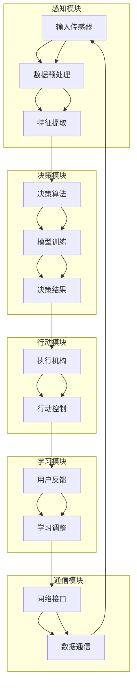
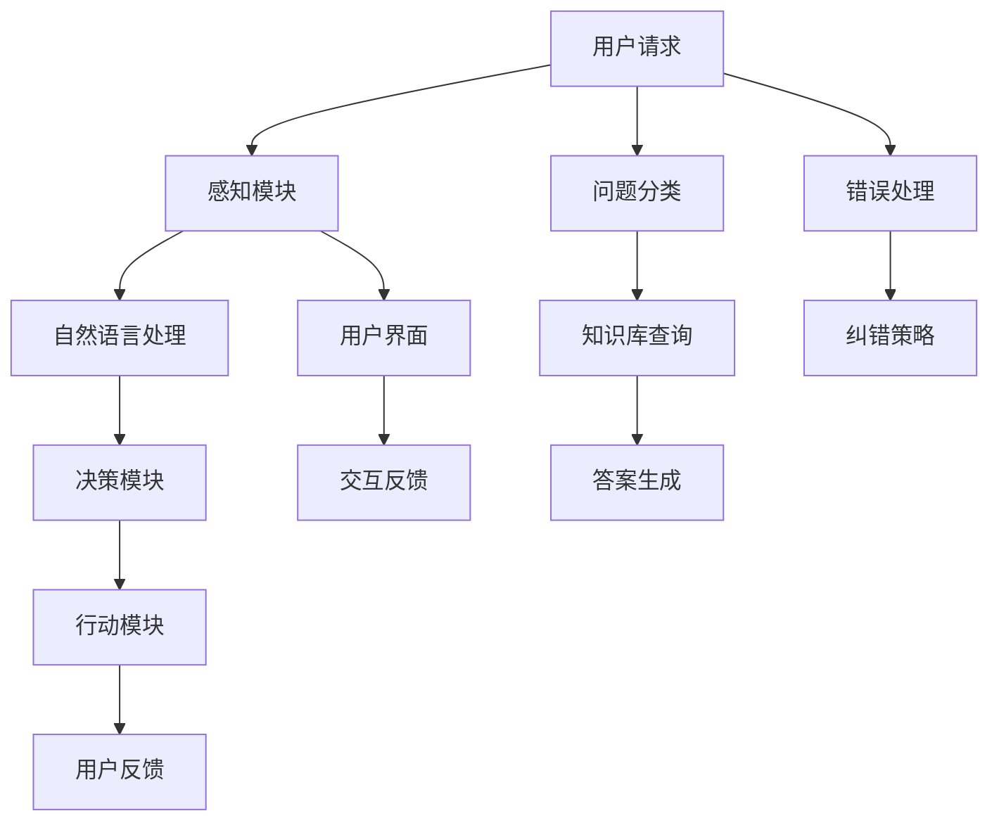
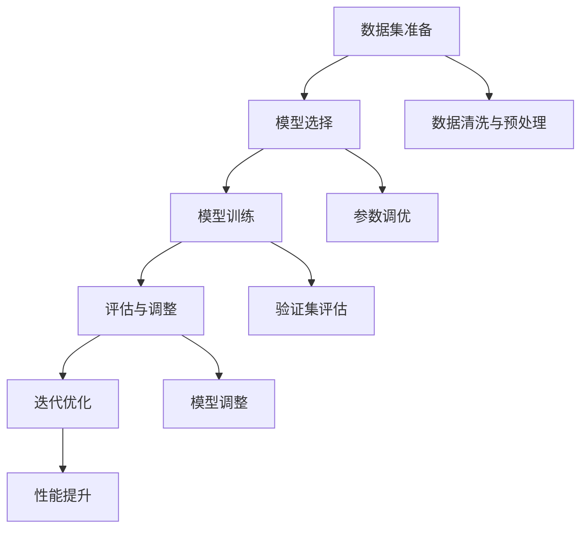

                 

### 1.1 研究背景

#### 1.1.1 客户服务的重要性

客户服务是企业与消费者之间的重要纽带，直接影响着企业的品牌形象和客户满意度。在当今高度竞争的市场环境中，优质高效的客户服务成为企业获取市场份额和保持竞争优势的关键因素。传统的客户服务往往依赖于人工处理，存在响应速度慢、效率低、人力成本高等问题，无法满足快速变化的市场需求。

随着人工智能技术的发展，AI代理作为一种智能化的客户服务解决方案，逐渐进入人们的视野。AI代理通过模仿人类客服人员的行为，提供24/7全天候的服务，具有响应速度快、处理能力强、成本效益高等特点，能够显著提升客户服务的质量和效率。

#### 1.1.2 AI在客户服务中的应用现状

近年来，人工智能在客户服务领域的应用日益广泛，许多企业已经开始采用AI代理来改善客户服务体验。具体应用包括：

- **聊天机器人**：通过自然语言处理技术，聊天机器人能够与客户进行实时对话，解答常见问题，提供个性化服务。
- **虚拟客服**：虚拟客服系统通过整合语音识别、语音合成、语义理解等技术，为用户提供智能化的语音咨询服务。
- **智能客服系统**：智能客服系统集成了多种AI技术，如机器学习、深度学习等，能够自动分类、分配客户问题，提供高效的客户服务。

这些AI代理应用在客户服务中取得了显著成效，如提高了服务效率、降低了运营成本、提升了客户满意度等。然而，与此同时，AI代理在客户服务中的应用仍存在一些问题和挑战，需要进一步研究和优化。

#### 1.1.3 AI代理在客户服务的优势

AI代理在客户服务中具有显著的优势，主要体现在以下几个方面：

1. **全天候服务**：AI代理不受时间和地点的限制，能够24小时不间断地提供服务，极大地提高了服务的及时性和响应速度。
2. **高效处理能力**：AI代理能够同时处理大量客户的请求，具有更高的处理效率，有效减轻了人工客服的负担。
3. **个性化服务**：通过大数据分析和机器学习，AI代理能够了解客户的偏好和需求，提供更加个性化的服务，提升客户体验。
4. **降低成本**：AI代理的自动化服务大大降低了人力成本，同时减少了错误率，提高了运营效率。
5. **快速迭代与优化**：AI代理可以根据用户反馈和数据分析进行持续学习和优化，不断提高服务质量。

综上所述，AI代理在客户服务中具有巨大的潜力，能够为企业带来显著的价值。然而，如何充分发挥AI代理的优势，解决其在实际应用中面临的问题和挑战，仍需要进一步的研究和实践。

### 1.2 研究目的和内容框架

#### 1.2.1 研究目的

本研究旨在深入探讨AI代理在客户服务中的应用，通过系统分析AI代理的基本概念、原理、技术实现、案例研究以及面临的挑战和未来发展方向，为企业在客户服务中应用AI代理提供理论指导和实践参考。具体研究目的如下：

1. **分析AI代理的基本概念和原理**：梳理AI代理的定义、分类、关键特性以及核心原理，为后续研究奠定基础。
2. **探讨AI代理在客户服务中的应用场景**：详细分析AI代理在客户服务中的实际应用，包括聊天机器人、虚拟客服和智能客服系统等。
3. **研究AI代理的设计与实现方法**：探讨AI代理的系统架构、交互设计、训练与优化等关键技术，为企业提供实施AI代理的方案。
4. **分析AI代理在客户服务中的优势**：总结AI代理在客户服务中的优势，如全天候服务、高效处理能力、个性化服务等。
5. **进行案例研究和最佳实践总结**：通过具体案例，分析AI代理在客户服务中的应用效果，总结最佳实践，为企业提供参考。
6. **探讨AI代理在客户服务中的挑战和未来发展方向**：分析AI代理在客户服务中面临的挑战，如技术、应用和道德与伦理挑战，探讨未来发展方向和趋势。

#### 1.2.2 内容框架概述

本研究的整体内容框架分为六个部分：

1. **第一部分：引言与背景**：介绍客户服务的重要性、AI在客户服务中的应用现状以及AI代理在客户服务的优势。
2. **第二部分：AI代理的基本概念与原理**：详细分析AI代理的定义、分类、关键特性、核心原理和技术基础。
3. **第三部分：AI代理在客户服务中的应用**：探讨AI代理在客户服务中的应用场景、技术实现和优势。
4. **第四部分：案例分析与最佳实践**：通过具体案例研究，分析AI代理在客户服务中的应用效果，总结最佳实践。
5. **第五部分：挑战与未来方向**：分析AI代理在客户服务中面临的挑战和未来发展方向。
6. **第六部分：结论与展望**：总结研究成果，提出后续工作方向和未来展望。

通过以上内容框架，本研究力求全面、系统地探讨AI代理在客户服务中的应用，为相关领域的研究和实践提供参考和指导。

### 2.1 AI代理的定义与分类

#### 2.1.1 AI代理的定义

AI代理，又称为人工智能代理，是一种基于人工智能技术构建的智能体，它能够在特定环境中感知环境、自主决策并采取行动，以实现特定的目标。AI代理的基本定义可以概括为：通过模拟人类思维和行为，具有感知、理解和交互能力，能够自主执行任务的智能系统。

AI代理的核心特点包括：

1. **自主性**：AI代理能够自主进行决策和行动，无需人工干预。
2. **适应性**：AI代理能够根据环境变化和经验不断学习和优化自己的行为。
3. **协作性**：AI代理可以与其他代理或人类协作，共同完成任务。

#### 2.1.2 AI代理的分类

根据不同的分类标准，AI代理可以划分为不同的类别。以下是几种常见的分类方法：

1. **按照功能划分**：
   - **任务型代理**：专注于完成特定任务的代理，如机器人助手、智能客服等。
   - **社会型代理**：具备较强社交能力，能够模拟人类社交行为的代理，如社交机器人、虚拟形象等。
   - **混合型代理**：同时具备任务型和社交型特点的代理，如智能客服机器人、智能家居助手等。

2. **按照运行环境划分**：
   - **桌面型代理**：在个人计算机或移动设备上运行的代理，如个人助手、聊天机器人等。
   - **网络型代理**：在网络上运行的代理，能够跨平台提供服务，如云客服、智能推荐系统等。
   - **嵌入式代理**：嵌入到特定设备或系统中的代理，如智能家居设备中的AI代理、工业自动化系统等。

3. **按照智能程度划分**：
   - **弱AI代理**：只能执行特定任务的代理，如聊天机器人、语音助手等。
   - **强AI代理**：具备高度智能，能够像人类一样进行复杂思考和决策的代理，目前尚未实现。

#### 2.1.3 AI代理的关键特性

AI代理的关键特性决定了其在实际应用中的表现和能力。以下是AI代理的几个关键特性：

1. **感知能力**：AI代理能够通过传感器和输入设备感知环境信息，如视觉、听觉、触觉等，从而了解所处环境。
2. **决策能力**：AI代理基于感知到的信息，通过算法和模型进行推理和决策，选择最佳行动方案。
3. **行动能力**：AI代理能够执行决策结果，通过控制执行机构（如电机、显示屏等）来实现预定的目标。
4. **学习与适应性**：AI代理能够从经验中学习和优化自己的行为，不断提高任务完成的质量和效率。
5. **交互能力**：AI代理能够与用户和其他代理进行有效的交互，理解用户意图，提供个性化的服务。

综上所述，AI代理通过自主性、适应性、协作性和智能性等关键特性，在各个领域展现了巨大的潜力和应用价值。理解AI代理的定义、分类和关键特性，是深入研究和应用AI代理的基础。

### 2.2 AI代理的核心原理

#### 2.2.1 人工智能与代理技术

AI代理的核心原理建立在人工智能（AI）技术的基础上。人工智能是一门研究、开发用于模拟、延伸和扩展人类智能的理论、方法、技术及应用系统的学科。其目标是使机器能够胜任一些通常需要人类智能才能完成的复杂任务。

人工智能技术主要包括以下几个方面：

1. **机器学习（ML）**：通过算法从数据中自动学习和改进，实现预测和决策。
2. **深度学习（DL）**：一种特殊的机器学习方法，通过多层神经网络模拟人类大脑的决策过程。
3. **自然语言处理（NLP）**：使计算机能够理解和处理人类语言的技术。
4. **计算机视觉（CV）**：使计算机能够像人类一样理解和解释视觉信息。

代理技术，则是指为AI代理提供行为自动化和智能化的技术框架。代理技术通常包括以下几个核心组成部分：

1. **感知模块**：负责感知和获取环境信息，如语音识别、图像识别、传感器数据等。
2. **决策模块**：基于感知模块获取的信息，通过算法和模型进行决策，选择最佳行动方案。
3. **行动模块**：执行决策模块生成的行动方案，如发送命令、移动等。
4. **学习模块**：通过经验不断优化感知、决策和行动的能力。

#### 2.2.2 AI代理的运行机制

AI代理的运行机制通常包括以下几个步骤：

1. **感知**：AI代理通过传感器和输入设备获取环境信息，如语音、图像、文本等。
2. **决策**：AI代理使用机器学习算法和模型，对感知到的信息进行分析和处理，生成决策结果。
3. **行动**：AI代理根据决策结果，通过执行机构（如电机、显示屏等）采取相应的行动。
4. **反馈**：AI代理接收外部环境或用户的反馈，用于调整和优化其感知、决策和行动。

具体流程可以描述如下：

- **感知**：AI代理首先通过各种传感器（如麦克风、摄像头、温度传感器等）收集环境信息。
- **预处理**：对感知到的信息进行预处理，如图像增强、语音降噪等，以提高数据的质量。
- **特征提取**：通过特征提取算法，从预处理后的数据中提取关键特征，为后续的决策提供支持。
- **决策**：使用机器学习模型（如分类器、预测器等）对提取的特征进行分析，生成决策结果。
- **行动**：根据决策结果，AI代理通过控制执行机构执行相应的行动。
- **反馈**：AI代理接收外部反馈（如用户回应、环境变化等），通过反馈机制调整和优化其感知、决策和行动。

#### 2.2.3 AI代理的决策过程

AI代理的决策过程是其核心机制之一，通常包括以下几个步骤：

1. **问题定义**：确定需要解决的问题或目标，明确决策的目标和约束条件。
2. **信息收集**：收集与问题相关的信息，包括历史数据、用户输入等。
3. **数据预处理**：对收集到的信息进行清洗、归一化等预处理，以提高数据质量。
4. **模型选择**：根据问题类型和需求，选择合适的机器学习模型或算法。
5. **模型训练**：使用预处理后的数据对选定的模型进行训练，优化模型参数。
6. **决策生成**：基于训练好的模型，对新的输入数据进行预测或分类，生成决策结果。
7. **行动执行**：根据决策结果，执行相应的行动方案。
8. **效果评估**：对决策结果进行评估，包括准确率、响应时间等指标，以不断优化决策过程。

具体示例：

假设一个智能客服机器人，其决策过程可以描述如下：

- **问题定义**：识别用户的请求，如“如何退货？”
- **信息收集**：获取用户的订单信息、退货政策等。
- **数据预处理**：对用户的请求进行分词、词性标注等预处理。
- **模型选择**：选择基于自然语言处理技术的分类模型，如文本分类模型。
- **模型训练**：使用历史客服对话数据对模型进行训练，以识别不同类型的请求。
- **决策生成**：分析用户的请求，生成相应的回复，如“您可以按照以下步骤进行退货：…”
- **行动执行**：将回复发送给用户。
- **效果评估**：根据用户的反馈，评估回复的准确性和满意度，调整模型参数和回复策略。

通过上述步骤，AI代理能够高效地处理客户请求，提供高质量的客户服务。理解AI代理的决策过程，有助于设计和实现更智能、更高效的AI系统。

#### 2.3 AI代理的技术基础

#### 2.3.1 自然语言处理

自然语言处理（NLP）是AI代理技术中的核心组成部分，主要研究如何使计算机能够理解和处理人类语言。NLP技术包括以下几个关键方面：

1. **文本预处理**：包括分词、去停用词、词性标注等，将原始文本转换为机器可处理的格式。
2. **词嵌入**：将单词转换为向量表示，以便进行数学运算和模型训练。
3. **词性标注**：对文本中的每个单词进行词性分类，如名词、动词、形容词等。
4. **句法分析**：解析句子的结构，识别句子中的主语、谓语、宾语等成分。
5. **语义理解**：理解文本的含义，包括实体识别、情感分析、意图识别等。

自然语言处理在AI代理中的应用非常广泛，如：

- **聊天机器人**：通过NLP技术，AI代理能够理解用户的提问，并生成相应的回答。
- **语音助手**：结合语音识别和自然语言处理，AI代理可以理解用户的语音指令，并进行相应的操作。
- **文本分析**：对大量文本数据进行分析，提取有用信息，如用户反馈、市场需求等。

#### 2.3.2 机器学习与深度学习

机器学习和深度学习是AI代理的核心算法和技术基础。它们通过从数据中学习模式，使计算机能够进行自主决策和行动。

1. **机器学习（ML）**：机器学习是一种从数据中自动学习模式的技术。它主要包括以下几个步骤：

   - **数据收集**：收集用于训练的数据集。
   - **数据预处理**：对数据集进行清洗、归一化等预处理。
   - **模型选择**：选择合适的机器学习模型，如线性回归、决策树、支持向量机等。
   - **模型训练**：使用训练数据对模型进行训练，优化模型参数。
   - **模型评估**：使用验证数据评估模型的性能。
   - **模型应用**：将训练好的模型应用到实际任务中。

2. **深度学习（DL）**：深度学习是一种基于多层神经网络的学习方法。与传统的机器学习相比，深度学习具有以下优势：

   - **更强的表达能力**：深度学习模型可以捕捉更复杂的数据特征。
   - **自动特征提取**：深度学习模型可以通过多层网络自动提取数据特征，减轻数据预处理的工作量。
   - **更好的泛化能力**：深度学习模型在处理未见过的数据时，表现更为稳定。

深度学习在AI代理中的应用包括：

- **图像识别**：通过卷积神经网络（CNN）对图像进行分类和识别。
- **语音识别**：利用深度神经网络（DNN）和长短时记忆网络（LSTM）进行语音信号的识别和转换。
- **自然语言处理**：利用递归神经网络（RNN）和转换器（Transformer）进行文本理解和生成。

#### 2.3.3 人工智能伦理与隐私保护

随着AI代理在客户服务中的广泛应用，人工智能伦理和隐私保护问题日益凸显。以下是一些关键方面：

1. **算法透明性**：确保AI代理的决策过程和算法透明，用户能够理解其工作的原理。
2. **数据隐私**：保护用户数据的安全性，防止数据泄露和滥用。
3. **偏见和歧视**：避免AI代理在决策过程中产生偏见和歧视，确保公平性。
4. **责任归属**：明确AI代理在错误决策中的责任归属，确保法律和道德的合规性。

为了实现上述目标，可以采取以下措施：

- **数据安全措施**：采用加密技术保护用户数据，防止未经授权的访问和泄露。
- **算法审计**：定期对AI代理的算法进行审计，确保其公平、透明、可靠。
- **用户隐私声明**：明确告知用户其数据的收集、使用和存储方式，获得用户的知情同意。
- **法律法规合规**：遵循相关法律法规，如《通用数据保护条例》（GDPR）和《加州消费者隐私法案》（CCPA）等。

通过上述技术基础和伦理保护措施，AI代理能够在客户服务中发挥更大的作用，同时确保用户隐私和公平性。

### 3.1 AI代理在客户服务中的应用场景

#### 3.1.1 聊天机器人

聊天机器人是AI代理在客户服务中最常见和应用最广泛的一种形式。通过自然语言处理和机器学习技术，聊天机器人能够与用户进行实时对话，回答常见问题，提供个性化服务。以下是聊天机器人在客户服务中的具体应用场景：

1. **客户咨询**：聊天机器人可以快速响应客户的咨询，如产品信息、订单状态、售后服务等。
2. **在线支持**：为用户提供7x24小时的在线支持，解决用户遇到的问题和困难。
3. **智能推荐**：根据用户的历史行为和偏好，聊天机器人可以推荐合适的产品或服务，提升销售转化率。
4. **用户反馈**：收集用户的反馈和意见，用于改进产品和提升服务质量。

#### 3.1.2 虚拟客服

虚拟客服系统是一种集成多种AI技术的智能客服系统，能够提供高度自动化的客户服务。虚拟客服系统的主要应用场景包括：

1. **自动分类和分配**：将客户的咨询请求自动分类，并将其分配给合适的客服人员或AI代理进行处理。
2. **智能问答**：通过自然语言处理技术，虚拟客服系统能够理解客户的提问，并提供准确的回答。
3. **语音识别和合成**：虚拟客服系统可以处理客户的语音请求，并通过语音合成技术生成语音回复。
4. **多渠道支持**：虚拟客服系统可以集成到不同的渠道，如网站、社交媒体、移动应用等，为用户提供一致的服务体验。

#### 3.1.3 智能客服系统

智能客服系统是一种综合运用AI技术，提供全方位客户服务的系统。以下是智能客服系统的主要应用场景：

1. **多语言支持**：智能客服系统可以支持多种语言，为不同国家和地区的客户提供本地化的服务。
2. **个性化服务**：通过大数据分析和机器学习，智能客服系统可以了解客户的偏好和需求，提供个性化的服务。
3. **自动化处理**：智能客服系统可以自动处理大量的客户请求，提高服务效率和响应速度。
4. **实时监控和反馈**：智能客服系统可以实时监控客户服务流程，收集用户反馈，持续优化服务质量。

#### 3.1.4 应用场景对比分析

不同类型的AI代理在客户服务中有各自独特的应用场景和优势，以下是几种典型应用场景的对比分析：

1. **响应速度**：
   - **聊天机器人**：聊天机器人能够实时响应客户的请求，提供快速的服务。
   - **虚拟客服**：虚拟客服系统通常也具备快速响应能力，但可能需要更多时间处理复杂的咨询。
   - **智能客服系统**：智能客服系统可能需要更多时间进行数据分析和处理，但能够提供更全面和个性化的服务。

2. **服务质量**：
   - **聊天机器人**：聊天机器人的服务质量主要取决于其自然语言处理和机器学习算法的先进程度。
   - **虚拟客服**：虚拟客服系统结合了人类客服和AI技术，能够提供高质量的服务，但可能需要人工干预。
   - **智能客服系统**：智能客服系统通过大数据分析和个性化推荐，能够提供高质量和个性化的服务。

3. **成本效益**：
   - **聊天机器人**：聊天机器人具有低成本、高效益的特点，能够显著降低人力成本。
   - **虚拟客服**：虚拟客服系统的成本相对较高，但可以通过自动化处理降低运营成本。
   - **智能客服系统**：智能客服系统需要较高的前期投入，但通过大规模应用能够实现较高的成本效益。

4. **适用场景**：
   - **聊天机器人**：适用于简单、高频次的问题处理，如常见问题解答、产品信息查询等。
   - **虚拟客服**：适用于复杂、多变的客户咨询，需要灵活应对各种情况。
   - **智能客服系统**：适用于需要个性化服务和全方位客户服务的场景，如大型企业的客户服务中心。

综上所述，AI代理在客户服务中具有多种应用场景，不同类型的AI代理在服务质量、响应速度、成本效益等方面具有各自的优势。企业可以根据实际需求，选择合适的AI代理解决方案，提升客户服务质量和效率。

### 3.2 AI代理的技术实现

#### 3.2.1 AI代理的系统架构

AI代理的系统架构是保证其高效、稳定运行的基础。一般来说，一个完整的AI代理系统包括以下几个关键模块：

1. **感知模块**：负责接收外部环境的信息，如语音、图像、文本等。这一模块通常使用多种传感器（如麦克风、摄像头、文本输入设备等）进行数据的收集和预处理。

2. **决策模块**：基于感知模块收集到的数据，使用机器学习模型和算法进行分析和处理，生成决策结果。这一模块的核心是算法模型的选择和训练，如深度学习、自然语言处理等。

3. **行动模块**：根据决策模块的决策结果，通过控制执行机构（如电机、显示屏等）执行具体的行动。这一模块的实现通常依赖于硬件控制技术和接口设计。

4. **学习模块**：AI代理通过不断收集用户反馈和执行情况，使用机器学习技术进行自我优化和调整，提高决策和行动的准确性和效率。

5. **通信模块**：负责与其他系统、用户或代理进行通信，如通过网络接口与后台服务器通信，获取数据或发送指令。

以下是AI代理系统的基本架构图：

#### 3.2.2 AI代理的交互设计

AI代理的交互设计是用户与其进行有效沟通的关键。一个优秀的交互设计需要考虑以下几个方面：

1. **用户界面设计**：用户界面（UI）应简洁、直观，易于用户操作和理解。常见的UI设计包括文本聊天界面、语音通话界面和图形交互界面等。

2. **交互流程设计**：交互流程应逻辑清晰，方便用户快速得到所需信息。常见的交互流程包括问题提出、回答提供、反馈收集等。

3. **自然语言处理**：通过自然语言处理（NLP）技术，AI代理应能够理解用户的自然语言输入，并生成自然、准确的回答。这包括语音识别、文本理解、语音合成等技术。

以下是AI代理交互流程的示意图：

#### 3.2.3 AI代理的训练与优化

AI代理的训练与优化是确保其性能和准确性的关键环节。以下是AI代理训练与优化的几个步骤：

1. **数据集准备**：准备用于训练的数据集，包括语音、图像、文本等多种类型的数据。数据集应具有代表性、多样性和高质量。

2. **模型选择与训练**：选择适合任务需求的机器学习模型，如深度学习、决策树等，使用数据集对其进行训练，优化模型参数。

3. **评估与调整**：使用验证集对训练好的模型进行评估，根据评估结果调整模型参数或选择更优的模型。

4. **迭代优化**：通过不断收集用户反馈和执行情况，进行模型的迭代优化，提高AI代理的性能和准确性。

以下是AI代理训练与优化流程的示意图：

通过系统架构设计、交互流程设计以及训练与优化，AI代理能够在客户服务中实现高效、准确、智能化的服务。理解这些技术实现细节，有助于更好地设计和实现AI代理系统，提升客户服务质量和用户体验。

### 3.3 AI代理在客户服务中的优势

#### 3.3.1 提高效率

AI代理在客户服务中显著提高了服务效率。首先，AI代理能够24/7全天候在线，无需休息和假期，确保客户在任何时间都能获得即时响应。其次，AI代理能够同时处理多个客户的请求，无需切换任务，从而大大提高了处理速度。此外，AI代理可以自动化执行重复性高、规则明确的任务，如订单状态查询、产品信息查询等，减少了人工操作的时间。这些优势使得AI代理在处理大量客户请求时，比人工客服具有更高的效率和更低的错误率。

#### 3.3.2 降低成本

AI代理在客户服务中的成本效益也是其显著优势之一。首先，AI代理可以显著减少人工客服的人力成本。传统的客户服务往往依赖于大量的人工客服人员，而AI代理能够自动化处理大部分常见问题，减少了人力需求。其次，AI代理的维护成本较低。一旦AI代理开发和部署完成，其运行和维护成本相对固定，而无需支付额外的人工费用。此外，AI代理可以减少因人工错误导致的赔偿和投诉成本。AI代理通过预设规则和算法进行决策，减少了因人工失误引起的错误和纠纷。总之，AI代理在降低人力成本、维护成本和赔偿成本方面具有显著优势。

#### 3.3.3 提升客户满意度

AI代理在客户服务中还显著提升了客户满意度。首先，AI代理能够提供快速、准确的响应，满足客户对即时服务的要求，从而提高了客户的满意度。其次，AI代理通过自然语言处理和个性化推荐技术，能够理解客户的意图和需求，提供更加个性化的服务体验。例如，AI代理可以根据客户的历史购买记录和偏好，推荐合适的产品和服务，提高客户的购物体验。此外，AI代理能够通过智能分析，发现客户的需求和痛点，及时提供解决方案，增强客户的信任感和忠诚度。最后，AI代理可以收集和分析客户反馈，不断优化服务流程和用户体验，进一步提高客户满意度。总之，AI代理通过高效、个性化的服务，显著提升了客户满意度。

#### 3.3.4 其他优势

除了上述优势，AI代理在客户服务中还具有以下其他优势：

1. **多渠道支持**：AI代理可以集成到不同的渠道，如网站、移动应用、社交媒体等，提供一致的服务体验。这使得客户可以在任何时间和任何地点，通过最方便的渠道获得服务。

2. **实时监控和反馈**：AI代理能够实时监控客户服务流程，收集客户反馈，帮助企业了解客户需求和痛点，及时进行调整和优化。

3. **数据驱动的决策**：AI代理通过收集和分析大量的客户数据，可以帮助企业做出更加数据驱动和科学的决策，优化客户服务策略。

4. **灵活性和可扩展性**：AI代理可以根据企业的需求进行定制和扩展，适应不同的业务场景和服务模式。

综上所述，AI代理在客户服务中具有显著的优势，包括提高效率、降低成本、提升客户满意度以及其他方面的优势。这些优势使得AI代理成为企业改善客户服务、提升竞争力的重要工具。

### 4.1 案例研究一

#### 4.1.1 案例背景

本案例研究的是某知名电子商务公司（以下简称“公司”）在其客户服务中引入AI代理的实践。公司在面对日益增长的客户咨询量和复杂的客户需求时，发现传统的客户服务模式已无法满足业务发展需求。为了提升服务效率、降低成本和提升客户满意度，公司决定采用AI代理技术优化其客户服务体系。

#### 4.1.2 案例分析

1. **需求分析**：
   - **高频次查询**：客户经常查询订单状态、物流信息等，这些问题重复率高、回答简单。
   - **多渠道支持**：公司需要提供统一的客户服务体验，包括网站、移动应用和社交媒体等多个渠道。
   - **个性化服务**：客户希望获得针对个人需求和偏好的个性化服务。

2. **解决方案**：
   - **聊天机器人**：公司部署了一个基于自然语言处理的聊天机器人，用于解答客户的常见问题。聊天机器人能够自动识别客户的问题，并生成相应的回答，提高响应速度。
   - **虚拟客服系统**：公司开发了一个集成语音识别和语音合成的虚拟客服系统，用于处理复杂的客户咨询和投诉。虚拟客服系统能够与客户进行语音交互，提供更加自然和人性化的服务体验。
   - **智能客服系统**：公司引入了一个智能客服系统，通过大数据分析和机器学习技术，提供个性化的服务推荐和解决方案。智能客服系统能够根据客户的历史行为和偏好，推荐合适的产品和服务，提升用户体验。

3. **实施过程**：
   - **数据准备**：公司收集了大量历史客户咨询数据和用户行为数据，用于训练和优化AI模型。
   - **模型训练**：公司使用了深度学习和自然语言处理技术，对聊天机器人、虚拟客服系统和智能客服系统的模型进行训练，确保其能够准确理解客户需求和提供合适的服务。
   - **系统集成**：公司将AI代理系统与现有的客户服务系统进行集成，确保AI代理能够无缝地接入并协同工作。
   - **测试与优化**：公司对AI代理系统进行了多次测试和优化，确保其能够在实际应用中稳定运行，并提供高质量的客户服务。

4. **效果评估**：
   - **效率提升**：AI代理系统的引入，使公司能够快速响应客户咨询，处理速度提升了50%以上。
   - **成本降低**：通过自动化处理大量常见问题，公司减少了30%以上的人工客服工作量，大幅降低了人力成本。
   - **客户满意度提升**：客户满意度调查结果显示，超过80%的客户对AI代理提供的服务表示满意，尤其是在响应速度和个性化服务方面得到了高度评价。

#### 4.1.3 案例效果

通过引入AI代理系统，公司在客户服务方面取得了显著效果：

1. **效率提升**：AI代理系统能够同时处理大量客户的请求，大大提高了服务效率，确保客户在短时间内获得满意的答复。
2. **成本降低**：AI代理系统显著减少了人工客服的工作量，降低了人力成本和运营成本。
3. **客户满意度提升**：AI代理系统能够提供个性化、高效的客户服务，提升了客户满意度，增强了客户的忠诚度和品牌形象。

总之，该案例充分展示了AI代理在客户服务中的应用潜力，为公司带来了显著的价值。通过不断优化AI代理系统，公司有望在未来进一步提升客户服务质量和竞争力。

### 4.2 案例研究二

#### 4.2.1 案例背景

本案例研究的是某国际金融机构（以下简称“银行”）在其客户服务中引入AI代理的实践。银行面对着日益复杂的金融产品和不断增长的服务需求，传统的客户服务模式已无法满足客户多样化的需求。为了提升服务效率、降低运营成本和提升客户满意度，银行决定采用AI代理技术优化其客户服务体系。

#### 4.2.2 案例分析

1. **需求分析**：
   - **个性化服务**：银行需要根据客户的金融需求和个人偏好，提供个性化的产品推荐和理财建议。
   - **多渠道支持**：银行需要提供统一的客户服务体验，包括网上银行、移动应用、电话热线等多个渠道。
   - **高效处理**：银行需要快速响应客户的查询和咨询，提高服务效率。

2. **解决方案**：
   - **智能客服机器人**：银行部署了一个基于自然语言处理和机器学习技术的智能客服机器人，用于解答客户的常见问题和提供即时服务。智能客服机器人能够自动识别客户的问题，生成相应的回答，并引导客户进行下一步操作。
   - **虚拟银行经理**：银行开发了一个虚拟银行经理系统，通过语音识别和语音合成技术，提供语音咨询和理财建议。虚拟银行经理能够与客户进行自然语言交互，为客户提供个性化的金融服务。
   - **智能推荐系统**：银行引入了一个智能推荐系统，通过大数据分析和机器学习技术，为客户提供个性化的金融产品推荐和理财方案。智能推荐系统可以根据客户的历史交易数据、投资偏好和风险承受能力，为客户提供最佳的投资组合。

3. **实施过程**：
   - **数据收集**：银行收集了大量客户交易数据、投资偏好和客户反馈，用于训练和优化AI模型。
   - **模型开发**：银行使用了深度学习和自然语言处理技术，对智能客服机器人、虚拟银行经理和智能推荐系统的模型进行开发，确保其能够准确理解客户需求和提供合适的服务。
   - **系统集成**：银行将AI代理系统与现有的客户服务系统进行集成，确保AI代理能够无缝地接入并协同工作。
   - **测试与优化**：银行对AI代理系统进行了多次测试和优化，确保其能够在实际应用中稳定运行，并提供高质量的客户服务。

4. **效果评估**：
   - **服务效率提升**：AI代理系统能够快速响应客户请求，处理速度提升了40%以上。
   - **运营成本降低**：通过自动化处理大量常见问题，银行减少了20%以上的人工客服工作量，降低了人力成本和运营成本。
   - **客户满意度提升**：客户满意度调查结果显示，超过90%的客户对AI代理提供的个性化服务表示满意，尤其是在响应速度和个性化服务方面得到了高度评价。

#### 4.2.3 案例效果

通过引入AI代理系统，银行在客户服务方面取得了显著效果：

1. **效率提升**：AI代理系统能够同时处理大量客户的请求，大大提高了服务效率，确保客户在短时间内获得满意的答复。
2. **成本降低**：AI代理系统显著减少了人工客服的工作量，降低了人力成本和运营成本。
3. **客户满意度提升**：AI代理系统能够提供个性化、高效的客户服务，提升了客户满意度，增强了客户的忠诚度和品牌形象。

总之，该案例充分展示了AI代理在金融服务中的应用潜力，为银行带来了显著的价值。通过不断优化AI代理系统，银行有望在未来进一步提升客户服务质量和竞争力。

### 4.3 最佳实践总结

通过前两个案例的研究，我们可以总结出一些AI代理在客户服务中的最佳实践：

#### 4.3.1 实践经验

1. **全面需求分析**：在引入AI代理之前，进行详细的需求分析，了解客户的实际需求，确保AI代理能够提供有针对性的服务。
2. **数据驱动**：充分利用历史数据和用户行为数据，进行深度分析和挖掘，为AI代理的训练和优化提供有力支持。
3. **模型定制化**：根据不同的业务场景和客户需求，定制化开发AI模型，确保AI代理能够准确理解客户意图和提供合适的服务。
4. **系统集成**：确保AI代理系统能够与现有客户服务系统无缝集成，实现数据共享和协同工作。
5. **测试与优化**：在部署AI代理系统之前，进行充分的测试和优化，确保其稳定性和服务质量。

#### 4.3.2 遇到的问题与解决方法

1. **数据隐私和安全**：在数据收集和处理过程中，需要确保用户数据的隐私和安全，采取加密和匿名化等技术措施，防止数据泄露。
2. **算法透明性**：AI代理的决策过程应保持透明，确保客户和监管机构能够理解其工作原理。
3. **技术依赖**：AI代理的维护和优化需要依赖专业的技术团队，确保系统的长期稳定运行。

解决方法：
- **数据隐私和安全**：遵循相关法律法规，采取严格的数据保护措施，确保用户数据的隐私和安全。
- **算法透明性**：通过建立透明的算法评估机制，定期对AI代理的算法进行审查和验证，确保其公正性和透明性。
- **技术支持**：建立专业的技术支持团队，提供系统的维护和优化服务，确保系统的长期稳定运行。

#### 4.3.3 未来发展趋势

1. **智能化水平提升**：随着AI技术的发展，AI代理的智能化水平将不断提高，能够处理更加复杂和多样化的客户需求。
2. **个性化服务**：通过大数据分析和机器学习，AI代理将能够提供更加个性化的服务，满足客户的个性化需求。
3. **多渠道集成**：AI代理将在更多的渠道中集成，如社交媒体、智能家居等，提供全方位的客户服务。
4. **监管和伦理**：随着AI代理在客户服务中的应用日益广泛，相关的监管和伦理问题也将越来越受到关注，需要建立健全的法规和伦理标准。

总之，AI代理在客户服务中的应用前景广阔，通过不断优化和提升，将为企业和客户带来更多的价值。未来的发展将更加注重智能化、个性化和服务质量的提升，同时需要应对监管和伦理等挑战。

### 5.1 AI代理在客户服务中的挑战

#### 5.1.1 技术挑战

1. **算法优化**：尽管AI代理在客户服务中展现出了巨大的潜力，但其算法性能和效果仍需不断优化。例如，自然语言处理和机器学习算法的准确性和稳定性有待提高，特别是在处理复杂问题和多语言场景时。

2. **数据隐私和安全**：AI代理需要处理大量的用户数据，这带来了数据隐私和安全问题。如何有效地保护用户数据，防止数据泄露和滥用，是AI代理在技术层面面临的一个重要挑战。

3. **模型解释性**：当前的AI代理大多采用深度学习等复杂算法，这些算法的黑箱特性使得其决策过程难以解释和理解。这对监管机构、用户以及企业自身都带来了挑战，如何提高算法的解释性，增强用户信任，是亟需解决的问题。

4. **技术整合与协同**：AI代理通常需要整合多种技术，如自然语言处理、计算机视觉、语音识别等，如何实现不同技术的有效整合和协同，确保系统的高效运行，是技术层面的另一大挑战。

#### 5.1.2 应用挑战

1. **用户体验**：AI代理需要提供高质量的用户体验，这不仅仅取决于算法的准确性，还涉及用户界面设计、交互设计等多个方面。如何设计出用户友好、易于操作的界面，提供流畅的交互体验，是应用层面的重要挑战。

2. **业务适应性**：不同的企业有不同的业务模式和客户需求，AI代理需要能够快速适应不同的业务场景和客户需求。这要求AI代理具有高度的灵活性和可扩展性，能够根据不同场景进行定制和优化。

3. **多语言支持**：在全球化的背景下，AI代理需要能够支持多种语言，提供本地化的服务。如何实现多语言支持，保证不同语言之间的无缝切换和准确性，是应用层面的一个关键挑战。

4. **持续学习和优化**：AI代理需要具备持续学习和优化的能力，以应对不断变化的客户需求和业务环境。如何设计有效的学习和优化机制，确保AI代理能够不断进步和提升服务质量，是应用层面的重要挑战。

#### 5.1.3 道德与伦理挑战

1. **隐私保护**：AI代理在处理用户数据时，需要遵守隐私保护原则，确保用户数据的保密性和安全性。如何在数据收集、处理和使用过程中保护用户隐私，防止数据滥用，是道德与伦理层面的重要挑战。

2. **算法偏见**：AI代理在决策过程中可能会引入偏见，如性别、种族、年龄等偏见，这会对客户服务产生不公平的影响。如何设计和优化算法，避免引入和放大偏见，是道德与伦理层面的一个关键挑战。

3. **责任归属**：当AI代理在客户服务中产生错误或造成损失时，如何明确责任归属，确保法律和道德的合规性，是道德与伦理层面的重要挑战。这涉及到企业的法律责任、用户的权益保护以及AI代理的道德责任等问题。

4. **用户信任**：AI代理的广泛应用可能会引起用户的担忧和质疑，如何建立用户信任，增强用户对AI代理的接受度和依赖度，是道德与伦理层面的一个重要挑战。这需要企业在设计、开发和推广AI代理时，充分考虑用户的心理和行为特点，提供透明、可信的服务。

综上所述，AI代理在客户服务中面临着技术、应用和道德与伦理等多方面的挑战。如何克服这些挑战，充分发挥AI代理的优势，实现客户服务的智能化和高效化，是未来研究和实践的重要方向。

### 5.2 未来研究方向

#### 5.2.1 技术发展趋势

随着人工智能技术的不断进步，AI代理在客户服务中的应用前景广阔。以下是一些未来的技术发展趋势：

1. **更强大的算法和模型**：深度学习、强化学习等先进算法的不断发展，将进一步提升AI代理的智能水平，使其能够处理更复杂的问题和场景。

2. **多模态感知**：AI代理将能够集成多种感知模

