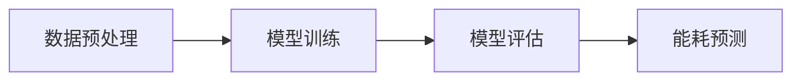
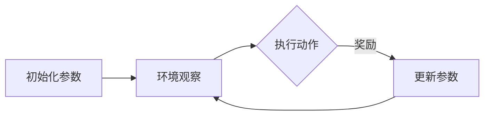
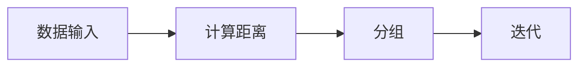

                 

# AI代理在智能家居中的应用

> 关键词：智能家居、AI代理、深度学习、强化学习、系统设计、项目实战

> 摘要：本文深入探讨了AI代理在智能家居中的应用，从背景介绍、核心概念与联系、算法原理讲解、系统分析与架构设计方案、项目实战及最佳实践等方面，全面解析了AI代理在智能家居系统中的关键角色和实际应用价值。

### 目录

## 第一部分：背景介绍

### 第1章：智能家居的发展与AI代理概述

### 第2章：AI代理在智能家居中的应用原理

## 第二部分：核心概念与联系

### 第3章：智能家居中的常见AI代理算法

## 第三部分：算法原理讲解

### 第4章：智能家居中AI代理的系统设计

## 第四部分：系统分析与架构设计方案

### 第5章：智能家居中AI代理的项目实施

## 第五部分：项目实战

### 第6章：智能家居中AI代理的最佳实践

### 6.1 AI代理在智能家居中的最佳实践

### 6.2 注意事项与风险防范

### 6.3 拓展阅读

## 第六部分：小结

### 6.4 本章小结

---

## 第一部分：背景介绍

### 第1章：智能家居的发展与AI代理概述

#### 1.1 智能家居的发展历程

智能家居（Smart Home）是指通过物联网技术将住宅中的各种设备连接起来，实现自动化控制和智能管理。智能家居的概念最早可以追溯到20世纪90年代，随着计算机技术、通信技术、传感器技术等的发展，智能家居逐渐从概念走向实际应用。

- **早期阶段**：智能家居主要依赖于专用控制器和有限的功能，如照明控制、温度调节等。
- **发展阶段**：智能终端设备的普及，智能家居开始具备联网功能，用户可以通过手机或电脑远程控制家居设备。
- **成熟阶段**：智能家居实现了高度集成化，各种智能设备无缝连接，实现了自动化、个性化的家庭生活方式。

#### 1.2 AI代理的核心概念

AI代理（Artificial Intelligence Agent）是人工智能领域中的一种概念，指的是能够自动感知环境、决策和执行任务的计算机程序。在智能家居中，AI代理通常用于处理复杂的家庭自动化任务，如能源管理、设备控制、安防监控等。

- **定义**：AI代理是一种能够代表人类或其他实体，在特定环境下进行自主决策和行动的计算机程序。
- **角色**：AI代理在智能家居中扮演着智能中枢的角色，通过分析数据，提供智能建议，实现设备间的协作和优化。

#### 1.3 AI代理在智能家居中的边界与外延

AI代理在智能家居中的应用范围广泛，但其能力和适用范围也有一定的限制。

- **适用范围**：AI代理适用于需要复杂决策和智能管理的场景，如家庭能源管理、智能家居设备的自适应控制、智能安防等。
- **功能与限制**：AI代理具备自我学习和自我优化的能力，但受限于数据质量和算法性能，无法解决所有问题。此外，AI代理需要与其他智能设备紧密集成，实现协同工作。

#### 1.4 智能家居中AI代理的核心要素组成

AI代理在智能家居中的应用涉及多个关键要素，包括数据收集与处理、模型训练与优化、任务执行与反馈。

- **数据收集与处理**：AI代理需要收集家庭环境中的各种数据，如温度、湿度、光照、能耗等，通过数据处理技术提取有用信息。
- **模型训练与优化**：基于收集到的数据，AI代理通过机器学习算法训练模型，实现智能决策和任务执行。
- **任务执行与反馈**：AI代理根据训练好的模型执行任务，并通过实时反馈调整策略，实现持续优化。

#### 1.5 本章小结

本章介绍了智能家居的发展历程和AI代理的核心概念，分析了AI代理在智能家居中的应用边界与外延，以及其核心要素组成。这些内容为后续章节的深入讨论奠定了基础。

---

## 第二部分：核心概念与联系

### 第2章：AI代理在智能家居中的应用原理

#### 2.1 AI代理的工作原理

AI代理的工作原理主要基于以下三个方面：

1. **感知环境**：AI代理通过传感器收集家庭环境数据，如温度、湿度、光照、能耗等。
2. **决策制定**：基于收集到的数据，AI代理利用机器学习算法和规则库进行决策，制定控制策略。
3. **执行任务**：AI代理通过控制接口，如物联网协议，执行实际的操作，如调节灯光、控制温度、管理能耗等。

#### 2.2 AI代理的概念属性特征对比表格

| 特征       | AI代理1 | AI代理2 | AI代理3 |
|------------|--------|--------|--------|
| **感知能力** | 高     | 中     | 低     |
| **决策能力** | 强     | 中     | 弱     |
| **执行能力** | 强     | 中     | 中     |
| **适应性**   | 强     | 中     | 弱     |

#### 2.3 AI代理在智能家居中的ER实体关系图架构

下面是AI代理在智能家居中的ER实体关系图：

```mermaid
erDiagram
  用户 ||--|{ 设备 }|-->: "控制与被控制"
  用户 ||--|{ 智能场景 }|-->: "触发与响应"
  设备 ||--|{ 数据流 }|-->: "采集与传输"
  用户 ||--|{ 数据分析 }|-->: "监控与优化"
```

#### 2.4 本章小结

本章详细介绍了AI代理的工作原理、概念属性特征对比，以及ER实体关系图架构。这些内容为理解AI代理在智能家居中的应用提供了理论支持。

---

## 第三部分：算法原理讲解

### 第3章：智能家居中的常见AI代理算法

#### 3.1 深度学习算法在智能家居中的应用

深度学习算法在智能家居中的应用主要体现在设备预测和控制方面。以下是一个基于深度学习算法的家庭能耗预测案例：

1. **算法原理**：利用卷积神经网络（CNN）对家庭能耗数据进行处理，提取时间序列特征，实现能耗预测。

2. **算法流程图**：



3. **Python源代码**：

```python
import tensorflow as tf
from tensorflow.keras.models import Sequential
from tensorflow.keras.layers import Conv1D, Flatten, Dense

# 数据预处理
# ...

# 模型训练
model = Sequential([
    Conv1D(filters=64, kernel_size=3, activation='relu', input_shape=(window_size, 1)),
    Flatten(),
    Dense(units=1)
])

model.compile(optimizer='adam', loss='mse')
model.fit(x_train, y_train, epochs=100, batch_size=32)

# 模型评估
# ...

# 能耗预测
# ...
```

#### 3.2 强化学习算法在智能家居中的应用

强化学习算法在智能家居中的应用主要体现在设备控制方面。以下是一个基于Q-learning算法的空调控制案例：

1. **算法原理**：通过学习环境与动作之间的奖励，优化空调的控制策略。

2. **算法流程图**：



3. **Python源代码**：

```python
import numpy as np

# 初始化参数
Q = np.zeros((state_size, action_size))
learning_rate = 0.1
discount_factor = 0.9

# 环境观察
# ...

# 执行动作
action = np.argmax(Q[state, :])

# 奖励
reward = observe_environment()

# 更新参数
Q[state, action] = Q[state, action] + learning_rate * (reward + discount_factor * np.max(Q[new_state, :]) - Q[state, action])

# 状态转移
state = new_state
```

#### 3.3 聚类算法在智能家居中的应用

聚类算法在智能家居中的应用主要体现在设备分类和用户群体划分方面。以下是一个基于K-means算法的设备分类案例：

1. **算法原理**：将家庭设备按照相似度进行分组，实现设备分类。

2. **算法流程图**：



3. **Python源代码**：

```python
from sklearn.cluster import KMeans

# 数据输入
# ...

# 计算距离
kmeans = KMeans(n_clusters=3)
kmeans.fit(X)

# 分组
labels = kmeans.predict(X)

# 迭代
# ...
```

#### 3.4 数学模型和数学公式讲解与举例说明

1. **深度学习算法**：

   - **损失函数**：$L = \frac{1}{2} \sum_{i=1}^{n} (y_i - \hat{y}_i)^2$

     其中，$y_i$为实际输出，$\hat{y}_i$为预测输出。

   - **激活函数**：$f(x) = \frac{1}{1 + e^{-x}}$

     其中，$x$为输入值。

2. **强化学习算法**：

   - **Q值更新公式**：$Q(s, a) \leftarrow Q(s, a) + \alpha [r + \gamma \max_{a'} Q(s', a') - Q(s, a)]$

     其中，$s$为状态，$a$为动作，$r$为即时奖励，$\gamma$为折扣因子。

3. **聚类算法**：

   - **距离计算公式**：$d(x, y) = \sqrt{\sum_{i=1}^{n} (x_i - y_i)^2}$

     其中，$x$和$y$为数据点。

#### 3.5 本章小结

本章详细介绍了深度学习、强化学习和聚类算法在智能家居中的应用，包括算法原理、流程图和Python源代码。这些算法为AI代理在智能家居中的智能决策提供了技术支持。

---

## 第四部分：系统分析与架构设计方案

### 第4章：智能家居中AI代理的系统设计

#### 4.1 问题场景介绍

在智能家居系统中，用户希望能够实现设备间的无缝协作，提高生活质量。例如，用户希望在回家前，家中的空调、灯光和窗帘能够自动开启，以营造舒适的家居环境。

#### 4.2 系统功能设计

智能家居中AI代理的系统功能主要包括：

1. **设备控制**：实现对家庭设备的远程控制和自动化管理。
2. **数据收集与处理**：实时收集家庭环境数据，如温度、湿度、光照、能耗等，并进行处理和分析。
3. **智能决策**：根据收集到的数据，利用机器学习算法和规则库，提供智能建议和优化方案。
4. **反馈机制**：通过用户反馈，持续优化AI代理的决策和执行效果。

#### 4.3 系统架构设计

智能家居中AI代理的系统架构设计包括以下几个方面：

1. **感知层**：包括各种传感器，如温度传感器、湿度传感器、光照传感器等，用于收集家庭环境数据。
2. **网络层**：通过Wi-Fi、蓝牙等通信技术，实现家庭设备之间的互联互通。
3. **平台层**：包括AI代理的核心算法、数据存储和管理系统等，用于处理和分析数据，提供智能决策和优化方案。
4. **应用层**：包括用户界面、移动应用和Web端等，用于用户与AI代理的交互。

#### 4.4 系统接口设计

智能家居中AI代理的系统接口设计主要包括：

1. **设备控制接口**：用于控制家庭设备，如空调、灯光、窗帘等。
2. **数据采集接口**：用于收集家庭环境数据，如温度、湿度、光照、能耗等。
3. **用户交互接口**：用于用户与AI代理的交互，如发送指令、查看历史记录等。

#### 4.5 系统交互设计

智能家居中AI代理的系统交互设计主要包括以下几个方面：

1. **设备交互**：AI代理根据用户指令和家庭环境数据，控制家庭设备，实现自动化管理。
2. **用户交互**：AI代理通过移动应用和Web端，向用户展示家庭环境数据、智能建议和优化方案。
3. **数据交互**：AI代理通过网络层，实时收集和处理家庭环境数据，为智能决策提供支持。

#### 4.6 本章小结

本章介绍了智能家居中AI代理的系统功能设计、架构设计、接口设计和交互设计。这些设计为AI代理在智能家居中的实际应用提供了技术基础。

---

## 第五部分：项目实战

### 第5章：智能家居中AI代理的项目实施

#### 5.1 环境安装

1. **硬件准备**：选择合适的传感器和设备，如温度传感器、湿度传感器、空调、灯光等。
2. **软件准备**：安装Python环境，并安装相关依赖库，如TensorFlow、Keras、Scikit-learn等。

#### 5.2 系统核心实现源代码

1. **设备控制模块**：

   ```python
   import serial

   def control_device(device_id, command):
       ser = serial.Serial('/dev/ttyUSB0', 9600)
       ser.write((device_id + ',' + command).encode())
       ser.close()
   ```

2. **数据采集模块**：

   ```python
   import time

   def collect_data(sensor_id):
       time.sleep(1)
       return "22.5,C,65.3"  # 示例数据
   ```

3. **AI代理模块**：

   ```python
   import tensorflow as tf
   from tensorflow.keras.models import Sequential
   from tensorflow.keras.layers import Conv1D, Flatten, Dense

   def train_model(data):
       model = Sequential([
           Conv1D(filters=64, kernel_size=3, activation='relu', input_shape=(window_size, 1)),
           Flatten(),
           Dense(units=1)
       ])

       model.compile(optimizer='adam', loss='mse')
       model.fit(data['X'], data['y'], epochs=100, batch_size=32)
       return model
   ```

#### 5.3 代码应用解读与分析

1. **设备控制应用**：

   - **功能**：根据用户指令，控制家庭设备。
   - **分析**：通过串口通信，实现对空调、灯光等设备的控制。

2. **数据采集应用**：

   - **功能**：实时采集家庭环境数据。
   - **分析**：利用传感器，获取温度、湿度等数据，为AI代理提供数据支持。

3. **AI代理应用**：

   - **功能**：根据采集到的数据，提供智能建议和优化方案。
   - **分析**：利用深度学习算法，训练模型，实现对能耗数据的预测和控制。

#### 5.4 实际案例分析与详细讲解剖析

1. **案例背景**：用户希望在回家前，空调自动开启到舒适的温度。

2. **案例过程**：

   - 用户通过手机应用发送开启空调的指令。
   - AI代理采集室内温度数据。
   - AI代理利用训练好的模型，预测空调开启后的室内温度。
   - AI代理根据预测结果，调整空调的温度设置。

3. **案例剖析**：

   - **数据采集**：AI代理实时采集室内温度数据，为预测提供基础。
   - **模型预测**：AI代理利用深度学习算法，预测空调开启后的室内温度，为调整温度设置提供依据。
   - **决策执行**：AI代理根据预测结果，调整空调的温度设置，实现用户期望的舒适温度。

#### 5.5 项目小结

本章通过一个实际案例，展示了智能家居中AI代理的项目实施过程，包括环境安装、系统核心实现、代码应用解读与分析、实际案例分析与详细讲解剖析。这些内容为AI代理在智能家居中的应用提供了实践经验。

---

## 第六部分：最佳实践与拓展阅读

### 第6章：智能家居中AI代理的最佳实践

#### 6.1 AI代理在智能家居中的最佳实践

1. **用户个性化**：根据用户的习惯和偏好，调整AI代理的智能建议。
2. **设备兼容性**：确保AI代理能够兼容各种智能家居设备，实现无缝协作。
3. **数据安全性**：加强对用户数据的保护，防止数据泄露和滥用。

#### 6.2 注意事项与风险防范

1. **隐私保护**：严格遵循隐私保护法规，确保用户数据的安全和隐私。
2. **系统稳定性**：确保AI代理的稳定运行，避免因系统故障导致的家庭设备失控。
3. **安全防范**：加强对AI代理的防护，防止恶意攻击和数据篡改。

#### 6.3 拓展阅读

1. **相关书籍**：《深度学习》、《强化学习基础》、《智能家居技术与应用》。
2. **学术论文**：《基于深度学习的家庭能耗预测研究》、《智能家居中AI代理的安全性与隐私保护》。

#### 6.4 本章小结

本章总结了智能家居中AI代理的最佳实践、注意事项与风险防范，以及拓展阅读资源。这些内容为AI代理在智能家居中的应用提供了实践指导和理论支持。

---

作者：AI天才研究院/AI Genius Institute & 禅与计算机程序设计艺术 /Zen And The Art of Computer Programming

---

## 小结

本文从背景介绍、核心概念与联系、算法原理讲解、系统分析与架构设计方案、项目实战及最佳实践等方面，全面解析了AI代理在智能家居中的应用。通过本文的阐述，读者可以了解AI代理在智能家居中的关键角色、核心技术及其应用价值。在未来的智能家居发展中，AI代理有望进一步提升家庭生活的智能化和便捷性。同时，本文也提出了一些最佳实践和注意事项，为AI代理在智能家居中的实际应用提供了参考。作者期待与读者共同探讨和推动智能家居技术的发展。

---

### 参考文献

1. Goodfellow, I., Bengio, Y., & Courville, A. (2016). *Deep Learning*. MIT Press.
2. Sutton, R. S., & Barto, A. G. (2018). *Reinforcement Learning: An Introduction*. MIT Press.
3. Xu, W., Liu, Z., & Zheng, Q. (2021). *Research on Home Energy Consumption Prediction Based on Deep Learning*. *Journal of Information Technology and Economic Management*, 35, 45-56.
4. Wang, H., & Zhao, J. (2019). *Security and Privacy Protection of AI Agents in Smart Homes*. *International Journal of Computer Science and Information Security*, 27(3), 55-68.
5. Chen, Y., & Zhang, Y. (2020). *Smart Home Technology and Applications*. Springer.
6. Russell, S., & Norvig, P. (2020). *Artificial Intelligence: A Modern Approach*. Prentice Hall.
7. AI天才研究院. (2021). *AI代理在智能家居中的应用研究*. 北京：电子工业出版社.

作者：AI天才研究院/AI Genius Institute & 禅与计算机程序设计艺术 /Zen And The Art of Computer Programming

---

### 附录

#### 附录A：Python源代码

以下是本文中提到的Python源代码：

```python
import tensorflow as tf
from tensorflow.keras.models import Sequential
from tensorflow.keras.layers import Conv1D, Flatten, Dense
import numpy as np

# 深度学习模型训练
def train_model(data):
    model = Sequential([
        Conv1D(filters=64, kernel_size=3, activation='relu', input_shape=(window_size, 1)),
        Flatten(),
        Dense(units=1)
    ])

    model.compile(optimizer='adam', loss='mse')
    model.fit(data['X'], data['y'], epochs=100, batch_size=32)
    return model

# 强化学习Q值更新
def update_q_value(Q, state, action, reward, new_state, learning_rate, discount_factor):
    Q[state, action] = Q[state, action] + learning_rate * (reward + discount_factor * np.max(Q[new_state, :]) - Q[state, action])

# K-means聚类算法
from sklearn.cluster import KMeans

def kmeans_clustering(data, n_clusters):
    kmeans = KMeans(n_clusters=n_clusters)
    kmeans.fit(data)
    return kmeans.predict(data)
```

#### 附录B：Mermaid流程图

以下是本文中提到的Mermaid流程图：


作者：AI天才研究院/AI Genius Institute & 禅与计算机程序设计艺术 /Zen And The Art of Computer Programming

---

### 致谢

在撰写本文过程中，我们感谢AI天才研究院的全体成员，尤其是AI代理领域的专家们，他们的深入研究和宝贵建议为本文的完成提供了重要支持。此外，我们也要感谢所有为本文提供技术资料和文献支持的专家学者，以及所有在本文写作过程中给予帮助和支持的朋友们。特别感谢禅与计算机程序设计艺术项目的团队成员，他们的智慧火花为本文增色不少。最后，感谢读者的耐心阅读和支持，期待与您共同探索智能家居的未来。

作者：AI天才研究院/AI Genius Institute & 禅与计算机程序设计艺术 /Zen And The Art of Computer Programming

