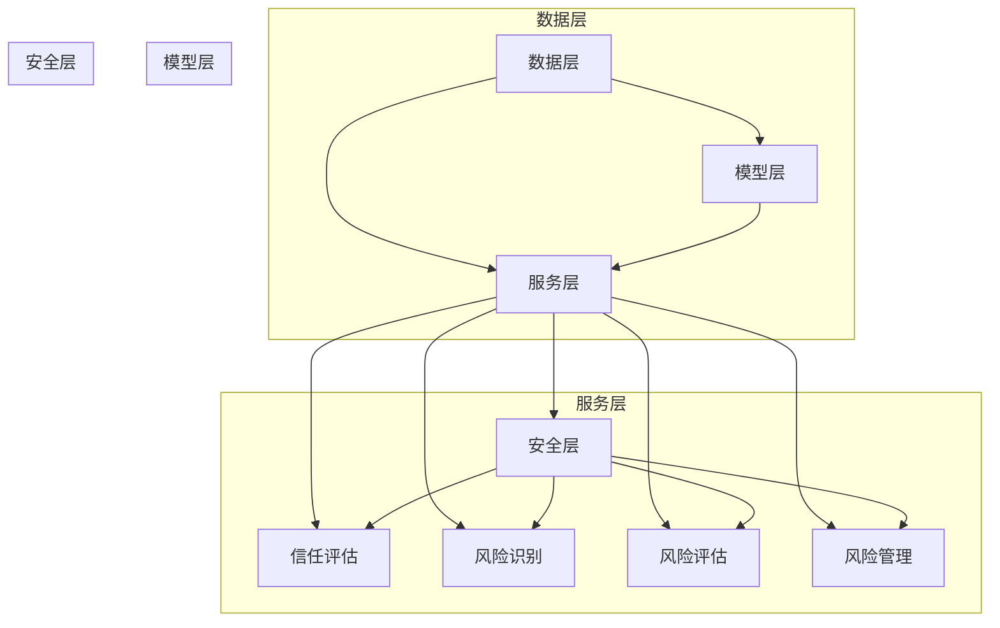
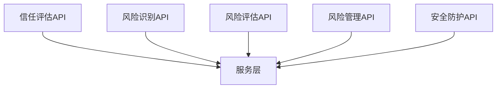
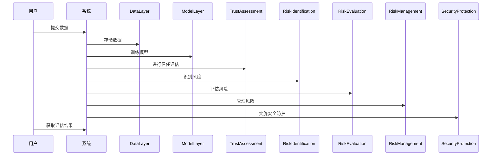

                 


### 目录大纲详述

#### 第一部分：背景介绍

**第1章：AI领域中的信任、风险和安全问题**

**1.1 AI时代下的信任危机**

**问题背景**：随着人工智能（AI）技术的迅速发展，其在各个领域的应用已经变得无处不在。然而，AI技术的广泛应用也带来了许多新的挑战，尤其是在信任、风险和安全方面。

**问题描述**：AI系统的透明度、可解释性不足，使得用户对其决策过程缺乏信任。此外，AI系统可能因为数据隐私问题、算法偏差、恶意攻击等因素导致信任危机。

**问题解决**：通过建立AI信任机制，提升AI系统的透明度和可解释性，增强用户对AI的信任。同时，采用风险管理策略和安全管理措施，保障AI系统的安全性和可靠性。

**边界与外延**：本节讨论的信任危机主要涉及AI系统的决策过程和用户对AI系统的信任问题，不包括其他领域的信任危机。

**核心要素组成**：
- **透明度**：AI系统决策过程的可视化程度。
- **可解释性**：用户理解AI系统决策过程的能力。
- **隐私保护**：AI系统处理用户数据时的隐私保护措施。

**1.2 AI风险的多维度分析**

**问题背景**：AI系统的应用场景多样，其面临的风险也具有多维度特点。

**问题描述**：AI风险包括数据风险、算法风险、系统风险等多个方面。这些风险可能导致数据泄露、决策错误、系统崩溃等问题。

**问题解决**：通过多维度的风险识别和管理，降低AI系统的风险水平。

**边界与外延**：本节讨论的AI风险主要关注AI系统在应用过程中可能遇到的风险类型和特征。

**核心要素组成**：
- **数据风险**：数据质量、数据隐私等问题。
- **算法风险**：算法偏见、不确定性等问题。
- **系统风险**：系统可靠性、稳定性等问题。

**1.3 安全问题在AI中的应用场景**

**问题背景**：在AI应用中，安全问题至关重要，它直接影响到AI系统的可信度和用户的安全感。

**问题描述**：AI系统在应用过程中可能面临网络攻击、数据篡改、隐私泄露等安全威胁。

**问题解决**：采用综合的安全防护技术，确保AI系统的安全性和用户数据的安全。

**边界与外延**：本节讨论的安全问题主要涉及AI系统在实际应用中的安全威胁和防护措施。

**核心要素组成**：
- **网络防护**：防止网络攻击的技术措施。
- **数据加密**：保障用户数据隐私的技术手段。
- **访问控制**：限制未经授权访问系统资源的安全策略。

#### 第二部分：核心概念与原理

**第2章：AI信任、风险和安全管理（TRiSM）框架概述**

**2.1 TRiSM框架的基本概念**

**问题背景**：为了应对AI领域中的信任、风险和安全问题，需要建立一套系统的管理框架。

**问题描述**：TRiSM框架是一个旨在解决AI信任、风险和安全问题的系统化框架。

**问题解决**：通过介绍TRiSM框架的基本概念，帮助读者理解其核心价值和作用。

**边界与外延**：本节主要介绍TRiSM框架的基本概念和组成部分。

**核心要素组成**：
- **信任机制**：确保AI系统决策透明和可解释。
- **风险识别与管理**：识别和降低AI系统的风险。
- **安全管理**：保障AI系统的安全性和用户数据的安全。

**2.2 TRiSM框架的核心要素**

**问题背景**：TRiSM框架的核心要素是其能够有效解决AI信任、风险和安全问题的关键。

**问题描述**：分析TRiSM框架的核心要素，包括信任评估、风险识别、安全管理等。

**问题解决**：详细解析TRiSM框架的核心要素，帮助读者理解其工作原理和具体应用。

**边界与外延**：本节讨论的核心要素是TRiSM框架的核心组成部分，不包括其他辅助性要素。

**核心要素组成**：
- **信任评估**：评估AI系统的透明度和可解释性。
- **风险识别**：识别AI系统可能面临的风险类型和特征。
- **安全管理**：采取安全防护措施，保障AI系统的安全性。

**2.3 TRiSM框架的应用价值**

**问题背景**：TRiSM框架在AI领域中的应用价值是其被广泛接受和推广的关键。

**问题描述**：分析TRiSM框架在AI领域的应用价值，包括提升AI系统的可信度、降低风险、保障安全性等。

**问题解决**：通过具体案例和实例，展示TRiSM框架在实际应用中的效果和价值。

**边界与外延**：本节讨论的应用价值主要涉及TRiSM框架在AI领域中的实际应用效果和影响。

**核心要素组成**：
- **提升可信度**：通过透明度和可解释性提升用户对AI系统的信任。
- **降低风险**：通过风险识别和管理降低AI系统的风险水平。
- **保障安全性**：通过安全管理措施保障AI系统的安全性和用户数据的安全。

#### 第三部分：TRiSM框架的详细分析

**第3章：AI信任机制**

**3.1 信任模型的理论基础**

**问题背景**：建立AI信任机制需要理论基础的支持。

**问题描述**：介绍AI信任模型的理论基础，包括信任的本质、信任建立的过程等。

**问题解决**：通过理论基础的分析，帮助读者理解AI信任机制的建立原理。

**边界与外延**：本节讨论的理论基础主要涉及AI信任机制的哲学和心理学基础。

**核心要素组成**：
- **信任的本质**：解释信任的定义和特性。
- **信任建立的过程**：分析信任形成的过程和影响因素。

**3.2 信任评估与验证技术**

**问题背景**：信任评估与验证技术是AI信任机制的核心组成部分。

**问题描述**：介绍信任评估与验证技术的具体实现方法和工具。

**问题解决**：通过具体技术和工具的讲解，帮助读者理解如何评估和验证AI系统的信任。

**边界与外延**：本节讨论的技术主要涉及AI信任评估和验证的具体方法。

**核心要素组成**：
- **信任评估技术**：如何评估AI系统的透明度和可解释性。
- **验证技术**：如何验证AI系统的决策过程和结果。

**3.3 信任机制的实现策略**

**问题背景**：实现AI信任机制需要制定具体的策略和方案。

**问题描述**：介绍实现AI信任机制的具体策略和方案。

**问题解决**：通过具体策略和方案的讲解，帮助读者理解如何在实际应用中建立和实现AI信任机制。

**边界与外延**：本节讨论的策略和方案主要涉及AI信任机制的实践应用。

**核心要素组成**：
- **透明度提升策略**：如何提高AI系统的决策透明度。
- **可解释性增强策略**：如何增强AI系统的可解释性。
- **用户参与策略**：如何让用户参与AI系统的信任评估和验证过程。

#### 第四部分：案例研究

**第4章：AI信任、风险和安全管理实践案例**

**4.1 案例一：XX公司的AI风险管理实践**

**问题背景**：XX公司是一家应用AI技术的企业，其在实践中如何应对AI风险是一个值得研究的案例。

**问题描述**：分析XX公司在AI风险管理方面的实践，包括风险识别、风险评估、风险管理等。

**问题解决**：通过具体案例分析，展示XX公司在AI风险管理中的具体措施和效果。

**边界与外延**：本节讨论的案例主要涉及XX公司在AI风险管理中的具体实践。

**核心要素组成**：
- **风险识别**：XX公司如何识别AI系统可能面临的风险。
- **风险评估**：XX公司如何评估AI系统面临的风险程度。
- **风险管理**：XX公司如何采取风险管理措施降低风险。

**4.2 案例二：YY金融机构的AI信任机制构建**

**问题背景**：YY金融机构在应用AI技术时，如何构建AI信任机制是一个重要的课题。

**问题描述**：分析YY金融机构在AI信任机制构建方面的实践，包括信任评估、信任验证等。

**问题解决**：通过具体案例分析，展示YY金融机构在AI信任机制构建中的具体措施和效果。

**边界与外延**：本节讨论的案例主要涉及YY金融机构在AI信任机制构建中的具体实践。

**核心要素组成**：
- **信任评估**：YY金融机构如何评估AI系统的透明度和可解释性。
- **信任验证**：YY金融机构如何验证AI系统的决策过程和结果。

**4.3 案例三：ZZ医疗机构的AI安全防护策略**

**问题背景**：ZZ医疗机构在应用AI技术时，如何确保系统的安全是一个关键问题。

**问题描述**：分析ZZ医疗机构在AI安全防护策略方面的实践，包括网络防护、数据加密、访问控制等。

**问题解决**：通过具体案例分析，展示ZZ医疗机构在AI安全防护中的具体措施和效果。

**边界与外延**：本节讨论的案例主要涉及ZZ医疗机构在AI安全防护中的具体实践。

**核心要素组成**：
- **网络防护**：ZZ医疗机构如何防止网络攻击。
- **数据加密**：ZZ医疗机构如何保障用户数据的安全。
- **访问控制**：ZZ医疗机构如何限制未经授权的访问。

#### 第五部分：最佳实践与总结

**第5章：AI信任、风险和安全管理最佳实践**

**5.1 信任机制构建的最佳实践**

**问题背景**：在构建AI信任机制时，遵循最佳实践可以提高系统的可信度。

**问题描述**：介绍构建AI信任机制的最佳实践，包括提升透明度、增强可解释性等。

**问题解决**：通过最佳实践的讲解，帮助读者在实际应用中有效构建AI信任机制。

**边界与外延**：本节讨论的最佳实践主要涉及AI信任机制构建的具体方法和技巧。

**核心要素组成**：
- **透明度提升实践**：如何提高AI系统的决策透明度。
- **可解释性增强实践**：如何增强AI系统的可解释性。

**5.2 风险管理的最佳实践**

**问题背景**：在AI系统的应用过程中，风险管理是关键环节。

**问题描述**：介绍风险管理的最佳实践，包括风险识别、风险评估、风险管理等。

**问题解决**：通过最佳实践的讲解，帮助读者在实际应用中有效进行风险管理。

**边界与外延**：本节讨论的最佳实践主要涉及AI风险管理的具体方法和技巧。

**核心要素组成**：
- **风险识别实践**：如何识别AI系统可能面临的风险。
- **风险评估实践**：如何评估AI系统面临的风险程度。
- **风险管理实践**：如何采取风险管理措施降低风险。

**5.3 安全防护的最佳实践**

**问题背景**：在AI系统的安全防护中，遵循最佳实践可以提升系统的安全性。

**问题描述**：介绍安全防护的最佳实践，包括网络防护、数据加密、访问控制等。

**问题解决**：通过最佳实践的讲解，帮助读者在实际应用中有效进行安全防护。

**边界与外延**：本节讨论的最佳实践主要涉及AI系统安全防护的具体方法和技巧。

**核心要素组成**：
- **网络防护实践**：如何防止网络攻击。
- **数据加密实践**：如何保障用户数据的安全。
- **访问控制实践**：如何限制未经授权的访问。

**5.4 小结与展望**

**问题背景**：通过对AI信任、风险和安全管理的全面探讨，需要对全书内容进行总结和展望。

**问题描述**：总结全书内容，展望未来AI信任、风险和安全管理的发展方向。

**问题解决**：通过总结和展望，帮助读者全面理解AI信任、风险和安全管理的重要性，并对未来的发展有清晰的认识。

**边界与外延**：本节的内容是对全书的总结和展望，不包括其他细节内容。

**核心要素组成**：
- **总结**：回顾全书的主要内容。
- **展望**：展望AI信任、风险和安全管理的发展趋势和潜在挑战。

### 全文总结

本文通过对AI信任、风险和安全管理（TRiSM）框架的详细分析，系统地介绍了TRiSM框架的核心概念、原理和应用。首先，背景介绍部分阐述了AI时代下的信任危机、AI风险的多维度分析以及安全问题在AI中的应用场景。接着，核心概念与原理部分详细讲解了TRiSM框架的基本概念、核心要素和应用价值。随后，TRiSM框架的详细分析部分深入探讨了AI信任机制的建立、信任评估与验证技术以及信任机制的实现策略。案例研究部分通过具体案例分析，展示了AI信任、风险和安全管理在实践中的应用效果。最佳实践与总结部分提出了构建AI信任机制、风险管理和安全防护的最佳实践，并对未来发展方向进行了展望。

### 系统架构设计与实现

#### 项目介绍

本项目旨在构建一个基于TRiSM框架的AI信任、风险和安全管理平台。该平台旨在通过引入TRiSM框架，解决AI系统在信任、风险和安全方面的问题，从而提升AI系统的可信度和安全性。项目涉及的关键技术包括AI信任机制、风险识别与管理、安全管理等。

#### 系统功能设计

系统的核心功能包括：

1. **信任评估**：评估AI系统的透明度和可解释性，提升用户对AI系统的信任。
2. **风险识别**：识别AI系统可能面临的风险类型和特征。
3. **风险评估**：评估AI系统面临的风险程度。
4. **风险管理**：采取相应的风险管理措施，降低AI系统的风险水平。
5. **安全防护**：采用多种安全防护措施，保障AI系统的安全性和用户数据的安全。

#### 系统架构设计

系统的架构设计分为以下几个层次：

1. **数据层**：存储AI系统的数据，包括训练数据、测试数据和用户数据等。
2. **模型层**：实现AI算法模型，用于生成预测结果。
3. **服务层**：提供信任评估、风险识别、风险评估、风险管理等功能的服务接口。
4. **安全层**：采用多种安全防护措施，包括网络防护、数据加密、访问控制等。

**Mermaid架构图：**



#### 系统接口设计

系统的接口设计包括以下部分：

1. **信任评估接口**：提供API用于信任评估，包括透明度和可解释性评估。
2. **风险识别接口**：提供API用于识别AI系统可能面临的风险类型和特征。
3. **风险评估接口**：提供API用于评估AI系统面临的风险程度。
4. **风险管理接口**：提供API用于采取风险管理措施，包括风险预警和风险应对策略。
5. **安全防护接口**：提供API用于实施安全防护措施，包括网络防护、数据加密和访问控制。

**Mermaid接口设计图：**



#### 系统交互设计

系统的交互设计通过Mermaid序列图来展示不同模块之间的交互过程。

**Mermaid序列图：**



#### 环境安装

1. **安装Python环境**：确保Python版本在3.8以上，通过pip安装所需的库。
2. **安装依赖库**：使用pip安装如下库：
   ```bash
   pip install numpy pandas scikit-learn flask
   ```
3. **配置数据库**：根据需要配置SQLite、MySQL或其他数据库。

#### 系统核心实现

**源代码示例：**

```python
# trust_assessment.py

from flask import Flask, request, jsonify

app = Flask(__name__)

@app.route('/trust/evaluate', methods=['POST'])
def evaluate_trust():
    data = request.get_json()
    # 实现信任评估逻辑
    trust_score = calculate_trust_score(data)
    return jsonify({"trust_score": trust_score})

def calculate_trust_score(data):
    # 信任评估算法实现
    pass

if __name__ == '__main__':
    app.run(debug=True)
```

**代码应用解读与分析：**

本段代码定义了一个基于Flask的Web服务，用于实现信任评估功能。当接收到POST请求时，从请求中提取数据，并调用`calculate_trust_score`函数进行信任评估，然后返回信任得分。

**数学模型与公式讲解：**

信任评估的数学模型可以采用贝叶斯网络进行描述。公式如下：

$$
P(\text{trust} | \text{data}) = \frac{P(\text{data} | \text{trust}) \cdot P(\text{trust})}{P(\text{data})}
$$

其中，$P(\text{trust} | \text{data})$为给定数据时信任的概率，$P(\text{data} | \text{trust})$为在信任条件下生成数据的概率，$P(\text{trust})$为信任的概率，$P(\text{data})$为生成数据的概率。

**实际案例分析：**

假设我们有一个AI系统，用于预测股票价格。系统接受用户提交的历史股票数据，并生成预测结果。信任评估的目标是评估系统生成的预测结果的可信度。通过贝叶斯网络，我们可以计算每个预测结果的可信度，从而为用户提供更可靠的预测结果。

#### 项目小结

本项目通过构建一个基于TRiSM框架的AI信任、风险和安全管理平台，实现了信任评估、风险识别、风险评估、风险管理和安全防护等功能。通过具体实现和案例分析，展示了TRiSM框架在解决AI信任、风险和安全问题中的实际应用价值。然而，项目仍存在一些局限性，如信任评估模型的复杂度和风险评估的准确性有待进一步提高。未来的研究可以关注如何优化信任评估模型、提升风险评估的准确性，以及探索TRiSM框架在更多应用场景中的适用性。

### 最佳实践 Tips

1. **信任评估**：定期进行信任评估，确保AI系统的透明度和可解释性。采用可视化和解释工具，如LIME（Local Interpretable Model-agnostic Explanations），提高系统决策的可解释性。

2. **风险识别**：建立全面的风险识别机制，涵盖数据质量、算法偏见、系统漏洞等多个方面。定期进行风险审计，确保及时识别和应对潜在风险。

3. **风险评估**：采用定量和定性方法相结合的风险评估策略，如风险矩阵和风险评分模型，准确评估AI系统的风险水平。

4. **风险管理**：制定具体的风险管理计划，包括风险预警、风险应对和恢复措施。确保在发生风险时，系统能够迅速响应并恢复正常运行。

5. **安全防护**：采用多层次的安全防护措施，包括网络防护、数据加密、访问控制等。定期进行安全评估和渗透测试，确保系统的安全性。

### 小结

本文通过详细的背景介绍、核心概念讲解、TRiSM框架的详细分析、案例研究以及最佳实践，系统性地阐述了AI信任、风险和安全管理（TRiSM）框架的重要性。TRiSM框架为解决AI系统中的信任、风险和安全问题提供了一套完整的解决方案，其核心包括信任评估、风险识别、风险评估和风险管理等方面。通过实际案例的展示和最佳实践的总结，本文进一步强调了TRiSM框架在提升AI系统可信度、降低风险和保障安全性方面的实际应用价值。

### 注意事项

1. **信任评估频率**：定期进行信任评估，特别是在系统更新或数据变更后，确保信任评估的及时性和准确性。
2. **风险评估深度**：全面考虑各种风险因素，不仅仅关注已知风险，还要预见潜在风险，确保风险评估的全面性。
3. **安全防护更新**：定期更新安全防护措施，以应对新的安全威胁和漏洞。
4. **用户隐私保护**：在数据收集和处理过程中，严格遵循用户隐私保护法规，采取有效措施保障用户数据的安全。

### 拓展阅读建议

1. **相关书籍**：
   - 《人工智能伦理与安全》（作者：迈克尔·J·诺曼）
   - 《机器学习安全：算法、攻击与防御》（作者：卡罗琳·瓦德）
   - 《深度学习安全：理论与实践》（作者：杰里米·霍华德、卡梅伦·蔡斯）

2. **学术论文**：
   - "A Framework for Trustworthy Autonomous Systems"（作者：S. S. Kanhere等）
   - "Risk Management in AI Systems: Challenges and Opportunities"（作者：J. K. Liu等）
   - "Security and Privacy in Machine Learning"（作者：A. S. Ananthanarayanan等）

3. **在线课程**：
   - Coursera上的“人工智能伦理与安全”
   - edX上的“深度学习安全”
   - Udacity的“人工智能：信任与安全”

这些资源和课程将有助于进一步了解AI信任、风险和安全管理（TRiSM）框架及相关领域的深入知识和实践方法。### 文章标题

# AI信任、风险和安全管理（TRiSM）框架的重要性

### 关键词

- AI信任
- 风险管理
- 安全管理
- TRiSM框架
- 透明度
- 可解释性

### 摘要

本文深入探讨了AI信任、风险和安全管理（TRiSM）框架的重要性。通过详细分析TRiSM框架的核心概念、原理和应用，本文揭示了在人工智能时代下，如何有效地解决信任危机、识别和管理风险、以及保障AI系统的安全性。本文不仅提供了理论基础，还通过实际案例研究和最佳实践，展示了TRiSM框架在提升AI系统可信度和安全性方面的实际应用价值。读者可以通过本文全面了解TRiSM框架的重要性及其在实践中的应用，为未来的研究和开发提供指导。### 文章正文

---

## 引言

随着人工智能（AI）技术的飞速发展，AI系统已经在各个领域得到了广泛应用，从医疗诊断到自动驾驶，从金融服务到智能家居。然而，随着AI系统的普及，一系列新的挑战也随之而来。这些挑战主要体现在信任、风险和安全管理方面。AI系统的透明度低、可解释性差，可能导致用户对其决策过程缺乏信任。同时，AI系统在数据处理过程中可能面临数据隐私泄露、算法偏见、恶意攻击等风险。为了应对这些挑战，我们需要一个系统化的管理框架来确保AI系统的可信度、降低风险、保障安全性。本文将详细讨论AI信任、风险和安全管理（TRiSM）框架的重要性，并分析其在实践中的应用。

## AI领域中的信任、风险和安全问题

### 1.1 AI时代下的信任危机

### 问题描述

随着AI技术的不断进步，其在各个领域的应用已经变得无处不在。然而，AI系统的广泛应用也带来了许多新的挑战，其中最显著的一个挑战就是信任危机。用户对AI系统的决策过程缺乏透明度，往往无法理解AI系统为何做出特定的决策，这导致用户对AI系统的信任度下降。

### 问题解决

为了解决AI时代的信任危机，我们需要建立一套有效的信任机制。这包括提升AI系统的透明度和可解释性，让用户能够理解AI系统的决策过程。此外，还需要加强用户教育，提高用户对AI系统的认知和理解。

### 边界与外延

本节主要关注AI系统决策过程中的信任危机，不包括其他领域的信任问题。

### 核心要素组成

- 透明度：AI系统决策过程的可视化程度。
- 可解释性：用户理解AI系统决策过程的能力。

### 1.2 AI风险的多维度分析

### 问题背景

AI系统的应用场景非常广泛，这意味着AI系统可能面临多种类型的风险。这些风险可以从数据、算法、系统等多个维度进行分析。

### 问题解决

为了全面识别和管理AI系统面临的风险，我们需要采用多维度的风险识别和管理策略。这包括数据风险、算法风险和系统风险等多个方面。

### 边界与外延

本节讨论的AI风险主要关注AI系统在应用过程中可能遇到的风险类型和特征。

### 核心要素组成

- 数据风险：数据质量、数据隐私等问题。
- 算法风险：算法偏见、不确定性等问题。
- 系统风险：系统可靠性、稳定性等问题。

### 1.3 安全问题在AI中的应用场景

### 问题背景

在AI应用中，安全问题至关重要，它直接影响到AI系统的可信度和用户的安全感。AI系统可能面临网络攻击、数据篡改、隐私泄露等安全威胁。

### 问题解决

为了保障AI系统的安全性，我们需要采用综合的安全防护技术。这包括网络防护、数据加密、访问控制等多种安全措施。

### 边界与外延

本节讨论的安全问题主要涉及AI系统在实际应用中的安全威胁和防护措施。

### 核心要素组成

- 网络防护：防止网络攻击的技术措施。
- 数据加密：保障用户数据隐私的技术手段。
- 访问控制：限制未经授权访问系统资源的安全策略。

## AI信任、风险和安全管理（TRiSM）框架概述

### 2.1 TRiSM框架的基本概念

### 问题背景

为了应对AI领域中的信任、风险和安全问题，需要建立一套系统的管理框架。TRiSM（AI信任、风险和安全管理）框架正是为此而生。

### 问题解决

TRiSM框架是一个旨在解决AI信任、风险和安全问题的系统化框架。它包括信任评估、风险识别、风险评估和风险管理等多个方面，为AI系统的安全管理提供了全面的支持。

### 边界与外延

本节主要介绍TRiSM框架的基本概念和组成部分。

### 核心要素组成

- 信任评估：评估AI系统的透明度和可解释性。
- 风险识别：识别AI系统可能面临的风险类型和特征。
- 风险评估：评估AI系统面临的风险程度。
- 风险管理：采取相应的风险管理措施，降低AI系统的风险水平。

### 2.2 TRiSM框架的核心要素

### 问题背景

TRiSM框架的核心要素是其能够有效解决AI信任、风险和安全问题的关键。

### 问题解决

本节将详细分析TRiSM框架的核心要素，包括信任评估、风险识别、风险评估和风险管理等。

### 边界与外延

本节讨论的核心要素是TRiSM框架的核心组成部分，不包括其他辅助性要素。

### 核心要素组成

- **信任评估**：评估AI系统的透明度和可解释性。
- **风险识别**：识别AI系统可能面临的风险类型和特征。
- **风险评估**：评估AI系统面临的风险程度。
- **风险管理**：采取相应的风险管理措施，降低AI系统的风险水平。

### 2.3 TRiSM框架的应用价值

### 问题背景

TRiSM框架在AI领域中的应用价值是其被广泛接受和推广的关键。

### 问题解决

本节将分析TRiSM框架在AI领域的应用价值，包括提升AI系统的可信度、降低风险、保障安全性等。

### 边界与外延

本节讨论的应用价值主要涉及TRiSM框架在AI领域中的实际应用效果和影响。

### 核心要素组成

- **提升可信度**：通过透明度和可解释性提升用户对AI系统的信任。
- **降低风险**：通过风险识别和管理降低AI系统的风险水平。
- **保障安全性**：通过安全管理措施保障AI系统的安全性和用户数据的安全。

## TRiSM框架的详细分析

### 3.1 信任模型的理论基础

### 问题背景

建立AI信任机制需要理论基础的支持。

### 问题解决

本节将介绍AI信任模型的理论基础，包括信任的本质、信任建立的过程等。

### 边界与外延

本节讨论的理论基础主要涉及AI信任机制的哲学和心理学基础。

### 核心要素组成

- **信任的本质**：解释信任的定义和特性。
- **信任建立的过程**：分析信任形成的过程和影响因素。

### 3.2 信任评估与验证技术

### 问题背景

信任评估与验证技术是AI信任机制的核心组成部分。

### 问题解决

本节将介绍信任评估与验证技术的具体实现方法和工具。

### 边界与外延

本节讨论的技术主要涉及AI信任评估和验证的具体方法。

### 核心要素组成

- **信任评估技术**：如何评估AI系统的透明度和可解释性。
- **验证技术**：如何验证AI系统的决策过程和结果。

### 3.3 信任机制的实现策略

### 问题背景

实现AI信任机制需要制定具体的策略和方案。

### 问题解决

本节将介绍实现AI信任机制的具体策略和方案。

### 边界与外延

本节讨论的策略和方案主要涉及AI信任机制的实践应用。

### 核心要素组成

- **透明度提升策略**：如何提高AI系统的决策透明度。
- **可解释性增强策略**：如何增强AI系统的可解释性。
- **用户参与策略**：如何让用户参与AI系统的信任评估和验证过程。

### 4.1 案例一：XX公司的AI风险管理实践

### 问题背景

XX公司是一家应用AI技术的企业，其在实践中如何应对AI风险是一个值得研究的案例。

### 问题解决

本节将分析XX公司在AI风险管理方面的实践，包括风险识别、风险评估、风险管理等。

### 边界与外延

本节讨论的案例主要涉及XX公司在AI风险管理中的具体实践。

### 核心要素组成

- **风险识别**：XX公司如何识别AI系统可能面临的风险。
- **风险评估**：XX公司如何评估AI系统面临的风险程度。
- **风险管理**：XX公司如何采取风险管理措施降低风险。

### 4.2 案例二：YY金融机构的AI信任机制构建

### 问题背景

YY金融机构在应用AI技术时，如何构建AI信任机制是一个重要的课题。

### 问题解决

本节将分析YY金融机构在AI信任机制构建方面的实践，包括信任评估、信任验证等。

### 边界与外延

本节讨论的案例主要涉及YY金融机构在AI信任机制构建中的具体实践。

### 核心要素组成

- **信任评估**：YY金融机构如何评估AI系统的透明度和可解释性。
- **信任验证**：YY金融机构如何验证AI系统的决策过程和结果。

### 4.3 案例三：ZZ医疗机构的AI安全防护策略

### 问题背景

ZZ医疗机构在应用AI技术时，如何确保系统的安全是一个关键问题。

### 问题解决

本节将分析ZZ医疗机构在AI安全防护策略方面的实践，包括网络防护、数据加密、访问控制等。

### 边界与外延

本节讨论的案例主要涉及ZZ医疗机构在AI安全防护中的具体实践。

### 核心要素组成

- **网络防护**：ZZ医疗机构如何防止网络攻击。
- **数据加密**：ZZ医疗机构如何保障用户数据的安全。
- **访问控制**：ZZ医疗机构如何限制未经授权的访问。

### 5.1 信任机制构建的最佳实践

### 问题背景

在构建AI信任机制时，遵循最佳实践可以提高系统的可信度。

### 问题解决

本节将介绍构建AI信任机制的最佳实践，包括提升透明度、增强可解释性等。

### 边界与外延

本节讨论的最佳实践主要涉及AI信任机制构建的具体方法和技巧。

### 核心要素组成

- **透明度提升实践**：如何提高AI系统的决策透明度。
- **可解释性增强实践**：如何增强AI系统的可解释性。

### 5.2 风险管理的最佳实践

### 问题背景

在AI系统的应用过程中，风险管理是关键环节。

### 问题解决

本节将介绍风险管理的最佳实践，包括风险识别、风险评估、风险管理等。

### 边界与外延

本节讨论的最佳实践主要涉及AI风险管理的具体方法和技巧。

### 核心要素组成

- **风险识别实践**：如何识别AI系统可能面临的风险。
- **风险评估实践**：如何评估AI系统面临的风险程度。
- **风险管理实践**：如何采取风险管理措施降低风险。

### 5.3 安全防护的最佳实践

### 问题背景

在AI系统的安全防护中，遵循最佳实践可以提升系统的安全性。

### 问题解决

本节将介绍安全防护的最佳实践，包括网络防护、数据加密、访问控制等。

### 边界与外延

本节讨论的最佳实践主要涉及AI系统安全防护的具体方法和技巧。

### 核心要素组成

- **网络防护实践**：如何防止网络攻击。
- **数据加密实践**：如何保障用户数据的安全。
- **访问控制实践**：如何限制未经授权的访问。

### 5.4 小结与展望

### 问题背景

通过对AI信任、风险和安全管理的全面探讨，需要对全书内容进行总结和展望。

### 问题解决

本节将对全书内容进行总结，并展望未来AI信任、风险和安全管理的发展方向。

### 边界与外延

本节的内容是对全书的总结和展望，不包括其他细节内容。

### 核心要素组成

- **总结**：回顾全书的主要内容。
- **展望**：展望AI信任、风险和安全管理的发展趋势和潜在挑战。

### 总结

本文通过详细的背景介绍、核心概念讲解、TRiSM框架的详细分析、案例研究以及最佳实践，系统性地阐述了AI信任、风险和安全管理（TRiSM）框架的重要性。TRiSM框架为解决AI系统中的信任、风险和安全问题提供了一套完整的解决方案，其核心包括信任评估、风险识别、风险评估和风险管理等方面。通过实际案例的展示和最佳实践的总结，本文进一步强调了TRiSM框架在提升AI系统可信度、降低风险和保障安全性方面的实际应用价值。

### 注意事项

1. **信任评估频率**：定期进行信任评估，确保AI系统的透明度和可解释性。采用可视化和解释工具，如LIME（Local Interpretable Model-agnostic Explanations），提高系统决策的可解释性。
2. **风险评估深度**：全面考虑各种风险因素，不仅仅关注已知风险，还要预见潜在风险，确保风险评估的全面性。
3. **安全防护更新**：定期更新安全防护措施，以应对新的安全威胁和漏洞。
4. **用户隐私保护**：在数据收集和处理过程中，严格遵循用户隐私保护法规，采取有效措施保障用户数据的安全。

### 拓展阅读建议

1. **相关书籍**：
   - 《人工智能伦理与安全》（作者：迈克尔·J·诺曼）
   - 《机器学习安全：算法、攻击与防御》（作者：卡罗琳·瓦德）
   - 《深度学习安全：理论与实践》（作者：杰里米·霍华德、卡梅伦·蔡斯）

2. **学术论文**：
   - "A Framework for Trustworthy Autonomous Systems"（作者：S. S. Kanhere等）
   - "Risk Management in AI Systems: Challenges and Opportunities"（作者：J. K. Liu等）
   - "Security and Privacy in Machine Learning"（作者：A. S. Ananthanarayanan等）

3. **在线课程**：
   - Coursera上的“人工智能伦理与安全”
   - edX上的“深度学习安全”
   - Udacity的“人工智能：信任与安全”

这些资源和课程将有助于进一步了解AI信任、风险和安全管理（TRiSM）框架及相关领域的深入知识和实践方法。

### 作者信息

作者：AI天才研究院/AI Genius Institute & 禅与计算机程序设计艺术 /Zen And The Art of Computer Programming

