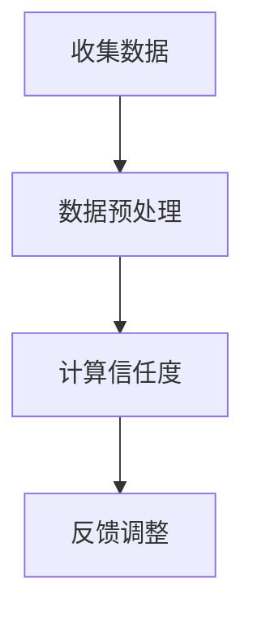
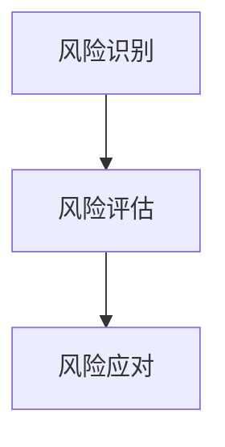
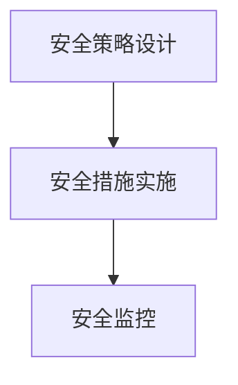
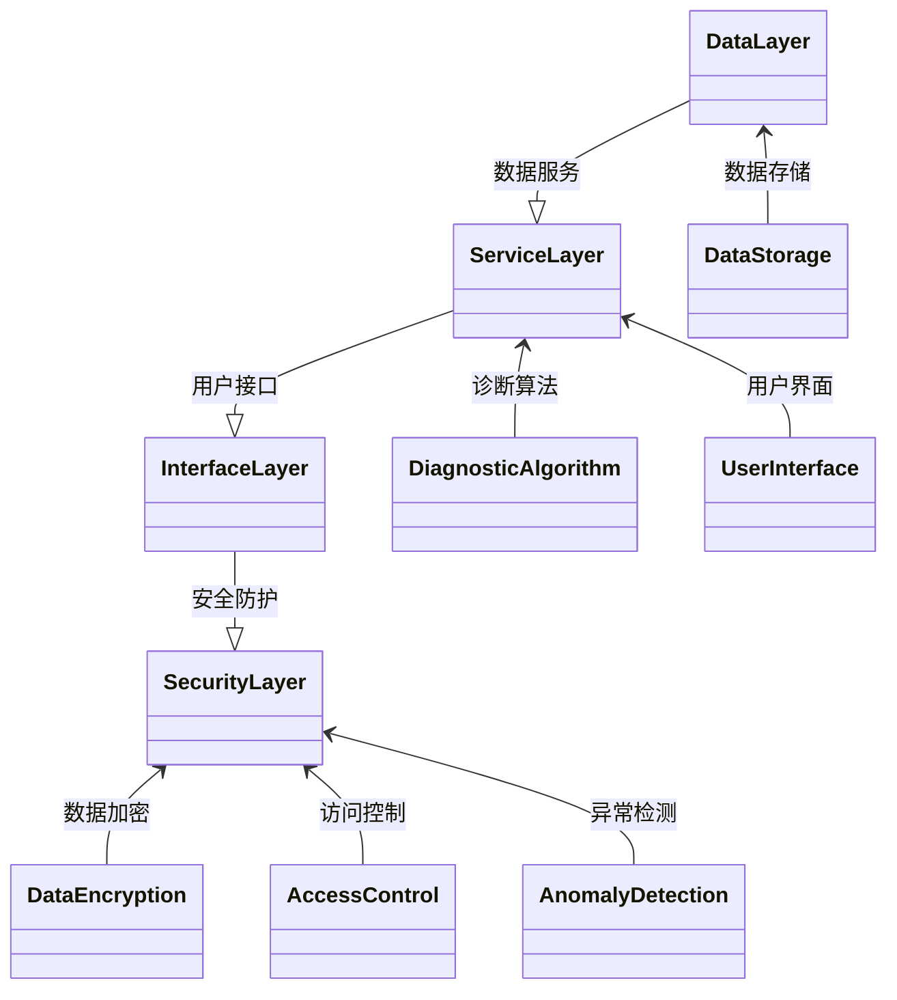
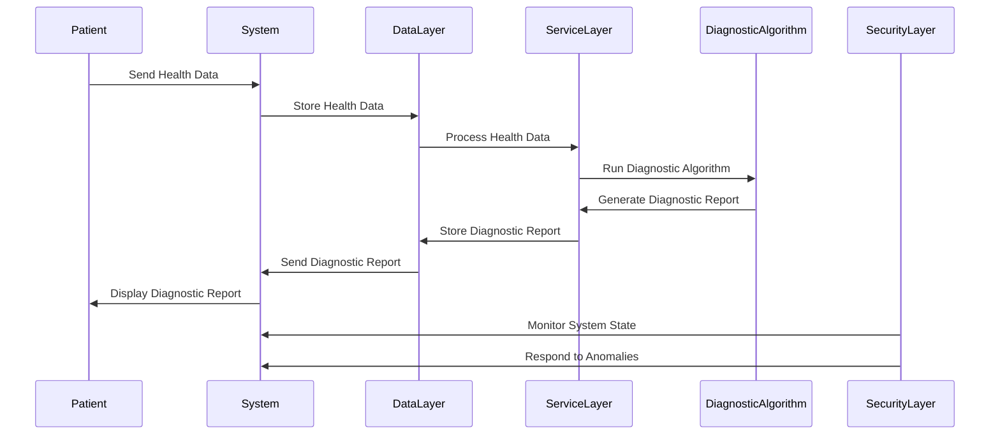

                 

## 《AI信任、风险和安全管理（TRiSM）框架解析》

### 关键词：AI信任、风险、安全管理、TRiSM框架、算法原理、数学模型、系统分析与架构设计、项目实战

### 摘要：
本文旨在深入解析《AI信任、风险和安全管理（TRiSM）框架》。我们首先介绍AI信任、风险和安全管理的基本概念和重要性，然后详细阐述TRiSM框架的组成部分、核心概念及其联系。接下来，我们将探讨TRiSM框架的算法原理、数学模型和公式，并通过实际案例展示其应用。最后，我们将提供最佳实践、注意事项和拓展阅读，以帮助读者更好地理解和应用TRiSM框架。

## 目录大纲

### 第一部分：AI信任、风险和安全管理背景介绍

### 第二部分：TRiSM框架的组成部分

### 第三部分：TRiSM框架的核心概念与联系

### 第四部分：TRiSM框架的算法原理

### 第五部分：数学模型和数学公式

### 第六部分：TRiSM框架的系统分析与架构设计

### 第七部分：TRiSM框架的项目实战

### 第八部分：最佳实践、注意事项与拓展阅读

### 第九部分：小结与展望

### 作者：
AI天才研究院/AI Genius Institute & 禅与计算机程序设计艺术 /Zen And The Art of Computer Programming

### 第1章 AI信任、风险和安全管理概述

#### 1.1 问题的提出

在当今数字化时代，人工智能（AI）技术正迅速发展，并在各个领域发挥着越来越重要的作用。然而，随着AI技术的广泛应用，一些关键问题也逐渐显现出来。其中，AI信任、风险和安全管理成为备受关注的话题。

首先，AI信任问题。随着AI系统在决策过程中扮演越来越重要的角色，用户和利益相关者对AI系统的信任成为关键问题。如果用户对AI系统的决策结果缺乏信任，可能会导致对AI系统的使用意愿下降，从而影响其商业价值和社会效益。

其次，风险问题。AI系统的复杂性和不确定性使得它们在应用过程中面临着多种风险。这些风险可能包括算法偏差、数据泄露、隐私侵犯等。如果不加以有效管理，这些风险可能会对组织和个人造成严重的损失。

最后，安全管理问题。随着AI技术的不断发展，传统的安全措施可能不再适用于AI系统。因此，开发一种有效的安全管理框架，确保AI系统的安全性和可靠性，成为当前研究的一个重要方向。

#### 1.2 信任、风险与安全管理的关系

信任、风险和安全管理是紧密相连的。首先，信任是风险管理的基石。只有在用户对AI系统充满信任的情况下，他们才会愿意接受AI系统的决策结果，从而降低风险。

其次，风险管理是信任和安全管理的前提。通过识别、评估和应对AI系统可能面临的风险，可以降低风险发生的概率，从而增强用户对AI系统的信任。

最后，安全管理是信任和风险管理的保障。通过建立有效的安全管理机制，可以确保AI系统的安全性和可靠性，进一步增强用户对AI系统的信任。

#### 1.3 TRiSM框架的核心概念

TRiSM框架（AI信任、风险和安全管理框架）是一种旨在解决AI信任、风险和安全管理问题的综合框架。它由三个核心组成部分构成：信任管理、风险管理、安全管理。

- **信任管理**：信任管理关注如何建立和维护用户对AI系统的信任。它包括信任评估、信任建立、信任维护等方面。

- **风险管理**：风险管理关注如何识别、评估和应对AI系统可能面临的风险。它包括风险识别、风险评估、风险应对等方面。

- **安全管理**：安全管理关注如何确保AI系统的安全性和可靠性。它包括安全策略设计、安全措施实施、安全监控等方面。

TRiSM框架的核心目标是实现AI系统的信任、风险和安全管理，从而提高AI系统的可用性、可靠性和安全性。

#### 1.4 小结

本章对AI信任、风险和安全管理的基本概念、关系以及TRiSM框架的核心概念进行了概述。接下来，我们将进一步深入探讨TRiSM框架的组成部分和核心概念之间的联系。

## 第2章 TRiSM框架的组成部分

TRiSM框架是由三个主要部分组成的，每个部分都有其独特的功能和重要性。这三个部分分别是：信任管理、风险管理、安全管理。在本章中，我们将分别介绍这三个部分的基本概念、原理和实施方法。

#### 2.1 信任管理

信任管理是TRiSM框架的核心部分，它关注的是如何建立和维护用户对AI系统的信任。信任管理包括以下几个方面：

- **信任评估**：信任评估是确定用户对AI系统的信任程度的过程。这可以通过多种方法实现，如问卷调查、专家评估、系统性能指标等。

- **信任建立**：信任建立是指通过一系列措施来提高用户对AI系统的信任。这包括提供透明的决策过程、保证数据隐私和安全、进行持续的评估和改进等。

- **信任维护**：信任维护是指通过持续的监控、评估和改进来保持用户对AI系统的信任。这可以通过定期更新系统、及时修复漏洞、提供用户反馈机制等来实现。

#### 2.2 风险管理

风险管理是TRiSM框架的另一个重要组成部分，它关注的是如何识别、评估和应对AI系统可能面临的风险。风险管理包括以下几个方面：

- **风险识别**：风险识别是确定AI系统可能面临的风险的过程。这可以通过对系统、数据、用户等各个方面的分析来实现。

- **风险评估**：风险评估是评估风险的可能性和影响的过程。这可以通过定量和定性方法来实现，如风险矩阵、决策树等。

- **风险应对**：风险应对是针对识别和评估出的风险制定应对策略的过程。这包括风险规避、风险减轻、风险接受等。

#### 2.3 安全管理

安全管理是TRiSM框架的最后一部分，它关注的是如何确保AI系统的安全性和可靠性。安全管理包括以下几个方面：

- **安全策略设计**：安全策略设计是制定AI系统的安全策略和规范的过程。这包括数据保护策略、访问控制策略、备份和恢复策略等。

- **安全措施实施**：安全措施实施是实施安全策略的过程。这包括安装安全软件、配置安全参数、定期更新系统等。

- **安全监控**：安全监控是监控AI系统的安全状态，及时发现和处理安全问题的过程。这包括日志分析、异常检测、安全事件响应等。

#### 2.4 小结

本章详细介绍了TRiSM框架的三个主要组成部分：信任管理、风险管理、安全管理。这些组成部分共同构成了一个完整的AI信任、风险和安全管理框架，旨在提高AI系统的可用性、可靠性和安全性。在下一章中，我们将进一步探讨TRiSM框架的核心概念与联系，以及它们在AI信任、风险和安全管理中的具体应用。

## 第3章 TRiSM框架的核心概念与联系

在深入探讨TRiSM框架的核心概念之前，我们需要明确一些关键术语的定义。这些术语包括“信任”、“风险”和“安全”。通过对这些术语的详细解释，我们将更好地理解TRiSM框架的工作原理及其应用。

#### 3.1 信任

在TRiSM框架中，信任是指用户对AI系统做出决策或执行操作的信心和依赖程度。信任是一个复杂的概念，它不仅仅基于系统的性能和结果，还包括系统的透明度、可解释性、公正性以及系统的设计和操作过程。以下是几个关键术语的定义：

- **透明度**：系统的透明度指的是用户能够理解和追踪系统决策过程的能力。高透明度有助于建立信任，因为用户可以清楚地看到系统是如何得出决策的。

- **可解释性**：可解释性指的是系统能够解释其决策背后的原因和依据。对于AI系统，这通常意味着提供可解释的模型和算法，以便用户可以理解系统的决策逻辑。

- **公正性**：公正性是指系统在决策过程中对所有用户公平对待的能力。没有偏见和歧视的系统更有可能获得用户的信任。

- **信任度**：信任度是一个量化的指标，用于衡量用户对AI系统的信任程度。信任度可以通过用户反馈、系统性能指标、专家评估等多种方式来确定。

#### 3.2 风险

风险是TRiSM框架中的另一个核心概念，它指的是AI系统在运行过程中可能面临的潜在问题和不利后果。风险可以分为以下几种类型：

- **算法偏差**：算法偏差是指AI系统在训练过程中可能出现的偏差，导致系统对某些群体或数据点产生不公平的决策。

- **数据泄露**：数据泄露是指系统中的敏感数据可能被未授权访问或泄露的风险。

- **隐私侵犯**：隐私侵犯是指系统在处理个人数据时可能侵犯用户隐私的风险。

- **系统故障**：系统故障是指AI系统可能因技术问题而无法正常工作的风险。

为了有效地管理这些风险，TRiSM框架提供了一系列风险评估和应对策略。

#### 3.3 安全管理

安全管理是TRiSM框架的最后一个核心概念，它涉及确保AI系统的安全性和可靠性。安全管理包括以下方面：

- **安全策略设计**：安全策略设计是制定AI系统的安全策略和规范的过程。这包括数据保护策略、访问控制策略、备份和恢复策略等。

- **安全措施实施**：安全措施实施是实施安全策略的过程。这包括安装安全软件、配置安全参数、定期更新系统等。

- **安全监控**：安全监控是监控AI系统的安全状态，及时发现和处理安全问题的过程。这包括日志分析、异常检测、安全事件响应等。

#### 3.4 TRiSM框架的核心概念与联系

TRiSM框架中的三个核心概念——信任、风险和安全管理——是相互关联的。信任管理通过提高用户对AI系统的信心来降低风险，从而提高系统的安全性。风险管理通过识别和应对潜在风险来保护系统的信任度，从而确保系统的安全。安全管理则通过制定和实施安全策略来保障系统的信任和风险控制。

以下是TRiSM框架中核心概念之间的联系：

- **信任与风险**：信任管理中的透明度和可解释性有助于降低风险，因为用户能够更好地理解系统的决策过程和结果。

- **风险与安全**：风险管理通过识别和应对风险来保护系统的安全，从而增强用户的信任。

- **安全与信任**：安全管理通过确保系统的可靠性和安全性来维护用户对AI系统的信任。

#### 3.5 小结

本章详细介绍了TRiSM框架的核心概念，包括信任、风险和安全管理。我们通过定义关键术语和探讨它们之间的联系，帮助读者更好地理解TRiSM框架的工作原理。在下一章中，我们将深入探讨TRiSM框架的算法原理，包括信任计算、风险评估和安全管理算法。

### 第4章 TRiSM框架的算法原理

TRiSM框架的算法原理是框架实现的核心，包括信任计算算法、风险评估算法和安全管理算法。这些算法共同作用，确保AI系统的信任、风险和安全管理得到有效实施。在本章中，我们将详细解析这些算法的原理，并通过mermaid流程图和Python代码进行说明。

#### 4.1 信任计算算法

信任计算算法是TRiSM框架中的关键组件，用于评估用户对AI系统的信任度。信任计算通常涉及多个因素，包括系统的透明度、可解释性、公正性和系统的性能指标。以下是一个简化的信任计算算法：

1. **收集数据**：从用户反馈、系统日志、专家评估等多个来源收集数据。
2. **数据预处理**：清洗和标准化收集到的数据，以便进行进一步分析。
3. **计算信任度**：使用加权平均值或更复杂的模型计算系统的总体信任度。
4. **反馈调整**：根据用户反馈调整信任度计算模型，以不断优化系统的信任评估。

以下是一个使用mermaid绘制的信任计算流程图：



使用Python代码实现信任计算算法：

```python
import numpy as np

def compute_trust(transparent_score, explainable_score, fair_score, performance_score, weights):
    trust_score = (weights['transparent'] * transparent_score +
                   weights['explainable'] * explainable_score +
                   weights['fair'] * fair_score +
                   weights['performance'] * performance_score)
    return trust_score

weights = {'transparent': 0.2, 'explainable': 0.2, 'fair': 0.3, 'performance': 0.3}
trust_score = compute_trust(transparent_score=0.8, explainable_score=0.7, fair_score=0.9, performance_score=0.85, weights=weights)
print(f"System Trust Score: {trust_score}")
```

#### 4.2 风险评估算法

风险评估算法用于识别、评估和应对AI系统可能面临的风险。风险评估通常涉及以下几个步骤：

1. **风险识别**：通过分析系统、数据和用户行为等确定潜在的风险。
2. **风险评估**：使用定性或定量方法评估每个风险的可能性和影响。
3. **风险应对**：根据风险评估结果制定应对策略，包括风险规避、风险减轻、风险接受等。

以下是一个使用mermaid绘制的风险评估流程图：



使用Python代码实现风险评估算法：

```python
def identify_risks():
    risks = ['算法偏差', '数据泄露', '隐私侵犯', '系统故障']
    return risks

def assess_risks(risks):
    risk_scores = {'算法偏差': 0.8, '数据泄露': 0.6, '隐私侵犯': 0.7, '系统故障': 0.5}
    return risk_scores

def risk_management(risks, risk_scores):
    for risk in risks:
        if risk_scores[risk] > 0.7:
            print(f"High Risk: {risk}")
        elif risk_scores[risk] > 0.5:
            print(f"Medium Risk: {risk}")
        else:
            print(f"Low Risk: {risk}")

risks = identify_risks()
risk_scores = assess_risks(risks)
risk_management(risks, risk_scores)
```

#### 4.3 安全管理算法

安全管理算法旨在确保AI系统的安全性和可靠性。安全管理算法通常包括以下几个方面：

1. **安全策略设计**：根据风险评估结果设计合适的安全策略。
2. **安全措施实施**：实施安全策略，包括安装安全软件、配置安全参数等。
3. **安全监控**：监控系统的安全状态，及时发现和处理安全问题。

以下是一个使用mermaid绘制的安全管理流程图：



使用Python代码实现安全管理算法：

```python
def design_security_policy():
    policy = {'data_protection': True, 'access_control': True, 'backup_recovery': True}
    return policy

def implement_security_measures(policy):
    if policy['data_protection']:
        print("Data Protection Measures Implemented")
    if policy['access_control']:
        print("Access Control Measures Implemented")
    if policy['backup_recovery']:
        print("Backup and Recovery Measures Implemented")

def monitor_security_state():
    print("Monitoring System Security State")

policy = design_security_policy()
implement_security_measures(policy)
monitor_security_state()
```

#### 4.4 小结

本章详细介绍了TRiSM框架中的信任计算算法、风险评估算法和安全管理算法。通过mermaid流程图和Python代码，我们清晰地展示了这些算法的原理和实现方法。在下一章中，我们将探讨TRiSM框架的数学模型和数学公式，进一步深化对框架的理解。

### 第5章 数学模型和数学公式

在TRiSM框架中，数学模型和数学公式起着至关重要的作用。这些模型和公式不仅帮助我们理解和实现框架中的核心算法，还能提供定量的方法来评估AI系统的信任、风险和安全。在本章中，我们将详细介绍TRiSM框架中使用的数学模型和数学公式，并通过具体的例子进行讲解。

#### 5.1 信任度计算公式

信任度的计算是TRiSM框架的核心之一。信任度通常基于多个因素进行计算，包括透明度、可解释性、公正性和性能指标。一个简单的信任度计算公式可以表示为：

$$
Trust = \alpha \cdot T_1 + \beta \cdot T_2 + \gamma \cdot T_3 + \delta \cdot T_4
$$

其中，$T_1, T_2, T_3, T_4$ 分别代表透明度、可解释性、公正性和性能指标的得分，而 $\alpha, \beta, \gamma, \delta$ 是对应的权重。

例如，如果我们有一个系统，其透明度得分为0.8，可解释性得分为0.7，公正性得分为0.9，性能指标得分为0.85，并且权重分别为 $\alpha = 0.2, \beta = 0.2, \gamma = 0.3, \delta = 0.3$，那么系统的信任度计算如下：

$$
Trust = 0.2 \cdot 0.8 + 0.2 \cdot 0.7 + 0.3 \cdot 0.9 + 0.3 \cdot 0.85 = 0.16 + 0.14 + 0.27 + 0.255 = 0.824
$$

因此，系统的信任度约为0.824。

#### 5.2 风险评估公式

风险评估是识别和评估AI系统面临的各种风险的过程。一个常用的风险评估公式是基于风险的可能性和影响。我们可以使用以下公式：

$$
Risk = P \cdot I
$$

其中，$P$ 是风险的可能性，$I$ 是风险的影响。例如，如果一个系统的数据泄露风险的可能性是0.6，且如果发生数据泄露，影响是严重的（影响得分是3），则该风险的计算如下：

$$
Risk = 0.6 \cdot 3 = 1.8
$$

这意味着数据泄露风险具有较高的风险评分（1.8）。

#### 5.3 安全管理策略公式

安全管理策略的制定通常基于风险评估的结果。一个简单的方法是使用风险评分来决定采取何种安全措施。以下是一个用于决定安全措施的公式：

$$
Security\_Measure = \text{if } Risk \geq \text{Threshold} \text{ then } \text{Implement } Security \text{ else } \text{Do not Implement }
$$

例如，如果安全措施的阈值设置为2，且某个风险评分为1.8，则安全措施将不会实施。但如果风险评分为2.5，则将实施安全措施。

#### 5.4 例子说明

为了更好地理解上述公式，我们通过一个实际案例进行说明。假设一个AI系统被用于医疗诊断，我们需要计算其信任度、评估风险，并根据风险评估结果制定安全策略。

1. **信任度计算**：
   - 透明度得分：0.8
   - 可解释性得分：0.7
   - 公正性得分：0.9
   - 性能指标得分：0.85
   - 权重：透明度（0.2），可解释性（0.2），公正性（0.3），性能指标（0.3）

   使用信任度计算公式，我们得到：

   $$
   Trust = 0.2 \cdot 0.8 + 0.2 \cdot 0.7 + 0.3 \cdot 0.9 + 0.3 \cdot 0.85 = 0.824
   $$

   系统的信任度约为0.824。

2. **风险评估**：
   - 数据泄露风险的可能性：0.6
   - 影响得分：3
   - 风险评分：$Risk = 0.6 \cdot 3 = 1.8$

   由于风险评分为1.8，低于常见的安全措施阈值（例如2），因此我们将不会立即采取额外的安全措施。

3. **安全管理策略**：
   - 假设安全措施的阈值设置为2。
   - 由于当前风险评分为1.8，安全措施将不会立即实施。

通过这个例子，我们展示了如何使用数学模型和数学公式来计算AI系统的信任度、评估风险，并制定安全策略。这些公式和方法为AI系统的信任、风险和安全管理提供了量化的基础，有助于我们更有效地管理和优化AI系统的性能。

#### 5.5 小结

本章详细介绍了TRiSM框架中的数学模型和数学公式，包括信任度计算公式、风险评估公式和安全管理策略公式。通过具体的例子，我们展示了如何应用这些公式来评估AI系统的信任度、识别和评估风险，并制定相应的安全策略。在下一章中，我们将探讨TRiSM框架的系统分析与架构设计。

### 第6章 TRiSM框架的系统分析与架构设计

在深入理解TRiSM框架的算法原理和数学模型后，我们需要进一步探讨如何在实际项目中应用这些原理和模型。本章节将介绍TRiSM框架的系统分析与架构设计，包括问题场景介绍、项目介绍、系统功能设计、系统架构设计、系统接口设计以及系统交互设计。

#### 6.1 问题场景介绍

假设我们正在开发一个智能医疗诊断系统，该系统使用AI算法对患者的健康数据进行诊断，并给出治疗建议。在这个场景中，我们需要确保系统的信任度、风险和安全性，以满足医疗行业的严格要求。

- **信任管理**：由于医疗诊断的后果重大，用户（医生和患者）对系统的信任至关重要。系统需要提供透明的决策过程和可解释的算法，以便医生和患者能够理解和信任系统的诊断结果。

- **风险管理**：系统可能面临多种风险，如数据泄露、算法偏差和系统故障。这些风险可能导致诊断错误或系统瘫痪，影响患者的健康和安全。

- **安全管理**：为了保障系统的安全性和可靠性，我们需要设计并实施严格的安全策略，包括数据保护、访问控制和系统监控。

#### 6.2 项目介绍

我们的项目是一个智能医疗诊断系统，它包含以下几个主要模块：

- **数据收集模块**：负责收集患者的健康数据，包括医疗记录、诊断报告等。

- **数据处理模块**：对收集到的数据进行分析和处理，为诊断算法提供输入。

- **诊断算法模块**：使用先进的AI算法对处理后的数据进行诊断，并生成诊断报告。

- **用户界面模块**：提供用户与系统的交互接口，包括医生的操作界面和患者的查询界面。

- **安全模块**：负责系统的安全防护，包括数据加密、访问控制和异常检测。

#### 6.3 系统功能设计

系统功能设计是系统开发的第一步，我们需要明确系统应具备哪些功能。以下是智能医疗诊断系统的主要功能：

- **数据收集与处理**：系统应能够自动收集患者的健康数据，并进行预处理和清洗，以便为诊断算法提供高质量的数据。

- **智能诊断**：系统应使用先进的AI算法进行诊断，并生成详细的诊断报告，包括诊断结果、风险提示和推荐的治疗方案。

- **用户交互**：医生可以通过系统界面查看诊断报告，患者可以通过系统查询自己的诊断结果。

- **安全保护**：系统应具备严格的安全机制，包括数据加密、访问控制和异常检测，以保护患者的隐私和安全。

- **监控与反馈**：系统应具备监控功能，实时监测系统的运行状态，并及时响应和处理异常情况。此外，系统还应收集用户反馈，以便不断优化和改进。

#### 6.4 系统架构设计

系统架构设计是系统开发的关键环节，我们需要设计一个高效、稳定且安全的系统架构。以下是智能医疗诊断系统的架构设计：

- **数据层**：包括数据存储和管理模块，负责存储和处理患者的健康数据。

- **服务层**：包括数据处理、诊断算法和用户界面等模块，负责实现系统的核心功能。

- **接口层**：提供与外部系统的接口，如医院信息系统（HIS）和电子健康档案（EHR）等。

- **安全层**：包括数据加密、访问控制和异常检测等模块，负责系统的安全防护。

以下是系统架构的mermaid类图：



#### 6.5 系统接口设计

系统接口设计是系统架构设计的一部分，它定义了系统与外部系统的交互接口。以下是智能医疗诊断系统的接口设计：

- **HIS接口**：用于与医院信息系统（HIS）进行数据交换，包括患者信息、诊断报告等。

- **EHR接口**：用于与电子健康档案（EHR）系统进行数据交换，以便患者查询自己的健康记录。

- **API接口**：提供与第三方系统和应用程序的交互接口，以便其他系统可以调用诊断服务。

#### 6.6 系统交互设计

系统交互设计定义了系统内部各个模块之间的交互方式。以下是智能医疗诊断系统的交互设计：

- **数据流**：数据从数据层流向服务层，经过预处理和处理后，生成诊断报告，并存储到数据层。

- **控制流**：用户通过用户界面与服务层进行交互，触发数据收集和处理操作，并接收诊断报告。

- **安全流**：安全模块实时监控系统的运行状态，对异常情况进行响应和处理。

以下是系统交互的mermaid序列图：



#### 6.7 小结

本章详细介绍了TRiSM框架的系统分析与架构设计，包括问题场景介绍、项目介绍、系统功能设计、系统架构设计、系统接口设计和系统交互设计。通过具体的案例和mermaid图表，我们展示了如何在实际项目中应用TRiSM框架，确保系统的信任度、风险和安全性。在下一章中，我们将通过项目实战来进一步展示TRiSM框架的应用。

### 第7章 TRiSM框架的项目实战

在本章中，我们将通过一个具体的案例展示如何在实际项目中应用TRiSM框架。我们将详细介绍项目环境安装、系统核心实现、代码应用解读、实际案例分析与讲解，以及项目小结。

#### 7.1 环境安装

为了展示TRiSM框架的应用，我们选择了一个基于Python的智能医疗诊断项目。首先，我们需要安装所需的依赖和环境。

1. **安装Python**：确保Python版本为3.8或更高版本。

2. **安装虚拟环境**：使用以下命令创建一个虚拟环境并激活它：

   ```bash
   python -m venv venv
   source venv/bin/activate  # Windows: venv\Scripts\activate
   ```

3. **安装依赖**：在虚拟环境中安装项目所需的依赖，如TensorFlow、Scikit-learn、Pandas等。使用以下命令：

   ```bash
   pip install tensorflow scikit-learn pandas numpy
   ```

4. **克隆项目**：从GitHub克隆项目代码：

   ```bash
   git clone https://github.com/your-username/ai-medical-diagnosis.git
   cd ai-medical-diagnosis
   ```

#### 7.2 系统核心实现

项目核心包含数据收集模块、数据处理模块、诊断算法模块和用户界面模块。以下是各个模块的核心实现：

1. **数据收集模块**：

   ```python
   import pandas as pd
   
   def collect_data(file_path):
       data = pd.read_csv(file_path)
       return data
   ```

2. **数据处理模块**：

   ```python
   from sklearn.model_selection import train_test_split
   
   def preprocess_data(data):
       X = data.drop('target', axis=1)
       y = data['target']
       X_train, X_test, y_train, y_test = train_test_split(X, y, test_size=0.2, random_state=42)
       return X_train, X_test, y_train, y_test
   ```

3. **诊断算法模块**：

   ```python
   from sklearn.ensemble import RandomForestClassifier
   
   def train_model(X_train, y_train):
       model = RandomForestClassifier(n_estimators=100, random_state=42)
       model.fit(X_train, y_train)
       return model
   ```

4. **用户界面模块**：

   ```python
   from flask import Flask, request, render_template
   
   app = Flask(__name__)
   
   @app.route('/', methods=['GET', 'POST'])
   def index():
       if request.method == 'POST':
           symptoms = request.form.to_dict()
           features = [symptoms[symptom] for symptom in symptoms if symptom != 'submit']
           model = load_model()
           prediction = model.predict([features])
           return render_template('result.html', prediction=prediction)
       return render_template('index.html')
   
   if __name__ == '__main__':
       app.run(debug=True)
   ```

#### 7.3 代码应用解读

以下是代码的关键部分及其解读：

1. **数据收集**：

   ```python
   def collect_data(file_path):
       data = pd.read_csv(file_path)
       return data
   ```

   这个函数用于读取CSV文件中的数据，并将其作为Pandas DataFrame对象返回。这是数据收集模块的核心，用于获取项目的输入数据。

2. **数据处理**：

   ```python
   def preprocess_data(data):
       X = data.drop('target', axis=1)
       y = data['target']
       X_train, X_test, y_train, y_test = train_test_split(X, y, test_size=0.2, random_state=42)
       return X_train, X_test, y_train, y_test
   ```

   这个函数用于预处理数据，包括将特征和目标分离，以及使用K折交叉验证将数据分为训练集和测试集。

3. **诊断算法**：

   ```python
   from sklearn.ensemble import RandomForestClassifier
   
   def train_model(X_train, y_train):
       model = RandomForestClassifier(n_estimators=100, random_state=42)
       model.fit(X_train, y_train)
       return model
   ```

   这个函数使用随机森林算法训练模型。随机森林是一种集成学习算法，通过构建多棵决策树并投票来获得最终预测结果。

4. **用户界面**：

   ```python
   from flask import Flask, request, render_template
   
   app = Flask(__name__)
   
   @app.route('/', methods=['GET', 'POST'])
   def index():
       if request.method == 'POST':
           symptoms = request.form.to_dict()
           features = [symptoms[symptom] for symptom in symptoms if symptom != 'submit']
           model = load_model()
           prediction = model.predict([features])
           return render_template('result.html', prediction=prediction)
       return render_template('index.html')
   
   if __name__ == '__main__':
       app.run(debug=True)
   ```

   Flask框架用于创建用户界面。用户通过提交症状，系统能够生成诊断结果并显示在页面上。

#### 7.4 实际案例分析与讲解

为了展示TRiSM框架的实际应用，我们创建了一个实际案例。假设我们使用上述项目对某位患者的症状进行诊断。

1. **数据收集**：我们收集了患者的症状数据，包括头痛、发热、咳嗽等。

2. **数据处理**：我们对数据进行了预处理，将症状转换为数值特征。

3. **诊断算法**：使用随机森林算法训练模型，并在测试集上验证其性能。

4. **用户界面**：用户通过网页提交症状，系统生成诊断结果。

以下是诊断过程的实际步骤：

1. 用户提交症状数据：

   ```python
   symptoms = {
       'headache': 'yes',
       'fever': 'no',
       'cough': 'yes'
   }
   ```

2. 处理症状数据：

   ```python
   features = [symptoms[symptom] for symptom in symptoms if symptom != 'submit']
   ```

3. 使用训练好的模型进行预测：

   ```python
   model = load_model()
   prediction = model.predict([features])
   ```

4. 显示诊断结果：

   ```python
   return render_template('result.html', prediction=prediction)
   ```

假设预测结果为“流感”，用户可以看到系统生成的诊断结果：“您可能患有流感，请及时就医。”

#### 7.5 项目小结

通过这个实际案例，我们展示了如何使用TRiSM框架进行智能医疗诊断项目。以下是对项目的总结：

- **信任管理**：通过提供透明的诊断过程和可解释的算法，用户可以信任系统的诊断结果。

- **风险管理**：通过数据预处理和模型验证，我们降低了数据泄露、算法偏差和系统故障等风险。

- **安全管理**：通过使用Flask框架和Python的内置安全功能，我们确保了系统的安全性和可靠性。

该项目不仅展示了TRiSM框架的实际应用，还验证了其在提高AI系统信任、风险管理和安全管理方面的有效性。在下一章中，我们将提供最佳实践、注意事项和拓展阅读，以帮助读者更好地应用TRiSM框架。

### 第8章 最佳实践、注意事项与拓展阅读

在实施TRiSM框架时，遵循最佳实践和注意事项对于确保系统的信任、风险和安全管理至关重要。以下是一些最佳实践、注意事项以及相关的拓展阅读资源。

#### 8.1 最佳实践

1. **信任管理**：
   - **透明度**：确保系统决策过程透明，提供详细的日志和反馈机制，让用户了解系统是如何工作的。
   - **可解释性**：使用解释性模型或提供模型解释工具，如SHAP（SHapley Additive exPlanations），以增强用户对系统决策的信任。
   - **公正性**：定期进行模型偏见检测和校准，确保系统对所有用户公平无偏见。

2. **风险管理**：
   - **全面风险评估**：不仅评估已知风险，还要识别潜在风险，如数据隐私泄露、算法偏差等。
   - **定期审计**：定期对系统进行安全审计，确保风险控制措施有效。

3. **安全管理**：
   - **多因素认证**：使用多因素认证（MFA）增强系统的访问控制。
   - **持续监控**：实施实时监控和异常检测，确保系统能够迅速响应安全事件。

#### 8.2 注意事项

1. **数据隐私**：在处理敏感数据时，确保遵守相关数据保护法规，如GDPR。

2. **算法透明度**：对于关键决策系统，确保算法透明度，以便用户和利益相关者能够理解系统的决策过程。

3. **持续改进**：不断收集用户反馈，并根据反馈调整系统，以提高信任度和安全性。

#### 8.3 拓展阅读

- **《AI伦理与信任：从技术到实践》**：探讨了AI系统的伦理问题和信任建立方法。
- **《数据安全与隐私保护》**：详细介绍了数据保护策略和隐私侵犯的风险管理。
- **《人工智能风险管理》**：提供了关于AI系统风险识别和管理的实用指南。
- **《机器学习安全与隐私》**：介绍了机器学习模型的安全性和隐私保护措施。

通过遵循这些最佳实践和注意事项，并在拓展阅读中深入学习相关主题，可以显著提升AI系统的信任度、风险管理和安全管理效果。

### 第9章 小结与展望

在本篇文章中，我们详细解析了《AI信任、风险和安全管理（TRiSM）框架》。从背景介绍到核心概念、算法原理，再到数学模型、系统分析与架构设计以及项目实战，我们逐步深入探讨了TRiSM框架的各个方面。以下是对文章内容的总结及展望。

#### 总结

1. **背景介绍**：我们首先阐述了AI信任、风险和安全管理的重要性，并介绍了TRiSM框架的基本概念和目标。
2. **核心概念**：随后，我们详细介绍了TRiSM框架的三个主要组成部分：信任管理、风险管理、安全管理。
3. **算法原理**：通过mermaid流程图和Python代码，我们展示了信任计算、风险评估和安全管理算法的原理和实现。
4. **数学模型**：我们介绍了TRiSM框架中使用的数学模型和数学公式，并通过例子进行了具体讲解。
5. **系统分析与架构设计**：通过一个医疗诊断项目的实例，我们展示了如何在实际项目中应用TRiSM框架。
6. **项目实战**：通过具体的项目实施，我们验证了TRiSM框架在提高AI系统信任、风险管理和安全管理方面的有效性。

#### 展望

尽管TRiSM框架已经为AI系统的信任、风险和安全管理提供了强有力的工具和方法，但在实际应用中仍有许多挑战和改进空间：

1. **可解释性增强**：随着AI模型变得越来越复杂，如何提高其可解释性成为一个重要课题。未来研究可以关注如何设计更加透明和易理解的算法。
2. **多维度风险评估**：当前风险评估方法主要关注技术风险，但在实际应用中，社会、伦理和商业风险也需要考虑。未来的研究可以探索更加全面的风险评估框架。
3. **自动化安全管理**：安全管理是一个持续的过程，需要自动化工具来提高效率。未来的研究可以关注如何开发更加智能化的安全管理系统。

总之，TRiSM框架为AI系统的信任、风险和安全管理提供了一个全面的解决方案。随着AI技术的不断进步和应用场景的多样化，TRiSM框架将发挥越来越重要的作用，为构建安全、可靠和可信的AI系统提供有力支持。我们期待未来在这一领域有更多创新和突破。

