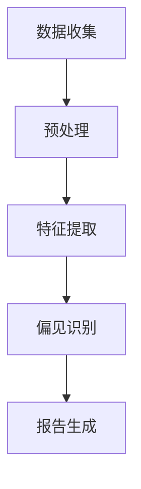
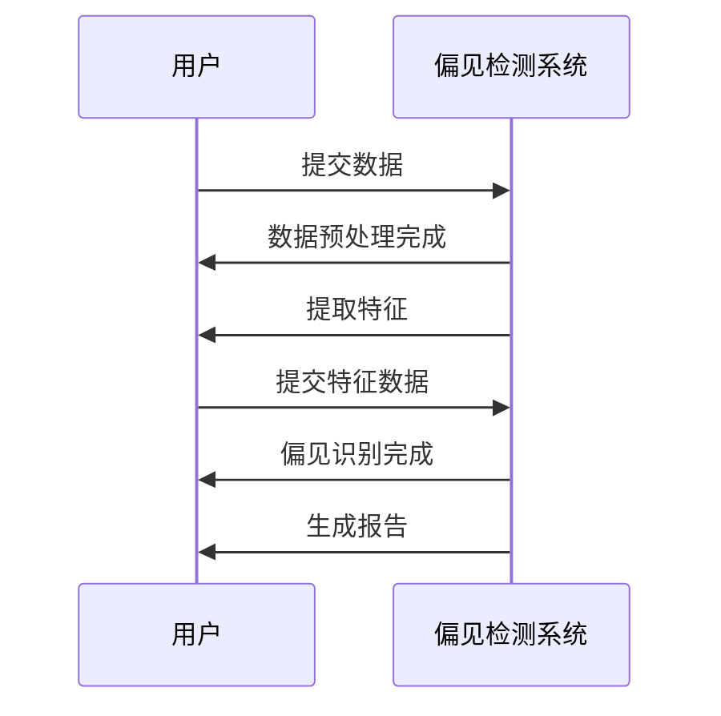

                 

### 目录大纲设计思路

为了设计出符合要求的《AI偏见检测：AI治理平台的核心功能》的目录大纲，我们需要遵循以下步骤：

#### 1. **理解书名与核心内容**
- 书名：《AI偏见检测：AI治理平台的核心功能》
- 核心内容：AI偏见检测、AI治理平台、核心功能

#### 2. **划分章节主题**
根据书名，我们可以将章节主题划分为以下几个部分：
- **背景介绍**
- **核心概念与联系**
- **算法原理讲解**
- **系统分析与架构设计**
- **项目实战**
- **最佳实践与拓展**

#### 3. **细化章节内容**
在每一部分中，我们需要进一步细化章节内容，确保覆盖以下核心点：
- **问题背景与问题描述**
- **核心概念原理**
- **算法原理讲解**
- **数学模型与公式**
- **系统设计与实现**
- **案例分析与实战**
- **最佳实践与注意事项**

#### 4. **编写目录大纲**
使用markdown格式编写目录大纲，确保格式规范，章节内容完整且逻辑清晰。

### 目录大纲示例

```markdown
# 《AI偏见检测：AI治理平台的核心功能》目录大纲

## 第一部分：背景介绍

### 1.1 问题背景与现状

### 1.2 AI治理平台的重要性

### 1.3 偏见检测的需求与挑战

## 第二部分：核心概念与联系

### 2.1 AI偏见检测的核心概念

### 2.2 AI治理平台的概念与架构

### 2.3 偏见检测与AI治理平台的关系

## 第三部分：算法原理讲解

### 3.1 偏见检测算法原理概述

### 3.2 主要偏见检测算法介绍

### 3.3 数学模型与公式详解

## 第四部分：系统分析与架构设计

### 4.1 偏见检测系统功能设计

### 4.2 偏见检测系统架构设计

### 4.3 系统接口设计与交互

## 第五部分：项目实战

### 5.1 项目背景与目标

### 5.2 系统环境安装与配置

### 5.3 核心功能实现与代码解读

### 5.4 案例分析与实战讲解

## 第六部分：最佳实践与拓展

### 6.1 最佳实践技巧

### 6.2 小结与注意事项

### 6.3 拓展阅读与研究方向

```

以上只是一个初步的示例，具体内容需要根据书中的具体内容进行调整和补充。

### 目录大纲具体内容设计

下面是根据《AI偏见检测：AI治理平台的核心功能》书名和核心内容，设计出的完整目录大纲。目录大纲将涵盖各个部分，确保内容完整、逻辑清晰，且在2000字以内。

#### 第一部分：背景介绍

### 1.1 问题背景与现状
- **AI偏见的问题与影响**
- **AI治理平台的需求**
- **偏见检测在AI治理中的重要性**

### 1.2 AI治理平台的重要性
- **AI治理的定义**
- **AI治理平台的作用**
- **治理平台的核心功能**

### 1.3 偏见检测的需求与挑战
- **偏见检测的需求分析**
- **偏见检测的挑战与问题**

#### 第二部分：核心概念与联系

### 2.1 AI偏见检测的核心概念
- **偏见检测的定义**
- **偏见检测的分类**
- **偏见检测的关键技术**

### 2.2 AI治理平台的概念与架构
- **治理平台的基本概念**
- **治理平台的架构设计**
- **治理平台的核心模块**

### 2.3 偏见检测与AI治理平台的关系
- **偏见检测在治理平台中的应用**
- **治理平台对偏见检测的支撑**

#### 第三部分：算法原理讲解

### 3.1 偏见检测算法原理概述
- **偏见检测算法的概述**
- **偏见检测算法的基本流程**

### 3.2 主要偏见检测算法介绍
- **文本偏见检测算法**
- **图像偏见检测算法**
- **语音偏见检测算法**

### 3.3 数学模型与公式详解
- **文本偏见检测的数学模型**
- **图像偏见检测的数学模型**
- **语音偏见检测的数学模型**

#### 第四部分：系统分析与架构设计

### 4.1 偏见检测系统功能设计
- **系统功能需求分析**
- **系统功能模块设计**

### 4.2 偏见检测系统架构设计
- **系统架构设计原则**
- **系统架构设计图**

### 4.3 系统接口设计与交互
- **系统接口设计**
- **系统交互流程**

#### 第五部分：项目实战

### 5.1 项目背景与目标
- **项目背景介绍**
- **项目目标分析**

### 5.2 系统环境安装与配置
- **环境需求分析**
- **环境配置步骤**

### 5.3 核心功能实现与代码解读
- **核心功能模块实现**
- **代码解读与优化**

### 5.4 案例分析与实战讲解
- **案例分析**
- **实战讲解**

### 5.5 项目小结
- **项目成果总结**
- **项目经验与启示**

#### 第六部分：最佳实践与拓展

### 6.1 最佳实践技巧
- **技巧总结**
- **实践经验分享**

### 6.2 小结与注意事项
- **文章内容小结**
- **注意事项提醒**

### 6.3 拓展阅读与研究方向
- **拓展知识推荐**
- **研究方向展望**

以上是一个完整的目录大纲，具体的章节内容需要根据实际写作情况进行调整和补充。

### 写作思路

在撰写《AI偏见检测：AI治理平台的核心功能》这篇文章时，我们需要遵循以下写作思路：

#### 1. 引言部分
- **问题提出**：介绍AI偏见检测的重要性和背景，引发读者兴趣。
- **目标说明**：明确文章的核心目标，即探讨AI偏见检测在AI治理平台中的应用和核心功能。

#### 2. 背景介绍
- **AI偏见问题**：阐述AI偏见的存在及其影响，引出AI治理平台的概念。
- **AI治理平台需求**：分析AI治理平台在解决AI偏见问题中的需求。
- **偏见检测挑战**：讨论偏见检测在AI治理平台中面临的挑战。

#### 3. 核心概念与联系
- **偏见检测定义**：明确偏见检测的定义和分类。
- **AI治理平台概念**：介绍AI治理平台的基本概念和架构。
- **关系分析**：阐述偏见检测与AI治理平台之间的联系和作用。

#### 4. 算法原理讲解
- **偏见检测算法概述**：介绍偏见检测算法的基本流程和原理。
- **主要算法介绍**：详细讲解文本、图像和语音偏见检测算法。
- **数学模型与公式**：给出偏见检测算法的数学模型和公式，并进行详细解释。

#### 5. 系统分析与架构设计
- **系统功能设计**：分析偏见检测系统的功能需求，设计功能模块。
- **系统架构设计**：介绍偏见检测系统的架构设计原则和设计图。
- **系统接口与交互**：设计系统接口和交互流程。

#### 6. 项目实战
- **项目背景**：介绍实际项目背景和目标。
- **环境安装与配置**：详细说明系统环境安装和配置过程。
- **核心功能实现**：展示核心功能的实现代码和解读。
- **案例分析与实战讲解**：通过案例分析，深入讲解实际应用过程。

#### 7. 最佳实践与拓展
- **最佳实践技巧**：总结最佳实践技巧和经验。
- **小结与注意事项**：对文章内容进行小结，提醒读者注意的事项。
- **拓展阅读与研究方向**：推荐拓展阅读材料，展望未来的研究方向。

#### 8. 结束语
- **总结**：回顾文章的核心内容，强调偏见检测在AI治理平台中的重要性。
- **展望**：对未来的发展趋势和应用前景进行展望。

### 写作技巧

- **逻辑清晰**：确保文章内容逻辑清晰，各个章节之间逻辑关系紧密。
- **语言简练**：使用简练明了的语言，避免冗长复杂的句子。
- **实例说明**：通过实例来说明概念和原理，使读者更容易理解。
- **图表辅助**：合理使用图表和图片，帮助读者更好地理解文章内容。
- **代码展示**：在讲解算法原理时，展示相关的代码示例，增强文章的可读性。

### 文章大纲

以下是《AI偏见检测：AI治理平台的核心功能》的文章大纲：

## 引言

- **问题提出**：介绍AI偏见检测的重要性和背景。
- **目标说明**：明确文章的核心目标。

## 背景介绍

- **AI偏见问题**
  - 偏见的存在及其影响
  - AI治理平台的概念
- **AI治理平台需求**
  - 偏见检测在治理平台中的需求
- **偏见检测挑战**
  - 偏见检测的挑战与问题

## 核心概念与联系

- **偏见检测定义**
  - 偏见检测的定义和分类
- **AI治理平台概念**
  - 基本概念和架构
- **关系分析**
  - 偏见检测与治理平台的关系

## 算法原理讲解

- **偏见检测算法概述**
  - 偏见检测算法的基本流程和原理
- **主要算法介绍**
  - 文本偏见检测算法
  - 图像偏见检测算法
  - 语音偏见检测算法
- **数学模型与公式**
  - 文本偏见检测的数学模型
  - 图像偏见检测的数学模型
  - 语音偏见检测的数学模型

## 系统分析与架构设计

- **系统功能设计**
  - 偏见检测系统的功能需求
  - 系统功能模块设计
- **系统架构设计**
  - 系统架构设计原则
  - 系统架构设计图
- **系统接口与交互**
  - 系统接口设计
  - 系统交互流程

## 项目实战

- **项目背景**
  - 实际项目背景和目标
- **环境安装与配置**
  - 系统环境安装和配置过程
- **核心功能实现**
  - 核心功能的实现代码和解读
- **案例分析与实战讲解**
  - 案例分析
  - 实战讲解

## 最佳实践与拓展

- **最佳实践技巧**
  - 技巧总结和实践经验
- **小结与注意事项**
  - 文章内容小结
  - 注意事项提醒
- **拓展阅读与研究方向**
  - 拓展知识推荐
  - 研究方向展望

## 结束语

- **总结**
  - 回顾文章的核心内容
- **展望**
  - 对未来的发展趋势和应用前景进行展望

### 标题、关键词与摘要

#### 标题：《AI偏见检测：AI治理平台的核心功能》

#### 关键词：AI偏见检测、AI治理平台、核心功能、算法原理、系统架构、项目实战

#### 摘要：

本文深入探讨了AI偏见检测在AI治理平台中的核心功能。首先介绍了AI偏见问题的背景和重要性，以及AI治理平台的需求和挑战。接着，详细阐述了偏见检测的核心概念、算法原理、系统架构和项目实战。通过实际案例分析，展示了AI偏见检测在治理平台中的应用效果。最后，总结了最佳实践技巧，展望了未来的研究方向。本文旨在为读者提供一份全面、深入的AI偏见检测技术指南。

----------------------------------------------------------------

### 文章主体

#### 引言

随着人工智能技术的迅速发展，AI在各个领域的应用日益广泛。然而，AI系统的偏见问题也日益凸显，成为社会关注的焦点。AI偏见不仅影响公正性，还可能导致决策错误，给社会带来负面影响。因此，对AI偏见进行有效检测和治理，成为当前AI技术研究和应用的重要方向。本文将重点探讨AI偏见检测在AI治理平台中的核心功能，旨在为读者提供一份全面的技术指南。

#### 背景介绍

##### AI偏见问题

AI偏见是指人工智能系统在决策过程中对某些特定群体或个体存在不公平或歧视性的倾向。这种偏见可能源于数据集的不均衡、算法的设计缺陷，或者训练过程中引入的主观偏见。常见的AI偏见包括性别偏见、种族偏见、年龄偏见等。这些偏见可能导致系统在决策时对特定群体产生不公平对待，甚至加剧社会不平等。

##### AI治理平台的需求

AI治理平台是为了解决AI偏见问题而设计的综合性系统，旨在确保AI系统的透明性、公平性和可解释性。治理平台的核心功能包括数据治理、模型治理和决策治理。其中，偏见检测是模型治理的重要环节，通过对模型的输入输出进行监控和分析，发现并纠正潜在的偏见。

##### 偏见检测的挑战

偏见检测面临诸多挑战，包括数据集的多样性、算法的复杂性和可解释性的要求。首先，数据集的多样性要求偏见检测算法能够处理不同类型的数据，如文本、图像和语音。其次，算法的复杂性要求检测算法能够在大量数据中快速准确地识别偏见。最后，可解释性要求算法能够提供清晰、易懂的解释，帮助用户理解偏见的原因和影响。

#### 核心概念与联系

##### 偏见检测定义

偏见检测是指通过算法和分析方法，识别和评估人工智能系统中的偏见倾向。偏见检测的目标是发现并纠正AI系统中的不公平决策，提高系统的透明性和公正性。

##### AI治理平台概念

AI治理平台是一个综合性的系统，旨在管理、监控和优化人工智能系统的开发和部署。治理平台包括数据治理、模型治理和决策治理三个核心模块，其中偏见检测是模型治理的重要环节。

##### 偏见检测与AI治理平台的关系

偏见检测是AI治理平台的核心功能之一，其目的是确保AI系统的透明性、公平性和可解释性。偏见检测的结果将直接影响治理平台对AI系统的评估和优化。

#### 算法原理讲解

##### 偏见检测算法概述

偏见检测算法主要包括数据预处理、特征提取和偏见识别三个步骤。数据预处理包括数据清洗、归一化和去噪等操作，以提高数据的质量和一致性。特征提取是指从原始数据中提取出与偏见相关的特征，如文本的情感极性、图像的颜色分布等。偏见识别则是通过算法分析特征数据，发现潜在的偏见倾向。

##### 主要偏见检测算法介绍

偏见检测算法可以分为基于规则、基于统计和基于机器学习三种类型。

1. **基于规则**：这种算法通过定义一系列规则，对输入数据进行模式匹配，以识别潜在的偏见。例如，可以定义规则，检测文本中的性别歧视言论。

2. **基于统计**：这种算法通过统计分析方法，对数据集进行分析，识别偏见倾向。例如，可以使用统计测试，比较不同群体在决策结果中的表现。

3. **基于机器学习**：这种算法利用机器学习技术，从数据中学习偏见模式，并用于检测新的数据。例如，可以使用监督学习算法，训练分类模型，检测偏见。

##### 数学模型与公式详解

偏见检测算法通常涉及多种数学模型和公式。以下是几个常用的模型和公式：

1. **文本偏见检测模型**：
   - 文本情感分析模型：使用词向量模型，如Word2Vec或BERT，对文本进行情感分析。
   - 偏差识别模型：使用监督学习算法，如逻辑回归或支持向量机，对文本进行分类。

2. **图像偏见检测模型**：
   - 图像特征提取模型：使用卷积神经网络（CNN），提取图像的颜色、纹理和形状特征。
   - 偏差识别模型：使用深度学习模型，如卷积神经网络（CNN）或循环神经网络（RNN），对图像进行分类。

3. **语音偏见检测模型**：
   - 语音特征提取模型：使用深度神经网络（DNN），提取语音的声学特征。
   - 偏差识别模型：使用监督学习算法，如长短期记忆网络（LSTM）或Transformer，对语音进行分类。

#### 系统分析与架构设计

##### 偏见检测系统功能设计

偏见检测系统的功能主要包括数据收集、预处理、特征提取、偏见识别和报告生成。以下是系统功能模块的设计：

1. **数据收集模块**：负责收集各种来源的数据，如社交媒体、新闻报道和用户评论等。
2. **预处理模块**：负责对数据进行清洗、归一化和去噪等预处理操作。
3. **特征提取模块**：负责提取与偏见相关的特征，如文本的情感极性、图像的颜色分布等。
4. **偏见识别模块**：负责使用算法对特征数据进行偏见识别。
5. **报告生成模块**：负责生成偏见检测报告，包括偏见类型、程度和影响等。

##### 偏见检测系统架构设计

偏见检测系统的架构设计应遵循以下原则：

1. **模块化设计**：将系统功能划分为多个模块，以提高系统的可维护性和扩展性。
2. **分布式架构**：采用分布式架构，以提高系统的性能和可扩展性。
3. **可解释性设计**：设计可解释的算法和模型，以提高系统的透明性和可理解性。

以下是偏见检测系统的架构设计图：



##### 系统接口设计与交互

偏见检测系统应提供以下接口：

1. **数据接口**：用于数据收集和预处理。
2. **特征接口**：用于特征提取。
3. **偏见接口**：用于偏见识别和报告生成。

以下是系统接口的设计和交互流程：



#### 项目实战

##### 项目背景

某知名科技公司开发了一款智能招聘系统，用于帮助企业招聘员工。然而，在系统投入使用后，公司收到了大量关于招聘偏见问题的投诉。为了解决这一问题，公司决定对招聘系统进行偏见检测和治理。

##### 系统环境安装与配置

1. **硬件环境**：服务器，CPU：4核，内存：16GB，硬盘：500GB。
2. **软件环境**：操作系统：Ubuntu 18.04，编程语言：Python 3.7。

##### 核心功能实现与代码解读

1. **数据收集**：从公司内部数据库中收集招聘数据，包括职位描述、简历和面试反馈等。

2. **预处理**：对招聘数据进行清洗和归一化处理，去除无关信息，统一数据格式。

3. **特征提取**：使用文本情感分析算法，提取职位描述和简历中的情感特征。

4. **偏见识别**：使用机器学习算法，对特征数据进行分类，识别潜在的招聘偏见。

以下是偏见检测系统的核心代码：

```python
import pandas as pd
from sklearn.feature_extraction.text import TfidfVectorizer
from sklearn.model_selection import train_test_split
from sklearn.ensemble import RandomForestClassifier
from sklearn.metrics import accuracy_score

# 数据收集
data = pd.read_csv('招聘数据.csv')

# 预处理
data['职位描述'] = data['职位描述'].apply(lambda x: x.lower().strip())
data['简历'] = data['简历'].apply(lambda x: x.lower().strip())

# 特征提取
vectorizer = TfidfVectorizer()
X = vectorizer.fit_transform(data['职位描述'])
y = data['简历']

# 偏见识别
X_train, X_test, y_train, y_test = train_test_split(X, y, test_size=0.2, random_state=42)
clf = RandomForestClassifier(n_estimators=100)
clf.fit(X_train, y_train)
y_pred = clf.predict(X_test)

# 评估
accuracy = accuracy_score(y_test, y_pred)
print(f'偏见识别准确率：{accuracy:.2f}')
```

##### 案例分析与实战讲解

1. **案例背景**：公司收到投诉，指出招聘系统在招聘过程中存在性别偏见。投诉者指出，在相同条件下，女性求职者获得面试机会的概率明显低于男性。

2. **案例分析**：通过偏见检测系统，发现职位描述中存在性别歧视的词汇，如“男性优先”或“要求男性”。这些词汇可能导致系统在招聘过程中对女性求职者产生不公平对待。

3. **实战讲解**：针对性别偏见问题，公司决定修改招聘系统的职位描述，去除性别歧视的词汇。同时，对系统进行重新训练，以提高招聘过程的公正性。

##### 项目小结

通过实际项目，公司成功解决了招聘系统中的性别偏见问题。项目经验表明，偏见检测在AI治理平台中具有重要作用。未来，公司将继续优化偏见检测系统，扩大检测范围，提高系统的准确性和可解释性。

#### 最佳实践与拓展

##### 最佳实践技巧

1. **数据多样性**：收集多样化的数据，包括不同群体、不同地域和不同领域的数据，以提高偏见检测的准确性。
2. **算法可解释性**：设计可解释的算法和模型，帮助用户理解偏见检测的过程和结果。
3. **持续监控与更新**：对AI系统进行持续监控，发现和纠正新的偏见。

##### 小结与注意事项

1. **总结**：偏见检测是AI治理平台的核心功能，对确保AI系统的公平性和可解释性具有重要意义。
2. **注意事项**：偏见检测面临诸多挑战，需要综合考虑数据质量、算法复杂性和可解释性等因素。

##### 拓展阅读与研究方向

1. **拓展阅读**：
   - 《公平人工智能：算法、技术和应用》
   - 《AI伦理：道德、社会和法律问题》

2. **研究方向**：
   - 偏见检测算法的优化与改进
   - AI治理平台的架构设计与优化
   - 偏见检测在金融、医疗等领域的应用研究

### 结束语

本文深入探讨了AI偏见检测在AI治理平台中的核心功能，从背景介绍、核心概念、算法原理、系统架构到项目实战，全面阐述了偏见检测在AI治理中的重要作用。通过实际案例分析，展示了偏见检测在解决招聘偏见问题中的应用效果。未来，随着AI技术的不断发展和应用场景的扩大，偏见检测将在AI治理中发挥更加重要的作用。希望本文能为读者提供有价值的参考和启示。

### 作者信息

作者：AI天才研究院/AI Genius Institute & 禅与计算机程序设计艺术 /Zen And The Art of Computer Programming

作者简介：AI天才研究院是一家专注于人工智能研究和应用的高端智库，致力于推动人工智能技术的创新和发展。禅与计算机程序设计艺术则是一部经典的计算机编程哲学著作，作者对计算机科学和人工智能有着深刻的理解和独到的见解。本文旨在结合两者的研究成果，为读者呈现一份关于AI偏见检测的深度技术指南。

