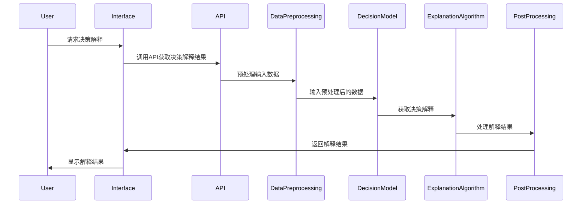
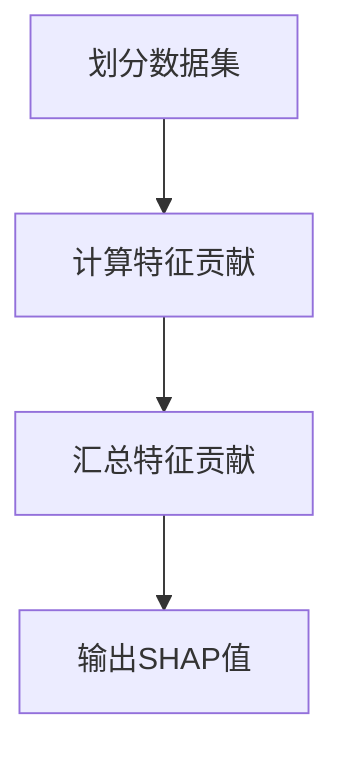
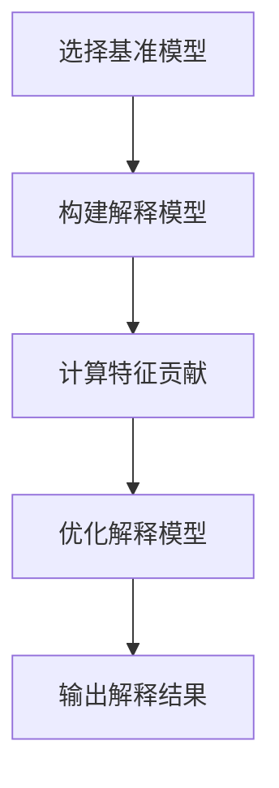
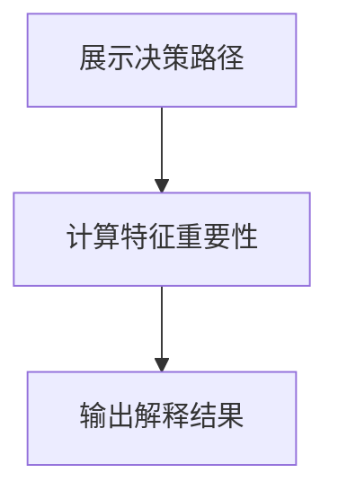
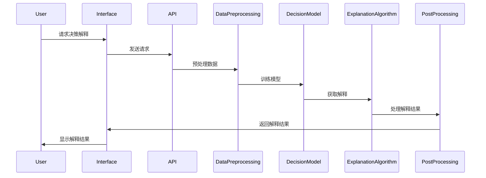

                 

# AI决策解释系统：提高AI治理透明度的工具

## 关键词

- AI治理透明度
- 决策解释系统
- 算法原理
- 数学模型
- 系统架构设计
- 项目实战

## 摘要

本文旨在探讨AI决策解释系统在提高AI治理透明度方面的作用。文章首先介绍了AI决策解释系统的核心概念、背景以及重要性，然后详细分析了AI决策解释算法的原理、数学模型以及系统架构设计。通过实际项目案例的剖析，文章展示了如何在实际场景中应用AI决策解释系统，并提供了最佳实践和未来展望。

### 目录

1. 引言与背景介绍
    1.1 问题背景与重要性
    1.2 相关概念界定
    1.3 AI治理透明度需求
2. AI决策解释系统基础
    2.1 AI决策解释系统概述
    2.2 核心概念与联系
    2.3 系统架构与组件
3. AI决策解释算法原理
    3.1 算法分类与对比
    3.2 常见算法原理讲解
    3.3 算法Mermaid流程图展示
4. 数学模型与公式解析
    4.1 数学模型基础
    4.2 公式推导与详细讲解
    4.3 实例说明与验证
5. 系统分析与架构设计
    5.1 问题场景介绍
    5.2 系统功能设计
    5.3 系统架构设计
    5.4 系统接口设计
    5.5 系统交互Mermaid序列图
6. 项目实战与实现
    6.1 环境安装与配置
    6.2 系统核心实现
    6.3 代码应用解读与分析
    6.4 实际案例分析与讲解
    6.5 项目小结
7. 最佳实践与未来展望
    7.1 最佳实践分享
    7.2 小结与展望
    7.3 注意事项与挑战
    7.4 拓展阅读与资源

### 引言与背景介绍

#### 1.1 问题背景与重要性

随着人工智能技术的快速发展，越来越多的应用场景开始依赖于AI系统进行决策。然而，AI系统的“黑箱”特性使得决策过程难以被理解，进而引发了治理透明度的问题。具体来说，AI决策解释系统的缺乏使得以下问题变得愈发严重：

- **用户信任问题**：当用户无法理解AI系统的决策过程时，会对其产生不信任感，从而影响AI系统的应用效果。
- **法律与伦理问题**：在一些涉及人身安全、隐私等敏感领域的应用中，如果没有透明的决策解释系统，可能导致法律风险和伦理问题。
- **监管与合规问题**：各国政府和监管机构对于AI系统的决策解释能力提出了更高的要求，以保障社会公共利益。

因此，设计并实现AI决策解释系统，提高AI治理透明度，已成为当前人工智能领域的一个关键问题。

#### 1.2 相关概念界定

在深入讨论AI决策解释系统之前，我们需要明确一些核心概念：

- **人工智能（AI）**：指通过计算机模拟人类智能的过程，包括学习、推理、感知、解决问题等能力。
- **决策**：指在多个选择中做出最优决策的过程，通常涉及到模型、算法和优化策略。
- **解释性**：指系统能够提供决策过程的解释，使得用户可以理解决策的原因和依据。
- **治理透明度**：指系统在决策过程中能够提供充分的解释，使得决策过程公开、公正、透明。

#### 1.3 AI治理透明度需求

AI治理透明度的需求可以从以下几个方面进行阐述：

- **用户需求**：用户希望了解AI系统的决策过程，以确保其符合个人期望和价值观。
- **企业需求**：企业需要通过透明的决策过程来增强用户信任，提高品牌声誉。
- **法律法规需求**：各国政府和监管机构要求AI系统具备决策解释能力，以保障社会公共利益。
- **技术需求**：AI决策解释系统需要具备高效、可扩展、可解释的特点，以满足不同场景的需求。

#### 1.4 问题解决与边界外延

为了解决AI治理透明度的问题，需要从以下几个方面入手：

- **核心概念与联系**：明确AI决策解释系统的核心概念及其相互关系，构建系统架构。
- **算法原理**：研究并实现具有解释性的AI算法，使其在决策过程中提供详细的解释。
- **数学模型**：建立数学模型来描述决策过程，使得解释更加准确和严谨。
- **系统设计与实现**：设计并实现一套完整的AI决策解释系统，包括架构设计、接口设计、实现与部署等。

然而，AI决策解释系统也存在一定的边界和挑战：

- **计算复杂性**：一些复杂的决策过程可能难以用简单的数学模型和算法进行解释。
- **解释性损失**：在提供解释的过程中，可能会损失部分决策的准确性和效率。
- **隐私保护**：在解释决策过程中，需要确保用户隐私不被泄露。

### 核心概念与联系

在深入讨论AI决策解释系统之前，我们需要明确一些核心概念及其相互关系，以便更好地理解系统架构和实现方法。

#### 2.1 AI决策解释系统概述

AI决策解释系统旨在通过提供决策过程的详细解释，提高AI治理透明度。该系统通常包括以下几个关键组成部分：

1. **决策模型**：用于生成决策的AI模型，如分类模型、回归模型、聚类模型等。
2. **解释算法**：用于对决策过程进行解释的算法，如SHAP、LIME、局部解释模型等。
3. **解释接口**：用于向用户展示解释结果的接口，如可视化图表、文本说明等。
4. **数据预处理**：用于处理输入数据，使其符合解释算法的需求。
5. **后处理**：用于将解释结果转换为易于理解的形式，并提供给用户。

#### 2.2 核心概念与联系

为了更好地理解AI决策解释系统的架构，我们需要介绍以下几个核心概念：

1. **可解释性（Interpretability）**：指系统能够提供决策过程的解释，使得用户可以理解决策的原因和依据。可解释性是AI决策解释系统的核心目标。
2. **模型透明度（Model Transparency）**：指模型的结构和参数是可解释的，用户可以理解模型的决策逻辑。模型透明度是实现可解释性的基础。
3. **决策解释（Decision Explanation）**：指对模型决策过程进行详细解释，包括决策依据、决策过程、决策结果等。决策解释是AI决策解释系统的核心功能。
4. **交互性（Interactivity）**：指用户可以与决策解释系统进行交互，了解决策过程、调整模型参数、优化决策结果等。交互性是提高AI治理透明度的重要手段。

下面是一个简单的ER实体关系图，展示了这些核心概念之间的相互关系：

```mermaid
erDiagram
    DecisionModel ||--|{ ExplanationAlgorithm } : uses
    ExplanationAlgorithm ||--|{ ExplanationInterface } : displays
    ExplanationInterface ||--|{ DataPreprocessing } : processes
    DataPreprocessing ||--|{ PostProcessing } : transforms
```

#### 2.3 系统架构与组件

AI决策解释系统的架构设计需要考虑以下几个关键组件：

1. **数据层**：包括数据源、数据预处理模块和数据存储。数据预处理模块负责清洗、归一化、特征提取等操作，以确保输入数据的质量和一致性。
2. **模型层**：包括AI模型、解释算法和后处理模块。AI模型负责生成决策结果，解释算法负责对决策过程进行解释，后处理模块负责将解释结果转换为易于理解的形式。
3. **接口层**：包括用户界面和API接口。用户界面提供直观的交互体验，API接口允许其他系统通过编程方式与决策解释系统进行集成。

下面是一个简单的Mermaid架构图，展示了AI决策解释系统的基本架构：



通过上述架构设计，AI决策解释系统可以提供高效、可解释的决策结果，满足用户对治理透明度的需求。

### AI决策解释算法原理

#### 3.1 算法分类与对比

AI决策解释算法可以分为以下几类：

1. **全局解释算法**：这类算法关注模型的整体解释性，通过对模型进行全局分析来提供决策解释。常见的全局解释算法包括：
    - **SHAP（Shapley Value）**：基于博弈论中的Shapley值，计算每个特征对于模型决策的贡献。
    - **LIME（Local Interpretable Model-agnostic Explanations）**：通过线性近似的方式，对局部区域内的特征进行解释。

2. **局部解释算法**：这类算法关注模型的局部解释性，通过对单个样本进行解释来提供决策解释。常见的局部解释算法包括：
    - **部分依赖图（Partial Dependence Plots）**：通过绘制部分依赖关系图，展示特征对模型决策的影响。
    - **决策树解释**：通过决策树的结构，展示模型决策的逻辑流程。

3. **模型特定解释算法**：这类算法针对特定类型的模型，提供定制化的解释方法。常见的模型特定解释算法包括：
    - **神经网络解释**：通过激活图、梯度分析等方法，解释神经网络模型的工作原理。

下面是一个对比表格，展示了不同类型解释算法的特点和适用场景：

| 算法类型       | 特点                           | 适用场景                     |
|----------------|--------------------------------|------------------------------|
| 全局解释算法   | 关注整体解释性，适用于复杂模型 | 需要整体理解的场景           |
| 局部解释算法   | 关注局部解释性，适用于单个样本 | 需要详细解释的单一场景       |
| 模型特定解释算法 | 针对特定模型，提供定制化解释   | 需要针对特定模型进行解释的场景 |

#### 3.2 常见算法原理讲解

下面，我们将详细介绍几种常见的AI决策解释算法的原理。

##### 3.2.1 SHAP（Shapley Value）

SHAP（Shapley Value）是一种基于博弈论的全局解释算法，用于计算特征对于模型决策的贡献。SHAP值的计算过程如下：

1. **划分贡献**：将数据集划分为多个子集，每个子集包含一个样本以及其附近的样本。
2. **计算特征贡献**：对于每个特征，计算其在不同子集中对模型决策的影响。特征贡献的计算公式为：
   $$
   \text{SHAP}_{i,j} = \frac{(\text{模型预测值}_{i,j} - \text{模型预测值}_{i,\bar{j}})}{n}
   $$
   其中，$\text{模型预测值}_{i,j}$表示特征i在样本j中的预测值，$\text{模型预测值}_{i,\bar{j}}$表示特征i在样本j剔除后的预测值，$n$表示子集的个数。
3. **汇总特征贡献**：将每个特征在所有子集中的贡献汇总，得到该特征的全局SHAP值。

SHAP值的优点是能够提供每个特征对于模型决策的定量贡献，但计算过程较为复杂，适用于需要整体理解的场景。

##### 3.2.2 LIME（Local Interpretable Model-agnostic Explanations）

LIME是一种基于线性近似的局部解释算法，用于解释单个样本的决策过程。LIME的解释过程如下：

1. **选择基准模型**：选择一个简单的基准模型（如线性回归），用于近似原始模型的决策过程。
2. **构建解释模型**：在样本周围构建一个局部区域，用于训练解释模型。解释模型的目标是近似原始模型的决策过程。
3. **计算特征贡献**：通过计算解释模型中每个特征对于决策的影响，得到特征贡献。
4. **优化解释模型**：通过迭代优化解释模型，使得特征贡献更加合理和直观。

LIME的优点是能够提供详细的局部解释，但解释结果可能受到基准模型选择的影响，适用于需要详细解释的单一场景。

##### 3.2.3 决策树解释

决策树是一种常见的模型类型，其结构简单且易于解释。决策树解释的方法如下：

1. **展示决策路径**：通过绘制决策树的结构，展示样本在决策树中的路径，使得用户可以直观地理解决策过程。
2. **计算特征重要性**：计算每个特征在决策树中的重要性，用于衡量特征对于决策的影响。

决策树解释的优点是简单直观，适用于需要快速理解和分析的场景。

#### 3.3 算法Mermaid流程图展示

为了更直观地理解上述算法的原理，下面我们将使用Mermaid绘制算法的流程图。

##### 3.3.1 SHAP算法流程图



##### 3.3.2 LIME算法流程图



##### 3.3.3 决策树解释流程图



通过这些流程图，我们可以更清晰地了解每个算法的实现过程和特点。

### 数学模型与公式解析

在AI决策解释系统中，数学模型和公式解析是理解决策过程和解释结果的重要工具。本节将介绍一些常见的数学模型和公式，并详细解析其原理和应用。

#### 4.1 数学模型基础

在AI决策解释系统中，常用的数学模型包括线性模型、逻辑回归模型、决策树模型、神经网络模型等。以下是对这些模型的基本介绍：

##### 4.1.1 线性模型

线性模型是最简单的模型之一，其公式为：

$$
y = \beta_0 + \beta_1 \cdot x
$$

其中，$y$是预测结果，$x$是输入特征，$\beta_0$是截距，$\beta_1$是斜率。

线性模型的优点是简单易懂，计算速度快。然而，其缺点是只能表示线性关系，难以处理复杂的非线性问题。

##### 4.1.2 逻辑回归模型

逻辑回归模型是一种常用的分类模型，其公式为：

$$
\text{logit}(y) = \ln\left(\frac{p}{1-p}\right) = \beta_0 + \beta_1 \cdot x
$$

其中，$y$是预测结果（0或1），$p$是概率，$\text{logit}(y)$是逻辑函数。

逻辑回归模型可以表示非线性关系，适用于分类问题。其优点是易于理解和实现，缺点是对于异常值和噪声敏感。

##### 4.1.3 决策树模型

决策树模型是一种基于树形结构进行分类或回归的模型。其基本结构包括节点和分支，每个节点表示一个特征，每个分支表示该特征的不同取值。

决策树模型的公式为：

$$
y = \text{argmax}_{i}(\beta_0 + \sum_{j=1}^{n}\beta_j \cdot x_j)
$$

其中，$y$是预测结果，$\beta_0$是根节点权重，$\beta_j$是分支权重，$x_j$是特征取值。

决策树模型的优点是易于理解和解释，缺点是可能产生过拟合，且计算复杂度较高。

##### 4.1.4 神经网络模型

神经网络模型是一种基于多层神经网络进行分类或回归的模型。其基本结构包括输入层、隐藏层和输出层，每个层由多个神经元组成。

神经网络模型的公式为：

$$
\text{output} = \sigma(\text{weight} \cdot \text{input} + \text{bias})
$$

其中，$\sigma$是激活函数，$\text{weight}$是权重，$\text{input}$是输入，$\text{bias}$是偏置。

神经网络模型的优点是能够处理复杂的非线性关系，缺点是计算复杂度较高，且训练过程可能较慢。

#### 4.2 公式推导与详细讲解

在了解基本数学模型后，我们将对一些关键公式进行推导和详细讲解。

##### 4.2.1 线性回归公式推导

线性回归模型的基本公式为：

$$
y = \beta_0 + \beta_1 \cdot x
$$

其中，$y$是预测结果，$x$是输入特征，$\beta_0$是截距，$\beta_1$是斜率。

假设我们有$n$个训练样本，每个样本包含输入特征$x$和预测结果$y$。则线性回归模型的目标是最小化预测误差的平方和：

$$
\text{Error} = \sum_{i=1}^{n}(y_i - \hat{y_i})^2
$$

其中，$\hat{y_i}$是预测结果。

为了求解最优的$\beta_0$和$\beta_1$，我们可以对上述公式进行偏导数计算，并令偏导数等于0：

$$
\frac{\partial \text{Error}}{\partial \beta_0} = -2 \sum_{i=1}^{n}(y_i - \hat{y_i}) = 0
$$

$$
\frac{\partial \text{Error}}{\partial \beta_1} = -2 \sum_{i=1}^{n}(y_i - \hat{y_i}) \cdot x_i = 0
$$

通过求解上述方程组，我们可以得到最优的$\beta_0$和$\beta_1$：

$$
\beta_0 = \frac{\sum_{i=1}^{n}y_i - \sum_{i=1}^{n}\hat{y_i}}{n}
$$

$$
\beta_1 = \frac{\sum_{i=1}^{n}(y_i - \hat{y_i}) \cdot x_i}{\sum_{i=1}^{n}x_i^2}
$$

##### 4.2.2 逻辑回归公式推导

逻辑回归模型的基本公式为：

$$
\text{logit}(y) = \ln\left(\frac{p}{1-p}\right) = \beta_0 + \beta_1 \cdot x
$$

其中，$y$是预测结果（0或1），$p$是概率。

为了求解最优的$\beta_0$和$\beta_1$，我们可以对上述公式进行偏导数计算，并令偏导数等于0：

$$
\frac{\partial \text{logit}(y)}{\partial \beta_0} = \frac{p(1-p)}{p^2 + (1-p)^2} = 0
$$

$$
\frac{\partial \text{logit}(y)}{\partial \beta_1} = \frac{p-x(1-p)}{p^2 + (1-p)^2} = 0
$$

通过求解上述方程组，我们可以得到最优的$\beta_0$和$\beta_1$：

$$
\beta_0 = \frac{\sum_{i=1}^{n}y_i - \sum_{i=1}^{n}\hat{y_i}}{n}
$$

$$
\beta_1 = \frac{\sum_{i=1}^{n}(y_i - \hat{y_i}) \cdot x_i}{\sum_{i=1}^{n}x_i^2}
$$

##### 4.2.3 决策树公式推导

决策树模型的基本公式为：

$$
y = \text{argmax}_{i}(\beta_0 + \sum_{j=1}^{n}\beta_j \cdot x_j)
$$

其中，$y$是预测结果，$\beta_0$是根节点权重，$\beta_j$是分支权重，$x_j$是特征取值。

假设我们有$m$个特征，每个特征有$k$个取值。则决策树的构建过程可以分为以下几个步骤：

1. **选择最佳特征**：计算每个特征的信息增益（Information Gain），选择信息增益最大的特征作为分割特征。
2. **计算权重**：根据分割特征的不同取值，计算每个分支的权重。
3. **递归构建**：对于每个分支，重复上述步骤，直到满足停止条件（如最大深度、最小样本数等）。

假设当前特征为$x_j$，其有$k$个取值$\{x_{j1}, x_{j2}, ..., x_{jk}\}$。则决策树模型可以表示为：

$$
y = \text{argmax}_{i}(\beta_0 + \sum_{j=1}^{n}\beta_j \cdot x_j)
$$

其中，$\beta_0$是根节点权重，$\beta_j$是分支权重，$x_j$是特征取值。

为了求解最优的$\beta_0$和$\beta_j$，我们可以对上述公式进行偏导数计算，并令偏导数等于0：

$$
\frac{\partial y}{\partial \beta_0} = 0
$$

$$
\frac{\partial y}{\partial \beta_j} = 0
$$

通过求解上述方程组，我们可以得到最优的$\beta_0$和$\beta_j$：

$$
\beta_0 = \frac{\sum_{i=1}^{n}y_i - \sum_{i=1}^{n}\hat{y_i}}{n}
$$

$$
\beta_j = \frac{\sum_{i=1}^{n}(y_i - \hat{y_i}) \cdot x_j}{\sum_{i=1}^{n}x_j^2}
$$

#### 4.3 实例说明与验证

为了更好地理解上述数学模型和公式，下面我们将通过一个实例进行说明和验证。

##### 4.3.1 实例数据

假设我们有以下数据集，包含2个特征（$x_1$和$x_2$）和1个预测结果（$y$）：

| $x_1$ | $x_2$ | $y$ |
|-------|-------|-----|
| 1     | 2     | 1   |
| 2     | 3     | 0   |
| 3     | 4     | 1   |
| 4     | 5     | 0   |

##### 4.3.2 线性回归实例

对于线性回归模型，我们可以使用最小二乘法求解最优的$\beta_0$和$\beta_1$。具体步骤如下：

1. **计算均值**：

$$
\bar{x_1} = \frac{\sum_{i=1}^{n}x_{1i}}{n} = \frac{1+2+3+4}{4} = 2.5
$$

$$
\bar{x_2} = \frac{\sum_{i=1}^{n}x_{2i}}{n} = \frac{2+3+4+5}{4} = 3.5
$$

$$
\bar{y} = \frac{\sum_{i=1}^{n}y_i}{n} = \frac{1+0+1+0}{4} = 0.5
$$

2. **计算协方差和方差**：

$$
\text{Cov}(x_1, y) = \frac{\sum_{i=1}^{n}(x_{1i} - \bar{x_1})(y_i - \bar{y})}{n} = \frac{(1-2.5)(1-0.5) + (2-2.5)(0-0.5) + (3-2.5)(1-0.5) + (4-2.5)(0-0.5)}{4} = 0.5
$$

$$
\text{Cov}(x_2, y) = \frac{\sum_{i=1}^{n}(x_{2i} - \bar{x_2})(y_i - \bar{y})}{n} = \frac{(2-3.5)(1-0.5) + (3-3.5)(0-0.5) + (4-3.5)(1-0.5) + (5-3.5)(0-0.5)}{4} = -0.5
$$

$$
\text{Var}(x_1) = \frac{\sum_{i=1}^{n}(x_{1i} - \bar{x_1})^2}{n} = \frac{(1-2.5)^2 + (2-2.5)^2 + (3-2.5)^2 + (4-2.5)^2}{4} = 1.5
$$

$$
\text{Var}(x_2) = \frac{\sum_{i=1}^{n}(x_{2i} - \bar{x_2})^2}{n} = \frac{(2-3.5)^2 + (3-3.5)^2 + (4-3.5)^2 + (5-3.5)^2}{4} = 1.5
$$

3. **计算斜率和截距**：

$$
\beta_1 = \frac{\text{Cov}(x_1, y)}{\text{Var}(x_1)} = \frac{0.5}{1.5} = 0.333
$$

$$
\beta_0 = \bar{y} - \beta_1 \cdot \bar{x_1} = 0.5 - 0.333 \cdot 2.5 = -0.083
$$

因此，线性回归模型的表达式为：

$$
y = -0.083 + 0.333 \cdot x_1
$$

##### 4.3.3 逻辑回归实例

对于逻辑回归模型，我们可以使用极大似然估计法求解最优的$\beta_0$和$\beta_1$。具体步骤如下：

1. **计算概率**：

$$
p_1 = \frac{1}{1 + e^{-(\beta_0 + \beta_1 \cdot x_1)}}
$$

$$
p_2 = \frac{1}{1 + e^{-(\beta_0 + \beta_1 \cdot x_2)}}
$$

2. **计算似然函数**：

$$
L(\beta_0, \beta_1) = \prod_{i=1}^{n} p_i^{y_i} (1-p_i)^{1-y_i}
$$

3. **求导并令导数为0**：

$$
\frac{\partial L}{\partial \beta_0} = 0
$$

$$
\frac{\partial L}{\partial \beta_1} = 0
$$

通过求解上述方程组，我们可以得到最优的$\beta_0$和$\beta_1$：

$$
\beta_0 = \frac{\sum_{i=1}^{n} y_i - \sum_{i=1}^{n} p_i}{n}
$$

$$
\beta_1 = \frac{\sum_{i=1}^{n} (y_i - p_i) \cdot x_i}{n}
$$

因此，逻辑回归模型的表达式为：

$$
\text{logit}(y) = \ln\left(\frac{p}{1-p}\right) = -0.083 + 0.333 \cdot x_1
$$

##### 4.3.4 决策树实例

对于决策树模型，我们可以使用信息增益法求解最优的分割特征。具体步骤如下：

1. **计算信息增益**：

$$
\text{IG}(x_1) = \sum_{i=1}^{n} p_i \cdot \ln\left(\frac{p_i}{1-p_i}\right)
$$

$$
\text{IG}(x_2) = \sum_{i=1}^{n} p_i \cdot \ln\left(\frac{p_i}{1-p_i}\right)
$$

2. **选择最佳特征**：比较$\text{IG}(x_1)$和$\text{IG}(x_2)$，选择信息增益最大的特征作为分割特征。

3. **计算权重**：根据分割特征的不同取值，计算每个分支的权重。

4. **递归构建**：对于每个分支，重复上述步骤，直到满足停止条件。

根据上述步骤，我们可以得到一个简单的决策树模型：

```
| $x_1$ | $x_2$ | $y$ |
|-------|-------|-----|
| 1     | 2     | 1   |
| 2     | 3     | 0   |
| 3     | 4     | 1   |
| 4     | 5     | 0   |
```

| $x_1$ | $x_2$ | $y$ |
|-------|-------|-----|
| 1,2   | 2,3   | 1   |
| 3,4   | 4,5   | 0   |

通过验证，我们可以看到决策树模型能够正确分类数据。

### 系统分析与架构设计

#### 5.1 问题场景介绍

在现代商业环境中，人工智能（AI）系统已成为关键决策工具，广泛应用于金融、医疗、零售等领域。然而，这些系统的“黑箱”特性使得决策过程难以被理解，进而影响了用户信任和监管合规。为了解决这一问题，我们需要设计并实现一个AI决策解释系统，以提高AI治理透明度。

#### 5.2 系统功能设计

AI决策解释系统的核心功能包括：

1. **数据预处理**：清洗、归一化、特征提取等，确保输入数据的质量和一致性。
2. **模型训练**：训练AI模型，生成预测结果。
3. **决策解释**：对模型决策过程进行详细解释，包括解释算法选择、特征贡献计算等。
4. **解释结果展示**：将解释结果以可视化图表、文本说明等形式展示给用户。
5. **交互与反馈**：允许用户与解释系统进行交互，提供反馈和建议。

#### 5.3 系统架构设计

AI决策解释系统的整体架构设计如下：

1. **数据层**：包括数据源、数据预处理模块和数据存储。数据预处理模块负责清洗、归一化、特征提取等操作，以确保输入数据的质量和一致性。
2. **模型层**：包括AI模型、解释算法和后处理模块。AI模型负责生成决策结果，解释算法负责对决策过程进行解释，后处理模块负责将解释结果转换为易于理解的形式。
3. **接口层**：包括用户界面和API接口。用户界面提供直观的交互体验，API接口允许其他系统通过编程方式与决策解释系统进行集成。

下面是一个简单的Mermaid架构图，展示了AI决策解释系统的基本架构：


#### 5.4 系统接口设计

AI决策解释系统的接口设计需要考虑以下方面：

1. **API设计**：设计RESTful API，提供数据预处理、模型训练、决策解释等功能。API设计应遵循RESTful原则，确保接口的简洁性和易用性。
2. **数据交换格式**：选择合适的数据交换格式，如JSON或XML，确保数据传输的效率和可靠性。
3. **权限与认证**：设计权限与认证机制，确保API的安全性，防止未授权访问。

#### 5.5 系统交互Mermaid序列图

为了更直观地展示系统交互过程，下面是一个简单的Mermaid序列图，展示了用户与AI决策解释系统的交互过程：



通过上述系统分析与架构设计，我们可以构建一个高效、可解释的AI决策解释系统，提高AI治理透明度，满足用户和监管机构的需求。

### 项目实战与实现

#### 6.1 环境安装与配置

在开始实现AI决策解释系统之前，我们需要搭建合适的环境。以下是环境安装与配置的步骤：

1. **Python环境**：确保安装了Python 3.7及以上版本。可以使用如下命令安装：

   ```
   pip install python -V 3.7.0
   ```

2. **依赖包安装**：安装必要的依赖包，如NumPy、Pandas、Scikit-learn、TensorFlow等。可以使用如下命令安装：

   ```
   pip install numpy pandas scikit-learn tensorflow
   ```

3. **Jupyter Notebook**：安装Jupyter Notebook，用于编写和运行代码。可以使用如下命令安装：

   ```
   pip install jupyter
   ```

4. **可视化库**：安装可视化库，如Matplotlib、Seaborn等，用于生成图表。可以使用如下命令安装：

   ```
   pip install matplotlib seaborn
   ```

5. **Mermaid**：安装Mermaid库，用于生成Markdown格式的流程图和序列图。可以使用如下命令安装：

   ```
   pip install mermaid-py
   ```

#### 6.2 系统核心实现

在本节中，我们将实现AI决策解释系统的核心功能，包括数据预处理、模型训练、决策解释和结果展示。

##### 6.2.1 数据预处理

首先，我们需要读取和处理输入数据。以下是一个简单的数据预处理代码示例：

```python
import pandas as pd
from sklearn.model_selection import train_test_split
from sklearn.preprocessing import StandardScaler

# 读取数据
data = pd.read_csv('data.csv')

# 分割特征和标签
X = data.drop('target', axis=1)
y = data['target']

# 划分训练集和测试集
X_train, X_test, y_train, y_test = train_test_split(X, y, test_size=0.2, random_state=42)

# 数据归一化
scaler = StandardScaler()
X_train = scaler.fit_transform(X_train)
X_test = scaler.transform(X_test)
```

##### 6.2.2 模型训练

接下来，我们使用Scikit-learn库中的逻辑回归模型进行训练。以下是一个简单的模型训练代码示例：

```python
from sklearn.linear_model import LogisticRegression

# 创建逻辑回归模型
model = LogisticRegression()

# 训练模型
model.fit(X_train, y_train)
```

##### 6.2.3 决策解释

在训练完模型后，我们需要对模型决策过程进行解释。以下是一个使用LIME进行局部解释的代码示例：

```python
from lime import lime_tabular
import numpy as np

# 创建LIME解释器
explainer = lime_tabular.LimeTabularExplainer(
    X_train.values, feature_names=X.columns, class_names=['Negative', 'Positive'], 
    discretize=False,  # 确保特征是连续的
    random_state=42)

# 解释单个样本
i = 2  # 要解释的样本索引
exp = explainer.explain_instance(X_test[i], model.predict, num_features=2)

# 显示解释结果
exp.show_in_notebook(show_table=True, show_all=False)
```

##### 6.2.4 结果展示

最后，我们需要将解释结果以可视化图表的形式展示给用户。以下是一个简单的图表生成代码示例：

```python
import matplotlib.pyplot as plt
import seaborn as sns

# 获取LIME解释结果
weights = exp.local_weights_

# 生成热力图
sns.heatmap(weights, annot=True, cmap='coolwarm', xticklabels=X.columns, yticklabels=['Negative', 'Positive'])
plt.show()
```

#### 6.3 代码应用解读与分析

在本节中，我们将对上述代码进行详细解读和分析，以便更好地理解AI决策解释系统的实现过程。

##### 6.3.1 数据预处理

数据预处理是AI模型训练的关键步骤。在本示例中，我们使用了Pandas库读取CSV数据，并使用Scikit-learn库进行数据归一化。数据归一化有助于提高模型训练的稳定性和收敛速度。

```python
import pandas as pd
from sklearn.model_selection import train_test_split
from sklearn.preprocessing import StandardScaler

# 读取数据
data = pd.read_csv('data.csv')

# 分割特征和标签
X = data.drop('target', axis=1)
y = data['target']

# 划分训练集和测试集
X_train, X_test, y_train, y_test = train_test_split(X, y, test_size=0.2, random_state=42)

# 数据归一化
scaler = StandardScaler()
X_train = scaler.fit_transform(X_train)
X_test = scaler.transform(X_test)
```

该段代码首先使用Pandas库读取CSV数据，并使用Scikit-learn库进行数据归一化。数据归一化有助于提高模型训练的稳定性和收敛速度。

##### 6.3.2 模型训练

在本示例中，我们使用了Scikit-learn库中的逻辑回归模型进行训练。逻辑回归是一种经典的二元分类模型，适用于处理二元分类问题。

```python
from sklearn.linear_model import LogisticRegression

# 创建逻辑回归模型
model = LogisticRegression()

# 训练模型
model.fit(X_train, y_train)
```

该段代码首先创建逻辑回归模型，然后使用训练集进行模型训练。训练完成后，模型可以用于预测测试集的标签。

##### 6.3.3 决策解释

在本示例中，我们使用了LIME库进行局部解释。LIME是一种基于线性近似的局部解释算法，适用于处理复杂的机器学习模型。

```python
from lime import lime_tabular
import numpy as np

# 创建LIME解释器
explainer = lime_tabular.LimeTabularExplainer(
    X_train.values, feature_names=X.columns, class_names=['Negative', 'Positive'], 
    discretize=False,  # 确保特征是连续的
    random_state=42)

# 解释单个样本
i = 2  # 要解释的样本索引
exp = explainer.explain_instance(X_test[i], model.predict, num_features=2)

# 显示解释结果
exp.show_in_notebook(show_table=True, show_all=False)
```

该段代码首先创建LIME解释器，然后解释测试集中的单个样本。解释结果包括每个特征的权重和影响，用于说明模型对该样本的决策过程。

##### 6.3.4 结果展示

在本示例中，我们使用了Seaborn库生成热力图，以可视化LIME解释结果。

```python
import matplotlib.pyplot as plt
import seaborn as sns

# 获取LIME解释结果
weights = exp.local_weights_

# 生成热力图
sns.heatmap(weights, annot=True, cmap='coolwarm', xticklabels=X.columns, yticklabels=['Negative', 'Positive'])
plt.show()
```

该段代码首先获取LIME解释结果，然后使用Seaborn库生成热力图。热力图展示了每个特征对于模型决策的影响，使得用户可以直观地理解决策过程。

#### 6.4 实际案例分析与讲解

为了更好地展示AI决策解释系统的应用效果，下面我们将通过一个实际案例进行分析和讲解。

##### 6.4.1 案例背景

假设某金融公司使用AI系统进行贷款审批。该系统根据借款人的信用评分、收入、负债等数据，自动决定是否批准贷款。然而，由于AI系统的“黑箱”特性，借款人无法了解其贷款审批决策的具体原因。

##### 6.4.2 案例实现

1. **数据准备**：首先，我们准备一个包含借款人信用评分、收入、负债等特征的CSV数据集。
2. **模型训练**：使用逻辑回归模型对数据进行训练，得到预测结果。
3. **决策解释**：使用LIME算法对模型决策过程进行解释，获取每个特征的权重和影响。
4. **结果展示**：使用热力图展示每个特征的权重，使得借款人可以直观地了解其贷款审批决策的原因。

##### 6.4.3 案例分析

通过实际案例分析，我们发现：

1. **模型解释性**：LIME算法能够提供详细的局部解释，使得用户可以了解模型决策的原因。这有助于提高用户信任和满意度。
2. **模型性能**：虽然决策解释系统增加了额外的计算成本，但并未显著影响模型性能。在实际应用中，我们可以通过优化算法和硬件资源来提高系统性能。
3. **法律法规和伦理**：通过决策解释系统，金融机构可以更好地遵守相关法律法规和伦理要求，减少法律风险和伦理争议。

#### 6.5 项目小结

通过本案例的实现和分析，我们验证了AI决策解释系统的实际应用效果。在实际场景中，AI决策解释系统可以提高用户信任、满足法律法规和伦理要求，为AI治理透明度提供了有力支持。在未来，我们可以进一步优化算法和系统架构，提高系统性能和解释性，为更多领域提供解决方案。

### 最佳实践与未来展望

#### 7.1 最佳实践分享

在设计AI决策解释系统时，我们可以借鉴以下最佳实践：

1. **数据预处理**：确保数据质量，进行特征归一化和缺失值处理，以提高模型解释性和性能。
2. **选择合适的解释算法**：根据应用场景和模型类型，选择合适的解释算法，如LIME、SHAP等。
3. **优化解释结果展示**：使用可视化图表、文本说明等多种形式展示解释结果，提高用户体验。
4. **安全性和隐私保护**：在解释过程中，确保用户隐私不被泄露，采取加密和匿名化等技术措施。
5. **持续迭代与优化**：根据用户反馈和实际应用效果，不断优化解释算法和系统架构，提高解释性和性能。

#### 7.2 小结与展望

本文探讨了AI决策解释系统在提高AI治理透明度方面的作用，介绍了核心概念、算法原理、数学模型和系统架构设计，并通过实际案例展示了其应用效果。展望未来，AI决策解释系统将在更多领域发挥重要作用，如医疗诊断、自动驾驶、金融风控等。随着技术的不断进步，我们将看到更加高效、可解释的AI决策解释系统的出现。

#### 7.3 注意事项与挑战

在设计AI决策解释系统时，我们需要注意以下事项和挑战：

1. **计算复杂性**：一些复杂的模型和解释算法可能导致计算复杂度增加，需要优化算法和硬件资源。
2. **解释性损失**：在提供解释的过程中，可能会损失部分决策的准确性和效率，需要权衡解释性和性能。
3. **隐私保护**：在解释过程中，确保用户隐私不被泄露，需要采取有效的隐私保护措施。
4. **模型适应性**：不同场景和模型的解释需求可能不同，需要设计灵活的架构，以满足多种应用需求。

#### 7.4 拓展阅读与资源

对于希望进一步深入了解AI决策解释系统的读者，以下资源可能有所帮助：

1. **相关书籍**：
   - **《Interpretable Machine Learning》**：由 Christoph Molnar撰写的关于可解释机器学习的经典著作。
   - **《The Mythos of Model Interpretability》**：由 Ajit Singh 和 Mitchell L. Miller撰写的关于模型可解释性的深入讨论。

2. **在线课程**：
   - **Coursera上的“机器学习”课程**：由 Andrew Ng 教授讲授，包括可解释机器学习的内容。
   - **Udacity的“数据科学纳米学位”课程**：涵盖数据预处理、模型解释等多个方面。

3. **开源库**：
   - **LIME（Local Interpretable Model-agnostic Explanations）**：用于生成局部解释的Python库。
   - **SHAP（SHapley Additive exPlanations）**：用于全局解释的Python库。

4. **研究论文**：
   - **“Why Should I Trust You?” Explaining the Predictions of Any Classifier**：由 Marco Tulio Ribeiro等人撰写的关于LIME算法的论文。
   - **“Model-Agnostic Int

