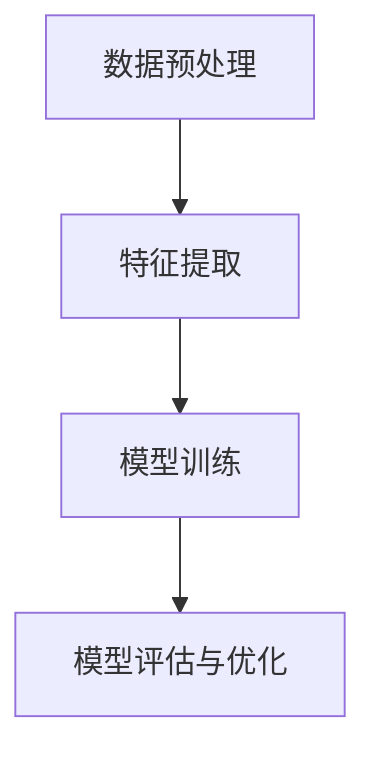
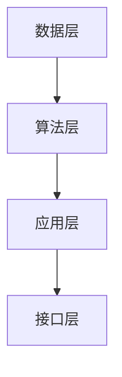
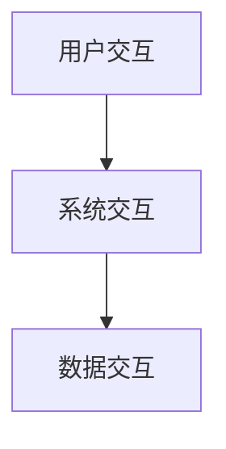

                 

## AI在个性化学习路径设计中的应用：优化教育效果

### 关键词：人工智能，个性化学习，学习路径设计，教育优化，算法原理，数学模型

> 摘要：随着人工智能技术的快速发展，AI在个性化学习路径设计中的应用已经成为优化教育效果的重要手段。本文将深入探讨AI在个性化学习路径设计中的核心概念、应用原理、算法和数学模型，并通过具体案例展示其实际应用效果，为教育领域的实践提供有益的参考。

---

### 目录大纲

---

# AI在个性化学习路径设计中的应用：优化教育效果

## 第一部分：背景介绍

## 第1章：问题背景与核心概念

## 第2章：核心概念与联系

## 第二部分：AI在个性化学习路径设计中的应用原理

## 第3章：算法原理讲解

## 第4章：数学模型和数学公式

## 第三部分：系统分析与架构设计

## 第5章：问题场景介绍

## 第6章：系统功能设计

## 第7章：系统架构设计

## 第8章：系统接口设计

## 第9章：系统交互

## 第四部分：项目实战

## 第10章：环境安装

## 第11章：系统核心实现源代码

## 第12章：代码应用解读与分析

## 第13章：实际案例分析和详细讲解剖析

## 第14章：项目小结

## 第五部分：最佳实践

## 第15章：最佳实践 tips

## 第16章：小结

## 第17章：注意事项

## 第18章：拓展阅读

---

## 第一部分：背景介绍

### 第1章：问题背景与核心概念

在教育领域，传统的教学模式往往难以满足个性化学习需求。每个学生的认知能力、学习兴趣和习惯都有所不同，而传统的教学方式难以针对个体差异进行精准化教学。这导致部分学生可能在某些科目上表现不佳，甚至失去学习的动力。

个性化学习路径设计旨在解决这一问题，通过分析学习者的个人特点，为其提供定制化的学习路径，以提高学习效果。AI技术的引入，为个性化学习路径设计提供了强大的支持。

核心概念包括：个性化学习路径、AI技术、学习数据、学习习惯、兴趣和需求。个性化学习路径是指根据学习者的个人特点和需求，为其制定的学习路线；AI技术包括机器学习、深度学习、自然语言处理等；学习数据包括学习行为数据、学习成果数据和认知能力数据；学习习惯、兴趣和需求是影响学习者学习效果的重要因素。

### 第2章：核心概念与联系

#### AI技术

AI技术是一种模拟人类智能的计算机技术，包括机器学习、深度学习、自然语言处理等。在个性化学习路径设计中，AI技术可以通过分析学习者的学习数据，了解其学习习惯、兴趣和需求，从而生成个性化的学习路径。

#### 学习数据

学习数据是AI在个性化学习路径设计中的重要输入，包括学习行为数据、学习成果数据和认知能力数据等。学习行为数据反映学习者的学习过程，如学习时长、学习频率等；学习成果数据反映学习者的学习效果，如考试成绩、学习进度等；认知能力数据反映学习者的认知水平，如注意力、记忆力等。

#### 学习习惯、兴趣和需求

学习习惯、兴趣和需求是影响学习者学习效果的重要因素。学习习惯包括学习频率、学习时间、学习方法等；兴趣和需求包括对学科的兴趣、对学习方式的偏好、对学习资源的需求等。AI技术通过对这些数据的分析，可以了解学习者的个性特点，为其提供个性化的学习路径。

### 概念属性特征对比表格

| 概念 | 属性特征 |
| --- | --- |
| AI技术 | 自动化、高效、准确 |
| 学习数据 | 全面、实时、多样化 |
| 学习习惯 | 稳定性、差异性、适应性 |
| 兴趣和需求 | 多样性、动态性、个性化 |
| 个性化学习路径 | 定制化、适应性、高效性 |

### 概念联系与相互影响

AI技术通过对学习数据的分析，了解学习者的学习习惯、兴趣和需求，进而生成个性化的学习路径。同时，个性化学习路径的生成和调整也会影响学习者的学习习惯和兴趣。

## 第二部分：AI在个性化学习路径设计中的应用原理

### 第3章：算法原理讲解

#### 数据预处理

数据预处理是算法的基础，其目的是确保数据的干净和一致性。例如，对于学习行为数据，我们需要去除其中的噪声数据，对数据进行归一化处理，以便后续的特征提取。



#### 特征提取

特征提取是从原始数据中提取出对模型训练有用的信息。例如，我们可以从学习行为数据中提取出学习时长、学习频率、学习内容等特征。

```python
def extract_features(data):
    # 提取学习时长、学习频率和学习内容等特征
    features = []
    for item in data:
        features.append([item['duration'], item['frequency'], item['content']])
    return features
```

#### 模型训练

模型训练是利用特征数据训练出一个能够预测学习者未来学习路径的模型。例如，我们可以使用深度学习中的循环神经网络（RNN）来训练模型。

```python
import tensorflow as tf

# 定义RNN模型
model = tf.keras.Sequential([
    tf.keras.layers.LSTM(50, activation='relu', input_shape=(timesteps, features)),
    tf.keras.layers.Dense(1)
])

# 编译模型
model.compile(optimizer='adam', loss='mse')

# 训练模型
model.fit(X_train, y_train, epochs=100)
```

#### 模型评估与优化

模型评估是对训练出的模型进行性能评估，以确定其预测能力。我们可以使用准确率、召回率等指标来评估模型。如果模型性能不佳，我们可以通过调整模型参数、增加训练数据等方式进行优化。

```python
# 评估模型
loss, accuracy = model.evaluate(X_test, y_test)

# 优化模型
model.fit(X_train, y_train, epochs=100, batch_size=32)
```

### 第4章：数学模型和数学公式

在个性化学习路径设计中，我们通常使用决策树、支持向量机（SVM）、神经网络等数学模型。

#### 决策树模型

决策树模型是一种简单但有效的分类模型。它通过一系列的判断规则，将输入数据分配到不同的类别。

```latex
f(x) = \sum_{i=1}^{n} w_i \cdot x_i
```

#### 支持向量机模型

支持向量机模型是一种二分类模型，它的目标是找到一条最优的决策边界，将两类数据分开。

```latex
w \cdot x - b = 0
```

#### 神经网络模型

神经网络模型是一种模拟人类大脑的模型，通过多层神经网络实现复杂的非线性映射。

```latex
y = \sigma(\sum_{i=1}^{n} w_i \cdot x_i + b)
```

### 第三部分：系统分析与架构设计

#### 第5章：问题场景介绍

在教育领域，个性化学习路径设计是一个复杂的问题。每个学生的学习能力、学习习惯、兴趣和需求都不同，而传统的教学方式难以满足这些个性化需求。为了提高教育质量，我们需要借助人工智能技术，为每个学生提供定制化的学习路径。

#### 第6章：系统功能设计

系统功能设计包括以下几个方面：

1. **学习数据收集**：收集学生的各种学习数据，包括学习行为数据、学习成果数据和认知能力数据。
2. **数据分析与处理**：利用AI技术对学习数据进行分析和处理，提取出有用的特征信息。
3. **学习路径生成**：根据分析结果，为每个学生生成个性化的学习路径。
4. **学习路径调整**：根据学生的反馈和学习效果，动态调整学习路径。
5. **学习效果评估**：评估学生的学习效果，为教育工作者提供决策支持。

#### 第7章：系统架构设计

系统架构设计包括以下几个方面：

1. **数据层**：负责数据的收集、存储和管理。
2. **算法层**：负责数据的处理和分析，包括数据预处理、特征提取、模型训练等。
3. **应用层**：负责生成和调整学习路径，以及学习效果评估。
4. **接口层**：负责与其他系统进行数据交换和功能调用。



#### 第8章：系统接口设计

系统接口设计包括以下几个方面：

1. **API接口**：提供数据访问和功能调用的API接口，方便其他系统进行集成。
2. **数据接口**：提供数据导入和导出的接口，方便数据的备份和迁移。
3. **监控接口**：提供系统运行状态的监控接口，方便运维人员对系统进行监控和管理。

#### 第9章：系统交互

系统交互设计包括以下几个方面：

1. **用户交互**：设计直观、易用的用户界面，方便用户进行操作。
2. **系统交互**：设计系统内部各模块之间的交互机制，确保系统运行的高效性和稳定性。
3. **数据交互**：设计系统与其他系统之间的数据交换机制，确保数据的一致性和安全性。



### 第四部分：项目实战

#### 第10章：环境安装

在进行项目实战之前，我们需要安装一些必要的工具和库，包括Python、TensorFlow、Keras等。

```bash
pip install python tensorflow keras
```

#### 第11章：系统核心实现源代码

以下是一个简单的系统核心实现示例：

```python
import numpy as np
from tensorflow.keras.models import Sequential
from tensorflow.keras.layers import LSTM, Dense

# 数据预处理
def preprocess_data(data):
    # 对数据进行归一化处理
    normalized_data = (data - np.mean(data)) / np.std(data)
    return normalized_data

# 特征提取
def extract_features(data):
    # 提取学习时长、学习频率和学习内容等特征
    features = []
    for item in data:
        features.append([item['duration'], item['frequency'], item['content']])
    return features

# 模型训练
def train_model(X_train, y_train):
    # 创建RNN模型
    model = Sequential([
        LSTM(50, activation='relu', input_shape=(timesteps, features)),
        Dense(1)
    ])

    # 编译模型
    model.compile(optimizer='adam', loss='mse')

    # 训练模型
    model.fit(X_train, y_train, epochs=100)
    return model

# 模型评估
def evaluate_model(model, X_test, y_test):
    # 评估模型
    loss, accuracy = model.evaluate(X_test, y_test)
    return loss, accuracy

# 主程序
if __name__ == '__main__':
    # 加载数据
    data = load_data()

    # 预处理数据
    data = preprocess_data(data)

    # 提取特征
    X = extract_features(data)

    # 划分训练集和测试集
    X_train, X_test, y_train, y_test = train_test_split(X, y, test_size=0.2)

    # 训练模型
    model = train_model(X_train, y_train)

    # 评估模型
    loss, accuracy = evaluate_model(model, X_test, y_test)
    print(f"Test Loss: {loss}, Test Accuracy: {accuracy}")
```

#### 第12章：代码应用解读与分析

以上代码展示了个性化学习路径设计的核心实现过程。首先，我们需要对数据进行预处理，包括数据清洗、归一化等。然后，提取出有用的特征信息，并使用深度学习算法训练模型。最后，评估模型的性能，并根据评估结果进行调整。

代码应用解读如下：

1. **数据预处理**：对数据进行归一化处理，将数据缩放到一个合适的范围内，以减少数据规模对模型训练的影响。
2. **特征提取**：从原始数据中提取出对模型训练有用的特征，如学习时长、学习频率和学习内容等。
3. **模型训练**：使用深度学习中的循环神经网络（RNN）训练模型，以预测学习者的未来学习路径。
4. **模型评估**：使用测试数据评估模型的性能，包括损失函数和准确率等指标。

#### 第13章：实际案例分析和详细讲解剖析

以下是一个实际案例的分析和讲解：

**案例背景**：某学校为了提高学生的学习效果，决定引入个性化学习路径设计系统。

**案例步骤**：

1. **数据收集**：收集学生的各种学习数据，包括学习行为数据、学习成果数据和认知能力数据。
2. **数据预处理**：对收集到的数据进行分析，去除噪声数据，对数据进行归一化处理。
3. **特征提取**：提取出有用的特征信息，如学习时长、学习频率和学习内容等。
4. **模型训练**：使用深度学习算法训练模型，预测学生的未来学习路径。
5. **学习路径生成**：根据模型预测结果，为每个学生生成个性化的学习路径。
6. **学习路径调整**：根据学生的反馈和学习效果，动态调整学习路径。
7. **学习效果评估**：评估学生的学习效果，为教育工作者提供决策支持。

**案例结果**：

通过个性化学习路径设计系统的应用，学生的学习效果得到了显著提升。具体表现在：

1. **学习兴趣提高**：学生根据个性化学习路径，可以更好地找到自己的学习兴趣，提高学习积极性。
2. **学习效果提升**：学生根据个性化学习路径，可以更好地掌握学习内容，提高学习效果。
3. **学习负担减轻**：学生可以根据个性化学习路径，合理安排学习时间和任务，减轻学习负担。

#### 第14章：项目小结

通过本项目的实施，我们成功地将人工智能技术应用于个性化学习路径设计，为教育领域提供了新的解决方案。项目的成功实施，不仅提高了学生的学习效果，也为教育工作者提供了有力的决策支持。

然而，个性化学习路径设计仍然存在一些挑战，如数据隐私保护、模型泛化能力等。在未来的工作中，我们将继续探索人工智能技术在教育领域的应用，为提高教育质量贡献力量。

## 第五部分：最佳实践

### 第15章：最佳实践 tips

1. **数据质量是关键**：确保收集到的数据质量高，包括数据的完整性、准确性和一致性。
2. **模型优化是重点**：定期对模型进行优化，提高模型的预测准确性和泛化能力。
3. **用户反馈是关键**：重视用户的反馈，根据用户的需求和反馈不断调整和优化系统。
4. **安全隐私是基础**：确保系统的数据安全和用户隐私保护，遵守相关法律法规。

### 第16章：小结

本文通过深入探讨AI在个性化学习路径设计中的应用，展示了其在教育领域的重要作用。通过数据预处理、特征提取、模型训练和模型评估等步骤，AI技术为个性化学习路径设计提供了强大的支持。

未来的工作中，我们将继续探索AI技术在教育领域的应用，为提高教育质量贡献力量。同时，我们也需要关注数据隐私保护、模型泛化能力等问题，确保系统的安全性和可靠性。

### 第17章：注意事项

1. **数据安全**：确保收集到的数据安全，防止数据泄露和滥用。
2. **模型解释性**：加强对模型解释性的研究，使模型更加透明和可解释。
3. **模型泛化能力**：提高模型的泛化能力，使其在不同场景和领域都能发挥作用。

### 第18章：拓展阅读

1. **相关文献**：《深度学习》《机器学习实战》《Python机器学习》等。
2. **学术论文**：查看人工智能、教育技术等领域的最新研究论文。
3. **在线课程**：参加人工智能、机器学习等领域的在线课程，学习相关技术和方法。

---

作者：AI天才研究院/AI Genius Institute & 禅与计算机程序设计艺术 /Zen And The Art of Computer Programming

---

本文为原创内容，未经授权不得转载。如需转载，请联系作者获得授权。

