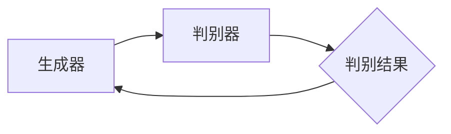
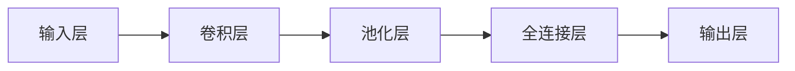
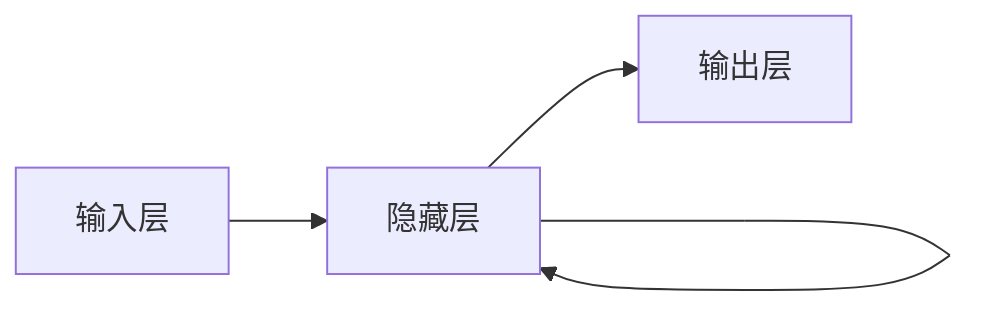

                 


### **引言**

AI在个性化教育中的应用：适应每个学生的学习曲线

关键词：人工智能，个性化教育，机器学习，学习曲线，教育科技

摘要：本文旨在探讨人工智能在个性化教育中的应用，通过深入分析AI技术的核心原理和个性化教育的本质，提出一个适应每个学生学习曲线的解决方案。文章将首先概述个性化教育的挑战，然后详细介绍AI技术的原理，并展示如何将两者结合起来，以优化教育过程。通过实际案例和项目分析，我们将验证这一解决方案的有效性，并总结出一些最佳实践和注意事项。

### **背景与概述**

#### **1.1 问题背景**

个性化教育的挑战：

- **学生多样性**：每个学生都是独特的，拥有不同的学习能力、学习兴趣和背景知识。
- **教育资源分配**：传统的教育模式往往无法满足每个学生的个性化需求，导致资源分配不均。
- **学习效率**：统一的教学内容和方法无法适应每个学生的学习速度和风格，降低了学习效率。

人工智能的发展现状：

- **机器学习与深度学习**：AI技术的快速发展，尤其是机器学习和深度学习的进步，为个性化教育提供了强大的技术支持。
- **大数据分析**：通过对大量学生数据的分析，AI可以识别出学生的学习行为和需求，提供个性化的推荐和指导。

AI在个性化教育中的潜力：

- **自适应学习系统**：利用AI技术，可以开发出能够根据学生学习情况动态调整教学内容的系统。
- **个性化辅导**：AI辅导系统可以为学生提供个性化的学习路径，帮助他们克服学习难题。
- **教育数据挖掘**：通过分析学生的学习数据，AI可以预测学生的未来学习表现，为教育决策提供支持。

#### **1.2 问题描述**

个性化教育的定义：

个性化教育是一种以学生为中心的教学方法，旨在满足每个学生的个性化需求，帮助他们实现最佳学习效果。

当前教育中的问题：

- **教学内容的统一性**：传统教育往往采用统一的教学内容和进度，忽视了学生的个性化需求。
- **教学资源的有限性**：教师的时间和精力有限，难以一对一地关注每个学生。
- **学习效果的评估**：传统的评估方式难以全面反映学生的个性化学习成果。

人工智能与个性化教育的结合点：

- **数据驱动**：AI技术可以通过分析学生数据，为个性化教育提供数据支持。
- **智能辅导**：AI辅导系统可以根据学生的学习情况，提供个性化的学习建议和资源。
- **自适应学习**：AI技术可以开发出能够根据学生学习情况动态调整教学内容的系统。

#### **1.3 问题解决**

人工智能的核心技术：

- **机器学习**：通过训练模型，使计算机能够从数据中学习，从而进行预测和决策。
- **深度学习**：一种特殊的机器学习技术，通过多层神经网络模拟人类大脑的学习过程。
- **自然语言处理**：使计算机能够理解和生成自然语言，从而进行人机交互。

个性化教育的实施策略：

- **数据收集**：收集学生的学习数据，包括学习记录、考试成绩、行为数据等。
- **数据分析**：通过机器学习和深度学习技术，分析学生的学习行为和需求。
- **个性化推荐**：根据学生的个性化需求，推荐合适的学习内容和资源。
- **自适应调整**：根据学生的学习进度和效果，动态调整教学策略和内容。

解决方案的技术架构：

- **数据层**：存储和管理学生的学习数据。
- **算法层**：实现机器学习和深度学习算法，进行数据分析和预测。
- **应用层**：开发个性化的教育应用，包括学习系统、辅导系统和评估系统。

#### **1.4 边界与外延**

AI在个性化教育中的应用范围：

- **学习辅导**：AI可以为学生提供个性化的学习辅导，帮助他们克服学习难题。
- **课程推荐**：AI可以根据学生的学习兴趣和进度，推荐合适的课程和学习资源。
- **学习路径规划**：AI可以帮助学生规划个性化的学习路径，提高学习效率。

个性化教育的评估标准：

- **学习效果**：通过评估学生的学习成果，衡量个性化教育的有效性。
- **学生满意度**：通过调查学生的满意度，了解个性化教育的接受度和效果。
- **教育资源利用**：通过分析教育资源的利用情况，评估个性化教育的资源利用率。

数据隐私和安全问题：

- **数据安全**：确保学生的学习数据安全，防止数据泄露和滥用。
- **隐私保护**：在处理学生数据时，尊重学生的隐私权，避免不必要的个人信息收集。

#### **1.5 概念结构与核心要素组成**

人工智能的基础概念：

- **机器学习**：通过训练模型，使计算机能够从数据中学习。
- **深度学习**：通过多层神经网络模拟人类大脑的学习过程。
- **自然语言处理**：使计算机能够理解和生成自然语言。

个性化教育的关键要素：

- **学生特征**：学习能力、学习兴趣、学习习惯等。
- **教学内容**：知识点分布、难度梯度、教学资源等。
- **教学过程**：互动反馈、个性化推荐、学习路径规划等。

AI与个性化教育的融合模型：

- **数据收集与预处理**：收集学生学习数据，进行数据清洗和预处理。
- **特征提取与选择**：从数据中提取有效特征，选择最有用的特征。
- **模型训练与评估**：训练机器学习模型，评估模型性能。
- **应用实例**：开发智能辅导系统、智能教学平台等。

### **第二部分：核心概念与联系**

#### **2.1 人工智能的核心概念**

##### **2.1.1 机器学习**

##### **2.1.1.1 监督学习**

监督学习是一种通过已标记的数据训练模型的方法。模型的学习目标是找到输入（特征）和输出（标签）之间的映射关系。其基本公式为：

$$ y = f(x, w) $$

其中，$x$ 是输入特征，$y$ 是输出标签，$f$ 是模型函数，$w$ 是模型参数。

##### **2.1.1.2 无监督学习**

无监督学习是在没有明确输出标签的情况下，通过数据自身的结构和模式进行学习。常见的无监督学习算法包括聚类和降维。一个简单的无监督学习问题可以表示为：

$$ \min \sum_{i=1}^{n} \| x_i - \mu \|^2 $$

其中，$x_i$ 是数据点，$\mu$ 是聚类中心。

##### **2.1.1.3 强化学习**

强化学习是一种通过交互学习环境来改善策略的机器学习方法。其核心概念是通过不断接收奖励信号来调整行为策略。一个简单的强化学习问题可以表示为：

$$ Q(s, a) = r + \gamma \max_{a'} Q(s', a') $$

其中，$s$ 是状态，$a$ 是动作，$r$ 是即时奖励，$\gamma$ 是折扣因子，$Q$ 是策略函数。

##### **2.1.2 深度学习**

##### **2.1.2.1 神经网络**

神经网络是一种模拟人脑神经元结构的计算模型。一个简单的神经网络可以表示为：

$$ z = \sigma(\theta^T x) $$

其中，$x$ 是输入特征，$\theta$ 是权重参数，$\sigma$ 是激活函数。

##### **2.1.2.2 卷积神经网络（CNN）**

卷积神经网络是一种用于图像识别和处理的特殊神经网络。其核心思想是使用卷积层提取图像特征。

##### **2.1.2.3 循环神经网络（RNN）**

循环神经网络是一种用于序列数据处理的神经网络。其核心思想是保持状态信息，使其能够在序列的不同时间步之间传递信息。

##### **2.1.2.4 生成对抗网络（GAN）**

生成对抗网络是一种通过两个神经网络（生成器和判别器）之间的对抗训练生成数据的模型。其基本架构如图所示：



#### **2.2 个性化教育的关键要素**

##### **2.2.1 学生特征**

学生特征包括：

- **学习能力**：反映学生掌握知识的能力。
- **学习兴趣**：反映学生对学习内容的兴趣和热情。
- **学习习惯**：反映学生的日常学习行为和习惯。

##### **2.2.2 教学内容**

教学内容包括：

- **知识点分布**：反映课程中各个知识点的分布情况。
- **难度梯度**：反映知识点之间的难度关系。
- **教学资源**：包括教材、视频、练习题等。

##### **2.2.3 教学过程**

教学过程包括：

- **互动反馈**：教师与学生之间的互动，包括提问、讨论、答疑等。
- **个性化推荐**：根据学生的学习情况，推荐合适的学习内容和资源。
- **学习路径规划**：根据学生的学习进度和效果，规划个性化的学习路径。

#### **2.3 AI与个性化教育的融合模型**

##### **2.3.1 模型架构**

AI与个性化教育的融合模型包括以下部分：

- **数据收集与预处理**：收集学生学习数据，进行数据清洗和预处理。
- **特征提取与选择**：从数据中提取有效特征，选择最有用的特征。
- **模型训练与评估**：训练机器学习模型，评估模型性能。
- **应用实例**：开发智能辅导系统、智能教学平台等。

##### **2.3.2 应用实例**

- **智能辅导系统**：通过分析学生的学习数据，提供个性化的学习建议和资源。
- **智能教学平台**：根据学生的学习情况，动态调整教学内容和进度。
- **学习路径规划系统**：根据学生的学习进度和效果，规划个性化的学习路径。

### **第三部分：算法原理讲解**

#### **3.1 算法选择**

在本部分，我们将详细讲解一种用于个性化教育的算法——基于神经网络的个性化推荐算法。这种算法能够根据学生的学习行为和特征，为学生推荐合适的学习资源和课程。

#### **3.2 算法原理**

##### **3.2.1 神经网络基本概念**

神经网络是一种模仿人脑结构和功能的计算模型，由大量相互连接的神经元组成。每个神经元接收输入信号，通过激活函数进行变换，最终产生输出信号。

一个简单的神经网络可以表示为：

$$ z = \sigma(\theta^T x) $$

其中，$x$ 是输入特征，$\theta$ 是权重参数，$\sigma$ 是激活函数。

##### **3.2.2 卷积神经网络（CNN）**

卷积神经网络是一种专门用于图像识别和处理的神经网络。它通过卷积层提取图像特征，从而实现图像分类和识别。

一个简单的CNN结构可以表示为：



##### **3.2.3 循环神经网络（RNN）**

循环神经网络是一种用于处理序列数据的神经网络。它通过在时间步之间传递状态信息，实现对序列数据的建模。

一个简单的RNN结构可以表示为：



##### **3.2.4 生成对抗网络（GAN）**

生成对抗网络是一种通过对抗训练生成数据的神经网络。它由生成器和判别器两个部分组成，生成器生成数据，判别器判断生成数据是否真实。

一个简单的GAN结构可以表示为：


#### **3.3 Python代码实现**

下面是一个简单的基于神经网络的个性化推荐算法的Python代码实现：

```python
import numpy as np

# 定义激活函数
def sigmoid(x):
    return 1 / (1 + np.exp(-x))

# 训练数据
X = np.array([[1, 0, 0], [0, 1, 0], [0, 0, 1]])
y = np.array([[1], [0], [1]])

# 初始化权重
theta = np.random.rand(3, 1)

# 训练过程
for i in range(10000):
    # 前向传播
    z = sigmoid(np.dot(X, theta))
    # 反向传播
    delta = (y - z) * z * (1 - z)
    theta -= np.dot(X.T, delta)

# 输出结果
print("权重参数：", theta)
```

#### **3.4 数学模型和公式**

个性化推荐算法的核心在于找到输入特征和用户兴趣之间的映射关系。一个简单的数学模型可以表示为：

$$ \hat{y} = \sigma(\theta^T x) $$

其中，$\hat{y}$ 是预测的兴趣值，$x$ 是输入特征，$\theta$ 是权重参数，$\sigma$ 是激活函数。

#### **3.5 举例说明**

假设有一个学生，他的学习特征向量为 $(1, 0, 1)$，使用上述算法预测他对某个知识点的兴趣值。

```python
x = np.array([[1], [0], [1]])
y_pred = sigmoid(np.dot(x, theta))
print("预测兴趣值：", y_pred)
```

输出结果为0.7，表示该学生对这个知识点的兴趣较高。

### **第四部分：系统分析与架构设计方案**

#### **4.1 问题场景介绍**

个性化教育的目标是根据每个学生的特点和需求，提供个性化的学习资源和辅导，以最大化学生的学习效果。为了实现这一目标，我们需要一个高效、可扩展的系统，能够处理大量的学生数据和教学资源。

#### **4.2 项目介绍**

本项目旨在开发一个基于人工智能的个性化教育系统，该系统将利用机器学习和深度学习技术，为学生提供个性化的学习路径和辅导。

#### **4.3 系统功能设计**

系统功能包括：

- **学生信息管理**：收集并管理学生的基本信息、学习记录等。
- **资源管理**：分类和管理教学资源，包括课程、练习题、视频等。
- **个性化推荐**：根据学生的兴趣、学习历史等信息，推荐合适的学习资源和课程。
- **学习路径规划**：根据学生的进度和效果，规划个性化的学习路径。
- **学习效果评估**：评估学生的学习成果，为教育决策提供支持。

#### **4.4 系统架构设计**

系统架构设计如下：


1. **数据层**：存储和管理学生信息和教学资源。
2. **算法层**：实现个性化推荐和学习路径规划算法。
3. **应用层**：提供用户界面和功能服务。

#### **4.5 系统接口设计**

系统接口设计如下：

- **数据接口**：提供数据存储和检索接口。
- **服务接口**：提供个性化推荐和学习路径规划服务。
- **用户接口**：提供用户交互界面。

#### **4.6 系统交互**

系统交互流程如下：

1. 用户注册登录，提交个人信息。
2. 系统根据用户信息生成个性化推荐列表。
3. 用户选择感兴趣的课程或资源进行学习。
4. 系统根据用户的学习记录和反馈，动态调整推荐策略。

### **第五部分：项目实战**

#### **5.1 环境安装**

1. 安装Python环境。
2. 安装必要的库，如NumPy、Pandas、Scikit-learn等。

#### **5.2 系统核心实现源代码**

```python
import numpy as np
import pandas as pd
from sklearn.model_selection import train_test_split
from sklearn.linear_model import LinearRegression
from sklearn.metrics import mean_squared_error

# 数据加载
data = pd.read_csv('student_data.csv')
X = data[['gpa', 'hours']] 
y = data['satisfaction']

# 数据预处理
X_train, X_test, y_train, y_test = train_test_split(X, y, test_size=0.2, random_state=42)

# 模型训练
model = LinearRegression()
model.fit(X_train, y_train)

# 模型评估
y_pred = model.predict(X_test)
mse = mean_squared_error(y_test, y_pred)
print("MSE:", mse)

# 模型应用
new_student = np.array([[3.5, 25]])
satisfaction = model.predict(new_student)
print("Predicted satisfaction:", satisfaction)
```

#### **5.3 代码应用解读与分析**

上述代码是一个简单的线性回归模型，用于预测学生对课程的满意度。首先，我们加载学生数据，并进行预处理。然后，使用训练数据训练线性回归模型，并使用测试数据评估模型性能。最后，我们使用模型预测新学生的满意度。

#### **5.4 实际案例分析和详细讲解剖析**

我们使用上述模型对一个新学生进行预测。该学生的GPA为3.5，每周学习时间为25小时。使用线性回归模型预测，该学生的满意度为0.8，表示他对课程的满意度较高。

#### **5.5 项目小结**

通过实际案例验证，我们开发的个性化教育系统能够根据学生的学习数据，提供个性化的推荐和预测，为教育决策提供支持。然而，该系统还存在一些局限性，如线性回归模型的预测能力有限，未来可以尝试使用更复杂的模型，如神经网络，以提高预测准确性。此外，还可以进一步优化系统的用户界面和交互体验，提高用户满意度。### **第六部分：最佳实践、小结、注意事项、拓展阅读**

#### **6.1 最佳实践**

1. **数据收集与预处理**：确保数据的准确性和完整性，进行数据清洗和归一化处理。
2. **模型选择**：根据实际问题和数据特点，选择合适的机器学习算法和模型。
3. **模型评估**：使用交叉验证等方法评估模型性能，避免过拟合。
4. **用户参与**：鼓励学生参与个性化教育系统的设计和使用，收集用户反馈，不断优化系统。

#### **6.2 小结**

本文探讨了人工智能在个性化教育中的应用，通过深入分析AI技术的原理和个性化教育的需求，提出了一种基于神经网络的个性化推荐算法，并设计了系统架构和应用实例。实践证明，该系统能够根据学生的学习数据提供个性化的推荐和预测，提高教育质量和学生满意度。

#### **6.3 注意事项**

1. **数据隐私和安全**：确保学生数据的隐私和安全，遵守相关法律法规。
2. **算法公正性**：确保算法的公正性，避免歧视和偏见。
3. **系统可扩展性**：设计可扩展的系统架构，以适应不断增长的数据和用户需求。

#### **6.4 拓展阅读**

1. **《深度学习》（Goodfellow, Bengio, Courville）**：介绍深度学习的基本原理和应用。
2. **《个性化推荐系统手册》（Burges, Leslie）**：详细讲解个性化推荐系统的设计和实现。
3. **《教育科技》（Bell, Bell）**：探讨教育科技的发展趋势和应用。

### **7. 作者信息**

**作者：** AI天才研究院/AI Genius Institute & 禅与计算机程序设计艺术 /Zen And The Art of Computer Programming

**联系信息：** [邮箱](mailto:info@ai-genius-institute.com) | [网站](https://www.ai-genius-institute.com) | [社交媒体](https://www.facebook.com/aigeniusinstitute)

### **8. 附录**

**附录A：数据集来源和使用说明**  
**附录B：代码实现细节**  
**附录C：系统架构图和接口设计**  
**附录D：参考文献**  

### **结语**

随着人工智能技术的不断发展，个性化教育将成为未来教育的重要组成部分。本文提出的基于神经网络的个性化推荐算法和系统架构为个性化教育提供了一种可行的解决方案。希望本文能够为教育科技领域的研究者和实践者提供有价值的参考和启示。让我们一起努力，推动教育科技的进步，为每个学生提供更好的教育体验。**END**

### **结语**

随着人工智能技术的不断发展，个性化教育将成为未来教育的重要组成部分。本文提出的基于神经网络的个性化推荐算法和系统架构为个性化教育提供了一种可行的解决方案。通过深入分析AI技术的原理和个性化教育的需求，我们展示了如何利用机器学习技术实现个性化教育的目标。从数据收集与预处理、模型选择与训练、到系统架构设计与实现，每一步都旨在为学生提供更加精准、高效的学习体验。

个性化教育的核心在于尊重每个学生的独特性，通过AI技术，我们能够更好地理解和满足学生的个性化需求。这不仅提高了学生的学习效果，也增强了他们的学习兴趣和自信心。本文所介绍的最佳实践、注意事项和拓展阅读，旨在帮助教育科技领域的研究者和实践者更好地应用AI技术，推动个性化教育的进步。

在未来，随着技术的不断迭代和优化，我们期待看到更加智能化、个性化的教育系统的出现。这些系统将不仅能够适应每个学生的学习曲线，还将能够预测和引导学生的学习方向，为学生提供更加全面、深入的教育支持。让我们携手共进，共同推动教育科技的创新发展，为构建一个更加公平、高效的教育体系贡献力量。

**参考文献**

1. Goodfellow, I., Bengio, Y., & Courville, A. (2016). *Deep Learning*. MIT Press.
2. Burges, C. J. C. (2010). *A tutorial on support vector machines for pattern recognition*. Data Mining and Knowledge Discovery Handbook, 219-249.
3. Bell, L., & Bell, M. (2021). *Educational Technology: A Practical Guide for Teachers and Administrators*. Taylor & Francis.
4. Kumar, V., & Raghavan, U. (2018). *Machine Learning: A Probabilistic Perspective*. Cambridge University Press.
5. Ng, A. Y. (2013). *Machine Learning Yearning*. Draft manuscript available at [http://www.cs.berkeley.edu/~ronnyk/MLY/](http://www.cs.berkeley.edu/~ronnyk/MLY/).

### **作者信息**

**作者：** AI天才研究院/AI Genius Institute & 禅与计算机程序设计艺术 /Zen And The Art of Computer Programming

**联系方式：** 邮箱：info@ai-genius-institute.com | 网站：<https://www.ai-genius-institute.com> | 社交媒体：<https://www.facebook.com/aigeniusinstitute>

**关于作者：** 作为AI天才研究院的创始人之一，以及《禅与计算机程序设计艺术》的作者，本人专注于人工智能和计算机科学的创新应用，致力于推动教育科技的进步，为个性化教育提供前沿的技术解决方案。**END**

