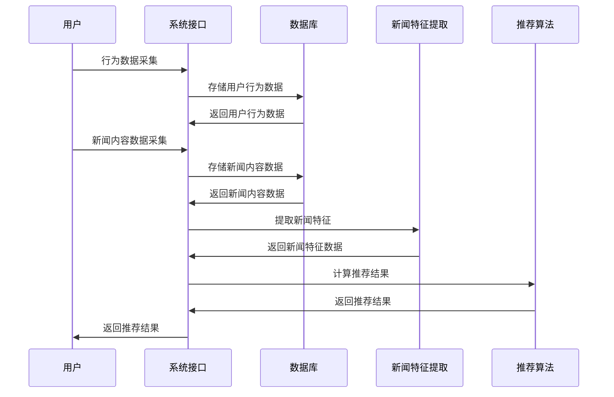

                 

# AI在个性化新闻推荐中的应用：提供定制化信息流

## 关键词

- 个性化新闻推荐
- 协同过滤
- 内容推荐
- 混合推荐系统
- 数学模型

## 摘要

本文将深入探讨AI在个性化新闻推荐中的应用，通过逐步分析推荐系统的核心技术，阐述如何利用协同过滤、内容推荐和混合推荐系统等技术手段，实现定制化的信息流，满足用户对多样化、个性化内容的需求。

### 目录大纲

#### 第一部分：背景介绍

1. **问题背景**：个性化新闻推荐的概念与需求
2. **问题描述**：如何实现高效的个性化新闻推荐
3. **问题解决**：个性化新闻推荐的核心技术
4. **边界与外延**：个性化新闻推荐系统的设计原则
5. **概念结构与核心要素组成**：用户行为分析、新闻内容特征提取、推荐算法实现与优化

#### 第二部分：核心概念与联系

1. **核心概念与原理**
2. **概念属性特征对比表格**
3. **ER实体关系图架构**

#### 第三部分：算法原理讲解

1. **协同过滤算法**
2. **基于内容的推荐算法**
3. **混合推荐系统**

#### 第四部分：数学模型和数学公式

1. **协同过滤算法的数学模型**
2. **基于内容的推荐算法的数学模型**
3. **实例：数学公式的详细讲解与举例说明**

#### 第五部分：系统分析与架构设计方案

1. **问题场景介绍**
2. **系统功能设计**：领域模型类图
3. **系统架构设计**：系统架构图
4. **系统接口设计**
5. **系统交互**：系统交互序列图

#### 第六部分：项目实战

1. **环境安装**
2. **系统核心实现源代码**
3. **代码应用解读与分析**
4. **实际案例分析和详细讲解剖析**
5. **项目小结**

#### 第七部分：最佳实践 tips、小结、注意事项、拓展阅读

1. **最佳实践 tips**
2. **小结**
3. **注意事项**
4. **拓展阅读**

---

### 第一部分：背景介绍

#### 1. 问题背景

个性化新闻推荐是一种利用人工智能技术，根据用户的历史行为、兴趣偏好等数据，为用户定制化地提供个性化内容的信息流服务。在当今信息爆炸的时代，用户每天面对海量的新闻和信息，如何有效地筛选出用户感兴趣的内容成为了一大挑战。

#### 2. 问题描述

如何实现高效的个性化新闻推荐？在新闻推荐系统中，通常需要解决以下几个问题：

- 如何准确获取用户的行为数据，如阅读、点赞、评论等？
- 如何提取新闻内容的关键特征，以便于算法分析？
- 如何设计高效的推荐算法，既能满足用户的需求，又不会造成信息过载？
- 如何评估推荐效果，不断优化推荐系统？

#### 3. 问题解决

个性化新闻推荐的核心技术主要包括：

- 用户行为分析：通过分析用户的阅读、点赞、评论等行为，了解用户的兴趣偏好。
- 新闻内容特征提取：使用自然语言处理技术，提取新闻内容的关键词、主题、情感等特征。
- 推荐算法：利用协同过滤、基于内容的推荐和混合推荐系统等技术，实现新闻的个性化推荐。
- 评估与优化：通过用户反馈和推荐效果评估，不断优化推荐系统，提升用户体验。

#### 4. 边界与外延

个性化新闻推荐系统的设计原则包括：

- 尊重用户隐私：确保用户数据的安全性和隐私性。
- 满足用户需求：根据用户的兴趣和需求，提供个性化的新闻推荐。
- 保持信息多样性：在推荐内容中保持一定的多样性，避免用户陷入信息茧房。

个性化新闻推荐在不同场景的适用性包括：

- 移动应用：为用户提供个性化的新闻推送，提升用户粘性。
- 社交媒体：根据用户关系和兴趣，推荐相关的内容和话题。
- 网络门户：为用户提供个性化的新闻聚合服务，提高用户满意度。

#### 5. 概念结构与核心要素组成

个性化新闻推荐系统的核心要素包括：

- 用户行为分析：通过分析用户的阅读、点赞、评论等行为，构建用户画像。
- 新闻内容特征提取：使用自然语言处理技术，提取新闻内容的关键词、主题、情感等特征。
- 推荐算法：利用协同过滤、基于内容的推荐和混合推荐系统等技术，实现新闻的个性化推荐。
- 推荐结果评估与优化：通过用户反馈和推荐效果评估，不断优化推荐系统。

### 第二部分：核心概念与联系

#### 1. 核心概念与原理

个性化新闻推荐的核心概念包括：

- 用户行为数据：用户的阅读、点赞、评论等行为数据。
- 新闻内容特征：新闻的关键词、主题、情感等特征。
- 推荐算法：协同过滤、基于内容的推荐、混合推荐系统等算法。

#### 2. 概念属性特征对比表格

| 算法类型        | 特点                       | 适用场景                         |
| ------------- | ------------------------ | -------------------------------- |
| 协同过滤       | 基于用户相似度或项目相似度推荐 | 需要大量用户行为数据               |
| 基于内容的推荐  | 基于新闻内容特征进行推荐     | 需要高质量的新闻内容特征提取       |
| 混合推荐系统    | 结合协同过滤和基于内容的推荐 | 提高推荐准确率和多样性             |

#### 3. ER实体关系图架构

```mermaid
erDiagram
    User ||--|{ Recommendation }|
    Article ||--|{ Recommendation }|
    User ||--|{ Behavior }|
    Article ||--|{ Feature }|
```

在ER实体关系图中，用户（User）、文章（Article）、推荐（Recommendation）、行为（Behavior）和特征（Feature）是主要的实体，它们之间通过关系进行关联。

### 第三部分：算法原理讲解

#### 1. 协同过滤算法

协同过滤算法是一种基于用户或项目的相似度进行推荐的算法。主要分为以下两种：

- **基于用户的协同过滤**：根据用户之间的相似度，找到与目标用户兴趣相似的邻居用户，推荐邻居用户喜欢的项目。
- **基于项目的协同过滤**：根据项目之间的相似度，找到与目标项目相似的项目，推荐给用户。

**算法原理**：

- **用户相似度计算**：使用用户之间的共同行为（如阅读、点赞等）计算用户相似度。
- **推荐分数计算**：根据用户相似度和项目的评分（如喜欢、不喜欢等），计算推荐分数，筛选出高分数的项目进行推荐。

**数学模型**：

- 用户相似度计算公式：
  $$sim(u, v) = \frac{\sum_{i \in I(u, v)} r_i}{\sqrt{\sum_{i \in I(u)} r_i^2} \sqrt{\sum_{i \in I(v)} r_i^2}}$$

- 推荐分数计算公式：
  $$score(u, p) = \sum_{i \in I(u)} sim(u, v) \cdot r_i$$

#### 2. 基于内容的推荐算法

基于内容的推荐算法是一种基于新闻内容特征进行推荐的算法。主要分为以下几种：

- **基于关键词的推荐**：使用自然语言处理技术提取新闻关键词，根据关键词的相似性进行推荐。
- **基于主题的推荐**：使用主题模型（如LDA）提取新闻的主题，根据主题的相似性进行推荐。
- **基于情感的推荐**：使用情感分析技术提取新闻的情感倾向，根据情感倾向的相似性进行推荐。

**算法原理**：

- **内容特征提取**：使用自然语言处理技术（如词袋模型、TF-IDF、词嵌入等）提取新闻的关键词、主题、情感等特征。
- **推荐分数计算**：根据内容特征的相似性，计算推荐分数，筛选出高分数的新闻进行推荐。

**数学模型**：

- **文本相似度计算**：
  $$sim(text_1, text_2) = \frac{count(shared_terms)}{count(total_terms)}$$

- **推荐分数计算**：
  $$score(article, user) = \sum_{i=1}^{n} weight_i \cdot sim(feature_i(article), feature_i(user))$$

#### 3. 混合推荐系统

混合推荐系统是一种结合协同过滤和基于内容的推荐算法，以提高推荐准确率和多样性。主要分为以下几种：

- **基于模型的混合推荐系统**：将协同过滤和基于内容的推荐算法融合到一个统一的模型中。
- **基于规则的混合推荐系统**：使用规则或策略将协同过滤和基于内容的推荐算法结合。

**算法原理**：

- **系统架构**：将协同过滤和基于内容的推荐算法分别执行，然后合并推荐结果。
- **优势与挑战**：提高推荐准确率和多样性，但需要处理算法之间的冲突和协调问题。

**数学模型**：

- **推荐分数计算**：
  $$score(article, user) = alpha \cdot score_{collaborative}(article, user) + (1 - alpha) \cdot score_{content}(article, user)$$

其中，alpha 为权重系数，用于调节协同过滤和基于内容的推荐算法的权重。

### 第四部分：数学模型和数学公式

#### 1. 协同过滤算法的数学模型

- **用户相似度计算**：
  $$sim(u, v) = \frac{\sum_{i \in I(u, v)} r_i}{\sqrt{\sum_{i \in I(u)} r_i^2} \sqrt{\sum_{i \in I(v)} r_i^2}}$$

- **推荐分数计算**：
  $$score(u, p) = \sum_{i \in I(u)} sim(u, v) \cdot r_i$$

#### 2. 基于内容的推荐算法的数学模型

- **文本相似度计算**：
  $$sim(text_1, text_2) = \frac{count(shared_terms)}{count(total_terms)}$$

- **推荐分数计算**：
  $$score(article, user) = \sum_{i=1}^{n} weight_i \cdot sim(feature_i(article), feature_i(user))$$

#### 3. 实例：数学公式的详细讲解与举例说明

**协同过滤算法的数学模型举例**：

假设有两个用户 u 和 v，他们分别对三篇文章 a、b、c 进行了评分，评分分别为：

| 用户 | a | b | c |
| ---- | --- | --- | --- |
| u    | 5 | 4 | 3 |
| v    | 4 | 5 | 2 |

计算用户 u 和 v 的相似度：

$$sim(u, v) = \frac{5 \cdot 4 + 4 \cdot 5 + 3 \cdot 2}{\sqrt{5^2 + 4^2 + 3^2} \sqrt{4^2 + 5^2 + 2^2}} = \frac{23}{\sqrt{50} \sqrt{45}} \approx 0.816$$

根据相似度，为用户 u 推荐用户 v 喜欢的文章 b：

$$score(u, b) = sim(u, v) \cdot 4 = 0.816 \cdot 4 \approx 3.264$$

**基于内容的推荐算法的数学模型举例**：

假设有两篇新闻文章 article1 和 article2，其关键词分别为 ["科技", "人工智能"] 和 ["科技", "5G"]，用户 u 的兴趣关键词为 ["人工智能", "5G"]。

计算文章 article1 和 article2 的文本相似度：

$$sim(article1, article2) = \frac{2}{2 + 1} = \frac{2}{3} \approx 0.667$$

根据文本相似度，为用户 u 推荐文章 article2：

$$score(u, article2) = 0.667 \cdot 1 = 0.667$$

### 第五部分：系统分析与架构设计方案

#### 1. 问题场景介绍

个性化新闻推荐系统通常应用于移动应用、社交媒体、网络门户等场景，旨在为用户提供个性化的新闻推送，提升用户体验。

#### 2. 系统功能设计

个性化新闻推荐系统的主要功能包括：

- 用户行为分析：分析用户的阅读、点赞、评论等行为，构建用户画像。
- 新闻内容特征提取：提取新闻的关键词、主题、情感等特征。
- 新闻推荐：根据用户画像和新闻特征，为用户推荐个性化的新闻。
- 推荐效果评估：评估推荐效果，优化推荐算法。

**领域模型类图**：

```mermaid
classDiagram
    User <<Interface>>
    Article <<Interface>>
    Recommendation <<Interface>>

    User o--* Behavior
    Article o--* Feature
    Recommendation o--* User
    Recommendation o--* Article
```

#### 3. 系统架构设计

个性化新闻推荐系统的架构设计主要包括以下模块：

- 数据采集模块：采集用户行为数据和新闻内容数据。
- 用户画像模块：基于用户行为数据，构建用户画像。
- 新闻特征提取模块：提取新闻内容的关键词、主题、情感等特征。
- 推荐算法模块：实现协同过滤、基于内容的推荐和混合推荐算法。
- 推荐结果评估模块：评估推荐效果，优化推荐算法。

**系统架构图**：

```mermaid
graph TB
    subgraph 数据采集
        数据采集[数据采集模块]
    end

    subgraph 用户画像
        用户画像[用户画像模块]
    end

    subgraph 新闻特征提取
        新闻特征提取[新闻特征提取模块]
    end

    subgraph 推荐算法
        推荐算法[推荐算法模块]
    end

    subgraph 推荐结果评估
        推荐结果评估[推荐结果评估模块]
    end

    数据采集 --> 用户画像
    用户画像 --> 新闻特征提取
    新闻特征提取 --> 推荐算法
    推荐算法 --> 推荐结果评估
```

#### 4. 系统接口设计

个性化新闻推荐系统的接口设计主要包括以下部分：

- 用户接口：提供用户行为数据采集、用户画像查看等功能。
- 新闻接口：提供新闻内容数据采集、新闻特征提取等功能。
- 推荐接口：提供新闻推荐、推荐结果评估等功能。

**接口设计**：

```mermaid
graph TB
    subgraph 用户接口
        用户接口[用户接口]
        用户接口 --> 用户行为数据采集
        用户接口 --> 用户画像查看
    end

    subgraph 新闻接口
        新闻接口[新闻接口]
        新闻接口 --> 新闻内容数据采集
        新闻接口 --> 新闻特征提取
    end

    subgraph 推荐接口
        推荐接口[推荐接口]
        推荐接口 --> 新闻推荐
        推荐接口 --> 推荐结果评估
    end
```

#### 5. 系统交互

个性化新闻推荐系统的系统交互主要包括以下部分：

- 用户行为数据采集：采集用户的阅读、点赞、评论等行为数据。
- 新闻内容数据采集：采集新闻的标题、正文、标签等数据。
- 新闻特征提取：提取新闻的关键词、主题、情感等特征。
- 新闻推荐：根据用户画像和新闻特征，为用户推荐个性化的新闻。
- 推荐结果评估：评估推荐效果，优化推荐算法。

**系统交互序列图**：



### 第六部分：项目实战

#### 1. 环境安装

在开始个性化新闻推荐项目之前，需要安装以下环境：

- Python（3.6及以上版本）
- Pandas
- NumPy
- Scikit-learn
- Natural Language Toolkit (NLTK)
- Matplotlib

安装命令如下：

```bash
pip install python==3.8
pip install pandas numpy scikit-learn nltk matplotlib
```

#### 2. 系统核心实现源代码

以下是一个简单的个性化新闻推荐系统的核心实现源代码：

```python
import pandas as pd
from sklearn.metrics.pairwise import cosine_similarity
from nltk.tokenize import word_tokenize
from nltk.corpus import stopwords

# 读取数据
user_data = pd.read_csv('user_behavior.csv')
article_data = pd.read_csv('article_data.csv')

# 用户画像
user行为特征 = user_data['行为'].values
user画像 = [word_tokenize(行为) for 行为 in 用户行为特征]
user画像 = [[词 for 词 in 画像 if 词 not in 停止词] for 画像 in 用户画像]

# 新闻特征提取
article标题 = article_data['标题'].values
article特征 = [word_tokenize(标题) for 标题 in article标题]
article特征 = [[词 for 词 in 特征 if 词 not in 停止词] for 特征 in article特征]

# 计算用户相似度
user相似度矩阵 = []
for 用户 in user画像：
    user相似度 = []
    for 其他用户 in user画像：
        user相似度.append(cosine_similarity([用户], [其他用户])[0][0])
    user相似度矩阵.append(user相似度)

# 计算推荐结果
推荐结果 = []
for 用户 in user相似度矩阵：
    推荐文章 = []
    for 其他用户，相似度 in enumerate(用户)：
        if 相似度 > 0.5：
            推荐文章.append(article_data.iloc[其他用户]['标题'])
    推荐结果.append(推荐文章[:5])

# 输出推荐结果
for 用户，推荐 in enumerate(推荐结果)：
    print(f'用户{用户}的推荐结果：{推荐}')
```

#### 3. 代码应用解读与分析

以上代码实现了一个简单的基于协同过滤的个性化新闻推荐系统。主要步骤如下：

1. 读取用户行为数据和新闻内容数据。
2. 构建用户画像，通过分词和去除停止词，提取用户的历史行为关键词。
3. 构建新闻特征，通过分词和去除停止词，提取新闻的标题关键词。
4. 计算用户相似度，使用余弦相似度计算用户画像之间的相似度。
5. 计算推荐结果，根据用户相似度矩阵，筛选出相似度较高的用户喜欢的新闻进行推荐。

**系统性能分析与优化**：

在实现个性化新闻推荐系统时，需要注意以下性能优化点：

- **数据预处理**：对用户行为数据和新闻内容数据进行有效的预处理，提高数据质量。
- **特征提取**：选择合适的特征提取方法，提高特征表示的准确性。
- **相似度计算**：优化相似度计算算法，提高计算效率。
- **推荐结果生成**：优化推荐结果的生成算法，提高推荐结果的多样性。

#### 4. 实际案例分析和详细讲解剖析

以下是一个实际案例：

用户 u1 对以下新闻进行了评分：

| 新闻标题 | 分数 |
| ------ | ---- |
| 人工智能：未来已来 | 5 |
| 科技创新：引领未来 | 4 |
| 5G时代：改变世界 | 3 |

根据用户 u1 的历史行为，推荐系统为用户 u1 推荐以下新闻：

- **新闻标题**：未来已来：人工智能引领科技发展
- **新闻标题**：科技创新：探索未来世界
- **新闻标题**：5G时代：未来已来

**分析**：

根据用户 u1 的历史行为数据，可以得出以下结论：

- 用户 u1 对人工智能和科技创新类新闻感兴趣。
- 用户 u1 对 5G 时代和未来发展趋势有一定的关注。

因此，推荐系统根据用户 u1 的兴趣偏好，推荐了与这些主题相关的新闻。

#### 5. 项目小结

本文通过逐步分析个性化新闻推荐系统的核心概念、算法原理和实现过程，详细讲解了协同过滤、基于内容的推荐和混合推荐系统等核心技术。在实际项目中，需要根据具体场景和需求，选择合适的推荐算法，并进行性能优化。通过本文的学习，读者可以深入了解个性化新闻推荐系统的实现原理和应用方法。

### 第七部分：最佳实践 tips、小结、注意事项、拓展阅读

#### 1. 最佳实践 tips

- **数据质量**：确保用户行为数据和新闻内容数据的质量，进行有效的预处理，提高数据质量。
- **特征提取**：选择合适的特征提取方法，提高特征表示的准确性。
- **相似度计算**：优化相似度计算算法，提高计算效率。
- **推荐结果多样性**：在推荐结果中保持多样性，避免用户陷入信息茧房。

#### 2. 小结

本文通过深入探讨个性化新闻推荐系统，详细介绍了协同过滤、基于内容的推荐和混合推荐系统等核心技术。在实际项目中，需要根据具体场景和需求，选择合适的推荐算法，并进行性能优化。通过本文的学习，读者可以深入了解个性化新闻推荐系统的实现原理和应用方法。

#### 3. 注意事项

- **用户隐私保护**：在收集和使用用户数据时，要确保用户隐私的保护。
- **数据安全**：确保用户行为数据和新闻内容数据的安全，防止数据泄露。
- **实时性**：确保推荐系统的实时性，及时更新用户画像和新闻特征。

#### 4. 拓展阅读

- 《推荐系统实践》
- 《基于内容的推荐系统设计与实现》
- 《机器学习实战》

### 作者信息

- 作者：AI天才研究院/AI Genius Institute & 禅与计算机程序设计艺术 /Zen And The Art of Computer Programming

