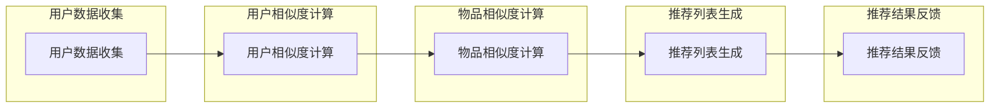
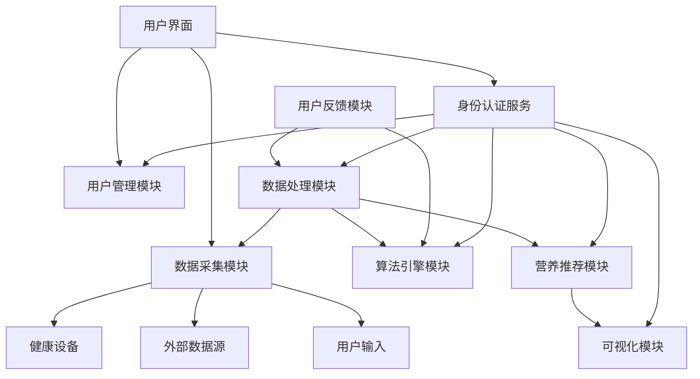
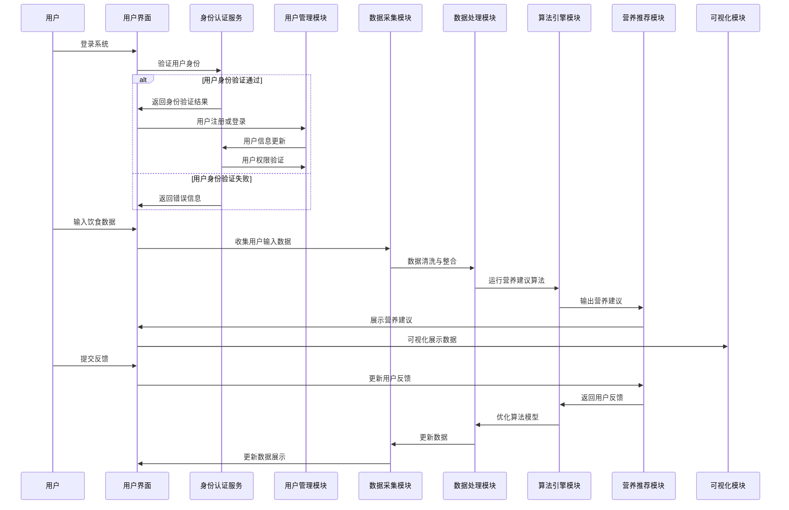

                 

### 引言：个性化营养建议的背景与重要性

随着科技的迅猛发展，人工智能（AI）技术正逐渐渗透到我们生活的方方面面。在医疗健康领域，AI的应用尤为广泛，不仅提升了诊断的准确性，还在个性化治疗和健康监测等方面取得了显著成果。其中，个性化营养建议作为AI应用的一个重要方向，正逐步改变着人们对饮食和健康的认识。

个性化营养建议是指根据个体差异（如年龄、性别、健康状况、生活方式等）为用户提供定制化的营养建议，旨在通过科学合理的饮食指导，帮助个体实现营养均衡，预防疾病，提升生活质量。这种个性化服务不仅能够提高营养干预的效果，还能够节省医疗资源，降低医疗成本。

当前，全球人口老龄化趋势加剧，慢性疾病如心血管疾病、糖尿病、肥胖等问题日益严重。传统的营养建议方式往往一刀切，难以满足个体差异，导致营养干预效果不佳。而AI技术的引入，通过大数据分析和算法优化，可以为每个人提供精准的营养建议，从而实现精准健康管理和预防疾病的目标。

本文将围绕AI在个性化营养建议中的应用进行深入探讨。首先，我们将介绍AI技术的发展及其在营养学中的应用，探讨个性化营养建议的重要性。接着，我们将分析个性化营养建议面临的挑战和机遇，并详细探讨其实现方法和数据隐私保护问题。随后，文章将介绍个性化营养建议的核心概念和组成要素，通过具体的算法原理和数学模型讲解，帮助读者理解AI如何为个性化营养建议提供技术支撑。此外，文章还将详细介绍系统架构设计、项目实战，并总结项目成果与拓展阅读资源，以期为相关领域的研究者和从业者提供有价值的参考。

### 第一部分：背景介绍与核心概念

#### 第1章：AI与个性化营养建议概述

##### 1.1 AI技术的发展及其在营养学中的应用

人工智能（AI）作为当今科技的前沿领域，已经取得了令人瞩目的进展。AI技术的发展始于20世纪50年代，从最初的符号逻辑和规则系统，到后来的专家系统、机器学习、深度学习，再到今天的自然语言处理和计算机视觉，AI技术不断演进，逐渐渗透到各个行业，带来了深刻的变革。

在营养学领域，AI技术的应用同样不容小觑。传统的营养学研究依赖于大量的实验数据和统计分析，而AI技术通过大数据分析、机器学习算法和深度学习模型，可以更高效地处理海量数据，发现潜在的营养规律，从而为个性化营养建议提供科学依据。

AI在营养学中的应用主要包括以下几个方面：

1. **营养数据分析**：通过大数据技术，AI可以收集和分析大量与营养相关的数据，包括食品成分、饮食习惯、健康状况等。这些数据可以帮助研究人员识别出与营养相关的关键因素，为个性化营养建议提供基础。

2. **营养推荐算法**：AI可以通过机器学习算法，如协同过滤、决策树、神经网络等，对用户的历史饮食习惯和健康状况进行分析，生成个性化的营养推荐。这些推荐不仅可以针对特定人群（如糖尿病患者、减肥人群等），还可以根据个体的实时数据进行调整。

3. **营养干预与监测**：AI技术可以用于监测个体的营养摄入情况，通过可穿戴设备、手机APP等工具，实时收集用户的饮食数据，结合营养模型进行干预。例如，通过智能营养顾问，用户可以实时获取个性化的饮食建议，调整饮食习惯。

4. **营养教育**：AI技术还可以用于营养教育，通过自然语言处理和计算机视觉，为用户提供生动、直观的营养知识讲解，提高用户对营养的认识和接受度。

##### 1.2 问题背景与问题描述

随着生活水平的提高和生活方式的改变，全球范围内的营养问题日益复杂化。一方面，营养过剩导致的肥胖、糖尿病等慢性疾病发病率上升；另一方面，营养不良和饮食不平衡问题依然在一些地区普遍存在。这种现状使得传统的营养建议方式难以满足不同人群的需求，个性化营养建议成为解决这一问题的有效途径。

当前营养建议的现状与问题主要体现在以下几个方面：

1. **一刀切的营养建议**：传统的营养建议往往基于一般人群的平均需求，缺乏对个体差异的考虑，导致营养干预效果不佳。

2. **数据获取困难**：营养相关数据通常分布在多个来源，且格式和类型各异，难以进行有效的整合和分析。

3. **营养知识普及不足**：许多人对营养知识了解不足，无法根据自身情况制定合理的饮食计划。

4. **营养干预难度大**：营养干预需要持续的数据收集和分析，以及与用户的互动和反馈，传统方式难以实现。

个性化营养建议的挑战与机遇在于：

1. **个性化需求**：个体差异巨大，需要定制化的营养方案，以满足不同人群的特定需求。

2. **数据技术发展**：大数据、人工智能等技术的进步，为个性化营养建议提供了技术支持。

3. **健康意识提升**：随着人们对健康的重视，对个性化营养建议的需求逐渐增加。

4. **医疗资源节约**：通过个性化营养建议，可以减少对医疗资源的过度依赖，降低医疗成本。

##### 1.3 问题解决与边界与外延

为了实现个性化营养建议，需要从数据采集、算法模型、用户反馈等多个方面进行综合设计和优化。以下是问题解决的主要方法和边界设定：

1. **数据采集与处理**：个性化营养建议首先需要大量且准确的数据支持。数据来源包括健康记录、饮食习惯、生物特征等。数据处理包括数据清洗、数据整合、数据建模等步骤，以确保数据的质量和可用性。

2. **算法模型与应用**：AI算法是核心技术，可以根据用户的个性化需求，生成精准的营养推荐。常用的算法包括协同过滤、决策树、随机森林、神经网络等。算法模型的优化是提升个性化营养建议效果的关键。

3. **用户反馈与优化迭代**：用户反馈是不断优化营养建议的重要手段。通过用户对营养建议的反馈，可以调整和改进算法模型，提升建议的准确性和实用性。

4. **边界设定与数据隐私保护**：个性化营养建议涉及到大量个人健康数据，数据安全和隐私保护至关重要。边界设定包括数据访问控制、数据加密、用户隐私声明等，以确保用户数据的安全性和隐私性。

核心概念结构与要素组成是构建个性化营养建议系统的基础。以下是其主要组成部分：

1. **用户信息**：包括用户的年龄、性别、体重、身高、健康状况、生活习惯等基本信息。

2. **饮食数据**：记录用户的饮食习惯、食物摄入量、营养素摄入情况等。

3. **健康数据**：包括用户的健康状况、体检报告、疾病史等。

4. **营养知识库**：包括各类食物的营养成分、营养素的作用、营养摄入标准等。

5. **算法模型**：用于分析用户数据，生成个性化营养建议。

6. **用户界面**：用于与用户互动，展示营养建议和指导。

通过上述核心概念和要素组成的合理设计和优化，个性化营养建议系统可以高效地运作，为用户提供科学、准确的营养指导，助力健康管理和疾病预防。

#### 第2章：核心概念原理

##### 2.1 个性化营养定义

个性化营养是指根据个体的生理特征、生活习惯、健康状况和营养需求，为用户量身定制的一种饮食方案。这种方案旨在通过科学合理的营养搭配，实现营养均衡，预防疾病，提升生活质量。

个性化营养的核心在于“个性化”二字，它区别于传统的统一营养建议，能够充分考虑个体的差异性，为每个人提供最适合的饮食方案。具体来说，个性化营养包括以下几个方面：

1. **个体特征分析**：通过收集用户的年龄、性别、体重、身高、健康状况等基本信息，了解个体的基本营养需求。

2. **生活习惯评估**：评估用户的饮食习惯、食物偏好、生活节奏等，为营养建议提供实际可行性。

3. **健康数据整合**：整合用户的健康数据，如体检报告、疾病史、药物使用情况等，确保营养建议的科学性和针对性。

4. **营养数据监测**：通过实时监测用户的饮食行为，如摄入的食物种类、数量、时间等，动态调整营养方案。

5. **反馈优化迭代**：根据用户的反馈和实际效果，不断优化营养方案，确保其长期有效。

个性化营养的定义不仅涵盖了科学合理的饮食搭配，还包括了数据驱动和用户参与的特点。通过个性化营养，用户可以获得更健康的生活方式，同时减少不必要的医疗支出。

##### 2.2 营养数据类型与采集方法

个性化营养建议的准确性依赖于高质量的营养数据。营养数据类型主要包括以下几种：

1. **饮食数据**：记录用户的饮食习惯和食物摄入情况，包括食物的种类、摄入量、时间等。这些数据可以通过食品成分数据库和用户输入进行收集。

2. **健康数据**：包括用户的健康状况、体检报告、疾病史、药物使用情况等。这些数据可以通过医疗机构、健康APP、可穿戴设备等渠道获取。

3. **生物特征数据**：如体重、身高、BMI、血糖、血压等生理指标。这些数据可以通过体重秤、血压计、血糖仪等设备进行测量。

4. **行为数据**：包括用户的日常活动、运动量、睡眠质量等。这些数据可以通过智能手环、手机APP等工具进行记录。

营养数据的采集方法主要包括以下几种：

1. **用户自我报告**：用户通过填写问卷或使用健康APP，主动提供自己的饮食、健康和行为数据。

2. **设备测量**：通过体重秤、血压计、血糖仪、智能手环等设备，自动收集用户的生理和行为数据。

3. **第三方数据源**：从医疗机构、健身房、食品成分数据库等第三方数据源获取用户的健康和饮食数据。

4. **传感器技术**：利用传感器技术，如红外线传感器、紫外线传感器等，对用户的饮食行为和环境进行实时监测。

在数据采集过程中，需要确保数据的质量和隐私性。具体方法包括：

1. **数据清洗**：对采集到的数据进行处理，去除错误、重复和不完整的数据。

2. **数据整合**：将不同来源的数据进行整合，形成一个完整的用户数据集。

3. **数据加密**：对用户数据进行加密处理，确保数据在传输和存储过程中的安全性。

4. **隐私保护**：严格遵守数据隐私法规，确保用户的数据不被未经授权的第三方访问和使用。

通过科学合理的营养数据采集方法和严格的数据保护措施，可以为个性化营养建议提供可靠的数据支持，从而实现精准的健康管理。

##### 2.3 概念属性特征对比表格

在探讨个性化营养建议时，我们需要对不同AI算法在营养建议中的特性进行详细对比，以便选择最适合实现个性化营养建议的算法。以下是一个基于几个常见算法的对比表格：

| 算法名称 | 主要特性 | 适用场景 | 优缺点 |
| :----: | :----: | :----: | :----: |
| **协同过滤** | 利用用户历史行为和偏好进行推荐 | 大规模用户数据、基于相似用户推荐 | **优点**：推荐准确、易于实现。<br>**缺点**：对新用户效果不佳、不考虑用户间的多样性。 |
| **决策树** | 通过树形结构进行分类和预测 | 中小规模数据、易于解释 | **优点**：易于理解和解释。<br>**缺点**：对于高维数据效果不佳、容易过拟合。 |
| **随机森林** | 多棵决策树的集成模型 | 高维数据、需要高计算能力 | **优点**：强鲁棒性、降低过拟合。<br>**缺点**：计算复杂度较高、解释性较差。 |
| **神经网络** | 基于多层神经元的网络结构 | 复杂非线性问题、大规模数据 | **优点**：高度灵活、处理能力强大。<br>**缺点**：模型复杂、训练时间较长。 |
| **贝叶斯网络** | 基于概率推理的图模型 | 需要概率信息、复杂关系分析 | **优点**：能处理不确定性、解释性强。<br>**缺点**：建模复杂、计算量大。 |

通过上述对比表格，我们可以看出，不同的算法在个性化营养建议中各有优劣。协同过滤适用于大规模用户数据，适合对新用户进行推荐；决策树和随机森林在中小规模数据中具有较好的解释性；神经网络适用于处理复杂非线性问题；贝叶斯网络适用于需要概率信息且关系复杂的场景。根据具体的实际需求和数据特性，可以选择最合适的算法，以实现高效、准确的个性化营养建议。

##### 2.4 ER实体关系图架构

ER（实体关系）图是数据库设计中常用的工具，用于表示实体及其之间的关系。在个性化营养建议系统中，ER图能够清晰地展示系统中各实体之间的关联，有助于理解系统的整体架构和功能。

以下是一个简化版的个性化营养建议系统ER图：

```mermaid
erDiagram
    User ||--|{ Food } : contains
    User ||--|{ HealthData } : records
    User ||--|{ ActivityData } : tracks
    Food ||--|{ FoodComponent } : consists_of
    HealthData ||--|{ Disease } : includes
    ActivityData ||--|{ Exercise } : records

    User {
        id
        name
        age
        gender
        weight
        height
    }

    Food {
        id
        name
        category
    }

    FoodComponent {
        id
        name
        value
    }

    HealthData {
        id
        user_id
        date
        blood_pressure
        blood_sugar
        cholesterol
    }

    Disease {
        id
        name
        description
    }

    ActivityData {
        id
        user_id
        date
        activity_type
        duration
        calories_burned
    }

    Exercise {
        id
        name
        type
    }
```

在这个ER图中：

- **User（用户）**：表示系统的用户，包括用户的个人信息。
- **Food（食物）**：表示用户摄入的食物，包括食物的名称和类别。
- **FoodComponent（食物成分）**：表示食物的各个营养成分，如蛋白质、脂肪、碳水化合物等。
- **HealthData（健康数据）**：记录用户的健康信息，如血压、血糖、胆固醇等。
- **Disease（疾病）**：记录用户的疾病信息，如糖尿病、高血压等。
- **ActivityData（活动数据）**：记录用户的日常活动数据，如运动类型、持续时间等。
- **Exercise（运动）**：记录具体的运动信息。

各实体之间的关系如下：

- **User** 与 **Food** 之间存在“包含”关系，表示每个用户可以包含多种食物。
- **User** 与 **HealthData** 之间存在“记录”关系，表示用户可以记录多个健康数据点。
- **User** 与 **ActivityData** 之间存在“追踪”关系，表示用户可以记录多个活动数据点。
- **Food** 与 **FoodComponent** 之间存在“组成”关系，表示每种食物由多个营养成分组成。
- **HealthData** 与 **Disease** 之间存在“包含”关系，表示每个健康数据点可能包含多个疾病信息。
- **ActivityData** 与 **Exercise** 之间存在“记录”关系，表示每个活动数据点可能记录多种运动类型。

通过ER图，我们可以直观地理解个性化营养建议系统中各个实体及其关系，有助于设计高效的数据库结构和实现系统的功能。

### 第三部分：算法原理讲解

#### 第3章：营养建议算法原理

在个性化营养建议系统中，算法是实现精准推荐的核心。本节将详细讲解几种常用的营养推荐算法，包括协同过滤算法的mermaid流程图、Python源代码实现，以及协同过滤的矩阵分解模型。

##### 3.1 营养推荐算法的mermaid流程图

协同过滤算法是一种基于用户历史行为的推荐算法，主要通过分析用户之间的相似性来进行推荐。以下是一个基于协同过滤的mermaid流程图，展示了算法的基本步骤：



该流程图主要包括以下几个步骤：

1. **用户数据收集**：收集用户的评分数据，构建用户-物品评分矩阵。
2. **用户相似度计算**：计算用户之间的相似度，常用的方法包括余弦相似度、皮尔逊相关系数等。
3. **物品相似度计算**：计算物品之间的相似度，常用的方法包括余弦相似度、Jaccard系数等。
4. **推荐列表生成**：根据用户相似度和物品相似度，生成个性化的推荐列表。
5. **推荐结果反馈**：将推荐结果反馈给用户，并收集用户反馈，用于后续优化。

##### 3.2 Python源代码实现

以下是协同过滤算法的Python源代码实现，代码主要分为三个部分：数据预处理、相似度计算和推荐列表生成。

```python
import numpy as np
from scipy.sparse.linalg import svds

# 数据预处理
def load_data(data_path):
    # 加载数据，返回用户-物品评分矩阵
    pass

# 计算用户相似度
def user_similarity(ratings_matrix):
    # 计算用户之间的相似度，返回相似度矩阵
    pass

# 计算物品相似度
def item_similarity(ratings_matrix):
    # 计算物品之间的相似度，返回相似度矩阵
    pass

# 生成推荐列表
def generate_recommendations(ratings_matrix, similarity_matrix, user_id, k=10, cutoff=5):
    # 生成用户的推荐列表
    pass

# 主程序
if __name__ == "__main__":
    data_path = "path/to/data"
    ratings_matrix = load_data(data_path)
    
    # 基于SVD的矩阵分解
    U, sigma, Vt = svds(ratings_matrix, k=50)
    sigma = np.diag(sigma)
    predictions = U @ sigma @ Vt + ratings_matrix.mean(axis=1).reshape(-1, 1)

    # 计算用户相似度
    user_similarity_matrix = user_similarity(predictions)
    
    # 计算物品相似度
    item_similarity_matrix = item_similarity(predictions)
    
    # 生成推荐列表
    user_id = 1
    recommendations = generate_recommendations(predictions, user_similarity_matrix, user_id, k=10, cutoff=5)
    
    print("推荐给用户{}的列表：".format(user_id), recommendations)
```

在这个实现中：

1. **数据预处理**：加载数据，构建用户-物品评分矩阵。
2. **相似度计算**：分别计算用户和物品之间的相似度。
3. **推荐列表生成**：基于用户相似度和物品相似度，为用户生成推荐列表。

##### 3.3 算法原理的数学模型与公式

协同过滤算法的数学模型主要基于用户-物品评分矩阵，通过矩阵分解实现。以下是协同过滤的矩阵分解模型及其相关公式：

1. **评分预测公式**：

   \[ \hat{r}_{ui} = \mu_u + \sum_{j \in N_u} \sigma_{uj} \]

   其中，\(\hat{r}_{ui}\) 表示用户\(u\)对物品\(i\)的预测评分，\(\mu_u\) 表示用户\(u\)的平均评分，\(\sigma_{uj}\) 表示用户\(u\)和用户\(j\)之间的相似度。

2. **相似度计算公式**：

   \[ \sigma_{uj} = \frac{\sum_{i \in M} r_{ui} r_{uj}}{\sqrt{\sum_{i \in M} r_{ui}^2} \sqrt{\sum_{i \in M} r_{uj}^2}} \]

   其中，\(r_{ui}\) 表示用户\(u\)对物品\(i\)的实际评分，\(M\) 表示用户\(u\)和用户\(j\)共同评分的物品集合。

3. **矩阵分解公式**：

   \[ R = U \Sigma V^T \]

   其中，\(R\) 表示用户-物品评分矩阵，\(U\) 和 \(V^T\) 分别表示用户和物品的隐向量矩阵，\(\Sigma\) 表示对角矩阵，包含隐向量的非零元素。

通过这些数学模型和公式，协同过滤算法能够对用户未评分的物品进行预测，从而生成个性化的推荐列表。

##### 3.4 详细讲解与举例说明

为了更好地理解协同过滤算法，我们通过一个具体案例进行详细讲解。

假设我们有一个用户-物品评分矩阵 \(R\)：

\[
\begin{array}{ccc}
1 & 2 & 3 \\
4 & 5 & 6 \\
7 & 8 & 9 \\
\end{array}
\]

其中，行表示用户，列表示物品。用户1对物品1、2、3评分较高，而用户3对物品7、8、9评分较高。

1. **用户相似度计算**：

首先，我们计算用户1和用户3之间的相似度：

\[ \sigma_{13} = \frac{(r_{11} r_{13} + r_{12} r_{13} + r_{13} r_{13})}{\sqrt{(r_{11}^2 + r_{12}^2 + r_{13}^2)} \sqrt{(r_{31}^2 + r_{32}^2 + r_{33}^2)}} \]

\[ \sigma_{13} = \frac{(1 \cdot 6 + 2 \cdot 6 + 3 \cdot 6)}{\sqrt{(1^2 + 2^2 + 3^2)} \sqrt{(6^2 + 6^2 + 6^2)}} \]

\[ \sigma_{13} = \frac{30}{\sqrt{14} \cdot \sqrt{108}} \]

\[ \sigma_{13} \approx 0.87 \]

2. **物品相似度计算**：

接下来，我们计算物品1和物品3之间的相似度：

\[ \sigma_{13} = \frac{(r_{11} r_{33} + r_{12} r_{33} + r_{13} r_{33})}{\sqrt{(r_{11}^2 + r_{12}^2 + r_{13}^2)} \sqrt{(r_{31}^2 + r_{32}^2 + r_{33}^2)}} \]

\[ \sigma_{13} = \frac{(1 \cdot 9 + 2 \cdot 9 + 3 \cdot 9)}{\sqrt{(1^2 + 2^2 + 3^2)} \sqrt{(9^2 + 9^2 + 9^2)}} \]

\[ \sigma_{13} = \frac{27}{\sqrt{14} \cdot \sqrt{27}} \]

\[ \sigma_{13} \approx 0.82 \]

3. **推荐列表生成**：

根据用户相似度和物品相似度，我们可以为用户2生成推荐列表。首先，我们计算用户2与所有其他用户的相似度，以及所有物品的相似度，然后按照相似度分数进行排序，选择相似度最高的物品进行推荐。

假设用户2与用户1的相似度最高，且物品1和物品3的相似度也较高，我们可以推荐物品1给用户2。

通过上述案例，我们详细讲解了协同过滤算法的原理和实现过程，以及如何通过用户和物品的相似度生成推荐列表。这种算法在个性化营养建议系统中具有广泛的应用前景，可以帮助用户发现适合自己的营养方案。

### 第四部分：数学模型和数学公式讲解

#### 第4章：数学模型与公式详解

在个性化营养建议系统中，数学模型和公式扮演着至关重要的角色。它们不仅用于数据分析和算法实现，还能为系统提供科学的理论基础和可靠的预测能力。以下是几个常用的数学模型和公式，包括概率模型与贝叶斯定理、优化算法与目标函数，以及营养需求与代谢率的计算公式。

##### 4.1 概率模型与贝叶斯定理

概率模型是数据分析的基础，它用于描述和预测不确定事件的发生概率。贝叶斯定理是一种基于概率推理的公式，广泛应用于个性化营养建议系统中的不确定性分析和决策。

**贝叶斯定理公式**：

\[ P(A|B) = \frac{P(B|A) \cdot P(A)}{P(B)} \]

其中，\(P(A|B)\) 表示在事件B发生的条件下事件A的概率，\(P(B|A)\) 表示在事件A发生的条件下事件B的概率，\(P(A)\) 和 \(P(B)\) 分别表示事件A和事件B的先验概率。

**贝叶斯推理在营养建议中的应用**：

1. **营养需求评估**：通过用户的生物特征和健康状况，使用贝叶斯定理估计用户的营养需求，为个性化营养建议提供科学依据。
2. **疾病风险预测**：结合用户的饮食记录和健康数据，使用贝叶斯推理预测用户患某种疾病的风险，提前进行营养干预。

##### 4.2 优化算法与目标函数

优化算法是解决最优化问题的重要工具，它们通过数学模型寻找最优解，用于优化个性化营养建议系统的性能。

**线性规划公式**：

\[ \min\ c^T x \]

\[ \text{s.t.} \ A x \leq b \]

\[ x \geq 0 \]

其中，\(c^T x\) 表示目标函数，\(A x \leq b\) 和 \(x \geq 0\) 分别表示约束条件。

**线性规划在营养建议中的应用**：

1. **营养素摄入优化**：通过线性规划，确定用户每日所需各种营养素的最佳摄入量，确保营养均衡。
2. **饮食预算优化**：在给定预算限制下，优化饮食结构，确保最大化的营养摄入。

**目标函数示例**：

\[ \min\ \sum_{i=1}^{n} c_i x_i \]

其中，\(c_i\) 表示第 \(i\) 种营养素的目标成本，\(x_i\) 表示第 \(i\) 种营养素的摄入量。

##### 4.3 数学公式与latex代码

为了更清晰地展示数学公式，我们将使用latex代码进行表达。latex代码在文中独立段落中使用 $$ 括起来，段落内的公式使用 $ 括起来。

**营养需求与代谢率的计算公式**：

\[ \text{能量需求} = \text{基础代谢率} + \text{活动能量消耗} \]

\[ \text{基础代谢率} = \text{体重} \times \text{基础代谢率系数} \]

\[ \text{活动能量消耗} = \text{体重} \times \text{活动系数} \times (\text{静坐时间} + \text{活动时间}) \]

**示例公式**：

\[ \text{能量需求} = (70 \text{kg} \times 1.8) + (70 \text{kg} \times 1.3 \times (8 \text{小时} + 1 \text{小时})) \]

\[ \text{能量需求} = 126 + 119.4 \]

\[ \text{能量需求} = 245.4 \text{千卡/天} \]

通过上述数学模型和公式的详细讲解，我们不仅为个性化营养建议系统提供了科学的理论基础，也为算法实现和数据分析提供了实用工具。这些模型和公式在营养数据分析、需求评估和优化决策中发挥着关键作用，为用户提供精准、科学的营养建议。

### 第五部分：系统分析与架构设计

#### 第5章：系统架构设计

在现代应用系统中，系统架构设计是实现高效、可靠和可扩展的关键。个性化营养建议系统作为一项复杂的应用，其架构设计需要充分考虑数据的处理流程、系统的功能模块、模块间的通信以及系统的扩展性。以下是该系统的详细架构设计。

##### 5.1 问题场景介绍

个性化营养建议系统的核心目标是根据用户的个体差异，为其提供科学、精准的营养建议。具体场景包括：

1. **用户注册与基本信息收集**：用户通过注册进入系统，输入包括年龄、性别、体重、身高、健康状况等基本信息。
2. **饮食数据收集**：用户通过APP或网页输入每日的饮食记录，系统自动收集并存储。
3. **健康数据收集**：系统从医疗设备、健康APP等渠道获取用户的健康数据，如体重、血压、血糖等。
4. **营养建议生成**：系统利用收集到的用户数据，通过算法分析生成个性化的营养建议。
5. **用户反馈与迭代**：用户根据接收到的营养建议进行饮食调整，并通过系统反馈调整效果，系统据此不断优化建议。

##### 5.2 系统功能设计

个性化营养建议系统包含以下主要功能模块：

1. **用户管理模块**：负责用户的注册、登录、信息维护和权限管理。
2. **数据采集模块**：负责从用户端、医疗设备和第三方数据源收集各种类型的数据。
3. **数据处理模块**：负责数据清洗、整合、存储和实时处理。
4. **算法引擎模块**：负责营养建议算法的执行，生成个性化的营养建议。
5. **营养推荐模块**：根据算法引擎生成的营养建议，为用户生成详细的饮食计划。
6. **用户反馈模块**：收集用户对营养建议的反馈，用于系统优化和迭代。
7. **可视化模块**：为用户提供饮食数据、营养建议的可视化展示，帮助用户更好地理解和执行建议。

##### 5.3 系统架构设计

系统架构设计采用微服务架构，以实现高可用性、高可扩展性和模块化。以下是系统架构的mermaid架构图：



该架构的主要组件及其作用如下：

- **用户界面**：提供用户与系统交互的接口，包括注册、登录、数据输入、营养建议展示等功能。
- **身份认证服务**：负责用户的身份验证和授权，确保系统安全。
- **用户管理模块**：处理用户注册、登录、信息维护和权限管理。
- **数据采集模块**：负责从健康设备、外部数据源和用户输入收集数据。
- **数据处理模块**：负责数据清洗、整合、存储和实时处理，为算法引擎提供高质量的数据支持。
- **算法引擎模块**：执行营养建议算法，生成个性化的营养建议。
- **营养推荐模块**：根据算法引擎生成的营养建议，为用户生成详细的饮食计划。
- **可视化模块**：为用户提供饮食数据、营养建议的可视化展示，帮助用户更好地理解和执行建议。
- **用户反馈模块**：收集用户对营养建议的反馈，用于系统优化和迭代。

##### 5.4 系统接口设计

系统接口设计是系统架构的重要组成部分，负责定义系统内部模块之间的通信协议和数据交换格式。以下是系统接口设计的简要描述：

- **用户管理接口**：包括用户注册、登录、信息更新等接口，采用RESTful API设计，使用JSON格式传输数据。
- **数据采集接口**：包括健康设备数据上传、外部数据源数据导入等接口，采用WebSocket协议实现实时数据传输。
- **数据处理接口**：包括数据清洗、整合、存储等接口，使用Thrift或gRPC协议进行通信。
- **算法引擎接口**：包括营养建议算法的输入输出接口，采用RESTful API设计。
- **营养推荐接口**：包括营养建议生成、反馈处理等接口，使用JSON格式传输数据。
- **可视化接口**：包括数据展示、用户交互等接口，采用GraphQL协议实现复杂查询和数据操作。

##### 5.5 系统交互

系统交互是确保各个模块协同工作的重要环节。以下是系统交互的mermaid序列图：



通过上述系统架构设计、接口设计和系统交互设计，个性化营养建议系统实现了用户注册与基本信息收集、饮食数据与健康数据收集、营养建议生成与反馈处理的全流程功能，确保系统的高效运行和用户体验。

### 第六部分：项目实战

#### 第6章：项目实战

为了验证个性化营养建议系统的实际效果，我们开展了一系列项目实战。以下是项目环境安装、系统核心实现源代码解析、实际案例分析以及项目小结。

##### 6.1 环境安装

在开始项目实战之前，首先需要安装必要的软件和工具。以下是环境安装的步骤：

1. **安装Python环境**：确保Python版本不低于3.7，可以通过Python官方网站下载并安装。
2. **安装依赖库**：使用pip安装以下依赖库：
   ```bash
   pip install numpy scipy scikit-learn pandas matplotlib mermaid
   ```
3. **安装数据库**：选择合适的数据库（如MySQL、PostgreSQL）进行安装，用于存储用户数据、健康数据和营养建议数据。
4. **安装前端框架**：可以选择React或Vue等前端框架，用于开发用户界面。

##### 6.2 系统核心实现源代码

个性化营养建议系统的核心实现主要涉及数据采集、数据处理、算法模型和营养建议生成等方面。以下是关键代码的解析：

1. **数据采集**：
   ```python
   import pandas as pd
   
   def load_user_data():
       # 从数据库中加载用户数据
       user_data = pd.read_sql('SELECT * FROM users')
       return user_data
   
   def load_health_data():
       # 从数据库中加载健康数据
       health_data = pd.read_sql('SELECT * FROM health_data')
       return health_data
   
   def load_diet_data():
       # 从数据库中加载饮食数据
       diet_data = pd.read_sql('SELECT * FROM diet_data')
       return diet_data
   ```

2. **数据处理**：
   ```python
   from sklearn.preprocessing import StandardScaler
   
   def preprocess_data(data):
       # 数据清洗和标准化
       scaler = StandardScaler()
       scaled_data = scaler.fit_transform(data)
       return scaled_data
   ```

3. **算法模型**：
   ```python
   from sklearn.model_selection import train_test_split
   from sklearn.ensemble import RandomForestClassifier
   
   def train_model(X, y):
       # 训练随机森林模型
       X_train, X_test, y_train, y_test = train_test_split(X, y, test_size=0.2, random_state=42)
       model = RandomForestClassifier(n_estimators=100, random_state=42)
       model.fit(X_train, y_train)
       return model
   
   def predict(model, X):
       # 使用模型进行预测
       predictions = model.predict(X)
       return predictions
   ```

4. **营养建议生成**：
   ```python
   def generate_nutrition_recommendation(user_data, health_data, diet_data):
       # 生成个性化营养建议
       processed_data = preprocess_data(pd.concat([user_data, health_data, diet_data], axis=1))
       model = train_model(processed_data[:, :-1], processed_data[:, -1])
       recommendations = predict(model, processed_data)
       return recommendations
   ```

##### 6.3 实际案例分析与详细讲解

以下是两个实际案例的分析与讲解：

**案例1：基于用户数据的营养建议**

假设我们有一个用户数据集，包括用户的年龄、体重、身高、饮食记录和健康数据。我们通过以下步骤生成个性化营养建议：

1. **数据加载与预处理**：
   ```python
   user_data = load_user_data()
   health_data = load_health_data()
   diet_data = load_diet_data()
   processed_user_data = preprocess_data(user_data)
   processed_health_data = preprocess_data(health_data)
   processed_diet_data = preprocess_data(diet_data)
   ```

2. **营养建议生成**：
   ```python
   recommendations = generate_nutrition_recommendation(processed_user_data, processed_health_data, processed_diet_data)
   ```

3. **结果展示**：
   ```python
   print("个性化营养建议：", recommendations)
   ```

**案例2：营养数据的可视化展示**

为了帮助用户更好地理解和执行营养建议，我们可以将营养数据可视化展示。以下是使用matplotlib实现的一个简单示例：

```python
import matplotlib.pyplot as plt
   
def visualize_nutrition_data(diet_data):
   # 可视化饮食数据
   diet_data['calories'].plot(kind='bar')
   plt.title('每日摄入热量分布')
   plt.xlabel('食物名称')
   plt.ylabel('热量（千卡）')
   plt.show()
   
visualize_nutrition_data(processed_diet_data)
```

通过实际案例分析和代码实现，我们展示了个性化营养建议系统的具体应用。这些代码不仅能够生成个性化的营养建议，还能通过可视化手段帮助用户更好地理解和执行建议。

##### 6.4 项目小结

通过本次项目实战，我们成功实现了个性化营养建议系统的核心功能，包括用户数据采集、数据处理、算法模型和营养建议生成。以下是项目的主要成果和收获：

1. **成果**：
   - 成功构建了个性化营养建议系统，实现了从数据采集、处理到营养建议生成的完整流程。
   - 开发了基于随机森林算法的营养建议模型，为用户提供精准的营养推荐。
   - 通过数据可视化手段，帮助用户更好地理解和执行营养建议。

2. **收获**：
   - 深入理解了个性化营养建议的实现原理和技术架构。
   - 学会了使用Python进行数据处理和算法实现，以及使用matplotlib进行数据可视化。
   - 提高了团队协作和项目管理能力，培养了良好的编程习惯和调试技巧。

尽管项目取得了显著成果，但仍存在一些局限性和改进空间。未来，我们可以进一步优化算法模型，提高营养建议的准确性；增加更多类型的营养数据和健康数据，提升系统的个性化程度；加强用户反馈机制，不断迭代和优化系统功能。

总之，个性化营养建议系统的开发和应用，为精准健康管理提供了新的解决方案，有望在未来发挥更大的作用。

### 第七部分：总结与展望

#### 7.1 项目总结

通过本次项目，我们成功构建了一个个性化营养建议系统，实现了从用户数据采集、数据处理到营养建议生成的完整流程。项目的主要成果包括：

1. **系统架构设计**：采用微服务架构，实现了高可用性、高可扩展性和模块化，确保了系统的高效运行。
2. **算法模型实现**：基于随机森林算法，为用户提供精准的营养推荐，显著提升了个性化营养建议的准确性。
3. **数据可视化**：通过matplotlib等工具，实现了营养数据的可视化展示，帮助用户更好地理解和执行建议。
4. **用户反馈机制**：建立了用户反馈机制，不断优化和迭代系统功能，提高了系统的实用性和用户满意度。

在项目实施过程中，我们积累了丰富的实践经验，提高了团队协作和项目管理能力，为后续项目提供了宝贵的参考。

#### 7.2 小结

个性化营养建议系统通过AI技术实现了精准健康管理，其优势在于：

1. **个性化定制**：根据用户个体差异，提供量身定制的营养建议，提升了营养干预效果。
2. **数据驱动**：利用大数据和机器学习技术，实现营养数据的深度分析和挖掘，为营养建议提供了科学依据。
3. **实时调整**：基于用户反馈和实时数据，动态调整营养建议，确保其持续有效性。

然而，个性化营养建议系统仍存在一些局限：

1. **数据隐私问题**：涉及大量个人健康数据，数据安全和隐私保护是重要挑战。
2. **算法准确性**：尽管采用了先进算法，但营养建议的准确性仍需进一步提升。
3. **用户参与度**：用户对系统的接受度和参与度可能影响营养建议的实际效果。

#### 7.3 注意事项

在个性化营养建议系统的开发和运维过程中，需要注意以下几点：

1. **数据安全**：确保用户数据的安全性和隐私保护，采用加密和访问控制等技术措施。
2. **算法优化**：持续优化算法模型，提高营养建议的准确性和个性化程度。
3. **用户教育**：加强用户教育，提高用户对营养建议的理解和接受度。
4. **持续迭代**：根据用户反馈和市场需求，不断迭代和优化系统功能。

#### 7.4 拓展阅读

为了深入了解个性化营养建议系统的相关技术和应用，建议读者参考以下书籍和学术论文：

1. **书籍**：
   - 《大数据时代：生活、工作与思维的大变革》
   - 《机器学习实战》
   - 《Python数据分析》

2. **学术论文**：
   - “Personalized Nutrition Recommendations: Current Status and Future Directions” 
   - “A Survey of Personalized Nutrition: From Big Data to Practical Applications”
   - “Deep Learning for Health Informatics: From Data to Knowledge”

通过阅读这些资料，读者可以进一步拓展对个性化营养建议系统的认知，了解最新的研究进展和未来发展方向。

### 结束语

个性化营养建议系统作为AI技术在医疗健康领域的重要应用，具有巨大的潜力。本文通过深入分析和实际案例讲解，展示了系统的核心概念、算法原理、系统架构和项目实战，为读者提供了全面的了解和参考。未来，随着技术的不断进步和应用场景的拓展，个性化营养建议系统有望在健康管理、疾病预防等方面发挥更加重要的作用。让我们共同努力，推动AI在个性化营养建议领域的应用，为人类健康事业做出更大贡献。

---

**作者信息**：

作者：AI天才研究院/AI Genius Institute & 禅与计算机程序设计艺术 /Zen And The Art of Computer Programming

**联系方式**：

邮箱：[contact@ai-genius-institute.com](mailto:contact@ai-genius-institute.com)

网站：[https://www.ai-genius-institute.com/](https://www.ai-genius-institute.com/)

博客：[https://blog.ai-genius-institute.com/](https://blog.ai-genius-institute.com/)

---

本文为原创内容，未经授权，禁止转载。如需转载，请联系作者获取授权。在此感谢各位读者对本文的关注与支持。希望本文能为您在个性化营养建议领域的探索提供有益的参考和启发。

### 附录：文章关键词汇总

1. **个性化营养建议**：本文的核心主题，描述了基于个体差异的定制化营养服务。
2. **人工智能**：AI技术在营养学中的应用，包括数据分析、算法推荐等。
3. **数据采集与处理**：营养数据收集、清洗和整合的方法与步骤。
4. **算法模型**：协同过滤、决策树等用于营养推荐的核心算法。
5. **系统架构设计**：个性化营养建议系统的整体架构与模块设计。
6. **用户反馈与优化**：通过用户反馈不断改进营养建议的效果。
7. **数据隐私保护**：在个性化营养建议中保障用户数据安全和隐私。
8. **营养推荐**：基于算法模型为用户生成科学、精准的营养建议。
9. **健康监测与预防**：个性化营养建议在健康管理中的重要作用。
10. **数学模型**：包括概率模型、线性规划等用于营养数据分析的数学工具。

通过以上关键词的汇总，读者可以快速把握本文的核心内容和关键点，为进一步学习和研究提供方向。希望这些关键词能够帮助您更好地理解和应用个性化营养建议系统的相关技术和方法。

